# Additional files

## What are additional files?

Besides the figures, figure supplements, tables and videos that are presented throughout an article, eLife also allows authors to include files that can be downloaded to support their findings. These can be uploaded at the level of the entire article \(in which case they sit in an 'Additional files' section at the back of the article\) or to accompany particular display assets \(that is, they will be associated with a figure, table or video\). eLife allows the following varieties of additional file.

### Audio files

At present, eLife cannot support inline audio-only playback so audio files \(as distinct from videos\) should be included as additional files. These are treated in all respects like [**Supplementary files**](additional-files.md#supplementary-files), but are labelled as Audio file 1, Audio file 2, etc.

They are published in the Additional files section. A descriptive title should be provided for each file and a legend may be present as well. 

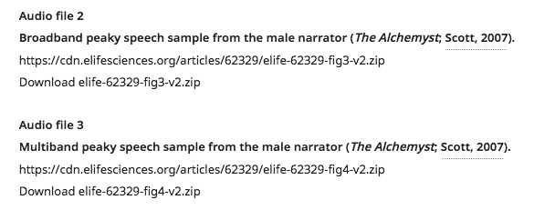


### Reporting standards

Reporting standard documents describe particular protocols and standards that authors followed when they collected their results. These generally take the form of check-lists and are distinct from the [**transparent reporting form**](additional-files.md#transparent-reporting-form) that eLife requests authors complete on submission.

They are labelled as Reporting standard 1, Reporting standard 2, etc. A descriptive title should be provided and they are published in the Additional files section.

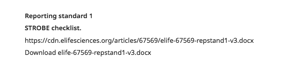


### Source files \(article-level\)

Source data and source code may be provided to allow readers access to the raw data and any scripts that were used to process it. During submission, authors are encouraged to provide these files to aid the reviewers and, in the event of acceptance, to allow other groups to easily reproduce the work.

In the event that the data is too large or extensive to be captured within one or two Excel files, it may be uploaded as a generated dataset to an external repository. In such cases, it should not be listed as a source data file but instead described in the [**Data availability section**](../data-availability.md). See [**below**](additional-files.md#additional-files-hosted-outside-the-article) for how to deal with cases where authors become confused on this point.

Source code may also be uploaded to an external repository, such as GitHub, and this is often preferable to inclusion as an additional file as it permits proper licensing of the code \(see [**Archiving code**](../../../toolkit/archiving-code.md) for more on this\). Again, if source code is hosted away from the article, it should not be listed as a source code file.

Where it is included in an article, source code should be zipped or otherwise compressed so the original filenames are preserved. This is to account for dependency between multiple files \(e.g. where one script includes a call to an accompanying one, though if this is the case the authors will usually have zipped the different files together in one archive\). 

These files are labelled respectively Source data 1, Source data 2, etc. and Source code 1, Source code 2, etc. Each source data and source code file should have a descriptive title and may be accompanied by a legend. They are published in the Additional files section at the back of the article.

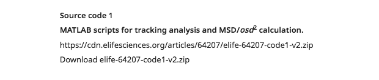


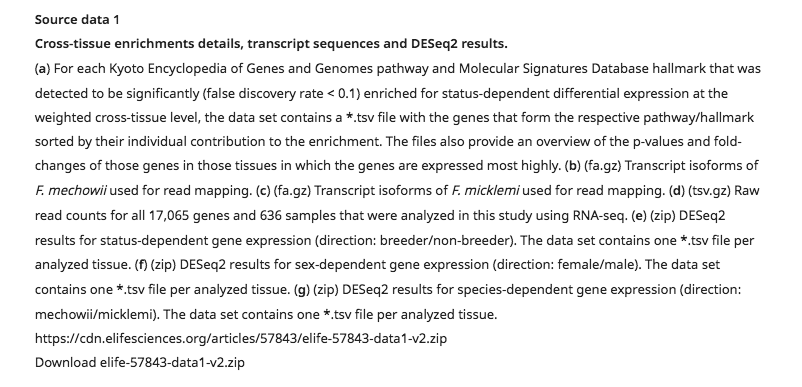

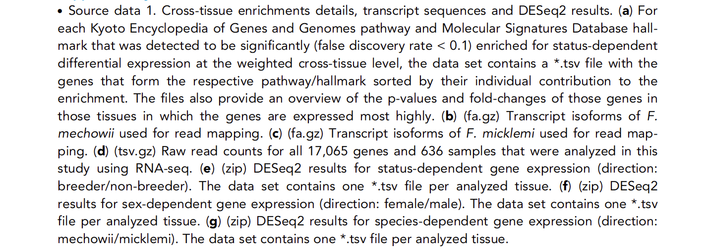

### Source files \(asset-level\)

Figures \(and their supplements\), videos and tables may be accompanied by the source data and/or source code that was used to generate them. The source data will usually consist of tables of raw data but may also include unprocessed images, editable version of charts provided as flat images, or multiple-page documents that cannot be typeset as single figures/figure supplements. Source code will usually comprise scripts that were used to process the data or to generate the graphs shown in figures.

To indicate that they are associated with a display asset, these files will be named Figure 1—source data 1, Figure 2—figure supplement 1—source data 1, Table 3—source data 1, Video 4—source data 1, etc. and Figure 1—source code 1, Figure 2—figure supplement 1—source code 1, Table 3—source code 1, Video 4—source code 1, etc. The numbering restarts for each asset e.g. Figure 1—source data 1, Figure 2—source data 1, Figure 2—source data 2, Figure 3—source data 1. Like article-level source data and source code files, they should have a descriptive title and may be accompanied by a legend. They are displayed in context with the main asset to which they relate.

Asset-level source files may accompany figures, videos and tables in an appendix as well as those in the main text. Schema and Chemical structures, however, cannot support associated source files.

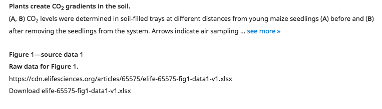

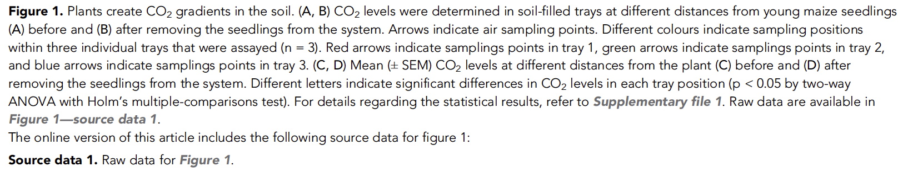


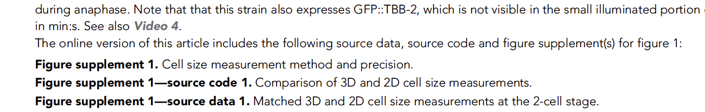

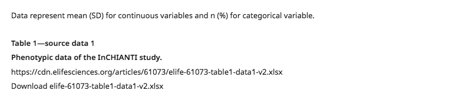

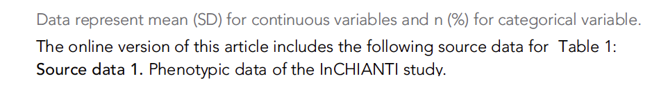

### Supplementary files

When authors have accompanying documents that do not fit into the other categories of additional file, they may include these as supplementary files. These can cover lists of plasmids, operating manuals for resources, experimental design documentation, supporting tables that are not raw data, lists of datasets used, and so on. It is preferable that authors use one of the specific categories of file and include any tables in their main text but eLife accepts that, for a variety of reasons, this may not be possible

Supplementary files are published in the Additional files section and should have a descriptive title. A legend may also be provided with a fuller description of the file contents.

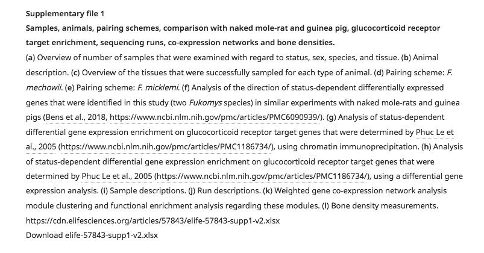

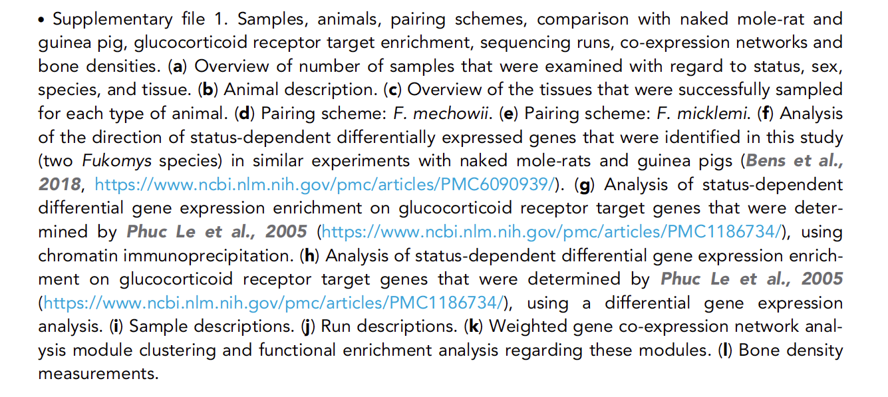

### Transparent reporting form

To facilitate the interpretation and replication of experiments, authors are asked during full submission to provide information relating to sample-size estimation, replicates, and statistical reporting. They are then encouraged to fill out a template form \(available as a [**PDF**](https://elife-cdn.s3.amazonaws.com/xpub/guides/transparent_reporting.pdf) ****or a [**Word file**](https://elife-cdn.s3.amazonaws.com/xpub/guides/transparent_reporting.docx)\) describing the places within their article where this information has been included. This transparent reporting form will be published alongside the final version of record.

It is important to note that while TRFs accompany most articles, they are not mandatory. If, for example, an article does not describe experiments or the analysis of data \(as might be the case in a Tools and Resources submission\), the form would not be needed.

Transparent reporting forms do not require a title or legend and are published at the end of the Additional files section.

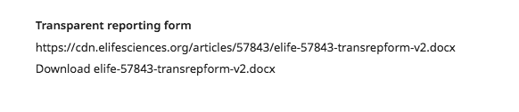


## What needs to be checked?

* Appropriateness of the file-type
* Relationship to asset \(where applicable\)
* Additional files hosted outside the article
* Inappropriate/mistaken inclusion of an additional file
* Corrupted files

### Appropriateness of the file-type

Sometimes, authors will submit files using one additional file type where it would have been better for them to use another. For instance, a Supplementary file 1 with the title 'Source data for first experiment' should really have been Source data 1 and should be updated accordingly. Likewise if a source data file's title or legend indicate it in fact contains code, this should be changed to source code.

Occasionally, this kind of issue can affect transparent reporting forms, with authors uploading them as reporting standards instead. If no title has been provided for a reporting standard, it is worth downloading the file and comparing it to the TRF template mentioned [**above**](additional-files.md#transparent-reporting-form). If it is clearly a transparent reporting form, it should be relabelled accordingly.

### Relationship to asset \(where applicable\)

As indicated by the relevant schematron tests, asset-level source data and code should relate directly to the asset with which it is associated. That is to say, if Figure 1—source data 1 relates only to Figure 1—figure supplement 2, it should be changed to Figure 1—figure supplement 2—source data 1. Likewise, if the title for source data at the article level indicates a relationship to a figure \(e.g. "Source data 1. Original data for Figure 5"\) it should be changed to asset-level source data for that figure.

This being said, when a source file covers multiple assets, it may be more appropriate to leave it as provided. For example, if Figure 2—source data 1 relates to both Figure 2 and Figure 2—figure supplement 1, it should remain associated directly with Figure 2. If a source code file \(at the article level\) relates to multiple figures, it is appropriate as Source code 1 since it would not be accurate to label it as source code for any one of the figures covered.

### Additional files hosted outside the article

Occasionally, authors will list titles and legends in their article file for additional files that have been submitted to databases or other external repositories. This is often because the files were originally provided as part of the submission to eLife but the editorial team encouraged them to be submitted to, for example, Dryad.

Since we cannot list entries for additional files without including an actual file, the titles and legends provided need to be either removed or incorporated into the text wherever is appropriate. The dataset can be added to the main reference list and cited in the context of the related asset. The details from the orphaned legend can then be added to that asset's own legend. For one example, see article [**10.7554/eLife.54350**](https://doi.org/10.7554/eLife.54350).

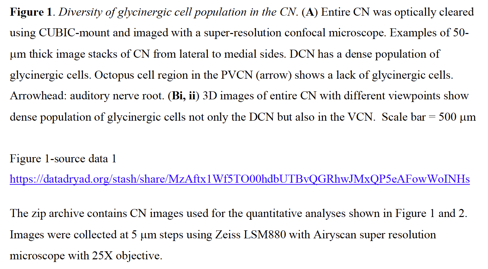


### Inappropriate/mistaken inclusion of an additional file

Another issue that can occur during submission is that authors include additional files that should have been either a 'Related Manuscript File' \(file uploaded for peer review that is not required for final publication\) or a 'LaTex Support File' \(a supporting file for a LaTex submission e.g. a .sty style file or a .bib bibliography file\). Examples of this would include a marked-up PDF of the article showing tracked changes for reviewers, a copy of the article provided for the publication on acceptance, or a .bib file providing the article's reference list. It is usually clear when this is the case as no title or legend will have been provided for the additional file and its author-provided file name will indicate its purpose as one of the given examples. In these situations, the additional file should be removed from the proof.

Where it is unclear whether the file is required for final publication, the author should be asked to double check that it is needed and provide a title where appropriate.

Occasionally, authors will provide a LaTex \(.tex\) file as an additional file, under the assumption that we will typeset it for them. If they do so, they must be asked to provide a PDF version of this file so that it will be available in an easy-to-read format for publication.

* We noticed that you have provided a .tex file as an additional file. Please could you provide a typeset PDF version of this file that we can use for final publication?

One final case of this kind of issue is when authors provide an appendix as a supplementary file. That is, they refer to the file as an appendix in their text or file name and had intended for it to be typeset as such. If this occurs, the file should usually be incorporated into the main text. It may be necessary to query the author for full-resolution images or an editable version of the appendix file. Ideally, the content processors should alert the eLife production team if they encounter an additional file named as an appendix so that this can be sorted out before the proof goes to the authors.

The production team should take care to check the submission system prior to contacting the authors as sometimes there may be reasons it would be more appropriate to include this as an additional file, such as there being complex graphical components that cannot be rendered in an appendix section. Furthermore, the editorial team may have previously requested that the content be moved to an additional file and contradictory requests to the author should be avoided or explained.

### Corrupted files

It should be confirmed as far as possible that all additional files are intact/valid documents. This should be done by downloading the file from the proof \(or staged article\) and seeing if there are any issues when it is opened in the appropriate program. ZIP packages should also be expanded to make sure they are complete. If a file is corrupted, check the submission system to see if this is true of the original and either replace the document with the uncorrupted version or go to the authors to request one.

This should definitely be checked after the article is loaded to the journal website as conversions may occur at this stage. In the unlikely event that it appears the creation of the final package is responsible for the corruption of a file, the content processors should be advised and requested to resolve the issue.

Please note there will be some additional files we cannot check as they are intended for use with propitiatory software we do not have access to. In these cases, there is unfortunately little we can do beyond making sure the files do not have an arbitrarily low size \(e.g. in the range of bytes rather than at least kilobytes\). If this is case, it is possible the file has been corrupted and it should be compared to the originally submitted version.

## Schematron checks

### Content checks

#### supplementary-material-test-2

**Warning**: _XXXXXX is missing a title/caption - is this correct? \(supplementary-material should have a child caption.\)_

**Action**: This warning indicates an additional file does not have a title or legend. The author should be queried to provide one if possible.

* Please provide a single-sentence title \(and legend, if appropriate\) describing the contents of this file.

If this is at the post-author stage, check whether the author was previously queried about this. If they provided a title, add this in. If not, please contact them and reiterate the request. Note that in the case of asset-level source data, it is acceptable to proceed without a title if this is the author's preference as the label \(e.g. Figure 1—source data 1\) is largely descriptive of what the file contains.

#### pre-supplementary-material-test-3

**Warning**: _XXXXXX does not have a title._

**Action**:  This warning indicates, at the pre-author stage, that an additional file does not have a title or legend. The author should be queried to provide one:

* Please provide a single-sentence title \(and legend, if appropriate\) describing the contents of this file.

#### final-supplementary-material-test-3

**Warning**: _XXXXXX doesn't have a title. Is this correct?_

**Action**: This warning indicates, at the post-author stage, that an additional file does not have a title or legend. Check whether the author was previously queried about this. If they provided a title, add this in. If not, please contact them and reiterate the request. Note that in the case of asset-level source data, it is acceptable to proceed without a title if this is the author's preference as the label \(e.g. Figure 1—source data 1\) is largely descriptive of what the file contains.

#### pre-supplementary-material-test-5

**Warning**: _XXXXXX is missing a file \(supplementary-material missing a media element\) - please ensure that this is queried with the author._

**Action**: This warning indicates at the pre-author stage that no file is present for an additional file entry. The author should be queried to provide the missing document.

* Please provide the file for this source data.
* Please provide the file for this source code.
* Please provide the file for this supplementary file.
* Please provide the file for this reporting standard

#### final-supplementary-material-test-5

**Error**: _XXXXXX is missing a file \(supplementary-material must have a media\)._

**Action**: This error indicates no file present for an additional file entry at the post-author stage. Check to see if the file was provided by email or in the notes in the proofing system and, if so, upload it. If no file was provided, query the authors via email.

#### supplementary-material-test-10

**Warning**: _Article contains XXXXXX Please check with eLife - is this actually a reporting standard?_

**Action**: This warning indicates that an additional file is present with the label 'Reporting standard'. Please check that the indicated file is in fact a reporting standard and not a transparent reporting form \(see [**above**](additional-files.md#appropriateness-of-the-file-type)\).

#### source-code-test-1

**Warning**: _XXXXXX has a file which looks like code - XXXXXX, but it's not labelled as code._

**Action**: This warning indicates that an additional file has an extension that may indicate it is source code rather than, for example, data. It currently checks for the following extensions: .m, .py, .lib, .jl, .c, .sh, .for, .cpproj, .ipynb, .mph, .cc, .rmd, .nlogo, .stan, .wrl, .pl, .r, .fas, .ijm, .llb, .ipf, .mdl, .h. If the title and/or legend does not clearly indicate that the file contains data alone, please query the author as to whether it should be changed to source code.

* Should this file be labelled as source code? 

#### supplementary-material-test-11

**Warning**: _XXXXXX has a title 'XXXXXX'. Is it a Key resources table? If so, it should be captured as a table in an appendix for the article._

**Action**: This warning indicates an additional file has a title that indicates it is a key resources table. Previously, if a key resources table was too large to be included in the main text, it would be placed as a supplementary file; however this policy has changed and such tables are now presented as appendices. Please typeset the table on its own within a new appendix and remove the file. If an editable version of the table has not been provided, the eLife production team should contact the authors to request one.

#### source-code-test-2

**Warning**: _Source code files should always be zipped. The file type for XXXXXX is 'XXXXXX'. Please zip this file, and replace it with the zipped version._

**Action**: In order to preserve the original filename for source code, it should be zipped where it is not already compressed into an archive format \(e.g. .zip, .rar, .tar.gz etc.\).

#### fig-data-test-1

**Warning**: _XXXXXX is figure level source data, but contains 1 figure citation which is a link to a figure supplement - should it be figure supplement level source data?_

**Action**: This warning indicates the description for a source data file associated with a main figure contains a citation to a figure supplement. In cases where the source data title or legend mentions both the main figure and one or more figure supplements \(e.g. "Source data for Figure 3A and Figure 3—figure supplement 1"\) this warning can be ignored. In cases where only a figure supplement is mentioned \(e.g. "Source data for Figure 4—figure supplement 1D"\) the source data should be moved so that it is associated with the cited figure supplement.

In cases where the source data title or legend mentions multiple figure supplements \(e.g. Source data for Figure 1–figure supplements 1–4"\) it is appropriate to leave it associated with the main figure \(Figure 1 in this example\) since it wouldn't be correct to associate it with any single figure supplement.

#### fig-code-test-1

**Warning**: _XXXXXX is figure level source code, but contains 1 figure citation which is a link to a figure supplement - should it be figure supplement level source code?_

**Action**: This warning indicates the description for a source code file associated with a main figure contains a citation to a figure supplement. In cases where the source code title or legend mentions both the main figure and one or more figure supplements \(e.g. "Source code for Figure 3A and Figure 3—figure supplement 1"\) this warning can be ignored. In cases where only a figure supplement is mentioned \(e.g. "Source code for Figure 4—figure supplement 1D"\) the source code should be moved so that it is associated with the cited figure supplement.

In cases where the source code title or legend mentions multiple figure supplements \(e.g. Source code for Figure 1–figure supplements 1–4"\) it is appropriate to leave it associated with the main figure \(Figure 1 in this example\) since it wouldn't be correct to associate it with any single figure supplement.

#### supplementary-material-title-test-1

**Warning**: _'XXXXXX' appears to have a title which is the beginning of a caption. Is this correct?_

**Action**: This warning will fire if a letter in brackets is present at the start of a file's title, e.g. "\(a\) Overview of number of samples . . ." This usually means that no actual title has been provided by the authors and the first line of the legend \(usually a definition of part A/a if the file has multiple parts\) has been picked up as the title. If this warning appears pre-author, please ask the author to provide an overall title:

* Please provide a single-sentence title describing the contents of this file.

If this happens post-author, the author should be contacted by email to provide an overall title.

#### supplementary-material-title-test-2

**Error**: _title for XXXXXX must end with a full stop._

**Action**: This error indicates that a full stop is missing from the end of a file's title, or that the title ends with another character such as a space. If no full stop is present, one should be added. If an extra space is present after a full stop at the end of the title, this should be removed.

#### supplementary-material-title-test-3

**Warning**: _title for XXXXXX ends with 'vs.', which indicates that the title sentence may be split across title and caption._

**Action**: The authors may include the term 'vs.' in a title for an additional file, which can result in it being split on the full stop for this abbreviation rather than the actual end of the title. So, for example, "Results of experiment 1 vs. experiment 2." may end up being truncated to "Results of experiment 1 vs.", with the rest of the title placed at the start of the legend. This should be fixed by moving the remainder text up to complete the title; refer back to the original article file if required to determine the full title.

#### supplementary-material-title-test-4

**Error**: _title for XXXXXX begins with a space, which is not allowed._

**Action**: This error indicates that the first character in a file's title is a space. This should be removed.

#### supplementary-material-title-test-5

**Warning**: _title for XXXXXX is 'XXXXXX' - should 'resource' be plural, i.e. 'resources'?._

**Action**:

#### supplementary-material-title-test-6

**Warning**: _title for XXXXXX is 'XXXXXX', which suggest the label should be in the format Supplementary file X instead._

**Action**:

#### supplementary-material-title-test-7

**Warning**: _title for XXXXXX is longer than 250 characters. Is it a caption instead?_

**Action**: This warning fires if a title exceeds 250 characters. This might indicated that it should be part of the caption. 

#### supplementary-material-title-test-8

**Warning**: _title for XXXXXX contains XXXXXX sentences. Should the sentence\(s\) after the first be moved into the caption? Or is the title itself a caption \(in which case, please ask the authors for a title\)?_

**Action**: This warning indicates that the title for an additional file contains multiple fullstops.

### Structure checks

#### supplementary-material-test-1

**Error**: _supplementary-material must have a label._

**Action**: This error indicates that no label is present for an additional file. This will need the production vendor's support team to fix as it means the element `<label>` is missing from the XML.

#### supplementary-material-test-6

**Error**: _supplementary-material label \(XXXXXX\) does not conform to eLife's usual label format._

**Action**: This error indicates an additional file label does not match the usual pattern of Audio file X, Reporting standard X, Source data X, Source code X, Figure X—source data Y, Figure X—source code Y, Supplementary file X, or Transparent reporting form. The label should be corrected to match the correct format for the type of file being indicated. This may require support team intervention.

#### supplementary-material-test-8

**Error**: _XXXXXX has an article level label but it is not captured in the additional files section - This must be incorrect._

**Action**: This error indicates an additional file associated with an asset has a label in the format for an article-level file, e.g. Audio file X, Reporting standard X, Source data X, Source code X, Supplementary file X, or Transparent reporting form. It should either be moved to the Additional files section, or the label should be corrected to indicate the file's relationship to a main asset.

#### supplementary-material-test-7

**Error**: _supplementary-material in additional files sections cannot have the a media element with the attribute mimetype='video'. This should be mimetype='application'_

**Action**: This error indicates an additional file has been given the attribute `mimetype='video'`. This is incorrect. Even if a video file is included as, for example, a supplementary file, it should be assigned a mimetype of `'application'`. This will require support team intervention to fix.

#### supplementary-material-test-9

**Error**: _XXXXXX has XXXXXX media elements which is incorrect._

**Action**: Additional files should have one and only one &lt;media&gt; element. This error indicates that zero or more &lt;media&gt; elements are present for a file. If it is zero, the missing file should be requested from the author:

* Please provide the file for this source data.
* Please provide the file for this source code.
* Please provide the file for this supplementary file.
* Please provide the file for this reporting standard

If it is more than one, this will need support intervention to remove the extra elements.

#### back-supplementary-file-position

**Error**: _XXXXXX id ends with XXXXXX, but it is placed XXXXXX. Either it is mislabelled, the id is incorrect, or it should be moved to a different position._

**Action**: This error indicates the labelling for a supplementary file does not match the sequence in which the other files of that type have been placed. An example would be Supplementary file 1, Supplementary file 3, Supplementary file 2. The production vendors will need to reorder the files into the correct sequence or correct the labelling. The eLife production team may need to confirm that correct sequence by checking the submission system or querying the author if it is unclear where the error lies.

#### back-supplementary-file-id

**Error**: _The id \(XXXXXX\) for XXXXXX is not in the correct format. Supplementary files need to have ids in the format 'supp0'._

**Action**: This error indicates a supplementary file has an ID that does not conform to the standard format 'supp0'. That is, Supplementary file 1 should usually have an ID 'supp1', Supplementary file 2 should usually have an ID 'supp2' and so on. This will need to be corrected by the production vendor's support team.

#### back-source-data-position

**Error**: _XXXXXX id ends with XXXXXX, but it is placed XXXXXX. Either it is mislabelled, the id is incorrect, or it should be moved to a different position._

**Action**: This error indicates the labelling for an article-level source data file does not match the sequence in which the other files of that type have been placed. An example would be Source data 1, Source data 3, Source data 2. The production vendors will need to reorder the files into the correct sequence. The eLife production team may need to confirm that correct sequence by checking the submission system or querying the author if it is unclear where the error lies.

#### back-source-data-id

**Error**: _The id \(XXXXXX\) for XXXXXX is not in the correct format. Source data need to have ids in the format 'sdata0'._

**Action**: This error indicates an article-level source data file has an ID that does not conform to the standard format 'sdata0'. That is, Source data 1 should have an ID 'sdata1', Source data 2 should have an ID 'sdata2', and so on. This will need to be corrected by the production vendor's support team.

#### back-source-code-position

**Error**: _XXXXXX id ends with XXXXXX, but it is placed XXXXXX. Either it is mislabelled, the id is incorrect, or it should be moved to a different position._

**Action**: This error indicates the labelling for an article-level source code file does not match the sequence in which the other files of that type have been placed. An example would be Source code 1, Source code 3, Source code 2. The production vendors will need to reorder the files into the correct sequence. The eLife production team may need to confirm that correct sequence by checking the submission system or querying the author if it is unclear where the error lies.

#### back-source-code-id

**Error**: _The id \(XXXXXX\) for XXXXXX is not in the correct format. Source code needs to have ids in the format 'scode0'._

**Action**: This error indicates an article-level source code file has an ID that does not conform to the standard format 'scode0'. That is, Source code 1 should have an ID 'scode1', Source code 2 should have an ID 'scode2', and so on. This will need to be corrected by the production vendor's support team.

#### fig-data-test-2

**Error**: _'XXXXXX' ends with XXXXXX, but it is placed XXXXXX. Either it is misnumbered or it should be moved to a different position._

**Action**: This error indicates the labelling for a figure-level source data file does not match the sequence in which the other files of that type have been placed. An example would be Figure 1—source data 1, Figure 1—source data 3, Figure 1—source data 2. The production vendors will need to reorder the files into the correct sequence. The eLife production team may need to confirm that correct sequence by checking the submission system or querying the author if it is unclear where the error lies.

#### fig-data-id

**Error**: _The id for figure level source data must be the id of its ancestor fig, followed by 'sdata', followed by its position relative to other source data for the same figure. The id for XXXXXX, 'XXXXXX' is not in this format. It should be 'XXXXXX' instead._

**Action**: This error indicates a figure-level source data file has an ID that does not conform to the standard format 'fig0sdata0'. That is, Figure 1—source data 1 should have an ID 'fig1sdata1', Figure 2—source data 1 should have an ID 'fig2sdata1', Figure 2—source data 2 should have an ID 'fig2sdata2', and so on. This will need to be corrected by the production vendor's support team.

#### fig-code-test-2

**Error**: _'XXXXXX' ends with XXXXXX, but it is placed XXXXXX. Either it is misnumbered or it should be moved to a different position._

**Action:** This error indicates the labelling for a figure-level source code file does not match the sequence in which the other files of that type have been placed. An example would be Figure 1—source code 1, Figure 1—source code 3, Figure 1—source code 2. The production vendors will need to reorder the files into the correct sequence. The eLife production team may need to confirm that correct sequence by checking the submission system or querying the author if it is unclear where the error lies.

#### fig-code-id

**Error**: _The id for figure level source code must be the id of its ancestor fig, followed by 'scode', followed by its position relative to other source data for the same figure. The id for XXXXXX, 'XXXXXX' is not in this format. It should be 'XXXXXX' instead._

**Action**: This error indicates a figure-level source code file has an ID that does not conform to the standard format 'fig0sdata0'. That is, Figure 1—source code 1 should have an ID 'fig1scode1', Figure 2—source code 1 should have an ID 'fig2scode1', Figure 2—source code 2 should have an ID 'fig2scode2', and so on. This will need to be corrected by the production vendor's support team.

#### vid-data-test-2

**Error**: 'XXXXXX' ends with XXXXXX, but it is placed XXXXXX. Either it is misnumbered or it should be moved to a different position.

**Action:** This error indicates the labelling for a video-level source data file does not match the sequence in which the other files of that type have been placed. An example would be Video 1—source data 1, Video 1—source data 3, Video 1—source data 2. The production vendors will need to reorder the files into the correct sequence. The eLife production team may need to confirm that correct sequence by checking the submission system or querying the author if it is unclear where the error lies.

#### vid-data-id

**Error**: _The id for video level source data must be the id of its ancestor video, followed by 'sdata', followed by its position relative to other source data for the same video. The id for XXXXXX, 'XXXXXX' is not in this format. It should be 'XXXXXX' instead._

**Action**: This error indicates a video-level source data file has an ID that does not conform to the standard format 'video0sdata0'. That is, Video 1—source data 1 should have an ID 'video1sdata1', Video 2—source data 1 should have an ID 'video2sdata1', Video 2—source data 2 should have an ID 'video2sdata2', and so on. This will need to be corrected by the production vendor's support team.

#### vid-code-test-2

**Error**: _'XXXXXX' ends with XXXXXX, but it is placed XXXXXX. Either it is misnumbered or it should be moved to a different position._

**Action:** This error indicates the labelling for a video-level source code file does not match the sequence in which the other files of that type have been placed. An example would be Video 1—source code 1, Video 1—source code 3, Video 1—source code 2. The production vendors will need to reorder the files into the correct sequence. The eLife production team may need to confirm that correct sequence by checking the submission system or querying the author if it is unclear where the error lies.

#### vid-code-id

**Error**: _The id for video level source code must be the id of its ancestor video, followed by 'scode', followed by its position relative to other source data for the same video. The id for XXXXXX, 'XXXXXX' is not in this format. It should be 'XXXXXX' instead._

**Action**: This error indicates a video-level source data file has an ID that does not conform to the standard format 'video0sdata0'. That is, Video 1—source code 1 should have an ID 'video1scode1', Video 2—source code 1 should have an ID 'video2scode1', Video 2—source code 2 should have an ID 'video2scode2', and so on. This will need to be corrected by the production vendor's support team.

#### table-data-test-2

**Error**: _'XXXXXX' ends with XXXXXX, but it is placed XXXXXX. Either it is misnumbered or it should be moved to a different position._

**Action:** This error indicates the labelling for a table-level source data file does not match the sequence in which the other files of that type have been placed. An example would be Table 1—source data 1, Table 1—source data 3, Table 1—source data 2. The production vendors will need to reorder the files into the correct sequence. The eLife production team may need to confirm that correct sequence by checking the submission system or querying the author if it is unclear where the error lies.

#### table-data-id

**Error**: _The id for table level source data must be the id of its ancestor table-wrap, followed by 'sdata', followed by its position relative to other source data for the same table. The id for XXXXXX, 'XXXXXX' is not in this format. It should be 'XXXXXX' instead._

**Action**: This error indicates a table-level source data file has an ID that does not conform to the standard format 'table0sdata0'. That is, Table 1—source data 1 should have an ID 'table1sdata1', Table 2—source data 1 should have an ID 'table2sdata1', Table 2—source data 2 should have an ID 'table2sdata2', and so on. This will need to be corrected by the production vendor's support team.:

#### table-code-test-2

**Error**: _'XXXXXX' ends with XXXXXX, but it is placed XXXXXX. Either it is misnumbered or it should be moved to a different position._

**Action:** This error indicates the labelling for a table-level source code file does not match the sequence in which the other files of that type have been placed. An example would be Table 1—source code 1, Table 1—source code 3, Table 1—source code 2. The production vendors will need to reorder the files into the correct sequence. The eLife production team may need to confirm that correct sequence by checking the submission system or querying the author if it is unclear where the error lies.

#### table-code-id

**Error**: _The id for table level source code must be the id of its ancestor table, followed by 'scode', followed by its position relative to other source data for the same table. The id for XXXXXX, 'XXXXXX' is not in this format. It should be 'XXXXXX' instead._

**Action**: This error indicates a table-level source data file has an ID that does not conform to the standard format 'table0sdata0'. That is, Table 1—source code 1 should have an ID 'table1scode1', Table 2—source code 1 should have an ID 'table2scode1', Table 2—source code 2 should have an ID 'table2scode2', and so on. This will need to be corrected by the production vendor's support team.

#### supplementary-material-child-conformance

**Error**: _XXXXXX is not allowed as a child of supplementary-material._

**Action**: This error indicates that a disallowed element has been included within an additional file's XML \(`<supplementary-material>`\). The only permitted child elements are as follows: `<label>, <caption>, <media>, <permissions>`. If another element is present, it should be removed. This will likely need intervention by the support team.

## XML

A reporting standard file in the additional files section.

```markup
<sec id="s5" sec-type="supplementary-material">
    <title>Additional files</title>
    <supplementary-material id="repstand1">
        <label>Reporting standard 1.</label>
        <caption>
            <title>STROBE checklist.</title>
        </caption>
        <media mime-subtype="docx" mimetype="application"
        xlink:href="elife-67569-repstand1-v3.docx"/>
    </supplementary-material>
</sec>
```

A transparent reporting form in the additional files section. Note there is no caption, just a label.

```markup
<sec id="s5" sec-type="supplementary-material">
    <supplementary-material id="transrepform">
        <label>Transparent reporting form</label>
        <media mime-subtype="pdf" mimetype="application"
        xlink:href="elife-67569-transrepform-v3.pdf"/>
    </supplementary-material>
</sec>
```

A source code file in the additional files section.

```markup
<sec id="s6" sec-type="supplementary-material">
    <title>Additional files</title>
    <supplementary-material id="scode1">
        <label>Source code 1.</label>
        <caption>
            <title>MATLAB scripts for tracking analysis and MSD/
            <italic>osd</italic><sup>2</sup> calculation.</title>
        </caption>
        <media mime-subtype="zip" mimetype="application"
        xlink:href="elife-64207-code1-v2.zip"/>
    </supplementary-material>
</sec>
```

A source data file in the additional files section with a long legend.

```markup
<sec id="s6" sec-type="supplementary-material">
    <title>Additional files</title>
    <supplementary-material id="sdata1">
        <label>Source data 1.</label>
        <caption>
            <title>Cross-tissue enrichments details, transcript sequences and DESeq2 results.</title>
            <p>(<bold>a</bold>) For each Kyoto Encyclopedia of Genes and Genomes pathway
            and Molecular Signatures Database hallmark that was detected to be
            significantly (false discovery rate &lt; 0.1) enriched for status-dependent
            differential expression at the weighted cross-tissue level, the data set
            contains a *.tsv file with the genes that form the respective pathway/hallmark
            sorted by their individual contribution to the enrichment. The files also
            provide an overview of the p-values and fold-changes of those genes in those
            tissues in which the genes are expressed most highly. (<bold>b</bold>) (fa.gz)
            Transcript isoforms of <italic>F. mechowii</italic> used for read mapping.
            (<bold>c</bold>) (fa.gz) Transcript isoforms of <italic>F. micklemi</italic>
            used for read mapping. (<bold>d</bold>) (tsv.gz) Raw read counts for all 17,065
            genes and 636 samples that were analyzed in this study using RNA-seq. (<bold>e</bold>)
            (zip) DESeq2 results for status-dependent gene expression (direction: breeder/
            non-breeder). The data set contains one *.tsv file per analyzed tissue. (<bold>f</bold>)
            (zip) DESeq2 results for sex-dependent gene expression (direction: female/male).
            The data set contains one *.tsv file per analyzed tissue. (<bold>g</bold>)
            (zip) DESeq2 results for species-dependent gene expression (direction:
            mechowii/micklemi). The data set contains one *.tsv file per analyzed
            tissue.</p>
        </caption>
        <media mime-subtype="zip" mimetype="application"
        xlink:href="elife-57843-data1-v2.zip"/>
    </supplementary-material>
</sec>
```

Supplementary files in the additional files section.

```markup
<sec id="s6" sec-type="supplementary-material">
    <title>Additional files</title>
    <supplementary-material id="supp1">
        <label>Supplementary file 1.</label>
        <caption>
            <title>Table of RNAseq (Tab 1) and GO Term analysis (Tab 2) for Sun dKO versus
            WT mouse keratinocytes grown in low calcium media (undifferentiated).</title>
        </caption>
        <media mime-subtype="xlsx" mimetype="application"
        xlink:href="elife-58541-supp1-v2.xlsx"/>
    </supplementary-material>
    <supplementary-material id="supp2">
        <label>Supplementary file 2.</label>
        <caption>
            <title>Table of RNAseq (Tab 1) and GO Term analysis (Tab 2) for Sun dKO versus
            WT mouse keratinocytes grown in high calcium media (differentiated).</title>
        </caption>
        <media mime-subtype="xlsx" mimetype="application"
        xlink:href="elife-58541-supp2-v2.xlsx"/>
    </supplementary-material>
</sec>
```

Supplementary file followed by audio files in the additional files section. Note that the IDs for these follow the same pattern at present, so Audio file 1 is supp2, Audio file 2 is supp 3 etc.

```markup
<sec id="s6" sec-type="supplementary-material">
    <title>Additional files</title>
    <supplementary-material id="supp1">
        <label>Supplementary file 1.</label>
        <caption>
            <title>Details of statistical models.</title>
        </caption>
        <media mime-subtype="docx" mimetype="application"
        xlink:href="elife-62329-supp1-v2.docx"/>
    </supplementary-material>
    <supplementary-material id="supp2">
        <label>Audio file 1.</label>
        <caption>
            <title>Unaltered speech sample from the male narrator (<italic>The
            Alchemyst</italic>; <xref ref-type="bibr" rid="bib56">Scott, 2007</xref>).</title>
        </caption>
        <media mime-subtype="zip" mimetype="application"
        xlink:href="elife-62329-fig2-v2.zip"/>
    </supplementary-material>
    <supplementary-material id="supp3">
        <label>Audio file 2.</label>
        <caption>
            <title>Broadband peaky speech sample from the male narrator (<italic>The
            Alchemyst</italic>; <xref ref-type="bibr" rid="bib56">Scott, 2007</xref>).</title>
        </caption>
        <media mime-subtype="zip" mimetype="application"
        xlink:href="elife-62329-fig3-v2.zip"/>
    </supplementary-material>
</sec>
```


