# Asset citations

## What is an asset citation?

An asset citation is an in-text citation for an [**asset**](./#main-text-assets) that is part of an article. This is in contrast to [**reference citations**](../reference-citations.md). These are rendered as links in the final article. Clicking them will take the reader to the relevant asset in the PDF and HTML view.

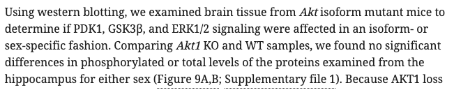

Asset citations may appear inside \(see above\) or outside \(see below\) brackets. 

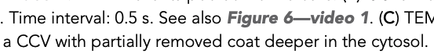

Where multiple assets are cited in one set of brackets, each citation should be separated from the next by a comma or semi-colon followed by a space \(depending on context and what the author has provided\).  If several assets are cited and they run on, an en dash should be used and the citation text should be pluralised, for example, citations of 'Figure 1, Figure 2, and Figure 3' should become 'Figures 1–3'. 

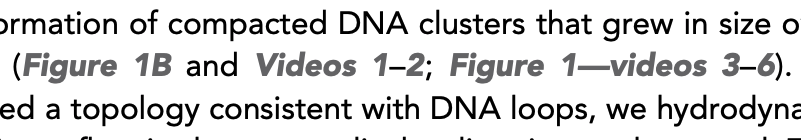

The table below outlines which assets require in-text citations:

| **Asset** | **In-text citation** |
| :--- | :--- |
| Figures, videos, animations and numbered tables | Mandatory |
| In-line tables | Optional |
| Supplementary figures | Optional |
| Figure videos | Optional |
| Figure/video/animation/table source data or code | Optional |
| Source code, source data, supplementary files | Optional |
| Equations | Optional |
| Chemical structures | Optional |
| Schemes | Optional |

## What needs to be checked?

Most of the major possible issues with asset citations will be picked up by schematron rules. It is, however, important to be aware of the style rules relating to the following when adding or removing asset citations:

* Citation order
* Citing asset parts 
* Identifying unconverted citations

Examples of these can be found in the next section. 

## Examples

### Citation order

Asset placement is determined by first live citation. Main figures and videos, and tables should be placed after their first citation. If they are cited out of order, this should be queried with the authors. This is covered further on the [**tables**](tables.md#tables-cited-out-of-sequence) and [**figures**](figures.md#pre-fig-specific-test-2) page. If these have not been cited, the following query should be left:

* Please provide an in-text citation for this XXXXXX.

### Citing asset parts

Some assets can have parts which may be included in the citation link text. For example, figures, tables and supplementary files may have multiple parts. If several parts of an asset are cited and the letters run on an en dash should be used - for example, Figure 1A–D. 

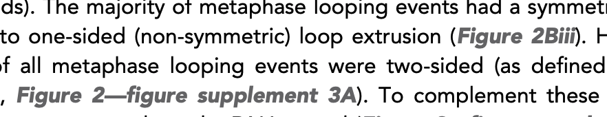

If several parts are cited but they don’t run on, the part labels should be formatted as a comma-separated list - for example, Figure 1A, C, and E. 

Supplementary files with parts should have those parts included in the link text. In the example below, 'table 1' should be included in the citation link and the hyphen should be changed to an em-dash to match eLife's style.

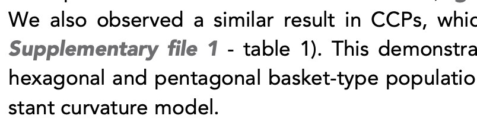

### Identifying unconverted citations

Occasionally, citations may be intentionally left unlinked to maintain the required asset order. In most other cases however, all asset citations should be linked. Sometimes, authors will use 'Fig' or 'Supp file' which may result in these citations being missed - these should be checked for and converted to eLife style at pre-editing. If these are still present aNote however, that authors may be citing assets from other publications, for example “Figure 1 in Smith et al., 1990”. See more [**here**](figures.md#figures-that-havent-been-provided). 

## Schematron checks

### Content checks

These checks relate to the content of asset citations. X or XXXXXX refers to quoted text which will change depending on the article.

#### fig-xref-conformity-1

**Error:** _XXXXXX - figure citation does not contain any numbers which must be incorrect._

**Action:** This error will fire if a figure citation does not include any numbers e.g. 'Figure A'. Compare with the original submission to see what the correct citation should be and try deleting and re-adding the correct citation. If this doesn't work, Exeter will need to update. 

#### fig-xref-conformity-2

**Error:** _XXXXXX - figure citation does not appear to link to the same place as the content of the citation suggests it should._

**Action:** This error will fire if a figure citation links to a different figure from the citation text e.g. if Figure 2 links to Figure 3:

```text
<xref ref-type="fig" rid="fig3">Figure 2</xref>
```

Check what the correct citation should be by checking the original submission and any edits the authors have tried to make. If link is incorrect, try to add the citation again through Kriya - if this doesn't work, Exeter will need to fix this. If it is unclear from the original submission and author edits what the correct citation is supposed to be, query the authors for this \(replace XXXXXX with 'figure'\):

* Please confirm which XXXXXX this refers to, or confirm that this citation refers to another article.

#### fig-xref-conformity-3

**Warning:** _XXXXXX - figure citation does not appear to link to the same place as the content of the citation suggests it should._

**Action:** This warning will fire if a figure citation links to a different figure from what the citation text suggests it should link to e.g. if the link text says 'Figure 21' but links to Figure 2. Note, fig-xref-conformity-2 would not fire in this case, because the number 2 is contained in the link text. 

```text
<xref ref-type="fig" rid="fig2">Figure 21</xref>
```

Check what the correct citation should be by checking the original submission and any edits the authors have tried to make. If link is incorrect, try to add the citation again through Kriya - if this doesn't work, Exeter will need to fix this. If it is unclear from the original submission and author edits what the correct citation is supposed to be, query the authors for this \(replace XXXXXX with 'figure'\):

* Please confirm which XXXXXX this refers to, or confirm that this citation refers to another article.

This will also fire if the link text refers to part labels, for example 'Figure 4E2':

```text
<xref ref-type="fig" rid="fig4">Figure 4E2</xref>
```

As long as the citation links to the correct figure \(Figure 4 in this case\), this warning can be ignored.

#### fig-xref-conformity-4

**Error:** _XXXXXX - figure citation links to a figure, but it contains the string 'supplement'. It cannot be correct._

**Action:** This error will fire if the text of a figure citation includes 'supplement' but links to a main figure e.g. if Figure 1_—_figure supplement 1 links to Figure 1. Try to add the citation again through Kriya - if this doesn't work, Exeter will need to fix this.

#### fig-xref-conformity-5

**Warning:** _figure citation stands alone, contains the text XXXXXX, and links to a figure supplement, but it does not contain the string 'supplement'. Is it correct? Preceding text - 'XXXXXX'_

**Action:** This warning will fire if a figure citation links to a figure supplement but the citation text doesn't include the word 'supplement'. This is ok to leave if, for example the citation text says 'Figure 1_—_figure supplements 2, 3' and links correctly to both Figure 1_—_figure supplement 2 and Figure 1_—_figure supplement 3: 

```text
<xref ref-type="fig" rid="fig1s2">Figure 1-figure supplements 2,</xref><xref 
ref-type="fig" rid="fig1s3">3</xref>
```

However, if the citation text says 'Figure 1' but links to Figure 1_—_figure supplement 1, this will need to be corrected:

```text
<xref ref-type="fig" rid="fig1s1">Figure 1</xref>
```

Try to add the citation again through Kriya - if this doesn't work, Exeter will need to fix this.

#### fig-xref-conformity-6

**Error:** _figure citation contains the text XXXXXX but links to a figure supplement with the id XXXXXX which cannot be correct._

**Action:** This error will fire if a figure citation links to the wrong figure supplement e.g. if the citation 'Figure 1_—_figure supplement 1' links to Figure 1_—_figure supplement 2. Try to add the citation again through Kriya - if this doesn't work, Exeter will need to fix this.

#### vid-xref-conformity-1

**Error:** _XXXXXX - video citation does not contain any numbers which must be incorrect._

**Action:** This error will fire if a video citation does not include any numbers e.g. 'Video A'. Compare with the original submission to see what the correct citation should be and try deleting and re-adding the correct citation but if this doesn't work, Exeter will need to update.

#### vid-xref-conformity-2

**Error**: _video citation does not match the video that it links to. Target video label number is XXXXXX, but that number is not in the citation text - XXXXXX._

**Action:** This error will fire if a figure citation links to a different figure from the citation text e.g. if Video 1 links to Video 2:

```text
<xref ref-type="video" rid="video2">Video 1</xref>
```

Check what the correct citation should be by checking the original submission and any edits the authors have tried to make. If link is incorrect, try to add the citation again through Kriya - if this doesn't work, Exeter will need to fix this. If it is unclear from the original submission and author edits what the correct citation is supposed to be, query the authors for this \(replace XXXXXX with 'video'\):

* Please confirm which XXXXXX this refers to, or confirm that this citation refers to another article.

#### fig-xref-test-2

**Warning:** _There is no space between citation and the preceding text - XXXXXX - Is this correct?_

**Action:** This warning will fire if there is no space between a figure citation and the text before it, for example 'SeeFigure 2', add a space between the citation and the preceding text. If the text is 'See Figures 2,3' this warning will fire for the citation of Figure 3, however this is ok to leave.

```text
See <xref ref-type="fig" rid="fig2">Figures 2</xref>,<xref ref-type="fig" 
rid="fig3">3</xref>
```

#### fig-xref-test-3

**Warning:** _There is no space between citation and the following text - XXXXXX - Is this correct?_

**Action:** This warning will fire if there is no space between a figure citation and the text after it, for example 'See Figure 2for.' Add a space between the citation and the following text. This will also fire if part labels \(or sub-part labels e.g. Aii\) aren't captured as part of the citation link, for example:

```text
<xref ref-type="fig" rid="fig2">Figure 2</xref>Aii
```

If the text is 'See Figures 2,3' this warning will fire for the citation of Figure 2, however this is ok to leave.

```text
See <xref ref-type="fig" rid="fig2">Figures 2</xref>,<xref ref-type="fig" 
rid="fig3">3</xref>
```

#### fig-xref-test-4

**Warning:** _XXXXXX - Figure citation is in the caption of the figure that it links to. Is it correct or necessary?_

**Action:** If the figure citation refers to a figure from another paper, this needs to be changed to plain text. If it is simply referring to a panel in the same figure, it can be changed to a part label. 

For example, if the following text is in the caption of Figure 2:

* "See Figure 2A \(Smith et al., 2020\)." The citation 'Figure 2A' should be changed to plain text as it refers to a figure from another article.
* "\(B\) Further analysis of samples in Figure 2A." The 'Figure 2A' in this example should be changed to '\(A\)' as it is referring to a part label in the same figure.

If the citation doesn't refer to a part label, again check if it refers to a figure from another paper - if so, change it to plain text. If the authors are simply referring to the figure in general, the citation should be unlinked. For example, [**in 63042**,](https://elifesciences.org/articles/63042#fig5) there was a link to Figure 5 in the caption of Figure 5: 

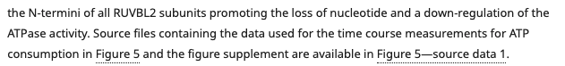

This should have been unlinked. 

If the figure has been incorrectly captured, for example, if \(in the caption of Figure 4\) the authors wrote 'Figure 1 - Supplemental Figure 4' and only 'Figure 4' has been linked, this citation needs to be corrected \(in this example, to Figure 1_—_figure supplement 4\).

If it is not possible to tell whether the authors are citing a figure from the same paper or a different one, please leave the following query \(replace XXXXXX with 'figure'\):

* Please confirm which XXXXXX this refers to, or confirm that this citation refers to another article.

The citation will then need to be dealt with depending on the author's response. 

#### fig-xref-test-5

**Error:** _XXXXXX - Figure citation refers to a figure from a different paper, and therefore must be unlinked._

**Action:** This error will fire if a figure citation appears before a reference with 'in', 'from' or 'of' in between  e.g. 'See Figure 1 from Smith et al., 1992' \(see more [**here**](figures.md#figures-that-havent-been-provided)\). This figure citation needs to be changed to plain text as it refers to a figure from another source. 

#### fig-xref-test-6

**Error:** _citation is preceded by a letter or number immediately followed by '\('. Is there a space missing before the '\('? - 'XXXXXX'._

**Action:** This error will fire if a figure citation appears after a letter or number immediately followed by '\('. If there is a missing space, this should be added in, for example in 'DNA\(Figure 2\).' 

#### fig-xref-test-7

**Error:** _citation is followed by a '\)' which in turn is immediately followed by a letter or number. Is there a space missing after the '\)'? - 'XXXXXX'._

**Action:** This error will fire if a figure citation is followed by a '\)' and a letter or number immediately after. If there is a missing space, this should be added in, for example in '\(Figure 2\)DNA.' 

#### fig-xref-test-8

**Warning:** _Figure citation is preceded by 'their'. Does this refer to a figure in other content \(and as such should be captured as plain text\)? - 'XXXXXX'._

**Action:** This warning will fire if a figure citation is preceded by the word _'_their', for example 'Smith et al., 1992, their Figure 2.' As this is referring to Figure 2 in a different paper, this citation should be unlinked. If it isn't possible to tell from the context whether the authors are referring to a figure in a different paper, a query should be left \(replace XXXXXX with 'figure'\):

* Please confirm which XXXXXX this refers to, or confirm that this citation refers to another article.

#### fig-xref-test-9

**Warning:** _Is this figure citation a reference to a figure from other content \(and as such should be captured instead as plain text\)? - XXXXXX'._

**Action:** This warning will fire if a figure citation is followed by the word _'_of', for example 'Figure 2 of Smith et al., 1992.' As this is referring to Figure 2 in a different paper, this citation should be unlinked. If it isn't possible to tell from the context whether the authors are referring to a figure in a different paper, a query should be left - see more \(replace XXXXXX with 'figure'\):

* Please confirm which XXXXXX this refers to, or confirm that this citation refers to another article.

#### fig-xref-test-10

**Error:** _Incomplete citation. Figure citation is followed by text which suggests it should instead be a link to a Figure supplement - XXXXXX'._

**Action:** This error will fire if a figure citation is __followed by text which suggests it should be a link to a figure supplement - for example, if the linked citation text is 'Figure 1' but it is followed by '—figure supplement 1', 'figure supplement 1', or ', figure supplement 1' in plain text. In this example, a citation to Figure 1—figure supplement 1 should replace the citation for Figure 1.

#### fig-xref-test-11

**Error:** _Incomplete citation. Figure citation is followed by text which suggests it should instead be a link to a video supplement - XXXXXX'._

**Action:** This error will fire if a figure citation is __followed by text which suggests it should be a link to a figure video - for example, if the linked citation text is 'Figure 1' but it is followed by '—video 1', 'video 1', or ', video 1' in plain text. In this example, a citation to Figure 1—video 1 should replace the citation for Figure 1.

#### fig-xref-test-12

**Warning:** _Incomplete citation. Figure citation is followed by text which suggests it should instead be a link to source data or code - XXXXXX'._

**Action:** This warning will fire if a figure citation is __followed by text which suggests it should be a link to a source data or code supplement - for example, if the linked citation text is 'Figure 1' but it is followed by '—source code 1', 'source code 1' or ', source code 1',  \(or source data\) in plain text. In this example, a citation to Figure 1—source code 1 or Figure 1—source data 1 should replace the citation for Figure 1.

#### fig-xref-test-13

**Warning:** _Figure citation is followed by text which suggests it could be an incomplete citation - XXXXXX'. Is this OK?_

**Action:** This warning will fire if a figure citation is __followed by text which suggests the citation is incomplete, for example if it is followed by the word 'supplement', 'video', or 'source' \(with or without an em dash or comma\). Check the context to see whether the citation should be updated to a figure supplement, figure video or source data or code. 

#### fig-xref-test-14

**Warning:** _citation is preceded by 'XXXXXX'. The 'cf.' is unnecessary and should be removed._

**Action:** This warning will fire if a figure citation is preceded by 'cf.', which means 'compare' and is sometimes used to refer the reader to other material for comparison. Replace 'cf.' with 'compare with'.

#### fig-xref-test-15

**Error:** _Link - 'XXXXXX' - is incomplete. It should have 'figure' or 'Figure' spelt out._

**Action:** This error will fire if a figure citation uses an abbreviation e.g. 'Appendix 1 Fig. 1'. Make sure this is spelled out in full and formatted correctly - in this case, the citation would be corrected to 'Appendix 1_—_figure 1'.

#### fig-xref-test-16

**Warning:** _Figure citation - 'XXXXXX' - is preceded by the text 'XXXXXX' - should it be a figure supplement citation instead?_

**Action:** This warning will fire if a figure citation is preceded by the text 'supp', 'suppl', 'supplemental\(s\)' or 'supplementary', suggesting the citation should link to a figure supplement. Check the context and update the citation as necessary. 

#### fig-xref-test-17

**Warning:** _Figure citation - 'XXXXXX' - is followed by the text 'XXXXXX' - should this text be included in the link text too \(i.e. 'XXXXXX'\)?_

**Action:** This warning will fire if a figure citation includes part labels and is __followed by a letter, for example if the citation text 'Figure 1A-F' is followed by 'and H' in plain text. In this case, 'and H' should also be included in the link text. Check the context and update the citation as necessary. 

#### fig-xref-test-18

**Warning**: _Figure citation - 'XXXXXX' - is followed by the text 'XXXXXX' - should some or all of that text be included in the citation text?_

**Action:** This will fire at all stages for any figure citation which is immediately followed by a hyphen \(or variant such as en dash or em dash\), and a letter or number. For example in this case **Figure 1a**-ai, where the bolded text \(in this example\) is linked. If this fires, check whether the text following the link should instead be included in the link text. This can be done, for example, by checking the panel indicators in the image being linked to.

#### vid-xref-test-2

**Warning**: _There is no space between citation and the preceding text - XXXXXX - Is this correct?_

**Action:** This warning will fire if there is no space between a video citation and the text before it, for example 'SeeVideo 2.' Add a space between the citation and the preceding text. If the text is 'See Videos 2,3' this warning will for for the citation of Video 3. As long as both Videos 2 and 3 are linked correctly, this is ok to leave.

```text
See <xref ref-type="video" rid="video3">Videos 2,</xref><xref ref-type="video" 
rid="video3">3,</xref>.
```

#### vid-xref-test-3

**Warning**: _There is no space between citation and the following text - XXXXXX - Is this correct?_

**Action:** This warning will fire if there is no space between a video citation and the text after it, for example 'See Video 2for.' Add a space between the citation and the following text.

#### vid-xref-test-4

**Warning**: _XXXXXX - video citation is in the caption of the video that it links to. Is it correct or necessary?_

**Action:** If the video citation refers to a video from another paper, this needs to be changed to plain text. If it is simply referring to the video itself, it should be unlinked \(changed to plain text\).

For example, if the following text is in the caption of Video 2:

* "See Video 2 \(Smith et al., 2020\)." The citation 'Video 2' should be changed to plain text as it refers to a video from another article.
* "Video 2 shows further analysis." The citation of 'Video 2' in this example should be unlinked.

For example, [**in 63205**](https://elifesciences.org/articles/63205#video3), there was a link to Video 3 in the caption of Video 3:

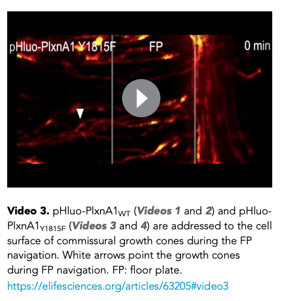

This should have been unlinked. 

If the video has been incorrectly captured, for example, if \(in the caption of Video 4\) the authors wrote 'Figure 1 - video 4' and only 'video 4' has been linked, this citation needs to be corrected \(in this example, to Figure 1_—_ video 4\).

If it is not possible to tell whether the authors are citing a video from the same paper or a different one, please leave the following query \(replace XXXXXX with 'video'\):

* Please confirm which XXXXXX this refers to, or confirm that this citation refers to another article.

The citation will then need to be dealt with depending on the author's response. 

#### vid-xref-test-5

**Error**: _XXXXXX - Video citation is in a reference to a video from a different paper, and therefore must be unlinked._

**Action:** This error will fire if a video citation appears before a reference with 'in', 'from' or 'of' in between  e.g. 'See Video 1 from Smith et al., 1992'. This video citation needs to be changed to plain text as it refers to a video from another source. 

#### vid-xref-test-6

**Error**: _citation is preceded by a letter or number immediately followed by '\('. Is there a space missing before the '\('? - 'XXXXXX'._

**Action:** This will fire if a video citation appears after a letter or number immediately followed by '\('. If there is a missing space, this should be added in, for example in 'DNA\(Video 2\).' 

#### vid-xref-test-7

**Error**: _citation is followed by a '\)' which in turn is immediately followed by a letter or number. Is there a space missing after the '\)'? - 'XXXXXX'._

**Action:** This error will fire if a video citation is followed by a '\)' and a letter or number immediately after. If there is a missing space, this should be added in, for example in '\(Video 2\)DNA.'  

#### vid-xref-test-8

**Error**: _Incomplete citation. Video citation is followed by text which suggests it should instead be a link to source data or code - XXXXXX'._

**Action:** This will fire if a video citation is __followed by text which suggests it should be a link to a source data or code supplement, for example, if the linked citation text is 'Video 1' but it is followed by '—source code 1' or '—source data 1' in plain text. In this example, a citation to Video 1—source code 1 or Video 1—source data 1 should replace the citation for Video 1.

#### vid-xref-test-9

**Error**: _Incomplete citation. Video citation is preceded by text which suggests it should instead be a link to a figure level video._

**Action:** This will fire if a video citation is __preceded by text which suggests it should be a link to a figure level video, for example, if the linked citation text is 'Video 1' but it is preceded by 'Figure 1— '.

```text
<p>see Figure 1-<xref ref-type="video" rid="video1">video 1</xref> for analysis.</p>
```

In these cases, the citation should be updated so it links to the appropriate figure video \(provided there is one\). If there is no figure video, but it has been referred to, then the following author query needs to be added:

* XXXXXX is cited in the text but has not been provided. Please either correct the citation, provide the file and a title and legend, or confirm that this citation refers to another article.

#### vid-xref-test-10

**Warning**: _citation is preceded by 'XXXXXX'. The 'cf.' is unnecessary and should be removed._

**Action:** This warning will fire if a video citation is preceded by 'cf.', which means 'compare' and is sometimes used to refer the reader to other material for comparison. Replace 'cf.' with 'compare with'.

#### vid-xref-test-11

**Warning**: _Figure video citation contains 'Video', when it should contain 'video' with a lowercase v - XXXXXX._

**Action:** This warning will fire if a figure video citation is captured with a capital instead of lowercase 'v'. Figure video citations should be formatted as 'Figure 1—video 1', not Figure 1—Video 1\(see [**table of allowed article assets**](./#allowed-assets) for correct formatting for all assets\). 

#### table-xref-conformity-1

**Warning**: _'XXXXXXX' - citation points to table, but does not include the string 'Table', which is very unusual._

**Action**: This will fire at all stages if a main text table citation does not contain the word 'Table'. In cases where this fires for text like 'See **Tables 1** and **2**', the test will fire for the **2** and can be ignored. If this fires for any other reason it likely indicates that the citation directs to the incorrect location.

#### table-xref-conformity-2

**Warning**: _'XXXXXXX' - citation points to an Appendix table, but does not include the string 'table', which is very unusual._

**Action**: This will fire at all stages if an Appendix text table citation does not contain the word 'table'. In cases where this fires for text like 'See **Appendix 1–tables 1** and **2**', the test will fire for the **2** and can be ignored. If this fires for any other reason it likely indicates that the citation directs to the incorrect location.

#### table-xref-conformity-3

**Warning**: _'XXXXXXX' - Citation content does not match what it directs to._

**Action**: This will fire at all stages if the text in a main text table citation does not contain the number of the label that the table directs to, for example if **Table 2**, links to Table 3. 

Check what the correct citation should be by checking the original submission and any edits the authors have tried to make. If link is incorrect, try to add the citation again through Kriya - if this doesn't work, Exeter will need to fix this. If it is unclear from the original submission and author edits what the correct citation is supposed to be, query the authors for this \(replace XXXXXX with 'table'\):

* Please confirm which XXXXXX this refers to, or confirm that this citation refers to another article.

#### table-xref-conformity-4

**Warning**: _'XXXXXXX' - Citation content does not match what it directs to._

**Action**: This will fire at all stages if the text in an appendix table citation does not contain the number of the label that the table directs to, for example if **Appendix 1–table 1**, links to Appendix 1–table 2. 

Check what the correct citation should be by checking the original submission and any edits the authors have tried to make. If link is incorrect, try to add the citation again through Kriya - if this doesn't work, Exeter will need to fix this. If it is unclear from the original submission and author edits what the correct citation is supposed to be, query the authors for this \(replace XXXXXX with 'table'\):

* Please confirm which XXXXXX this refers to, or confirm that this citation refers to another article.

#### table-xref-test-1

**Warning**: _'XXXXXXX' - Citation is in the caption of the Table that it links to. Is it correct or necessary?_

**Action:** If the table \(or its caption\) contains a citation to a table from another paper, this needs to be changed to plain text. If it is simply referring to the table itself, it should be unlinked \(changed to plain text\).

For example, if the following text is in the caption of Table 2:

* "See Table 2 \(Smith et al., 2020\)." The citation 'Table 2' should be changed to plain text as it refers to a table from another article.
* "Table 2 shows further analysis." The citation of 'Table 2' in this example should be unlinked.

If the citation doesn't refer to a part label, again check if it refers to a table from another paper - if so, change it to plain text. If the authors are simply referring to the figure in general, the citation should be unlinked. For example, [**in 49115**](https://elifesciences.org/articles/49115#table2), there were citations to Table 2 within Table 2:

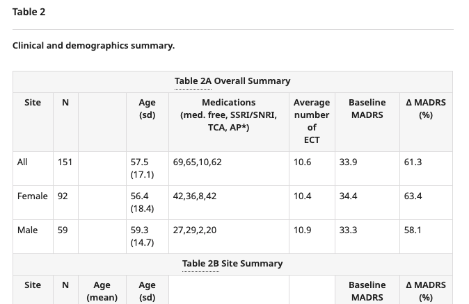

These should have been unlinked - and in this case, just changed to 'A' and 'B'. 

 Similarly, [**in 49979**](https://elifesciences.org/articles/49979#table2), there was a citation to Table 2 within the caption of Table 2:

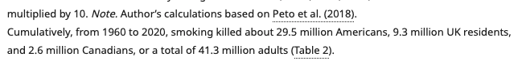

This should have been unlinked. 

If it is not possible to tell whether the authors are citing a table from the same paper or a different one, please leave the following query \(replace XXXXXX with 'table'\):

* Please confirm which XXXXXX this refers to, or confirm that this citation refers to another article.

#### table-xref-test-2

**Error**: _citation is preceded by a letter or number immediately followed by '\('. Is there a space missing before the '\('?  - 'XXXXX'._

**Action**: This will fire at all stages for text such as 'found at the end\(**Table 1**\)'. In this case, the missing space needs to be added between 'end' and '\(**Table 1**\)'.

#### table-xref-test-3

**Error**: _citation is followed by a '\)' which in turn is immediately followed by a letter or number. Is there a space missing after the '\)'?  -  'XXXXX'._

**Action**: This will fire at all stages for text such as ' end \(**Table 1**\)and in **Figure 1**'. In this case, the missing space needs to be added between '\(**Table 1**\)' and 'and'.

#### table-xref-test-4

**Warning**: _'Incomplete citation. Table citation is followed by text which suggests it should instead be a link to source data or code - 'XXXXXX'._

**Action**: This will fire at all stages for pieces of text like - 'See **Table 1**–Source data 1', where only Table 1 is linked. In these cases, the citation should be updated to link to the source data file \(provided there is one\). If there is no source data, but it has been referred to, then the following author query needs to be added \(replace XXXXXX with 'source data' or 'source code'\):

* Please confirm which XXXXXX this refers to, or confirm that this citation refers to another article.

#### table-xref-test-5

**Warning**: _citation is preceded by 'XXXXXX'. The 'cf.' is unnecessary and should be removed._

**Action**: This warning will fire if a figure citation is preceded by 'cf.', which means 'compare' and is sometimes used to refer the reader to other material for comparison. Replace 'cf.' with 'compare with'.

#### table-xref-test-6

**Warning**: _Table citation - 'XXXXXX' - is preceded by the text 'XXXXXX - should it be a Supplementary file citation instead?_

**Action**: This will fire at all stages if a table citation is preceded by text such as 'Supplementary' or 'supplemental'. Often when authors have referred to supplementary tables in their original manuscript, what they actually mean is a file which will now have been labelled as a Supplementary file. If it can be determined that the original intention was to refer to a supplementary file \(this can sometimes be determined by using that supplementary file's title/caption and looking at how the authors have referred to the file in the text\), then the text and citation should be updated with a Supplementary file citation. If you are unable to determine this, then the following author query should be added:

* XXXXXXX is cited in the text but has not been provided. Please either correct the citation, provide the file and a title and legend, or confirm that this citation refers to another article.

#### supp-file-xref-conformity-1

**Warning**: _XXXXXX - citation points to source data, but does not include the string 'source data', which is very unusual._

**Action:** This will fire if a citation of supplementary material does not contain the string 'source data', for example, if the citation text is 'File data 1' and points to 'Source data 1'. The citation text should be updated accordingly - in this example, to Source data 1. Try deleting and re-adding the correct citation but if this doesn't work, Exeter will need to update. In cases where this fires for text like 'See **Source data 1** and **2**', the test will fire for the **2** and can be ignored. 

#### supp-file-xref-conformity-2

**Warning**: _XXXXXX - citation points to source code, but does not include the string 'source code', which is very unusual._

**Action:** This will fire if a citation of supplementary material points to a 'code' type asset but the citation text doesn't include the string 'source code', for example, if the citation text is 'Source data 1' but points to 'Source code 1'. Check the original submission to clarify whether the citation should be to source data or source code -try deleting and re-adding the correct citation but if this doesn't work, Exeter will need to update. 

#### supp-file-xref-conformity-3

**Warning**: _XXXXXX - citation points to a supplementary file, but does not include the string 'Supplementary file', which is very unusual._

**Action:** This will fire if a citation of supplementary material points to a 'supp' type asset but the citation text doesn't include the string 'supplementary file', for example, if the citation text is 'Source data 1' but points to 'Supplementary file 1'. Check the original submission to clarify whether the citation should be to source data or the supplementary file - try deleting and re-adding the correct citation but if this doesn't work, Exeter will need to update. It may also be that 'supplementary file' has been misspelled - correct if this is the case. 

#### supp-file-xref-conformity-4

**Error**: _XXXXXX - It looks like the citation content does not match what it directs to._

**Action:**  This will fire at all stages if the text for a citation of supplementary material doesn't match the id it points to, for example, if the citation text is 'Supplementary file 2' but links to Supplementary file 1:

```text
<xref ref-type="supplementary-material" rid="supp1">Supplementary file 2</xref>
```

Check what the correct citation should be by checking the original submission and any edits the authors have tried to make. If link is incorrect, try to add the citation again through Kriya - if this doesn't work, Exeter will need to fix this. If it is unclear from the original submission and author edits what the correct citation is supposed to be, query the authors for this \(replace XXXXXX with 'supplementary file'\):

* Please confirm which XXXXXX this refers to, or confirm that this citation refers to another article.

#### supp-file-xref-conformity-5

**Warning**: _XXXXXX - It looks like the citation content does not match what it directs to. Check that it is correct._

**Action:**  This will fire at all stages if the text for a citation of supplementary material doesn't match the id it points to, for example, if the citation text is 'Supplementary file 21' but links to Supplementary file 2:

```text
<xref ref-type="supplementary-material" rid="supp2">Supplementary file 21</xref>
```

Note, supp-file-xref-conformity-4 would not fire in this case, because the number 2 is contained in the link text. 

This warning will also fire if the link text refers to part labels, for example 'Supplementary file 4 - table 2'. As long as the citation links to the correct file \(Supplementary file 4 in this case\), this warning can be ignored. 

Check what the correct citation should be by checking the original submission and any edits the authors have tried to make. If link is incorrect, try to add the citation again through Kriya - if this doesn't work, Exeter will need to fix this. If it is unclear from the original submission and author edits what the correct citation is supposed to be, query the authors for this \(replace XXXXXX with 'supplementary file'\):

* Please confirm which XXXXXX this refers to, or confirm that this citation refers to another article.

#### supp-file-xref-conformity-6

**Error**: _XXXXXX - citation points to source data but contains the string 'source datas', which is grammatically incorrect. It should be source data instead._

**Action:**  This will fire if a citation of source data contains the phrase 'source datas':

```text
<xref ref-type="supplementary-material" rid="data1">Source datas 1-</xref>
```

This is grammatically incorrect and should be changed to 'source data' instead.

#### supp-file-xref-conformity-7

**Error**: _XXXXXX - citation points to source code but contains the string 'source codes', which is grammatically incorrect. It should be source code instead._

**Action:**   This will fire if a citation of source data contains the phrase 'source codes':

```text
<xref ref-type="supplementary-material" rid="code1">Source codes 1-</xref>
```

This is grammatically incorrect and should be changed to 'source code' instead.

#### supp-file-xref-test-1

**Warning**: _XXXXXX - Citation is in the caption of the Supplementary file that it links to. Is it correct or necessary?_

**Action:** If a citation of supplementary material refers to material from another paper, this needs to be changed to plain text. If it is simply referring to the supplementary material itself, it should be unlinked \(changed to plain text\). If it is referring to a sub-part of the supplementary material, it can be changed to a part label. 

For example, if the following text is in the caption of Supplementary file 2:

* "See Supplementary file 2 \(Smith et al., 2020\)." The citation 'Supplementary file 2' should be changed to plain text as it refers to a file from another article.
* "Supplementary file 2 shows further analysis." The citation of 'Supplementary file 2' in this example should be unlinked.
* "Supplementary file 2A shows further analysis." The citation of 'Supplementary file 2A' in this example should be changed to '\(A\)' as it is referring to a sub-part of the file.

If the citation doesn't refer to a part label, again check if it refers to a file from another paper - if so, change it to plain text. If the authors are simply referring to the file in general, the citation should be unlinked. For example**,** [**in 49496**](https://elifesciences.org/articles/49496/figures#supp1), there were links to Supplementary file 1 in the caption of Supplementary file 1:

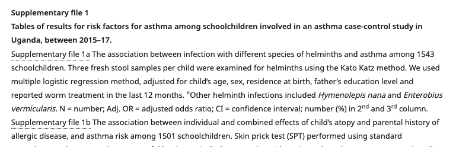

These should have been changed to parts 'a' and 'b'. 

If the figure has been incorrectly captured, for example, if \(in the caption of Supplementary file 1\) the authors wrote 'Figure 1 - supplementary file 1' and only 'supplementary file 1' has been linked, this citation needs to be corrected \(in this example, to Figure 1_—_ figure supplement 1\). 

If it is not possible to tell whether the authors are citing a supplementary file from the same paper or a different one, please leave the following query \(replace XXXXXX with 'supplementary file'\):

* Please confirm which XXXXXX this refers to, or confirm that this citation refers to another article.

The citation will then need to be dealt with depending on the author's response. 

#### supp-xref-test-2

**Error**: _citation is preceded by a letter or number immediately followed by '\('. Is there a space missing before the '\('? - 'XXXXXX'._

**Action:** This will fire if a citation of supplementary material appears after a letter or number immediately followed by '\('. If there is a missing space, this should be added in, for example in 'DNA\(Supplementary file 2\).' 

#### supp-xref-test-**3**

**Error**: _citation is followed by a '\)' which in turn is immediately followed by a letter or number. Is there a space missing after the '\)'? - 'XXXXXX'._

**Action:** This will fire if a citation of supplementary material is followed by a '\)' and a letter or number immediately after. If there is a missing space, this should be added in, for example in '\(Supplementary file 2\)DNA.'  

#### supp-xref-test-**4**

**Error**: _Incomplete citation. XXXXXX citation is preceded by text which suggests it should instead be a link to Figure/Video/Table level source data or code - XXXXXX'._

**Action:** This warning will fire if a citation of supplementary material is preceded by text which suggests the citation is incomplete, for example if it is preceded by 'Figure 1— ', 'Table 1—', or 'Video 1—'. For example: 

```text
<p>See Video 1—<xref ref-type="supplementary-material" rid="sd1">source data 1
</xref> for analysis.</p>
```

In these cases, the citation should be updated so it links to the appropriate figure/video/table level source data or code \(provided there is one\). If there is no source data, but it has been referred to, then the following author query needs to be added:

* XXXXXX is cited in the text but has not been provided. Please either correct the citation, provide the file and a title and legend, or confirm that this citation refers to another article.

#### supp-xref-test-**5**

**Warning**: _citation is preceded by 'XXXXXX'. The 'cf.' is unnecessary and should be removed._

**Action**: This warning will fire if a citation of supplementary material is preceded by 'cf.', which means 'compare' and is sometimes used to refer the reader to other material for comparison. Replace 'cf.' with 'compare with'.

#### supp-xref-test-**6**

**Warning**: _citation contains '—Source' \(XXXXXX\). If it refers to asset level source data or code, then 'Source' should be spelled with a lowercase s, as in the label for that file._

**Action:** This warning will fire if a citation of supplementary material is captured with a capital instead of lowercase 's'. Asset level source code or data should be formatted as, for example 'Figure 1—source data 1', not Figure 1—Source data 1\(see [**table of allowed article assets**](./#allowed-assets) for correct formatting for all assets\). 

#### equ-xref-conformity-1

**Warning**: _XXXXXX - link points to equation, but does not include the string 'Equation', which is unusual. Is it correct?_

**Action:** This will fire if a citation of an equation to an 'disp-formula' type asset but the citation text doesn't include the string 'Equation'. This is usually because of a misspelling or a different format of citation, for example 'Equ 1' or 'Eq 1'. Make sure the citation is updated to match eLife's style \('Equation 1'\). 

#### equ-xref-conformity-**2**

**Warning**: _equation link content does not match what it directs to \(content = XXXXXX; label = XXXXXX\). Is this correct?_

**Action**: This will fire at all stages if the text in an equation citation does not contain the number of the equation that the citation directs to, for example if **Equation 2**, links to Equation 3. 

Check what the correct citation should be by checking the original submission and any edits the authors have tried to make. If link is incorrect, try to add the citation again through Kriya - if this doesn't work, Exeter will need to fix this. If it is unclear from the original submission and author edits what the correct citation is supposed to be, query the authors for this \(replace XXXXXX with 'equation'\):

* Please confirm which XXXXXX this refers to, or confirm that this citation refers to another article.

#### equ-xref-conformity-**3**

**Error**: _XXXXXX - Equation citation appears to be a reference to an equation from a different paper, and therefore must be unlinked._

**Action:** This error will fire if an equation citation appears before a reference with 'in', 'from' or 'of' in between  e.g. 'See Equation 1 from Smith et al., 1992'. This equation citation needs to be changed to plain text as it refers to an equation from another source. 

#### equ-xref-conformity-**4**

**Warning**: _citation is preceded by 'XXXXXX'. The 'cf.' is unnecessary and should be removed._

**Action:** This warning will fire if a citation of an equation is preceded by 'cf.', which means 'compare' and is sometimes used to refer the reader to other material for comparison. Replace 'cf.' with 'compare with'.

#### supplementalfigure-presence

**Warning**: _XXXXXX element contains the phrase ' Supplemental figure ' which almost certainly needs updating. XXXXXX starts with - XXXXXX_

**Action:** This warning will fire if the phrase 'supplemental figure' is present anywhere in an article. If the authors are referring to a figure supplement in the article, the citation should be updated accordingly to match eLife's format \(i.e. 'figure supplement' instead of 'supplemental figure'\). If the authors are referring to a supplemental figure in another article, this should be left as is. If it is unclear, the following query should be left \(replace XXXXXX with 'figure'\):

* Please confirm which XXXXXX this refers to, or confirm that this citation refers to another article. 

If the authors are just generically referring to 'supplemental figures', for example in the data availability statement, this can just be updated to 'figure supplements'.

#### supplementalfile-presence

**Warning**: _XXXXXX element contains the phrase ' Supplemental file ' which almost certainly needs updating. XXXXXX starts with - XXXXXX_

**Action:** This warning will fire if the phrase 'supplemental file' is present anywhere in an article. If the authors are referring to a figure file in the article, the citation should be updated accordingly to match eLife's format \(i.e. 'supplementary file' instead of 'supplemental file'\). If the authors are referring to a supplemental file in another article, this should be left as is. If it is unclear, the following query should be left \(replace XXXXXX with 'supplementary file'\):

* Please confirm which XXXXXX this refers to, or confirm that this citation refers to another article. 

If the authors are just generically referring to 'supplemental files', for example in the data availability statement, this can just be updated to 'supplementary files'.

#### supplementaryfigure-presence

**Warning**: _XXXXXX element contains the phrase ' Supplementary figure ' which almost certainly needs updating. If it's unclear which figure/figure supplement should be cited, please query the authors. XXXXXX starts with - XXXXXX_

**Action:** This warning will fire if the phrase 'supplementary figure' is present anywhere in an article. If the authors are referring to a figure supplement in the article, the citation should be updated accordingly to match eLife's format \(i.e. 'figure supplement' instead of 'supplementary figure'\). If the authors are referring to a supplementary figure in another article, this should be left as is. If it is unclear, the following query should be left \(replace XXXXXX with 'figure'\):

* Please confirm which XXXXXX this refers to, or confirm that this citation refers to another article. 

If the authors are just generically referring to 'supplementary figures', for example in the data availability statement, this can just be updated to 'figure supplements'.

#### supplement-table-presence

**Warning**: _XXXXXX element contains the phrase 'Supplementary table' or 'Supplemental table'. Does it need updating? If it's unclear what should be cited, please query the authors. XXXXXX starts with - XXXXXX_

**Action:** This warning will fire if the phrase 'supplementary table' is present anywhere in an article. The authors may be referring to a table, figure supplement, figure/article source data or supplementary file. If they are referring to a figure supplement which is a table provided as an image, this will need to be addressed \(see more [**here**](figures.md#tables-in-figures) and [**here**](figures.md#tables-labelled-as-figures)\). If the authors are referring to a table, figure/article source data or supplementary file, the citation should be updated accordingly to match eLife's format. If the authors are referring to a supplementary table in another article, this should be left as is. If it is unclear, the following query should be left \(replace XXXXXX with 'table or file'\):

* Please confirm which XXXXXX this refers to, or confirm that this citation refers to another article

If the authors are just generically referring to 'supplementary tables', for example in the data availability statement, check from the context to see what they are referring to. If it is a reference to tables, figure/article source data or supplementary files, this should just be updated according to eLife's style.

#### xref-target-conformance

**Error**: _xref with @ref-type='XXXXXX' points to an element with an @id='XXXXXX', but no such element exists._

**Action:** This will fire if there is a reference to an element which does not exist in the article. This is likely a bug and will need Exeter support to fix.

#### empty-xref-test

**Error**: _Empty xref in the body is not allowed. Its position here in the text - "XXXXXX"._

**Action:** This will fire if there are any citation links within the main body of the text without citation text \(essentially rendering them invisible\). 

```text
<p>Here is a citation <xref ref-type="bibr" rid="bib25"/> to a reference.</p>
```

Exeter will need to correct this. 

#### semi-colon-xref-test

**Error**: _xref ends with semi-colon - 'XXXXXX' - which is almost definitely incorrect. The semi-colon should very likely be placed after the link as 'normal' text._

**Action:** This will fire if a citation ends with a semi-colon:

```text
are problematic (<xref ref-type="fig" rid="fig1">Figure 1;</xref> <xref ref-type="fig" rid="fig4">
Figure 4</xref>).</p>
```

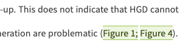

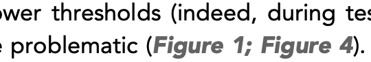

This is incorrect as the semi-colon should not be included in the link text. Remove the semi-colon from the link text and make sure it is marked as plain text. 

### Structure checks

#### xref-parent-test

**Error**: _xref - XXXXXX - has a formatting parent element - XXXXXX - which is not correct._

**Action:** Asset citations should not be contained within style formatting such as italics or bold. If this formatting is present, please remove it. For example:

```text
<p><bold><xref ref-type="fig" rid="bib1"/></bold></p>
```

The bold tags will need to be removed in this case. 

#### xref-child-test

**Warning**: _xref - XXXXXX - has a formatting child element - XXXXXX - which is likely not correct._

**Action:** Asset citations should not contain style formatting such as italics or bold. If this formatting is present, please remove it. For example:

```text
<p><xref ref-type="fig" rid="bib1"><bold/></xref></p>
```

The bold tags will need to be removed in this case. 

#### fig-xref-target-test

**Error:** _xref with @ref-type='XXXXXX' points to XXXXXX. This is not correct._

**Action:** This means that the `ref-type` attribute on the `xref` is not correct with respect to what the link points to. If it is meant to point to a figure, then the `ref-type` attribute value must be 'fig'. If the link is meant to point to something else, which is not a figure, then the link points to the incorrect location and will need to be updated. Exeter will need to correct the link in either case.

#### vid-xref-target-test

**Error**: _xref with @ref-type='XXXXXX' must point to a media\[@mimetype="video"\] element. Either this links to the incorrect location or the xref/@ref-type is incorrect._

**Action:** This means that the `ref-type` attribute on the `xref` is not correct with respect to what the link points to. If it is meant to point to a video, then the `ref-type` attribute value must be 'video'. If the link is meant to point to something else, which is not a video, then the link points to the incorrect location and will need to be updated. Exeter will need to correct the link in either case.

#### supplementary-material-xref-target-test

**Error**: _xref with @ref-type='XXXXXX' points to XXXXXX. This is not correct._

**Action:** This means that the `ref-type` attribute on the `xref` is not correct with respect to what the link points to. If it is meant to point to a supplementary file, then the `ref-type` attribute value must be 'supplementary-material'. If the link is meant to point to something else, which is not a supplementary file, then the link points to the incorrect location and will need to be updated. Exeter will need to correct the link in either case.

#### other-xref-target-test

**Error**: _xref with @ref-type='XXXXXX' points to XXXXXX. This is not correct._

**Action:** This means that the `ref-type` attribute on the `xref` is not correct with respect to what the link points to. If it is meant to point to an award group, then the `ref-type` attribute value must be 'other'. If the link is meant to point to something else, which is not an award group, then the link points to the incorrect location and will need to be updated. Exeter will need to correct the link in either case.

#### table-xref-target-test

**Error**: _xref with @ref-type='XXXXXX' points to XXXXXX. This is not correct._

**Action:** This means that the `ref-type` attribute on the `xref` is not correct with respect to what the link points to. If it is meant to point to a table, then the `ref-type` attribute value must be 'table'. If the link is meant to point to something else, which is not a figure, then the link points to the incorrect location and will need to be updated. Exeter will need to correct the link in either case.

#### box-xref-target-test

**Error**: _xref with @ref-type='XXXXXX' points to XXXXXX. This is not correct._

**Action:** This means that the `ref-type` attribute on the `xref` is not correct with respect to what the link points to. If it is meant to point to a box, then the `ref-type` attribute value must be 'box'. If the link is meant to point to something else, which is not a figure, then the link points to the incorrect location and will need to be updated. Exeter will need to correct the link in either case.

#### supplementary-material-xref-target-test

**Error**: _xref with @ref-type='XXXXXX' points to XXXXXX. This is not correct._

**Action**: This error will fire if a reference citation `<xref>` element \(e.g. one with the attribute `ref-type="bibr"`\) does not point to a reference but instead to some other element such as a figure. So, for example, a figure citation with the type "bibr" is not allowed: `<xref ref-type="bibr" rid="fig1">Figure 1</xref>`. The tagging should be corrected to use the correct ref-type \(`ref-type="fig"` in this example\).

## XML structure

| **Asset** | **Ref type** |
| :--- | :--- |
| Main figures and figure supplements | xref ref-type="fig" |
| Main and figure videos | xref ref-type="video" |
| Main table | xref ref-type="table" |
| Equation | xref ref-type="disp-formula" |
| Asset or source data and code and supplementary files | xref ref-type="supplementary-material" |

Figure citation

```markup
<xref ref-type="fig" rid="fig4">Figure 4E2</xref>
```

Figure supplement citation

```markup
<xref ref-type="fig" rid="fig1s1">Figure 1—figure supplement 1</xref>
```

Video citation

```markup
<xref ref-type="video" rid="video1">Video 1</xref>
```

Table citation

```markup
<xref ref-type="table" rid="table1">Table 1</xref>
```

Asset source data or code citation

```markup
<xref ref-type="supplementary-material" rid="video1sd1">Video 1—source data 1</xref>
```

```markup
<xref ref-type="supplementary-material" rid="table1sc1">Table 1—source code 1</xref>
```

```markup
<xref ref-type="supplementary-material" rid="fig1sc1">Figure 1—source code 1</xref>
```

Equation citation

```markup
<xref ref-type="disp-formula">Equations 1 and 2</xref>
```

Source code citation

```markup
<xref ref-type="supplementary-material" rid="code1">Source code 1</xref>
```

Source data citation

```markup
<xref ref-type="supplementary-material" rid="data1">Source data 1</xref>
```

Supplementary file citation

```markup
 <xref ref-type="supplementary-material" rid="supp1">Supplementary file 1</xref>
```


