# Figures and figure supplements


For changelog, click [**here**](figures.md#changelog).


## What is a figure?

Most scientific articles include figures, which are used to display findings or explain concepts. As well as main figures, eLife also allows authors to include figure supplements \('child' figures linked to main figures\) to present additional results and analyses, and to associate source data or source code directly with their figures. All figures and figure supplements must have titles, and usually also have legends \(although this is not mandatory\). All main figures must be cited in the text, but figure supplement citations are optional.

Figures are made up of:

1. The image \(which may be made up of multiple panels\)
2. A label \(e.g. Figure 3\)
3. A single-sentence title which summarises the figure \(e.g. 'Identification of BisR as a new intermediary regulator for PalpA activation.'\) The title may include part labels \(e.g. 'Results from experiment 1 \(**A**\) and experiment 2 \(**B**\)\).'
4. A legend which describes the figure. Legends can include lists and equations. 

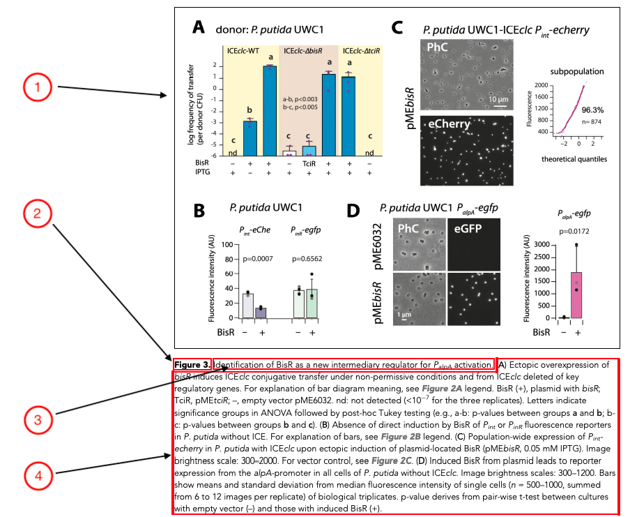

## What needs to be checked?

* Figure labels \(see list of allowed labels [**here**](./#allowed-assets)\)
* Part labels 
* Resolution and placement of figures in the PDFs
* Presence of tables in figures
* Multi-page figures
* Permissions information if required

## Figure files

Figure files should be:

* in PDF, EPS, AI, JPEG, PNG or TIF formats
  * in 8 bit format \(not 16 bit format\) if a TIF file.
* no larger than 500MB
* no wider than 14,000 pixels or no more than 178,956,970 pixels square in size 
* no more than 500dpi in resolution
* in portrait, not landscape orientation. We can accommodate figures of different aspect ratios \(e.g. wide, tall etc\) but they will always be presented in portrait orientation in the PDF \(see more [**here**](figures.md#figure-orientation)\)
* a single figure in a single file \(multiple figures in a figure file is not allowed, for example a PDF file with images across numerous pages\).
* comprised of a single layer \(multiple layers should be avoided\).
* without figure legends in the image \(they may be included in the image file by the authors for the purposes of peer review/PoA, but these should then be removed by Exeter during processing\).
* with whitespace trimmed around the image.

For more information about how figures are processed during production, see [**here**](figures.md#elife-figure-processing). 

## Common author queries

The main queries we receive from authors about figures are to do with replacing figures. These can be passed on to Exeter via Kriya notes or email. 

If authors have queries or complaints about the resolution of their figures, we first need to check the files they have submitted follow the requirements [**above**](figures.md#figure-files). If not, share the requirements with them and ask for updated figure files. If they have already followed the guidelines, Exeter will need to be consulted to see if the resolution can be improved further - although in some cases this will not be possible. It may be appropriate for the figure to be uploaded to a dedicated repository if it is very high resolution. 

## Resolution of figures

Figures and figure supplements should be checked in the PDFs to ensure they are of good quality. If an image has especially poor resolution such that the text or graphics are illegible, the author should be asked to provide a higher resolution version with the following query:

* The image for this figure appears to be of low quality. Please provide a higher resolution version.

## Tables in figures

We strongly discourage authors from providing tables represented as figures or figure supplements. This is because data presented in flat images cannot be mined or re-used without being manually rekeyed. If the authors have provided a table as a figure, they should be asked to provide this information as an editable table in Word or Excel format with the following author queries \(depending on whether the table is a figure or figure supplement\):

* We noticed that this figure only contains a table. eLife’s policy is to avoid including these as flat images wherever possible. Given this, please could you provide this table as an editable Word or Excel file so that we can include it as a main table.
* We noticed that this figure supplement only contains a table. eLife’s policy is to avoid including these as flat images wherever possible. Given this, please could you provide this table as a Word, Excel or PDF file so that we can include it as source data for the related figure.

Once the editable tables are provided, these should be added as main tables or source data files. If the table was provided as a figure supplement this would become Figure 0_—_Source data 0 \(where 0 is one or more digits\). If the table represented as a figure also has its own source data, this will need to be relabelled as another source data file for the figure. Make sure in-text citations to the figure or figure supplement are updated accordingly.

For example, in 57936, Figure 1_—_ figure supplement 4 was originally provided as an image:

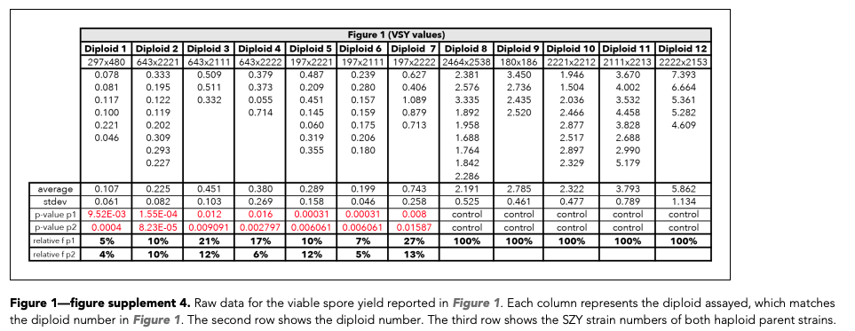

The authors were asked to provide this as an editable file and it was relabelled as source data for Figure 1 in the final version: 

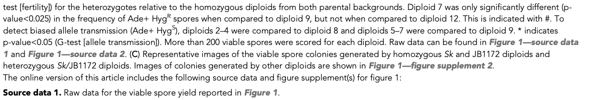

If one of the panels in a figure is a table, this can be left as-is:


### Tables labelled as figures

Authors may label tables in their manuscript as figures \(usually figure supplements\). For example, in 58619:

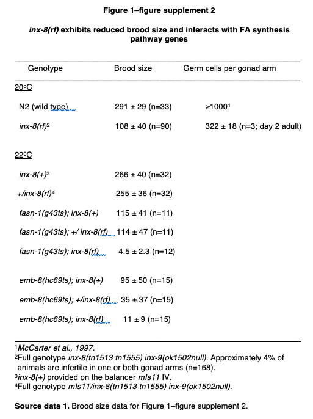

If the table is editable, create a blank document, copy the table there, and relabel and save it as source data \(in the case above, the table became Figure 1–source data 1\). Make sure the figure is removed from the article and add the source data to the relevant figure instead. If the table also has its own source data, this will also need to be relabelled \(in this case, source data for this Figure 1–figure supplement 2 became Figure 1–source data 2\). Then, leave the following author query:

* Unfortunately we cannot support tables as figure supplements so these have been changed to source data for your figures. Please check and confirm this is correct. 

If the table is a flat image, follow the steps outlined in the [**previous section**](figures.md#tables-in-figures). 

## Multi-page files


If an author provides a figure file over multiple pages we cannot process this as a single figure. The authors will need to be asked for single-page figures. If each "page" contains a small image that could be a part of a complete composite figure the author should be asked to supply the image as a single page with part labels. If the images on each page are a full figure and combining the images into one figure would render them unreadable the author should be asked to split the individual pages up into separate figures or figure supplements. Leave the following author query:

* Please provide this figure in a single-page format. If this would render the figure unreadable, please provide this as separate figures or figure supplements.

## Chemical structures/schemes

Authors may include inline images of chemical structures or schemes in their article. These should not be tagged as figures, as they need to be placed inline where the authors have indicated in their original submission. 


## Unlabelled images in the article file

If there are unlabelled images in the article file that do not correspond to the main figures, the production team should be queried to determine how to treat these images. These may be inline images, which are permitted and don't require any labels. For more about inline images, see here \[link to be added\]. Inline images may also be present within tables - for more about this, see here \[link to be added\]. In most cases however, these images will need to be treated as chemical structures or schemes. 

If the unlabelled image is a chemical structure or scheme, it will need to be labelled as such, with the title updated as appropriate.

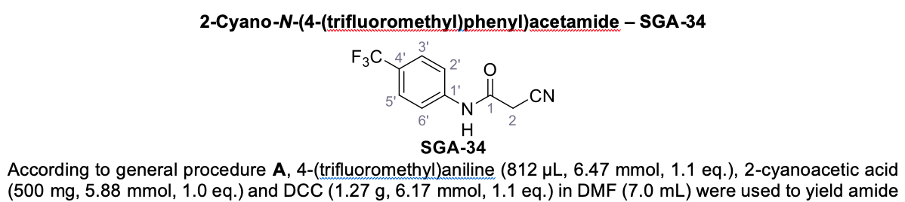

In the example above, this image was relabelled as Chemical structure 1 with the title '2-Cyano-N-\(4-\(trifluoromethyl\)phenyl\)acetamide – SGA-34'.

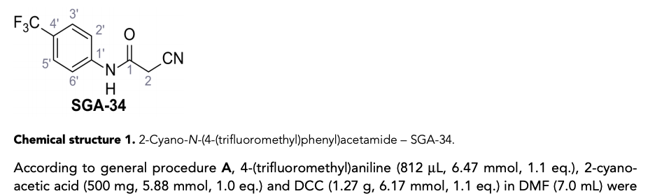

## Figures in article PDFs

The article and figures PDFs must be checked to ensure the content is legible and figures are in the correct order. 

### Figure size

The following applies to research content \([**Feature content**](../feature-content.md) templates have separate rules\). Figures can be either:

1. Full-page width, across the text column and the gutter \(140mm\)
2. Column width, across just the width of the text column \(100mm\)
3. Half-column width, occupying the left 50% of the width of the text column, with the text flowing around the image block on the right \(50mm\) 


In each case, the legend will be the same width as the image block and the figure should occupy as much of the available space as possible, left aligned but preferably with little to no whitespace on the right. If the image is particularly tall, this may result in there being more whitespace on the right because to increase the size of the image would make it too big for a PDF proof page. The appropriate width of the figure block should be determined by the resolution and aspect ratio of the supplied image.

### Figure orientation

Figures must be in portrait, not landscape orientation. We can accommodate figures of different aspect ratios \(e.g. wide, tall etc\) but they must always be presented in portrait orientation in the PDF. For example, in 57215, the figure below was provided in landscape orientation but displayed in portrait format so the content was rotated:

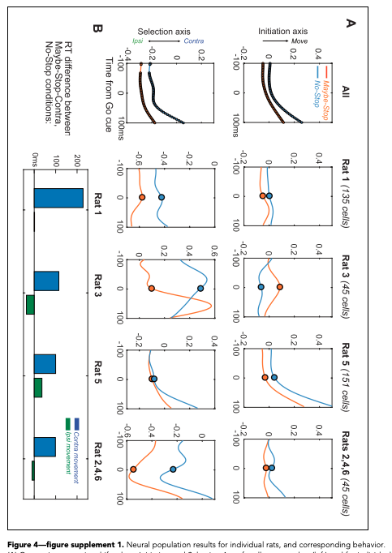

In the final version, this figure was rotated so the content would be legible in portrait view. 

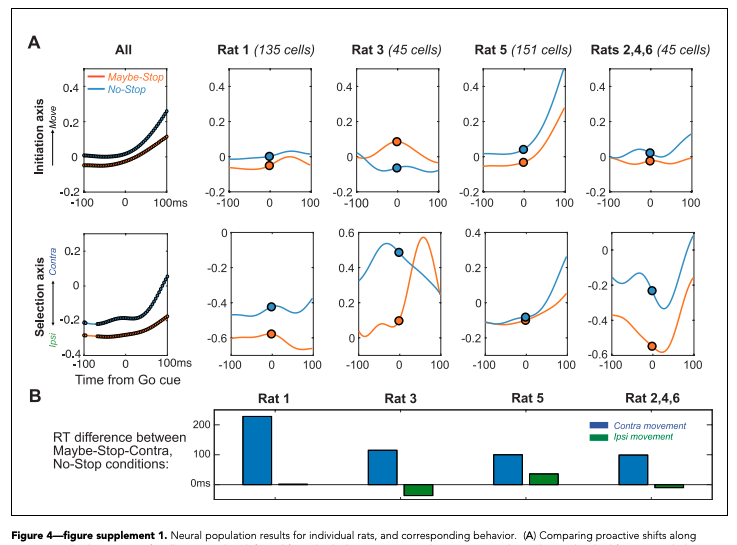

## Accompanying text

All figures and figure supplements should have titles. Legends are not required but will usually be provided. If titles are not present, the following author query will need to be added to ask the author to provide these:

* Please provide the title for this figure.

If the author has only provided a legend that begins with a description of the first panel \(e.g. “\(A\) The high-resolution MS/MS spectrum of the H4K31ac peptide generated from . . .”\), the same query as above will need to be left to ask the authors to add an overall title.

## Part labels

Often, figures have multiple parts or panels, which can be labelled with letters in upper or lower case, or numbers \(e.g. A, a, iv\). ****Part labels should be captured as such in Kriya \(by right-clicking and selecting 'part label'\). Doing so will change the colour of the text to orange in Kriya \(but this will appear as bold in the PDFs, XML, and online\). Please match the figure file when adding part labels in terms of upper/lowercase. 

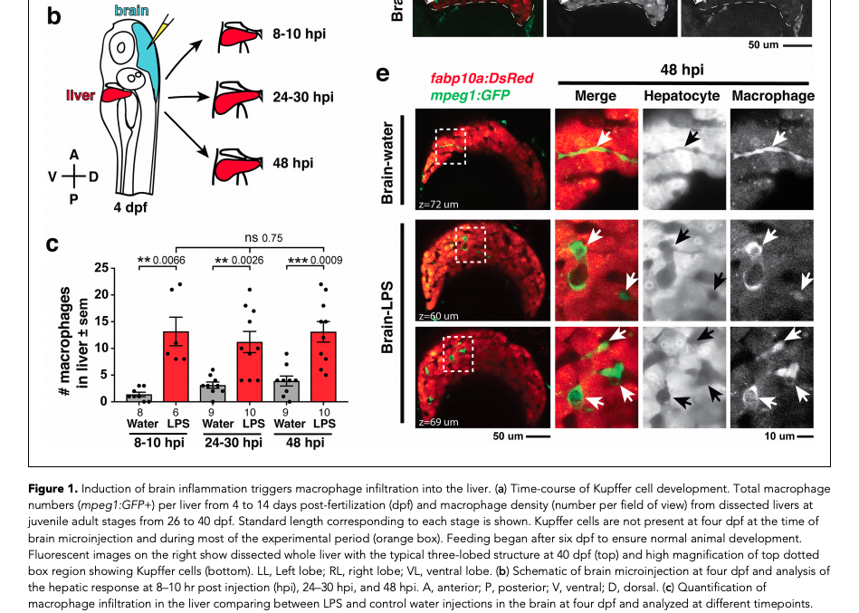

If a figure contains labels A-G, check these have all been referred to in the legend. If they haven't, leave the following author query:

* The image file for Figure X contains panel label "Y", but this has not been provided in the figure legend. Please add a reference to this panel to the figure legend, or provide an updated figure file with this label removed.

If the legend refers to figure panels that are not in the figure file, the following author query should be left:

* The legend for Figure X refers to panel label "Y", but this has not been provided in the figure file. Please provide an updated figure file containing label "Y", or remove this label from the legend.


Make sure 'X' and 'Y' are replaced with the appropriate figure number and panel letters. Make sure if there are multiple missing panels/panel references that the text is adapted to use plurals, for example:

* The image file for Figure X contains panel label**s** "**Y–Z**", but **these have** not been provided in the figure legend \[...\]
* The legend for Figure X refers to panel label**s** "**Y–Z**", but **these have** not been provided in the figure file \[...\]


If there are sub-parts that refer to figure panels \(e.g. A', A'', or A\(I\), \(II\)\) and the author has cited these in the text \(I.e. 'Figure 2Ai'\) make sure these are also captured consistently as part labels. Figure sub-parts that haven't been cited in the text don't need to be captured as part labels. The main thing is to be consistent within an article.

Make sure part labels are not automatically added to every letter/number in a figure caption. For example, in the figure legend below, 'F–I' is captured as a part label. 


However, looking at the figure this legend corresponds to, there are no parts F–I. 


Therefore, this was changed to plain text in the final article. 

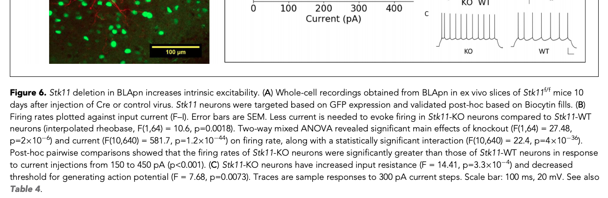

## In-text citations

All main figures must be cited in the article text \(figure supplements don't have to be\). If these have not been cited, the following query should be left:

* Please provide an in-text citation for this figure.

## Figures that haven't been provided

Authors may provide titles or legends for figures in their submitted article file but fail to upload the corresponding figure. One of the following queries should be left in these cases depending on whether the missing figure is a main figure or figure supplement. 

* Please provide the image file for this figure.
* Please provide the image file for this figure supplement.

Alternatively, if a figure or figure supplement is cited in the text but the corresponding file has not been provided, the author must be queried to provide the missing file:

* Figure X is cited in the text but has not been provided. Please either correct the citation, provide the figure file and a title and legend, or confirm that this citation refers to another article.

Please be aware that sometimes authors may cite a figure from another article. Citations of figures in other articles should be left as plain text. They can be identified by the context of the citation - for instance, “Figure 1 in Smith et al., 1990” refers to Figure 1 in Smith et al., 1990 and not to Figure 1 of the current article. Similarly, “\(see Jones et al., 2000 \[their Figure 2\]\)” references Figure 2 in Jones et al., 2000 and should stay as plain text. If the context is unclear, leave the same query as above:

* Figure X is cited in the text but has not been provided. Please either correct the citation, provide the figure file and a title and legend, or confirm that this citation refers to another article.

## Figure placement

Figures can either be 'floating' or 'anchored'. In the PDFs, chemical structures, schemes, and appendix figures are treated as anchored objects rather than floating ones. All other figures are floating objects. 

Floating figures are automatically placed directly after their first citation in the text \(although citations in captions should not be used to determine figure placement\). This can sometimes result in figures being placed in the middle of display formulae, which breaks the flow of the text.

For example, in 55217, equation 9 should appear after the paragraph shown below. Instead, Figure 12 has been placed here, which breaks the flow of the text. Figure 12 should appear after equation 9 to improve readability.

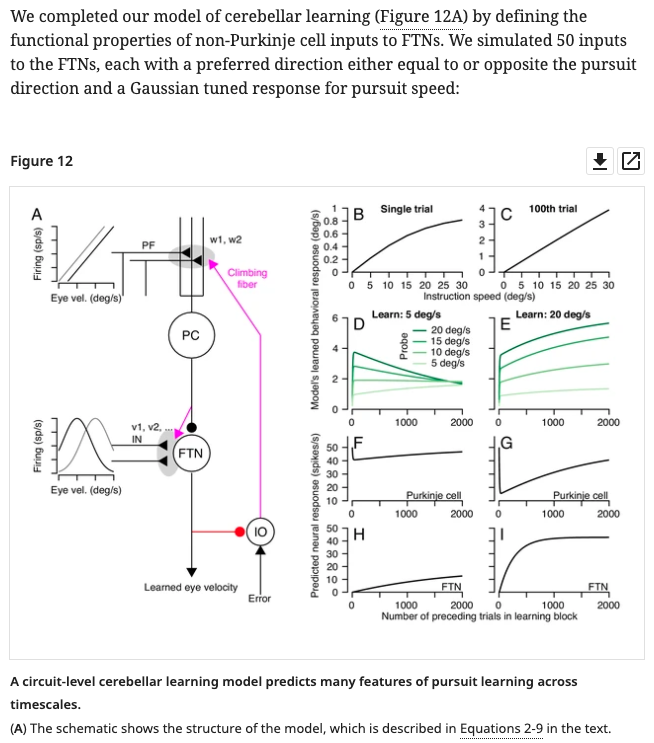

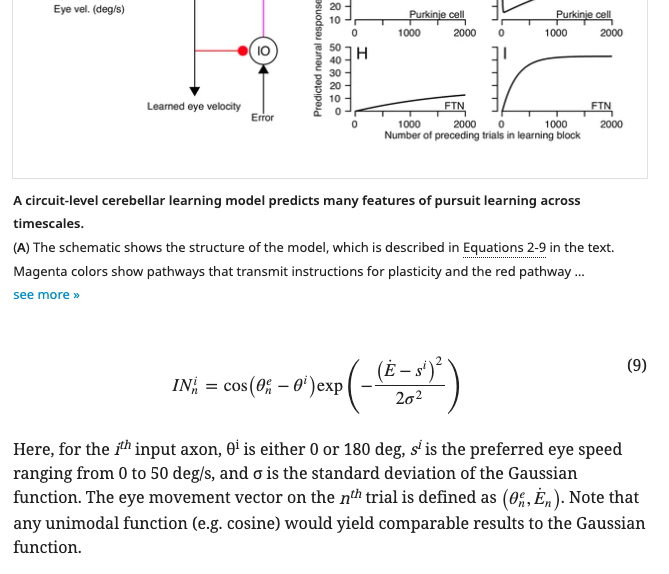


## Source code/data

Source data is often associated with figures and figure supplements. Each source data or source code file should be linked with the appropriate figure or figure supplement. For example, if a source data \(or code\) file is labelled Figure 1_—_source data 1 but the title or legend makes it clear that the data is linked to a figure supplement, it should be relabelled as Figure 1_—_Figure supplement X_—_source data 1 \(or source code as appropriate\). If the source data or code is linked to multiple figures and figure supplements however, it should become source data or code for the whole article. See more about source data and source code here \(links to be added\).

## Adapted and reproduced images

Figures and figure supplements \(or panels within these\) may be 'adapted' from previously published content. This usually means that the authors are not reproducing anything directly but are instead redrawing a figure or simply using the same data to create new content. However, as this term is used inconsistently by authors, eLife needs to determine whether the figure is an adaptation/redrawing or a reproduction, either by comparing the image to the original if possible, or by asking the authors to confirm this. If the figure is a clear adaptation or redrawing, and as long as the authors provide a suitable citation and state clearly, for example, that “Panel A in Figure 2 has been adapted from Smith and Jones, 2015”, no further action is required.

If however, the figure has been reproduced, or if the legend for a figure or figure supplement states that the image is ‘reprinted from’ or ‘reproduced from’, we may need to add licensing information for the reproduced elements. This will usually apply to panels within figures instead of whole figures.

If the previously published content was published under a [**CC BY**](https://creativecommons.org/licenses/) or [**CC0**](https://creativecommons.org/share-your-work/public-domain/cc0/) license, the work must be properly attributed and credited \(provide full citation details and license\). If this matches the license of the article \(check the permissions-info message in the xml\), it does not need to be tagged differently in the underlying XML because it is following the license of the article. If the article license is CC-BY but the reproduced image is CC0, no permissions need to be added as no copyright is retained with CC0 licenses. However, if the article you are working on is CC0, but the reproduced figure is CC BY, this needs to be indicated in the underlying XML as the authors/creators still retain copyright. This requires specific tagging - for example:

```markup
<permissions>
    <copyright-statement>© Brand, 2018.</copyright-statement>
    <copyright-year>2018</copyright-year>
    <copyright-holder>Françoise Brand </copyright-holder>
    <license>
        <ali:license_ref>http://creativecommons.org/licenses/by/4.0/</ali:license_ref> 
        <license-p>Image courtesy of Françoise Brand, Swiss Tropical and Public Health Institute and University of Basel. Published under a <ext-link ext-link-type="uri" xlink:href="http://creativecommons.org/licenses/by/4.0/">CC BY 4.0 license.</ext-link>
        </license-p>
    </license>
</permissions>
```

If the authors chose to exactly reproduce a figure or panel from a previously published, non-open access/non-CC BY article in part or in whole, it will need to be published under a separate license.  This is because the original publication will have been published under a license that retains copyright. An article published in Nature, for example, will be copyright to the Nature Publishing Group, and articles published in Science will be copyright to the American Association for the Advancement of Science and so on. If eLife is to reproduce the contents of these articles, it must make it clear that the publisher retains copyright on that content, and that it is therefore not covered by the CC BY or CC0 license that covers the rest of the eLife article. The same issue applies when authors incorporate images from other copyrighted media into their figures \(e.g. if they use film stills or artwork\). The authors will need to confirm they have permission from the copyright holders to reproduce the figure or figure panel.

If the authors chose to reproduce copyrighted images in their figures, they must state what has been reproduced in the legend. In addition to this, a permissions statement must be added to the figure in the XML giving the license details for the reproduced image. The permissions text may have been provided already as part of the figure or figure supplement legend. If so, it should be removed and moved into the permissions tagging.

The editorial team check figure permissions as part of submission quality checks. They will leave a note for Exeter if permissions information needs to be added to the XML, for example:

> FAO Exeter: Figure Permissions
>
> copyright-year: 2009  
> copyright-holder: Elsevier  
> permissions: Figure 1A is reprinted from Simonetta, et al, 2009, with permission from Elsevier. It is not covered by the CC-BY 4.0 licence and further reproduction of this panel would need permission from the copyright holder.

This information should be added in the XML:

```markup
<permissions>
<copyright-statement>© 2009 Elsevier</copyright-statement>
<copyright-year>2009</copyright-year>
<copyright-holder>Elsevier</copyright-holder>
<license>
<license-p>
Panel A is reprinted from
<xref ref-type="bibr" rid="bib40">Simonetta et al., 2009</xref>
, with permission from Elsevier. It is not covered by the CC-BY 4.0 licence and further reproduction of this panel would need permission from the copyright holder.
</license-p>
</license>
</permissions>
```


If the note from Editorial says a figure does not require permissions, these should still be checked. If it is not possible to check \(because the figure is from a book for example\), this doesn't need to be followed up further. However, where possible, figure permissions should be double-checked regardless of what the note says.

## Attributions

If the authors would like to credit the person who provided a figure, an attribution tag can be added to the figure. For example, Figure 5 in 49979 includes the following in the caption:


This was added as an &lt;attrib&gt; element in the xml.

```markup
<fig id="fig5" position="float">
    <label>Figure 5.</label>
    <caption>
        <title>Trends in age-specific lung cancer death rates among men and women at ages 35–39, 55–59 and 75–79 in selected countries.</title>
    </caption>
    <graphic mime-subtype="tiff" mimetype="image" xlink:href="elife-49979-fig5-v2.tif"/>
    <attrib>Figures provided by Hangchao Pan and Richard Peto, University of Oxford, 2018.</attrib>
</fig>
```

## **Author response figures**

After a paper has been peer reviewed, the Reviewing Editor collates the reviewers’ comments into a single letter to the corresponding author, outlining the consolidated list of recommendations in the decision letter. Corresponding authors then have the opportunity to respond to the comments in the author response letter. Authors may include figures, videos, and/or tables in this letter. These have the same requirements as main figures in terms of resolution, tables, and attribution information. It is preferred, but not necessary for these to have titles if they have legends. If these are missing at pre-author stages, the following query should be added:

* Please provide the title for this figure.

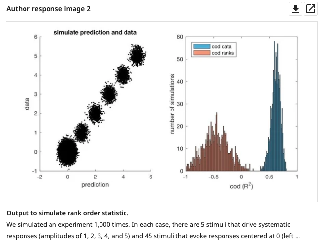

## Decision letter figures

In rare cases, the editors may include figures in the decision letter. As with author response images, it is preferred, but not necessary for these to have titles if they have legends. If these are missing, the Editorial team will need to be consulted to see if there should be titles.

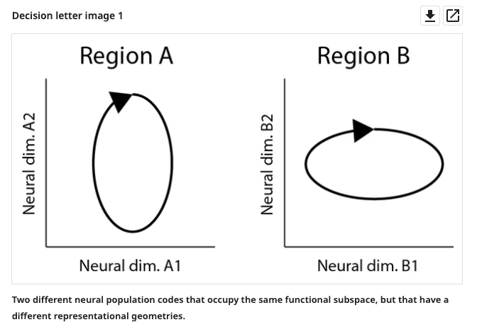

## eLife figure processing

eLife publishes figures in TIF format only, meaning that all figures provided by authors in a filetype other than TIF are converted at the end of the production process. Therefore, in the final package delivered to Continuum and to downstream services, all figures are in TIF format. However, other formats are used for figures in the creation of the PDFs. These may be in the original formats provided by the authors, or in a vector/rasterised format derived from the original. As a result, during the production process, the XML that is downloaded from Kriya will contain references to various different file formats. Here is an example:

```markup
<graphic xlink:href="{.}../resources/elife2/ecs/article/184502/resources/FF01.eps" mimetype="application" mime-subtype="postscript"/>
```

The example above references a `.eps` file. The values of the `mimetype` and `mime-subtype` will differ and are dependent on what filetype is referenced.

## Schematron checks

### Content checks

These checks relate to the content of figures and figure supplements. X or XXXXXX refers to quoted text which will change depending on the article.

#### fig-caption-test-1

**Warning**: _Caption for XXXXXX contains what looks like a lower case letter at the start of a sentence - XXXXXX._

**Action:** In some cases, a sentence will begin with a lower case letter. This is fine to leave if the word is a recognised scientific term - you can check against the rest of the article to see if it is used elsewhere. Otherwise, make sure every sentence begins with a capital letter_,_ unless the part label is being used as part of the sentence. For example:

* 'Data are from a single session consisting of 4 blocks of trials from monkey 2. \(**A**\) on each trial...' should be corrected to 'Data are from a single session consisting of 4 blocks of trials from monkey 2. \(**A**\) On each trial'
* but 'Virus phenotypes and genotypes were determined as described in Figure 6. \(**A**\) shows virus HA activation' is fine to leave as is.

#### fig-caption-test-2

**Warning:** _Caption for XXXXXX contains what looks like an image credit. It's quite likely that this should be captured in an &lt;attrib&gt; element instead - XXXXXX_

**Action:** If the caption for a figure or figure supplement includes 'image credit', this warning will fire. This information should be added in an &lt;attrib&gt; element \(see [**here**](figures.md#attributions)\).

#### fig-test-3

**Error:** _fig must have a label._

**Action:** All figures and figure supplements in research content should be numbered sequentially and thus have a label 'Figure 0' or 'Figure supplement 0' \(where 0 is one or more digits, based on the sequence of the numbered figure\). This error will fire if a figure does not have a label and will need to be corrected by Exeter.

#### feat-fig-test-3

**Warning:** _fig doesn't have a label. Is this correct?_

**Action:** [**Feature content**](../feature-content.md) figures do not always require labels. However, there is a warning if a figure does not have the label 'Figure 0' \(where 0 is one or more digits, based on the sequence of the numbered figure\). Check the original submitted document to see whether there should be a label. If so, this will need to be added by Exeter. If the original version does not have a label, this is ok to leave. For example, in 58965:


#### pre-fig-test-4

**Warning:** _XXXXXX has no title or caption \(caption element\). Ensure this is queried with the author._

**Action:** This warning will fire at the pre-author stages if a figure has no title or caption element. Double-check the submitted manuscript for the figure title. If this has not been provided, the following author query should be left:

* Please provide the title for this figure.

Compare with the original submission on EJP - If the caption element was present in the figure file or original manuscript submitted but missing in the XML this will need to be added. Exeter will need to fix this.

#### final-fig-test-4

**Error:** _XXXXXX has no title or caption \(caption element\)._

**Action:** This warning will appear at the post-author stages if a figure has no title or caption element. Check whether an author query was added at pre-editing requesting this from the author. If this author query was not present, check the submitted manuscript file or figure file for the figure title. If this was not provided, the authors will need to be asked for this. Exeter will need to fix this when the information is provided.

#### pre-fig-test-5

**Warning:** _XXXXXX does not have a title._

**Action:** This warning will fire at the pre-author stages if a figure has no title. Compare with the original submission on EJP - If the caption element was present in the figure file or original manuscript submitted but missing in the XML this will need to be added. Exeter will need to fix this.

 If this has not been provided, the following author query should be left:

* Please provide the title for this figure.

#### final-fig-test-5

**Error:** _fig caption must have a title._

**Action:** This warning will appear at the post-author stages if a figure has no title. Check whether an author query was added at pre-editing requesting this from the author. If this author query was not present, check the submitted manuscript file or figure file for the figure title. If this was not provided, the authors will need to be asked for this.

Exeter will need to fix this when the information is provided.

#### fig-test-6

**Warning:** _Figure does not have a legend, which is very unorthadox. Is this correct?_

**Action:** This warning will fire if a figure has no caption. Double-check the submitted manuscript for the caption and add it in if it is missing. If no caption was provided in the manuscript, this is ok to leave. 

#### pre-fig-test-7

**Warning:** _fig does not have graphic. Ensure author query is added asking for file._

**Action:** This warning will fire at the pre-author stages if no file has been provided for a figure or figure supplement. Leave one of the following author queries as relevant:

* Please provide the image file for this figure.
* Please provide the image file for this figure supplement.

#### final-fig-test-7

**Error:** _fig must have a graphic._

**Action:** This warning will fire at the post-author stages if no file has been provided for a figure or figure supplement. Check on eJP to see whether this figure was originally provided - if so, Exeter will need to add it back in. If not, the authors will need to be asked for the file. 

#### pre-fig-specific-test-2

**Warning:** _XXXXXX does not appear in sequence. Relative to the other figures it is placed in position XXXXXX. Please query this with the author._

**Action:** Figures are automatically placed directly after their first citation. ****This warning usually appears if the authors have cited figures out of order. For example, if they refer to Figure 3 before Figure 2, this results in Figure 3 being placed before Figure 2. For example in 52278, Figures 5 and 6 were cited out of sequence:

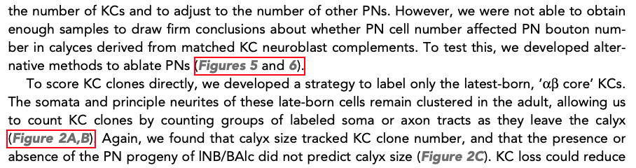

This resulted in Figures 5 and 6 appearing before Figure 2.

Unlink the citation that is out of order, move the figure to the correct place and leave the following query for the author:

* This citation is out of sequence with the other figure citations and has therefore been left unlinked \(figure placement is determined by first live citation\). Please confirm this is acceptable.

If multiple figures are out of sequence, leave the following query for the author instead:

* Our system numbers figures based on when they are first cited. Please confirm these figures can be renumbered or provide in-sequence citations for these.

#### final-fig-specific-test-2

**Error:** _XXXXXX does not appear in sequence which is incorrect. Relative to the other figures it is placed in position XXXXXX._

**Action:** Figures are automatically placed directly after their first citation. ****This error usually appears if the authors have cited figures out of order. For example, if they refer to Figure 3 before Figure 2, this results in Figure 3 being placed before Figure 2. The authors will need to be asked to provide in-sequence citations or confirm the figures can be renumbered. If the citations are not out of order, Exeter will need to fix this.

#### fig-specific-test-3

**Warning:** _XXXXXX is cited, but does not appear directly after the paragraph citing it. Is that correct?_

**Action:** Figures should always be placed in the XML directly after the paragraph in which they are first cited, unless the paragraph is immediately followed by a display formula, in which case the figure should be placed at the first appropriate place. This check doesn't take into account 'Figure 1-3' type links, so if the warning is linked to this type of figure citation, it can be ignored. Otherwise, make sure the figure is moved directly after its first citation. 

If the first citation for a figure is in an appendix, leave the following query for the authors:

* The first citation for this figure is in the appendix. Please advise whether this figure should be relabelled as Appendix 0—figure 0 or add a citation to this figure in the appropriate place so it can be moved to the main text. 

Make sure the 'Appendix 0—figure 0' is updated with the appendix and figure number accordingly. If the article is at post-author stages, this will need to be queried with the authors via email. 

#### pre-fig-specific-test-4

**Warning:** _There is no citation to XXXXXX Ensure to query the author asking for a citation._

**Action:** This will fire at the pre-author stages if a main figure has no in-text citations. Leave the following author query:

* Please provide an in-text citation for this figure.

#### final-fig-specific-test-4

**Warning:** _There is no citation to XXXXXX Ensure this is added._

**Action:** This will fire at the post-author stages if a main figure has no in-text citations. Email the authors to ask for this. 

#### feat-fig-specific-test-4

**Warning:** _There is no citation to XXXXXX Is this correct?_

**Action:** This will fire in [**Feature content**](../feature-content.md) if a main figure has no in-text citations. Check the submitted manuscript to see if this should be the case. If the original version had an in-text citation for the figure, double-check with Features whether they meant to remove this. If so, this warning can be ignored - otherwise add the in-text citation. If the original version didn't have an in-text citation for the figure, this warning can be ignored.

#### fig-specific-test-5

**Warning:** _XXXXXX is immediately followed by a display formula, and preceded by a paragraph which does not end with punctuation. Should it should be moved after the display formula or after the para following the display formula?_

**Action:** As figures are automatically placed after their first citation, this can sometimes result in figures being placed in the middle of equations, which breaks the flow of the text. Check whether this is the case - if so, the figure will need to be moved to after the display formula, or after the next paragraph. For example, in 55217, equation 12 should appear after the paragraph below. Instead, Figure 12 has been placed here, which breaks the flow of the text. Figure 12 should appear after equation 12.


#### fig-specific-test-6

**Warning:** _XXXXXX is immediately followed by a display formula, and preceded by a paragraph which does not end with punctuation. Should it should be moved after the display formula or after the para following the display formula?_

**Action:** As figures are automatically placed after their first citation, this can sometimes result in figures being placed in the middle of equations, which breaks the flow of the text. Check whether this is the case - if so, the figure will need to be moved to after the display formula, or after the next paragraph. See [**fig-specific-test-5**](figures.md#fig-specific-test-5) for a similar case. 

#### fig-sup-test-2

**Error:** _fig in the body of the article which has a @specific-use='child-fig' must have a label in the format 'Figure 0—figure supplement 0.' \(where 0 is one or more digits\)._

**Action:** __All figure supplements in research content should have the label 'Figure 0—figure supplement 0' \(where 0 is one or more digits, based on the sequence of the numbered figure\). This error will fire if a figure supplement does not have this label. Exeter will need to fix this. 

#### fig-sup-test-3

**Error:** _XXXXXX does not start with the main figure number it is associated with - XXXXXX._

**Action:** __All figure supplements in research content should have the label 'Figure 0—figure supplement 0' \(where 0 is one or more digits, based on the sequence of the numbered figure\). This error will fire if a figure supplement has a label which doesn't begin with the figure number it is associated with \(for example if Figure 2—figure supplement 1 is associated with Figure 1\). Exeter will need to check the original submission to see which figure the supplement should be associated and fix accordingly. 

#### fig-sup-test-4

**Error:** _XXXXXX does not appear in sequence which is incorrect. Relative to the other figures it is placed in position XXXXXX._

**Action:** Figures are automatically placed directly after their first citation. ****This warning usually appears if the authors have cited figures out of order. For example, if they refer to Figure 3—figure supplement 2 before Figure 3—figure supplement 1, this results in Figure 3—figure supplement 2 being placed before Figure 3—figure supplement 1. Unlink the citation that is out of order and leave the following query for the author:

* This citation is out of sequence with the other figure citations and has therefore been left unlinked \(figure placement is determined by first live citation\). Please confirm this is acceptable.

If multiple figures are out of sequence, leave the following query for the author instead:

* Our system numbers figures based on when they are first cited. Please confirm these figures can be renumbered or provide in-sequence citations for these.

If this appears at post-author stages, the author will need to be asked whether we can unlink the citation that is out of order, or renumber the figures.

#### fig-sup-test-5

**Error:** _XXXXXX is in position XXXXXX, which means either the label or the placement incorrect._

**Action:** Figures are automatically placed directly after their first citation. ****This warning usually appears if the authors have cited figures out of order. For example, if they refer to Figure 3—figure supplement 2 before Figure 3—figure supplement 1, this results in Figure 3—figure supplement 2 being placed before Figure 3—figure supplement 1. Unlink the citation that is out of order and leave the following query for the author:

* This citation is out of sequence with the other figure citations and has therefore been left unlinked \(figure placement is determined by first live citation\). Please confirm this is acceptable.

If multiple figures are out of sequence, leave the following query for the author instead:

* Our system numbers figures based on when they are first cited. Please confirm these figures can be renumbered or provide in-sequence citations for these.

If this appears at post-author stages, the author will need to be asked whether we can unlink the citation that is out of order, or renumber the figures.

#### fig-sup-test-6

**Error:** _XXXXXX label ends with XXXXXX, but the id \(XXXXXX\) ends with XXXXXX, so one must be incorrect._

**Action:** This error will fire if a figure's ID and its label do not match. For example in the XML below, the figure ID is fig6s1 but the label is Figure 6_—_figure supplement 6. If this appears at pre-editing, check whether the figure ID or label is correct by comparing against the submission from eJP - Exeter will need to correct the XML. If this is at post-author stages, compare against the submission from eJP, and check for any correspondence with the authors in case they have asked for figures to be relabelled. Exeter will need to correct the XML.

```markup
<fig-group>
        <fig id="fig6" position="float">
          <label>Figure 6.</label>
          ...
        </fig>
        <fig id="fig6s1" position="float" specific-use="child-fig">
          <label>Figure 6—figure supplement 6.</label>
          ...
        </fig>
</fig-group>
```

#### ar-fig-test-2

**Error:** _Author Response fig must have a label._

**Action:** Author response images must have the label 'Author response image X'. This error will fire if an author response image does not have a label and will need to be corrected by Exeter.

#### pre-ar-fig-test-3

**Warning:** _Author Response fig does not have graphic. Ensure author query is added asking for file._

**Action:** This warning will fire at the pre-author stages if no file has been provided for an author response image. Production will need to be queried to check the AWS bucket to see if this was provided in the decision letter, and will send the image to Exeter if so. If it wasn't, please leave the following query.

* Please provide the image file for this figure.

#### final-ar-fig-test-3

**Error:** _Author Response fig must have a graphic._

**Action:** This error will fire at the post-author stages if no file has been provided for an author response image. Check the AWS bucket to see if this was provided in the decision letter and send the image to Exeter to replace if so. If it wasn't, editorial will need to be asked for this.

#### pre-ar-fig-position-test

**Warning:** _XXXXXX does not appear in sequence which is likely incorrect. Relative to the other AR images it is placed in position XXXXXX._

**Action:** This warning will fire if the author response images in the author response letter are placed out of sequence. This may happen if the authors have cited the figures out of order. For example, if they refer to Author response image 3 before before Author response image 2 this results in Author response image 3 being placed before Author response image 2. However it may also be an error during processing - check the `elife/decision-letter-input` AWS bucket to see what the correct order of figures should be and correct accordingly. Otherwise, unlink the citation that is out of order and leave the following query for the author:

* This citation is out of sequence with the other figure citations and has therefore been left unlinked \(figure placement is determined by first live citation\). Please confirm this is acceptable.

If multiple figures are out of sequence, leave the following query for the author instead:

* Our system numbers figures based on when they are first cited. Please confirm these figures can be renumbered or provide in-sequence citations for these.

#### final-ar-fig-position-test

**Error:** _XXXXXX does not appear in sequence which is incorrect. Relative to the other AR images it is placed in position XXXXXX._

**Action:** This error will fire if the author response images in the author response letter are placed out of sequence. This may happen if the authors have cited the figures out of order. For example, if they refer to Author response image 3 before before Author response image 2 this results in Author response image 3 being placed before Author response image 2. The author will need to be asked whether we can unlink the citation that is out of order, or renumber the figures. 

#### resp-fig-test-2

**Error:** _fig must have a label._

**Action:** This error will fire __if an author response image has no label. Figures in the author response letter should have a label in the format 'Author response image X.' or 'Chemical Structure X.' or 'Scheme X.' Check what the correct label should be by comparing with the decision letter/author response document from the AWS bucket. This will need to be corrected by Exeter.

#### reply-fig-test-2

**Error:** _fig label in author response must be in the format 'Author response image 1.', or 'Chemical Structure 1.', or 'Scheme 1.'._

**Action:** This error will fire __if an author response image has a label other than 'Author response image 0.' or 'Chemical Structure 0.' or 'Scheme 0.' Correct any typos and if needed, check what the correct label should be by comparing with the decision letter/author response document from the AWS bucket. This will need to be corrected by Exeter.

#### dec-fig-test-1

**Error:** _fig must have a label._

**Action:** This error will fire __if a figure in the decision letter has no label. Figures in the decision letter should have a label in the format 'Decision letter image X.' This will need to be corrected by Exeter.

#### dec-fig-test-2

**Error:** _fig label in author response must be in the format 'Decision letter image 1.'._

**Action:** This error will fire __if a figure in the decision letter has a label other than 'Decision letter image X.' This will need to be corrected by Exeter.

#### box-fig-test-1

**Error:** _label for fig inside boxed-text must be in the format 'Box 1—figure 1.', or 'Chemical structure 1.', or 'Scheme 1'._

**Action:** This error will fire __if a figure in a box has a label other than 'Box 0—figure 0.', 'Chemical structure 0.' or 'Scheme 0.'.This will need to be corrected by Exeter.

#### app-fig-test-1

**Error:** _label for fig inside appendix must be in the format 'Appendix 1—figure 1.', 'Appendix A—figure 1.', or 'Appendix 1—chemical structure 1.', or 'Appendix A—scheme 1'._

**Action:** This error will fire __if a figure in an appendix has an ID app0fig0 \(where 0 is a number\) and a label other than 'Appendix 1—figure 1.', 'Appendix A—figure 1.', or 'Appendix 1—chemical structure 1.', or 'Appendix A—scheme 1'. This will need to be corrected by Exeter.

#### app-fig-test-2

**Error:** _label for XXXXXX does not start with the correct appendix prefix. Either the figure is placed in the incorrect appendix or the label is incorrect._

**Action:** This error will fire __if a figure in an appendix doesn't match the appendix it is in - for example, if Appendix 1—figure 1 is placed in Appendix 9. Check the original submission to see whether the figure needs to be moved to another appendix or the label needs to be changed. Exeter will need to make this change. 

If this error appears at post-author stages, check whether the authors asked for the figure to be moved or relabelled before asking Exeter to fix this.

#### app-fig-sup-test-1

**Error:** _label for fig inside appendix must be in the format 'Appendix 1—figure 1—figure supplement 1.'._

**Action:** This error will fire __if a figure supplement in an appendix has a label other than 'Appendix 0—figure 0—figure supplement 0.' \(following this capitalisation exactly i.e. 'Appendix 0—Figure 0—Figure Supplement 0.' is incorrect\). This will need to be corrected by Exeter.

#### app-fig-sup-test-2

**Error:** _label for XXXXXX does not start with the correct appendix prefix. Either the figure is placed in the incorrect appendix or the label is incorrect._

**Action:** This error will fire __if a figure __supplement in an appendix doesn't match the appendix it is in - for example, if Appendix 1—figure 1—figure supplement 1 is placed in Appendix 9. Check the original submission to see whether the figure needs to be moved to another appendix or the label needs to be changed. Exeter will need to make this change. 

If this error appears at post-author stages, check whether the authors asked for the figure to be moved or relabelled before asking Exeter to fix this.

#### fig-title-test-1

**Warning:** _'XXXXXX' appears to have a title which is the beginning of a caption. Is this correct?_

**Action:** This warning will fire __if a figure has a title with a part label in it e.g.  '\(**a**\) Daily hospitalized cases and cumulative hospitalized and discharged cases.' Compare with the submission to see whether this should actually be in the caption and move the text there if so. Additionally, if no title has been provided for the figure in the submission, leave the following query: 

* Please provide the title for this figure.

If this warning appears at post-author stages, the author will need to be asked for this via email.

If the title has part labels within a sentence, e.g. 'COVID-19 incubation period Kaplan-Meier curves for \(a\) Singapore and \(b\) Tianjin.' ****this warning can be ignored.

#### fig-title-test-2

**Error:** _title for XXXXXX must end with a full stop._

**Action:** This error will fire __if a figure has a title that does not end with a full stop. Make sure this is added.

#### fig-title-test-3

**Warning:** _title for XXXXXX ends with 'vs.', which indicates that the title sentence may be split across title and caption._

**Action:** This error will fire __if a figure has a title ending with 'vs.' which suggests it has been split between the title and the legend. For example:

```markup
        <fig id="fig1">
            <label>Figure 1.</label>
            <caption>
                <title>Wild type vs.</title>
                <p>mutant mice.</p>
            </caption>
            <graphic/>
        </fig>
```

Move the relevant part of text out of the legend into the title.

#### fig-title-test-4

**Error:** _title for XXXXXX begins with a space, which is not allowed._

**Action:** This error will fire if a title begins with a space. Make sure the space is deleted \(Exeter may have to do this if the space is not apparent in Kriya\). 

#### fig-title-test-5

**Warning:** _title for XXXXXX begins with punctuation. Is this correct? - XXXXXX_

**Action:** This error will fire if a title begins with punctuation \(e.g. ';Gonadectomy alters energy balance and fuel source utilization.'\). This is usually a typo and should be deleted - check against the original submission if unsure.

#### fig-title-test-6

**Warning:** _title for XXXXXX begins with 'XXXXXX' - XXXXXX. It is very likely that this requires an overall title instead._

**Action:** This warning will fire if a title begins with 'Panel' e.g. 'Panel \(**A**\) shows a scatter plot of primate ECV and body mass data.' Compare with the submission to see whether this should actually be in the caption and move the text there if so. Additionally, if no title has been provided for the figure in the submission, leave the following query: 

* Please provide the title for this figure.

If this warning appears at post-author stages, the author will need to be asked for this via email.

### XML structure checks

These checks relate to the XML structure of figures and figure supplements. ‌X or XXXXXX refers to quoted text which will change depending on the article. For more information about what the XML should look like, see [**below**](figures.md#xml-structure).

#### fig-test-2

**Error:** _fig must have a @position._

**Action:** This error will fire if a figure or figure supplement does not have a position in the XML. This may be because the figure has not been cited in the text. Check the article for any unlinked citations of the figure and link these \(unless the citations are to figures from another paper - see [**here**](figures.md#in-text-citations) for more information\). If the figure has not been cited in the text at all, please leave the following query: 

* Please provide an in-text citation for this figure.

If the figure has been cited in the text and this error still appears, Exeter will need to fix this.

#### fig-group-test-1

**Error:** _fig-group must have one and only one main figure._

**Action:** In the XML, the fig-group element contains a figure and its figure supplement\(s\) and/or figure video\(s\). This element should only be present if the figure has figure supplement\(s\) and/or figure video\(s\). This error will fire if a fig-group element has more than one or no main figures. Double check which main figure should be present in this fig-group and correct accordingly \(Exeter will need to fix this\).

XML of a figure with a figure supplement wrapped in the fig-group element.

```markup
<fig-group>
    <fig id="fig7" position="float">
        <label>Figure 7.</label>
        <caption>
        ...
        </caption>
        <graphic mime-subtype="tiff" mimetype="image" xlink:href="elife-53080-fig7-v2.tif"/>
    </fig>
    <fig id="fig7s1" position="float" specific-use="child-fig">
        <label>Figure 7—figure supplement 1.</label>
        <caption>
        ...
        </caption>
        <graphic mime-subtype="tiff" mimetype="image" xlink:href="elife-53080-fig7-figsupp1-v2.tif"/>
    </fig>
</fig-group>
```

XML of a figure with no figure supplements or videos \(and therefore, no fig-group wrapper\):

```markup
<fig id="fig1" position="float">
    <label>Figure 1.</label>
    <caption>
    ...
    </caption>
    <graphic mime-subtype="tiff" mimetype="image" xlink:href="elife-53080-fig1-v2.tif"/>
</fig>
```

#### fig-group-test-2

**Error:** _fig-group does not contain a figure supplement or a figure-level video, which must be incorrect._

**Action:** In the XML, the fig-group element contains a figure and its figure supplement\(s\) and/or figure video\(s\). This element should only be present if the figure has figure supplement\(s\) and/or figure video\(s\). This error will fire if a fig-group element has no figure supplements or figure-level videos. Double check whether the figure does indeed have no linked figure supplements or videos - if so this element should be removed by Exeter. If the figure should have figure supplements or videos, Exeter will need to add these to the fig-group.

XML of a figure with a figure supplement wrapped in the fig-group element.

```markup
<fig-group>
    <fig id="fig7" position="float">
        <label>Figure 7.</label>
        <caption>
        ...
        </caption>
        <graphic mime-subtype="tiff" mimetype="image" xlink:href="elife-53080-fig7-v2.tif"/>
    </fig>
    <fig id="fig7s1" position="float" specific-use="child-fig">
        <label>Figure 7—figure supplement 1.</label>
        <caption>
        ...
        </caption>
        <graphic mime-subtype="tiff" mimetype="image" xlink:href="elife-53080-fig7-figsupp1-v2.tif"/>
    </fig>
</fig-group>
```

XML of a figure with no figure supplements or videos \(and therefore, no fig-group wrapper\):

```markup
<fig id="fig1" position="float">
    <label>Figure 1.</label>
    <caption>
    ...
    </caption>
    <graphic mime-subtype="tiff" mimetype="image" xlink:href="elife-53080-fig1-v2.tif"/>
</fig>
```

#### fig-group-child-test-1

**Error:** _XXXXXX_ _is not allowed as a child of fig-group._

**Action:** The only elements allowed as a child of `<fig-group>` are `<fig>` or `<media>`. This test will fire at all stages for an element which is not one of those in a `<fig-group>`. The XXXXXX will be the name of the offending element. This likely means that either this element is placed incorrectly in the XML, or there is an unnecessary element in the XML. Exeter will need to correct this.

#### fig-group-child-test-2

**Error:** _XXXXXX which is a child of fig-group, must have an @mimetype='video' - i.e. only video type media is allowed as a child of fig-group._

**Action:** This will fire for any `<media>` element, which is a child of `<fig-group>`, that does not have a `mimetype="video"` attribute, meaning that it is a _not_ a video. If it is a video, then the `mimetype="video"` attribute needs to be added by Exeter. If it is not a video, then it is likely that this is placed incorrectly in the XML, and this will need to be fixed by Exeter.

#### fig-id-test-1

**Error:** _fig must have an @id in the format fig0 \(or C0 for chemical structures, or S0 for Schemes\). XXXXXX does not conform to this._

**Action:** This error will fire __if a figure __has an ID in a format other than fig0, C0 or S0 \(where 0 is a number\) - for example FigA. Exeter will need to fix this.

#### fig-id-test-2

**Error:** _fig must have an @id in the format fig0. XXXXXX does not conform to this._

**Action:** This error will fire __if a figure __has a label 'Figure 0' and an ID in a format other than fig0 \(where 0 is a number\) - for example if a figure has the label 'Figure 1' but the ID 'S1'_._ Exeter will need to fix this.

#### fig-sup-id-test

**Error:** _figure supplement must have an @id in the format fig0s0. XXXXXX does not conform to this._

**Action:** This error will fire __if a figure __supplement __has an ID in a format other than fig0s0 \(where 0 is one or more digits\). Exeter will need to fix this.

#### box-fig-id-1

**Error:** _fig must have @id in the format box0fig0. XXXXXX does not conform to this._

**Action:** This error will fire __if a figure __in a box __has an ID in a format other than box0fig0 \(where 0 is one or more digits\). Exeter will need to fix this.

#### box-fig-id-2

**Error:** _fig id \(XXXXXX\) does not contain its ancestor boxed-text id. Please ensure the first part of the id contains 'XXXXXX'._

**Action:** This error will fire __if the ID of a figure __in a box doesn't contain the correct box number - for example if Box 1 has a figure with the ID box2fig1. Check the original submission to ensure the figure is in the correct box - if not, Exeter will need to move this. If the figure is in the correct box, Exeter will need to fix the figure ID.

#### app-fig-id-test-1

**Error:** _figures in appendices must have an @id in the format app0fig0. XXXXXX does not conform to this._

**Action:** This error will fire __if an appendix figure has an ID in a format other than app0fig0 \(where 0 is one or more digits\). Exeter will need to fix this.

#### app-fig-sup-id-test

**Error:** _figure supplements in appendices must have an @id in the format app0fig0s0. XXXXXX does not conform to this._

**Action:** This error will fire __if an appendix figure supplement __has an ID in a format other than app0fig0s0 \(where 0 is one or more digits\). Exeter will need to fix this.

#### resp-fig-id-test

**Error:** _fig in decision letter/author response must have @id in the format respfig0, or sa0fig0. XXXXXX does not conform to this._

**Action:** This error will fire __if a figure in the decision letter or author response section has an ID in a format other than respfig0 or sa0fig0 \(where 0 is one or more digits\). Exeter will need to fix this.

#### resp-fig-sup-id-test

**Error:** _figure supplement in decision letter/author response must have @id in the format respfig0s0 or sa0fig0s0. XXXXXX does not conform to this._

**Action:** This error will fire __if a figure __supplement in the decision letter or author response section has an ID in a format other than respfig0s0 or sa0fig0s0  \(where 0 is one or more digits\). Exeter will need to fix this.

#### fig-specific-test-1

**Error:** _fig label contains 'supplement', but it does not have a @specific-use='child-fig'. If it is a figure supplement it needs the attribute, if it isn't then it cannot contain 'supplement' in the label._

**Action:** This error will fire __if a figure label contains the word 'supplement' but doesn't have the attribute 'child-fig'. Check whether the figure should be a figure supplement - if so Exeter need to add the attribute. If it shouldn't be a supplement, the label will need to be updated.

#### fig-label-test-1

**Error:** _fig label must be in the format 'Figure 0.', 'Chemical structure 0.', or 'Scheme 0'._

**Action:** This error will fire if a figure has a label other than Figure 0, Chemical structure 0 or Scheme 0. Exeter will need to fix this.

#### fig-sup-test-1

**Error:** _fig supplement is not a child of fig-group. This cannot be correct._

**Action:** In the XML, the fig-group element contains a figure and its figure supplement\(s\) and/or figure video\(s\). This element should only be present if the figure has figure supplement\(s\) and/or figure video\(s\). This error will fire if a figure __supplement is not wrapped within a fig-group element. This should be corrected by Exeter.

XML of a figure with a figure supplement wrapped in the fig-group element.

```markup
<fig-group>
    <fig id="fig7" position="float">
        <label>Figure 7.</label>
        <caption>
        ...
        </caption>
        <graphic mime-subtype="tiff" mimetype="image" xlink:href="elife-53080-fig7-v2.tif"/>
    </fig>
    <fig id="fig7s1" position="float" specific-use="child-fig">
        <label>Figure 7—figure supplement 1.</label>
        <caption>
        ...
        </caption>
        <graphic mime-subtype="tiff" mimetype="image" xlink:href="elife-53080-fig7-figsupp1-v2.tif"/>
    </fig>
</fig-group>
```

XML of a figure with no figure supplements or videos \(and therefore, no fig-group wrapper\):

```markup
<fig id="fig1" position="float">
    <label>Figure 1.</label>
    <caption>
    ...
    </caption>
    <graphic mime-subtype="tiff" mimetype="image" xlink:href="elife-53080-fig1-v2.tif"/>
</fig>
```

#### ar-fig-title-test-1

**Warning:** _Please query author for a XXXXXX title, and/or remove placeholder title text - XXXXXX._

**Action:** This warning will fire if an author response image has the title 'Placeholder text.' Leave the following query for the author:

* Please provide the title for this figure.

#### label-fig-group-conformance-1

**Error:** _XXXXXX is not placed in a &lt;fig-group&gt; element, which is incorrect. Either the label needs updating, or it needs moving into the &lt;fig-group&gt;._

**Action:** In the XML, the fig-group element contains a figure and its figure supplement\(s\) and/or figure video\(s\). This element should only be present if the figure has figure supplement\(s\) and/or figure video\(s\). This error will fire if a figure has a figure supplement label \(e.g. Figure 1_—_Figure supplement 1\) but it is not placed in the fig-group element. This should be corrected by Exeter.

XML of a figure with a figure supplement wrapped in the fig-group element.

```markup
<fig-group>
    <fig id="fig7" position="float">
        <label>Figure 7.</label>
        <caption>
        ...
        </caption>
        <graphic mime-subtype="tiff" mimetype="image" xlink:href="elife-53080-fig7-v2.tif"/>
    </fig>
    <fig id="fig7s1" position="float" specific-use="child-fig">
        <label>Figure 7—figure supplement 1.</label>
        <caption>
        ...
        </caption>
        <graphic mime-subtype="tiff" mimetype="image" xlink:href="elife-53080-fig7-figsupp1-v2.tif"/>
    </fig>
</fig-group>
```

XML of a figure with no figure supplements or videos \(and therefore, no fig-group wrapper\):

```markup
<fig id="fig1" position="float">
    <label>Figure 1.</label>
    <caption>
    ...
    </caption>
    <graphic mime-subtype="tiff" mimetype="image" xlink:href="elife-53080-fig1-v2.tif"/>
</fig>
```

## XML structure

Figure with no figure supplements:

```markup
<fig id="fig1" position="float">
    <label>Figure 1.</label>
    <caption>
    ...
    </caption>
    <graphic mime-subtype="tiff" mimetype="image" xlink:href="elife-53080-fig1-v2.tif"/>
</fig>
```

Figure with figure supplement:

```markup
<fig-group>
    <fig id="fig7" position="float">
        <label>Figure 7.</label>
        <caption>
        ...
        </caption>
        <graphic mime-subtype="tiff" mimetype="image" xlink:href="elife-53080-fig7-v2.tif"/>
    </fig>
    <fig id="fig7s1" position="float" specific-use="child-fig">
        <label>Figure 7—figure supplement 1.</label>
        <caption>
        ...
        </caption>
        <graphic mime-subtype="tiff" mimetype="image" xlink:href="elife-53080-fig7-figsupp1-v2.tif"/>
    </fig>
</fig-group>
```

Figure with linked video:

```markup
<fig-group>
    <fig id="fig7" position="float">
        <label>Figure 7.</label>
        <caption>
            <title>Proposed Q-valve mechanism to control of hASIC1a desensitization.</title>
            <p>(<bold>A</bold>) Ribbon representation of the area containing the Q-valve: β9 and β11- β12 linker in the ECD of cASIC1 in Closed, Open and Desensitized conformations. The linker is compressed upon proton activation inducing 180<sup>o</sup> rotation of L415 and N416. Slight upward movement of β12 further increases the compression in the desensitized channel. (<bold>B</bold>) Side chains of Q276, L415 and N416 are shown as colored spheres. (<bold>C</bold>) Cartoon depicting proposed mechanism of the Q-valve: in the Closed state Q276 and L415 close the valve. In the Open state, the valve opens as protons induce a conformational change of the upper ECD that compresses the upper vestibule formed by β strands of the palm and the β11- β12 linker. Compression of the linker promotes an 180<sup>o</sup> rotation of N416 and L415 in opposite directions and facing Q276: trajectory indicated by the arrows. Red cross shows the valve closed and how Q276 could prevent backward rotation of L415, which in turn would relax the linker preventing full desensitization. Predicted intermediate states and direction of rotation are derived from functional analysis of substitutions in the three key residues making the valve.</p>
        </caption>
        <graphic mime-subtype="tiff" mimetype="image" xlink:href="elife-45851-fig7-v1.tif"/>
    </fig>
    <media id="fig7video1" mime-subtype="mp4" mimetype="video" xlink:href="elife-45851-fig7-video1.mp4">
        <label>Figure 7—video 1.</label>
        <caption>
            <title>From analysis of the functional data of mutant channels and cASIC1 structures it emerges a possible mechanism for desensitization wherein the central elements are three residues: Q276 located in the middle of β9 strand and L415 and N416 in the β11- β12 linker.</title>
            <p>In the closed conformation, the β11- β12 linker is relaxed and the side chains of Q276 and N416 are in proximity keeping the Q-valve closed. Proton-induced activation separates the β strands of the lower palm and compresses the β11- β12 linker leading to opening of the Q-valve and enabling 180<sup>o</sup> rotation of L415 and N416 in opposite directions with their side chains facing Q276. We speculate that the conformational change produced by the full rotation of L415 and N416 propagates downward through the β12 strand to TM2 to close the gate of the pore. In the desensitized conformation Q276 blocks L415 from flipping back, it remains trapped in the desensitized state. This proposed mechanism explains why Q276G cannot close the valve because L415 can rotate back preventing desensitization. Conversely, when bulky side chains substitute Q276, rotation of N416 and L415 are hindered also preventing or slowing desensitization. Without full and sustained compression of the β11- β12 linker the gate remains open explaining the long mean open times of the mutants and absence of desensitization. This mechanism is also consistent with cross-linking of C276 with C416 or C415 both prevent rotation of residues in the β11- β12 linker leading to inhibition of desensitization.</p>
        </caption>
    </media>
</fig-group>
```

Figure with source data:

```markup
<fig id="fig2" position="float">
    <label>Figure 2.</label>
    <caption>
        <title>Optogenetic activation of embryonic trigeminal neurons triggers escape responses.</title>
        <p>(<bold>A</bold>) Experimental setup for optogenetic stimulation and behavioural monitoring. IR, infrared. (<bold>B</bold>) Schematic of behavioural assay. (<bold>C</bold>) Opsin expression in trigeminal neurons in a <italic>Tg</italic>(<italic>isl2b:GAL4;UAS:CoChR-tdTomato)</italic> embryo at 1 dpf. Imaging field of view corresponds to black box in (<bold>B</bold>). A, anterior; D, dorsal; P, posterior; V, ventral. Scale bar 50 <italic>μ</italic>m. (<bold>D</bold>) <italic>Tg(isl2b:GAL4;UAS:CoChR-tdTomato)</italic> embryos positioned in individual agarose wells. Behaviour was monitored at 1000 frames per second across multiple embryos (28–30 hpf; N = 69 ± 26 fish per opsin group, mean ± SD) subjected to 5 or 40 ms pulses of full-field illumination (470 or 590 nm, 4.5–445 <italic>μ</italic>W/mm<sup>2</sup>) with a 15 s inter-stimulus interval. (<bold>E</bold>) Optogenetically-triggered escape responses detected from ΔPixel traces in the three embryos indicated in (<bold>D</bold>). Dotted line indicates maximum latency (200 ms) for a response to be considered optogenetically-triggered. (<bold>F,G</bold>) Response probability for transient (<bold>E</bold>) or stable (<bold>F</bold>) transgenic embryos expressing different opsins (mean ± SEM, across fish). Insets show response latency for 5 ms blue light pulses in CoChR-expressing embryos (median ± 95% CI, across fish). See also <xref ref-type="fig" rid="fig2s1">Figure 2—figure supplements 1</xref> and <xref ref-type="fig" rid="fig2s2">2</xref> and <xref ref-type="video" rid="fig2video1">Figure 2—video 1</xref>.</p>
        <p>
            <supplementary-material id="fig2sdata1">
                <label>Figure 2—source data 1.</label>
                <caption>
                    <title>Data related to <xref ref-type="fig" rid="fig2">Figure 2</xref>.</title>
                    <p>Data provided as a XLSX file.</p>
                </caption>
                <media mime-subtype="xlsx" mimetype="application" xlink:href="elife-54937-fig2-data1-v2.xlsx"/>
            </supplementary-material>
        </p>
    </caption>
    <graphic mime-subtype="tiff" mimetype="image" xlink:href="elife-54937-fig2-v2.tif"/>
</fig>
```

Figure with source code:

```markup
<fig id="fig2" position="float">
    <label>Figure 2.</label>
    <caption>
        <title>ReFRAME Library Screening: Motility Assay Results.</title>
        <p>(<bold>A</bold>) Primary screening results of the motility assay. Each dot represents a well (either compound or control well) showing % of DMSO control (Curvilinear Velocity: VCL). Positive controls (Pristimerin), negative controls (DMSO) and individual compound datapoints are shown. The dashed line showing the 15% of control (reduction in VCL) – the cut-off for primary hit selection. Total number of compounds = 11,903, excluding wells with auto-focus errors and with 'sticky' compounds which have been excluded from analysis. See dataset (<ext-link ext-link-type="uri" xlink:href="http://doi.org/10.5061/dryad.jdfn2z36z">http://doi.org/10.5061/dryad.jdfn2z36z</ext-link>) <xref ref-type="supplementary-material" rid="fig2scode1">Figure 2—source code 1</xref>. (<bold>B</bold>) Assay robustness: the standard high throughput screening metric, Z' (see Materials and methods; <xref ref-type="bibr" rid="bib31">Zhang et al., 1999</xref>) was used to determine the performance of the assay for all screening plates. Dashed lines indicate min/max Z' values. (<bold>C</bold>) Tracking data visualizations of 3 example wells showing sperm tracks of both imaging positions (Position 1 [Pos. 1] and Position 2 [Pos. 2] respectively) within the wells. A DMSO control well (left panels 'Control') shows a large number of progressively motile (PM) sperm (yellow) with few non-progressively motile (NPM) sperm (green and very few immotile (IM) sperm (purple) – this is in contrast to the shorter tracks and higher levels of NPM and IM in the middle panel ('20% reduction') for a compound that shows 20% inhibition of motility (i.e. 80% of control) and the right hand panel ('80% reduction') for a compound showing 80% inhibition (i.e. 20% of control), showing almost all cells are in the IM and NPM classes. (<bold>D</bold>) Histogram of sperm tracks quantification of the data show in (<bold>C</bold>). (<bold>E</bold>) Summary of motility assay hit rate (0.5%) and reconfirmation rate (0.24%). (<bold>F-G</bold>) Dose response confirmation of two hits. 8-point 3-fold dilution curves are shown with 10 μM as the highest concentration. Two data points per concentration (n = 2, data point is mean ± SD). Each curve is a 4-parameter logistic fit. Each plot shows estimated values Hill Slope and EC<sub>50</sub>. The chemical structure of the hit compound is shown as well as some annotation and physicochemical properties. Physicochemical properties were calculated using RDKit, Python and KNIME: SlogP = partition coefficient (<xref ref-type="bibr" rid="bib29">Wildman and Crippen, 1999</xref>); TPSA is the Topological Polar Surface Area (<xref ref-type="bibr" rid="bib7">Ertl et al., 2000</xref>); MW is the exact Molecular weight; QED = Quantitative Estimate of Drug-likeness (<xref ref-type="bibr" rid="bib4">Bickerton et al., 2012</xref>).</p>
        <p>
            <supplementary-material id="fig2scode1">
                <label>Figure 2—source code 1.</label>
                <caption>
                    <title>R Code for <xref ref-type="fig" rid="fig2">Figure 2</xref> primary motility assay.</title>
                </caption>
                <media mime-subtype="octet-stream" mimetype="application" xlink:href="elife-51739-fig2-code1-v2.r"/>
            </supplementary-material>
        </p>
        <p>
            <supplementary-material id="fig2scode2">
                <label>Figure 2—source code 2.</label>
                <caption>
                    <title>R Code for <xref ref-type="supplementary-material" rid="fig2sdata1">Figure 2—source data 1</xref> dose response confirmation motility assay.</title>
                </caption>
                <media mime-subtype="octet-stream" mimetype="application" xlink:href="elife-51739-fig2-code2-v2.r"/>
            </supplementary-material>
        </p>
    </caption>
    <graphic mime-subtype="tiff" mimetype="image" xlink:href="elife-51739-fig2-v2.tif"/>
</fig>
```

Figure with permissions:

```markup
<fig id="fig3s1" position="float" specific-use="child-fig">
    <label>Figure 3—figure supplement 1.</label>
    <caption>
        <title>Duplex strand ATPases contact only one strand while encircling duplex DNA.</title>
        <p>(<bold>A</bold>) The<italic>E. coli</italic>clamp loader binds only one strand during action on dsDNA. (<bold>B</bold>) CMG motor domains bind ssDNA in a B-form conformation. (<bold>C</bold>) Little to no conformation change would be needed for CMG motors to bind B-form ssDNA and then slide onto dsDNA (flush end) and continue tracking on the same 3’−5’ strand.</p>
    </caption>
    <graphic mime-subtype="tiff" mimetype="image" xlink:href="elife-46515-fig3-figsupp1-v2.tif"/>
    <permissions>
        <copyright-statement>© 2009 Elsevier</copyright-statement>
        <copyright-year>2009</copyright-year>
        <copyright-holder>Elsevier</copyright-holder>
        <license>
            <license-p>
            Panel A is reprinted from
            <xref ref-type="bibr" rid="bib40">Simonetta et al., 2009</xref>
            , with permission from Elsevier. It is not covered by the CC-BY 4.0 licence and further reproduction of this panel would need permission from the copyright holder.
            </license-p>
        </license>
    </permissions>
</fig>
```

Figure with attributions:

```markup
<fig id="fig5" position="float">
    <label>Figure 5.</label>
    <caption>
        <title>Trends in age-specific lung cancer death rates among men and women at ages 35–39, 55–59 and 75–79 in selected countries.</title>
    </caption>
    <graphic mime-subtype="tiff" mimetype="image" xlink:href="elife-49979-fig5-v2.tif"/>
    <attrib>Figures provided by Hangchao Pan and Richard Peto, University of Oxford, 2018.</attrib>
</fig>
```

## Changelog

After Exeter have fed back on the page and it has been updated, any further changes to the page should be listed in order from oldest to most recent.

### dd/mm/yyyy

#### Changes

* 
### dd/mm/yyyy

#### Changes

* 
