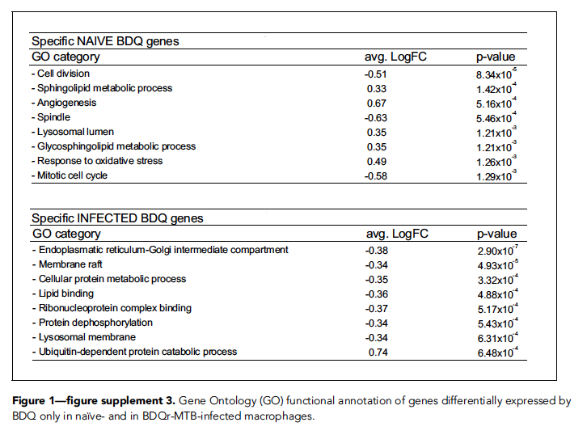
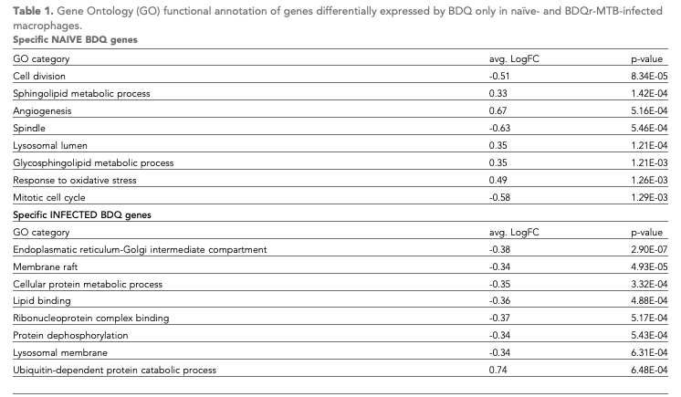
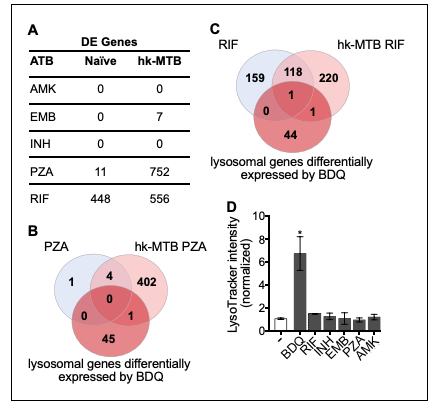
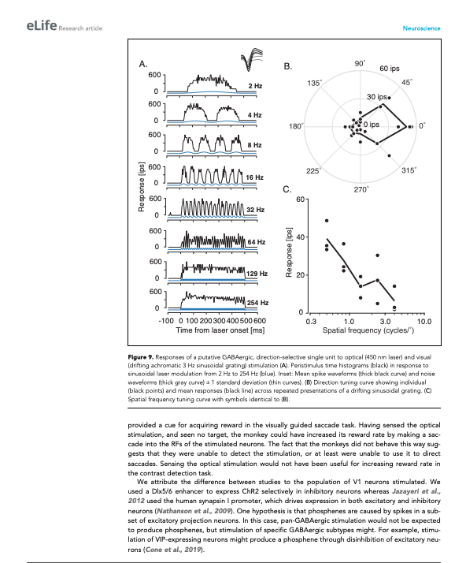
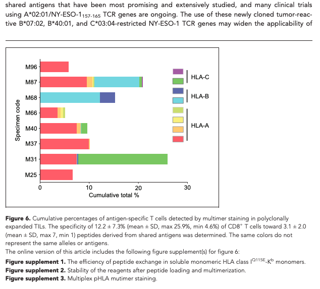
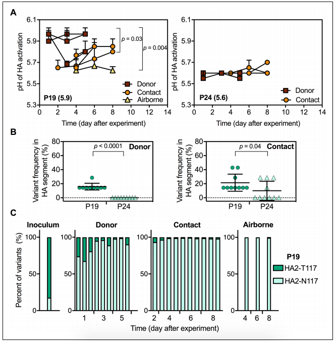
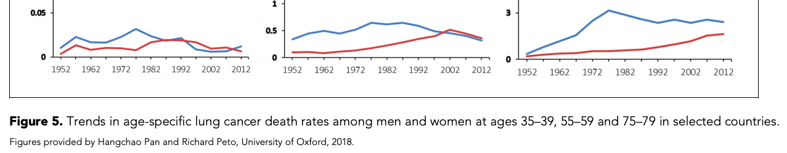
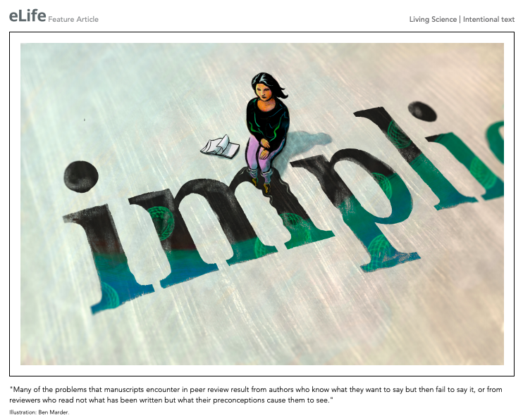
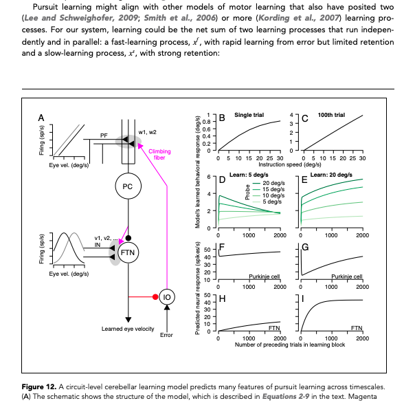
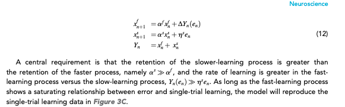

# Figures and figure supplements


For changelog, click [**here**](untitled.md#changelog).


Most scientific articles include figures and figure supplements to present data. eLife figures can also have [**various assets**](./) ****related to them. All figures and figure supplements must have titles, and usually also have captions \(although this is not mandatory\).

## What needs to be checked?

* Resolution of figures
* Presence of tables in figures
* Part labels 
* Permissions information if required

## Figure files

### Resolution of figures

Figures and figure supplements should be checked to ensure they are of good quality. If an image has especially poor resolution or the text is illegible, the author should be asked to provide a higher resolution version with the following query:

* The image for this figure appears to be of low quality. Please provide a higher resolution version.

### Tables in figures

We strongly discourage authors from providing tables represented as figures or figure supplements because figures are flat images and the contents of them cannot be mined or re-used without the need to rekey the content. If the authors have provided a table as a figure, the production team will need to be queried to ask the authors to provide this information as a table in Word or Excel format. If the author has not cited this "figure" in the text \(for instance because it is a figure supplement\) they will also need to add a citation to the new table in the main text.

For example, in 55692, Figure 1 - figure supplement 3 was originally provided as an image:



The authors were asked to provide this as an editable file and it was changed to a table in the final version: 



The author may also be given the option to convert the table to source data instead depending on the content. If the table was provided as a figure supplement this would become Figure x - Source data x; if it was provided as a main figure this would become source data attached to the document as a whole.

If one of the panels in a figure is a table, this can be left as-is:



### Multi-page files


If an author provides a PDF file over multiple pages we cannot process this as a single figure. The production team will need to be queried to ask the authors for single-page figures. If each "page" contains a small image that could be a part of a complete composite figure the author should be asked to supply the image as a single page with part labels. If the images on each page are a full figure and combining the images into one figure would render them unreadable the author should be asked to split the individual pages up into separate figures or figure supplements. 

### Labelling issues

If the authors have included unlabelled images in their article file that do not correspond to the main figures, the production team should be queried to determine how to treat these images. In most cases, these images will need to be treated as chemical structures or schemes.

### PDF version

The following applies to research content \([**Feature content**](../feature-content.md) templates have separate rules\). Figures can be either:

1. Full-page width, across the text column and the gutter \(140mm\)
2. Column width, across just the width of the text column \(100mm\)
3. Half-column width, occupying the left 50% of the width of the text column, with the text flowing around the image block on the right \(50mm\) 





In each case, the legend should be the same width as the image block and the figure should occupy as much of the available space as possible, left aligned but preferably with little to no whitespace on the right. If the image is particularly tall, this may result in there being more whitespace on the right. The appropriate width of the figure block should be determined by the resolution and aspect ratio of the supplied image. For smaller figures, these can be left the size they are:



### Accompanying text

All figures and figure supplements should have titles. Legends are not required but will usually be provided. If titles are not present, the following author query will need to be added to ask the author to provide these:

* Please provide the title for this figure.

If the author has only provided a legend that begins with a description of panel A \(e.g. “\(a\) The high-resolution MS/MS spectrum of the H4K31ac peptide generated from . . .”\), the same query as above will need to be left to ask the authors to add an overall title.

### Part labels

Part labels should be captured as such in Kriya \(by right-clicking and selecting 'part label'\). Please match the figure file when adding part labels in terms of upper/lowercase. If a figure contains labels A-G, check these have all been referred to in the legend. If they haven't, leave the following author query:

* The image file for Figure X contains panel label "Y", but this has not been provided in the figure legend. Please add a reference to this panel to the figure legend, or provide an updated figure file with this label removed.

If the legend refers to figure panels that are not in the figure file, the following author query should be left:

* The legend for Figure X refers to panel label "Y", but this has not been provided in the figure file. Please provide an updated figure file containing label "Y", or remove this label from the legend.


Make sure 'X' and 'Y' are replaced with the appropriate figure number and panel letters. Make sure if there are multiple missing panels/panel references that the text is adapted to use plurals, for example:

* The image file for Figure X contains panel label**s** "**Y–Z**", but **these have** not been provided in the figure legend \[...\]
* The legend for Figure X refers to panel label**s** "**Y–Z**", but **these have** not been provided in the figure file \[...\]


If there are sub-parts that refer to figure panels \(e.g. A', A'', or A\(I\), \(II\)\) and the author has cited these in the text \(I.e. 'Figure 2Ai'\) make sure these are also captured consistently as part labels. Figure sub-parts that haven't been cited in the text don't need to be captured as part labels. The main thing is to be consistent within an article.

Make sure part labels are not automatically added to every letter/number in a figure caption. For example in Figure 8 of 56236, some of the graphs included the text 'P19' and 'P24':



These were incorrectly captured as part labels in the title:


As these do not refer to figure panels, they were changed to plain text in the final article.

### In-text citations

All main figures must be cited in the article text. If these have not been cited, the following query should be left:

* Please provide an in-text citation for this figure.

Figure supplements do not have to be cited in the text though it is preferable that they are. If a figure or figure supplement is cited in the text but the corresponding file has not been provided, the author must be queried to provide the missing file with one of the queries below. 

* Please provide the image file for this figure \(do we need to add this in AQ list?\)
* Please provide the image file for this figure supplement.
* Figure X is cited in the text but has not been provided. Please either correct the citation, provide the figure file and a title and legend, or confirm that this citation refers to another article.

Please be aware that sometimes authors may cite a figure from another article. Citations of figures in other articles should be left as plain text. They can be identified by the context of the citation - for instance, “Figure 1 in Smith et al., 1990” refers to Figure 1 in Smith et al., 1990 and not to Figure 1 of the current article. Similarly, “\(see Jones et al., 2000 \[their Figure 2\]\)” references Figure 2 in Jones et al., 2000 and should stay as plain text. If the context is unclear, leave the following query:

* Figure X is cited in the text but has not been provided. Please either correct the citation, provide the figure file and a title and legend, or confirm that this citation refers to another article.

### Source code/data

Source data is often associated with figures and figure supplements. Each source data or source code file should be linked with the appropriate figure or figure supplement. For example, if a source data \(or code\) file is labelled Figure 1 - source data 1 but the title makes it clear that the data is linked to a figure supplement, it should be relabelled as Figure 1 - Figure supplement X - source data 1 \(or source code as appropriate\). If the source data or code is linked to multiple figures and figure supplements however, no further action is required. See more about source data and source code \(links to be added\).

### Adapted and reproduced images

Figures and figure supplements \(or panels within these\) may be 'adapted' from previously published content. This usually means that the authors are not reproducing anything directly but are instead redrawing a figure or simply using the same data to create new content. As long as the authors provide a suitable citation and state clearly, for example, that “Panel A in Figure 2 has been adapted from Smith and Jones, 2015”, no further action is required.

If the legend for a figure or figure supplement states that the image is ‘reprinted from’ or ‘reproduced from’, we may need to add licensing information for the reproduced elements. This will usually apply to panels within images, not whole images.

If the previously published content was published under a [**CCBY**](https://creativecommons.org/licenses/) or [**CC0**](https://creativecommons.org/share-your-work/public-domain/cc0/) license, the work must be properly attributed and credited \(provide full citation details and license\). If this matches the license of the article \(check the permissions-info message in the xml\), it does not need to be tagged differently in the underlying XML because it is following the license of the article. However, if the article you are working on is CC0, but the reproduced figure is CCBY, this needs to be indicated in the underlying XML and so requires specific tagging.  

If the authors chose to exactly reproduce a figure or section from a previously published, non-open access/non-CCBY article in part or in whole, it will need to be published under a separate license. This is because the original publication will have been published under a license that retains copyright. An article published in Nature, for example, will be copyright to the Nature Publishing Group, and articles published in Science will be copyright to the American Association for the Advancement of Science and so on. If eLife is to reproduce the contents of these articles, it must make it clear that the publisher retains copyright on that content, and that it is therefore not covered by the CCBY or CC0 license that covers the rest of the eLife article. The same issue applies when authors incorporate images from other copyrighted media into their figures \(e.g. if they use film stills or artwork\).

If the authors chose to reproduce copyrighted images in their figures, they must state what has been reproduced in the legend. In addition to this, a permissions statement must be added to the figure in the XML giving the license details for the reproduced image. The permissions text may have been provided already as part of the figure or figure supplement legend. If so, it should be removed and moved into the permissions tagging.

The editorial team check figure permissions as part of submission quality checks. They will leave a note for Exeter if permissions information needs to be added to the XML, for example:

> FAO Exeter: Figure Permissions
>
> copyright-year: 2009  
> copyright-holder: Elsevier  
> permissions: Figure 1A is reprinted from Simonetta, et al, 2009, with permission from Elsevier. It is not covered by the CC-BY 4.0 licence and further reproduction of this panel would need permission from the copyright holder.

This information would then need to be added in the XML:

```markup
<permissions>
<copyright-statement>© 2009 Elsevier</copyright-statement>
<copyright-year>2009</copyright-year>
<copyright-holder>Elsevier</copyright-holder>
<license>
<license-p>
Panel A is reprinted from
<xref ref-type="bibr" rid="bib40">Simonetta et al., 2009</xref>
, with permission from Elsevier. It is not covered by the CC-BY 4.0 licence and further reproduction of this panel would need permission from the copyright holder.
</license-p>
</license>
</permissions>
```


### Attributions

If an image has no copyright but the authors would like to credit the person who provided it, an attribution tag can be added to the figure. For example, Figure 5 in 49979 includes the following in the caption:



This has been added as an &lt;attrib&gt; element in the xml.

```markup
<fig id="fig5" position="float">
<label>Figure 5.</label>
<caption>
<title>Trends in age-specific lung cancer death rates among men and women at ages 35–39, 55–59 and 75–79 in selected countries.</title>
</caption>
<graphic mime-subtype="tiff" mimetype="image" xlink:href="elife-49979-fig5-v2.tif"/>
<attrib>Figures provided by Hangchao Pan and Richard Peto, University of Oxford, 2018.</attrib>
</fig>
```

## **Author response figures**

After a paper has been peer reviewed, the Reviewing Editor collates the reviewers’ comments into a single letter to the corresponding author, outlining the consolidated list of recommendations in the decision letter. Corresponding authors then have the opportunity to respond to the comments in the author response letter. Authors may include figures and videos in this letter. These have the same requirements as main figures in terms of resolution, tables, and attribution information. It is preferred, but not necessary for these to have titles. If these are missing at pre-author stages, the following query should be added:

* Please provide the title for this X \(figure/video/table\).

## Schematron checks

### Content checks

These checks relate to the content of figures and figure supplements. X or XXXXXX refers to quoted text which will change depending on the article.

#### fig-xref-target-test

**Error:** _xref with @ref-type='XXXXXX' points to XXXXXX. This is not correct._

_D1_

#### fig-caption-test-1

**Warning**: _Caption for XXXXXX contains what looks like a lower case letter at the start of a sentence - XXXXXX._

**Action:** In some cases, a sentence will begin with a lower case letter. This is fine to leave if the word is a recognised scientific term - you can check against the rest of the article to see if it is used elsewhere. Otherwise, please make sure every sentence begins with a capital letter. If this warning fires because a sentence in the caption begins '\(A\) and \(B\)' this is fine to ignore.

#### fig-caption-test-2

**Warning:** _Caption for XXXXXX contains what looks like an image credit. It's quite likely that this should be captured in an &lt;attrib&gt; element instead - XXXXXX_

**Action:** If the caption for a figure or figure supplement includes 'image credit', this message will appear. This information should be added in an &lt;attrib&gt; element \(see here\).

#### fig-group-test-1

**Error:** _fig-group must have one and only one main figure._

**Action:** In the xml, the fig-group element contains a figure and its figure supplement\(s\) and/or figure video\(s\). This element will only be present if the figure has figure supplement\(s\) and/or figure video\(s\). This error will appear if a fig-group element has more than one or no main figures. Double check which main figure should be present in this fig-group and correct accordingly \(Exeter will need to fix this\).

#### fig-group-test-2

**Error:** _fig-group does not contain a figure supplement or a figure-level video, which must be incorrect._

**Action:** In the xml, the fig-group element contains a figure and its figure supplement\(s\) and/or figure video\(s\). This element will only be present if the figure has figure supplement\(s\) and/or figure video\(s\). This error will appear if a fig-group element has no figure supplements or figure-level videos. Double check whether the figure does indeed have no linked figure supplements or videos - if so this element should be removed by Exeter. If the figure should have figure supplements or videos, Exeter will need to add these to the fig-group.

#### fig-group-child-test-1

**Error:** _XXXXXX_ _is not allowed as a child of fig-group._

#### fig-group-child-test-2

**Error:** _which is a child of fig-group, must have an @mimetype='video' - i.e. only video type media is allowed as a child of fig-group._

_D1_

#### fig-test-2

**Error:** _fig must have a @position._

**Action:** This error will appear if a figure or figure supplement does not have a position in the XML. This may be because the figure has not been cited in the text. Check the article for any unlinked citations of the figure and link these \(unless the citations are to figures from another paper - see [**here**](untitled.md#in-text-citations) for more information\). If the figure has not been cited in the text at all, please leave the following query: 

* Please provide an in-text citation for this figure.

If the figure has been cited in the text and this error still appears, Exeter will need to fix this.

#### fig-test-3

**Error:** _fig must have a label._

**Action:** All figures and figure supplements in research content should have the label 'Figure X' or 'Figure supplement X'. This error will appear if a figure does not have a label and will need to be corrected by Exeter.

#### feat-fig-test-3

**Warning:** _fig doesn't have a label. Is this correct?_

**Action:** This will appear in Feature content if a figure does not have the label 'Figure X'. Check the original submitted document to see whether there should be a label. If so, this will need to be added by Exeter. If the original version does not have a label, this is ok to leave. For example, in 58965:



#### pre-fig-test-4

**Warning:** _XXXXXX has no title or caption \(caption element\). Ensure this is queried with the author._

**Action:** This warning will appear at the pre-author stages if a figure has no title or caption element. Double-check the submitted manuscript for the figure title. If this has not been provided, the following author query should be left:

* Please provide the title for this figure.

If the caption element is missing in the XML, compare with the original submitted document to see what is missing. Exeter will need to fix this.

#### final-fig-test-4

**Error:** _XXXXXX has no title or caption \(caption element\)._

**Action:** This warning will appear at the post-author stages if a figure has no title or caption element. Double-check the submitted manuscript for the figure title. If this has not been provided, the authors will need to be asked for this.

If the caption element is missing in the XML, compare with the original submitted document to see what is missing. Exeter will need to fix this.

#### pre-fig-test-5

**Warning:** _XXXXXX does not have a title._

**Action:** This warning will appear at the pre-author stages if a figure has no title. Double-check the submitted manuscript for the figure title. If this has not been provided, the following author query should be left:

* Please provide the title for this figure.

#### final-fig-test-5

**Error:** _fig caption must have a title._

**Action:** This warning will appear at the post-author stages if a figure has no title. Double-check the submitted manuscript for the figure title. If this has not been provided, the authors will need to be asked for this.

#### fig-test-6

**Warning:** _Figure does not have a legend, which is very unorthadox. Is this correct?_

**Action:** This warning will appear if a figure has no caption. Double-check the submitted manuscript for the caption and add it in if it is missing. If no caption was provided in the manuscript, this is ok to leave. 

#### pre-fig-test-7

**Warning:** _fig does not have graphic. Ensure author query is added asking for file._

**Action:** This warning will appear at the pre-author stages if no file has been provided for a figure or figure supplement. Leave one of the following author queries as relevant:

* Please provide the image file for this figure. \(need to add this query?\)
* Please provide the image file for this figure supplement.

#### final-fig-test-7

**Error:** _fig must have a graphic._

**Action:** This warning will appear at the post-author stages if no file has been provided for a figure or figure supplement. The authors will need to be asked for the file. 

#### label-fig-group-conformance-1

**Error:** _XXXXXX is not placed in a &lt;fig-group&gt; element, which is incorrect. Either the label needs updating, or it needs moving into the &lt;fig-group&gt;._

#### label-fig-group-conformance-2

**Error:** _XXXXXX contains the string 'Figure' but it's not placed in a &lt;fig-group&gt; element, which is incorrect. Either the label needs updating, or it needs moving into the &lt;fig-group&gt;._

#### distinct-label-conformance

**Error:** _Duplicated labels - XXXXXX is present more than once in the text._

**Action:** This error will appear if multiple figures have the same label. All figures and figure supplements in research content should have distinct labels which are numbered in the order they are first cited in the text. Check the manuscript to see what the correct labels should be - Exeter will need to fix this.

#### pre-fig-specific-test-2

**Warning:** _XXXXXX does not appear in sequence. Relative to the other figures it is placed in position XXXXXX. Please query this with the author._

**Action:** Figures are automatically placed directly after their first citation. ****This warning usually appears if the authors have cited figures out of order. For example, if they refer to Figure 3 before Figure 2, this results in Figure 3 being placed before Figure 2. Unlink the citation that is out of order and leave the following query for the author:

* This citation is out of sequence with the other figure citations and has therefore been left unlinked \(figure placement is determined by first live citation\). Please confirm this is acceptable.

If multiple figures are out of sequence, leave the following query for the author instead:

* Our system numbers figures based on when they are first cited. Please conform these figures can be renumbered or provide in-sequence citations for these.

#### final-fig-specific-test-2

**Error:** _XXXXXX does not appear in sequence which is incorrect. Relative to the other figures it is placed in position XXXXXX._

**Action:** Figures are automatically placed directly after their first citation. ****This error usually appears if the authors have cited figures out of order. For example, if they refer to Figure 3 before Figure 2, this results in Figure 3 being placed before Figure 2. The authors will need to be asked to provide in-sequence citations or confirm the figures can be renumbered. If the citations are not out of order, Exeter will need to fix this.

#### fig-specific-test-3

**Warning:** _XXXXXX is cited, but does not appear directly after the paragraph citing it. Is that correct?_

**Action:** Figures should always be placed in the XML directly after the paragraph in which they are first cited, unless the paragraph is immediately followed by a display formula, in which case the figure should be placed at the first appropriate place. This check doesn't take into account 'Figure 1-3' type links, so if the warning is linked to this type of figure citation, it can be ignored. Otherwise, make sure the figure is moved directly after its first citation.

#### pre-fig-specific-test-4

**Warning:** _There is no citation to XXXXXX Ensure to query the author asking for a citation._

**Action:** This will appear at the pre-author stages if a main figure has no in-text citations. Leave the following author query:

* Please provide an in-text citation for this figure.

#### final-fig-specific-test-4

**Warning:** _There is no citation to XXXXXX Ensure this is added._

**Action:** This will appear at the post-author stages if a main figure has no in-text citations. Email the authors to ask for this. 

#### feat-fig-specific-test-4

**Warning:** _There is no citation to XXXXXX Is this correct?_

**Action:** This will appear in feature content if a main figure has no in-text citations. Check the submitted manuscript to see if this should be the case. If the original version had an in-text citation for the figure, double-check with Features whether they meant to remove this. If so, this warning can be ignored - otherwise add the in-text citation. If the original version didn't have an in-text citation for the figure, this warning can be ignored.

#### fig-specific-test-5

**Warning:** _XXXXXX is immediately followed by a display formula, and preceded by a paragraph which does not end with punctuation. Should it should be moved after the display formula or after the para following the display formula?_

**Action:** As figures are automatically placed after their first citation, this can sometimes result in figures being placed in the middle of equations, which breaks the flow of the text. Check whether this is the case - if so, the figure will need to be moved to after the display formula, or after the next paragraph. For example, in 55217, equation 12 should appear after the paragraph below. Instead, Figure 12 has been placed here, which breaks the flow of the text. Figure 12 should appear after equation 12.





#### fig-specific-test-6

**Warning:** _XXXXXX is immediately followed by a display formula, and preceded by a paragraph which does not end with punctuation. Should it should be moved after the display formula or after the para following the display formula?_

**Action:** As figures are automatically placed after their first citation, this can sometimes result in figures being placed in the middle of equations, which breaks the flow of the text. Check whether this is the case - if so, the figure will need to be moved to after the display formula, or after the next paragraph. See [**fig-specific-test-5**](untitled.md#fig-specific-test-5) for a similar case. 

#### fig-sup-test-2

**Error:** _fig in the body of the article which has a @specific-use='child-fig' must have a label in the format 'Figure X—figure supplement X.' \(where X is one or more digits\)._

**Action:** __All figure supplements in research content should have the label 'Figure X—figure supplement X.' This error will appear if a figure supplement does not have this label. Exeter will need to fix this. 

#### fig-sup-test-3

**Error:** _XXXXXX does not start with the main figure number it is associated with - XXXXXX._

**Action:** __All figure supplements in research content should have the label 'Figure X—figure supplement X.' This error will appear if a figure supplement has a label which doesn't begin with the figure number it is associated with. Exeter will need to fix this. 

#### fig-sup-test-4

**Error:** _XXXXXX does not appear in sequence which is incorrect. Relative to the other figures it is placed in position XXXXXX._

**Action:** Figures are automatically placed directly after their first citation. ****This warning usually appears if the authors have cited figures out of order. For example, if they refer to Figure 3 — Figure supplement 2 before Figure 3 — figure supplement 1, this results in Figure 3 — Figure supplement 2 being placed before Figure 3 — figure supplement 1. Unlink the citation that is out of order and leave the following query for the author:

* This citation is out of sequence with the other figure citations and has therefore been left unlinked \(figure placement is determined by first live citation\). Please confirm this is acceptable.

If multiple figures are out of sequence, leave the following query for the author instead:

* Our system numbers figures based on when they are first cited. Please conform these figures can be renumbered or provide in-sequence citations for these.

#### fig-sup-test-5

**Error:** _XXXXXX is in position XXXXXX, which means either the label or the placement incorrect._

#### fig-sup-test-6

**Error:** _XXXXXX label ends with XXXXXX, but the id \(XXXXXX\) ends with XXXXXX, so one must be incorrect._

#### ar-fig-test-2

**Error:** _Author Response fig must have a label._

**Action:** Author response images must have the label 'Author response image X'. This error will appear if an author response image does not have a label and will need to be corrected by Exeter.

#### pre-ar-fig-test-3

**Warning:** _Author Response fig does not have graphic. Ensure author query is added asking for file._

**Action:** This warning will appear at the pre-author stages if no file has been provided for an author response image. Production will need to be queried to check the AWS bucket to see if this was provided in the decision letter, and will send the image to Exeter if so. If it wasn't, please leave the following query.

* Please provide the image file for this figure. \(need to add this query?\)

#### final-ar-fig-test-3

**Error:** _Author Response fig must have a graphic._

**Action:** This error will appear at the post-author stages if no file has been provided for an author response image. Check the AWS bucket to see if this was provided in the decision letter and send the image to Exeter to replace if so. If it wasn't, editorial will need to be asked for this.

#### pre-ar-fig-position-test

**Warning:** _XXXXXX does not appear in sequence which is likely incorrect. Relative to the other AR images it is placed in position XXXXXX._

#### final-ar-fig-position-test

**Error:** _XXXXXX does not appear in sequence which is incorrect. Relative to the other AR images it is placed in position XXXXXX._

#### resp-fig-test-2

**Error:** _fig must have a label._

#### reply-fig-test-2

**Error:** _fig label in author response must be in the format 'Author response image 1.', or 'Chemical Structure 1.', or 'Scheme 1.'._

#### dec-fig-test-1

**Error:** _fig must have a label._

#### dec-fig-test-2

**Error:** _fig label in author response must be in the format 'Decision letter image 1.'._

#### box-fig-test-1

**Error:** _label for fig inside boxed-text must be in the format 'Box 1—figure 1.', or 'Chemical structure 1.', or 'Scheme 1'._

#### app-fig-test-1

**Error:** _label for fig inside appendix must be in the format 'Appendix 1—figure 1.', 'Appendix A—figure 1.', or 'Appendix 1—chemical structure 1.', or 'Appendix A—scheme 1'._

#### app-fig-test-2

**Error:** _label for XXXXXX does not start with the correct appendix prefix. Either the figure is placed in the incorrect appendix or the label is incorrect._

#### app-fig-sup-test-1

**Error:** _label for fig inside appendix must be in the format 'Appendix 1—figure 1—figure supplement 1.'._

#### app-fig-sup-test-2

**Error:** _label for XXXXXX does not start with the correct appendix prefix. Either the figure is placed in the incorrect appendix or the label is incorrect._

#### fig-title-test-1

**Warning:** _'XXXXXX' appears to have a title which is the begining of a caption. Is this correct?_

#### fig-title-test-2

**Error:** _title for XXXXXX must end with a full stop._

#### fig-title-test-3

**Warning:** _title for XXXXXX ends with 'vs.', which indicates that the title sentence may be split across title and caption._

#### fig-title-test-4

**Error:** _title for XXXXXX begins with a space, which is not allowed._

#### fig-title-test-5

**Warning:** _title for XXXXXX begins with punctuation. Is this correct? - XXXXXX_

#### fig-title-test-6

**Warning:** _title for XXXXXX begins with 'XXXXXX' - XXXXXX. It is very likely that this requires an overall title instead._

### XML structure checks

These checks relate to the XML structure of figures and figure supplements. ‌X or XXXXXX refers to quoted text which will change depending on the article. For more information about what the XML should look like, see [**below**](untitled.md#xml-structure).

#### fig-id-test-1

**Error:** _fig must have an @id in the format fig0 \(or C0 for chemical structures, or S0 for Schemes\). XXXXXX does not conform to this._

#### fig-id-test-2

**Error:** _fig must have an @id in the format fig0. XXXXXX does not conform to this._

#### fig-sup-id-test

**Error:** _figure supplement must have an @id in the format fig0s0. XXXXXX does not conform to this._

#### box-fig-id-1

**Error:** _fig must have @id in the format box0fig0. XXXXXX does not conform to this._

#### box-fig-id-2

**Error:** _fig id \(XXXXXX\) does not contain its ancestor boxed-text id. Please ensure the first part of the id contains 'XXXXXX'._

#### app-fig-id-test-1

**Error:** _figures in appendices must have an @id in the format app0fig0. XXXXXX does not conform to this._

#### app-fig-sup-id-test

**Error:** _figure supplements in appendices must have an @id in the format app0fig0s0. XXXXXX does not conform to this._

#### resp-fig-id-test

**Error:** _fig in decision letter/author reponse must have @id in the format respfig0, or sa0fig0. XXXXXX does not conform to this._

#### resp-fig-sup-id-test

**Error:** _figure supplement in decision letter/author reponse must have @id in the format respfig0s0 or sa0fig0s0. XXXXXX does not conform to this._

#### fig-specific-test-1

**Error:** _fig label contains 'supplement', but it does not have a @specific-use='child-fig'. If it is a figure supplement it needs the attribute, if it isn't then it cannot contain 'supplement' in the label._

#### fig-label-test-1

**Error:** _fig label must be in the format 'Figure 0.', 'Chemical structure 0.', or 'Scheme 0'._

**Action:** This error will fire if a figure has a label other than Figure X, Chemical structure X or Scheme X. Exeter will need to fix this.

#### fig-sup-test-1

**Error:** _fig supplement is not a child of fig-group. This cannot be correct._

#### fig-xref-conformity-1

**Error:** _XXXXXX - figure citation does not contain any numbers which must be incorrect._

#### fig-xref-conformity-2

**Error:** _XXXXXX - figure citation does not appear to link to the same place as the content of the citation suggests it should._

#### fig-xref-conformity-3

**Warning:** _XXXXXX - figure citation does not appear to link to the same place as the content of the citation suggests it should._

#### fig-xref-conformity-4

**Error:** _XXXXXX - figure citation links to a figure, but it contains the string 'supplement'. It cannot be correct._

#### fig-xref-conformity-5

**Warning:** _figure citation stands alone, contains the text XXXXXX, and links to a figure supplement, but it does not contain the string 'supplement'. Is it correct? Preceding text - 'XXXXXX'_

#### fig-xref-conformity-6

**Error:** _figure citation contains the text XXXXXX but links to a figure supplement with the id XXXXXX which cannot be correct._

#### fig-xref-test-2

**Warning:** _There is no space between citation and the preceding text - XXXXXX - Is this correct?_

#### fig-xref-test-3

**Warning:** _There is no space between citation and the following text - XXXXXX - Is this correct?_

#### fig-xref-test-4

**Warning:** _XXXXXX - Figure citation is in the caption of the figure that it links to. Is it correct or necessary?_

**Action:** If the figure citation refers to a figure from another paper, this needs to be changed to plain text. If it is simply referring to a panel in the same figure, it can be changed to a part label. 

For example, if the following text is in the caption of Figure 2:

* "See Figure 2A \(Smith et al., 2020\)." The citation 'Figure 2A' should be changed to plain text as it refers to a figure from another article.
* "\(B\) Further analysis of samples in Figure 2A." The 'Figure 2A' in this example should be changed to '\(A\)' as it is referring to a part label in the same figure.

If the citation doesn't refer to a part label, again check if it refers to a figure from another paper - if so, change it to plain text. If not then the citation can be removed entirely.

#### fig-xref-test-5

**Error:** _XXXXXX - Figure citation is in a reference to a figure from a different paper, and therefore must be unlinked._

#### fig-xref-test-6

**Warning:** _citation is preceded by a letter or number immediately followed by '\('. Is there a space missing before the '\('? - 'XXXXXX'._

#### fig-xref-test-7

**Warning:** _citation is followed by a '\)' which in turns is immediately followed by a letter or number. Is there a space missing after the '\)'? - 'XXXXXX'._

#### fig-xref-test-8

**Warning:** _Figure citation is preceded by 'their'. Does this refer to a figure in other content \(and as such should be captured as plain text\)? - 'XXXXXX'._

#### fig-xref-test-9

**Warning:** _Is this figure citation a reference to a figure from other content \(and as such should be captured instead as plain text\)? - XXXXXX'._

#### fig-xref-test-10

**Warning:** _Incomplete citation. Figure citation is followed by text which suggests it should instead be a link to a Figure supplement - XXXXXX'._

#### fig-xref-test-11

**Warning:** _Incomplete citation. Figure citation is followed by text which suggests it should instead be a link to a video supplement - XXXXXX'._

#### fig-xref-test-12

**Warning:** _Incomplete citation. Figure citation is followed by text which suggests it should instead be a link to source data or code - XXXXXX'._

#### fig-xref-test-13

**Warning:** _Figure citation is followed by text which suggests it could be an incomplete citation - XXXXXX'. Is this OK?_

#### fig-xref-test-14

**Warning:** _citation is preceded by 'XXXXXX'. The 'cf.' is unnecessary and should be removed._

#### fig-xref-test-15

**Error:** _Link - 'XXXXXX' - is incomplete. It should have 'figure' or 'Figure' spelt out._

#### fig-xref-test-16

**Warning:** _Figure citation - 'XXXXXX' - is preceded by the text 'XXXXXX' - should it be a figure supplement citation instead?_

#### fig-xref-test-17

**Warning:** _Figure citation - 'XXXXXX' - is followed by the text 'XXXXXX' - should this text be included in the link text too \(i.e. 'XXXXXX'\)?_

#### fig-xref-test-18

**Warning**: _Figure citation - 'XXXXXX' - is followed by the text 'XXXXXX' - should some or all of that text be included in the citation text?_

#### ar-fig-title-test-1

**Warning:** _Please query author for a XXXXXX title, and/or remove placeholder title text - XXXXXX._

#### fig-permissions-test-1 

**Error:** _permissions for XXXXXX has a copyright-statement, but not a copyright-year or copyright-holder which is incorrect._

**Action**: This will appear if the permissions statement has a copyright statement but no copyright year or holder. These should be added - query the Production team if you don't know what these should be.

#### fig-permissions-test-2

**Error:** _permissions for XXXXXX has a copyright-year, but not a copyright-statement or copyright-holder which is incorrect._

**Action**: This will appear if the permissions statement has a copyright year but no copyright statement or holder. These should be added - query the Production team if you don't know what these should be.

#### fig-permissions-test-3

**Error:** _permissions for XXXXXX has a copyright-holder, but not a copyright-statement or copyright-year which is incorrect._

**Action**: This will appear if the permissions statement has a copyright holder but no copyright statement or year. These should be added - query the Production team if you don't know what these should be.

#### fig-permissions-test-4

**Error:** _permissions for XXXXXX must contain a license-p element._

**Action**: This will appear if the permissions statement doesn't have a &lt;license-p&gt; element. 

#### fig-permissions-test-5

**Error:** _permissions for XXXXXX has XXXXXX &lt;copyright-statement&gt; elements, when there can only be 0 or 1._

**Action**: This will appear if a permissions statement has more than 1 &lt;copyright-statement&gt; element. Double-check which the correct statement should be by comparing the instructions given by the Production team.

#### fig-permissions-test-6

**Error:** _permissions for XXXXXX has XXXXXX &lt;copyright-holder&gt; elements, when there can only be 0 or 1._

**Action**: This will appear if a permissions statement has more than 1 &lt;copyright-holder&gt; element. 

#### fig-permissions-test-7

**Error:** _permissions for XXXXXX has XXXXXX &lt;copyright-year&gt; elements, when there can only be 0 or 1._

**Action**: This will appear if a permissions statement has more than 1 &lt;copyright-year&gt; element.

#### fig-permissions-test-8

**Error:** _permissions for XXXXXX has XXXXXX  elements, when there can only be 0 or 1._ 

#### fig-permissions-test-9: Rule: permissions for X has a `<license>` element, but not `<license-p>` element, which is incorrect.

#### fig-permissions-test-10: Rule: permissions for X has `<license-p>` elements, when there can only be 0 or 1.

#### fig-permissions-test-11: Rule: figure level permissions must either have a `<copyright-statement>` or a `<license>` element, but those for X have neither.

**Action**: All these messages refer to either missing or extra elements. When permissions information is required, make sure each of these elements is present. See [here](Figures#reproduced-images) for an xml example of permissions information.

#### fig-permissions-test-12: Rule: permissions - the `<license-p>` for all rights reserved type permissions should usually end with 'further reproduction of this panel/figure would need permission from the copyright holder.', but X's doesn't. Is this correct? \(There is no '[https://creativecommons.org/](https://creativecommons.org/)' type link so presumed ARR.\)

**Action**: If the `<copyright-statement>` for a figure includes 'All rights reserved', the permissions statement should end with 'further reproduction of this panel/figure would need permission from the copyright holder' - you just need to add it in if this is missing. If there is no '[https://creativecommons.org/](https://creativecommons.org/)' type link, the schematron will automatically assume the figure permission is 'All rights reserved'. See [here](Figures#reproduced-images) for an xml example of permissions information.

#### reproduce-test-1

**Warning:** _The caption for XXXXXX contains the text 'reproduced from', but has no permissions. Is this correct?_

#### reproduce-test-2

**Warning:** _The caption for XXXXXX contains the text 'reproduced with permission', but has no permissions. Is this correct?_

#### reproduce-test-3

**Warning:** _The caption for XXXXXX contains the text 'adapted from ...', but has no permissions. Is this correct?_

#### reproduce-test-4

**Warning:** _The caption for XXXXXX contains the text 'reprinted from', but has no permissions. Is this correct?_

#### reproduce-test-5

**Warning:** _The caption for XXXXXX contains the text 'reprinted from', but has no permissions. Is this correct?_

**Action:** If the caption mentions a figure or part of a figure is reproduced/reprinted from another paper \(there should be a citation to the paper\), we may need to [add permissions](Figures#reproduced-images).

#### reproduce-test-6

**Warning:** _The caption for XXXXXX contains the text 'modified from', but has no permissions. Is this correct?_

#### reproduce-test-7

**Warning:** _The caption for XXXXXX contains the text 'modified with', but has no permissions. Is this correct?_

#### reproduce-test-8

**Warning:** _The caption for XXXXXX contains the text 'used with permission', but has no permissions. Is this correct?_

## XML structure


## Changelog

After Exeter have fed back on the page and it has been updated, any further changes to the page should be listed in order from oldest to most recent.

### dd/mm/yyyy

#### Changes

* 
### dd/mm/yyyy

#### Changes

* 
