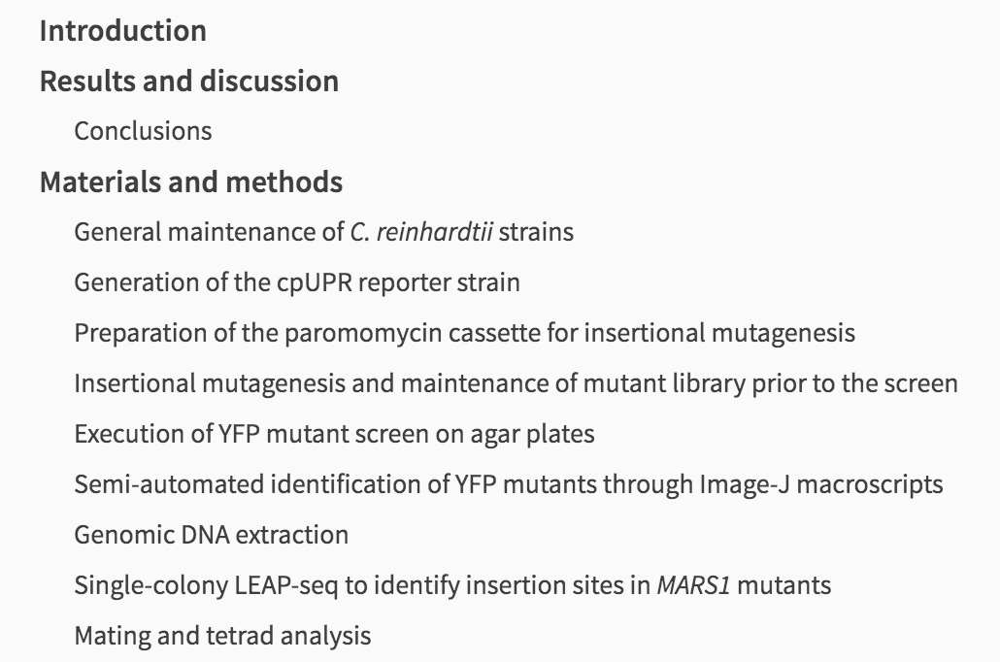
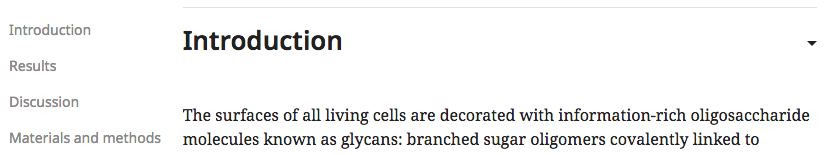
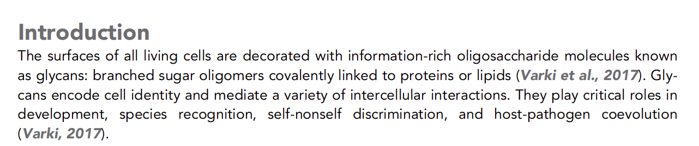
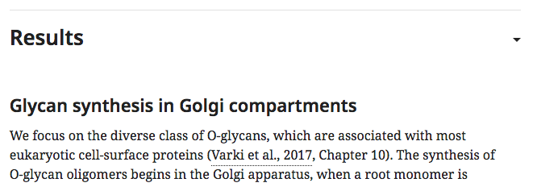
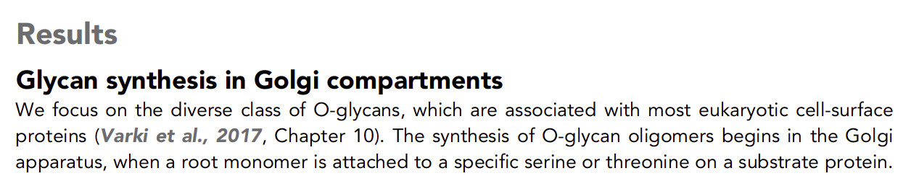
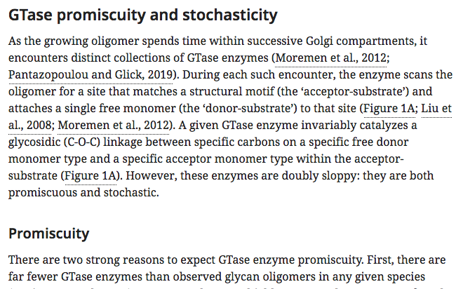
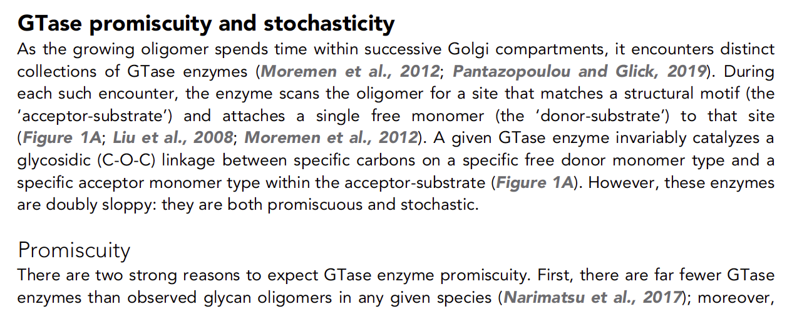

# Article structure

## What is article structure?

Article structure refers to the way in which the body of an article is organised. The main text will usually be split into multiple sections, each with a different title. Those sections may then contain sub-sections, those sub-sections, their own sub-sections, and so on.

These sections are usually discussed in terms of the heirarchy of their titles, referred to as 'headings'.

eLife currently allows four levels of headings:

* **Level 1** - top level heading that will appear within the jump-to menu on the published HTML view:

* **Level 2** - sub-section heading under a Level 1 heading:

* **Level 3** - sub-section heading under a Level 2 heading:

* **Level 4** - sub-section heading under a Level 3 heading.

Any number of Level 2, 3 or 4 headings may appear within their parent sections. However, eLife limits the number of Level 1 headings in research content to between one and four in most cases.

## Allowed article structures

The following are the allowed top-level structures for various different article types. These lists cover Level 1 headings only. There are no rules concerning heading levels 2–4 within these Level 1 sections.

### Research article

The usual structure for a research article is:

* Main text
  * **Introduction**
  * **Results**
  * **Discussion**
  * **Materials and methods**

A common variant of this is a combined results and discussion section:

* Main text
  * **Introduction**
  * **Results and discussion**
  * **Materials and methods**

Occasionally, the editors will allow the authors to place their materials and methods before the results, where this is appropriate \(this is a common structure in life sciences articles\):

* Main text
  * **Introduction**
  * **Materials and methods**
  * **Results**
  * **Discussion**

In other cases, if an article is more methodological rather than experimental, 'Methods' may be substituted for 'Materials and methods'. Please note that authors often just put 'Methods' in their article file and in most cases this needs to be changed to the standard heading. Where 'Methods' should be retained, a production note indicating this will be left by Editorial.

* Main text
  * **Introduction**
  * **Methods**
  * **Results**

    **Discussion**

Finally, for modelling articles, the following structure is allowed. This should be more commonly used in tools and resources articles.

* Main text
  * **Introduction**
  * **Model**
  * **Results**
  * **Discussion**

### Research advance

Research advances share the same structure rules as research articles.

### Short report

Short reports may follow the standard research article structure:

* Main text
  * **Introduction**
  * **Results**
  * **Discussion**
  * **Materials and methods**

However, they are not required to do so. The bulk of the text can be placed in an untitled section at the start of the article, with a materials and methods section at the end.

* Main text
  * **Materials and methods**

Materials and methods is the only mandatory top-level section for short reports.

### Tools and resources

Tools and resources articles may follow the standard research article structure:

* Main text
  * **Introduction**
  * **Results**
  * **Discussion**
  * **Materials and methods**

However, since this article type can be used to describe models, the following structure is also permitted:

* Main text
  * **Introduction**
  * **Model**
  * **Results**
  * **Discussion**

### Registered report

Registered reports will have the following article structure:

* Main text
  * **Introduction**
  * **Materials and methods**

### Replication study

Replication studies share the same structure rules as research articles.

### Scientific correspondence

Scientific correspondence articles may follow the standard research article structure:

* Main text
  * **Introduction**
  * **Results**
  * **Discussion**
  * **Materials and methods**

 However, this is not mandated and other Level 1 headings are permitted. The article structure should follow that indicated in the exported article file.

### Review article

There are no preset rules for Level 1 headings in review articles. The article structure should follow that indicated in the exported article file.

### Feature content

There are no preset rules for Level 1 headings in feature content. The article structure should follow that indicated in the exported article file.

## Schematron checks

#### ra-sec-test-1

**Error**: _At least one sec should be present in body for research-article content._

Action: This error indicates that there are no section elements &lt;sec&gt; within an article using the research content template.

#### ra-sec-test-2

**Warning**: XXXXXX doesn't have child sec\[@sec-type='intro'\] in the main body. Is this correct?

**Action**: This warning indicates that there is no section element `<sec>` with the type attribute `@sec-type` equal to 'intro'. If an Introduction section is present in an article, it must have the `@sec-type` with a value of 'intro'. An Introduction section should be present for all research content except for short reports, which may have one but do not need to.

#### ra-sec-test-3

**Warning**: _main body in XXXXXX content doesn't have a child sec with @sec-type whose value is either 'materials\|methods', 'methods' or 'model'. Is this correct?_

**Action**: This warning indicates that there is no section element `<sec>` with the type attribute `@sec-type` equal to 'materials\|methods', 'methods' or 'model'. If a Materials and methods, Methods, or Model section is present in an article, it must have the `@sec-type` with a corresponding value. One of these sections should be present in all research content.

#### ra-sec-test-4

Warning: \_main body in XXXXXX content doesn't have either a child sec\[@sec-type='results\|discussion'\] or a sec\[@sec-type='results'\] and a sec\[@sec-type='discussion'\]. Is this correct?

**Action**: This warning indicates that there is no section element `<sec>` with the type attribute `@sec-type` equal to 'results\|discussion', 'results' or 'discussion'. If a Results and discussion, Results, or Discussion section is present in an article, it must have the `@sec-type` with a corresponding value. One of these sections should be present in all research content.

#### top-sec-id

**Error**: _top-level must have @id in the format 's0', where 0 relates to the position of the sec. It should be XXXXXX._

**Action**: The Level 1 section elements `<sec>` in an article should each have an `@id` attribute, the value of which is determined by the order of the sections. The first Level 1 section should the id 's1', the second and id of 's2' and so on.

#### sec-conformity

**Warning**: _top level sec with title - XXXXXX - is not a usual title for XXXXXX content. Should this be captured as a sub-level of XXXXXX?_

**Action**: 

#### lower-sec-test-1

**Error**: This sec @id must be a concatenation of the parent sec @id, '-', and the position of this sec relative to other sibling secs - XXXXXX.

**Action**: Each sub-section element &lt;sec&gt; should have 

#### sec-type-title-test

**Warning**: title of a sec with an @sec-type='XXXXXX' should usually be 'XXXXXX'.

**Action**: The title of a section should correspond to the value of the `@sec-type`, if present. The full list of these values and the corresponding title text is as follows:

| Title | @sec-type |
| :--- | :--- |
| Introduction | intro |
| Results | results |
| Results and discussion | results\|discussion |
| Discussion | discussion |
| Materials and methods | materials\|methods |
| Methods | methods |
| Model | model |

Correct the title to match the `@sec-type` value.

#### body-top-level-sec-id-test

**Error**: This sec id must be a concatenation of 's' and this element's position relative to it's siblings. It must be XXXXXX.

**Action**: 

#### back-top-level-sec-id-test

**Error**: _This sec id must be a concatenation of 's' and this element's position relative to other top level secs. It must be XXXXXX._

**Action**:

#### low-level-sec-id-test

**Error**: sec id must be a concatenation of it's parent sec id and this element's position relative to it's sibling secs. It must be XXXXXX.

**Action:**

#### sec-test-1

**Error**: sec must have a title

**Action**: 

#### sec-test-2

**Error**: sec appears to contain no content. This cannot be correct.

**Action**: 

#### sec-title-list-check

**Warning**: Section title might start with a list indicator - 'XXXXXX'. Is this correct?

**Action:**

sec-title-appendix-check

**Warning**: Section title contains the word appendix - 'XXXXXX'. Should it be captured as an appendix?

**Action**: 

sec-title-appendix-check-2	sec/title	\*Warning\*: \_Shoudld the section titled 'XXXXXX' be captured as an appendix?\_

sec-title-abbr-check	sec/title	\*Warning\*: \_Section title contains the word abbreviation - 'XXXXXX'. Is it an abbreviation section? eLife house style is to define abbreviations in the text when they are first mentioned.\_

sec-title-content-mandate	sec/title	\*Error\*: \_Section title must not be empty.\_

sec-title-full-stop	sec/title	\*Warning\*: \_Section title ends with full stop, which is very likely to be incorrect - XXXXXX\_

sec-title-bold	sec/title	\*Error\*: \_All section title content is captured in bold. This is incorrect - XXXXXX\_

sec-title-underline	sec/title	\*Error\*: \_All section title content is captured in underline. This is incorrect - XXXXXX\_

sec-title-italic	sec/title	\*Warning\*: \_All section title content is captured in italics. Is this incorrect? If it is just a species name, then this is likely to be fine - XXXXXX\_

sec-title-dna	sec/title	\*Warning\*: \_Section title contains the phrase DNA, but it is not in all caps - XXXXXX\_

sec-title-rna	sec/title	\*Warning\*: \_Section title contains the phrase RNA, but it is not in all caps - XXXXXX\_

sec-title-dimension	sec/title	\*Warning\*: \_Section title contains lowercase abbreviation for dimension, when this should always be uppercase 'D' - XXXXXX\_

sec-title-hiv	sec/title	\*Warning\*: \_Section title contains the word HIV, but it is not in all caps - XXXXXX\_

section-title-test-1	sec/p/\*\[1\]\[not\(preceding-sibling::text\(\)\) or \(normalize-space\(preceding-sibling::text\(\)\)=''\)\]	\*Warning\*: \_text begins a paragraph - XXXXXX - Should it be marked up as a section title \(Heading level XXXXXX\)?\_

