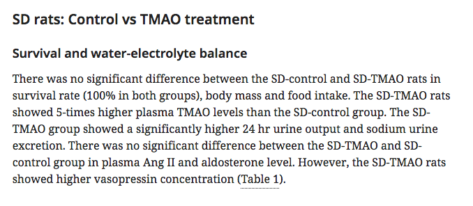
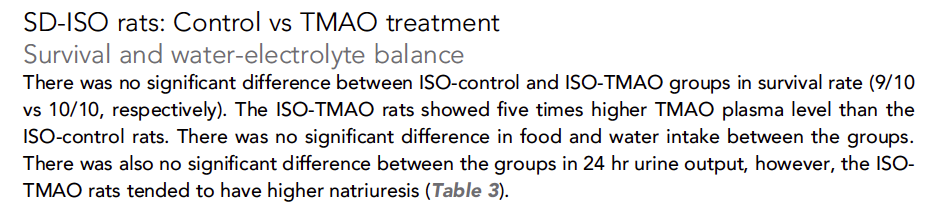
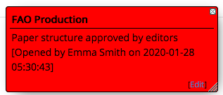
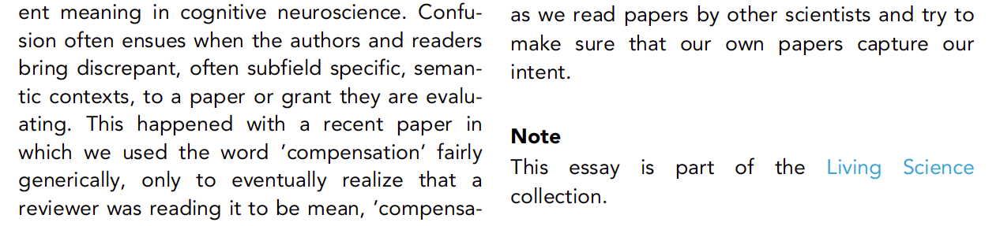
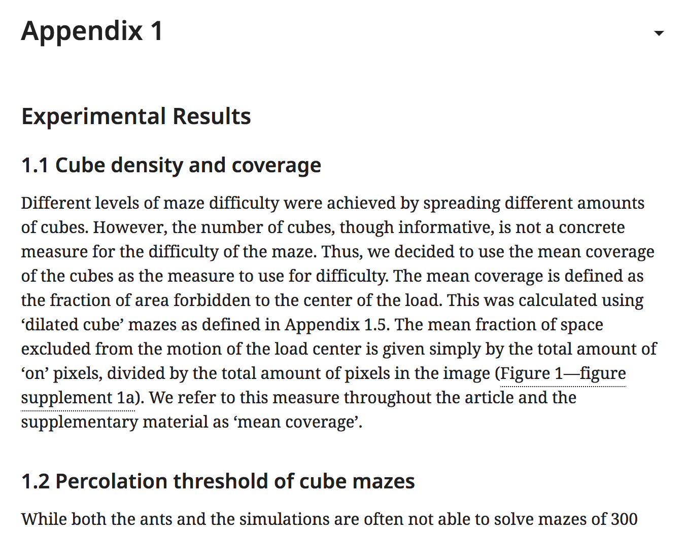

# Article structure


For the changelog, click [**here**](./#changelog). Updated 28/06/2021


## What is article structure?

Article structure refers to the way in which the body of an article is organised. The main text will usually be split into multiple sections, each with a different title. Those sections may then contain sub-sections, those sub-sections may have their own sub-sections, and so on.

These sections are usually discussed in terms of the hierarchy of their titles, referred to as 'headings'.


eLife currently allows four levels of headings:

* **Level 1** - top level heading that will appear in the jump-to menu on the published HTML view:


* **Level 2** - sub-section heading under a Level 1 heading:


* **Level 3** - sub-section heading under a Level 2 heading:


* **Level 4** - sub-section heading under a Level 3 heading.





Any number of Level 2, 3 or 4 headings may appear within their parent sections. However, eLife limits the number of Level 1 headings in research content to between one and four in most cases. Please note that levels cannot be skipped – for example, a Level 2 heading cannot be followed by a Level 4 heading. 

## Allowed article structures

The following are the allowed top-level headings for various different article types. These lists cover Level 1 headings only. There are no rules concerning heading levels 2–4 within these Level 1 sections.

### Research article

The usual structure for a research article is:

* Main text
  * **Introduction**
  * **Results**
  * **Discussion**
  * **Materials and methods**

A common variant of this combines the 'Results' and 'Discussion' sections:

* Main text
  * **Introduction**
  * **Results and discussion**
  * **Materials and methods**

Occasionally, the editors will permit the authors to place their 'Materials and methods' before the 'Results' \(this is a common structure in life sciences articles\):

* Main text
  * **Introduction**
  * **Materials and methods**
  * **Results**
  * **Discussion**

In other cases, if an article is more methodological rather than experimental, 'Methods' may be substituted for 'Materials and methods'. Please note that authors often just put 'Methods' in their article file and in most cases this needs to be changed to the standard heading. Where 'Methods' should be retained, a production note indicating this will be left by Editorial.

* Main text
  * **Introduction**
  * **Methods**
  * **Results**
  * **Discussion**

This is the standard structure for all articles with 'Medicine' or 'Epidemiology and Global Health' subject areas.

Finally, for modelling articles, the following structure is allowed. This will be more commonly used in tools and resources articles.

* Main text
  * **Introduction**
  * **Model**
  * **Results**
  * **Discussion**



### Research advance

Research advances share the same structure rules as research articles.

### Short report

Short reports may follow the standard research article structure:

* Main text
  * **Introduction**
  * **Results**
  * **Discussion**
  * **Materials and methods**

However, they are not required to do so. The bulk of the text can be placed in an untitled section at the start of the article, with a 'Materials and methods 'section at the end.

* Main text
  * **Materials and methods**

'Materials and methods' is the only mandatory top-level section for short reports.

### Tools and resources

Tools and resources articles may follow the standard research article structure:

* Main text
  * **Introduction**
  * **Results**
  * **Discussion**
  * **Materials and methods**

However, since this article type can be used to describe models, the following structure is also permitted:

* Main text
  * **Introduction**
  * **Model**
  * **Results**
  * **Discussion**

### Registered report

Registered reports will have the following article structure:

* Main text
  * **Introduction**
  * **Materials and methods**

### Replication study

Replication studies share the same structure rules as [**research articles**](./#research-article).

### Scientific correspondence

Scientific correspondence articles may follow the standard research article structure:

* Main text
  * **Introduction**
  * **Results**
  * **Discussion**
  * **Materials and methods**

However, this is not mandated and other Level 1 headings are permitted. The article structure should follow that indicated in the exported article file.

### Review article

There are no rules for headings in review articles. The article structure should follow that indicated in the exported article file.

### Feature content

There are no rules for headings in feature content. The article structure should follow that indicated in the exported article file.

If a feature article contains the heading 'Note' at the end of the text, this should be tagged as a Level 1 heading and should use the following alternative style in the PDF:



### Corrections and retractions

Corrections and retractions will not usually contain any section headings. Where they do, the article structure should follow that indicated in the exported article file.

## Section numbering

In most eLife articles, sections will not be numbered and Level 1 headings should in general not be numbered at all. However, numbered sub-sections are permitted within top-level sections and in appendices. The authors may use this to provide structure to their appendices or their Materials and methods section, allowing them to refer to, for example, Appendix 1.1, 1.2 etc without having to write out the full sub-section title.

On rare occasions, a review article may contain numbering at all levels. This will be flagged to the Editorial team during submission and a production note should indicate whether the numbering needs to be retained for publication.

The correct style for a numbered heading in an eLife articles is '1.1 Cube density and coverage', '1.2 Percolation threshold of cube mazes' etc.



## List of abbreviations

eLife articles do not have 'List of abbreviations' sections - if the authors have provided these, the abbreviations should be expanded the first time they are used in the main text and display elements \(e.g. figures, tables\). The section should then be deleted.  

## Schematron checks

### Content checks

#### sec-title-list-check

**Warning**: _Section title might start with a list indicator - 'XXXXXX'. Is this correct?_

**Action**: This warning will fire if a section title \(XXXXXX\) starts with a\), b\), c\) etc, or A\), B\), C\) etc. Check to make sure that this content is not actually intended as an entry in a list \(this may require checking the exported article file\). If it is, the heading styling should be removed and the content set correctly as a list.

#### sec-title-appendix-check

**Warning**: Section title contains the word appendix - 'XXXXXX'. Should it be captured as an appendix?

**Action**: This warning indicates that a section title \(XXXXXX\) starts with the word 'appendix' \(e.g. 'Appendix 1', 'Appendix A', 'Appendix: Supplementary methods'\). This section and its contents should be moved into an appendix.

#### sec-title-appendix-check-2

**Warning**: _Should the section titled 'XXXXXX' be captured as an appendix?_

**Action**: This warning indicates that a section title \(XXXXXX\) contains the word 'Supplementary' or 'Supplemental'. If this occurs in the context of, for example, 'Supplemental methods' or 'Supplemental results', it likely indicates content that the authors do not want to include in their main Materials and methods or Results sections. Such sections should be tagged as appendices, with the section title used as the title for each appendix.

#### sec-title-abbr-check

**Warning**: _Section title contains the word abbreviation - 'XXXXXX'. Is it an abbreviation section? eLife house style is to define abbreviations in the text when they are first mentioned._

**Action**: This warning will fire if a section title \(XXXXXX\) contains the text 'abbreviation', for example 'Abbreviations' or 'Abbreviation list'. Some authors will include a section like this, containing the definitions of every abbreviation used in their article. As the message states, eLife's house style is to define abbreviations within the text, at the first point they are used and at the end of figure/table/file legends. Ensure that all the abbreviations mentioned in the indicated section are defined at the first point they are used in the text, then delete the indicated section.

In rare cases, the authors may be permitted to retain an abbreviation list. If this warning fires post-author, check to see whether the atuhro has requested the abbreviation list be restored.

#### sec-title-content-mandate

**Error**: _Section title must not be empty._

**Action**: This error indicates that a section title exists without any text in it. This likely means that the text was deleted incompletely.

If this fires pre-author, check that the content has been processed into the proofing system correctly.

If this fires post-author, check the author's edits. If it is clear that they intended to delete the indicated section entirely \(either by removing the text or merging it into the preceding section\), delete the empty title. If this is not clear, contact the author to confirm their intentions.

#### sec-title-full-stop

**Warning**: _Section title ends with full stop, which is very likely to be incorrect - XXXXXX_

**Action**: Section titles must not end in full stops. Remove the full stop from the indicated section title.

#### sec-title-bold	

**Error**: _All section title content is captured in bold. This is incorrect - XXXXXX_

**Action**: Section titles do not need to be placed in bold font to be styled correctly. This formatting should be removed from the indicated section title.

#### sec-title-underline

**Error**: _All section title content is captured in underline. This is incorrect - XXXXXX_

**Action**: Section titles should not be underlined. Individual terms can be underlined for consistency with how those terms are presented in the main text, but if the entire title is underlined, this formatting should be removed.

#### sec-title-italic

**Warning**: _All section title content is captured in italics. Is this incorrect? If it is just a species name, then this is likely to be fine - XXXXXX_

**Action**: Section titles should not be entirely in italics unless they only consist of a species name such as _C. elegans_. Scientific terms such as species names should be put in italics, but italics should be removed from any accompanying text.

#### sec-title-dna	

**Warning**: _Section title contains the phrase DNA, but it is not in all caps - XXXXXX_

**Action**: This warning indicates the presence of 'dna', 'dNA', 'dNa' or other variation of 'DNA' not in all caps. Correct this text to 'DNA'.

#### sec-title-rna

**Warning**: _Section title contains the phrase RNA, but it is not in all caps - XXXXXX_

**Action**: This warning indicates the presence of 'rna', 'rNA', 'rNa' or other variation of 'RNA' not in all caps. Correct this text to 'RNA'.

#### sec-title-dimension

**Warning**: _Section title contains lowercase abbreviation for dimension, when this should always be uppercase 'D' - XXXXXX_

**Action**: This warning indicates that the abbreviation for dimension in, say, 2D, 3D, 4D etc, is a lowercase 'd'. Correct 2d, 3d, 4d etc to 2D, 3D, 4D etc.

#### sec-title-hiv	

**Warning**: _Section title contains the word HIV, but it is not in all caps - XXXXXX_

**Action**: This warning indicates the presence of 'hiv', 'hIV', 'hIv' or other variation of 'HIV' not in all caps. Correct this text to 'HIV'.

#### section-title-test-1

**Warning**: _text begins a paragraph - XXXXXX - Should it be marked up as a section title \(Heading level X\)?_

**Action**: This warning will fire if the entire first sentence of a paragraph is in bold font, italics or underlined. This may mean the authors intended this to be a section title. If this warning appears pre-author, the indicated text should be made into a section title. This should start a sub-section within whichever section originally contained this paragraph. The only exception to this rule is if this would involve making a sub-section under a Level 4 section, which is not permitted. In this case, the text should be left as it is.

If this warning appears post-author, check whether the author has reverted the above kind of change and, if so, that this makes sense \(they may prefer the text to appear as bold for highlighting purposes, but do not want it as a heading\).

XXXXXX will indicate the styled content at the start of a paragraph; X will be the suggested heading level respective to the heading level of the section in which the styled content appears.

#### sec-conformity

**Warning**: _top level sec with title - XXXXXX - is not a usual title for XXXXXX content. Should this be captured as a sub-level of XXXXXX?_

**Action**: This warning indicates that a Level 1 heading is present that does not match the allowed top-level headings \([**see here**](./#allowed-article-structures) for usual headings\). Check whether this heading should be tagged as Level 2, within the preceding Level 1 heading. This may require a check against the exported article file. If an unusual article structure has been approved by Editorial, this should be indicated in the production notes.

In cases where the authors have included a top-level heading that is similar to a permitted Level 1 heading \(e.g. 'Experimental results' or 'Discussion and conclusions'\) this should be corrected to match eLife style \('Results' and 'Discussion' in this case\).

#### conclusion-test-1

**Error**: _Top level section with title - XXXXXX - should either be made a level 2 section. Probably as a child of the XXXXXX section._

**Action**: This error indicates that a heading containing the word 'Conclusion' has been tagged as Level 1. This heading should be changed to a Level 2 heading, usually in the Discussion section. Pleaase note this rule does not apply to all article types.

#### conclusion-test-2

**Warning**: Level XXXXXX section with the title 'XXXXXX' should very likely be made a level 2 section.

**Action**: This error indicates that a heading containing the word 'Conclusion' has been tagged as Level 1. This heading should be changed to a Level 2 heading, usually in the Discussion section. Pleaase note this rule does not apply to all article types.

#### medicine-introduction

**Error**: The first top level section in a Medicine article should be 'Introduction'. This one is 'XXXXXX'.

**Action**: This error indicates that the first section title in the body of an article with the MSA Medicine and/or Epidemiology and Global Health has a title which is not Introduction. If the title is misspelt or contains a typo \(e.g. Intoduction\), then it can simply be corrected. If the first section title is Methods, but there are paragraphs of text before it which are introductory, then the section title is simply missing and can be added in. If neither of these are the case, Exeter should inform Production, who will contact the Editorial team to check whether the unorthodox structure is permitted. 

#### medicine-methods

**Error**: The second top level section in a Medicine article should be 'Methods' or 'Materials and methods'. This one is 'XXXXXX'.

**Action**: This error indicates that the second section title in the body of an article with the MSA Medicine and/or Epidemiology and Global Health has a title which is not Methods or Materials and Methods. If the title is misspelt or contains a typo \(e.g. Method\), then it can simply be corrected. If the section title is simply missing then it can be added in. If neither of these are the case, Exeter should inform Production, who will contact the Editorial team to check whether the unorthodox structure is permitted. 

#### medicine-results

**Error**: The third top level section in a Medicine article should be 'Results'. This one is 'XXXXXX'.

**Action**: This error indicates that the third section title in the body of an article with the MSA Medicine and/or Epidemiology and Global Health has a title which is not Results. If the title is misspelt or contains a typo \(e.g. Result\), then it can simply be corrected. If the section title is simply missing then it can be added in. If neither of these are the case, Exeter should inform Production, who will contact the Editorial team to check whether the unorthodox structure is permitted. 

#### medicine-discussion

**Error**: The fourth top level section in a Medicine article should be 'Discussion'. This one is 'XXXXXX'.

**Action**: This error indicates that the fourth section title in the body of an article with the MSA Medicine and/or Epidemiology and Global Health has a title which is not Discussion. If the title is misspelt or contains a typo \(e.g. Discussio\), then it can simply be corrected. If the section title is simply missing then it can be added in. If neither of these are the case, Exeter should inform Production, who will contact the Editorial team to check whether the unorthodox structure is permitted. 

### XML checks

#### ra-sec-test-1

**Error**: _At least one sec should be present in body for research-article content._

**Action**: This error indicates that there are no section elements `<sec>` within an article using the research content template. This most likely means that any headings in the original manuscript file have been left as plain text. Check against the export file and tag the headings as appropriate.

#### ra-sec-test-2

**Warning**: _XXXXXX doesn't have child sec\[@sec-type='intro'\] in the main body. Is this correct?_

**Action**: This warning indicates that there is no section element `<sec>` with the type attribute `@sec-type` equal to 'intro'. If an 'Introduction' section is present in an article, it must have the `@sec-type` with a value of 'intro'. An 'Introduction' section is mandatory for all research content \(except for short reports and scientific correspondence articles; this warning will not fire for these article types\).

Ensure the title is correctly tagged as a Level 1 heading and if this error persists, the Exeter support team will need to correct the attribute on the corresponding `<sec>` element.

If no 'Introduction' heading is present, one should be added at the very start of the article text.

#### ra-sec-test-3

**Warning**: _main body in XXXXXX content doesn't have a child sec with @sec-type whose value is either 'materials\|methods', 'methods' or 'model'. Is this correct?_

**Action**: This warning indicates that there is no section element `<sec>` with the type attribute `@sec-type` equal to 'materials\|methods', 'methods' or 'model'. If a 'Materials and methods', 'Methods', or 'Model' section is present in an article, it must have the `@sec-type` with a corresponding value. One of these sections should be present in all research content \(except for scientific correspondence articles; this warning will not fire for that article type\).

Ensure that the titles mentioned here are tagged as Level 1 headings and if this error persists, the Exeter support team will need to correct the attribute on the corresponding `<sec>` element.

If no 'Materials and methods', 'Methods', or 'Model' section is present, please add the following author query:

* eLife articles should contain the following main headings: 'Introduction', 'Results', 'Discussion' \[or a combined 'Results and discussion' heading\], 'Materials and Methods'. We have noticed that one or more of these headings is missing from your article structure. Please add the missing heading\(s\) at the appropriate point in the text.

#### ra-sec-test-4

**Warning**: _main body in XXXXXX content doesn't have either a child sec\[@sec-type='results\|discussion'\] or a sec\[@sec-type='results'\] and a sec\[@sec-type='discussion'\]. Is this correct?_

**Action**: This warning indicates that there is no section element `<sec>` with the type attribute `@sec-type` equal to 'results\|discussion', 'results' or 'discussion'. If a 'Results and discussion', 'Results', or 'Discussion' section is present in an article, it must have the `@sec-type` with a corresponding value. One of these sections should be present in all research content \(except for short reports and scientific correspondence articles; this warning will not fire for these article types\).

If one of these section titles is present, ensure that it is tagged as a Level 1 heading and if this error persists, the Exeter support team will need to correct the attribute on the corresponding `<sec>` element.

If the headings 'Results' and 'Discussion' or 'Results and discussion' are not present, please add the following author query:

* eLife articles should contain the following main headings: 'Introduction', 'Results', 'Discussion' \[or a combined 'Results and discussion' heading\], 'Materials and Methods'. We have noticed that one or more of these headings is missing from your article structure. Please add the missing heading\(s\) at the appropriate point in the text.

#### sec-type-title-test

**Warning**: title of a sec with an @sec-type='XXXXXX' should usually be 'XXXXXX'.

**Action**: The title of a section should correspond to the value of the `@sec-type`, if present. The full list of these values and the corresponding title text is as follows:

| Title | @sec-type |
| :--- | :--- |
| Introduction | intro |
| Results | results |
| Results and discussion | results\|discussion |
| Discussion | discussion |
| Materials and methods | materials\|methods |
| Methods | methods |

Correct the title to match the `@sec-type` value. 

#### body-top-level-sec-id-test

**Error**: _This sec id must be a concatenation of 's' and this element's position relative to its siblings. It must be XXXXXX._

**Action**: The `@id` attribute on a section element `<sec>` should reflect its position. For example, the first Level 1 heading should have the id s1, the second should have the id s2, the third, s3 and so on. The Exeter support team will need to correct the id value to match the one recommended by the error message \(XXXXXX\).

#### low-level-sec-id-test

**Error**: _sec id must be a concatenation of its parent sec id and this element's position relative to its sibling secs. It must be XXXXXX._

**Action:** The `@id` attribute on a section element `<sec>` should reflect its position within higher-level sections. So, for example, Level 2 sections, within a Level 1 section with the id s4, would have the ids s4-1, s4-2, s4-3 and so on. A Level 3 section within the third of these would have the ids s4-3-1, s4-3-2, s4-3-3 and so on. The Exeter support team will need to correct the id value to match the one recommended by the error message \(XXXXXX\).

#### sec-test-1

**Error**: _sec must have a title_

**Action**: Each section should have a title. Check whether the text for the title has been captured as part of the first paragraph of this section and, if so, style it as a section heading. If the content looks correct, this error is likely an issue in the XML and the Exeter support team should be contacted in order to fix the issue.

#### pre-sec-test-2

**Warning**: _sec appears to contain no content. This cannot be correct. If the heading is correct and the content is missing, please ensure to query the authors asking for them to update accordingly._

**Action**: This will fire at pre-author stages. Each section should contain a title and either one or more paragraphs, or one or more sub-sections. This error possibly indicates that the content of a section was deleted or moved but the section was retained. In this case, the empty section should be removed. The Exeter support team may need to resolve this if it cannot be corrected through the proofing interface. If the section title is known and the authors need to add content to it, please add the following author query:

* Please add the missing content for this section.

#### final-sec-test-2

**Error**: _sec appears to contain no content. This cannot be correct._

**Action**: This will fire at post-author stages. Each section should contain a title and either one or more paragraphs, or one or more sub-sections. This error possibly indicates that the content of a section was deleted or moved but the section was retained. In this case, the empty section should be removed. The Exeter support team may need to resolve this if it cannot be corrected through the proofing interface.

## XML structure

```markup
<sec sec-type="intro" id="s1">
    <title>Introduction (Level 1 heading)</title>
    <p>Some text, in a paragraph.</p>   
    <sec id="s1-1"> 
        <title>A level 2 heading</title>
        <p>Some reference citation (<xref ref-type="bibr" rid="bib6">Brettar
        et al., 2004b</xref>).</p>
        <sec id="s1-1-1"> 
            <title>A level 3 heading</title> 
            <p>More text.</p>
            <p>More text.</p>
        </sec>      
        <sec id="s1-1-2"> 
            <title>Another level 3 heading</title>
            <p>Yet more text.</p>
            <p>Yet more text.</p>
            <sec id="s1-1-2-1">
                <title>A level 4 heading</title> 
                <p>More text.</p>
                <p>More text.</p>
            </sec>
        </sec>
    </sec>
</sec>
        
```

## Changelog

### 16/06/2021

#### Changes

* Updated to add two missing schematron rules.

### 28/06/2021

#### Changes

* Added information about medicine article structure in [**research article**](./#research-article) section.
* Added [**List of abbreviations**](./#list-of-abbreviations) section

### 29/06/2021

#### Changes

* Added medicine structure Schematron checks, and replaced sec-test-2 with its pre- and final- versions.

