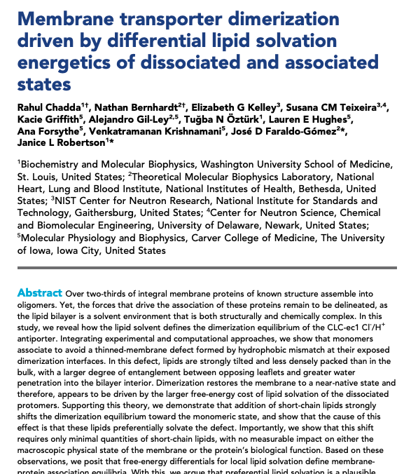
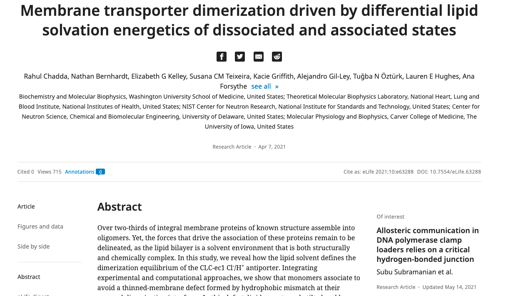
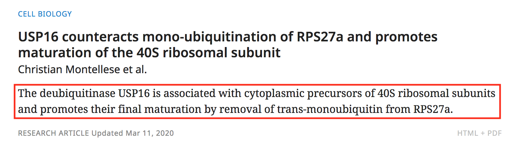
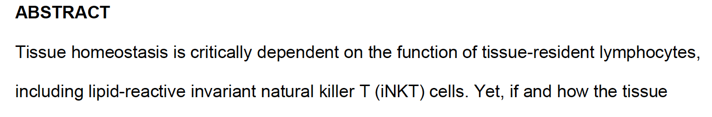

# Abstracts, digests and impact statements

## Abstracts

An abstract provides a clear and concise summary of the work described in an article. Abstracts allow readers to have a quick overview before reading the whole article. For eLife articles, abstracts are usually 150-200 words \(except medical submissions which can be around 250 words\). If a non-medical abstract is over the word limit, this should be checked with Editorial \(see more [**here**](https://elifesciences.gitbook.io/productionhowto/-M1eY9ikxECYR-0OcnGt/article-details/content/article-structure/abstract-digest-impact-statement#pre-abstract-word-count-restriction) and [**here**](https://elifesciences.gitbook.io/productionhowto/-M1eY9ikxECYR-0OcnGt/article-details/content/article-structure/abstract-digest-impact-statement#final-abstract-word-count-restriction)\). 

In eLife articles, the abstract is the first section in the article, appearing after the author list and affiliations in the PDFs and on the website. 





### Structured abstracts

Subheadings are not allowed in abstracts, except for medical submissions. All articles in the major subject areas 'Medicine' or 'Epidemiology and Global Health' with a received date after 04/04/2021 should have a structured abstract unless the sticky note from Editorial indicates otherwise. In rare cases, some articles outside these major subject areas will be clinical trials and so will require structured abstracts - these will also be indicated in the sticky notes. 

Structured abstracts should have all the following subheadings: Background; Methods; Results; Conclusions; Funding; Clinical trial number \(for submissions reporting results of a trial only - see more [**here**](../ethics.md#clinical-trials)\). These headings should be tagged in the underlying XML using `<sec>` and `<title>` tags \(not `<bold>` tags\). See [**here**](abstract-digest-impact-statement.md#structured-abstract-including-clinical-trial-number-section) for an example of XML for a structured abstract. 

| **Section** | **XML formatting** |
| :--- | :--- |
| Background | `<sec id="abs1">  <title>Background:</title>` |
| Methods | `<sec id="abs2">  <title>Methods:</title>` |
| Results | `<sec id="abs3">  <title>Results:</title>` |
| Conclusions | `<sec id="abs4">  <title>Conclusions:</title>` |
| Funding | `<sec id="abs5">  <title>Funding:</title>` |
| Clinical trial number \(optional\) | `<sec id="abs6">  <title>Clinical trial number:</title>` |

## Digests

eLife digests explain the findings of eLife papers to a broader audience. They are managed by the Features team and written by editors and writers working together with authors. Digests should not be edited by copyeditors or production staff, and any author edits to this section will need to be approved by the Features team. In eLife PDFs, the digest appears as soon as possible after the abstract, on page two - often within the Introduction section. On the eLife website, the digest appears after the abstract. In the XML, digests are marked up as a type of abstract \(see [**here**](abstract-digest-impact-statement.md#digest)\). Not all articles will have a digest - The Features team will send emails every week to indicate which articles are not getting one \(see more [**here**](../../../toolkit/managing-production-queries.md#no-digest-emails)\). The following article types should never have a digest: Scientific Correspondence, Replication Study, Research Advance, Registered Report, Correction, Retraction, Expression of Concern, Feature Article, Insight, Editorial.


## Impact statements

### What is an impact statement?

An impact statement is a succinct summary of an article, intended for display on the eLife website and in the [**eTOC**](https://elifesciences.gitbook.io/productionhowto/-M1eY9ikxECYR-0OcnGt/toolkit/etoc):



Impact statements do not display on the main article page on the website or the PDF.

An impact statement should be a single complete sentence, no more than 40 words in length. Multiple sentences or multiple statements joined with semi-colons are not allowed. Colons are similarly not allowed, except when the article is a [Replication study](abstract-digest-impact-statement.md#impact-statements-in-replication-studies). The statement should be properly punctuated and end in a full stop. Bold text is not allowed but italics and superscript should be retained as the author provides, and as in the title, species names \(e.g. _Homo sapiens_\) should be in italics.

The statement should not repeat the title and it should not be written in the first-person. It should not use acronyms without defining them, although commonly used terms \(such as RNA\) are OK. It should match the main text in terms of whether UK or US spelling is used.

### What needs to be checked?

Impact statements display with the Article details, just below the title:


Impact statements may need to be edited as follows:

* A full stop should be added to the end if missing.
* General spelling errors or missing spaces between words should be corrected.
* Italics should be applied to any species names if not already present.
* Any possessive phrases \('we show', 'this study shows' etc.\) should be removed or replaced with third-person alternatives.
* Excepting their use in scientific terms \(e.g. ratios 1:800\), if a colon or semi-colon is present, the statement should be rephrased \(unless the article is a Replication study, in which case the statement should begin 'Editors' summary:'\).
* Uncommon abbreviations should be spelled out per the article text.
* Brackets are not forbidden but should be removed if not required for clarity.
* If the statement repeats the article title at length, it should be rephrased to avoid this.

Whenever an impact statement is edited, the author must be notified using the following author query:

* The impact statement has been edited. Please confirm whether the revised wording is acceptable.

If the statement is longer than 40 words, it should be shortened if this is possible without changing the scientific meaning of the text. If it is unclear how to do this, the authors will need to be asked to shorten it themselves:

* Please rephrase this impact statement so that it is no more than 40 words in length.

In extreme cases, where it is not possible to create an acceptable impact statement from the text provided \(e.g. they have provided multiple sentences and it is unclear how they should be combined\), the following query may be used to ask the authors to start again:

* The impact statement should be a single sentence that summarises the key findings of the work. Please provide a revised impact statement, no longer than 40 words, that clearly explains the main results of your study.

#### Impact statements in Replication studies

For Replication studies, the impact statement is used as an 'Editors' Summary', giving the outcome of the replication of a previously published work. There are several variations on this summary that apply to different outcomes:

* Editors' Summary: This Replication Study has reproduced important parts of the original paper. 
* Editors' Summary: This Replication Study has reproduced some parts of the original paper but other parts could not be interpreted.
* Editors' Summary: This Replication Study has reproduced some parts of the original paper but it also contains results that are not consistent with other parts of the original paper.
* Editors' Summary: This Replication Study did not reproduce those experiments in the original paper that it attempted to reproduce.

The eLife Editorial team will ideally update the impact statement before the the article is exported for processing, but sometimes this will be delayed until the decision letter/author response has been edited. In these cases, the exported impact statement will need to be replaced with the finalised Editors’ Summary as soon as this is available \(usually at the point that the DL/AR are uploaded\). This will be done by the Production team.

### Examples

#### Avoiding title repetition

An impact statement should not simply repeat the article title and it is generally preferred that they are clearly distinct from one another. In the following case, the statement for article "TLR5 participates in the TLR4 receptor complex and promotes MyD88-dependent signaling in environmental lung injury" originally read:

> "TLR5 participates in the TLR4 signaling complex and modulates the response to TLR4 ligands in mice and humans."

So the first five words of both were the same, "TLR5 participates in the TLR4". To correct this, the order of words in the statement was switched around as follow:

> "The response to TLR4 ligands in mice and humans is modulated by TLR5, which participates in the TLR4 signaling complex."

#### Bracket use

If brackets can be replaced with commas, this should be done. For example, the following impact statement uses them to enclose the name of an enzyme:

> "By combining structure-based computational predictions and a thorough structural analysis, a highly thermostable enzyme **\(alcohol dehydrogenase\)** has been engineered."

This can be corrected to the following without affecting the readability of the statement:

> "By combining structure-based computational predictions and a thorough structural analysis, a highly thermostable enzyme**, alcohol dehydrogenase,** has been engineered."

In the following instance, however, this kind of edit would be inappropriate as the statement reads clearer with the brackets in place:

> "Reprogramming of transcription factors by PRR-independent \(cAMP\) and PRR-dependent \(curdlan\) signaling induces new dendritic cell subset."

#### Fragment correction

The following impact statement is an example of a fragment rather than a complete sentence:

> "Comprehensive compendium of myelin proteins in the peripheral nervous system and method to address molecular diversity of myelin sheaths in health and disease."

This was edited so that rather than two descriptive phrases, it was formulated as a single proper sentence:

> "A comprehensive compendium of myelin proteins in the peripheral nervous system has been created, alongside a method to address molecular diversity of myelin sheaths in health and disease."

Similarly, this impact statement was also not a full sentence.

> "Calpain as a promising therapeutic target to reduce spasticity after a spinal cord injury."

This was easily fixed by simply changed 'as' to 'is'.

> "Calpain **is** a promising therapeutic target to reduce spasticity after a spinal cord injury."

#### Removing possessive phrases

Impact statements must be written in the third person, so phrases such as 'we show' are not allowed. If they are present, the statement must be rewritten. For example, this following impact statement has 'we named . . .' in it:

> "A female fertility syndrome in _Drosophila_ called gonadal dysgenesis is caused by the _P_-transposase actively mobilizing a very short _P_-element variant **that we named** the _Har-P_."

This was therefore edited to read instead:

> "A female fertility syndrome in _Drosophila_ called gonadal dysgenesis is caused by the _P_-transposase actively mobilizing a very short _P_-element variant **that has been named** the _Har-P."_

#### Semi-colon removal

Outside of their use in scientific terms, semi-colons are not allowed in impact statements.

> "Plasmodium uses host-derived factors to form more rosettes to hamper **phagocytosis;** a good example of host-parasite interaction in immunopathobiology."

This statement was edited to the following based on information given in the abstract:

> "Plasmodium parasites use host-derived factors to form more rosettes and hamper phagocytosis, representing a new escape mechanism for the malaria parasites."

#### Spelling out abbreviations

The use of undefined abbreviations is discouraged, excepting commonly used ones such as DNA or protein/gene names. A general rule of thumb is that if the authors spell out the term in full in their abstract/main text, it should be given in full in the impact statement \(provided this does not take the statement over the 40 word limit. For example:

> "The tissue environment shapes the lipid recognition capacity of **NKT** cells."

Here, the expansion of 'NKT' was found from the abstract:



> "The tissue environment shapes the lipid recognition capacity of **natural killer T** cells."

If spelling out the abbreviation would take the statement over 40 words, it is acceptable to leave the abbreviation as it is, provided that the title of the article uses the spelled-out version. It is also acceptable to leave the abbreviations if the authors are defining it in their impact statement, e.g.

> "The human cytomegalovirus \(HCMV\) interactome systematically characterises high-confidence viral-viral and viral-host protein interactions in HCMV-infected cells, facilitating multiple novel insights into HCMV and herpesviral function."

#### 'This study' removal

Simply referring to the work as 'a study' in the third person is fine, e.g.

> "A study of 3,500 children in the UK shows that data on socioeconomic background and previous educational achievements can better predict how students will perform at school than genetic data."

However, if phrases such as 'this study shows' or 'this work proves' are used, they will need to be edited. For example:

> "**This study formulates** quantitative, experimentally testable predictions allowing to discriminate between contraction mechanisms in disordered actomyosin and microtubule/motor bundles."

This was changed to the following:

> "Quantitative, experimentally testable predictions allow discrimination between contraction mechanisms in disordered actomyosin and microtubule/motor bundles."

A more subtle example of this can be seen in the following, where the authors do not refer directly to the work, but instead just say 'here':

> "Novel drug-binding sites of TRPC6 **identified here** could potentially facilitate future design of drugs to treat TRPC6-mediated diseases."

In this case, simply removing 'identified here' was sufficient to provide a correct statement:

> "Novel drug-binding sites of TRPC6 could potentially facilitate future design of drugs to treat TRPC6-mediated diseases."

### A note on full submissions

Articles accepted at full submission \(for example articles accepted through Review Commons\) do not have impact statements on the submission system. The Editorial team will need to query the authors for this before the article is exported to Production; however if this is missed the authors should be queried for this: 

* Please provide an impact statement \(a single sentence, no longer than 40 words, that summarises the key findings of the work\).

## Schematron checks

### Content checks

These checks relate to the content of abstracts, digests and impact statements. X or XXXXXX refers to quoted text which will change depending on the article.

#### test-abstracts

**Error**: _There must either be only one abstract or one abstract and one abstract\[@abstract-type="executive-summary\]. No other variations are allowed._

**Action**: This error will appear if an article has zero or more than one abstract. Check the original submission to see whether an abstract was provided and add it in if so. If no abstract was provided \(this will be a rare occurrence\), the authors should be queried for this:

* Please provide an abstract for your article \(no more than 280 words\). 

#### abstract-child-test-1

**Error**: _XXXXXX is not allowed as a child of abstract._

**Action**: This error will appear if an abstract has any elements other than `<p>` , `<sec>` or `<title>`. For example: 

```markup
<abstract>
   <object-id pub-id-type="doi">10.7554/eLife.12572.001</object-id>
   <sec id="abs1">
     <title>Background:</title>
     <p>Background text.</p>
   </sec>
   ...
   <fig/>
</abstract>
```

Check where these additional elements may have come from by comparing against the original submission. The production vendors will need to correct the XML accordingly - if the additional elements should be somewhere else in the article, they will need to be moved, if they have been included in error and shouldn't be there at all they should be removed. 

#### abstract-test-4

**Error**: _abstracts cannot contain display formulas._

**Action**: This will appear if an abstract contains display formulae - although these are allowed in Continuum, they are converted to placeholder text for downstream deliverables. As a result, these should not be included in abstracts - if an article has display formulae in the abstract, please capture them in normal characters if possible. If this can't be done, convert the display formula into an inline formula and leave the following author query for the authors: 

* eLife does not support formulae in abstracts as these do not display correctly further downstream \(e.g. on PubMed etc.\). If possible, please rephrase your abstract accordingly and indicate where the formula\(e\) should be included in the main text instead.

If the authors are unable to remove the inline formula\(e\) from their abstract, [**math-test-18**](../maths.md#math-test-18) will still fire, but this warning can be ignored.

#### abstract-test-5

**Error**: _If an abstract is structured, then it must have 5 or 6 sections depending on whether it is a clinical trial. An article without a clinical trial should have 5 sections, whereas one with a clinical trial should have 6._

**Action**: Structured abstracts must include the following sections: Background, Methods, Results, Conclusions, Funding and Clinical trial number if the article is a clinical trial. If a structured abstract has a number of sections other than 5 \(or 6 if a clinical trial\), this is incorrect. Check the original submission to see whether all section headings were provided and add them in if so \(the production vendors may need to format these appropriately as [**here**](abstract-digest-impact-statement.md#structured-abstract)**\).** If the authors did not provide these sections, the Editorial team should be consulted about this. 

#### abstract-test-6

**Warning**: _Abstract starts with the word 'Abstract', which is almost certainly incorrect - XXXXXX_

**Action**: If an abstract begins with the text 'abstract', and this is not part of the first sentence \(e.g. 'Abstract thinking is an interesting aspect of human intelligence'\) this text should be deleted. 

#### abstract-test-7

**Warning**: _Abstract looks like it should instead be captured as a structured abstract \(using sections\) - XXXXXX_

**Action**: This warning will appear if any of the structured abstract headings \(Background, Methods, Results, Conclusions, Funding and Clinical trial number if the article is a clinical trial\) are present in an abstract, but the abstract is not formatted correctly \(i.e. using `<sec>` and `<title>` tags\). If these headings are present they should be formatted as [**here**](abstract-digest-impact-statement.md#structured-abstract).

#### pre-abstract-word-count-restriction

**Warning**: _The abstract contains XXXXXX words, when the usual upper limit is 280. Exeter: Please check with the eLife production team who will need to contact the eLife Editorial team._

**Action**: This warning will fire at pre-author stages if an abstract has more than 280 words. The Production team will need to check with the Editorial team about whether the authors need to be asked to edit the abstract to 280 words or fewer. This message will not appear for structured abstracts.

#### final-abstract-word-count-restriction

**Warning**: _The abstract contains XXXXXX words, when the usual upper limit is 280. Abstracts with more than 280 words should be checked with the eLife Editorial team._

**Action**: This warning will fire at post-author stages if an abstract has more than 280 words. If it hasn't been done already, the Production team will need to check with the Editorial team about whether the authors need to be asked to edit the abstract to 280 words or fewer. If Editorial have already approved the extended length, or if the authors have already been queried and are unable to reduce the word count, the message can be ignored. This message will not appear for structured abstracts.

#### medicine-abstract-conformance

**Warning**: _Medicine articles with a colon in their title must have a structured abstract. Either the colon in the title is incorrect, or the abstract should be changed to a structured format._

**Action**: If an article is classed under the major subject areas 'Medicine' or 'Epidemiology and Global Health' and has a colon in the article title \(e.g. 'Association of Toll-like receptor 7 variants with life-threatening COVID-19 disease in males: findings from a nested case-control study'\), it should have a structured abstract. Check the original submission to see whether a structured abstract is present - if so, it should be tagged accordingly as [**here**](abstract-digest-impact-statement.md#structured-abstract) \(see more [**here**](abstract-digest-impact-statement.md#structured-abstracts)\). If not, the Editorial team will need to be consulted. 

#### medicine-abstract-conformance-2

**Warning**: _XXXXXX articles submitted after 4th April 2021 should have a structured abstract, but this one does not. eLife please check this with Editorial. Exeter: Please flag this to the eLife Production team._

**Action**: All articles submitted after 04/04/2021 and classed under the major subject areas 'Medicine' or 'Epidemiology and Global Health' should have structured abstracts. Check the original submission to see whether a structured abstract is present - if so, it should be tagged accordingly as [**here**](abstract-digest-impact-statement.md#structured-abstract) \(see more [**here**](abstract-digest-impact-statement.md#structured-abstracts)\). If not, the Editorial team will need to be consulted. 

#### clintrial-conformance-1

**Error**: _First section title is 'XXXXXX' - but the only allowed value is 'Background:'._

**Action**: This error will appear if the first section in a structured abstract is titled anything other than 'Background:'. Double-check that the original submission has a structured one and that there is indeed a section titled 'Background'. If so, the production vendors will need to correct the section title accordingly as [**here**](abstract-digest-impact-statement.md#structured-abstract). If the abstract is not a structured abstract, it shouldn't have section titles at all. Double-check with the Editorial team about whether the article should have a structured abstract.

#### clintrial-conformance-2

**Error**: _Second section title is 'XXXXXX' - but the only allowed value is 'Methods:'._

**Action**: This error will appear if the second section in a structured abstract is titled anything other than 'Methods:'. Double-check that the original submission has a structured one and that there is indeed a section titled 'Methods'. If so, the production vendors will need to correct the section title accordingly as [**here**](abstract-digest-impact-statement.md#structured-abstract). If the abstract is not a structured abstract, it shouldn't have section titles at all. Double-check with the Editorial team about whether the article should have a structured abstract.

#### clintrial-conformance-3

**Error**: _Third section title is 'XXXXXX' - but the only allowed value is 'Results:'._

**Action**: This error will appear if the third section in a structured abstract is titled anything other than 'Results:'. Double-check that the original submission has a structured one and that there is indeed a section titled 'Result'. If so, the production vendors will need to correct the section title accordingly as [**here**](abstract-digest-impact-statement.md#structured-abstract). If the abstract is not a structured abstract, it shouldn't have section titles at all. Double-check with the Editorial team about whether the article should have a structured abstract.

#### clintrial-conformance-4

**Error**: _Fourth section title is 'XXXXXX' - but the only allowed value is 'Conclusions:'._

**Action**: This error will appear if the fourth section in a structured abstract is titled anything other than 'Conclusions:'. Double-check that the original submission has a structured one and that there is indeed a section titled 'Conclusions'. If so, the production vendors will need to correct the section title accordingly as [**here**](abstract-digest-impact-statement.md#structured-abstract). If the abstract is not a structured abstract, it shouldn't have section titles at all. Double-check with the Editorial team about whether the article should have a structured abstract.

#### clintrial-conformance-5

**Error**: _Sixth section title is 'XXXXXX' - but the only allowed value is 'Clinical trial number:'._

**Action**: This error will appear if the sixth section in a structured abstract is titled anything other than 'Clinical trial number:'. Double-check that the original submission has a structured one and that there is indeed a section titled 'Clinical trial number'. If so, the production vendors will need to correct the section title accordingly as [**here**](abstract-digest-impact-statement.md#structured-abstract). If the article does not have a clinical trial number, there should only be 5 sections in the structured abstract. If the abstract is not a structured abstract, it shouldn't have section titles at all. Double-check with the Editorial team about whether the article should have a structured abstract.

#### clintrial-conformance-6

**Error**: _Fifth section title is 'XXXXXX' - but the only allowed value is 'Funding:'._

**Action**: This error will appear if the fifth section in a structured abstract is titled anything other than 'Funding:'. Double-check that the original submission has a structured one and that there is indeed a section titled 'Funding'. If so, the production vendors will need to correct the section title accordingly as [**here**](abstract-digest-impact-statement.md#structured-abstract). If the abstract is not a structured abstract, it shouldn't have section titles at all. Double-check with the Editorial team about whether the article should have a structured abstract.

#### clintrial-related-object-13

**Warning**: _There are XXXXXX clinical trial numbers tagged in the structured abstract, which seems like a large number. Please check that this is correct and has not been mistagged._

**Action**: This warning will appear for a structured abstract if there are more than 3 clinical trial numbers tagged. This will usually be a result of mis-tagging - double-check the original submission to see what the correct clinical trial numbers should be. If you are unsure, check with the Production team who may need to consult the Editorial team about this. 

#### xref-bibr-presence

**Warning**: _Abstract contains a citation - 'XXXXXX' - which isn't usually allowed. Check that this is correct._

**Action**: Linked citations are not allowed in abstracts - if there are any, these should be changed to plain text citations instead. If the reference is only cited in the abstract, leave this query for the authors: 

* Unfortunately we cannot support linked citations in eLife abstracts. Please add a citation of this reference in the main text of your article so we can add it to the reference list. 

#### pre-res-comm-test

**Warning**: _'XXXXXX' has only one paragraph in its abstract or the second paragraph does not begin with 'Editorial note', which is incorrect. Please ensure to check with eLife staff for the required wording._

**Action**: This warning will appear if a Research Communication article only has one paragraph in the abstract or the second paragraph doesn't begin with 'Editorial note'. Research Communications should have this note as a second paragraph in the abstract:

> Editorial note: This article has been through an editorial process in which the authors decide how to respond to the issues raised during peer review. The Reviewing Editor's assessment is that all the issues have been addressed \(see decision letter\).

#### final-res-comm-test

**Error**: _'XXXXXX' has only one paragraph in its abstract or the second paragraph does not begin with 'Editorial note', which is incorrect._

**Action**: This warning will appear if a Research Communication article only has one paragraph in the abstract or the second paragraph doesn't begin with 'Editorial note'. Research Communications should have this note as a second paragraph in the abstract:

> Editorial note: This article has been through an editorial process in which the authors decide how to respond to the issues raised during peer review. The Reviewing Editor's assessment is that all the issues have been addressed \(see decision letter\).

#### res-art-test

**Warning**: _'XXXXXX' has more than one paragraph in its abstract, is this correct?_

**Action**: This warning will appear if an abstract has multiple paragraphs. Most eLife articles should only have single-paragraph abstracts \(exceptions are articles with structured abstracts and Research Communications\). Check the original submission to see whether the abstract has multiple paragraphs - if it does and it shouldn't, please leave the following query for the authors:

* Please edit your abstract so it is only one paragraph. 

#### corr-abstract-presence

**Error**: _Correction notices should not contain abstracts._

**Action**: Correction notices do not have abstracts - if this error appears, it is likely that some text has incorrectly been tagged as an abstract. The production vendors will need to correct this. 

#### retr-abstract-presence

**Error**: _XXXXXX notices should not contain abstracts._

**Action**: Retraction notices do not have abstracts - if this error appears, it is likely that some text has incorrectly been tagged as an abstract. The production vendors will need to correct this. 

#### insight-abstract-impact-test-1

**Warning**: _In insights, abstracts must be the same as impact statements. Here the abstract reads "XXXXXX", whereas the impact statement reads "XXXXXX"._

**Action**_:_ Except in very rare cases, Insight articles will have abstracts that match the impact statement. If this warning appears, check there are no typos in either the abstract or impact statement. If there are major differences between the two, check with the Production team who will clarify this with the Features team.

#### insight-abstract-impact-test-2

**Warning**: _In insights, abstracts must be the same as impact statements. Here the abstract has XXXXXX child element\(s\), whereas the impact statement has XXXXXX child element\(s\). Check for possible missing formatting._

**Action**: Except in very rare cases, Insight articles will have abstracts that match the impact statement. This warning will appear if there is a mismatch and a formatting element in the abstract \(such as italicisation\). This can be resolved by adding the missing formatting element in the impact statement as well. If there are major differences between the two, check with the Production team who will clarify this with the Features team.

#### test-no-digest

**Error**: _'XXXXXX' cannot have a digest._

**Action**: This error will appear if any of these article types have a digest: Scientific Correspondence, Replication Study, Research Advance, Registered Report, Correction, Retraction, Expression of Concern, Feature Article, Insight, Editorial. Double-check the article type is definitely correct - if it is, the digest section will need to be removed from the XML by the production vendors. If the article type is incorrect, this will need to be corrected by the production vendors. The production team should investigate which article the digest was intended for, in case it wasn't sent to the correct one. The Features team can be consulted on this.

#### digest-test-1

**Warning**: _digest paragraph starts with a lowercase letter. Is that correct? Or has a paragraph been incorrectly split into two?_

**Action**: This warning will appear if a paragraph in a digest section begins with a lowercase letter. Double-check whether this is due to a paragraph incorrectly being split into two, or due to a typo, and correct accordingly. If the word should be lowercase because it is a gene name, for example, this can be left as is. If you are unsure, check with the Production team who will check with Features if needed.

#### final-digest-test-2

**Error**: _digest paragraph contains \[OK\] or \[OK?\] which should be removed - XXXXXX_

**Action**: The Features team will sometimes check the wording of a digest with the authors by adding '\[OK\]' or '\[OK?\]' into the text of the digest. These indicators should be removed at pub review \(before final publication\). 

#### custom-meta-test-5

**Warning**: _Impact statement contains more than 40 words. This is not allowed._

**Action**: When an impact statement is more than 40 words in length, it should be shortened if this is possible without changing the scientific meaning of the text. If this is not possible, the author should be asked to rephrase it to bring it under the word limit:

* Please rephrase this impact statement so that it is no more than 40 words in length.

#### pre-custom-meta-test-6

**Warning**: _Impact statement must end with a full stop or question mark._

**Action**: Add a full-stop to the end of the impact statement.

#### final-custom-meta-test-6

**Error**: _Impact statement must end with a full stop or question mark._

**Action**: Add a full-stop to the end of the impact statement.

#### custom-meta-test-7

**Warning**: _Impact statement appears to be made up of more than one sentence. Please check, as more than one sentence is not allowed._

**Action**: If possible, rephrase the impact statement to combine the multiple sentences into one. If it is not clear how to do this, please query the authors:

* The impact statement should be a single sentence that summarises the key findings of the work. Please provide a revised impact statement that clearly explains the main results of your study.

#### custom-meta-test-8

**Warning**: _Impact statement contains a colon or semi-colon, which is likely incorrect. It needs to be a proper sentence._

**Action**: If possible, rephrase the impact statement to remove the need for a colon or semi-colon. See [**above**](abstract-digest-impact-statement.md#semi-colon-removal). If it is not clear how to do this, please query the authors:

* The impact statement should be a single sentence that summarises the key findings of the work. Please provide a revised impact statement that clearly explains the main results of your study.

#### pre-custom-meta-test-9

**Warning**: _Impact statement contains a possessive phrase. This is not allowed_

**Action**: The impact statement should be rephrased to avoid using 'We show', 'We prove', 'This work shows' or any other similar phrase. See [**above**](abstract-digest-impact-statement.md#removing-possessive-phrases). This is a warning at the pre-author stages.

#### final-custom-meta-test-9

**Error**: _Impact statement contains a possessive phrase. This is not allowed_

**Action**: The impact statement should be rephrased to avoid using 'We show', 'We prove', 'This work shows' or any other similar phrase. See [**above**](abstract-digest-impact-statement.md#removing-possessive-phrases). This is an error at the post-author stages.

#### custom-meta-test-10

**Error**: _Impact statement is comprised entirely of numbers, which must be incorrect._

**Action**: If the impact statement has been provided as a string of numbers, the authors must be asked to provide a proper statement:

* The impact statement should be a single sentence that summarises the key findings of the work. Please provide a revised impact statement that clearly explains the main results of your study.

#### custom-meta-test-11

**Warning**: _Impact statement contains 'our'. Is this possessive language relating to the article or research itself \(which should be removed\)?_

**Action**: The impact statement should be rephrased to avoid using 'We show', 'Our work proves', 'This work shows' or any other similar phrase. See [**above**](abstract-digest-impact-statement.md#removing-possessive-phrases).

#### custom-meta-test-13

**Warning**: _Impact statement contains 'study'. Is this a third person description of this article? If so, it should be changed to not include this._

**Action**: Check to see if the statement contains a phrase such as 'This study shows' or ' In this study'. If it does, the statement must be rephrased. See [**above**](abstract-digest-impact-statement.md#this-study-removal).

#### pre-rep-study-custom-meta-test

**Warning**: _Impact statement in Replication studies must begin with 'Editors' summary: '. This does not - 'XXXXXX'._

**Action**: XXXXXX will be the current impact statement. In replication studies, impact statements act as a summary of the editor’s assessment of how successful the work was in replicating the previous work. The text must begin 'Editors' summary: ' \(see [**above**](abstract-digest-impact-statement.md#impact-statements-in-replication-studies)\). If this has been misspelled, please correct it. If this prefix is not present, please alert the Production team so that they can get the correct text from the Editorial team. The production vendors should hold the article until the correct impact statement is added in.

#### final-rep-study-custom-meta-test

**Error**: _Impact statement in Replication studies must begin with 'Editors' summary: '. This does not - 'XXXXXX'_

**Action**: XXXXXX will be the current impact statement. In replication studies, impact statements act as a summary of the editor’s assessment of how successful the work was in replicating the previous work. The text must begin 'Editors' summary: ' \(see [**above**](abstract-digest-impact-statement.md#impact-statements-in-replication-studies)\). If this has been misspelled, please correct it. If this prefix is not present, the Production team will need to check with the Editorial team to get the correct text for the impact statement.

#### custom-meta-child-test-1

**Error**: _&lt;XXX&gt; is not allowed in impact statement._

**Action**: `<XXX>` will be a disallowed XML element\(s\) currently present in the impact statement. The only XML elements allowed within the impact statement are `<italic>`, `<sup>` or `<sub>`. To address this warning, remove any formatting that is not italic, superscript or subscript, and remove any hyperlinks. For example, if the warning reads "&lt;bold&gt; is not allowed in impact statement", bold formatting is present and should be removed; similarly, "&lt;ext-link&gt; is not allowed in impact statement" indicates a hyperlink.

### XML structure checks

These checks relate to the XML structure of impact statements. X or XXXXXX refers to quoted text which will change depending on the article. For more information about what the XML should look like, [**see below**](abstract-digest-impact-statement.md#xml-structure).

#### abstract-test-2

**Error**: _At least 1 p element or sec element \(with descendant p\) must be present in abstract._

**Action**: This error will appear if an abstract has no &lt;p&gt; elements. The text of an abstract must be contained within a &lt;p&gt; element - if this is not the case, it needs to be fixed by the production vendors. 

#### clintrial-conformance-7

**Error**: _Nested secs are not allowed in abstracts. Sec with the id XXXXXX and title 'XXXXXX' has child sections._

**Action**: This error will appear if there are `<sec>` tags nested within `<sec>` tags in the XML of an abstract, e.g.:

```markup
<sec id="abs4">
 <title>Conclusions:</title>
 <sec>
    <p>Conclusions text.</p>
    <p>Funded by X, Y and Z.</p>
 </sec>
</sec>
```

This is not allowed and needs to be corrected by the production vendors. 

#### clintrial-conformance-8

**Error**: _XXXXXX must have an @id in the format 'abs1'. XXXXXX does not conform to this convention._

**Action**: This error will appear if a structured abstract section element has an ID in a format other than 'abs1' where the number corresponds to the section e.g.:

```markup
<sec id="sec2">
    <title>Methods:</title>
    <p>Methods text.</p>
</sec>
```

This is incorrect and the ID should be changed accordingly by the production vendors \(see [**here**](abstract-digest-impact-statement.md#structured-abstracts) for correct IDs\). 

#### clintrial-related-object-1

**Error**: _XXXXXX in abstract must be placed in a section whose title is 'Clinical trial number:'_

**Action**: This error will appear if a structured abstract has a `<related-object>` element \(which contains a link to the record for a clinical trial\) in a section other than 'Clinical trial number':

```markup
<sec id="abs4">
      <title>Conclusions:</title>
      <p>Conclusions text.</p>
      <p><related-object document-id="NCT04549831" 
      document-id-type="clinical-trial-number" id="RO1" 
      source-id="ClinicalTrials.gov" source-id-type="registry-name" 
      source-type="clinical-trials-registry" 
      xlink:href="https://clinicaltrials.gov/show/NCT04549831">NCT04549831
      </related-object>.</p>
</sec>
```

This is incorrect - the `<related-object>` element should be placed under the 'Clinical trial number' section instead. The production vendors will need to do this:

```markup
<sec id="abs6">
      <title>Clinical trial number:</title>
      <p><related-object document-id="NCT04549831" 
      document-id-type="clinical-trial-number" id="RO1" 
      source-id="ClinicalTrials.gov" source-id-type="registry-name" 
      source-type="clinical-trials-registry" 
      xlink:href="https://clinicaltrials.gov/show/NCT04549831">NCT04549831
      </related-object>.</p>
</sec>
```

#### clintrial-related-object-2

**Error**: _XXXXXX must have an @source-type='clinical-trials-registry'._

**Action**: This error will appear for a structured abstract if the `<related-object>` element doesn't have a `source-type` that is 'clinical-trials-registry', for example: 

```markup
<sec id="abs6">
      <title>Clinical trial number:</title>
      <p><related-object document-id="NCT04549831" 
      document-id-type="clinical-trial-number" id="RO1" 
      source-id="ClinicalTrials.gov" source-id-type="registry-name" 
      xlink:href="https://clinicaltrials.gov/show/NCT04549831">NCT04549831
      </related-object>.</p>
</sec>
```

This should be corrected by the production vendors, for example: 

```markup
<sec id="abs6">
      <title>Clinical trial number:</title>
      <p><related-object document-id="NCT04549831" 
      document-id-type="clinical-trial-number" id="RO1" 
      source-id="ClinicalTrials.gov" source-id-type="registry-name" 
      source-type="clinical-trials-registry" 
      xlink:href="https://clinicaltrials.gov/show/NCT04549831">NCT04549831
      </related-object>.</p>
</sec>
```

#### clintrial-related-object-3

**Error**: _XXXXXX must have an @source-id._

**Action**: This error will appear for a structured abstract if the `<related-object>` element doesn't have a `source-id`, for example: 

```markup
<sec id="abs6">
      <title>Clinical trial number:</title>
      <p><related-object document-id="NCT04549831" 
      document-id-type="clinical-trial-number" id="RO1" 
      source-id-type="registry-name" 
      source-type="clinical-trials-registry" 
      xlink:href="https://clinicaltrials.gov/show/NCT04549831">NCT04549831
      </related-object>.</p>
</sec>
```

This should be corrected by the production vendors, for example: 

```markup
<sec id="abs6">
      <title>Clinical trial number:</title>
      <p><related-object document-id="NCT04549831" 
      document-id-type="clinical-trial-number" id="RO1" 
      source-id="ClinicalTrials.gov" source-id-type="registry-name" 
      source-type="clinical-trials-registry" 
      xlink:href="https://clinicaltrials.gov/show/NCT04549831">NCT04549831
      </related-object>.</p>
</sec>
```

#### clintrial-related-object-4

**Error**: _XXXXXX must have an @source-id-type='registry-name'._

**Action**: This error will appear for a structured abstract if the `<related-object>` element doesn't have a `source-id-type` with the value 'registry-name' for example: 

```markup
<sec id="abs6">
      <title>Clinical trial number:</title>
      <p><related-object document-id="NCT04549831" 
      document-id-type="clinical-trial-number" id="RO1" 
      source-id="ClinicalTrials.gov"  
      source-type="clinical-trials-registry" 
      xlink:href="https://clinicaltrials.gov/show/NCT04549831">NCT04549831
      </related-object>.</p>
</sec>
```

This should be corrected by the production vendors, for example: 

```markup
<sec id="abs6">
      <title>Clinical trial number:</title>
      <p><related-object document-id="NCT04549831" 
      document-id-type="clinical-trial-number" id="RO1" 
      source-id="ClinicalTrials.gov" source-id-type="registry-name" 
      source-type="clinical-trials-registry" 
      xlink:href="https://clinicaltrials.gov/show/NCT04549831">NCT04549831
      </related-object>.</p>
</sec>
```

#### clintrial-related-object-5

**Error**: _XXXXXX must have an @document-id-type='clinical-trial-number'._

**Action**: This error will appear for a structured abstract if the `<document-id-type>` element doesn't have the value `clinical-trial-number` \(or if this is missing\) for example: 

```markup
<sec id="abs6">
      <title>Clinical trial number:</title>
      <p><related-object document-id="NCT04549831" 
      id="RO1" 
      source-id="ClinicalTrials.gov" source-id-type="registry-name" 
      source-type="clinical-trials-registry" 
      xlink:href="https://clinicaltrials.gov/show/NCT04549831">NCT04549831
      </related-object>.</p>
</sec>
```

This should be corrected by the production vendors, for example: 

```markup
<sec id="abs6">
      <title>Clinical trial number:</title>
      <p><related-object document-id="NCT04549831" 
      document-id-type="clinical-trial-number" id="RO1" 
      source-id="ClinicalTrials.gov" source-id-type="registry-name" 
      source-type="clinical-trials-registry" 
      xlink:href="https://clinicaltrials.gov/show/NCT04549831">NCT04549831
      </related-object>.</p>
</sec>
```

#### clintrial-related-object-6

**Error**: _XXXXXX must have an @document-id._

**Action**: This error will appear for a structured abstract if the `<related-object>` element doesn't have a `document-id` with the clinical trial number for example: 

```markup
<sec id="abs6">
      <title>Clinical trial number:</title>
      <p><related-object 
      document-id-type="clinical-trial-number" id="RO1" 
      source-id="ClinicalTrials.gov" source-id-type="registry-name" 
      source-type="clinical-trials-registry" 
      xlink:href="https://clinicaltrials.gov/show/NCT04549831">NCT04549831
      </related-object>.</p>
</sec>
```

This should be corrected by the production vendors, for example: 

```markup
<sec id="abs6">
      <title>Clinical trial number:</title>
      <p><related-object document-id="NCT04549831" 
      document-id-type="clinical-trial-number" id="RO1" 
      source-id="ClinicalTrials.gov" source-id-type="registry-name" 
      source-type="clinical-trials-registry" 
      xlink:href="https://clinicaltrials.gov/show/NCT04549831">NCT04549831
      </related-object>.</p>
</sec>
```

#### clintrial-related-object-7

**Error**: _XXXXXX must have an @xlink:href._

**Action**: This error will appear for a structured abstract if the `<related-object>` element doesn't have an `xlink:href` with a link to the clinical trial information at its registry, for example: 

```markup
<sec id="abs6">
      <title>Clinical trial number:</title>
      <p><related-object 
      document-id-type="clinical-trial-number" id="RO1" 
      source-id="ClinicalTrials.gov" source-id-type="registry-name" 
      source-type="clinical-trials-registry" 
      xlink:href="https://clinicaltrials.gov/show/NCT04549831">NCT04549831
      </related-object>.</p>
</sec>
```

This should be corrected by the production vendors, for example: 

```markup
<sec id="abs6">
      <title>Clinical trial number:</title>
      <p><related-object document-id="NCT04549831" 
      document-id-type="clinical-trial-number" id="RO1" 
      source-id="ClinicalTrials.gov" source-id-type="registry-name" 
      source-type="clinical-trials-registry" 
      xlink:href="https://clinicaltrials.gov/show/NCT04549831">NCT04549831
      </related-object>.</p>
</sec>
```

#### clintrial-related-object-8

**Warning**: _XXXXXX has an @document-id 'XXXXXX'. But this is not in the text, which is likely incorrect - XXXXXX._

**Action**: This error will appear for a structured abstract if the value within the `document-id` attribute doesn't match the text within the `<related-object>` element.

```markup
<sec id="abs6">
      <title>Clinical trial number:</title>
      <p><related-object document-id="NCT04549831" 
      document-id-type="clinical-trial-number" id="RO1" 
      source-id="ClinicalTrials.gov" source-id-type="registry-name" 
      source-type="clinical-trials-registry" 
      xlink:href="https://clinicaltrials.gov/show/NCT04549831">bjirpebwivtprbwuip
      </related-object>.</p>
</sec>
```

The value in the `document-id` attribute should match the text within the `<related-object>` element. This should be corrected by the production vendors, for example: 

```markup
<sec id="abs6">
      <title>Clinical trial number:</title>
      <p><related-object document-id="NCT04549831" 
      document-id-type="clinical-trial-number" id="RO1" 
      source-id="ClinicalTrials.gov" source-id-type="registry-name" 
      source-type="clinical-trials-registry" 
      xlink:href="https://clinicaltrials.gov/show/NCT04549831">NCT04549831
      </related-object>.</p>
</sec>
```

#### clintrial-related-object-9

**Error**: _XXXXXX must have an @id in the format 'RO1'. 'XXXXXX' does not conform to this convention._

**Action**: This error will appear for a structured abstract if the `<related-object>` element doesn't have an `id` in the exact format 'RO1' for example: 

```markup
<sec id="abs6">
      <title>Clinical trial number:</title>
      <p><related-object document-id="NCT04549831" 
      document-id-type="clinical-trial-number" id="ro1" 
      source-id="ClinicalTrials.gov" source-id-type="registry-name" 
      source-type="clinical-trials-registry" 
      xlink:href="https://clinicaltrials.gov/show/NCT04549831">NCT04549831
      </related-object>.</p>
</sec>
```

This should be corrected by the production vendors, for example: 

```markup
<sec id="abs6">
      <title>Clinical trial number:</title>
      <p><related-object document-id="NCT04549831" 
      document-id-type="clinical-trial-number" id="RO1" 
      source-id="ClinicalTrials.gov" source-id-type="registry-name" 
      source-type="clinical-trials-registry" 
      xlink:href="https://clinicaltrials.gov/show/NCT04549831">NCT04549831
      </related-object>.</p>
</sec>
```

#### clintrial-related-object-10

**Error**: _XXXXXX in abstract must be a child of a &lt;p&gt; element._

**Action**: This error will appear for a structured abstract if the `<related-object>` element isn't contained within a `<p>` element. This should be corrected by the production vendors.

#### clintrial-related-object-11

**Error**: _XXXXXX @source-id value must be one of the subtitles of the Crossref clinical trial registries. "XXXXXX" is not one of the following XXXXXX_

**Action**: This error will appear for a structured abstract if the `source-id` does not match any of the [**clinical trial registries permitted by eLife**](https://github.com/elifesciences/eLife-JATS-schematron/blob/master/src/clinical-trial-registries.xml). Check and correct any typos - if the value in the `source-id` element is completely different from any of the registries on the list, the Production team will need to investigate further. 

#### clintrial-related-object-12

**Error**: _ClinicalTrials.gov trial links are in the format_ [https://clinicaltrials.gov/show/{number}](https://clinicaltrials.gov/show/{number})_. This XXXXXX has the link 'XXXXXX', which based on the clinical trial registry \(XXXXXX\) and @document-id \(XXXXXX\) is not right. Either the xlink:href is wrong \(should it be XXXXXX instead?\) or the @document-id value is wrong, or the @source-id value is incorrect \(or all/some combination of these\)._

**Action**: This error will appear for a structured abstract if there is a mismatch between the `document-id` value and the link in the `xlink:href` element. For example, if the link is https://clinicaltrials.gov/show/NCT04549831, the expected document-id would be NCT04549831. If these values don't match \(as in the example below\) then there is either an error in the link or the document-id \(or the source-id value itself is incorrect, which will cause the schematron to compare against an incorrect format\). Check the original submission and fix any typos that may have been made. If there are no typos, the Production team will need to check this with the Editorial team. 

```markup
<sec id="abs6">
      <title>Clinical trial number:</title>
      <p><related-object document-id="NCT04549832" 
      document-id-type="clinical-trial-number" id="RO1" 
      source-id="ClinicalTrials.gov" source-id-type="registry-name" 
      source-type="clinical-trials-registry" 
      xlink:href="https://clinicaltrials.gov/show/NCT04549831">NCT04549831
      </related-object>.</p>
</sec>
```

#### related-object-ancestor

**Error**: _XXXXXX is not allowed outside of the main abstract \(abstract\[not\(@abstract-type\)\]\)._

**Action**: For clinical trial articles which have clinical trial numbers in the abstract, these should be added as a `<related-object>` in the 'Clinical trial number' section for example:

```markup
 <sec id="abs6">
      <title>Clinical trial number:</title>
      <p><related-object document-id="NCT04549831" 
      document-id-type="clinical-trial-number" id="RO1" 
      source-id="ClinicalTrials.gov" source-id-type="registry-name" 
      source-type="clinical-trials-registry" 
      xlink:href="https://clinicaltrials.gov/show/NCT04549831">NCT04549831
      </related-object>.</p>
</sec>
```

This test checks that the `<related-object>` element is located within the abstract. This element is not currently used elsewhere so if this message appears, the production vendors will need to fix this. 

#### feature-abstract-test-1

**Error**: _abstract must contain one and only one title._

**Action**: This error will appear if an article with a digest section doesn't have a `<title>` tag. The production vendors will need to add this in, and the title should be 'eLife digest'. 

#### feature-abstract-test-2

**Error**: _abstract title must contain 'eLife digest'. Possible superfluous characters - XXXXXX_

**Action**: This error will appear if an article with a digest section has a `<title>` other than 'eLife digest'. This will need to be corrected by the production vendors.

#### custom-meta-test-1

**Error**: _One meta-name must be present in custom-meta._

**Action**: This rule will only fire for research content, where one `<custom-meta>` elements should be present in `<custom-meta-group>`, containing one `<meta-name>` element and one `<meta-value>` element. If this rule fires, either there are no `<meta-name>` elements present, or there is there is more than one. Ensure that one `<meta-name>`element is present in the XML. Remove any extra elements of this type.

#### custom-meta-test-2

**Error**: _The value of meta-name can only be 'Author impact statement'. Currently it is 'XXXXXX'._

**Action**: XXXXXX will be the current value of `<meta-name>`. This rule will only fire for research content, when the contents of `<meta-name>` are not 'Author impact statement'. Correct the value within the `<meta-name>` element so that it is 'Author impact statement'.

#### custom-meta-test-3

**Error**: _One meta-value must be present in custom-meta._

**Action**: For each instance of `<custom-meta>` in the [XML](abstract-digest-impact-statement.md#xml-structure), there should be one and only one `<meta-value>` element. Ensure this is the case and remove extra elements of this type.

#### custom-meta-test-14

**Error**: _The value of the 1st meta-name can only be 'Author impact statement'. Currently it is 'XXXXXX'._

**Action**: XXXXXX will be the current value of the first `<meta-name>` element. This rule will only fire for feature content when the contents of the first `<meta-name>` are not 'Author impact statement'. Correct the value within the first `<meta-name>` in `<custom-meta>` element so that it is 'Author impact statement'.

#### custom-meta-test-15

**Error**: _The value of the 2nd meta-name can only be 'Template'. Currently it is 'XXXXX'._

**Action**: XXXXXX will be the current value of the 2nd `<meta-name>` element. This rule will only fire for feature content when the contents of the second `<meta-name>` are not 'Template'. Correct the value within the second `<meta-name>` in `<custom-meta>` element so that it is 'Template'.

#### custom-meta-test-4

**Error**: _The value of meta-value cannot be empty_

**Action**: If a `<meta-value>` element is present in the XML, it must contain some content. This should contain the text for the impact statement \(see [below](abstract-digest-impact-statement.md#xml-structure)\). If this error fires, check that an impact statement is present. If it is, this problem will likely require intervention from technical support to fix the XML conversion. If there is no impact statement, the Production team will need to be alerted so they can check the submitted article details. In the event of an export bug, they should provide the submitted impact statement that should be entered. In the unlikely event that no statement was provided in the first place, the author should be queried:

* The impact statement should be a single sentence that summarises the key findings of the work. Please provide a revised impact statement that clearly explains the main results of your study.

## XML structure

#### Structured abstract \(including clinical trial number section\)

```markup
<article>
  <front>
    <abstract>
    <sec id="abs1">
      <title>Background:</title>
      <p>Recently, loss-of-function variants in TLR7 were 
      identified in two families in which COVID-19 segregates 
      like an X-linked recessive disorder environmentally 
      conditioned by SARS-CoV-2. We investigated whether the two 
      families represent the tip of the iceberg of a subset of 
      COVID-19 male patients.</p>
    </sec>
    <sec id="abs2">
      <title>Methods:</title>
      <p>This is a nested case-control study in which we compared
      male participants with extreme phenotype selected from the 
      Italian GEN-COVID cohort of SARS-CoV-2-infected 
      participants (<60 y, 79 severe cases versus 77 control 
      cases). We applied the LASSO Logistic Regression analysis, 
      considering only rare variants on young male subsets with 
      extreme phenotype, picking up TLR7 as the most important 
      susceptibility gene.</p>
    </sec>
    <sec id="abs3">
      <title>Results:</title>
      <p>Overall, we found TLR7 deleterious variants in 2.1% of 
      severely affected males and in none of the asymptomatic 
      participants. The functional gene expression profile 
      analysis demonstrated a reduction in TLR7-related gene 
      expression in patients compared with controls demonstrating
     an impairment in type I and II IFN responses.</p>
    </sec>
    <sec id="abs4">
      <title>Conclusion:</title>
      <p>Young males with TLR7 loss-of-function variants and 
      severe COVID-19 represent a subset of male patients 
      contributing to disease susceptibility in up to 2% of 
      severe COVID-19.</p>
    </sec>
    <sec id="abs5">
      <title>Funding:</title>
      <p>Funded by private donors for the Host Genetics Research 
      Project, the Intesa San Paolo for 2020 charity fund, and 
      the Host Genetics Initiative.</p>
    </sec>
    <sec id="abs6">
      <title>Clinical trial number:</title>
      <p><related-object document-id="NCT04549831" 
      document-id-type="clinical-trial-number" id="RO1" 
      source-id="ClinicalTrials.gov" source-id-type="registry-name" 
      source-type="clinical-trials-registry" 
      xlink:href="https://clinicaltrials.gov/show/NCT04549831">NCT04549831
      </related-object>.</p>
    </sec>
    </abstract>
  </front>
</article>
```

#### Digest 

```markup
<abstract abstract-type="executive-summary">
    <title>eLife digest</title>
    <p>Hair greying is a visible sign of aging that affects everyone. The loss of 
    hair color is due to the loss of melanin, a pigment found in the skin, eyes and 
    hair. Research in mice suggests stress may accelerate hair greying, but there 
    is no definitive research on this in humans. This is because there are no 
    research tools to precisely map stress and hair color over time. But, just 
    like tree rings hold information about past decades, and rocks hold 
    information about past centuries, hairs hold information about past months and 
    years.</p>
    <p>Hair growth is an active process that happens under the skin inside hair 
    follicles. It demands lots of energy, supplied by structures inside cells 
    called mitochondria. While hairs are growing, cells receive chemical and 
    electrical signals from inside the body, including stress hormones. It is 
    possible that these exposures change proteins and other molecules laid down in
    the growing hair shaft. As the hair grows out of the scalp, it hardens, 
    preserving these molecules into a stable form. This preservation is visible as 
    patterns of pigmentation. Examining single-hairs and matching the patterns to 
    life events could allow researchers to look back in time through a person’s 
    biological history.</p>
    <p>Rosenberg et al. report a new way to digitize and measure small changes in 
    color along single human hairs. This method revealed that some white hairs 
    naturally regain their color, something that had not been reported in a cohort 
    of healthy individuals before. Aligning the hair pigmentation patterns with 
    recent reports of stress in the hair donors’ lives showed striking 
    associations. When one donor reported an increase in stress, a hair lost its 
    pigment. When the donor reported a reduction in stress, the same hair regained
    its pigment. Rosenberg et al. mapped hundreds of proteins inside the hairs to 
    show that white hairs contained more proteins linked to mitochondria and energy
     use. This suggests that metabolism and mitochondria may play a role in hair 
     greying. To explore these observations in more detail Rosenberg et al. 
     developed a mathematical model that simulates the greying of a whole head of 
     hair over a lifetime, an experiment impossible to do with living people. The 
     model suggested that there might be a threshold for temporary greying; if 
     hairs are about to go grey anyway, a stressful event might trigger that 
     change earlier. And when the stressful event ends, if a hair is just above 
     the threshold, then it could revert back to dark.</p>
    <p>The new method for measuring small changes in hair coloring opens up the 
    possibility of using hair pigmentation patterns like tree rings. This could 
    track the influence of past life events on human biology. In the future, 
    monitoring hair pigmentation patterns could provide a way to trace the 
    effectiveness of treatments aimed at reducing stress or slowing the aging 
    process. Understanding how ‘old’ white hairs regain their ‘young’ pigmented 
    state could also reveal new information about the malleability of human aging
    more generally.</p>
</abstract>
```

#### Impact statement

```markup
<article>
<article-meta>
  <front>
    <custom-meta-group>
      <custom-meta specific-use="meta-only">
        <meta-name>Author impact statement</meta-name>
        <meta-value>A method to profile hair pigmentation patterns establishes a 
        new approach for psychobiological studies and links metabolic changes to 
        greying in humans.</meta-value>
      </custom-meta>
    </custom-meta-group>
</article-meta>
</front>
```

#### Impact statement for a replication study

```markup
<article>
<article-meta>
  <front>
    <custom-meta-group>
      <custom-meta specific-use="meta-only">
        <meta-name>Author impact statement</meta-name>
        <meta-value>Editors' Summary: This Replication Study did not reproduce 
        those experiments in the original paper that it attempted to reproduce.
        </meta-value>
      </custom-meta>
    </custom-meta-group>
</article-meta>
</front>
```

## Changelog

### 03/03/2021

#### Changes

* Updated to account for increase in impact statement word limit.

### 23/04/2021

* Updated to add the 40 word limit to an author query.

### 17/05/2021

* Incorporated abstract and digest information.

