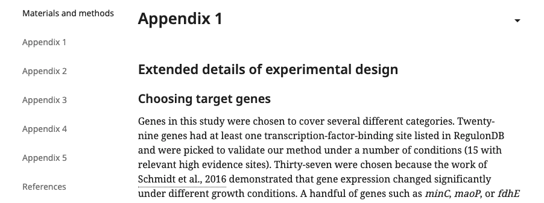
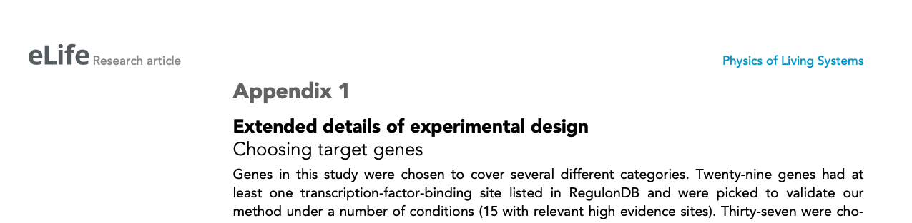

# Appendices

In scientific articles, an appendix contains additional material that is not an essential part of the text itself but can be useful for giving readers a more comprehensive understanding of the topic. Often appendices are used to provide detailed information that would otherwise be too cumbersome to include in the main text. eLife articles can have multiple appendices which appear sequentially at the end of the article - after the reference list in the PDFs and before the reference list on the eLife website. 

eLife's appendices are named numerically \(not alphabetically\) and any related assets are named accordingly, e.g Appendix 2—figure 1. If there is only one appendix, it should still be numbered Appendix 1. 

