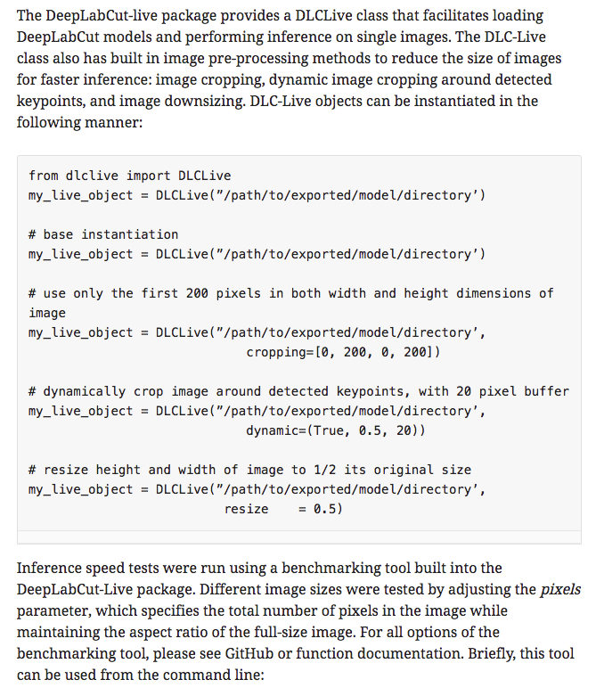
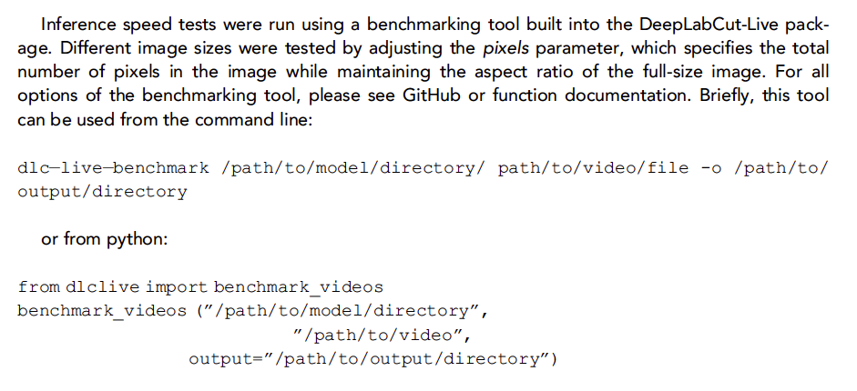
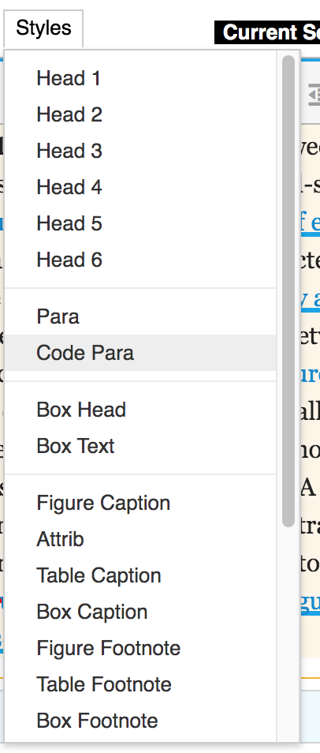
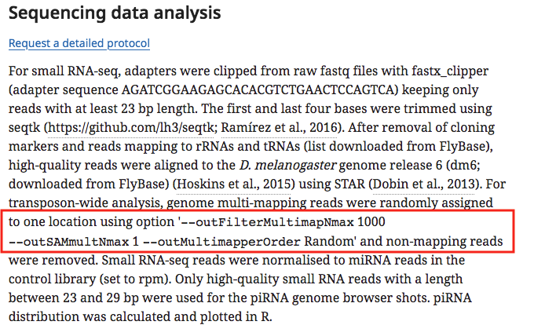
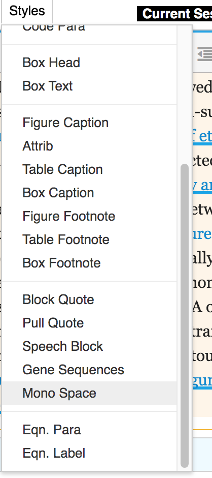
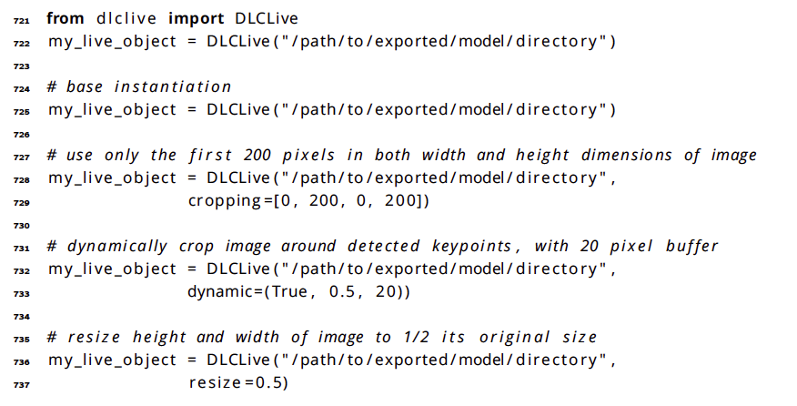
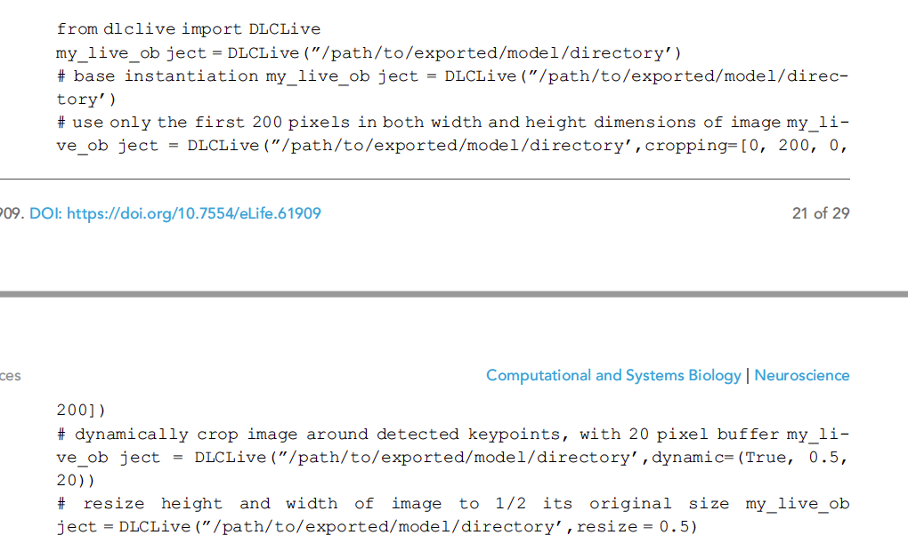
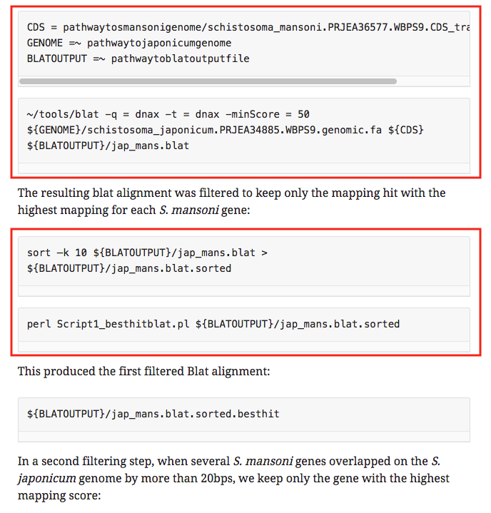

# Code blocks

## What are code blocks?

Authors will sometimes include snippets of code in their articles. This is usually either to illustrate the computational methods that they have used in their work or to provide user guidance to allow readers to replicate that work. Since the exact layout of code is usually important, this needs to be preserved using a 'code block'.





Within a code block, all text is rendered in a monospace font and the spacing and line-breaks are preserved. It is not possible to place hyperlinks, formatting or coloured text within a code block. Please note that some authors do provide colour-coding within their code, so it may need to be explained to them that this cannot be preserved.

Code blocks can be added using the following controls in Kriya 2.0:



## Inline code

Not all code provided in eLife articles will be intended for presentation in a code block. Sometimes authors will provide code snippets or even just the names of particular commands inline as part of a normal paragraph. In these cases, the code may be rendered in monospace so that it is visually distinct from the surrounding text.



Note that monospace formatting can be used for purposes other than highlighting code and it is not required that authors use it to denote code in their text. They may prefer that it be left as plain text and, in general, the original article file should be followed for styling inline code.

Monospace styling can be added using the following control in Kriya 2.0:



## What needs to be checked?

### Code block layout

Generally speaking, the main thing to ensure with code blocks is that they have been captured - as far as possible - as the authors originally intended. Consider the following example:



The authors included specific spacing to ensure that the code can be read correctly. However, when this was processed, this spacing was lost, even though the code block itself was retained.



The Production team had to send the article back to the content processors to fix this so that the spacing was presented as in the original file.

### Multiple stacked code blocks

A related issue is that each set of code should be presented in a single code block; multiple lines/paragraphs should not be split into multiple code blocks. For maximum readability, the stacked blocks in this published example should ideally have been combined so that each piece of code was presented in a single block.



While it is not absolutely the case that multiple stacked code blocks always need to be combined, it is extremely unusual for this not to be required. Unless the authors' original article file makes it clear that two pieces of code are entirely separate \(e.g. through the use of boxes or some other obvious delimiter\), stacked code blocks should be combined into one with the line breaks between them preserved inside.

## Schematron checks

### Content checks

#### code-child-test

**Error**: _code contains a child element, which will display in HTML with its tagging, i.e. '&lt;XXXXXXXXXXXX&gt;XXXXXX&lt;/XXXXXX&gt;'. Strip any child elements._

**Action**: This error indicates that XML tagging is present within a code block. If this is the result of formatting present in the original article file \(e.g. bold `<bold>,` italic `<italic>`, coloured text `<named-content content-type="author-callout-style-a1">`\), the tags will need to be removed and the following author query added:

* Unfortunately, we are not able to preserve style formatting or coloured text in code blocks. Please confirm the updated display is acceptable.

If the XML tagging needs to be preserved - for example, if it _is_ the content that is being displayed in the code blcok - the angle brackets around the tags will need to be escaped in the XML as &gt; \(&lt;\) and &lt; \(&gt;\) to ensure that they display corrected on the website.

#### code-sibling-test	

**Warning**: _code element \(containing the content XXXXXX\) is directly preceded by another code element \(containing the content XXXXXX\). If the content is part of the same code block, then it should be captured using only 1 code element and line breaks added in the xml. If these are separate code blocks \(uncommon, but possible\), then this markup is fine._

**Action**: This warning indicates that two or more code blocks have been placed one after the other with no text between them. As mentioned above, this is most likely a mistake as one continuous section of code should be tagged as a single code block. Unless it is certain from the authors' original article file that multiple code blocks are required \(e.g. they use multiple text boxes or provide a delimiter between two sections of code\), the content processor will need to tag this section of code in one code block.

#### code-sibling-test-2

**Warning**: _code element \(containing the content XXXXXX\) is directly preceded by another code element \(containing the content XXXXXX\). If the content is part of the same code block, then it should be captured using only 1 code element and line breaks added in the xml. If these are separate code blocks \(uncommon, but possible\), then this markup is fine._

**Action**: This warning indicates that two or more code blocks have been placed one after the other with no text between them. As mentioned above, this is most likely a mistake as one continuous section of code should be tagged as a single code block. Unless it is certain from the authors' original article file that multiple code blocks are required \(e.g. they use multiple text boxes or provide a delimiter between two sections of code\), the content processor will need to tag this section of code in one code block.

#### code-test

**Warning**: _XXXXXX element contains what looks like unformatted code - 'XXXXXX' - does this need tagging with &lt;monospace/&gt; or &lt;code/&gt;?_

**Action**: This warning indicates a piece of text that appears to be unformatted code. An example would be "--no-discordant", a parameter for the software bowtie2 that may have been intended as part of a code block or as inline code. Check against the original article file and ensure that the appropriate formatting is applied.

### XML structure checks

#### code-parent-test

**Error**: _A code element must be contained in a p element. The code element \(containing the content XXXXXX\) is contained in a XXXXXX element._

**Action**: All code blocks should be placed within the same paragraph element &lt;p&gt; as the text that precedes them. This error indicates that a code block element &lt;code&gt; is contained within another kind of element. The code block will need to be moved so that it is a child of the correct element. This may require intervention from the content processor's support team if it cannot be resolved through the system interface.

## XML structure

Example of a code block in an article paragraph. Note that the spacing is preserved in the XML as shown here:

```markup
<p>The DeepLabCut-live package provides a DLCLive class that facilitates loading DeepLabCut
models and performing inference on single images. The DLC-Live class also has built in image
pre-processing methods to reduce the size of images for faster inference: image cropping,
dynamic image cropping around detected keypoints, and image downsizing. DLC-Live objects can be
instantiated in the following manner:
<code xml:space="preserve">
from dlclive import DLCLive
my_live_object = DLCLive(”/path/to/exported/model/directory’)

# base instantiation
my_live_object = DLCLive(”/path/to/exported/model/directory’)

# use only the first 200 pixels in both width and height dimensions of image
my_live_object = DLCLive(”/path/to/exported/model/directory’,
                             cropping=[0, 200, 0, 200])

# dynamically crop image around detected keypoints, with 20 pixel buffer
my_live_object = DLCLive(”/path/to/exported/model/directory’,
                             dynamic=(True, 0.5, 20))

# resize height and width of image to 1/2 its original size
my_live_object = DLCLive(”/path/to/exported/model/directory’,
                          resize    = 0.5)
</code>
</p>
```

