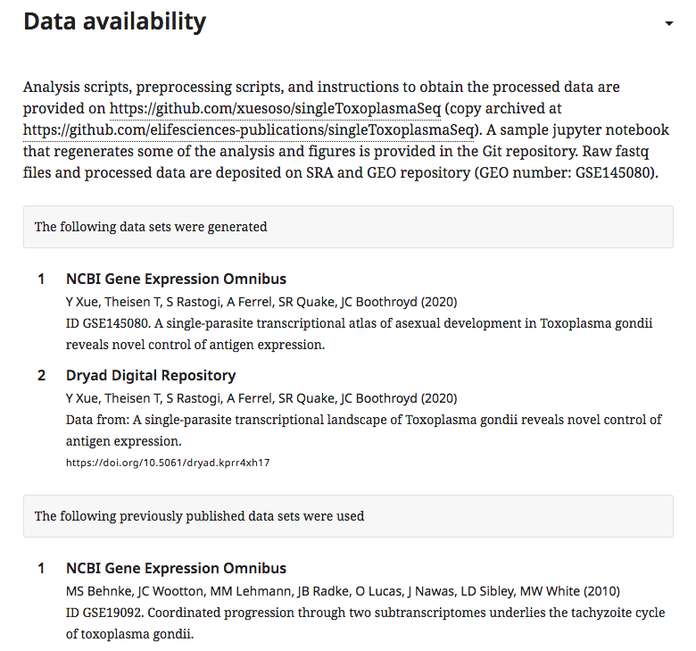
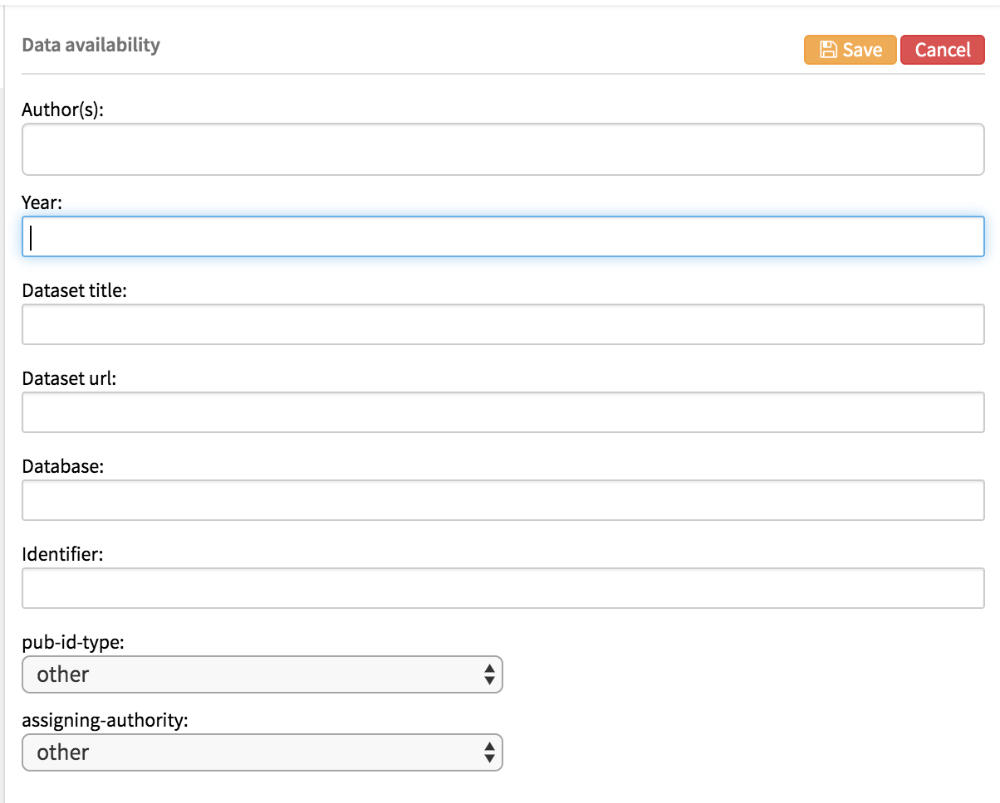
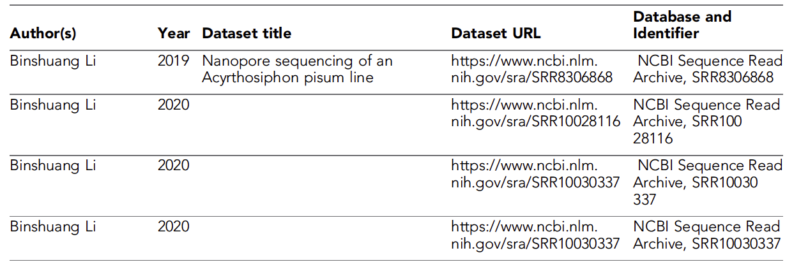
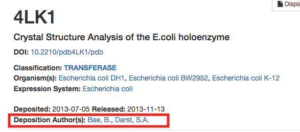
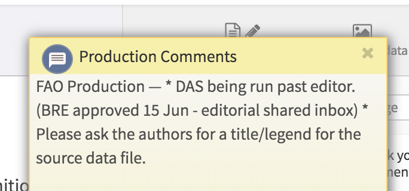
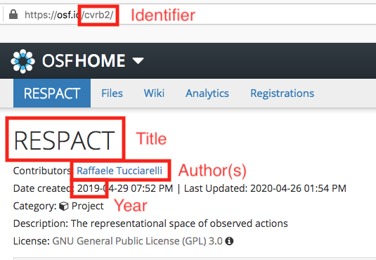
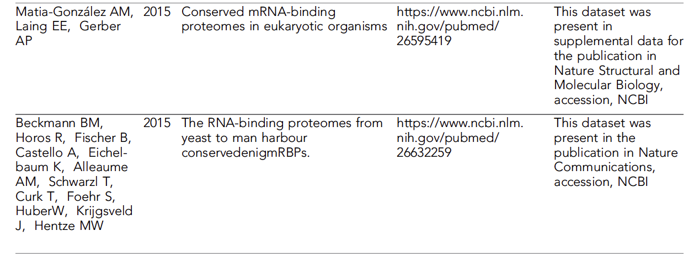
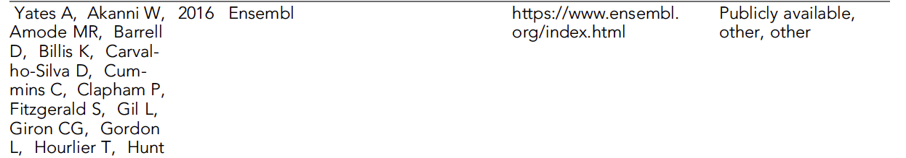
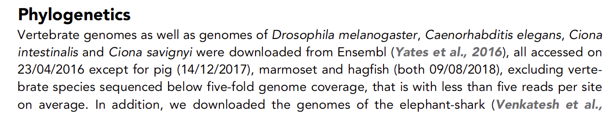

# Data availability

## What is the data availability section?

The data availability section provides information on how to access the data used in or generated by the work being reported in an article. eLife strongly encourages authors to deposit any data they generate in a dedicated open repository so that it is available for further study and to allow the replication of their results, and to acknowledge any previously published datasets that they have used.



This section consists of three parts - the data availability statement, generated datasets and previously published datasets.

* **Data availability statement**: a short paragraph describing the data that has been generated and where it has been deposited. If all the data is contained in the article and supporting files, or no data was generated at all, this will be stated instead.
* **Generated datasets**: reference details for all generated datasets. These are entered as data references but are listed here rather than in the main reference list. Full bibliographic details are required for each entry \(author list, year, title, database, a direct link and an identifier\).
* **Previously published datasets**: reference details for all previous datasets that were used. Same as the above, only for data that was used in the work, rather than generated by it.

In research content, the data availability statement is mandatory. The other two parts are optional, depending on whether any major datasets were generated or used. If only a small amount of data was generated, the authors may chose to include it as source data files for their article rather than submitting it to a repository, meaning no datasets need to be listed in this section. Relatedly, if previously published data was taken wholly from a journal article rather than from a repository, citing that article in the main text is sufficient and no entry in the data availability section is required. Finally, in the case where no data was generated at all, the data availability statement should reflect this.

Feature content does not require a data availability section.

## What needs to be checked?

### Data availability statement

The data availability statement should be a single paragraph consisting of complete sentences, ending in a full stop. Spelling and grammar errors should be corrected in the same manner as the main text.

The contents of the statement should be reflected in the rest of the dataset section. If specific generated or previously published datasets are mentioned in the statement, they should be entered under the appropriate headings below. If the authors mention using an entire database, however, it will not be appropriate to add a citation entry.

Any statement that indicates data is available on request from the authors will need to be approved by Editorial prior to publication. Cases where this is acceptable include exceptionally large datasets that cannot be supported by existing repositories and patient data that cannot be anonymised.

Data availability statements may also mention code that has been made publicly available by the authors. Instructions on how to deal with this can be found [here](../../toolkit/github/forking-git-based-repos.md#checklist-for-forking-repositories).

### Generated datasets

Each entry under the generated datasets heading should be a complete data citation in eLife style. Individual authors should be listed in 'surname initials' style \(e.g. Smith JS\), and a year, title, database and identifier should all be present. A direct URL should also be present for each dataset. Links that just go to a database homepage will need to be replaced. See below for examples of how to do this.

In this section only, references that would result in identical citation details \(e.g. two or more datasets that would be Smith et al., 2020\) do not need to be distinguished with a, b, c etc after the year.

Each dataset listed must be publicly available at the point of publication. This can be checked by accessing the provided URL. See [below](data-availability.md#data-that-is-not-yet-public) for actions in cases where data is not yet available.

Under no circumstances should journal articles be listed as generated datasets - these should be given in the main reference list only.

### Previously published datasets

The same rules apply as for generated datasets.

## Examples

### Adding datasets

Datasets will usually be entered by the authors on the submission system when they are uploading their article. The details will then be included in the export XML for content processing. At any point during proofing, datasets may be added or removed. Clicking the 'add dataset' control will bring up this editor:



Each of these fields will need to be completed for the dataset to pass schematron validation.

* **Authors**: Enter each author name as a surname followed by initials. A comma separated list \(Smith J, Bloggs T, Muggins I, . . . \) may be pasted into this field and will process into separate names when the return key is pressed.
* **Year**: This should be the year that the dataset was made publicly available. For generated datasets, be aware that this might not be the same as the year of publication for the current article.
* **Dataset title**: The title for the dataset. This is often descriptive of the contents, but may also reflect the article to which the data is related \(e.g. 'Data from: Computational 3D histological phenotyping of whole zebrafish by X-ray histotomography' for a Dryad dataset\).
* **Dataset URL**: A direct link to the dataset. This should not be a link to a database home page \(e.g. https://www.rcsb.org/\) but should instead take the reader straight to the data. 
* **Database**: The name of the repository in which the data has been deposited.
* **Identifier**: A unique string that can be used to identify the dataset. This may be a DOI, an accession number or simply an ID unique to the database in which the data has been stored.
* **pub-id-type**: The type of identifier present. Chose from: accession, archive, doi. This cannot be left as 'other'. Guidance on which databases take which value for this field can be found [here](data-availability.md#database-examples).
* **assigning-authority**: The organisation that assigned the identifier. Often the organisation that hosts/maintains the database. This can be set to 'other' if multiple organisations are involved or the authority is not on the list of allowed values. The values for common databases can be found [here](data-availability.md#database-examples).

Once all the fields are completed, the dataset can be saved and it will appear in the relevant section. The editor is the same for generated and previously published datasets.

### Incomplete datasets

Sometimes, the authors will not have provided the complete dataset information when they submit the article. This can be because they did not have the finalised details, or simply because they did not want to fill out all the fields at the time. The full details must be added prior to publication.



For example if the authors have simply added 'Smith et al.' or similar in the submission system, the full author list will need to be located and entered. For some datasets, this can be as simple as following the URL, since the page will often show the required details. See [https://www.rcsb.org/structure/4lk1](https://www.rcsb.org/structure/4lk1):



The same method can be used to identify missing titles, publication dates and so on.

However, some databases do not display the required information in an easily accessible manner. The NCBI BioProject, for example, will usually only show the institution or group from which the data was deposited, rather than the individual researchers responsible.


In cases where the dataset information cannot be found from the link, or the authors have not provided a proper URL in the first place, the following queries should be used to ask the author to provide the missing details. Please combine these where necessary.

* Please provide the full author list for this dataset.
* Please provide the year for this dataset.
* Please provide the accession number for this dataset.

In cases where the authors have not provided a URL, or where they have provided a link to the database homepage rather than a specific dataset, it may be possible to derive the specific URL. For example, if the dataset is in the NCBI Gene Expression Omnibus, [https://www.ncbi.nlm.nih.gov/geo/](https://www.ncbi.nlm.nih.gov/geo/), and the authors provide an accession number, GSE143881, then the direct URL will be [https://www.ncbi.nlm.nih.gov/geo/query/acc.cgi?acc=GSE143881](https://www.ncbi.nlm.nih.gov/geo/query/acc.cgi?acc=GSE143881). Further examples of URLs can be found [below](data-availability.md#database-examples). It will usually be possible to replace the identifier within the example link with the one the authors have provided to get the final URL. Please note, however, that this link may not be active yet \(this might be why the authors did not provide it\), so action will need to be [taken accordingly](data-availability.md#data-that-is-not-yet-public).

If it is not possible to derive the URL from the information provided \(e.g. the authors did not provide an identifier, or the database has highly complex URLs\), please use the following author query:

* Please enter a direct URL for this dataset, not just the homepage for the database as a whole.

### Data available 'on request'

It is standard practice at many journals to allow authors to make their data available only 'on request', meaning that a reader must contact the corresponding author to receive the data underlying an article. To ensure openness, eLife instead encourages authors to deposit all their data in a dedicated repository or a more general archive such as Dryad or figshare, where it will be available to anyone who wants it.

If an article is submitted with a data availability statement that states generated data is available on request, the Editorial team will ask the authors to upload it to an appropriate repository. Usually there will be no problem with this and the data statement will be updated accordingly. On occasion, however, the authors may push back. This can be because of unfamiliarity with the available options and in these cases, the Editorial team will continue to work with the authors to find an appropriate solution. However, it can also be because the dataset is simply too large \(in the range of terabytes of data\) for any repository to accept, necessitating a custom solution such as a dedicated institutional server.

> The raw data that support the findings of this study are several TBs in size and are therefore available on request. A source data file for the main figures has been provided.

Another reason for not making the data publicly available is when it contains identifying information about patients or participants in human trials, or permission to share medical information was not granted.

> As participants did not give consent for their functional MRI data to be released publicly within the General Data Protection Regulation 2016/679 of the EU, these data can be made available on request to the corresponding author.

In both these cases, 'on request' data is permitted with the approval of the editors handling the article. This approval will be indicated in the Production Comments if it has been received prior to export from the submission system; if approval is outstanding, this should also be indicated in these comments.



The article cannot be published until this approval is granted, but proofing may proceed in the meantime.

If approval for 'on request' data has not been indicated, the Production team should contact the Editorial team to establish whether they are working on this issue already and what action needs to be taken.

### Data available 'on acceptance'

Related to the above, sometimes when authors are submitting their article, they will hold back data in order to keep it confidential until the article has passed peer review

> All data generated or analysed during this study are included in the manuscript and supporting files. Source data files will be made available upon acceptance

In these cases, the article should be updated with the full dataset information and/or additional source data files. Ideally this will happen before export from the submission system \(e.g. when the revised submission is uploaded\). However, sometimes there will be a delay and an article will be exported before the data has been finalised.

If a data availability statement still indicates that files or data will be available on acceptance, the Production team will need to contact the Editorial team to establish whether they are working on this issue already and what action needs to be taken. Most likely, the data availability section will need to be updated with the final details for the datasets and/or source data files. In some cases, however, the data will have been incorporated into the main article and the mention of 'on acceptance' data can be deleted.

Please check the Production Comments for any notes from the Editorial team regarding this data.

### Data mentioned in the statement but not listed as a citation

Authors will sometimes mention data in their data availability statement without entering the corresponding dataset details.

> Data and codes have been archived at the Open Science Framework \([https://osf.io/cvrb2/](https://osf.io/cvrb2/)\).

If they have provided the database name and identifier or a URL, as in the above example, it should be possible to add a generated dataset entry for this dataset. For the Open Science Framework, the details can be taken from the landing page:



If it is not possible to add the dataset\(s\) based on the information provided, either because it is incomplete , the data is not yet public or the dataset landing page does not provide all the required details, please query the author:

* Please provide the full details for the mentioned dataset\(s\) \(authors, year, title, database, identifier, direct URL\) and ensure that the data is publicly available.

A variation on this issue occurs when the authors do not have the final details for their dataset when they are submitting their article:

> All data generated or analysed during this study are included in the manuscript and supporting files. Source files have been provided for Figure 9. We are working with www.webKnossos.org to provide a direct link to our electron micrograph dataset.

In these cases, the same author query is appropriate and the data availability statement will need to be updated once the authors have provided the full information.

### Journal articles entered as datasets

Some authors misunderstand the instructions around datasets and include citations of journal articles in the data availability section:



Provided an article is also mentioned in the main reference list and cited in the text, the data entry should be removed. If the reference is not in the main reference list, the author should be asked to move it there with the following query:

* This section is for individual datasets deposited to dedicated repositories only. Citations of previous journal publications should be placed in the main reference list. Please indicate where in the article text this reference should be cited.

### Whole databases entered as datasets

Some authors will enter citations of entire databases or data browsers. Since this section is only intended to cover individual datasets, this is inappropriate. Usually, it is possible to spot these by the lack of identifier in the information provided \(either on its own or in the URL\). For example, the following is a citation of Ensembl \([https://www.ensembl.org/index.html](https://www.ensembl.org/index.html)\), a genome browser.



Searching the text for 'Ensembl' shows that the authors downloaded multiple genomes from this site as part of their work and that they cited the appropriate publication in accordance with Ensembl's citation guidelines \([https://www.ensembl.org/info/about/publications.html](https://www.ensembl.org/info/about/publications.html)\).



The citation of the database could therefore be removed completely from the previously published datasets section.

If the authors do not mention the database within their text, they will need to be queried to clarify whether they used the whole database or if specific datasets can be listed instead.

* This section is for individual datasets only. Whole databases should be cited in the main text rather than listed here. Please provide the details for any specific datasets used, or indicate where in the text this database should be mentioned.

Once the authors have responded, the entry for the whole database can be replaced with one or more specific datasets, or removed entirely in favour of a citation or URL link in the main text.

### Data that is not yet public

All datasets listed under generated or previously published should be publicly available at the point of publication. This can be checked by going to the URL provided. If this resolves to a 'dataset still private' screen or returns a 'page not found' message, the dataset has not been released.

Please note that Dryad datasets in particular will only be released when the article is published online and the Dryad site has detected that publication. This is outside the authors control, so they do not need to be queried about releasing Dryad data.

In all other cases, please ask the author to arrange the release of the data:

* Please make all datasets listed here publicly available as soon as possible.

In some cases, the author may provide a review link for the data rather than the final link. This is to allow the reviewers to access the data before final public release. Such links can be identified by 'review' or 'reviewer' in the URL. For example, [https://dataview.ncbi.nlm.nih.gov/object/PRJNA475219?reviewer=f1ccdfce21ljl8v6q2v8mctid7](https://dataview.ncbi.nlm.nih.gov/object/PRJNA475219?reviewer=f1ccdfce21ljl8v6q2v8mctid7) is the review link for the dataset [https://www.ncbi.nlm.nih.gov/bioproject/PRJNA475219](https://www.ncbi.nlm.nih.gov/bioproject/PRJNA475219). Any link like this will need to be replaced with the final dataset URL before publication. If it is not possible to identify the final link based on the reviewer link or the given identifier, the author should be queried:

* Please provide the final URL for this dataset.

Note that reviewer links often work only for a limited period, so you may encounter messages such as the following. Helpfully, these will sometimes provide the final URL.


### References to files within the article

If the authors mention specific files or figures within their article, please make sure that they have referenced them correctly in eLife style and are using the final names for these assets. For example, this data statement refers to figures and supplementary files using their originally submitted titles rather than those they would be given in the final article:

> All data analyzed during this study are included in the manuscript. We also provided source data files for: Figures 2, 3, 4 and 5; for supplemental figure S2 and for supplemental tables S1, S2. S3, S4, S5, S6, S7 and S8.

This therefore need to be updated to:

> All data analyzed during this study are included in the manuscript. We also provided source data files for: Figures 2, 3, 4 and 5; for Figure 4—figure supplement 1; and for Supplementary files 1–8.

If it is not clear how to update citations of figures and files to use their final names, please query the authors:

* Please update your data availability statement to use the final labels for all figure supplements and supplementary files mentioned.

### Database examples

| Database | Synonyms | pub-id-type | assigning-authority | URL Examples | DOI Examples |
| :--- | :--- | :--- | :--- | :--- | :--- |
| Apollo - University of Cambridge Repository | Apollo, University of Cambridge Repository | doi | University of Cambridge | [https://www.repository.cam.ac.uk/handle/1810/260862](https://www.repository.cam.ac.uk/handle/1810/260862) | [https://doi.org/10.17863/CAM.6018](https://doi.org/10.17863/CAM.6018) |
| ArrayExpress | EBI ArrayExpress | accession | EBI | [https://www.ebi.ac.uk/arrayexpress/experiments/E-MTAB-3557/](https://www.ebi.ac.uk/arrayexpress/experiments/E-MTAB-3557/) |  |
| CRCNS.org | CRCNS, Collaborative Research in Computational Neuroscience, Collaborative Research in Computational Neuroscience - Data sharing | doi | CRCNS | [http://crcns.org/data-sets/bst/pag-1](http://crcns.org/data-sets/bst/pag-1) | [http://doi.org/10.6080/K0R49P0V](http://doi.org/10.6080/K0R49P0V) |
| Dryad Digital Repository | Dryad | doi | Dryad | [https://datadryad.org//resource/doi:10.5061/dryad.8153g](https://datadryad.org//resource/doi:10.5061/dryad.8153g) | [https://doi.org/10.5061/dryad.8153g](https://doi.org/10.5061/dryad.8153g) |
| EBI European Nucleotide Archive | European Nucleotide Archive, ENA, EBI ENA | accession | EBI | [https://www.ebi.ac.uk/ena/data/search?query=PRJEB18563](https://www.ebi.ac.uk/ena/data/search?query=PRJEB18563) |  |
| Edinburgh DataShare |  | doi | Edinburgh University | [https://datashare.is.ed.ac.uk/handle/10283/1922](https://datashare.is.ed.ac.uk/handle/10283/1922) |  |
| Electron Microscopy Data Bank | EMDB, EMDataBank, The Electron Microscopy Data Bank | accession | EMDB | [http://emsearch.rutgers.edu/atlas/5778\_summary.html](http://emsearch.rutgers.edu/atlas/5778_summary.html) |  |
| Electron Microscopy Data Bank | EMDB, EMDataBank, The Electron Microscopy Data Bank | accession | EMDB | [http://www.ebi.ac.uk/pdbe/entry/emdb/EMD-5778](http://www.ebi.ac.uk/pdbe/entry/emdb/EMD-5778) |  |
| ETH Library Research Collection | ETH Research Collection | doi | ETH Zurich | [https://www.research-collection.ethz.ch/handle/20.500.11850/300799](https://www.research-collection.ethz.ch/handle/20.500.11850/300799) | [https://doi.org/10.3929/ethz-b-000300799](https://doi.org/10.3929/ethz-b-000300799) |
| figshare | Figshare, FigShare | doi | figshare | [https://figshare.com/articles/fMRI\_to\_intraneural\_microstimulation\_of\_single\_mechanoreceptive\_afferents/3205552](https://figshare.com/articles/fMRI_to_intraneural_microstimulation_of_single_mechanoreceptive_afferents/3205552) | [https://dx.doi.org/10.6084/m9.figshare.3205552](https://dx.doi.org/10.6084/m9.figshare.3205552) |
| GeneNetwork | WebQTL | accession | University of Tennessee | [http://www.genenetwork.org/webqtl/main.py?FormID=sharinginfo&GN\_AccessionId=327](http://www.genenetwork.org/webqtl/main.py?FormID=sharinginfo&GN_AccessionId=327) |  |
| NCBI BioProject | BioProject | accession | NCBI | [https://www.ncbi.nlm.nih.gov/bioproject/263038](https://www.ncbi.nlm.nih.gov/bioproject/263038) |  |
| NCBI BioSample | BioSample | accession | NCBI | [https://www.ncbi.nlm.nih.gov/biosample/SAMN10501893](https://www.ncbi.nlm.nih.gov/biosample/SAMN10501893) |  |
| NCBI dbGaP | dbGaP | accession | NCBI | [https://www.ncbi.nlm.nih.gov/projects/gap/cgi-bin/study.cgi?study\_id=phs001660.v1.p1](https://www.ncbi.nlm.nih.gov/projects/gap/cgi-bin/study.cgi?study_id=phs001660.v1.p1) |  |
| NCBI Gene Expression Omnibus | Gene Expression Omnibus, GEO, NCBI GEO | accession | NCBI | [https://www.ncbi.nlm.nih.gov/geo/query/acc.cgi?acc=GSE69545](https://www.ncbi.nlm.nih.gov/geo/query/acc.cgi?acc=GSE69545) |  |
| NCBI Nucleotide | Nucleotide | accession | NCBI | [https://www.ncbi.nlm.nih.gov/nuccore/KY616976](https://www.ncbi.nlm.nih.gov/nuccore/KY616976) |  |
| NCBI Sequence Read Archive | Sequence Read Archive, SRA, Short Read Archive, NCBI SRA | accession | NCBI | [https://www.ncbi.nlm.nih.gov/sra/?term=SRA012474](https://www.ncbi.nlm.nih.gov/sra/?term=SRA012474) |  |
| NIMH Data Archive  | NDA | archive | NIMH | [https://nda.nih.gov/edit\_collection.html?id=2890](https://nda.nih.gov/edit_collection.html?id=2890) |  |
| Open Science Framework | OSF | archive | Open Science Framework | [https://osf.io/6hmrz/](https://osf.io/6hmrz/) |  |
| Oxford University Research Archive | ORA | archive | Oxford University | [https://ora.ox.ac.uk/objects/uuid:09bef38c-999f-4fb7-aa46-14eda3123571](https://ora.ox.ac.uk/objects/uuid:09bef38c-999f-4fb7-aa46-14eda3123571) |  |
| PeptideAtlas |  | archive | PeptideAtlas | [https://db.systemsbiology.net/sbeams/cgi/PeptideAtlas/PASS\_View?identifier=PASS01443](https://db.systemsbiology.net/sbeams/cgi/PeptideAtlas/PASS_View?identifier=PASS01443) |  |
| PRIDE | EBI PRIDE, PRoteomics IDEntifications Database | accession | EBI | [https://www.ebi.ac.uk/pride/archive/projects/PXD007787](https://www.ebi.ac.uk/pride/archive/projects/PXD007787) |  |
| ProteomeXchange |  | accession |  | [http://proteomecentral.proteomexchange.org/cgi/GetDataset?ID=PXD005831](http://proteomecentral.proteomexchange.org/cgi/GetDataset?ID=PXD005831) |  |
| RCSB Protein Data Bank | Protein Data Bank, PDB, RCSB PDB, Protein Databank | accession | PDB | [https://www.rcsb.org/structure/5HOO](https://www.rcsb.org/structure/5HOO) | [http://dx.doi.org/10.2210/pdb5HOO/pdb](http://dx.doi.org/10.2210/pdb5HOO/pdb) |
| webKnossos |  | archive | webKnossos | [https://wklink.org/8732](https://wklink.org/8732) |  |
| Zenodo |  | doi | Zenodo | [https://zenodo.org/record/6960\#.WqEkGoL7lTY](https://zenodo.org/record/6960#.WqEkGoL7lTY) | [http://dx.doi.org/10.5281/zenodo.6960](http://dx.doi.org/10.5281/zenodo.6960) |

## Schematron warnings

### Content warnings

#### ext-link-child-test-5

**Warning**: _ext-link looks like it points to a review dryad dataset - XXXXXX. Should it be updated?_

**Action**: This warning indicates that the URL for a dataset is a Dryad reviewer link rather than the final DOI. The URL will need to be replaced with the DOI URL \(e.g. https://doi.org/10.5061/dryad.4nb12g2\). The DOI string may have been given in the identifier field or in the data availability statement. If not and this warning occurs at the pre-author stage, the following query may be used:

* Please provide the DOI for this dataset.

#### sec-test-3

**Warning**: _Section has a title 'XXXXXX'. Is it a duplicate of the data availability section \(and therefore should be removed\)?_

**Action**: This warning indicates that there is a section within the main body of an article that has the title 'Data availability' or a common variation of this \(e.g. 'Data statement', 'Data and code availability', 'Data accessibility' etc\). This can mean that the authors have included a copy of the statement they entered on the submission system.

If the main-text data statement is identical to the one entered in the Data availability section and does not contain any reference citations, it should be deleted entirely. If it is identical and any references cited are also cited elsewhere in the main text, it can also be deleted.

If the statement in the main text contains reference citations that are not cited elsewhere, it must be retained to preserve these citations \(live citations cannot currently be included in the Data availability statement\).

In cases where the main-text data statement and the Data availability statement do not match, there are several possible options. If the Data availability statement contains information about datasets while the main-text statement says something like "data will be submitted on acceptance", the main-text statement can be deleted.

However, if the main-text statement contains additional information not captured in the Data availability statement, it will be necessary for the Production team to contact the Editorial team \(who may already be working on this issue\) or query the authors in order to clarify what the final Data availability statement should read.

For example, in the following case, the Data availability statement was:

> Data have been deposited on GEO under the accession number GSE140919. A source data file has been provided.

But an in-text statement mentioned additional data submitted to dbGAP:

> The data for this study have been deposited in the database dbGAP. The sequenceing data can be found as GenBank GSE140919. Data can also be found in the included source file.

Since the authors did not provide details for their dbGAP dataset, the Production team first contacted Editorial to check if they were working on this already. The authors were then asked to provide the missing information but they responded that they had not, in fact, deposited data to dbGAP. The in-text statement was then deleted and the Data availability statement was retained as originally provided.

In another instance, the Data availability statement was

> All data generated or analyzed during this study are included in the manuscript and supporting files

while the in-text equivalent read

> Representative segmented neurons for all presented neuron types will be available at Virtual Fly Brain \([https://www.virtualflybrain.org](https://www.virtualflybrain.org/)\).

An author query was left requesting further details and once these were provided, the main-text statement was removed and the text was combined with the Data availability statement:

> All data generated or analyzed during this study are included in the manuscript and supporting files. Representative segmented neurons for all presented neuron types are available at Virtual Fly Brain \([http://virtualflybrain.org/data/Lee\_Lineage2020](http://virtualflybrain.org/data/Lee_Lineage2020)\).

#### pre-das-elem-person-group-1

**Warning**: _The reference in position XX of the data availability section does not have any authors \(no person-group\[@person-group-type='author'\]\). Please ensure to add them in or query the authors asking for the author list._

**Action**: At the pre-author stage, this warning indicates a dataset without any authors. The author most be asked to provide the missing details if they cannot be found using the other dataset information. This warning fires if the `<person-group>` element is missing.

* Please provide the full author list for this dataset.

#### final-das-elem-person-group-1

**Error**: _The reference in position XX of the data availability section does not have any authors \(no person-group\[@person-group-type='author'\]\). Please ensure to add them._

**Action**: At the post-author stage, this error indicates a dataset without any authors. The author should be asked by email to provide the missing details if they cannot be found using the other dataset information. This error fires if the `<person-group>` element is missing.

#### pre-das-elem-person-1

**Warning**: _The reference in position XX of the data availability section does not have any authors. Please ensure to add them in or query the authors asking for the author list._

**Action**: At the pre-author stage, this warning indicates a dataset without any authors. The author most be asked to provide the missing details if they cannot be found using the other dataset information. This warning fires if there are no names within a `<person-group>` element.

* Please provide the full author list for this dataset.

#### final-das-elem-person-1

**Error**: _The reference in position XXXXXX of the data availability section does not have any authors \(person-group\[@person-group-type='author'\]\). Please ensure to add them in._

**Action**: At the post-author stage, this error indicates a dataset without any authors. The author should be asked by email to provide the missing details if they cannot be found using the other dataset information. This error fires if there are no names within a `<person-group>` element.

#### pre-das-elem-data-title-1

**Warning**: _The reference in position XX of the data availability section does not have a title \(no data-title\). Please ensure to add it in or query the authors asking for it._

**Action**: At the pre-author stage, this warning indicates a dataset without a title. The author most be asked to provide the missing details if they cannot be found using the other dataset information.

* Please provide the title for this dataset.

#### final-das-elem-data-title-1

**Error**: _The reference in position XX of the data availability section does not have a title \(no data-title\). Please ensure to add it_

**Action**: At the post-author stage, this error indicates a dataset without a title. The author should be asked by email to provide the missing details if they cannot be found using the other dataset information.

#### pre-das-elem-source-1

**Warning**: _The reference in position XX of the data availability section does not have a database name \(no source\). Please ensure to add it in or query the authors asking for it._

**Action**: At the pre-author stage, this warning indicates a dataset without a database name. The author most be asked to provide the missing details if they cannot be found using the other dataset information.

* Please provide the database name for this dataset.

#### final-das-elem-source-1

**Error**: _The reference in position XX of the data availability section does not have a database name \(no source\). Please ensure to add it in._

**Action**: At the post-author stage, this error indicates a dataset without a database name. The author should be asked by email to provide the missing details if they cannot be found using the other dataset information.

#### pre-das-elem-pub-id-1

**Warning**: _The reference in position XX of the data availability section does not have an identifier \(no pub-id\). Please ensure to add it in or query the authors asking for it._

**Action**: At the pre-author stage, this warning indicates a dataset without an identifier. The author most be asked to provide the missing details if they cannot be found using the other dataset information.

* Please provide the identifier \(accession number or DOI\) for this dataset.

Alternatively, if the URL and title provided for this dataset indicate that the entry is for an [entire database](data-availability.md#whole-databases-entered-as-datasets), the author may need to be asked to clarify what should be cited:

* This section is for individual datasets only. Whole databases should be cited in the main text rather than listed here. Please provide the details for any specific datasets used, or indicate where in the text this database should be mentioned.

 This warning fires if the `<pub-id>` element is missing.

#### final-das-elem-pub-id-1

**Error**: _The reference in position XX of the data availability section does not have an identifier \(no pub-id\). Please ensure to add it in._

**Action**: At the post-author stage, this error indicates a dataset without an identifier. The author should be asked by email to provide the missing details if they cannot be found using the other dataset information. This error fires if the `<pub-id>` element is missing.

#### pre-das-elem-pub-id-2

**Warning**: _The reference in position XX of the data availability section does not have an id \(pub-id is empty\). Please ensure to add it in or query the authors asking for it._

**Action**: At the pre-author stage, this warning indicates a dataset without an identifier. The author most be asked to provide the missing details if they cannot be found using the other dataset information. This warning fires if the `<pub-id>` element is empty.

* Please provide the identifier \(accession number or DOI\) for this dataset.

#### final-das-elem-pub-id-2

**Error**: _The reference in position XX of the data availability section does not have an id \(pub-id is empty\). Please ensure to add it in._

**Action**: At the post-author stage, this error indicates a dataset without an identifier. The author should be asked by email to provide the missing details if they cannot be found using the other dataset information. This error fires if the `<pub-id>` element is empty.

#### pre-das-elem-year-1

**Warning**: _The reference in position XX of the data availability section does not have a year. Please ensure to add it in or query the authors asking for it._

**Action**: At the pre-author stage, this warning indicates a dataset without a year. The author most be asked to provide the missing details if they cannot be found using the other dataset information. This warning fires if the `<year>` element is missing.

* Please provide the year for this dataset.

#### final-das-elem-year-1

**Error**: _The reference in position XX of the data availability section does not have a year. Please ensure to add it in._

**Action**: At the post-author stage, this error indicates a dataset without a year. The author should be asked by email to provide the missing details if they cannot be found using the other dataset information. This error fires if the `<year>` element is missing.

#### pre-das-elem-citation-year-2

**Warning**: _Reference with id XXXXXX has an empty year. Please ensure to add it in or query the authors asking for it._

**Action**: At the pre-author stage, this warning indicates a dataset without a year. The author most be asked to provide the missing details if they cannot be found using the other dataset information. This warning fires if the `<year>` element is empty.

* Please provide the year for this dataset.

#### final-das-elem-citation-year-2

**Error**: _Reference with id XXXXXX has an empty year. Please ensure to add it in._

**Action**: At the post-author stage, this error indicates a dataset without a year. The author should be asked by email to provide the missing details if they cannot be found using the other dataset information. This error fires if the `<year>` element is empty.

#### das-elem-cit-3

**Error**: _The reference in position XX of the data availability section has a link \(XXXXXX\) which is the same as another dataset reference in that section. Dataset reference links should be distinct._

**Action**: This error indicates that a dataset's URL matches that of another dataset in this section. Check to find out which datasets are duplicates and see if the rest of the details match as well. If they do, all but one of the identical datasets should be deleted. If the title or identifier do not match when the URLs do, check to see if the URL should be updated to match the identifier.

For example, if the URLS for two datasets are both [https://www.ncbi.nlm.nih.gov/geo/query/acc.cgi?acc=GSE135351](https://www.ncbi.nlm.nih.gov/geo/query/acc.cgi?acc=GSE135351), but the identifiers are GSE135351 and GSE143881, the dataset for the second identifier should have the URL [https://www.ncbi.nlm.nih.gov/geo/query/acc.cgi?acc=GSE143881](https://www.ncbi.nlm.nih.gov/geo/query/acc.cgi?acc=GSE143881).

#### das-elem-cit-4

**Warning**: _The reference in position XX of the data availability section has a pub-id \(XXXXXX\) which is the same as another dataset reference in that section. This is very likely incorrect. Dataset reference pub-id should be distinct._

**Action**: This warning indicates that a dataset's identifier matches that of another dataset in this section. Check to find out which datasets are duplicates and see if the rest of the details match as well. If they do, all but one of the identical datasets should be deleted. If the title or URL do not match when the identifiers do, check to see if the identifier should be updated to match the URL.

For example, if the indentifiers for two datasets are both GSE135351, but the URLs are [https://www.ncbi.nlm.nih.gov/geo/query/acc.cgi?acc=GSE135351](https://www.ncbi.nlm.nih.gov/geo/query/acc.cgi?acc=GSE135351) and [https://www.ncbi.nlm.nih.gov/geo/query/acc.cgi?acc=GSE143881](https://www.ncbi.nlm.nih.gov/geo/query/acc.cgi?acc=GSE143881), the dataset for the second URL should have the identifier GSE143881.

#### das-pub-id-1

**Error**: _Each pub-id element must have an @pub-id-type with one of these types: accession, archive, or doi._

**Action**: This error indicates that a pub-id-type has not been set for a dataset \(it has been left as 'other'\). Set the pub-id-type to the appropriate value. The values for this attribute for datasets in commonly encountered databases can be found [above](data-availability.md#database-examples).

#### data-ref-given-names-test-1

**Warning**: _Given names should always be initialised. Ref contains a given names with a string longer than 4 characters - 'XXXXXX' in XXXXXX. Is this a surname captured as given names? Or a fully spelt out given names?_

**Action**: This warning indicates a given name in a `<name>` element within a dataset that consists of more than four characters, likely meaning it is a full name rather than just a set of initials \(XXXXXX in this message will be the given name and the full author name, respectively\). This might be because the name has been entered in full as 'Smith Jonathan' or because the wrong name format has been used \(e.g. 'J Smith' or 'Jonathan Smith'\), resulting in the surname being tagged as the given name.

The affected name will need to be corrected to 'Smith J' format.

#### data-geo-test

**Warning**: _Data reference with the title 'XXXXXX' has a 'https://www.ncbi.nlm.nih.gov/geo' type link, but the database name is not 'NCBI Gene Expression Omnibus' - XXXXXX. Is that correct?_

**Action**: This warning indicates that the database name for a dataset is not the one expected based on the URL provided. This may be due to differing spacing or capitalisation, or the authors may have entered an alternative name for the database. Synonyms for common database names can be found in the list of [database examples](data-availability.md#database-examples). In most cases, the database name should be corrected to the value given in the message. However, please check the database name displayed when following the URL provided and if it does not correspond to the warning message, the Production team will need to investigate further.

XXXXXX will be the dataset title and the current database name in this entry, respectively.

#### data-nucleotide-test

**Warning**: _Data reference with the title 'XXXXXX' has a 'https://www.ncbi.nlm.nih.gov/nuccore' type link, but the database name is not 'NCBI Nucleotide' or 'NCBI GenBank' - XXXXXX. Is that correct?_

**Action**: This warning indicates that the database name for a dataset is not the one expected based on the URL provided. This may be due to differing spacing or capitalisation, or the authors may have entered an alternative name for the database. Synonyms for common database names can be found in the list of [database examples](data-availability.md#database-examples). In most cases, the database name should be corrected to the value given in the message. However, please check the database name displayed when following the URL provided and if it does not correspond to the warning message, the Production team will need to investigate further.

XXXXXX will be the dataset title and the current database name in this entry, respectively.

#### data-bioproject-test

**Warning**: _Data reference with the title 'XXXXXX' has a 'https://www.ncbi.nlm.nih.gov/bioproject' type link, but the database name is not 'NCBI BioProject' - XXXXXX. Is that correct?_

**Action**: This warning indicates that the database name for a dataset is not the one expected based on the URL provided. This may be due to differing spacing or capitalisation, or the authors may have entered an alternative name for the database. Synonyms for common database names can be found in the list of [database examples](data-availability.md#database-examples). In most cases, the database name should be corrected to the value given in the message. However, please check the database name displayed when following the URL provided and if it does not correspond to the warning message, the Production team will need to investigate further.

XXXXXX will be the dataset title and the current database name in this entry, respectively.

#### data-dbgap-test

**Warning**: _Data reference with the title 'XXXXXX' has a 'https://www.ncbi.nlm.nih.gov/gap' type link, but the database name is not 'NCBI dbGaP' - XXXXXX. Is that correct?_

**Action**: This warning indicates that the database name for a dataset is not the one expected based on the URL provided. This may be due to differing spacing or capitalisation, or the authors may have entered an alternative name for the database. Synonyms for common database names can be found in the list of [database examples](data-availability.md#database-examples). In most cases, the database name should be corrected to the value given in the message. However, please check the database name displayed when following the URL provided and if it does not correspond to the warning message, the Production team will need to investigate further.

XXXXXX will be the dataset title and the current database name in this entry, respectively.

#### data-popset-test

**Warning**: _Data reference with the title 'XXXXXX' has a 'https://www.ncbi.nlm.nih.gov/popset' type link, but the database name is not 'NCBI PopSet' - XXXXXX. Is that correct?_

**Action**: This warning indicates that the database name for a dataset is not the one expected based on the URL provided. This may be due to differing spacing or capitalisation, or the authors may have entered an alternative name for the database. Synonyms for common database names can be found in the list of [database examples](data-availability.md#database-examples). In most cases, the database name should be corrected to the value given in the message. However, please check the database name displayed when following the URL provided and if it does not correspond to the warning message, the Production team will need to investigate further.

XXXXXX will be the dataset title and the current database name in this entry, respectively.

#### data-sra-test

**Warning**: _Data reference with the title 'XXXXXX' has a 'https://www.ncbi.nlm.nih.gov/sra' type link, but the database name is not 'NCBI Sequence Read Archive' - XXXXXX. Is that correct?_

**Action**: This warning indicates that the database name for a dataset is not the one expected based on the URL provided. This may be due to differing spacing or capitalisation, or the authors may have entered an alternative name for the database. Synonyms for common database names can be found in the list of [database examples](data-availability.md#database-examples). In most cases, the database name should be corrected to the value given in the message. However, please check the database name displayed when following the URL provided and if it does not correspond to the warning message, the Production team will need to investigate further.

XXXXXX will be the dataset title and the current database name in this entry, respectively.

#### data-biosample-test

**Warning**: _Data reference with the title 'XXXXXX' has a 'https://www.ncbi.nlm.nih.gov/biosample' type link, but the database name is not 'NCBI BioSample' - XXXXXX. Is that correct?_

**Action**: This warning indicates that the database name for a dataset is not the one expected based on the URL provided. This may be due to differing spacing or capitalisation, or the authors may have entered an alternative name for the database. Synonyms for common database names can be found in the list of [database examples](data-availability.md#database-examples). In most cases, the database name should be corrected to the value given in the message. However, please check the database name displayed when following the URL provided and if it does not correspond to the warning message, the Production team will need to investigate further.

XXXXXX will be the dataset title and the current database name in this entry, respectively.

#### data-protein-test

**Warning**: _Data reference with the title 'XXXXXX' has a 'https://www.ncbi.nlm.nih.gov/protein' type link, but the database name is not 'NCBI Protein' - XXXXXX. Is that correct?_

**Action**: This warning indicates that the database name for a dataset is not the one expected based on the URL provided. This may be due to differing spacing or capitalisation, or the authors may have entered an alternative name for the database. Synonyms for common database names can be found in the list of [database examples](data-availability.md#database-examples). In most cases, the database name should be corrected to the value given in the message. However, please check the database name displayed when following the URL provided and if it does not correspond to the warning message, the Production team will need to investigate further.

XXXXXX will be the dataset title and the current database name in this entry, respectively.

#### data-assembly-test

**Warning**: _Data reference with the title 'XXXXXX' has a 'https://www.ncbi.nlm.nih.gov/assembly' type link, but the database name is not 'NCBI Assembly' - XXXXXX. Is that correct?_

**Action**: This warning indicates that the database name for a dataset is not the one expected based on the URL provided. This may be due to differing spacing or capitalisation, or the authors may have entered an alternative name for the database. Synonyms for common database names can be found in the list of [database examples](data-availability.md#database-examples). In most cases, the database name should be corrected to the value given in the message. However, please check the database name displayed when following the URL provided and if it does not correspond to the warning message, the Production team will need to investigate further.

XXXXXX will be the dataset title and the current database name in this entry, respectively.

#### data-ncbi-test-1

**Warning**: _Data reference with an NCBI link 'XXXXXX' is not marked as an accession number, which is likely incorrect._

**Action**: This warning fires when the pub-id-type given for the indicated dataset does not match the expected value based on the URL provided. Pub-id-types for commonly encountered databases can be found [above](data-availability.md#database-examples). Please correct the pub-id-type to the expected value.

#### data-ncbi-test-2

**Warning**: _Data reference with the database source 'XXXXXX' is not marked as an accession number, which is very likely incorrect._

**Action**: This warning fires when the pub-id-type given for the indicated dataset does not match the expected value based on the database name provided. Pub-id-types for commonly encountered databases can be found [above](data-availability.md#database-examples). Please correct the pub-id-type to the expected value.

#### data-ncbi-test-3

**Warning**: _Data reference with an NCBI link 'XXXXXX' is not marked with NCBI as its assigning authority, which must be incorrect._

**Action**: This warning fires when the assigning-authority given for the indicated dataset does not match the expected value based on the URL provided. Assigning-authorities for commonly encountered databases can be found [above](data-availability.md#database-examples). Please correct the assigning-authority to the expected value.

#### data-ncbi-test-4

**Warning**: _Data reference with the database source 'XXXXXX' is not marked with NCBI as its assigning authority, which must be incorrect._

**Action**: This warning fires when the assigning-authority given for the indicated dataset does not match the expected value based on the database name provided. Assigning-authorities for commonly encountered databases can be found [above](data-availability.md#database-examples). Please correct the assigning-authority to the expected value.

#### data-dryad-test-1

**Warning**: _Data reference with the title 'XXXXXX' has a Dryad type doi XXXXXX, but the database name is not 'Dryad Digital Repository' - XXXXXX._

**Action**: This warning indicates that the database name for a dataset is not the one expected based on the DOI provided. This may be due to differing spacing or capitalisation, or the authors may have entered an alternative name for the database. Synonyms for common database names can be found in the list of [database examples](data-availability.md#database-examples). In most cases, the database name should be corrected to the value given in the message. However, please check the database name displayed when following the DOI provided and if it does not correspond to the warning message, the Production team will need to investigate further.

XXXXXX will be the dataset title and the current database name in this entry, respectively.

#### data-dryad-test-2

**Warning**: _Data reference with the title 'XXXXXX' has the database name XXXXXX, but no doi starting with '10.5061/dryad' or '10.7272', which is incorrect._

**Action**: This warning fires when the identifier for the indicated dataset is not a DOI starting with the expected string based on the database name. See [above](data-availability.md#database-examples) for examples of DOIs for commonly encountered databases. Ensure that a DOI of the correct type is entered in the identifier field. If this information cannot be located, query the author to provide the missing details:

* Please provide the final DOI for this dataset.

#### data-dryad-test-3

**Warning**: _Data reference with the title 'XXXXXX' has a Dryad type doi - XXXXXX, but the assigning authority is not Dryad, which must be incorrect._

**Action**: This warning fires when the assigning-authority given for the indicated dataset does not match the expected value based on the DOI provided. Assigning-authorities for commonly encountered databases can be found [above](data-availability.md#database-examples). Please correct the assigning-authority to the expected value.

#### data-rcsbpbd-test-1

**Warning**: _Data reference with the title 'XXXXXX' has a 'http://www.rcsb.org' type link, but the database name is not 'RCSB Protein Data Bank' - XXXXXX. Is that correct?_

**Action**: This warning indicates that the database name for a dataset is not the one expected based on the URL provided. This may be due to differing spacing or capitalisation, or the authors may have entered an alternative name for the database. Synonyms for common database names can be found in the list of [database examples](data-availability.md#database-examples). In most cases, the database name should be corrected to the value given in the message. However, please check the database name displayed when following the URL provided and if it does not correspond to the warning message, the Production team will need to investigate further.

XXXXXX will be the dataset title and the current database name in this entry, respectively.

#### data-rcsbpbd-test-2

**Warning**: _Data reference with the title 'XXXXXX' has a 'http://www.rcsb.org' type link, but is not marked with PDB as its assigning authority, which must be incorrect_

**Action**: This warning fires when the assigning-authority given for the indicated dataset does not match the expected value based on the URL provided. Assigning-authorities for commonly encountered databases can be found [above](data-availability.md#database-examples). Please correct the assigning-authority to the expected value.

#### data-rcsbpbd-test-3

**Warning**: _Data reference with the title 'XXXXXX' has a PDB 'http://www.rcsb.org' type link, but is not marked as an accession type link._

**Action**: This warning fires when the pub-id-type given for the indicated dataset does not match the expected value based on the URL provided. Pub-id-types for commonly encountered databases can be found [above](data-availability.md#database-examples). Please correct the pub-id-type to the expected value.

#### data-emdb-test-1

**Warning**: _Data reference with the title 'XXXXXX' has a 'http://www.ebi.ac.uk/pdbe/emdb' type link, but the database name is not 'Electron Microscopy Data Bank' - XXXXXX. Is that correct?_

**Action**: This warning indicates that the database name for a dataset is not the one expected based on the URL provided. This may be due to differing spacing or capitalisation, or the authors may have entered an alternative name for the database. Synonyms for common database names can be found in the list of [database examples](data-availability.md#database-examples). In most cases, the database name should be corrected to the value given in the message. However, please check the database name displayed when following the URL provided and if it does not correspond to the warning message, the Production team will need to investigate further.

XXXXXX will be the dataset title and the current database name in this entry, respectively.

#### data-emdb-test-2

**Warning**: _Data reference with the title 'XXXXXX' has a 'http://www.ebi.ac.uk/pdbe/emdb' type link, but is not marked with EMDB as its assigning authority, which must be incorrect_

**Action**: This warning fires when the assigning-authority given for the indicated dataset does not match the expected value based on the URL provided. Assigning-authorities for commonly encountered databases can be found [above](data-availability.md#database-examples). Please correct the assigning-authority to the expected value.

#### data-emdb-test-3

**Warning**: _Data reference with the title 'XXXXXX' has a EMDB 'http://www.ebi.ac.uk/pdbe/emdb' type link, but is not marked as an accession type link._

**Action**: This warning fires when the pub-id-type given for the indicated dataset does not match the expected value based on the URL provided. Pub-id-types for commonly encountered databases can be found [above](data-availability.md#database-examples). Please correct the pub-id-type to the expected value.

#### data-arrayexpress-test-1

**Warning**: _Data reference with the title 'XXXXXX' has a 'www.ebi.ac.uk/arrayexpress' type link, but the database name is not 'ArrayExpress' - XXXXXX. Is that correct?_

**Action**: This warning indicates that the database name for a dataset is not the one expected based on the URL provided. This may be due to differing spacing or capitalisation, or the authors may have entered an alternative name for the database. Synonyms for common database names can be found in the list of [database examples](data-availability.md#database-examples). In most cases, the database name should be corrected to the value given in the message. However, please check the database name displayed when following the URL provided and if it does not correspond to the warning message, the Production team will need to investigate further.

XXXXXX will be the dataset title and the current database name in this entry, respectively.

#### data-arrayexpress-test-2

**Warning**: _Data reference with the title 'XXXXXX' has a 'www.ebi.ac.uk/arrayexpress' type link, but is not marked with EBI as its assigning authority, which must be incorrect_

**Action**: This warning fires when the assigning-authority given for the indicated dataset does not match the expected value based on the URL provided. Assigning-authorities for commonly encountered databases can be found [above](data-availability.md#database-examples). Please correct the assigning-authority to the expected value.

#### data-arrayexpress-test-3

**Warning**: _Data reference with the title 'XXXXXX' has an ArrayExpress 'www.ebi.ac.uk/arrayexpress' type link, but is not marked as an accession type link._

**Action**: This warning fires when the pub-id-type given for the indicated dataset does not match the expected value based on the URL provided. Pub-id-types for commonly encountered databases can be found [above](data-availability.md#database-examples). Please correct the pub-id-type to the expected value.

#### data-pride-test-1

**Warning**: _Data reference with the title 'XXXXXX' has a 'www.ebi.ac.uk/pride' type link, but the database name is not 'PRIDE' - XXXXXX. Is that correct?_

**Action**: This warning indicates that the database name for a dataset is not the one expected based on the URL provided. This may be due to differing spacing or capitalisation, or the authors may have entered an alternative name for the database. Synonyms for common database names can be found in the list of [database examples](data-availability.md#database-examples). In most cases, the database name should be corrected to the value given in the message. However, please check the database name displayed when following the URL provided and if it does not correspond to the warning message, the Production team will need to investigate further.

XXXXXX will be the dataset title and the current database name in this entry, respectively.

#### data-pride-test-2

**Warning**: _Data reference with the title 'XXXXXX' has a 'www.ebi.ac.uk/pride' type link, but is not marked with EBI as its assigning authority, which must be incorrect_

**Action**: This warning fires when the assigning-authority given for the indicated dataset does not match the expected value based on the URL provided. Assigning-authorities for commonly encountered databases can be found [above](data-availability.md#database-examples). Please correct the assigning-authority to the expected value.

#### data-pride-test-3

**Warning**: _Data reference with the title 'XXXXXX' has a PRIDE 'www.ebi.ac.uk/pride' type link, but is not marked as an accession type link._

**Action**: This warning fires when the pub-id-type given for the indicated dataset does not match the expected value based on the URL provided. Pub-id-types for commonly encountered databases can be found [above](data-availability.md#database-examples). Please correct the pub-id-type to the expected value.

#### data-zenodo-test-1

**Warning**: _Data reference with the title 'XXXXXX' has a doi starting with '10.5281/zenodo' but the database name is not 'Zenodo' - XXXXXX._

**Action**: This warning indicates that the database name for a dataset is not the one expected based on the DOI provided. This may be due to differing spacing or capitalisation, or the authors may have entered an alternative name for the database. Synonyms for common database names can be found in the list of [database examples](data-availability.md#database-examples). In most cases, the database name should be corrected to the value given in the message. However, please check the database name displayed when following the DOI provided and if it does not correspond to the warning message, the Production team will need to investigate further.

XXXXXX will be the dataset title and the current database name in this entry, respectively.

#### data-zenodo-test-2

**Warning**: _Data reference with the title 'XXXXXX' has the database name XXXXXX, but no doi starting with '10.5281/zenodo', which is incorrect._

**Action**: This warning fires when the identifier for the indicated dataset is not a DOI starting with the expected string based on the database name. See [above](data-availability.md#database-examples) for examples of DOIs for commonly encountered databases. Ensure that a DOI of the correct type is entered in the identifier field. If this information cannot be located, query the author to provide the missing details:

* Please provide the final DOI for this dataset.

#### data-zenodo-test-3

Warning: Data reference with the title 'XXXXXX' has a Zenodo type doi - XXXXXX, but the assigning authority is not Zenodo, which must be incorrect.

**Action**: This warning fires when the assigning-authority given for the indicated dataset does not match the expected value based on the DOI provided. Assigning-authorities for commonly encountered databases can be found [above](data-availability.md#database-examples). Please correct the assigning-authority to the expected value.

#### data-osf-test-1

**Warning**: _Data reference with the title 'XXXXXX' has a 'https://osf.io' type link, but the database name is not 'Open Science Framework' - XXXXXX. Is that correct?_

**Action**: This warning indicates that the database name for a dataset is not the one expected based on the URL provided. This may be due to differing spacing or capitalisation, or the authors may have entered an alternative name for the database. Synonyms for common database names can be found in the list of [database examples](data-availability.md#database-examples). In most cases, the database name should be corrected to the value given in the message. However, please check the database name displayed when following the URL provided and if it does not correspond to the warning message, the Production team will need to investigate further.

XXXXXX will be the dataset title and the current database name in this entry, respectively.

#### data-osf-test-2

**Warning**: _Data reference with the title 'XXXXXX' has a 'https://osf.io' type link, but is not marked with Open Science Framework as its assigning authority, which must be incorrect._

**Action**: This warning fires when the assigning-authority given for the indicated dataset does not match the expected value based on the URL provided. Assigning-authorities for commonly encountered databases can be found [above](data-availability.md#database-examples). Please correct the assigning-authority to the expected value.

#### data-osf-test-3

**Warning**: _Data reference with the title 'XXXXXX' has an OSF 'https://osf.io' type link, but is not marked as an archive type link._

**Action**: This warning fires when the pub-id-type given for the indicated dataset does not match the expected value based on the URL provided. Pub-id-types for commonly encountered databases can be found [above](data-availability.md#database-examples). Please correct the pub-id-type to the expected value.

#### data-osf-test-4

**Warning**: _Data reference with the title 'XXXXXX' has a doi starting with '10.17605/OSF' but the database name is not 'Open Science Framework' - XXXXXX._

**Action**: This warning will fire if an OSF DOI is present for a dataset, but the database name entered is not 'Open Science Framework'. Please correct the database name accordingly.

#### data-osf-test-5

**Warning**: _Data reference with the title 'XXXXXX' has a OSF type doi - XXXXXX, but the assigning authority is not Open Science Framework, which must be incorrect._

**Action**: This warning fires when the assigning-authority given for the indicated dataset does not match the expected value based on the DOI provided. Assigning-authorities for commonly encountered databases can be found [above](data-availability.md#database-examples). Please correct the assigning-authority to the expected value.

#### data-figshare-test-1

**Warning**: _Data reference with the title 'XXXXXX' has a doi starting with '10.6084/m9.figshare' but the database name is not 'figshare' - XXXXXX._

**Action**: This warning indicates that the database name for a dataset is not the one expected based on the DOI provided. This may be due to differing spacing or capitalisation, or the authors may have entered an alternative name for the database. Synonyms for common database names can be found in the list of [database examples](data-availability.md#database-examples). In most cases, the database name should be corrected to the value given in the message. However, please check the database name displayed when following the DOI provided and if it does not correspond to the warning message, the Production team will need to investigate further.

XXXXXX will be the dataset title and the current database name in this entry, respectively.

#### data-figshare-test-2

**Warning**: _Data reference with the title 'XXXXXX' has the database name XXXXXX, but no doi starting with '10.6084/m9.figshare' - is this correct? Figshare sometimes host for other organisations \(example http://doi.org/10.1184/R1/9963566\), so this may be fine._

**Action**: This warning fires when the identifier for the indicated dataset is not a DOI starting with the expected string based on the database name. See [above](data-availability.md#database-examples) for examples of DOIs for commonly encountered databases. For figshare specifically this may be acceptable if the DOI resolves to a figshare-style page branded for another organisation \(e.g. [https://kilthub.cmu.edu/articles/T\_cell\_signaling\_proteins\_3D\_confocal\_microscope\_movies/9963566](https://kilthub.cmu.edu/articles/T_cell_signaling_proteins_3D_confocal_microscope_movies/9963566)\). Figshare hosts such pages on behalf of these organisations, who will have registered the DOIs themselves.

If the DOI itself cannot be located, query the author to provide the missing details:

* Please provide the final DOI for this dataset.

#### data-figshare-test-3

**Warning**: _Data reference with the title 'XXXXXX' has a figshare type doi - XXXXXX, but the assigning authority is not figshare, which must be incorrect._

**Action**: This warning fires when the assigning-authority given for the indicated dataset does not match the expected value based on the DOI provided. Assigning-authorities for commonly encountered databases can be found [above](data-availability.md#database-examples). Please correct the assigning-authority to the expected value.

#### data-proteomexchange-test-1

**Warning**: _Data reference with the title 'XXXXXX' has a 'http://proteomecentral.proteomexchange.org/' type link, but the database name is not 'ProteomeXchange' - XXXXXX. Is that correct?_

**Action**: This warning indicates that the database name for a dataset is not the one expected based on the URL provided. This may be due to differing spacing or capitalisation, or the authors may have entered an alternative name for the database. Synonyms for common database names can be found in the list of [database examples](data-availability.md#database-examples). In most cases, the database name should be corrected to the value given in the message. However, please check the database name displayed when following the URL provided and if it does not correspond to the warning message, the Production team will need to investigate further.

XXXXXX will be the dataset title and the current database name in this entry, respectively.

#### data-proteomexchange-test-2

**Warning**: _Data reference with the title 'XXXXXX' has a 'http://proteomecentral.proteomexchange.org/' type link, but is not marked with 'other' as its assigning authority, which must be incorrect._

**Action**: This warning fires when the assigning-authority given for the indicated dataset does not match the expected value based on the URL provided. Assigning-authorities for commonly encountered databases can be found [above](data-availability.md#database-examples). Please correct the assigning-authority to the expected value.

#### data-proteomexchange-test-3

**Warning**: _Data reference with the title 'XXXXXX' has a ProteomeXchange 'http://proteomecentral.proteomexchange.org/' type link, but is not marked as an accession type link._

**Action**: This warning fires when the pub-id-type given for the indicated dataset does not match the expected value based on the URL provided. Pub-id-types for commonly encountered databases can be found [above](data-availability.md#database-examples). Please correct the pub-id-type to the expected value.

#### data-openneuro-test-1

**Warning**: _Data reference with the title 'XXXXXX' has a doi starting with '10.18112/openneuro' but the database name is not 'OpenNeuro' - XXXXXX._

**Action**: This warning indicates that the database name for a dataset is not the one expected based on the URL provided. This may be due to differing spacing or capitalisation, or the authors may have entered an alternative name for the database. Synonyms for common database names can be found in the list of [database examples](data-availability.md#database-examples). In most cases, the database name should be corrected to the value given in the message. However, please check the database name displayed when following the URL provided and if it does not correspond to the warning message, the Production team will need to investigate further.

XXXXXX will be the dataset title and the current database name in this entry, respectively.

#### data-openneuro-test-2

**Warning**: _Data reference with the title 'XXXXXX' has the database name XXXXXX, but no doi starting with '10.18112/openneuro' or 'openneuro.org/datasets' type link, which is incorrect._

**Action**: 

#### data-openneuro-test-3

**Warning**: _Data reference with the title 'XXXXXX' has a OpenNeuro type doi - XXXXXX, but the assigning authority is not 'other', which must be incorrect._

**Action**: This warning fires when the assigning-authority given for the indicated dataset does not match the expected value based on the DOI provided. Assigning-authorities for commonly encountered databases can be found [above](data-availability.md#database-examples). Please correct the assigning-authority to the expected value.

#### data-synapse-test-1

**Warning**: Data reference with the title 'XXXXXX' has a doi starting with '10.7303/syn' but the database name is not 'Synapse' - XXXXXX.

**Action**: This warning indicates that the database name for a dataset is not the one expected based on the URL provided. This may be due to differing spacing or capitalisation, or the authors may have entered an alternative name for the database. Synonyms for common database names can be found in the list of [database examples](data-availability.md#database-examples). In most cases, the database name should be corrected to the value given in the message. However, please check the database name displayed when following the URL provided and if it does not correspond to the warning message, the Production team will need to investigate further.

XXXXXX will be the dataset title and the current database name in this entry, respectively.

#### data-synapse-test-2

**Warning**: _Data reference with the title 'XXXXXX' has the database name XXXXXX, but no doi starting with '10.7303/syn', which is incorrect._

**Action**: This warning fires when the identifier for the indicated dataset is not a DOI starting with the expected string based on the database name. See [above](data-availability.md#database-examples) for examples of DOIs for commonly encountered databases. Ensure that a DOI of the correct type is entered in the identifier field. If this information cannot be located, query the author to provide the missing details:

* Please provide the final DOI for this dataset.

#### data-synapse-test-3

**Warning**: _Data reference with the title 'XXXXXX' has a Synapse type doi - XXXXXX, but the assigning authority is not 'other', which must be incorrect._

**Action**: This warning fires when the assigning-authority given for the indicated dataset does not match the expected value based on the DOI provided. Assigning-authorities for commonly encountered databases can be found [above](data-availability.md#database-examples). Please correct the assigning-authority to the expected value.

#### data-bmrb-test-1

**Warning**: _Data reference with the title 'XXXXXX' has a 'www.bmrb.wisc.edu/data\_library/summary' type link, but the database name is not 'Biological Magnetic Resonance Data Bank' - XXXXXX. Is that correct?_

**Action**: This warning indicates that the database name for a dataset is not the one expected based on the URL provided. This may be due to differing spacing or capitalisation, or the authors may have entered an alternative name for the database. Synonyms for common database names can be found in the list of [database examples](data-availability.md#database-examples). In most cases, the database name should be corrected to the value given in the message. However, please check the database name displayed when following the URL provided and if it does not correspond to the warning message, the Production team will need to investigate further.

XXXXXX will be the dataset title and the current database name in this entry, respectively.

#### data-bmrb-test-2

**Warning**: _Data reference with the title 'XXXXXX' has a 'www.bmrb.wisc.edu/data\_library/summary' type link, but is not marked with 'other' as its assigning authority, which must be incorrect_

**Action**: This warning fires when the assigning-authority given for the indicated dataset does not match the expected value based on the URL provided. Assigning-authorities for commonly encountered databases can be found [above](data-availability.md#database-examples). Please correct the assigning-authority to the expected value.

#### data-bmrb-test-3

**Warning**: _Data reference with the title 'XXXXXX' has a BMRB 'www.bmrb.wisc.edu/data\_library/summary' type link, but is not marked as an accession type link._

**Action**: This warning fires when the pub-id-type given for the indicated dataset does not match the expected value based on the URL provided. Pub-id-types for commonly encountered databases can be found [above](data-availability.md#database-examples). Please correct the pub-id-type to the expected value.

#### data-morphdbase-test-1

**Warning**: _Data reference with the title 'XXXXXX' has a 'www.morphdbase.de' type link, but the database name is not 'Morph D Base' - XXXXXX. Is that correct?_

**Action**: This warning indicates that the database name for a dataset is not the one expected based on the URL provided. This may be due to differing spacing or capitalisation, or the authors may have entered an alternative name for the database. Synonyms for common database names can be found in the list of [database examples](data-availability.md#database-examples). In most cases, the database name should be corrected to the value given in the message. However, please check the database name displayed when following the URL provided and if it does not correspond to the warning message, the Production team will need to investigate further.

XXXXXX will be the dataset title and the current database name in this entry, respectively.

#### data-morphdbase-test-2

**Warning**: _Data reference with the title 'XXXXXX' has a 'www.morphdbase.de' type link, but is not marked with 'other' as its assigning authority, which must be incorrect_

**Action**: This warning fires when the assigning-authority given for the indicated dataset does not match the expected value based on the URL provided. Assigning-authorities for commonly encountered databases can be found [above](data-availability.md#database-examples). Please correct the assigning-authority to the expected value.

#### data-morphdbase-test-3

**Warning**: _Data reference with the title 'XXXXXX' has a Morph D Base 'www.morphdbase.de' type link, but is not marked as an accession type link._

**Action**: This warning fires when the pub-id-type given for the indicated dataset does not match the expected value based on the URL provided. Pub-id-types for commonly encountered databases can be found [above](data-availability.md#database-examples). Please correct the pub-id-type to the expected value.

#### data-mendeley-test-1

**Warning**: _Data reference with the title 'XXXXXX' has a doi starting with '10.17632' but the database name is not 'Mendeley Data' - XXXXXX._

**Action**: This warning indicates that the database name for a dataset is not the one expected based on the DOI provided. This may be due to differing spacing or capitalisation, or the authors may have entered an alternative name for the database. Synonyms for common database names can be found in the list of [database examples](data-availability.md#database-examples). In most cases, the database name should be corrected to the value given in the message. However, please check the database name displayed when following the DOI provided and if it does not correspond to the warning message, the Production team will need to investigate further.

XXXXXX will be the dataset title and the current database name in this entry, respectively.

#### data-mendeley-test-2

**Warning**: _Data reference with the title 'XXXXXX' has the database name XXXXXX, but no doi starting with '10.17632', which is incorrect._

**Action**: This warning fires when the identifier for the indicated dataset is not a DOI starting with the expected string based on the database name. See [above](data-availability.md#database-examples) for examples of DOIs for commonly encountered databases. Ensure that a DOI of the correct type is entered in the identifier field. If this information cannot be located, query the author to provide the missing details:

* Please provide the final DOI for this dataset.

#### data-mendeley-test-3

**Warning**: _Data reference with the title 'XXXXXX' has a Mendeley Data type doi - XXXXXX, but the assigning authority is not 'other', which must be incorrect._

**Action**: This warning fires when the assigning-authority given for the indicated dataset does not match the expected value based on the DOI provided. Assigning-authorities for commonly encountered databases can be found [above](data-availability.md#database-examples). Please correct the assigning-authority to the expected value.

#### data-edatashare-test-1

**Warning**: _Data reference with the title 'XXXXXX' has a doi starting with '10.7488' but the database name is not 'Edinburgh DataShare' - XXXXXX._

**Action**: This warning indicates that the database name for a dataset is not the one expected based on the DOI provided. This may be due to differing spacing or capitalisation, or the authors may have entered an alternative name for the database. Synonyms for common database names can be found in the list of [database examples](data-availability.md#database-examples). In most cases, the database name should be corrected to the value given in the message. However, please check the database name displayed when following the DOI provided and if it does not correspond to the warning message, the Production team will need to investigate further.

XXXXXX will be the dataset title and the current database name in this entry, respectively.

#### data-edatashare-test-2

**Warning**: _Data reference with the title 'XXXXXX' has the database name XXXXXX, but no doi starting with '10.7488', which is incorrect._

**Action**: This warning fires when the identifier for the indicated dataset is not a DOI starting with the expected string based on the database name. See [above](data-availability.md#database-examples) for examples of DOIs for commonly encountered databases. Ensure that a DOI of the correct type is entered in the identifier field. If this information cannot be located, query the author to provide the missing details:

* Please provide the final DOI for this dataset.

#### data-edatashare-test-3

**Warning**: _Data reference with the title 'XXXXXX' has a Edinburgh DataShare type doi - XXXXXX, but the assigning authority is not 'Edinburgh University', which must be incorrect._

**Action**: This warning fires when the assigning-authority given for the indicated dataset does not match the expected value based on the DOI provided. Assigning-authorities for commonly encountered databases can be found [above](data-availability.md#database-examples). Please correct the assigning-authority to the expected value.

#### data-eth-test-1

**Warning**: _Data reference with the title 'XXXXXX' has a doi starting with '10.3929' but the database name is not 'ETH Library research collection' - XXXXXX._

**Action**: This warning indicates that the database name for a dataset is not the one expected based on the DOI provided. This may be due to differing spacing or capitalisation, or the authors may have entered an alternative name for the database. Synonyms for common database names can be found in the list of [database examples](data-availability.md#database-examples). In most cases, the database name should be corrected to the value given in the message. However, please check the database name displayed when following the DOI provided and if it does not correspond to the warning message, the Production team will need to investigate further.

XXXXXX will be the dataset title and the current database name in this entry, respectively.

#### data-eth-test-2

**Warning**: _Data reference with the title 'XXXXXX' has the database name XXXXXX, but no doi starting with '10.3929', which is incorrect._

**Action**: This warning fires when the identifier for the indicated dataset is not a DOI starting with the expected string based on the database name. See [above](data-availability.md#database-examples) for examples of DOIs for commonly encountered databases. Ensure that a DOI of the correct type is entered in the identifier field. If this information cannot be located, query the author to provide the missing details:

* Please provide the final DOI for this dataset.

#### data-eth-test-3

**Warning**: _Data reference with the title 'XXXXXX' has a ETH Library research collection type doi - XXXXXX, but the assigning authority is not 'other', which must be incorrect._

**Action**: This warning fires when the assigning-authority given for the indicated dataset does not match the expected value based on the DOI provided. Assigning-authorities for commonly encountered databases can be found [above](data-availability.md#database-examples). Please correct the assigning-authority to the expected value.

#### data-crcns-test-1

**Warning**: _Data reference with the title 'XXXXXX' has a doi starting with '10.6080' but the database name is not 'Collaborative Research in Computational Neuroscience' - XXXXXX._

**Action**: This warning indicates that the database name for a dataset is not the one expected based on the DOI provided. This may be due to differing spacing or capitalisation, or the authors may have entered an alternative name for the database. Synonyms for common database names can be found in the list of [database examples](data-availability.md#database-examples). In most cases, the database name should be corrected to the value given in the message. However, please check the database name displayed when following the DOI provided and if it does not correspond to the warning message, the Production team will need to investigate further.

XXXXXX will be the dataset title and the current database name in this entry, respectively.

#### data-crcns-test-2

**Warning**: _Data reference with the title 'XXXXXX' has the database name XXXXXX, but no doi starting with '10.6080', which is incorrect._

**Action**: This warning fires when the identifier for the indicated dataset is not a DOI starting with the expected string based on the database name. See [above](data-availability.md#database-examples) for examples of DOIs for commonly encountered databases. Ensure that a DOI of the correct type is entered in the identifier field. If this information cannot be located, query the author to provide the missing details:

* Please provide the final DOI for this dataset.

#### data-crcns-test-3

**Warning**: _Data reference with the title 'XXXXXX' has a CRCNS type doi - XXXXXX, but the assigning authority is not 'other', which must be incorrect._

**Action**: This warning fires when the assigning-authority given for the indicated dataset does not match the expected value based on the DOI provided. Assigning-authorities for commonly encountered databases can be found [above](data-availability.md#database-examples). Please correct the assigning-authority to the expected value.

#### data-morphosource-test-1

**Warning**: _Data reference with the title 'XXXXXX' has a doi starting with '10.17602' but the database name is not 'MorphoSource' - XXXXXX._

**Action**: This warning indicates that the database name for a dataset is not the one expected based on the DOI provided. This may be due to differing spacing or capitalisation, or the authors may have entered an alternative name for the database. Synonyms for common database names can be found in the list of [database examples](data-availability.md#database-examples). In most cases, the database name should be corrected to the value given in the message. However, please check the database name displayed when following the DOI provided and if it does not correspond to the warning message, the Production team will need to investigate further.

XXXXXX will be the dataset title and the current database name in this entry, respectively.

#### data-morphosource-test-2

**Warning**: _Data reference with the title 'XXXXXX' has the database name XXXXXX, but no doi starting with '10.17602', which is incorrect._

**Action**: This warning fires when the identifier for the indicated dataset is not a DOI starting with the expected string based on the database name. See [above](data-availability.md#database-examples) for examples of DOIs for commonly encountered databases. Ensure that a DOI of the correct type is entered in the identifier field. If this information cannot be located, query the author to provide the missing details:

* Please provide the final DOI for this dataset.

#### data-morphosource-test-3

**Warning**: _Data reference with the title 'XXXXXX' has a MorphoSource type doi - XXXXXX, but the assigning authority is not 'other', which must be incorrect._

**Action**: This warning fires when the assigning-authority given for the indicated dataset does not match the expected value based on the DOI provided. Assigning-authorities for commonly encountered databases can be found [above](data-availability.md#database-examples). Please correct the assigning-authority to the expected value.

#### data-neurovault-test-1

**Warning**: _Data reference with the title 'XXXXXX' has a 'neurovault.org/collections' type link, but the database name is not 'NeuroVault' - XXXXXX. Is that correct?_

**Action**: This warning indicates that the database name for a dataset is not the one expected based on the URL provided. This may be due to differing spacing or capitalisation, or the authors may have entered an alternative name for the database. Synonyms for common database names can be found in the list of [database examples](data-availability.md#database-examples). In most cases, the database name should be corrected to the value given in the message. However, please check the database name displayed when following the URL provided and if it does not correspond to the warning message, the Production team will need to investigate further.

XXXXXX will be the dataset title and the current database name in this entry, respectively.

#### data-neurovault-test-2

**Warning**: Data reference with the title 'XXXXXX' has a 'neurovault.org/collections' type link, but is not marked with 'other' as its assigning authority, which must be incorrect

**Action**: This warning fires when the assigning-authority given for the indicated dataset does not match the expected value based on the URL provided. Assigning-authorities for commonly encountered databases can be found [above](data-availability.md#database-examples). Please correct the assigning-authority to the expected value.

#### data-neurovault-test-3

**Warning**: _Data reference with the title 'XXXXXX' has a NeuroVault 'neurovault.org/collections' type link, but is not marked as an archive type link._

**Action**: This warning fires when the pub-id-type given for the indicated dataset does not match the expected value based on the URL provided. Pub-id-types for commonly encountered databases can be found [above](data-availability.md#database-examples). Please correct the pub-id-type to the expected value.

#### data-wwpdb-test-1

**Warning**: _Data reference with the title 'XXXXXX' has a doi starting with '10.2210' but the database name is not 'Worldwide Protein Data Bank' - XXXXXX._

**Action**: This warning indicates that the database name for a dataset is not the one expected based on the DOI provided. This may be due to differing spacing or capitalisation, or the authors may have entered an alternative name for the database. Synonyms for common database names can be found in the list of [database examples](data-availability.md#database-examples). In most cases, the database name should be corrected to the value given in the message. However, please check the database name displayed when following the DOI provided and if it does not correspond to the warning message, the Production team will need to investigate further.

XXXXXX will be the dataset title and the current database name in this entry, respectively.

#### data-wwpdb-test-2

**Warning**: _Data reference with the title 'XXXXXX' has the database name XXXXXX, but no doi starting with '10.2210', which is incorrect._

**Action**: This warning fires when the identifier for the indicated dataset is not a DOI starting with the expected string based on the database name. See [above](data-availability.md#database-examples) for examples of DOIs for commonly encountered databases. Ensure that a DOI of the correct type is entered in the identifier field. If this information cannot be located, query the author to provide the missing details:

* Please provide the final DOI for this dataset.

#### data-wwpdb-test-3

**Warning**: _Data reference with the title 'XXXXXX' has a Worldwide Protein Data Bank type doi - XXXXXX, but the assigning authority is not 'PDB', which must be incorrect._

**Action**: This warning fires when the assigning-authority given for the indicated dataset does not match the expected value based on the DOI provided. Assigning-authorities for commonly encountered databases can be found [above](data-availability.md#database-examples). Please correct the assigning-authority to the expected value.

#### data-sbgdb-test-1

**Warning**: _Data reference with the title 'XXXXXX' has a doi starting with '10.15785/SBGRID' but the database name is not 'SBGrid Data Bank' - XXXXXX._

**Action**: This warning indicates that the database name for a dataset is not the one expected based on the DOI provided. This may be due to differing spacing or capitalisation, or the authors may have entered an alternative name for the database. Synonyms for common database names can be found in the list of [database examples](data-availability.md#database-examples). In most cases, the database name should be corrected to the value given in the message. However, please check the database name displayed when following the DOI provided and if it does not correspond to the warning message, the Production team will need to investigate further.

XXXXXX will be the dataset title and the current database name in this entry, respectively.

#### data-sbgdb-test-2

**Warning**: _Data reference with the title 'XXXXXX' has the database name XXXXXX, but no doi starting with '10.15785/SBGRID', which is likely incorrect._

**Action**: This warning fires when the identifier for the indicated dataset is not a DOI starting with the expected string based on the database name. See [above](data-availability.md#database-examples) for examples of DOIs for commonly encountered databases. Ensure that a DOI of the correct type is entered in the identifier field. If this information cannot be located, query the author to provide the missing details:

* Please provide the final DOI for this dataset.

#### data-sbgdb-test-3

**Warning**: _Data reference with the title 'XXXXXX' has a SBGrid Data Bank type doi - XXXXXX, but the assigning authority is not 'other', which must be incorrect._

**Action**: This warning fires when the assigning-authority given for the indicated dataset does not match the expected value based on the DOI provided. Assigning-authorities for commonly encountered databases can be found [above](data-availability.md#database-examples). Please correct the assigning-authority to the expected value.

#### data-harvard-dataverse-test-1

**Warning**: _Data reference with the title 'XXXXXX' has a doi starting with '10.7910' but the database name is not 'Harvard Dataverse' - XXXXXX._

**Action**: This warning indicates that the database name for a dataset is not the one expected based on the DOI provided. This may be due to differing spacing or capitalisation, or the authors may have entered an alternative name for the database. Synonyms for common database names can be found in the list of [database examples](data-availability.md#database-examples). In most cases, the database name should be corrected to the value given in the message. However, please check the database name displayed when following the DOI provided and if it does not correspond to the warning message, the Production team will need to investigate further.

XXXXXX will be the dataset title and the current database name in this entry, respectively.

#### data-harvard-dataverse-test-2

**Warning**: _Data reference with the title 'XXXXXX' has the database name XXXXXX, but no doi starting with '10.7910', which is likely incorrect._

**Action**: This warning fires when the identifier for the indicated dataset is not a DOI starting with the expected string based on the database name. See [above](data-availability.md#database-examples) for examples of DOIs for commonly encountered databases. Ensure that a DOI of the correct type is entered in the identifier field. If this information cannot be located, query the author to provide the missing details:

* Please provide the final DOI for this dataset.

#### data-harvard-dataverse-test-3

**Warning**: _Data reference with the title 'XXXXXX' has a Harvard Dataverse type doi - XXXXXX, but the assigning authority is not 'other', which must be incorrect._

**Action**: This warning fires when the assigning-authority given for the indicated dataset does not match the expected value based on the DOI provided. Assigning-authorities for commonly encountered databases can be found [above](data-availability.md#database-examples). Please correct the assigning-authority to the expected value.

#### data-encode-test-1

**Warning**: _Data reference with the title 'XXXXXX' has a 'www.encodeproject.org' type link, but the database name is not 'ENCODE' - XXXXXX. Is that correct?_

**Action**: This warning indicates that the database name for a dataset is not the one expected based on the URL provided. This may be due to differing spacing or capitalisation, or the authors may have entered an alternative name for the database. Synonyms for common database names can be found in the list of [database examples](data-availability.md#database-examples). In most cases, the database name should be corrected to the value given in the message. However, please check the database name displayed when following the URL provided and if it does not correspond to the warning message, the Production team will need to investigate further.

XXXXXX will be the dataset title and the current database name in this entry, respectively.

#### data-encode-test-2

**Warning**: _Data reference with the title 'XXXXXX' has a 'www.encodeproject.org' type link, but is not marked with 'other' as its assigning authority, which must be incorrect_

**Action**: This warning fires when the assigning-authority given for the indicated dataset does not match the expected value based on the URL provided. Assigning-authorities for commonly encountered databases can be found [above](data-availability.md#database-examples). Please correct the assigning-authority to the expected value.

#### data-encode-test-3

**Warning**: _Data reference with the title 'XXXXXX' has an ENCODE 'www.encodeproject.org' type link, but is not marked as an archive type link._

**Action**: This warning fires when the pub-id-type given for the indicated dataset does not match the expected value based on the URL provided. Pub-id-types for commonly encountered databases can be found [above](data-availability.md#database-examples). Please correct the pub-id-type to the expected value.

#### data-emdr-test-1

**Warning**: _Data reference with the title 'XXXXXX' has a 'www.emdataresource.org' type link, but the database name is not 'EMDataResource' - XXXXXX. Is that correct?_

**Action**: This warning indicates that the database name for a dataset is not the one expected based on the URL provided. This may be due to differing spacing or capitalisation, or the authors may have entered an alternative name for the database. Synonyms for common database names can be found in the list of [database examples](data-availability.md#database-examples). In most cases, the database name should be corrected to the value given in the message. However, please check the database name displayed when following the URL provided and if it does not correspond to the warning message, the Production team will need to investigate further.

XXXXXX will be the dataset title and the current database name in this entry, respectively.

#### data-emdr-test-2

**Warning**: _Data reference with the title 'XXXXXX' has a 'www.emdataresource.org' type link, but is not marked with 'other' as its assigning authority, which must be incorrect_

**Action**: This warning fires when the assigning-authority given for the indicated dataset does not match the expected value based on the URL provided. Assigning-authorities for commonly encountered databases can be found [above](data-availability.md#database-examples). Please correct the assigning-authority to the expected value.

#### data-emdr-test-3

**Warning**: _Data reference with the title 'XXXXXX' has an EMDataResource 'www.emdataresource.org' type link, but is not marked as an accession type link._

**Action**: This warning fires when the pub-id-type given for the indicated dataset does not match the expected value based on the URL provided. Pub-id-types for commonly encountered databases can be found [above](data-availability.md#database-examples). Please correct the pub-id-type to the expected value.

### XML structure warnings

#### back-test-3

**Error**: _One and only one Data availability section \(sec\[@sec-type="data-availability"\]\) must be present \(as a child of back\) for 'XXXXXX'._

**Action**: This error will fire if there is no `<sec sec-type="data-availability">` present in the `<back>` element for an article, or if there is more than one section of this type present. The section will need to be added in, or the extra sections will need to be removed.

#### back-test-10

**Warning**: _One and only one Data availability section \(sec\[@sec-type="data-availability"\]\) should be present \(as a child of back\) for 'XXXXXX'. Is this a new version which was published first without one? If not, then it certainly needs adding._

**Action**: This warning will fire if there is no `<sec sec-type="data-availability">` present in the `<back>` element for an article, or if there is more than one section of this type present. Extra sections will need to be removed but if this is a new version of a very old article, no data availability section is permitted.

#### data-p-presence

**Error**: _At least one p element must be present in sec\[@sec-type='data=availability'\]._

**Action**: There must be a paragraph within the Data availability section \(for the Data availablity statement\). If this is not present, it must be added in. The Production team will need to check the submission system for the missing information if it is not present in the export XML.

#### das-elem-person-group-2

**Error**: _The reference in position XX of the data availability has XX person-group elements, which is incorrect_

**Action**: One and only one `<person-group>` element must be present in each dataset entry. Add an author list if this is missing and remove extra elements of this type if they are present.

#### das-elem-cit-1

**Error**: _Every reference in the data availability section must have an @specific-use. The reference in position XX does not._

**Action**: Each entry for a dataset in this section should be an `<element-citation>` with the `specific-use` attribute \(set to either `specific-use="isSupplementedBy"` for generated datasets or `specific-use="references"` for previously published datasets\). This warning fires if the `specific-use` attribute is missing. This attribute will need to be added in.

#### das-elem-cit-2

**Error**: _The reference in position XX of the data availability section has a @specific-use value of XXXXXX, which is not allowed. It must be 'isSupplementedBy' or 'references'._

**Action**: Each entry for a dataset in this section should be an `<element-citation>` with the `specific-use` attribute \(set to either `specific-use="isSupplementedBy"` for generated datasets or `specific-use="references"` for previously published datasets\). This warning will fire if the `specific-use` attribute has another value. The value of the attribute will need to be corrected to one of the allowed values.

#### das-pub-id-2

**Error**: _Each pub-id element which is not a doi must have an @xlink-href \(which is not empty\)._

**Action**: If a `<pub-id>` element does not contain a DOI, the dataset URL should appear as an attribute on this element. Check that a URL has been provided and ask the author for it if it is missing:

* Please provide the final URL for this dataset.

#### das-elem-citation-child-1

**Error**: _Reference in the data availability section has a XXXXXX element in a XXXXXX element which is not allowed._

**Action**: The only child elements allowed for the title \(`<data-title>`\) or database name \(`<source>`\) are formatting tags for italics, superscript and subscript. Any other formatting should be removed and any hyperlinks in these fields should be changed to plain text. XXXXXX will be the child and parent elements, respectively.

#### das-elem-citation-year-1

**Error**: _Every year in a reference must have an @iso-8601-date attribute equal to the numbers in the year. Reference with id XX has a year 'XXXX' but an @iso-8601-date 'XXXX'._

**Action**: For each `<year>` element, an attribute `iso-8601-date` must be present with a value equal to the contents of the year, e.g. `<year iso-8601-date="2013">2013</year>`. This error will occur if the value of the element and its attribute do not match. Try reentering the year and contact support if this error persists.

## XML structure

```markup
<sec sec-type="data-availability" id="s7">
    <title>Data availability</title>
    <p>A data availability statement will generally describe how the authors
     have provided the source data for their work. This can list the source 
     data files accompanying their figures, supplementary files, and/or 
     external dataasets. Hyperlinks can be included here, for example: 
     <ext-link ext-link-type="uri" xlink:href="https://www.ncbi.nlm.nih.gov/geo/query/acc.cgi?acc=GSE102999">
     https://www.ncbi.nlm.nih.gov/geo/query/acc.cgi?acc=GSE102999</ext-link>.</p>
     <p>The following dataset was generated:</p>
     <p>
         <element-citation publication-type="data" specific-use="isSupplementedBy" id="dataset1">
            <person-group person-group-type="author">
                 <name><surname>Düsterwald</surname><given-names>KM</given-names></name>
                 <name><surname>Currin</surname><given-names>CB</given-names></name>
                 <name><surname>Burman</surname><given-names>RJ</given-names></name>
                 <name><surname>Akerman</surname><given-names>CJ</given-names></name>
                 <name><surname>Kay</surname><given-names>AR</given-names></name>
                 <name><surname>Raimondo</surname><given-names>JV</given-names></name>
             </person-group>
             <year iso-8601-date="2018">2018</year>
             <data-title>Data from: Biophysical models reveal the relative importance
              of transporter proteins and impermeant anions in chloride homeostasis</data-title>
             <source>Dryad Digital Repository</source>
             <pub-id assigning-authority="Dryad" pub-id-type="doi">10.5061/dryad.kj1f3v4</pub-id>
         </element-citation>
     </p>
     <p>The following previously published datasets were used:</p>
     <p>
         <element-citation publication-type="data" specific-use="references" id="dataset2">
             <person-group person-group-type="author">
                 <name><surname>Rau</surname><given-names>CD</given-names></name>
                 <name><surname>Wang</surname><given-names>J</given-names></name>
                 <name><surname>Wang</surname><given-names>Y</given-names></name>
                 <name><surname>Lusis</surname><given-names>AJ</given-names></name>
             </person-group>
             <year iso-8601-date="2013">2013</year>
             <data-title>Transcriptomes of the hybrid mouse diversity panel subjected 
             to Isoproterenol challenge</data-title>
             <source>NCBI Gene Expression Omnibus</source>
             <pub-id assigning-authority="NCBI" pub-id-type="accession" xlink:href="https://www.ncbi.nlm.nih.gov/geo/query/acc.cgi?acc=GSE48760">GSE48760</pub-id>
         </element-citation>
     </p>
     <p>
         <element-citation publication-type="data" specific-use="references" id="dataset3">
             <person-group person-group-type="author">
                 <name><surname>Garcia</surname><given-names>Miguel A</given-names></name>
             </person-group>
             <year iso-8601-date="2018">2018</year>
             <data-title>Shear Manuscript</data-title>
             <source>Open Science Framework</source>
             <pub-id assigning-authority="Open Science Framework" pub-id-type="archive" xlink:href="https://osf.io/kvu5j/">kvu5j</pub-id>
         </element-citation>
     </p>
</sec>
```

