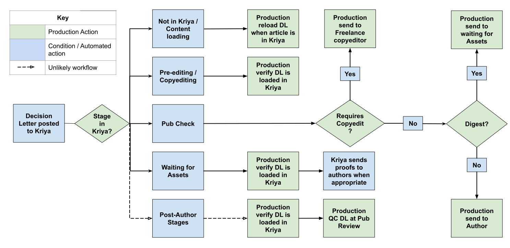

# Decision letters and Author responses

## What needs to be checked?

* Both a Decision Letter and Author response are present prior to publication \(an Author response may not be included in very rare cases, but this is not the norm\).
* All Figures, Tables, and Videos display as expected.
* There are no Schematron message relating to the incorrect capture of content in the DL or AR.

## What is a Decision letter?

## What is an Author Response?

## How are DLs and ARs created?

DLs and ARs are collated from the peer review correspondence as indicated above. The eLife Editorial team \(Ed Office\) collate this content into one Word file. Each Word file contains both the Decision Letter and Author Response \(provided there are both, which is typical for any research article\).

A Macro is run on the content which normalises the content \(italicises certain words and phrases, normalises word styles, corrects the capitalisation of 'eLife' and other words, etc.\). This is then QC'd by Ed Office, before then being QC'd by the eLife Editorial team.

## How are DLs and ARs loaded?

The word document containing both the DL and AR, and any accompanying assets are zipped up, and placed in the `elife/decision-letter-input` AWS bucket by the eLife Editorial team.

At this point the eLife bot will notice the zip and process the content in order to send it to Kriya.

Any assets are placed on an FTP for Exeter to download when processing the DL. The Word document is parsed as JATS \(using the [decision-letter-parser](https://github.com/elifesciences/decision-letter-parser)\), and posted via API to Kriya, where it is ingested in the accompanying article.

Any figures are automatically included in the article in Kriya \(due to them being placed on the FTP\). However, any videos will need to be processed manually, since they require uploading to the Glencoe FTP, along with accompanying requisite metadata.

## DL Word markup for JATS parsing

## DL workflow

eLife production will be made aware of any Decision Letters being loaded by an automated email appearing in the Production Inbox. Certain actions may be required depending on whether this email indicates that the DL was posted successfully or not \(see also [**Decision letter loading**](../../toolkit/managing-the-production-inbox.md#decision-letter-loading) for more information on how to handle this email\). 

### The DL was posted successfully

The state of the article in Kriya will determine what stage it should proceed to, or not as the case may be. See the below workflow diagram for successful Decision Letter emails.

**`For Review`** - edit the above image [**here**](https://docs.google.com/drawings/d/16Q4mvzujVITy10nbAjmZTdH6CHO-4E4k5QBKrXolXyI/edit).

### The DL was not posted successfully

The email in the Production Inbox will look something like the following:

There are numerous reasons why a Decision Letter might fail 

## Schematron checks

The following tests are run on Decision Letters and Author responses. 

### Content checks

#### dec-letter-title-test

**Error**: _title-group must contain article-title which contains 'Decision letter'. Currently it is XXXXXX._

**Action**: 

#### reply-title-test

**Error**: _title-group must contain article-title which contains 'Author response'. Currently it is XXXXXX._

**Action**: 

#### dec-letter-reply-test-1

**Error**: _1st sub-article must be the decision letter. 2nd sub-article must be the author response._

**Action**: 

#### dec-letter-reply-test-5

**Error**: _XXXXXX paragraph contains what looks like pseudo-code - XXXXXX._

**Action**: 

#### dec-letter-reply-test-6

**Warning**: _XXXXXX paragraph contains what might be pseudo-code or tags which should likely be removed - XXXXXX._

**Action**: 

#### dec-letter-front-test-1

**Error**: _sub-article front-stub must contain article-id\[@pub-id-type='doi'\]._

**Action**: 

#### dec-letter-front-test-4

**Warning**: _decision letter front-stub has only 1 contrib-group element. Is this correct? i.e. were all of the reviewers \(aside from the reviewing editor\) anonymous? The text 'The reviewers have opted to remain anonymous' or 'The reviewer has opted to remain anonymous' is not present and there is no link to Review commons in the decision letter._

**Action**: 

#### dec-letter-editor-test-1

**Warning**: _First contrib-group in decision letter must contain 1 and only 1 editor \(contrib\[@contrib-type='editor'\]\)._

**Action**: 

#### dec-letter-editor-test-2

**Warning**: _First contrib-group in decision letter contains a contrib which is not marked up as an editor \(contrib\[@contrib-type='editor'\]\)._

**Action**:

#### dec-letter-editor-test-3

**Error**: _Editor in decision letter front-stub must have the role 'Reviewing Editor' or 'Senior and Reviewing Editor'. XXXXXX has 'XXXXXX'._

**Action**: 

#### dec-letter-editor-test-6

**Error**: _Senior Editor in decision letter front-stub must have the role 'Senior Editor' or 'Senior and Reviewing Editor'. XXXXXX has 'XXXXXX'._

**Action**: 

#### dec-letter-reviewer-test-1

**Error**: _Second contrib-group in decision letter must contain a reviewer \(contrib\[@contrib-type='reviewer'\]\)._

**Action**: 

#### dec-letter-reviewer-test-2

**Error**: _Second contrib-group in decision letter contains a contrib which is not marked up as a reviewer \(contrib\[@contrib-type='reviewer'\]\)._

**Action**: 

#### dec-letter-reviewer-test-3

**Error**: _Reviewer in decision letter front-stub must have the role 'Reviewer'. XXXXXX has 'XXXXXX'._

**Action**: 

#### dec-letter-reviewer-test-6

**Warning**: _Second contrib-group in decision letter contains more than three reviewers. Is this correct? Exeter: Please check with eLife. eLife: check eJP to ensure this is correct._

**Action**: 

#### dec-letter-body-test-1

**Error**: _First child element in decision letter is not boxed-text. This is certainly incorrect._

**Action**: 

#### dec-letter-body-test-2

**Error**: _The text 'Review Commons' in 'XXXXXX' must contain an embedded link pointing to https://www.reviewcommons.org/._

**Action**: 

#### reply-front-test-1

**Error**: _sub-article front-stub must contain article-id\[@pub-id-type='doi'\]._

**Action**: 

#### reply-body-test-1

**Error**: _author response doesn't contain a disp-quote. This has to be incorrect._

**Action**: 

#### reply-body-test-2

**Error**: _author response doesn't contain a p. This has to be incorrect._

**Action**: 

### **XML structure checks**

#### dec-letter-reply-test-2

**Error**: _sub-article id must be in the format 'sa0', where '0' is it's position \(1 or 2\)._

**Action**: 

#### dec-letter-reply-test-3

**Error**: _sub-article contain one and only one front-stub._

**Action**: 

#### dec-letter-reply-test-4

**Error**: _sub-article contain one and only one body._

**Action**: 

#### dec-letter-front-test-2

**Error**: _decision letter front-stub must contain at least 1 contrib-group element._

**Action**: 

#### dec-letter-front-test-3

**Error**: _decision letter front-stub contains more than 2 contrib-group elements._

**Action**: 

## XML structure

