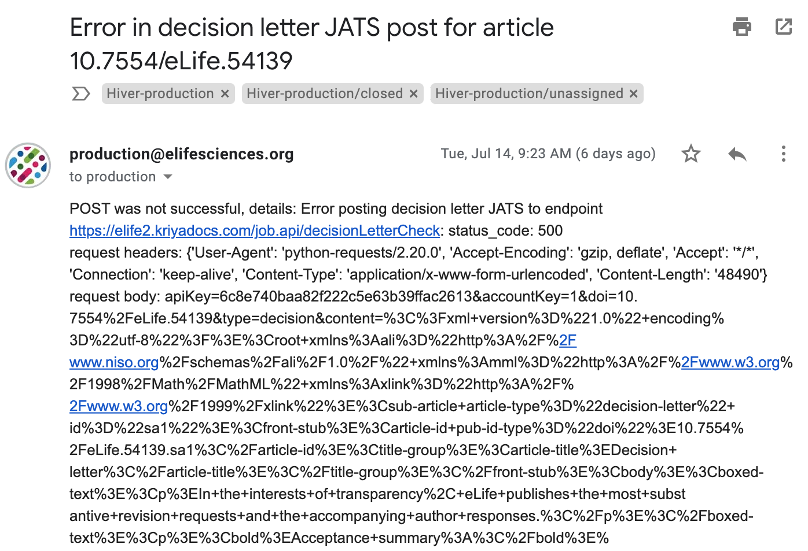

# Decision letters and Author responses

## What needs to be checked?

* Both a Decision letter and Author response are present prior to publication \(an Author response may not be included in cases where the review was carried out by Review Commons, or in other very rare cases, but having both is the norm\).
* All Figures, Tables, and Videos display in the same way as in the main article.
* There are no unaddressed Schematron messages which require action.

## What is a Decision letter?

The Decision letter is a collation of the Peer Review correspondence sent to the authors of a paper that has been accepted for publication by eLife. As such they can contain various information, including but not limited to, mandatory and non-mandatory requests for revisions, request\(s\) for further experimentation or analysis, conformance to house style, and general comments of the importance, novelty etc. of the research which is communicated in an article.

For the purposes of the production workflow, they are typically quite simple pieces of content, made up of just paragraphs of text; however in rare instances, they can contain more complex items such as figures, tables and videos.

## What is an Author response?

An Author response is a formal response to the Decision letter by the authors of a paper. As with Decision letters, they can contain various types of information including, for example, rebuttals to criticism or requests, clarifications on the choice of method\(s\) or terminology, and thanks for pointing out omissions, oversights, inaccuracies etc.

Typically they are relatively simple, although often more complex than the Decision letter. They will always contain quotes taken from the Decision letter, will commonly contain figures, and in rare instances may contain tables and/or videos.

## How are Decision letters and Author responses created?

Decision letters and Author responses are collated from the peer review correspondence as indicated above. The eLife Editorial team \(Ed Office\) collate this content \(which may have originally been taken from various sources, e.g. emails, PDFs etc.\) into one Word file. Each Word file contains both the Decision letter and Author response \(provided there _are_ both, which is typical for any research article\).

A Macro is run on the content which normalises it \(italicises certain words and phrases, normalises word styles, corrects the capitalisation of 'eLife' and other words, etc.\). This resultant word document is then QC'd by Ed Office, before then being QC'd by the eLife Editorial team.

## How are Decision letters and Author responses loaded?

The Word document containing both the Decision letter and Author response, and any accompanying assets are zipped up, and placed in the `elife/decision-letter-input` AWS bucket by the eLife Editorial team.

At this point the eLife bot will notice the zip and process the content in order to send it to Kriya.

Any assets \(such as figures, and videos\) are placed on an FTP for Exeter to download when processing the Decision letter. The Word document is parsed as JATS \(using the [**decision-letter-parser**](https://github.com/elifesciences/decision-letter-parser)\), and posted via API to Kriya, where it is ingested in the accompanying article.

Any figures are automatically included in the article in Kriya \(due to them being placed on the FTP\). However, any videos will need to be processed manually, since they require uploading to the Glencoe FTP, along with accompanying requisite metadata.

## Decision letter Word markup for JATS parsing

\[To be filled out once the Kitchen Sink word file has been created.\]

## Decision letter workflow

eLife production will be made aware of any Decision letters being loaded by an automated email appearing in the Production Inbox. Certain actions may be required depending on whether the email indicates that the Decision Letter was posted successfully or not \(see also [**Decision letter loading**](../../toolkit/managing-the-production-inbox.md#decision-letter-loading) for more information on how to handle this email\). In the event that a Decision letter/Author response contains videos, Editorial will inform Production prior to uploading, see [**below**](decision-letters-and-author-responses.md#dl-with-author-response-videos) on what to do when this occurs. 

### The Decision letter was posted successfully

The state of the article in Kriya will determine what stage it should proceed to, or not, as the case may be. See the below workflow diagram for successful Decision letter emails. 


Verifying whether a Decision letter has loaded in Kriya is as simple as refreshing the dashboard and checking whether the 'Upload sub-article' orange button has changed to a green 'Reupload sub-article'. Green indicates a Decision letter has been loaded, orange indicates it has not.



Note that [**a separate workflow**](decision-letters-and-author-responses.md#dl-with-author-response-videos) is required if a Decision letter contains  videos.



\[**`For Review`** - edit the above image [**here**](https://docs.google.com/drawings/d/16Q4mvzujVITy10nbAjmZTdH6CHO-4E4k5QBKrXolXyI/edit).\]

### The Decision letter was not posted successfully

There are two cases here either a success email was received, but the Decision letter was not successfully loaded to Kriya, or a failure email will be sent to the Production Inbox, which will look something like the following:



A decision letter may fail to load for the following reasons:

* Kriya is down \(we should still receive a success email\).
* The article has not yet been sent to Kriya \(we will receive a success email for this - not a failure one\). The decision letter should be reloaded once the article has been loaded to Kriya - this can be done by downloading and then re-uploading the zip on the AWS bucket \(`decision-letter-input`\).
* An article is currently in the 'Content loading' stage in Kriya. This will result in a failure email. Leave this email open and once the article has loaded to Kriya, re-upload the decision letter to the AWS bucket as above.
* Editorial have zipped up the files incorrectly. The failure message might say something like:

> \[No articles to check\]

Check that the files have been included as direct children of the zip, i.e. that a folder hasn't been included in the zip. If all the files are zipped correctly, then contact Fred in the Production team who will investigate further \(if Fred is not available, raise a GitHub issue in the [**eLife issues repository**](https://github.com/elifesciences/issues), and assign to Graham to investigate\).

* Other. If a failure message comes through and you are unsure what it means, it's possible that the content hasn't been parsed correctly by the parser. Contact Fred in the Production team who will investigate further \(if Fred is not available, raise a GitHub issue in the [**eLife issues repository**](https://github.com/elifesciences/issues), and assign to Graham to investigate\).

\[Question for review - where should these be outlined? They are already explained in detail [**here**](../../toolkit/managing-the-production-inbox.md#decision-letter-loading). Should they be here instead? In Both places? Or should we just link to [**here**](../../toolkit/managing-the-production-inbox.md#decision-letter-loading)?\]

### Decision letters/Author responses with videos

Videos need to be manually uploaded by Exeter to the Glencoe FTP in order for them to display in the proofing system, and on the website when published. This means that the normal workflow cannot be followed, as it requires a manual action on Exeter's part.

eLife Editorial will inform eLife Production prior to uploading a Decision letter with videos, so that, depending on the state of the corresponding article, Production can act accordingly.

See below for the workflow

[https://docs.google.com/drawings/d/1mN7lHDMwa2CWaMSoR8q1xHiuvDzY3y3iOGdG9UKUVTc/edit](https://docs.google.com/drawings/d/1mN7lHDMwa2CWaMSoR8q1xHiuvDzY3y3iOGdG9UKUVTc/edit)

## Schematron checks

The following tests are run on Decision Letters and Author responses. 

### Content checks

#### dec-letter-title-test

**Error**: _title-group must contain article-title which contains 'Decision letter'. Currently it is XXXXXX._

**Action**: This error will fire if the Decision letter does not have a title which is 'Decision letter'. It means something has gone wrong in the processing of the Decision letter, and will have to be fixed by Exeter.

#### reply-title-test

**Error**: _title-group must contain article-title which contains 'Author response'. Currently it is XXXXXX._

**Action**: This error will fire if the Author response does not have a title which is 'Author response'. It means something has gone wrong in the processing of the Author response, and will have to be fixed by Exeter.

#### dec-letter-reply-test-5

**Error**: _XXXXXX paragraph contains what looks like pseudo-code - XXXXXX._

**Action**: This will fire is a paragraph in a Decision letter or Author response contains the text `</author response` , `</author response>` or similar. This type of pseudo-code is included in the original Word document by the eLife editorial team as flags for the decision-letter-parser to correctly recognise what a certain object in the document should be captured as. If this text is in the JATS, however, that means that the content has not been correctly recognised by the parser. Exeter should flag this error with the eLife production team.

The eLife production team should check the original word file, in order to determine how this should have been captured, and act accordingly \(it may be that you just have to remove the superfluous text, or it may be the case that an author response image or table needs to be added, in which case Exeter will have to make this change\). It is also worth notifying Fred in the Production team so that he can feed this back to the developer responsible for the decision-letter-parser.

#### dec-letter-reply-test-6

**Warning**: _XXXXXX paragraph contains what might be pseudo-code or tags which should likely be removed - XXXXXX._

**Action**: This will fire is a paragraph in a Decision letter or Author response contains text such as `<italic>` or `</author response image title>` or  similar. This type of pseudo-code is included in the original Word document by the eLife editorial team as flags for the decision-letter-parser to correctly recognise what a certain object in the document should be captured as. If this text is in the JATS, however, that means that the content has not been correctly recognised by the parser. Exeter should flag this error with the eLife production team.

The eLife production team should check the original word file, in order to determine how this should have been captured, and act accordingly \(it may be that you just have to remove the superfluous text, or it may be the case that an author response image or table needs to be added, in which case Exeter will have to make this change\). It is also worth notifying Fred in the Production team so that he can feed this back to the developer responsible for the decision-letter-parser.

#### dec-letter-front-test-1

**Error**: _sub-article front-stub must contain article-id\[@pub-id-type='doi'\]._

**Action**: This will fire if a Decision letter does not contain a doi. Exeter will need to correct this problem when it arises. For legacy content \(new versions\), the pre-existing doi should be used. For new content these are always in the format 10.7554/eLife.{article-number}.sa1.

#### dec-letter-front-test-4

**Warning**: _decision letter front-stub has only 1 contrib-group element. Is this correct? i.e. were all of the reviewers \(aside from the reviewing editor\) anonymous? The text 'The reviewers have opted to remain anonymous' or 'The reviewer has opted to remain anonymous' is not present and there is no link to Review commons in the decision letter._

**Action**: This will fire if all of the following conditions are met:

* There are no reviewers in the information for the Decision letter.
* The text 'The reviewers have opted to remain anonymous' or 'The reviewer has opted to remain anonymous' is not present in the decision letter
* There is no link to Review commons \([https://www.reviewcommons.org/](https://www.reviewcommons.org/)\).

Every Decision letter should have at least 1 reviewer, unless the reviewers opted to be anonymous, or if the paper was reviewed via Review commons. If this warning fires, Exeter should inform eLife Production. eLife Production should query the eLife Editorial team, asking whether Reviewers need to be included and, if so, what their details are \(name and optional affiliation\). If this information has been provided by Editorial, then these details will need to be added in Kriya.

One common cause/case for this may be that the reviewers opted to be anonymous on the first round of review yet chose to have their name revealed in a subsequent round of review. This could mean that Editorial include their name in the letter \(rather than 'choosing to remain anonymous'\), but they aren't listed in the XML because eJP only outputs non-anonymous reviewers from the full submission.

#### dec-letter-editor-test-1

**Warning**: _First contrib-group in decision letter must contain 1 and only 1 editor \(contrib\[@contrib-type='editor'\]\)._

**Action**: If this warning fires, it means that there is no Reviewing Editor in the details for the Decision letter. Exeter should checking the eJP output and if this information was not included there, then inform the eLife Production team.

The eLife production team should check the article in eJP \(it might be that the editor details were added subsequent to the article being exported to Kriya\). If the information is not available in eJP, then this should be queried with the eLife Editorial team in order to get the details for the Reviewing Editor \(name and affiliation - both are mandatory\). Note that this test is a warning \(instead of an error\) for the purposes of dealing with old eLife content - if it fires in current content \(i.e. not new versions\), it should _**always**_ be resolved prior to publication.

#### dec-letter-editor-test-3

**Error**: _Editor in decision letter front-stub must have the role 'Reviewing Editor' or 'Senior and Reviewing Editor'. XXXXXX has 'XXXXXX'._

**Action**: If this warning fires, it means that the Editor details are incorrect in the Decision letter. An Editor must have a role that is either 'Reviewing Editor' or 'Senior and Reviewing Editor'. Exeter will have to correct this.

#### ~~dec-letter-editor-test-6~~

~~**Error**: _Senior Editor in decision letter front-stub must have the role 'Senior Editor' or 'Senior and Reviewing Editor'. XXXXXX has 'XXXXXX'._~~

~~**Action**:~~ 

#### dec-letter-reviewer-test-3

**Error**: _Reviewer in decision letter front-stub must have the role 'Reviewer'. XXXXXX has 'XXXXXX'._

**Action**: If this error fires, it means the content of the `<role>` element for a reviewer in the Decision letter is not 'Reviewer'. There are two possibilities:

1. A reviewer simply has the wrong role provided, which needs correcting to 'Reviewer' by Exeter.
2. A 'Reviewing Editor' or 'Senior and Reviewing Editor' has been incorrectly captured as a Reviewer \(`contrib[@contrib-type='reviewer']`\).

In order to determine which of these is the case, Exeter should check the output from eJP, and eLife should check eJP itself. If it is still unclear from these details, the eLife production team should contact the editorial team in order to verify what role that contributor played, and update their details accordingly. 

#### dec-letter-reviewer-test-6

**Warning**: _Second contrib-group in decision letter contains more than three reviewers. Is this correct? Exeter: Please check with eLife. eLife: check eJP to ensure this is correct._

**Action**: The vast majority of eLife articles will have been reviewed by three reviewers or fewer. However, occasionally, more than 3 reviewers were required for peer review \(for example, when specialists are required\). This warning will fire if there are more than 3 reviewers in the Decision letter details, and as the message suggests, Exeter should flag this with eLife Production, who should check eJP to ensure that this is correct and not a mistake. If it is unclear from eJP, then eLife Production should query the Editorial team.

#### dec-letter-body-test-1

**Error**: _First child element in decision letter is not boxed-text. This is certainly incorrect._

**Action**: The first piece of text in a decision letter is an explanation of what it is, for example 'In the interests of transparency, eLife publishes the most substantive revision requests and the accompanying author responses.' This need to be placed in a boxed-text element. If this error fires, it means that either that content is entirely missing, or that it is not placed in boxed-text. In the former case, the eLife production team should contact the eLife Editorial team to get the correct wording. In the latter, Exeter will need to tag the text as boxed-text.

#### dec-letter-body-test-2

**Error**: _The text 'Review Commons' in 'XXXXXX' must contain an embedded link pointing to https://www.reviewcommons.org/._

**Action**: If a paper was reviewed by Review Commons then there will be a statement to this effect in the decision letter \(it will essentially be the only content in the decision letter\). As the message suggests, the link should be embedded in the text 'Review Commons'.

#### reply-front-test-1

**Error**: _sub-article front-stub must contain article-id\[@pub-id-type='doi'\]._

**Action**: This will fire if an Author response does not contain a doi. Exeter will need to correct this problem when it arises. For legacy content \(new versions\), the pre-existing doi should be used. For new content these are always in the format 10.7554/eLife.{article-number}.sa2.

#### reply-body-test-1

**Error**: _author response doesn't contain a disp-quote. This has to be incorrect._

**Action**: disp-quote is the element which holds quotations. In the Author response, these will be quotations from the Decision letter. Every Author response will have some kind of quotation from the Decision letter, so if this fires, it means that there is 1 or more quotation in the Author response missing this tagging. In the original document, quotations are supplied in italics, so scan the Author response for any paragraph\(s\) entirely in italics, un-italicise them and mark them as display quotes in Kriya.

#### reply-body-test-2

**Error**: _author response doesn't contain a p. This has to be incorrect._

**Action**: This warning indicates that there is either no content in the Author response, or that the content has been captured incorrectly. If the content is missing, eLife Production should check the original word document to see if it's also missing from there \(if it is, query with Editorial\). If there is content in the original, add this content into Kriya. If there is content present in Kriya, this means that something has gone wrong with the XML generation and Exeter will have to fix this.

#### reply-missing-disp-quote-test-1

**Warning**: _para in author response is entirely in italics, but not in a display quote. Is this a quote which has been processed incorrectly?_

**Action**: In the original word document \(which the XML is generated from\) quotations in the Author response are captured entirely in italics \(as an indicator that they are quotations\). If this warning fires, it likely means that a display quote has not been processed correctly. You can easily determine whether this is a Decision letter quote since the content, in part or in its entirety, will also be present in the Decision letter. If it is a quote, then the text will need to be un-italicised and captured as a display quote in Kriya. If it is not a quote from the Decision letter, and the text was italic in the original word document, then the text should be left as italics \(a relatively common use-case is quoting from the article itself, rather than from the Decision letter\).

#### reply-missing-disp-quote-test-2

**Warning**: _A long piece of text is in italics in an Author response paragraph. Should it be captured as a display quote in a separate paragraph? 'XXXXXX' in 'XXXXXX'_

**Action**: In the original word document \(which the XML is generated from\) quotations in the Author response are captured entirely in italics \(as an indicator that they are quotations\). If this warning fires, it likely means that a display quote has not been processed correctly. You can easily determine whether this is a Decision letter quote since the content, in part or in its entirety, will also be present in the Decision letter. If it is a quote, then the text will need to be un-italicised and captured as a display quote in Kriya. If it is not a quote from the Decision letter, and the text was italic in the original word document, then the text should be left as italics \(a relatively common use-case is quoting from the article itself, rather than from the Decision letter\).

**unicode-test-1**

**Warning**: _XXXXXX element contains '€' - this should instead be the character '€'. - XXXXXX._

**Action**: This message suggests that something has gone wrong with the unicode parsing of the JATS posted to Kriya, and will fire if the character\(s\) '€' are present in a Decision letter or Author response. To resolve this replace those characters with the one suggested in the message, in this case, '€'. The first XXXXXX will be the name of the element \(e.g. 'p'\), and the second XXXXXX is the content within that element. If there are a large number of errors relating to incorrect unicode characters, then the eLife Production team should send the article back to Exeter to fix them all.

**unicode-test-2**

**Warning**: _XXXXXX element contains 'À' - this should instead be the character 'À'. - XXXXXX._

**Action**: This message suggests that something has gone wrong with the unicode parsing of the JATS posted to Kriya, and will fire if the character\(s\) 'À' are present in a Decision letter or Author response. To resolve this replace those characters with the one suggested in the message, in this case, 'À'. The first XXXXXX will be the name of the element \(e.g. 'p'\), and the second XXXXXX is the content within that element. If there are a large number of errors relating to incorrect unicode characters, then the eLife Production team should send the article back to Exeter to fix them all.

**unicode-test-3**

**Warning**: _XXXXXX element contains 'Ã' - this should instead be the character 'Á'. - XXXXXX._

**Action**: This message suggests that something has gone wrong with the unicode parsing of the JATS posted to Kriya, and will fire if the character\(s\) 'Ã' are present in a Decision letter or Author response. To resolve this replace those characters with the one suggested in the message, in this case, 'Á'. The first XXXXXX will be the name of the element \(e.g. 'p'\), and the second XXXXXX is the content within that element. If there are a large number of errors relating to incorrect unicode characters, then the eLife Production team should send the article back to Exeter to fix them all.

**unicode-test-4**

**Warning**: _XXXXXX element contains '‚' - this should instead be the character '‚'. - XXXXXX._

**Action**: This message suggests that something has gone wrong with the unicode parsing of the JATS posted to Kriya, and will fire if the character\(s\) '‚' are present in a Decision letter or Author response. To resolve this replace those characters with the one suggested in the message, in this case, '‚'. The first XXXXXX will be the name of the element \(e.g. 'p'\), and the second XXXXXX is the content within that element. If there are a large number of errors relating to incorrect unicode characters, then the eLife Production team should send the article back to Exeter to fix them all.

**unicode-test-5**

**Warning**: _XXXXXX element contains 'Â' - this should instead be the character 'Â'. - XXXXXX._

**Action**: This message suggests that something has gone wrong with the unicode parsing of the JATS posted to Kriya, and will fire if the character\(s\) 'Â' are present in a Decision letter or Author response. To resolve this replace those characters with the one suggested in the message, in this case, 'Â'. The first XXXXXX will be the name of the element \(e.g. 'p'\), and the second XXXXXX is the content within that element. If there are a large number of errors relating to incorrect unicode characters, then the eLife Production team should send the article back to Exeter to fix them all.

**unicode-test-6**

**Warning**: _XXXXXX element contains 'Æ’' - this should instead be the character 'ƒ'. - XXXXXX._

**Action**: This message suggests that something has gone wrong with the unicode parsing of the JATS posted to Kriya, and will fire if the character\(s\) 'Æ’' are present in a Decision letter or Author response. To resolve this replace those characters with the one suggested in the message, in this case, 'ƒ'. The first XXXXXX will be the name of the element \(e.g. 'p'\), and the second XXXXXX is the content within that element. If there are a large number of errors relating to incorrect unicode characters, then the eLife Production team should send the article back to Exeter to fix them all.

**unicode-test-7**

**Warning**: _XXXXXX element contains 'Ã' - this should instead be the character 'Ã'. - XXXXXX._

**Action**: This message suggests that something has gone wrong with the unicode parsing of the JATS posted to Kriya, and will fire if the character\(s\) 'Ã' are present in a Decision letter or Author response. To resolve this replace those characters with the one suggested in the message, in this case, 'Ã'. The first XXXXXX will be the name of the element \(e.g. 'p'\), and the second XXXXXX is the content within that element. If there are a large number of errors relating to incorrect unicode characters, then the eLife Production team should send the article back to Exeter to fix them all.

**unicode-test-8**

**Warning**: _XXXXXX element contains '„' - this should instead be the character '„'. - XXXXXX._

**Action**: This message suggests that something has gone wrong with the unicode parsing of the JATS posted to Kriya, and will fire if the character\(s\) '„' are present in a Decision letter or Author response. To resolve this replace those characters with the one suggested in the message, in this case, '„'. The first XXXXXX will be the name of the element \(e.g. 'p'\), and the second XXXXXX is the content within that element. If there are a large number of errors relating to incorrect unicode characters, then the eLife Production team should send the article back to Exeter to fix them all.

**unicode-test-9**

**Warning**: _XXXXXX element contains 'Ä' - this should instead be the character 'Ä'. - XXXXXX._

**Action**: This message suggests that something has gone wrong with the unicode parsing of the JATS posted to Kriya, and will fire if the character\(s\) 'Ä' are present in a Decision letter or Author response. To resolve this replace those characters with the one suggested in the message, in this case, 'Ä'. The first XXXXXX will be the name of the element \(e.g. 'p'\), and the second XXXXXX is the content within that element. If there are a large number of errors relating to incorrect unicode characters, then the eLife Production team should send the article back to Exeter to fix them all.

**unicode-test-10**

**Warning**: _XXXXXX element contains '…' - this should instead be the character '…'. - XXXXXX._

**Action**: This message suggests that something has gone wrong with the unicode parsing of the JATS posted to Kriya, and will fire if the character\(s\) '…' are present in a Decision letter or Author response. To resolve this replace those characters with the one suggested in the message, in this case, '…'. The first XXXXXX will be the name of the element \(e.g. 'p'\), and the second XXXXXX is the content within that element. If there are a large number of errors relating to incorrect unicode characters, then the eLife Production team should send the article back to Exeter to fix them all.

**unicode-test-11**

**Warning**: _XXXXXX element contains 'Ã…' - this should instead be the character 'Å'. - XXXXXX._

**Action**: This message suggests that something has gone wrong with the unicode parsing of the JATS posted to Kriya, and will fire if the character\(s\) 'Ã…' are present in a Decision letter or Author response. To resolve this replace those characters with the one suggested in the message, in this case, 'Å'. The first XXXXXX will be the name of the element \(e.g. 'p'\), and the second XXXXXX is the content within that element. If there are a large number of errors relating to incorrect unicode characters, then the eLife Production team should send the article back to Exeter to fix them all.

**unicode-test-13**

**Warning**: _XXXXXX element contains 'Æ' - this should instead be the character 'Æ'. - XXXXXX._

**Action**: This message suggests that something has gone wrong with the unicode parsing of the JATS posted to Kriya, and will fire if the character\(s\) 'Æ' are present in a Decision letter or Author response. To resolve this replace those characters with the one suggested in the message, in this case, 'Æ'. The first XXXXXX will be the name of the element \(e.g. 'p'\), and the second XXXXXX is the content within that element. If there are a large number of errors relating to incorrect unicode characters, then the eLife Production team should send the article back to Exeter to fix them all.

**unicode-test-14**

**Warning**: _XXXXXX element contains '‡' - this should instead be the character '‡'. - XXXXXX._

**Action**: This message suggests that something has gone wrong with the unicode parsing of the JATS posted to Kriya, and will fire if the character\(s\) '‡' are present in a Decision letter or Author response. To resolve this replace those characters with the one suggested in the message, in this case, '‡'. The first XXXXXX will be the name of the element \(e.g. 'p'\), and the second XXXXXX is the content within that element. If there are a large number of errors relating to incorrect unicode characters, then the eLife Production team should send the article back to Exeter to fix them all.

**unicode-test-15**

**Warning**: _XXXXXX element contains 'Ç' - this should instead be the character 'Ç'. - XXXXXX._

**Action**: This message suggests that something has gone wrong with the unicode parsing of the JATS posted to Kriya, and will fire if the character\(s\) 'Ç' are present in a Decision letter or Author response. To resolve this replace those characters with the one suggested in the message, in this case, 'Ç'. The first XXXXXX will be the name of the element \(e.g. 'p'\), and the second XXXXXX is the content within that element. If there are a large number of errors relating to incorrect unicode characters, then the eLife Production team should send the article back to Exeter to fix them all.

**unicode-test-16**

**Warning**: _XXXXXX element contains 'ˆ' - this should instead be the character 'ˆ'. - XXXXXX._

**Action**: This message suggests that something has gone wrong with the unicode parsing of the JATS posted to Kriya, and will fire if the character\(s\) 'ˆ' are present in a Decision letter or Author response. To resolve this replace those characters with the one suggested in the message, in this case, 'ˆ'. The first XXXXXX will be the name of the element \(e.g. 'p'\), and the second XXXXXX is the content within that element. If there are a large number of errors relating to incorrect unicode characters, then the eLife Production team should send the article back to Exeter to fix them all.

**unicode-test-17**

**Warning**: _XXXXXX element contains 'È' - this should instead be the character 'È'. - XXXXXX._

**Action**: This message suggests that something has gone wrong with the unicode parsing of the JATS posted to Kriya, and will fire if the character\(s\) 'È' are present in a Decision letter or Author response. To resolve this replace those characters with the one suggested in the message, in this case, 'È'. The first XXXXXX will be the name of the element \(e.g. 'p'\), and the second XXXXXX is the content within that element. If there are a large number of errors relating to incorrect unicode characters, then the eLife Production team should send the article back to Exeter to fix them all.

**unicode-test-18**

**Warning**: _XXXXXX element contains '‰' - this should instead be the character '‰'. - XXXXXX._

**Action**: This message suggests that something has gone wrong with the unicode parsing of the JATS posted to Kriya, and will fire if the character\(s\) '‰' are present in a Decision letter or Author response. To resolve this replace those characters with the one suggested in the message, in this case, '‰'. The first XXXXXX will be the name of the element \(e.g. 'p'\), and the second XXXXXX is the content within that element. If there are a large number of errors relating to incorrect unicode characters, then the eLife Production team should send the article back to Exeter to fix them all.

**unicode-test-19**

**Warning**: _XXXXXX element contains 'É' - this should instead be the character 'É'. - XXXXXX._

**Action**: This message suggests that something has gone wrong with the unicode parsing of the JATS posted to Kriya, and will fire if the character\(s\) 'É' are present in a Decision letter or Author response. To resolve this replace those characters with the one suggested in the message, in this case, 'É'. The first XXXXXX will be the name of the element \(e.g. 'p'\), and the second XXXXXX is the content within that element. If there are a large number of errors relating to incorrect unicode characters, then the eLife Production team should send the article back to Exeter to fix them all.

**unicode-test-21**

**Warning**: _XXXXXX element contains 'Ê' - this should instead be the character 'Ê'. - XXXXXX._

**Action**: This message suggests that something has gone wrong with the unicode parsing of the JATS posted to Kriya, and will fire if the character\(s\) 'Ê' are present in a Decision letter or Author response. To resolve this replace those characters with the one suggested in the message, in this case, 'Ê'. The first XXXXXX will be the name of the element \(e.g. 'p'\), and the second XXXXXX is the content within that element. If there are a large number of errors relating to incorrect unicode characters, then the eLife Production team should send the article back to Exeter to fix them all.

**unicode-test-22**

**Warning**: _XXXXXX element contains '‹' - this should instead be the character '‹'. - XXXXXX._

**Action**: This message suggests that something has gone wrong with the unicode parsing of the JATS posted to Kriya, and will fire if the character\(s\) '‹' are present in a Decision letter or Author response. To resolve this replace those characters with the one suggested in the message, in this case, '‹'. The first XXXXXX will be the name of the element \(e.g. 'p'\), and the second XXXXXX is the content within that element. If there are a large number of errors relating to incorrect unicode characters, then the eLife Production team should send the article back to Exeter to fix them all.

**unicode-test-23**

**Warning**: _XXXXXX element contains 'Ë' - this should instead be the character 'Ë'. - XXXXXX._

**Action**: This message suggests that something has gone wrong with the unicode parsing of the JATS posted to Kriya, and will fire if the character\(s\) 'Ë' are present in a Decision letter or Author response. To resolve this replace those characters with the one suggested in the message, in this case, 'Ë'. The first XXXXXX will be the name of the element \(e.g. 'p'\), and the second XXXXXX is the content within that element. If there are a large number of errors relating to incorrect unicode characters, then the eLife Production team should send the article back to Exeter to fix them all.

**unicode-test-24**

**Warning**: _XXXXXX element contains 'Å’' - should this instead be the character 'Œ'? - XXXXXX._

**Action**: This message suggests that something has gone wrong with the unicode parsing of the JATS posted to Kriya, and will fire if the character\(s\) 'Å’' are present in a Decision letter or Author response. To resolve this replace those characters with the one suggested in the message, in this case, 'Œ'? The first XXXXXX will be the name of the element \(e.g. 'p'\), and the second XXXXXX is the content within that element. If there are a large number of errors relating to incorrect unicode characters, then the eLife Production team should send the article back to Exeter to fix them all.

**unicode-test-25**

**Warning**: _XXXXXX element contains 'ÃŒ' - this should instead be the character 'Ì'. - XXXXXX._

**Action**: This message suggests that something has gone wrong with the unicode parsing of the JATS posted to Kriya, and will fire if the character\(s\) 'ÃŒ' are present in a Decision letter or Author response. To resolve this replace those characters with the one suggested in the message, in this case, 'Ì'. The first XXXXXX will be the name of the element \(e.g. 'p'\), and the second XXXXXX is the content within that element. If there are a large number of errors relating to incorrect unicode characters, then the eLife Production team should send the article back to Exeter to fix them all.

**unicode-test-26**

**Warning**: _XXXXXX element contains 'Ã' - this should instead be the character 'Í'. - XXXXXX._

**Action**: This message suggests that something has gone wrong with the unicode parsing of the JATS posted to Kriya, and will fire if the character\(s\) 'Ã' are present in a Decision letter or Author response. To resolve this replace those characters with the one suggested in the message, in this case, 'Í'. The first XXXXXX will be the name of the element \(e.g. 'p'\), and the second XXXXXX is the content within that element. If there are a large number of errors relating to incorrect unicode characters, then the eLife Production team should send the article back to Exeter to fix them all.

**unicode-test-27**

**Warning**: _XXXXXX element contains 'Ž' - this should instead be the character 'Ž'. - XXXXXX._

**Action**: This message suggests that something has gone wrong with the unicode parsing of the JATS posted to Kriya, and will fire if the character\(s\) 'Ž' are present in a Decision letter or Author response. To resolve this replace those characters with the one suggested in the message, in this case, 'Ž'. The first XXXXXX will be the name of the element \(e.g. 'p'\), and the second XXXXXX is the content within that element. If there are a large number of errors relating to incorrect unicode characters, then the eLife Production team should send the article back to Exeter to fix them all.

**unicode-test-28**

**Warning**: _XXXXXX element contains 'ÃŽ' - this should instead be the character 'Î'. - XXXXXX._

**Action**: This message suggests that something has gone wrong with the unicode parsing of the JATS posted to Kriya, and will fire if the character\(s\) 'ÃŽ' are present in a Decision letter or Author response. To resolve this replace those characters with the one suggested in the message, in this case, 'Î'. The first XXXXXX will be the name of the element \(e.g. 'p'\), and the second XXXXXX is the content within that element. If there are a large number of errors relating to incorrect unicode characters, then the eLife Production team should send the article back to Exeter to fix them all.

**unicode-test-29**

**Warning**: _XXXXXX element contains 'Ã' - this should instead be the character 'Ï'. - XXXXXX._

**Action**: This message suggests that something has gone wrong with the unicode parsing of the JATS posted to Kriya, and will fire if the character\(s\) 'Ã' are present in a Decision letter or Author response. To resolve this replace those characters with the one suggested in the message, in this case, 'Ï'. The first XXXXXX will be the name of the element \(e.g. 'p'\), and the second XXXXXX is the content within that element. If there are a large number of errors relating to incorrect unicode characters, then the eLife Production team should send the article back to Exeter to fix them all.

**unicode-test-30**

**Warning**: _XXXXXX element contains 'Ã' - this should instead be the character 'Ð'. - XXXXXX._

**Action**: This message suggests that something has gone wrong with the unicode parsing of the JATS posted to Kriya, and will fire if the character\(s\) 'Ã' are present in a Decision letter or Author response. To resolve this replace those characters with the one suggested in the message, in this case, 'Ð'. The first XXXXXX will be the name of the element \(e.g. 'p'\), and the second XXXXXX is the content within that element. If there are a large number of errors relating to incorrect unicode characters, then the eLife Production team should send the article back to Exeter to fix them all.

**unicode-test-31**

**Warning**: _XXXXXX element contains '‘' - this should instead be the character '‘'. - XXXXXX._

**Action**: This message suggests that something has gone wrong with the unicode parsing of the JATS posted to Kriya, and will fire if the character\(s\) '‘' are present in a Decision letter or Author response. To resolve this replace those characters with the one suggested in the message, in this case, '‘'. The first XXXXXX will be the name of the element \(e.g. 'p'\), and the second XXXXXX is the content within that element. If there are a large number of errors relating to incorrect unicode characters, then the eLife Production team should send the article back to Exeter to fix them all.

**unicode-test-32**

**Warning**: _XXXXXX element contains 'Ñ' - this should instead be the character 'Ñ'. - XXXXXX._

**Action**: This message suggests that something has gone wrong with the unicode parsing of the JATS posted to Kriya, and will fire if the character\(s\) 'Ñ' are present in a Decision letter or Author response. To resolve this replace those characters with the one suggested in the message, in this case, 'Ñ'. The first XXXXXX will be the name of the element \(e.g. 'p'\), and the second XXXXXX is the content within that element. If there are a large number of errors relating to incorrect unicode characters, then the eLife Production team should send the article back to Exeter to fix them all.

**unicode-test-33**

**Warning**: _XXXXXX element contains '’' - this should instead be the character '’'. - XXXXXX._

**Action**: This message suggests that something has gone wrong with the unicode parsing of the JATS posted to Kriya, and will fire if the character\(s\) '’' are present in a Decision letter or Author response. To resolve this replace those characters with the one suggested in the message, in this case, '’'. The first XXXXXX will be the name of the element \(e.g. 'p'\), and the second XXXXXX is the content within that element. If there are a large number of errors relating to incorrect unicode characters, then the eLife Production team should send the article back to Exeter to fix them all.

**unicode-test-34**

**Warning**: _XXXXXX element contains 'Ã’' - this should instead be the character 'Ò'. - XXXXXX._

**Action**: This message suggests that something has gone wrong with the unicode parsing of the JATS posted to Kriya, and will fire if the character\(s\) 'Ã’' are present in a Decision letter or Author response. To resolve this replace those characters with the one suggested in the message, in this case, 'Ò'. The first XXXXXX will be the name of the element \(e.g. 'p'\), and the second XXXXXX is the content within that element. If there are a large number of errors relating to incorrect unicode characters, then the eLife Production team should send the article back to Exeter to fix them all.

**unicode-test-35**

**Warning**: _XXXXXX element contains '“' - this should instead be the character '“'. - XXXXXX._

**Action**: This message suggests that something has gone wrong with the unicode parsing of the JATS posted to Kriya, and will fire if the character\(s\) '“' are present in a Decision letter or Author response. To resolve this replace those characters with the one suggested in the message, in this case, '“'. The first XXXXXX will be the name of the element \(e.g. 'p'\), and the second XXXXXX is the content within that element. If there are a large number of errors relating to incorrect unicode characters, then the eLife Production team should send the article back to Exeter to fix them all.

**unicode-test-36**

**Warning**: _XXXXXX element contains 'Ó' - this should instead be the character 'Ó'. - XXXXXX._

**Action**: This message suggests that something has gone wrong with the unicode parsing of the JATS posted to Kriya, and will fire if the character\(s\) 'Ó' are present in a Decision letter or Author response. To resolve this replace those characters with the one suggested in the message, in this case, 'Ó'. The first XXXXXX will be the name of the element \(e.g. 'p'\), and the second XXXXXX is the content within that element. If there are a large number of errors relating to incorrect unicode characters, then the eLife Production team should send the article back to Exeter to fix them all.

**unicode-test-37**

**Warning**: _XXXXXX element contains 'â€' - this should instead be the character '”'. - XXXXXX._

**Action**: This message suggests that something has gone wrong with the unicode parsing of the JATS posted to Kriya, and will fire if the character\(s\) 'â€' are present in a Decision letter or Author response. To resolve this replace those characters with the one suggested in the message, in this case, '”'. The first XXXXXX will be the name of the element \(e.g. 'p'\), and the second XXXXXX is the content within that element. If there are a large number of errors relating to incorrect unicode characters, then the eLife Production team should send the article back to Exeter to fix them all.

**unicode-test-38**

**Warning**: _XXXXXX element contains 'Ô' - this should instead be the character 'Ô'. - XXXXXX._

**Action**: This message suggests that something has gone wrong with the unicode parsing of the JATS posted to Kriya, and will fire if the character\(s\) 'Ô' are present in a Decision letter or Author response. To resolve this replace those characters with the one suggested in the message, in this case, 'Ô'. The first XXXXXX will be the name of the element \(e.g. 'p'\), and the second XXXXXX is the content within that element. If there are a large number of errors relating to incorrect unicode characters, then the eLife Production team should send the article back to Exeter to fix them all.

**unicode-test-39**

**Warning**: _XXXXXX element contains 'Õ' - this should instead be the character 'Õ'. - XXXXXX._

**Action**: This message suggests that something has gone wrong with the unicode parsing of the JATS posted to Kriya, and will fire if the character\(s\) 'Õ' are present in a Decision letter or Author response. To resolve this replace those characters with the one suggested in the message, in this case, 'Õ'. The first XXXXXX will be the name of the element \(e.g. 'p'\), and the second XXXXXX is the content within that element. If there are a large number of errors relating to incorrect unicode characters, then the eLife Production team should send the article back to Exeter to fix them all.

**unicode-test-40**

**Warning**: _XXXXXX element contains '–' - this should instead be the character '–'. - XXXXXX._

**Action**: This message suggests that something has gone wrong with the unicode parsing of the JATS posted to Kriya, and will fire if the character\(s\) '–' are present in a Decision letter or Author response. To resolve this replace those characters with the one suggested in the message, in this case, '–'. The first XXXXXX will be the name of the element \(e.g. 'p'\), and the second XXXXXX is the content within that element. If there are a large number of errors relating to incorrect unicode characters, then the eLife Production team should send the article back to Exeter to fix them all.

**unicode-test-41**

**Warning**: _XXXXXX element contains 'Ö' - this should instead be the character 'Ö'. - XXXXXX._

**Action**: This message suggests that something has gone wrong with the unicode parsing of the JATS posted to Kriya, and will fire if the character\(s\) 'Ö' are present in a Decision letter or Author response. To resolve this replace those characters with the one suggested in the message, in this case, 'Ö'. The first XXXXXX will be the name of the element \(e.g. 'p'\), and the second XXXXXX is the content within that element. If there are a large number of errors relating to incorrect unicode characters, then the eLife Production team should send the article back to Exeter to fix them all.

**unicode-test-42**

**Warning**: _XXXXXX element contains '—' - this should instead be the character '—'. - XXXXXX._

**Action**: This message suggests that something has gone wrong with the unicode parsing of the JATS posted to Kriya, and will fire if the character\(s\) '—' are present in a Decision letter or Author response. To resolve this replace those characters with the one suggested in the message, in this case, '—'. The first XXXXXX will be the name of the element \(e.g. 'p'\), and the second XXXXXX is the content within that element. If there are a large number of errors relating to incorrect unicode characters, then the eLife Production team should send the article back to Exeter to fix them all.

**unicode-test-43**

**Warning**: _XXXXXX element contains '×' - this should instead be the character '×'. - XXXXXX._

**Action**: This message suggests that something has gone wrong with the unicode parsing of the JATS posted to Kriya, and will fire if the character\(s\) '×' are present in a Decision letter or Author response. To resolve this replace those characters with the one suggested in the message, in this case, '×'. The first XXXXXX will be the name of the element \(e.g. 'p'\), and the second XXXXXX is the content within that element. If there are a large number of errors relating to incorrect unicode characters, then the eLife Production team should send the article back to Exeter to fix them all.

**unicode-test-44**

**Warning**: _XXXXXX element contains 'Ëœ' - this should instead be the character '˜'. - XXXXXX._

**Action**: This message suggests that something has gone wrong with the unicode parsing of the JATS posted to Kriya, and will fire if the character\(s\) 'Ëœ' are present in a Decision letter or Author response. To resolve this replace those characters with the one suggested in the message, in this case, '˜'. The first XXXXXX will be the name of the element \(e.g. 'p'\), and the second XXXXXX is the content within that element. If there are a large number of errors relating to incorrect unicode characters, then the eLife Production team should send the article back to Exeter to fix them all.

**unicode-test-45**

**Warning**: _XXXXXX element contains 'Ø' - this should instead be the character 'Ø'. - XXXXXX._

**Action**: This message suggests that something has gone wrong with the unicode parsing of the JATS posted to Kriya, and will fire if the character\(s\) 'Ø' are present in a Decision letter or Author response. To resolve this replace those characters with the one suggested in the message, in this case, 'Ø'. The first XXXXXX will be the name of the element \(e.g. 'p'\), and the second XXXXXX is the content within that element. If there are a large number of errors relating to incorrect unicode characters, then the eLife Production team should send the article back to Exeter to fix them all.

**unicode-test-46**

**Warning**: _XXXXXX element contains 'Ù' - this should instead be the character 'Ù'. - XXXXXX._

**Action**: This message suggests that something has gone wrong with the unicode parsing of the JATS posted to Kriya, and will fire if the character\(s\) 'Ù' are present in a Decision letter or Author response. To resolve this replace those characters with the one suggested in the message, in this case, 'Ù'. The first XXXXXX will be the name of the element \(e.g. 'p'\), and the second XXXXXX is the content within that element. If there are a large number of errors relating to incorrect unicode characters, then the eLife Production team should send the article back to Exeter to fix them all.

**unicode-test-47**

**Warning**: _XXXXXX element contains 'Å¡' - this should instead be the character 'š'. - XXXXXX._

**Action**: This message suggests that something has gone wrong with the unicode parsing of the JATS posted to Kriya, and will fire if the character\(s\) 'Å¡' are present in a Decision letter or Author response. To resolve this replace those characters with the one suggested in the message, in this case, 'š'. The first XXXXXX will be the name of the element \(e.g. 'p'\), and the second XXXXXX is the content within that element. If there are a large number of errors relating to incorrect unicode characters, then the eLife Production team should send the article back to Exeter to fix them all.

**unicode-test-48**

**Warning**: _XXXXXX element contains 'Ú' - this should instead be the character 'Ú'. - XXXXXX._

**Action**: This message suggests that something has gone wrong with the unicode parsing of the JATS posted to Kriya, and will fire if the character\(s\) 'Ú' are present in a Decision letter or Author response. To resolve this replace those characters with the one suggested in the message, in this case, 'Ú'. The first XXXXXX will be the name of the element \(e.g. 'p'\), and the second XXXXXX is the content within that element. If there are a large number of errors relating to incorrect unicode characters, then the eLife Production team should send the article back to Exeter to fix them all.

**unicode-test-49**

**Warning**: _XXXXXX element contains '›' - this should instead be the character '›'. - XXXXXX._

**Action**: This message suggests that something has gone wrong with the unicode parsing of the JATS posted to Kriya, and will fire if the character\(s\) '›' are present in a Decision letter or Author response. To resolve this replace those characters with the one suggested in the message, in this case, '›'. The first XXXXXX will be the name of the element \(e.g. 'p'\), and the second XXXXXX is the content within that element. If there are a large number of errors relating to incorrect unicode characters, then the eLife Production team should send the article back to Exeter to fix them all.

**unicode-test-50**

**Warning**: _XXXXXX element contains 'Û' - this should instead be the character 'Û'. - XXXXXX._

**Action**: This message suggests that something has gone wrong with the unicode parsing of the JATS posted to Kriya, and will fire if the character\(s\) 'Û' are present in a Decision letter or Author response. To resolve this replace those characters with the one suggested in the message, in this case, 'Û'. The first XXXXXX will be the name of the element \(e.g. 'p'\), and the second XXXXXX is the content within that element. If there are a large number of errors relating to incorrect unicode characters, then the eLife Production team should send the article back to Exeter to fix them all.

**unicode-test-51**

**Warning**: _XXXXXX element contains 'Å“' - this should instead be the character 'œ'. - XXXXXX._

**Action**: This message suggests that something has gone wrong with the unicode parsing of the JATS posted to Kriya, and will fire if the character\(s\) 'Å“' are present in a Decision letter or Author response. To resolve this replace those characters with the one suggested in the message, in this case, 'œ'. The first XXXXXX will be the name of the element \(e.g. 'p'\), and the second XXXXXX is the content within that element. If there are a large number of errors relating to incorrect unicode characters, then the eLife Production team should send the article back to Exeter to fix them all.

**unicode-test-52**

**Warning**: _XXXXXX element contains 'Ãœ' - this should instead be the character 'Ü'. - XXXXXX._

**Action**: This message suggests that something has gone wrong with the unicode parsing of the JATS posted to Kriya, and will fire if the character\(s\) 'Ãœ' are present in a Decision letter or Author response. To resolve this replace those characters with the one suggested in the message, in this case, 'Ü'. The first XXXXXX will be the name of the element \(e.g. 'p'\), and the second XXXXXX is the content within that element. If there are a large number of errors relating to incorrect unicode characters, then the eLife Production team should send the article back to Exeter to fix them all.

**unicode-test-53**

**Warning**: _XXXXXX element contains 'Ã' - this should instead be the character 'Ý'. - XXXXXX._

**Action**: This message suggests that something has gone wrong with the unicode parsing of the JATS posted to Kriya, and will fire if the character\(s\) 'Ã' are present in a Decision letter or Author response. To resolve this replace those characters with the one suggested in the message, in this case, 'Ý'. The first XXXXXX will be the name of the element \(e.g. 'p'\), and the second XXXXXX is the content within that element. If there are a large number of errors relating to incorrect unicode characters, then the eLife Production team should send the article back to Exeter to fix them all.

**unicode-test-54**

**Warning**: _XXXXXX element contains 'ž' - this should instead be the character 'ž'. - XXXXXX._

**Action**: This message suggests that something has gone wrong with the unicode parsing of the JATS posted to Kriya, and will fire if the character\(s\) 'ž' are present in a Decision letter or Author response. To resolve this replace those characters with the one suggested in the message, in this case, 'ž'. The first XXXXXX will be the name of the element \(e.g. 'p'\), and the second XXXXXX is the content within that element. If there are a large number of errors relating to incorrect unicode characters, then the eLife Production team should send the article back to Exeter to fix them all.

**unicode-test-55**

**Warning**: _XXXXXX element contains 'Þ' - this should instead be the character 'Þ'. - XXXXXX._

**Action**: This message suggests that something has gone wrong with the unicode parsing of the JATS posted to Kriya, and will fire if the character\(s\) 'Þ' are present in a Decision letter or Author response. To resolve this replace those characters with the one suggested in the message, in this case, 'Þ'. The first XXXXXX will be the name of the element \(e.g. 'p'\), and the second XXXXXX is the content within that element. If there are a large number of errors relating to incorrect unicode characters, then the eLife Production team should send the article back to Exeter to fix them all.

**unicode-test-56**

**Warning**: _XXXXXX element contains 'Ÿ' - this should instead be the character 'Ÿ'. - XXXXXX._

**Action**: This message suggests that something has gone wrong with the unicode parsing of the JATS posted to Kriya, and will fire if the character\(s\) 'Ÿ' are present in a Decision letter or Author response. To resolve this replace those characters with the one suggested in the message, in this case, 'Ÿ'. The first XXXXXX will be the name of the element \(e.g. 'p'\), and the second XXXXXX is the content within that element. If there are a large number of errors relating to incorrect unicode characters, then the eLife Production team should send the article back to Exeter to fix them all.

**unicode-test-57**

**Warning**: _XXXXXX element contains 'ß' - this should instead be the character 'ß'. - XXXXXX._

**Action**: This message suggests that something has gone wrong with the unicode parsing of the JATS posted to Kriya, and will fire if the character\(s\) 'ß' are present in a Decision letter or Author response. To resolve this replace those characters with the one suggested in the message, in this case, 'ß'. The first XXXXXX will be the name of the element \(e.g. 'p'\), and the second XXXXXX is the content within that element. If there are a large number of errors relating to incorrect unicode characters, then the eLife Production team should send the article back to Exeter to fix them all.

**unicode-test-58**

**Warning**: _XXXXXX element contains '¡' - this should instead be the character '¡'. - XXXXXX._

**Action**: This message suggests that something has gone wrong with the unicode parsing of the JATS posted to Kriya, and will fire if the character\(s\) '¡' are present in a Decision letter or Author response. To resolve this replace those characters with the one suggested in the message, in this case, '¡'. The first XXXXXX will be the name of the element \(e.g. 'p'\), and the second XXXXXX is the content within that element. If there are a large number of errors relating to incorrect unicode characters, then the eLife Production team should send the article back to Exeter to fix them all.

**unicode-test-59**

**Warning**: _XXXXXX element contains 'á' - this should instead be the character 'á'. - XXXXXX._

**Action**: This message suggests that something has gone wrong with the unicode parsing of the JATS posted to Kriya, and will fire if the character\(s\) 'á' are present in a Decision letter or Author response. To resolve this replace those characters with the one suggested in the message, in this case, 'á'. The first XXXXXX will be the name of the element \(e.g. 'p'\), and the second XXXXXX is the content within that element. If there are a large number of errors relating to incorrect unicode characters, then the eLife Production team should send the article back to Exeter to fix them all.

**unicode-test-60**

**Warning**: _XXXXXX element contains '¢' - this should instead be the character '¢'. - XXXXXX._

**Action**: This message suggests that something has gone wrong with the unicode parsing of the JATS posted to Kriya, and will fire if the character\(s\) '¢' are present in a Decision letter or Author response. To resolve this replace those characters with the one suggested in the message, in this case, '¢'. The first XXXXXX will be the name of the element \(e.g. 'p'\), and the second XXXXXX is the content within that element. If there are a large number of errors relating to incorrect unicode characters, then the eLife Production team should send the article back to Exeter to fix them all.

**unicode-test-61**

**Warning**: _XXXXXX element contains 'â' - this should instead be the character 'â'. - XXXXXX._

**Action**: This message suggests that something has gone wrong with the unicode parsing of the JATS posted to Kriya, and will fire if the character\(s\) 'â' are present in a Decision letter or Author response. To resolve this replace those characters with the one suggested in the message, in this case, 'â'. The first XXXXXX will be the name of the element \(e.g. 'p'\), and the second XXXXXX is the content within that element. If there are a large number of errors relating to incorrect unicode characters, then the eLife Production team should send the article back to Exeter to fix them all.

**unicode-test-62**

**Warning**: _XXXXXX element contains '£' - this should instead be the character '£'. - XXXXXX._

**Action**: This message suggests that something has gone wrong with the unicode parsing of the JATS posted to Kriya, and will fire if the character\(s\) '£' are present in a Decision letter or Author response. To resolve this replace those characters with the one suggested in the message, in this case, '£'. The first XXXXXX will be the name of the element \(e.g. 'p'\), and the second XXXXXX is the content within that element. If there are a large number of errors relating to incorrect unicode characters, then the eLife Production team should send the article back to Exeter to fix them all.

**unicode-test-63**

**Warning**: _XXXXXX element contains 'ã' - this should instead be the character 'ã'. - XXXXXX._

**Action**: This message suggests that something has gone wrong with the unicode parsing of the JATS posted to Kriya, and will fire if the character\(s\) 'ã' are present in a Decision letter or Author response. To resolve this replace those characters with the one suggested in the message, in this case, 'ã'. The first XXXXXX will be the name of the element \(e.g. 'p'\), and the second XXXXXX is the content within that element. If there are a large number of errors relating to incorrect unicode characters, then the eLife Production team should send the article back to Exeter to fix them all.

**unicode-test-64**

**Warning**: _XXXXXX element contains '¤' - this should instead be the character '¤'. - XXXXXX._

**Action**: This message suggests that something has gone wrong with the unicode parsing of the JATS posted to Kriya, and will fire if the character\(s\) '¤' are present in a Decision letter or Author response. To resolve this replace those characters with the one suggested in the message, in this case, '¤'. The first XXXXXX will be the name of the element \(e.g. 'p'\), and the second XXXXXX is the content within that element. If there are a large number of errors relating to incorrect unicode characters, then the eLife Production team should send the article back to Exeter to fix them all.

**unicode-test-65**

**Warning**: _XXXXXX element contains 'ä' - this should instead be the character 'ä'. - XXXXXX._

**Action**: This message suggests that something has gone wrong with the unicode parsing of the JATS posted to Kriya, and will fire if the character\(s\) 'ä' are present in a Decision letter or Author response. To resolve this replace those characters with the one suggested in the message, in this case, 'ä'. The first XXXXXX will be the name of the element \(e.g. 'p'\), and the second XXXXXX is the content within that element. If there are a large number of errors relating to incorrect unicode characters, then the eLife Production team should send the article back to Exeter to fix them all.

**unicode-test-66**

**Warning**: _XXXXXX element contains 'Ã¥' - this should instead be the character 'å'. - XXXXXX._

**Action**: This message suggests that something has gone wrong with the unicode parsing of the JATS posted to Kriya, and will fire if the character\(s\) 'Ã¥' are present in a Decision letter or Author response. To resolve this replace those characters with the one suggested in the message, in this case, 'å'. The first XXXXXX will be the name of the element \(e.g. 'p'\), and the second XXXXXX is the content within that element. If there are a large number of errors relating to incorrect unicode characters, then the eLife Production team should send the article back to Exeter to fix them all.

**unicode-test-67**

**Warning**: _XXXXXX element contains '¨' - this should instead be the character '¨'. - XXXXXX._

**Action**: This message suggests that something has gone wrong with the unicode parsing of the JATS posted to Kriya, and will fire if the character\(s\) '¨' are present in a Decision letter or Author response. To resolve this replace those characters with the one suggested in the message, in this case, '¨'. The first XXXXXX will be the name of the element \(e.g. 'p'\), and the second XXXXXX is the content within that element. If there are a large number of errors relating to incorrect unicode characters, then the eLife Production team should send the article back to Exeter to fix them all.

**unicode-test-68**

**Warning**: _XXXXXX element contains 'è' - this should instead be the character 'è'. - XXXXXX._

**Action**: This message suggests that something has gone wrong with the unicode parsing of the JATS posted to Kriya, and will fire if the character\(s\) 'è' are present in a Decision letter or Author response. To resolve this replace those characters with the one suggested in the message, in this case, 'è'. The first XXXXXX will be the name of the element \(e.g. 'p'\), and the second XXXXXX is the content within that element. If there are a large number of errors relating to incorrect unicode characters, then the eLife Production team should send the article back to Exeter to fix them all.

**unicode-test-69**

**Warning**: _XXXXXX element contains 'ª' - this should instead be the character 'ª'. - XXXXXX._

**Action**: This message suggests that something has gone wrong with the unicode parsing of the JATS posted to Kriya, and will fire if the character\(s\) 'ª' are present in a Decision letter or Author response. To resolve this replace those characters with the one suggested in the message, in this case, 'ª'. The first XXXXXX will be the name of the element \(e.g. 'p'\), and the second XXXXXX is the content within that element. If there are a large number of errors relating to incorrect unicode characters, then the eLife Production team should send the article back to Exeter to fix them all.

**unicode-test-70**

**Warning**: _XXXXXX element contains 'ê' - this should instead be the character 'ê'. - XXXXXX._

**Action**: This message suggests that something has gone wrong with the unicode parsing of the JATS posted to Kriya, and will fire if the character\(s\) 'ê' are present in a Decision letter or Author response. To resolve this replace those characters with the one suggested in the message, in this case, 'ê'. The first XXXXXX will be the name of the element \(e.g. 'p'\), and the second XXXXXX is the content within that element. If there are a large number of errors relating to incorrect unicode characters, then the eLife Production team should send the article back to Exeter to fix them all.

**unicode-test-71**

**Warning**: _XXXXXX element contains '­' - this should instead be the character '­'. - XXXXXX._

**Action**: This message suggests that something has gone wrong with the unicode parsing of the JATS posted to Kriya, and will fire if the character\(s\) '­' are present in a Decision letter or Author response. To resolve this replace those characters with the one suggested in the message, in this case, '­'. The first XXXXXX will be the name of the element \(e.g. 'p'\), and the second XXXXXX is the content within that element. If there are a large number of errors relating to incorrect unicode characters, then the eLife Production team should send the article back to Exeter to fix them all.

**unicode-test-72**

**Warning**: _XXXXXX element contains 'í' - this should instead be the character 'í'. - XXXXXX._

**Action**: This message suggests that something has gone wrong with the unicode parsing of the JATS posted to Kriya, and will fire if the character\(s\) 'í' are present in a Decision letter or Author response. To resolve this replace those characters with the one suggested in the message, in this case, 'í'. The first XXXXXX will be the name of the element \(e.g. 'p'\), and the second XXXXXX is the content within that element. If there are a large number of errors relating to incorrect unicode characters, then the eLife Production team should send the article back to Exeter to fix them all.

**unicode-test-73**

**Warning**: _XXXXXX element contains '¯' - this should instead be the character '¯'. - XXXXXX._

**Action**: This message suggests that something has gone wrong with the unicode parsing of the JATS posted to Kriya, and will fire if the character\(s\) '¯' are present in a Decision letter or Author response. To resolve this replace those characters with the one suggested in the message, in this case, '¯'. The first XXXXXX will be the name of the element \(e.g. 'p'\), and the second XXXXXX is the content within that element. If there are a large number of errors relating to incorrect unicode characters, then the eLife Production team should send the article back to Exeter to fix them all.

**unicode-test-74**

**Warning**: _XXXXXX element contains 'ï' - this should instead be the character 'ï'. - XXXXXX._

**Action**: This message suggests that something has gone wrong with the unicode parsing of the JATS posted to Kriya, and will fire if the character\(s\) 'ï' are present in a Decision letter or Author response. To resolve this replace those characters with the one suggested in the message, in this case, 'ï'. The first XXXXXX will be the name of the element \(e.g. 'p'\), and the second XXXXXX is the content within that element. If there are a large number of errors relating to incorrect unicode characters, then the eLife Production team should send the article back to Exeter to fix them all.

**unicode-test-75**

**Warning**: _XXXXXX element contains '°' - this should instead be the character '°'. - XXXXXX._

**Action**: This message suggests that something has gone wrong with the unicode parsing of the JATS posted to Kriya, and will fire if the character\(s\) '°' are present in a Decision letter or Author response. To resolve this replace those characters with the one suggested in the message, in this case, '°'. The first XXXXXX will be the name of the element \(e.g. 'p'\), and the second XXXXXX is the content within that element. If there are a large number of errors relating to incorrect unicode characters, then the eLife Production team should send the article back to Exeter to fix them all.

**unicode-test-76**

**Warning**: _XXXXXX element contains 'ð' - this should instead be the character 'ð'. - XXXXXX._

**Action**: This message suggests that something has gone wrong with the unicode parsing of the JATS posted to Kriya, and will fire if the character\(s\) 'ð' are present in a Decision letter or Author response. To resolve this replace those characters with the one suggested in the message, in this case, 'ð'. The first XXXXXX will be the name of the element \(e.g. 'p'\), and the second XXXXXX is the content within that element. If there are a large number of errors relating to incorrect unicode characters, then the eLife Production team should send the article back to Exeter to fix them all.

**unicode-test-77**

**Warning**: _XXXXXX element contains '±' - this should instead be the character '±'. - XXXXXX._

**Action**: This message suggests that something has gone wrong with the unicode parsing of the JATS posted to Kriya, and will fire if the character\(s\) '±' are present in a Decision letter or Author response. To resolve this replace those characters with the one suggested in the message, in this case, '±'. The first XXXXXX will be the name of the element \(e.g. 'p'\), and the second XXXXXX is the content within that element. If there are a large number of errors relating to incorrect unicode characters, then the eLife Production team should send the article back to Exeter to fix them all.

**unicode-test-78**

**Warning**: _XXXXXX element contains 'ñ' - this should instead be the character 'ñ'. - XXXXXX._

**Action**: This message suggests that something has gone wrong with the unicode parsing of the JATS posted to Kriya, and will fire if the character\(s\) 'ñ' are present in a Decision letter or Author response. To resolve this replace those characters with the one suggested in the message, in this case, 'ñ'. The first XXXXXX will be the name of the element \(e.g. 'p'\), and the second XXXXXX is the content within that element. If there are a large number of errors relating to incorrect unicode characters, then the eLife Production team should send the article back to Exeter to fix them all.

**unicode-test-79**

**Warning**: _XXXXXX element contains '´' - this should instead be the character '´'. - XXXXXX._

**Action**: This message suggests that something has gone wrong with the unicode parsing of the JATS posted to Kriya, and will fire if the character\(s\) '´' are present in a Decision letter or Author response. To resolve this replace those characters with the one suggested in the message, in this case, '´'. The first XXXXXX will be the name of the element \(e.g. 'p'\), and the second XXXXXX is the content within that element. If there are a large number of errors relating to incorrect unicode characters, then the eLife Production team should send the article back to Exeter to fix them all.

**unicode-test-80**

**Warning**: _XXXXXX element contains 'ô' - this should instead be the character 'ô'. - XXXXXX._

**Action**: This message suggests that something has gone wrong with the unicode parsing of the JATS posted to Kriya, and will fire if the character\(s\) 'ô' are present in a Decision letter or Author response. To resolve this replace those characters with the one suggested in the message, in this case, 'ô'. The first XXXXXX will be the name of the element \(e.g. 'p'\), and the second XXXXXX is the content within that element. If there are a large number of errors relating to incorrect unicode characters, then the eLife Production team should send the article back to Exeter to fix them all.

**unicode-test-81**

**Warning**: _XXXXXX element contains 'µ' - this should instead be the character 'µ'. - XXXXXX._

**Action**: This message suggests that something has gone wrong with the unicode parsing of the JATS posted to Kriya, and will fire if the character\(s\) 'µ' are present in a Decision letter or Author response. To resolve this replace those characters with the one suggested in the message, in this case, 'µ'. The first XXXXXX will be the name of the element \(e.g. 'p'\), and the second XXXXXX is the content within that element. If there are a large number of errors relating to incorrect unicode characters, then the eLife Production team should send the article back to Exeter to fix them all.

**unicode-test-82**

**Warning**: _XXXXXX element contains 'õ' - this should instead be the character 'õ'. - XXXXXX._

**Action**: This message suggests that something has gone wrong with the unicode parsing of the JATS posted to Kriya, and will fire if the character\(s\) 'õ' are present in a Decision letter or Author response. To resolve this replace those characters with the one suggested in the message, in this case, 'õ'. The first XXXXXX will be the name of the element \(e.g. 'p'\), and the second XXXXXX is the content within that element. If there are a large number of errors relating to incorrect unicode characters, then the eLife Production team should send the article back to Exeter to fix them all.

**unicode-test-83**

**Warning**: _XXXXXX element contains '¶' - this should instead be the character '¶'. - XXXXXX._

**Action**: This message suggests that something has gone wrong with the unicode parsing of the JATS posted to Kriya, and will fire if the character\(s\) '¶' are present in a Decision letter or Author response. To resolve this replace those characters with the one suggested in the message, in this case, '¶'. The first XXXXXX will be the name of the element \(e.g. 'p'\), and the second XXXXXX is the content within that element. If there are a large number of errors relating to incorrect unicode characters, then the eLife Production team should send the article back to Exeter to fix them all.

**unicode-test-84**

**Warning**: _XXXXXX element contains 'ö' - this should instead be the character 'ö'. - XXXXXX._

**Action**: This message suggests that something has gone wrong with the unicode parsing of the JATS posted to Kriya, and will fire if the character\(s\) 'ö' are present in a Decision letter or Author response. To resolve this replace those characters with the one suggested in the message, in this case, 'ö'. The first XXXXXX will be the name of the element \(e.g. 'p'\), and the second XXXXXX is the content within that element. If there are a large number of errors relating to incorrect unicode characters, then the eLife Production team should send the article back to Exeter to fix them all.

**unicode-test-85**

**Warning**: _XXXXXX element contains '·' - this should instead be the character '·'. - XXXXXX._

**Action**: This message suggests that something has gone wrong with the unicode parsing of the JATS posted to Kriya, and will fire if the character\(s\) '·' are present in a Decision letter or Author response. To resolve this replace those characters with the one suggested in the message, in this case, '·'. The first XXXXXX will be the name of the element \(e.g. 'p'\), and the second XXXXXX is the content within that element. If there are a large number of errors relating to incorrect unicode characters, then the eLife Production team should send the article back to Exeter to fix them all.

**unicode-test-86**

**Warning**: _XXXXXX element contains '÷' - this should instead be the character '÷'. - XXXXXX._

**Action**: This message suggests that something has gone wrong with the unicode parsing of the JATS posted to Kriya, and will fire if the character\(s\) '÷' are present in a Decision letter or Author response. To resolve this replace those characters with the one suggested in the message, in this case, '÷'. The first XXXXXX will be the name of the element \(e.g. 'p'\), and the second XXXXXX is the content within that element. If there are a large number of errors relating to incorrect unicode characters, then the eLife Production team should send the article back to Exeter to fix them all.

**unicode-test-87**

**Warning**: _XXXXXX element contains '¸' - this should instead be the character '¸'. - XXXXXX._

**Action**: This message suggests that something has gone wrong with the unicode parsing of the JATS posted to Kriya, and will fire if the character\(s\) '¸' are present in a Decision letter or Author response. To resolve this replace those characters with the one suggested in the message, in this case, '¸'. The first XXXXXX will be the name of the element \(e.g. 'p'\), and the second XXXXXX is the content within that element. If there are a large number of errors relating to incorrect unicode characters, then the eLife Production team should send the article back to Exeter to fix them all.

**unicode-test-88**

**Warning**: _XXXXXX element contains 'ø' - this should instead be the character 'ø'. - XXXXXX._

**Action**: This message suggests that something has gone wrong with the unicode parsing of the JATS posted to Kriya, and will fire if the character\(s\) 'ø' are present in a Decision letter or Author response. To resolve this replace those characters with the one suggested in the message, in this case, 'ø'. The first XXXXXX will be the name of the element \(e.g. 'p'\), and the second XXXXXX is the content within that element. If there are a large number of errors relating to incorrect unicode characters, then the eLife Production team should send the article back to Exeter to fix them all.

**unicode-test-89**

**Warning**: _XXXXXX element contains 'ù' - this should instead be the character 'ù'. - XXXXXX._

**Action**: This message suggests that something has gone wrong with the unicode parsing of the JATS posted to Kriya, and will fire if the character\(s\) 'ù' are present in a Decision letter or Author response. To resolve this replace those characters with the one suggested in the message, in this case, 'ù'. The first XXXXXX will be the name of the element \(e.g. 'p'\), and the second XXXXXX is the content within that element. If there are a large number of errors relating to incorrect unicode characters, then the eLife Production team should send the article back to Exeter to fix them all.

**unicode-test-90**

**Warning**: _XXXXXX element contains 'º' - this should instead be the character 'º'. - XXXXXX._

**Action**: This message suggests that something has gone wrong with the unicode parsing of the JATS posted to Kriya, and will fire if the character\(s\) 'º' are present in a Decision letter or Author response. To resolve this replace those characters with the one suggested in the message, in this case, 'º'. The first XXXXXX will be the name of the element \(e.g. 'p'\), and the second XXXXXX is the content within that element. If there are a large number of errors relating to incorrect unicode characters, then the eLife Production team should send the article back to Exeter to fix them all.

**unicode-test-91**

**Warning**: _XXXXXX element contains 'ú' - this should instead be the character 'ú'. - XXXXXX._

**Action**: This message suggests that something has gone wrong with the unicode parsing of the JATS posted to Kriya, and will fire if the character\(s\) 'ú' are present in a Decision letter or Author response. To resolve this replace those characters with the one suggested in the message, in this case, 'ú'. The first XXXXXX will be the name of the element \(e.g. 'p'\), and the second XXXXXX is the content within that element. If there are a large number of errors relating to incorrect unicode characters, then the eLife Production team should send the article back to Exeter to fix them all.

**unicode-test-92**

**Warning**: _XXXXXX element contains '¿' - this should instead be the character '¿'. - XXXXXX._

**Action**: This message suggests that something has gone wrong with the unicode parsing of the JATS posted to Kriya, and will fire if the character\(s\) '¿' are present in a Decision letter or Author response. To resolve this replace those characters with the one suggested in the message, in this case, '¿'. The first XXXXXX will be the name of the element \(e.g. 'p'\), and the second XXXXXX is the content within that element. If there are a large number of errors relating to incorrect unicode characters, then the eLife Production team should send the article back to Exeter to fix them all.

**unicode-test-93**

**Warning**: _XXXXXX element contains 'ÿ' - this should instead be the character 'ÿ'. - XXXXXX._

**Action**: This message suggests that something has gone wrong with the unicode parsing of the JATS posted to Kriya, and will fire if the character\(s\) 'ÿ' are present in a Decision letter or Author response. To resolve this replace those characters with the one suggested in the message, in this case, 'ÿ'. The first XXXXXX will be the name of the element \(e.g. 'p'\), and the second XXXXXX is the content within that element. If there are a large number of errors relating to incorrect unicode characters, then the eLife Production team should send the article back to Exeter to fix them all.

### **XML structure checks**

#### dec-letter-reply-test-1

**Error**: _1st sub-article must be the decision letter. 2nd sub-article must be the author response._

**Action**: This test will fire if the first `<sub-article>` does not have the attribute `article-type='decision-letter'` or if any subsequent `<sub-article>` does not have the attribute `article-type='reply'`. It indicates that something has gone wrong with the processing of the Decision letter/Author response. It will likely need correcting by Exeter, and it's also worth notifying Fred in the Production team so that he can feed this back to the developer responsible for the decision-letter-parser.

#### dec-letter-reply-test-2

**Error**: _sub-article id must be in the format 'sa0', where '0' is its position \(1 or 2\)._

**Action**: This test will fire if the id for a `<sub-article>` is not in the format `sa1` __or __`sa2` , and indicates that something has gone wrong with the processing of the Decision letter/Author response. It will likely need correcting by Exeter, and it's also worth notifying Fred in the Production team so that he can feed this back to the developer responsible for the decision-letter-parser.

#### dec-letter-reply-test-3

**Error**: _sub-article must contain one and only one front-stub._

**Action**: This test will fire if a `<sub-article>` has none or more than one `<front-stub>` element, and indicates that something has gone wrong with the processing of the Decision letter/Author response. It will likely need correcting by Exeter, and it's also worth notifying Fred in the Production team so that he can feed this back to the developer responsible for the decision-letter-parser.

#### dec-letter-reply-test-4

**Error**: _sub-article must contain one and only one body._

**Action**: This test will fire if a `<sub-article>` has none or more than one `<body>` element, and indicates that something has gone wrong with the processing of the Decision letter/Author response. It will likely need correcting by Exeter, and it's also worth notifying Fred in the Production team so that he can feed this back to the developer responsible for the decision-letter-parser.

#### dec-letter-editor-test-2

**Warning**: _First contrib-group in decision letter contains a contrib which is not marked up as an editor \(contrib\[@contrib-type='editor'\]\)._

**Action**: This test will fire if the first `<contrib-group>` in  `<front-stub>` in  the Decision letter `<sub-article>` contains a contributor who is not tagged as an editor \(`<contrib contrib-type='editor'>`\). This will need to be corrected by Exeter.

#### dec-letter-front-test-2

**Error**: _decision letter front-stub must contain at least 1 contrib-group element._

**Action**: This test will fire if the `<front-stub>` in  a `<sub-article>` does not contain a `<contrib-group>` element \(the container for reviewing editors and reviewers\), and indicates that either this information is entirely missing or that something has gone wrong with the processing of the Decision letter/Author response. eLife Production should check the details for this article in eJP. If there is information for these contributors then they can be added in by Exeter, and it's also worth notifying Fred in the Production team so that he can feed this back to the developer responsible for the decision-letter-parser. If there is no information, then the eLife Editorial team should be queried in order to find it out.

#### dec-letter-front-test-3

**Error**: _decision letter front-stub contains more than 2 contrib-group elements._

**Action**: This test will fire if the `<front-stub>` in  a `<sub-article>` has more than two `<contrib-group>` elements \(the container for reviewing editors and reviewers\), and indicates that something has gone wrong with the processing of the Decision letter/Author response. It will likely need correcting by Exeter, and it's also worth notifying Fred in the Production team so that he can feed this back to the developer responsible for the decision-letter-parser.

#### dec-letter-reviewer-test-1

**Error**: _Second contrib-group in decision letter must contain a reviewer \(contrib\[@contrib-type='reviewer'\]\)._

**Action**: If this fires, it means that there is a second `<contrib-group>` in the Decision letter `<front-stub>` element, which does not contain any reviewers. Either the second `<contrib-group>` should be removed or the reviewer information needs to be added. If the text 'The reviewers have opted to remain anonymous' or 'The reviewer has opted to remain anonymous' is present in the decision letter, or there is a link to Review commons \(https://www.reviewcommons.org/\), then the second `<contrib-group>` should be removed by Exeter. Otherwise eLife production will have to check with the Editorial team in order to determine whether this article should have reviewers or not, and add this information in Kriya or remove the second `<contrib-group>` as necessary.

One common cause/case for this may be that the reviewers opted to be anonymous on the first round of review yet chose to have their name revealed in a subsequent round of review. This could mean that Editorial include their name in the letter \(rather than 'choosing to remain anonymous'\), but they aren't listed in the XML because eJP only outputs non-anonymous reviewers from the full submission.

#### dec-letter-reviewer-test-2

**Error**: _Second contrib-group in decision letter contains a contrib which is not marked up as a reviewer \(contrib\[@contrib-type='reviewer'\]\)._

**Action**: The second `<contrib-group>` element in a decision letter should contain the details for Reviewers only. Reviewers are captured as `<contrib contrib-type='reviewer'>` elements. This error indicates that there is another kind of contributor in the second `<contrib-group>`. Either a Reviewer has been incorrectly captured, or a Reviewing Editor has been included in the incorrect location in the XML. Check the details in eJP to determine which is the case. Exeter should then correct this in the XML.

#### reply-disp-quote-test-1

**Warning**: _disp-quote in author reply does not have @content-type='editor-comment'. This is almost certainly incorrect._

**Action**: Every disp-quote element in the Author response which is quoting the Decision letter must have the attribute _@content-type='editor-comment'_. It is very rare for other types of quotes to be present and marked up. If it is a quotation from the Decision Letter, then Exeter will need to fix this issue.

## XML structure

An example of a typical Decision letter:

```markup
<sub-article article-type="decision-letter" id="sa1">
    <front-stub>
        <article-id pub-id-type="doi">10.7554/eLife.52272.sa1</article-id>
        <title-group><article-title>Decision letter</article-title></title-group>
        <contrib-group>
            <contrib contrib-type="editor">
                <name><surname>Kana</surname><given-names>Bavesh D</given-names></name>
                <role>Reviewing Editor</role>
                <aff>
                    <institution>University of the Witwatersrand</institution>
                    <country>South Africa</country>
                </aff>
            </contrib>
        </contrib-group>
        <contrib-group>
            <contrib contrib-type="reviewer">
                <name><surname>Schrader</surname><given-names>Jared M</given-names></name>
                <role>Reviewer</role>
                <aff>
                    <institution>Wayne State University</institution>
                    <country>United States</country>
                </aff>
            </contrib>
        </contrib-group>
    </front-stub>
    <body>
        <boxed-text>
            <p>In the interests of transparency, eLife publishes the most substantive revision requests and the accompanying author responses.</p>
        </boxed-text>
        <p><bold>Acceptance summary:</bold></p>
        <p>Deeper study of enzymes that play multiple, unexpected roles contributes to a more enhanced understanding of biological circuits and how these are regulated in response to changing environments and cues. Your study provides an intriguing description of how citrate synthase, an enzyme involved in primary carbon metabolism in the citric acid cycle, plays an additional role in the cell cycle as a regulator of the G1-S transition. A fascinating aspect of this finding was that this regulatory role was not related to the primary catalytic activity of the enzyme, highlighting the complexity in how bacterial cells regulate the transition between growth phases, using seemingly unrelated enzymes. The clever use of screens to uncover these effects confirms the utility of this, and similar approaches, for discovering new regulatory networks.</p>
        <p><bold>Decision letter after peer review:</bold></p>
        <p>Thank you for submitting your article &quot;Bacterial cell cycle control by citrate synthase independent of enzymatic activity&quot; for consideration by <italic>eLife</italic>. Your article has been reviewed by three peer reviewers, and the evaluation has been overseen by a Reviewing Editor and Anna Akhmanova as the Senior Editor. The following individuals involved in review of your submission have agreed to reveal their identity: Jared M Schrader (Reviewer #1).</p>
        <p>The reviewers have discussed the reviews with one another and the Reviewing Editor has drafted this decision to help you prepare a revised submission.</p>
        <p>Summary:</p>
        <p>The manuscript by Berge et al. reports the results of a forward-genetic screen to identify novel regulators of the bacterial cell cycle using <italic>C. crescentus</italic> as a model system, revealing that one isoform of citrate synthase (CitA) is a regulator of the G1-S transition. This result was particularly intriguing as the phenotype did not dependent on citrate synthase activity. Indeed, a second citrase synthase homologue (CitB) could not rescue the phenotypic effects of a <italic>citA</italic>-deletion but was sufficient to provide complementation of enzymatic activity. The authors report that this is an example of protein &quot;moonlighting&quot; by providing a new, unexpected function for which there are a growing number of examples. These findings could be of broad interest, pending some further mechanistic insight.</p>
        <p>Essential revisions:</p>
        <p>1) In the initial Tn-Seq comparing <italic>WT</italic> and <italic>tipN</italic> deletion cells, the <italic>tipN</italic> deletion mutant had 33% of the hits as wildtype in the <italic>tipN</italic> gene-how could there be any hits in the <italic>tipN</italic> gene if it was a clean deletion (Supplementary file 1)? By contrast, the <italic>cpdR</italic> deletion had 0 hits in the <italic>cpdR</italic> gene. Is this an error? Please address</p>
        <p>2) The authors should use ChIP-seq and lacZ promoters fusions to assess CtrA activity in <italic>citA</italic> mutants and to determine if the entire CtrA region or only a subset is under CitA control. These assays are regularly used in the Viollier lab. The in vivo phosphorylation level of CtrA could also be measured in a <italic>∆citA</italic> mutant.</p>
        <p>3) In the text as well as the model drawn in Figure 5D, the authors propose that CitA inhibits the Pts-Ntr pathway ultimately leading to inhibition of ppGpp synthesis. Thus, deletion of <italic>citA</italic> restores normal cell division in the <italic>tipN</italic>/<italic>cpdR</italic> mutant by activating SpoT and elevating ppGpp to block S-phase entry. While this model is consistent with the data, there are alternative interpretations. For example, <italic>citA</italic> deletion may have no effect on ppGpp levels at all and instead inhibits S-phase entry through another mechanism; however, when ppGpp levels are decreased in the evolved-fast growing PtsP mutants identified in the genetic screen, this is sufficient to promote S-phase entry. In order to demonstrate causality, it is critical to compare ppGpp levels in wildtype, <italic>citA</italic>-deletion, and <italic>citA</italic>/PtsP-double deletion strains. If the model is correct, one might expect that the <italic>citA</italic>-deletion increases ppGpp while the double deletion restores ppGpp back to wildtype levels. This is important to establish the model.</p>
        <p>4) As an addendum to point 3, the authors should also measure motility behaviour of <italic>∆citA</italic> mutants. Indeed, if <italic>∆citA</italic> cells accumulate (p)ppGpp, the motility should be increased since the G1 cells would be blocked as swarmer cells. At least, Caulobacter mutants accumulating (p)ppGpp strongly increase their motility behaviour. However, based on the pictures of <italic>∆citA</italic> cells shown in Figures 4 and 5, stalks are clearly visible on G1 cells. This suggests that cell cycle and development are uncoupled in <italic>∆citA</italic> mutants, a phenotype typically observed when CtrA activity is enhanced but not when (p)ppGpp accumulates. Verification of this would make the story stronger.</p>
        <p>5) The manuscript would benefit from a brief bioinformatics analysis reporting whether CitA and CitB were both conserved across α-proteobacterial species containing CtrA, or whether this only occurs in Caulobacteraceae. In the Discussion the authors note that there is evidence that nutritional stress may act on CtrA in Sinorhizbium meliloti, which does contain a <italic>citA</italic> ortholog, suggesting this moonlighting may be conserved. Examining the conservation of CitA/B may help others studying diverse α-protoebacteria to explore whether this might be happening elsewhere.</p>
        <p>6) The story line of this manuscript is unclear. The authors start with negative genetic interactions between a polarity factor (TipN) and ClpXP proteolytic adaptors (CpdR, RcdA and PopA) due to the stabilisation of an oxidoreductase-like (KidO), which in turn decrease CtrA activity. Then, they set up a genetic screen in which they found <italic>citA</italic> mutants that, based on their initial hypothesis, should increase CtrA activity. But instead of characterising this potential negative regulation of CitA on CtrA activity, the authors moved to another genetic screen and found that inactivating (p)ppGpp synthesis suppressed <italic>∆citA</italic> phenotypes. Finally, based only on these genetic interactions, the authors proposed a model in which CitA might regulate (p)ppGpp synthesis. There may be a plausible alternative model that would take into account all the data. Indeed, a recent publication of the Viollier lab (Delaby et al., 2019) showed that (p)ppGpp is required to support CtrA activity during stationary phase. Thus, CitA might inhibit CtrA activity so that <italic>∆citA</italic> cells would have an exacerbated CtrA activity that leads to a G1 block, and inactivating (p)ppGpp production with spoT mutations would decrease CtrA activity back to level close to wild-type. Alternatively, (p)ppGpp and CitA could work independently of each other to antagonistically regulate G1-S transition. Therefore, the manuscript would be improved by keeping a more straightforward story line and to reinforce the likely link between CtrA and CitA. The genetic screen with the PpilA::nptII was originally used by the authors &quot;to find mutations that maintain CtrA active in the absence of TipN and CpdR&quot;. Please consider how to better present the story.</p>
    </body>
</sub-article>
```

An example of a \(short\) Author response:

```markup
<sub-article article-type="reply" id="sa2">
    <front-stub>
        <article-id pub-id-type="doi">10.7554/eLife.54937.sa2</article-id>
        <title-group>
            <article-title>Author response</article-title>
        </title-group>
    </front-stub>
    <body>
        <disp-quote content-type="editor-comment">
            <p>Essential revisions:</p>
            <p>1) In Figure 2 and Figure 2—figure supplements 1 and 2, it is confusing that no responses are observed before the offset of the light pulse. If this is a limitation of the experimental conditions or image processing being used to detect movement, please explain as it makes it hard to judge the latency of responses compared to other assays in the paper and might result in an underestimation of responses. Data in other figures suggest that responses in &lt;40 ms should be possible, so it would be helpful to clarify this point.</p>
        </disp-quote>
        <p>In the embryonic behavioural activation assay presented in Figure 2 and Figure 2—figure supplements 1 and 2, images were acquired at 1,000 fps with the 850 nm bandpass filter removed from the camera to accurately determine the time of light stimulus onset/offset. Consequently, we could not assess movement of the animals during the light pulse (when the image was saturated). This limitation will not result in underestimation of response probability for two reasons: (1) a movement initiated during the light pulse inevitably results in increased ΔPixel following stimulus offset, as the new position of the embryo produces an image different from the images before stimulus onset; (2) escape bouts last several tens to hundreds of ms (92 ± 65 ms, mean ± SD; see also Figure 2E and Video 1), hence embryos that initiated escape during the light stimulus would still move after stimulus offset. However, mean response latency for 40 ms pulses cannot be accurately determined as a fraction of responses are likely to initiate during the pulse (see truncated histograms in Figure 2—figure supplement 2). This limitation is very unlikely to apply to the shorter 5 ms pulse condition where response histograms indicate shortest latency responses begin well after stimulus offset. Therefore we only present mean latency estimates for this short pulse condition in Figure 2.</p>
        <p>In all other assays, response initiation could always be detected because a 850 nm bandpass filter was used to block stimulation light.</p>
        <p>
            <italic>2) Although the authors mention (subsection “</italic>in vivo <italic>whole-cell recording of photocurrents in larval primary motor neurons”) that opsin-expression motor neurons have similar baseline physiology to opsin negative neurons, the two most effective opsins, CoChR and ChrimsonR appear to have properties that look different and in fact the statistics in</italic> Supplementary file 3 <italic>do indicate a significant effect of group for</italic> Figure 4B/C<italic>. Although the control v CoChR/Chrimson is not significant after multiple comparison adjustment, it is not clear that all 45 comparisons are relevant (and need to be corrected for) instead of just the 9 comparisons against control. Alerting readers to the possibility that expression may alter baseline membrane properties does not reduce the utility of these reagents – it emphasizes the importance of appropriate experimental controls.</italic>
        </p>
        <p>We a priori decided to perform all 45 pairwise post-hoc comparisons because the purpose of our experiment was to compare the efficiency of the opsins against each other, as well as with control opsin-negative neurons.</p>
        <p>However, we agree that it is also desirable to correct for pairwise comparisons of the membrane properties for each opsin vs. control cells only. We performed the analysis suggested by the reviewer for Figure 4B, C and Figure 4—figure supplement 1C, D (see Exploratory Analysis in Supplementary file 2). The results are very similar and do not change the original interpretation of the data.</p>
        <p>The only notable difference is that ChR2-YFP- and eNpHR3.0-YFP- positive neurons had slightly-depolarized resting membrane potentials (~+ 4-5mV) compared with control neurons. However, in the case of ChR2-YFP- and eNpHR3.0-YFP- positive neurons only, recordings were made on a setup on which cells displayed ~4 mV more depolarised resting membrane potentials compared to the setup used for control cells (see Panel A in <xref ref-type="fig" rid="respfig1">Author response image 1</xref>). Therefore this minor effect could be due to a technical aspect of data collection, rather than an effect of opsin expression.</p>
        <fig id="respfig1">
            <label>Author response image 1.</label>
            <caption>
                <title>A Resting membrane potential plotted split by opsin type and recording rig (top) or grouped simply by experimenter (bottom).</title>
                <p>We found that cells recorded on Rig 2 had more depolarised resting membrane potentials (Rig 1 -77.4 ± 3mV N = 54, Rig 2 -73 ± 3.8mV N = 36; Mann-Whitney U = 310, p &gt;0.0001). B Example responses from a CoChR and a GtACR1 neuron stimulated with a 1s long light pulse (bottom) and a zoomed in part of the trace (top shows boxed area from bottom).</p>
            </caption>
            <graphic mime-subtype="tiff" mimetype="image" xlink:href="elife-54937-resp-fig1-v2.tif"/>
        </fig>
        <p>We have kept the original multiple comparisons analysis in the revised manuscript, but also report this more restricted comparison in the Exploratory Analysis section from Supplementary file 2.</p>
        <disp-quote content-type="editor-comment">
            <p>3) Why does suppression of motor neuron excitability reduce the initiation frequency of swim bouts in Figure 7D ? If s1020 labels motor-neurons shouldn't there be a similar frequency of bouts, but with reduced bend amplitudes and speed of movement as for the mnx1 data in Figure 7—figure supplements 3/4?</p>
        </disp-quote>
        <p>The Tg(s1020t:Gal4) line labels spinal interneurons as well as motor neurons (Wyart et al., 2009). Silencing spinal motor neurons and interneurons is expected to result in reduced recruitment probability of motor neurons in response to descending motor commands and therefore decreased bout initiation frequency, consistent with previous studies (e.g., Sternberg et al., 2016).</p>
        <disp-quote content-type="editor-comment">
            <p>4) Discussion: subsection “Excitatory effects of anion channelrhodopsins”, can you provide a reference for 'clamping at ECl' representing depolarization block? I was under the impression this occurred at more positive potentials. As described, this sounds more like 'shunting' by clamping at ECl as opposed to depolarization block.</p>
        </disp-quote>
        <p>GtACR-expressing neurons showed transient spiking in response to light, followed by a rapid decrease in inward current but sustained depolarisation of the neuron. We think it is likely that silencing results from a combination of both shunting inhibition and depolarisation block. In support of the latter mechanism, it is known that cation channel rhodopsins induce depolarisation block (Herman et al., 2014) and indeed, in our recordings with 1s light pulses, CoChR-positive neurons spiked in the first ~ 50 ms after light onset and thereafter remained depolarised at ~60 mV for the remainder of the light stimulation (LPJ corrected, <xref ref-type="fig" rid="respfig1">Author response image 1B</xref>). GtACR1-positive neurons showed a similar response, except that membrane potential reached embryonic ECl (- 50 mV). Because this is more depolarised relative to the CoChR condition, we think depolarisation block likely contributes to neuronal silencing during prolonged GtACR stimulation. Overall, the transient spiking followed by silencing with membrane potential at ECl is therefore likely due to both depolarization block as well as shunting related to the large GtACR-evoked photocurrents. We added these interpretations to the revised manuscript.</p>
    </body>
</sub-article>
```

An example of a Decision letter with figures:

```markup
<sub-article article-type="decision-letter" id="sa1">
    <front-stub>
        <article-id pub-id-type="doi">10.7554/eLife.52460.sa1</article-id>
        <title-group>
            <article-title>Decision letter</article-title>
        </title-group>
        <contrib-group>
            <contrib contrib-type="editor">
                <name><surname>Salinas</surname><given-names>Emilio</given-names></name>
                <role>Reviewing Editor</role>
                <aff>
                    <institution>Wake Forest School of Medicine</institution>
                    <country>United States</country>
                </aff>
            </contrib>
        </contrib-group>
        <contrib-group>
            <contrib contrib-type="reviewer">
                <name><surname>Salinas</surname><given-names>Emilio</given-names></name>
                <role>Reviewer</role>
                <aff>
                    <institution>Wake Forest School of Medicine</institution>
                    <country>United States</country>
                </aff>
            </contrib>
            <contrib contrib-type="reviewer">
                <name><surname>Compte</surname><given-names>Albert</given-names></name>
                <role>Reviewer</role>
                <aff>
                    <institution>Institut d'Investigacions Biomèdiques August Pi i Sunyer (IDIBAPS)</institution>
                    <country>Spain</country>
                </aff>
            </contrib>
        </contrib-group>
    </front-stub>
    <body>
        <boxed-text>
            <p>In the interests of transparency, eLife publishes the most substantive revision requests and the accompanying author responses.</p>
        </boxed-text>
        <p><bold>Acceptance summary:</bold></p>
        <p>This study combines multi-neuron recordings from two cortical areas, FEF and LIP, with advanced fitting techniques (GLM modeling) to investigate the underlying neuronal dynamics that unfold during a classic memory-based visuomotor task. The approach is notable because it teases apart the contributions of task events, firing history, and functional coupling across neurons to the evoked spiking activity, doing so in a way that is interpretable. The observed neuronal interactions (magnitudes and timescales) are broadly consistent with those proposed by classic theoretical models of persistent activity and working memory, but the data also reveal intriguing differences and similarities between FEF and LIP that should serve to constrain and refine future models of the frontoparietal attentional network.</p>
        <p><bold>Decision letter after peer review:</bold></p>
        <p>Thank you for submitting your article &quot;Recurrent circuit dynamics underlie persistent activity in the macaque frontoparietal network&quot; for consideration by <italic>eLife</italic>. Your article has been reviewed by three peer reviewers, including Emilio Salinas as the Reviewing Editor and Reviewer #1, and the evaluation has been overseen by Timothy Behrens as the Senior Editor. The following individual involved in review of your submission has agreed to reveal their identity: Albert Compte (Reviewer #2).</p>
        <p>The reviewers have discussed the reviews with one another and the Reviewing Editor has drafted this decision to help you prepare a revised submission.</p>
        <p>Summary:</p>
        <p>This manuscript analyzes single-neuron activity in the FEF and area LIP during the classic memory-guided saccade task. The novelty here lies in the recording of multiple neurons (5-20 per session) from both areas simultaneously, and in the GLM analyses, which are able to tease apart how task events, firing history, and interneuronal coupling determine the spikes fired by each neuron. The results provide a statistical view of the recurrent interactions between and within these two areas that is of relevance to their functional characterization, and to models of recurrent circuits and working memory in general.</p>
        <p>All reviewers agreed that this is fantastic data set and that the analysis is interesting and novel. The general concern was that the methods require more thorough validation in order to put the interpretations on a more solid footing. The suggested revisions will require additional analyses, but not additional experiments. The consensus was that they are important for supporting the conclusions (which could change as a result).</p>
        <p>Essential revisions:</p>
        <p>1) All reviewers identified potential problems with the analysis/interpretation of the results of the GLM procedure, as can be seen in the individual reviews below. However, as detailed by reviewer 2, many of these concerns could be addressed by testing the GLM methods against synthetic data from the very network models that the results seem to support. This would require substantial work, but is in principle straightforward. This sort of analysis, where the model is tested with designed data sets for which the correct answers are known, would substantially strengthen the credibility of the results and their interpretation.</p>
        <p>Some important methodological concerns that could be at least partially addressed in this way are the following:</p>
        <p>a) It is not entirely clear why the &quot;exceptionally strong coupling&quot; between neurons contributes in such a subtle way to the predictions of neural activity (i.e., they are not needed to accurately replicate the PSTHs).</p>
        <p>b) Verifying the shuffling procedure (null hypothesis) for determining the significance of the coupling terms.</p>
        <p>c) It is unclear whether the history-dependent kernels only capture intrinsic neuronal properties, as opposed to influences from other neurons that could be equivalent to history effects.</p>
        <p>d) How do the results depend on receptive field overlap? In particular, it is possible that the differences between LIP and FEF are the consequence of different overlap patterns in the two areas.</p>
        <p>2) The total coupling strength, which is the net result of adding the positive and negative (inhibitory) kernel weights, is used as a summary measure of coupling between neurons. As elaborated by reviewer 1, this is a potentially misleading quantity, as it does not consider the magnitudes of the excitatory and inhibitory components. The analyses should be run also with alternative measures that take this distinction into account.</p>
        <p>3) Consideration of differences across neuronal classes; in particular, whether the results are distinctly different for neurons with significant delay period activity, as mentioned by reviewer 2.</p>
        <p>4) There is insufficient validation of the model against traditional analysis techniques, such as cross-correlation analyses.</p>
        <p>5) There is insufficient description of some of the analytical procedures (see specific comments below).</p>
        <p><italic>Reviewer #1:</italic></p>
        <p>This work addresses important problems in oculomotor physiology, is sound, clearly described, and contains many interesting nuggets about the FEF-LIP circuitry. Just to mention one of them, the three interaction kernels provide convincing measures of the time constants of these circuits, confirming long-help ideas based on theory and modeling. Other results, such as the stronger interactions across than within areas, are interesting precisely because they do go a bit against the grain.</p>
        <p>I only have one substantial comment. Several analyses are based on the total coupling strength, which is the net result of adding the positive and negative (inhibitory) kernel weights. This leads to the conclusion that &quot;coupling in LIP was greater than FEF, suggesting a greater degree of recurrent connectivity in LIP&quot;. But the total strength is a crude measure. If the subtraction of excitation and inhibition gives 1 = 20 – 19 net excitation in one area and 2 = 5 – 3 in the other, is it really fair to say that the coupling is stronger in the latter? Clearly not. Stronger nonlinearities are expected for highly balanced circuits in which both excitation and inhibition are stronger. This intuition is missing in the Discussion paragraphs four and five. In that case, identical excitation in both areas but stronger inhibition in FEF than LIP would be perfectly consistent with stronger winner-take-all dynamics in FEF and more tolerance to spatial ambiguity in LIP, in turn consistent with saccade selection in the former and divided attention in the latter.</p>
        <p>My suggestion is to quantify the excitatory and inhibitory interactions separately. For instance, by computing the total excitatory coupling on one hand, and the total inhibitory coupling on the other. If both terms <italic>and</italic> the net result are stronger in LIP than FEF, then that would credibly verify the current conclusion (&quot;greater coupling in LIP than FEF&quot;). But I suspect (from Figure 3B) that the situation is a bit more nuanced. For instance, stronger inhibitory coupling in FEF would be consistent with stronger motor competition and/or narrower visual tuning. Likewise, one could argue that the relevant indicator of stronger or more reliable delay-period activity is not the net coupling (excitation minus inhibition) but the total absolute coupling (i.e., the total summed magnitude of the coupling weights). I think that, in general, consideration of these alternatives beyond the net coupling would provide a broader and more substantial view of the data, and a more nuanced basis for their functional interpretation, without any alterations to the GLM model.</p>
        <p><italic>Reviewer #2:</italic></p>
        <p>This manuscript provides evidence that recurrent mechanisms in LIP, FEF and between these two areas are engaged during persistent activity in a delayed response task. This is supported by fitting neuronal spiking data simultaneously recorded in these areas with a population encoding model. A GLM fitting procedure estimates parameters for visual and motor dependencies, neuronal history dependence, and coupling kernels between simultaneously recorded neurons. The coupling kernels are reported strong in comparison to history kernels, and contain time scales consistent with excitatory and inhibitory mechanisms typically included in attractor models of working memory.</p>
        <p>The manuscript is a valuable and significant contribution to the research on the mechanisms of working memory. For this classic task, a population-level analysis of simultaneous recordings in two cortical areas has not yet been presented, and provides important insights into the relative importance of different mechanisms that have been proposed to support persistent activity: intrinsic mechanisms, local circuit recurrence, and recurrent interactions between areas. The methods applied are aimed at testing this with advanced statistical methods.</p>
        <p>My major concerns regarding the conclusions drawn from these analyses are:</p>
        <p>1) There is an inconsistency in the manuscript in that, on the one hand, interneuronal couplings do not improve PSTH predictions (Figure 3D) and yet various analyses (Figure 3A, Figure 4C) are interpreted as demonstrating &quot;exceptionally strong coupling&quot;, &quot;exceptionally strong recurrent interactions&quot; or that &quot;network dynamics play a more vital role than intrinsic dynamics&quot;. If recurrent interactions are removed from an attractor model persistent activity collapses, and PSTHs are profoundly affected. At face value, the findings thus do not seem to represent a direct support of these models. The fact that exceptionally strong couplings do not have an impact in the PSTH should be better explained.</p>
        <p>2) I am concerned about the &quot;null hypothesis&quot; in Figure 3A: if trials are shuffled for each neuron before the fit, then neural activity is modeled with spiking data of other neurons obtained in trials with different delay duration, so not aligned to the stimulus and saccade predictors used in the model. Since these events are typically associated with an increase in firing rate, interneuronal couplings will be reduced in this model because of these misalignments. The reading of &quot;strong recurrence&quot; that now emanates from the comparison with this &quot;null hypothesis&quot; might instead result from this misalignment. Maybe a more direct assessment of how strong is the contribution of couplings to the network would be to evaluate what fraction they represent in the sum of all predictor terms in the model.</p>
        <p>3) The manuscript emphasizes the role of recurrent interactions in generating persistent activity. However, not all neurons recorded in LIP and FEF show persistent activity in this task. In particular, Figure 2 shows that neurons with robust persistent activity show sustained history kernels, which supposedly affect just a minority of neurons in the database (Figure 4C). Some of the conclusions may change if one considers separately neurons with strong persistent activity from other neurons. For instance, if neurons with persistent activity mostly populate the right cloud of dots in Figure 4C the interpretation of this panel's results would be very different. Example neurons shown in Figure 1 could be explicitly identified in Figure 4C and other panels with individual neuron data. If the question is how persistent activity is generated, then it should be relevant to consider separately neurons with and without persistent activity.</p>
        <p>4) The interpretations in the manuscript jump very easily between the statistical description contained in the fitted kernels and biophysical mechanisms, and this should be more carefully considered. Any &quot;temporal integration above and beyond that explained by the external task elements&quot; (Park et al., 2014) and the spike times of the few simultaneously recorded neurons in that session will be attributed to history kernels, which would therefore be inappropriate to attribute to intrinsic cellular mechanisms. In general, authors should be cautious with the possible confusion in using &quot;intrinsic&quot; to refer to the history kernel. The history kernel might include traces of other network dynamics not captured by the few neurons recorded simultaneously in the session.</p>
        <p>Importantly, many of these concerns could be directly addressed by analyzing spike trains from a few neurons selected from attractor network simulations (many of which freely available) to verify if their GLM approach is able to extract the biophysically-based parameters of the model, as currently argued. My intuition is that model neurons without any specific intrinsic mechanism with long time course would show a long-lasting history dependence (self excitation) when modeled against the activity of just a handful of their close neighbors. The number of neurons used as predictors, or the similarity of their memory fields, could also conceivably have an impact in the decay time of history and coupling kernels, and thus contribute to possible differences between FEF and LIP in this analysis. These computational models are freely available (for instance https://neuronaldynamics-exercises.readthedocs.io/en/latest/) and the model data can be generated easily and analyzed with the authors' methods.</p>
        <p><italic>Reviewer #3:</italic></p>
        <p>The paper uses a novel analytical technique to infer functional connectivity among FEF and LIP cells during a memory guided saccade task. The analysis takes a GLM-based approach and fits spike trains of simultaneously recorded FEF and LIP cells as weighted combinations of kernels related to (1) target location, (2) saccade direction, (3) coupling filters modeling interactions among cells and (4) history filter modeling within-neuron autocorrelations. The main conclusions are that FEF and LIP neurons show strong coupling both within and across areas, and that LIP shows stronger coupling and longer intrinsic timescales than FEF.</p>
        <p>While the approach is interesting and potentially useful, I am afraid it is not sufficiently justified in the present version of the manuscript. The level of detail provided is simply not sufficient to support the claims based on this novel analysis technique. I see two main problems with the manuscript as it is now:</p>
        <p>1) There is insufficient control for potentially differential sampling of neurons in FEF and LIP: Could the apparent stronger coupling in LIP vs. FEF be due to different neural sampling in the two areas? For instance, if the RF of the recorded cells had more overlap in LIP relative to FEF, that may produce stronger apparent coupling in two different ways. Stronger coupling may arise if the model mis-attributes shared stimulus/saccade related activity to the coupling weights. The authors emphasize that their model identified coupling above and beyond any stimulus-related response, but they provide little evidence to substantiate this assertion. Stronger coupling may also arise if the model correctly attributes variance but the neurons are in fact more coupled by virtue of being more functionally similar. In that case, the areal differences are only artefacts of the neurons the authors happened to sample. We need much more thorough analyses of the similarity in RF profiles and temporal response profiles of the recorded cells to rule out a sampling confound.</p>
        <p>2) There is insufficient validation of the model against traditional analysis techniques. The field has several traditional, established measures of neural coupling or connectivity, including noise correlations and joint PSTHs or autocorrelograms. The authors dismiss those analyses off hand with little justification except for saying that they do not adequately remove stimulus-evoked activity. But there are actually many ways for them to get around confounds with these methods. Comparing their model results to these traditional analyses is essential to validate their results.</p>
        <p>3) There is insufficient description of the analytical procedures:</p>
        <p>– How were the neurons combined across recording days? Clearly, the neurons that were simultaneously recorded each day could be fit using the described method. But the authors say that they simultaneously fit the entire data set – including neurons recorded on different days. How precisely did they set this up and how did this affect the results?</p>
        <p>– What were the kernels that the authors used in the model fits? How were those kernels selected? What properties must the kernels have to make the model work? Are the conclusions robust over reasonable changes in kernel shape?</p>
        <p>– Goodness of fit and model comparisons: The authors should provide a complete description of the type of models they compared.</p>
        <p>– Individual monkey results: How many cells were recorded in each monkey? Did the critical results hold in both monkeys?</p>
        <p>[Editors' note: further revisions were suggested prior to acceptance, as described below.]</p>
        <p>Thank you for re-submitting your article &quot;Recurrent circuit dynamics underlie persistent activity in the macaque frontoparietal network&quot; for consideration by <italic>eLife</italic>. Your article has been reviewed by two peer reviewers, including Emilio Salinas as the Reviewing Editor and Reviewer #1, and the evaluation has been overseen by Timothy Behrens as the Senior Editor.</p>
        <p>The reviewers have discussed the reviews with one another and the Reviewing Editor has drafted this decision to help you prepare a revised submission.</p>
        <p>Summary:</p>
        <p>The authors have been very responsive to the comments made in the original reviews, and have thoroughly revised the manuscript. The methods are clearer and the conclusions and rationale for the model more robust. Importantly, the GLM approach has now been validated by applying it to simulated data, and the new results are largely consistent with the original intuition provided by the authors.</p>
        <p>However, several implementation details that can potentially affect the results were still unclear and require more thorough explanation.</p>
        <p>Essential revisions:</p>
        <p>1) What exactly is the uncoupled model?</p>
        <p>2) How exactly is the shuffling across trials performed?</p>
        <p>3) More careful analyses of the activity during fixation and early delay.</p>
        <p>4) Clarification of the dependence on overall firing rate (separate from the variations in connectivity).</p>
        <p>These points are discussed at length by reviewer 2 below.</p>
        <p><italic>Reviewer #2:</italic></p>
        <p>The revised manuscript contains significant improvements over the previous version, notably the new computational model data that provides support to the methods applied. However, I still maintain some relevant concerns on the controls required to support the interpretations of their analyses as couplings between neurons. This concerns primarily the shuffle approach and the control of firing rate confounds as detailed below.</p>
        <p>1) Related to previous Major concern 1.</p>
        <p>I realize that part of the confusion here is that the “uncoupled model” is never fully described. I understood that this was the full fitted model, to which couplings were set to zero. From this model I would expect PSTHs to differ largely from measured PSTHs, if couplings are contributing significantly to the GLM. Instead, I gather from Pillow et al. (2008) that the uncoupled model is a reduced model refitted to the data, and then I understand that the fit may be good even if couplings for the full model are strong contributors to the fit. I urge the authors to explain clearly what their uncoupled model is. In fact, in the current revision this is further confused in the Materials and methods (“Unsurprisingly,…”), where the “uncoupled method” is commented in the middle of the description of the shuffle approach. These two separate controls should be clearly distinguished and specified so the reader understands their separate implications. Now this is very confusing.</p>
        <p>2) Related to previous Major concern 2.</p>
        <p>I am still not convinced about the shuffle approach on which the &quot;extraordinarily strong coupling&quot; result is based. If I understand it correctly, the structure of the data is as schematically depicted in Decision letter image 1, with simultaneous spike trains recorded (here 10 neurons in 10 lines per panel) for separate trials (here 8 trials in 8 panels), where in each trial the stimulus is presented in different locations (here different colors of the simulus and response shadings) and delay durations are also different from trial to trial. Neurons respond with spiking activity depending on whether the stimulus falls within their receptive field or not.</p>
        <fig id="respfig1">
            <label>Decision letter image 1.</label>
            <graphic mime-subtype="tiff" mimetype="image" xlink:href="elife-52460-des-fig1-v1.tif"/>
        </fig>
        <p>The GLM for the neuron on the gray background would then model spikes based on its specific stimulus and response events for each different trial, on its previous spikes in the corresponding trial, and on the previous spikes of all other neurons in the corresponding trials. Crucially the spikes for these other same-trial neurons are collected based on the same stimulus location, response and delay duration.If I understand correctly the shuffle condition applied in Figure 3, the GLM now models the gray-background neuron based on its specific stimulus and response events for each different trial and on its previous spikes in the corresponding trial, exactly as before, but now the spikes of other neurons are taken from randomly picked trials. This is represented in the schematic in Decision letter image 2 (notice the first lines of each panel are the same for both schematics). If this is the case, then now the spikes for these other shuffled neurons were <italic>not</italic> collected based on the same stimulus location, response and delay duration as the modeled neuron. As a result, the consistency of stimulus activation of neuron 9 and neuron 7 shown in Decision letter image 1 (they are both active or inactive in response to stimuli in all trials), and the consistency of the timing of response events, are broken with the shuffle in Decision letter image 2. This will lead to a radical change in the cross-correlations between these two neurons, even if these spike trains were totally independently generated.</p>
        <fig id="respfig2">
            <label>Decision letter image 2.</label>
            <graphic mime-subtype="tiff" mimetype="image" xlink:href="elife-52460-des-fig2-v1.tif"/>
        </fig>
        <p>I have run this simulation. Data for these spike trains were independently generated for each neuron (so with no coupling between them), only keeping the consistency of stimulus, response and delay within trials. As shown in the histograms in Decision letter image 3, the mean cross-correlations (as a proxy of the couplings obtained with the GLM) were radically affected by the shuffling procedure. This does not demonstrate any functional coupling between the neurons, but the fact that task events that elicited neural responses were misaligned by the shuffling procedure.</p><fig id="respfig3"><label>Decision letter image 3.</label><graphic mime-subtype="tiff" mimetype="image" xlink:href="elife-52460-des-fig3-v1.tif"/></fig><p>In my view, this effect could explain the extraordinary changes in shuffle histograms in Figure 3. To clarify this, the shuffle should be performed only between trials with equal stimulus location and delay duration, or else apply other commonly used resampling procedures to estimate cross- correlations (Fujisawa et al., 2008; Katsuki et al., 2014), such as within-trial jitter correction methods (Amarasingham et al., J Neurophysiol 2012).3) The section on “Interneuronal coupling is dynamic across behavioral epochs” is very confusing and is not really addressing the point that they are formulating. The fact that there are not very marked changes between couplings measured in the fixation and delay periods is taken as evidence of dynamical working memory without much justification. Later on the comparison of early and late delay periods yields stronger couplings as delay progresses. In my view, this attempt to contribute to the debate on dynamic delay activity, or even activity-silent working memory (Stokes et al., 2015) is overambitious and needs more specific analyses (consider for instance possible traces of the stimuli in the couplings after the response period, by comparing in and out conditions in the baseline period where there is no confound of firing rate for in/out conditions, e.g. Spaak et al., SfN 2017 #339.14; Barbosa et al., Biorxiv, 2019, doi:10.1101/763938). Further, in the interpretations of this paragraph it is disclosed that their measure of coupling is confounded by changes in firing rate (“This finding highlights the potential role of nuanced changes in the dynamics of the network rather than an overall increase in population activity”). This should be declared early on, as this confound may affect many of the interpretations. Any interpretations of difference in coupling strengths should be cautious in previously demonstrating no difference in firing rates, or else in applying more stringent rate-correcting methods such as jitter correction (Fujisawa et al., 2008). Currently, the manuscript does not parallel each of the coupling comparisons (FEF-LIP, fixation-delay, etc.) with corresponding comparisons of mean firing rates, or rate-correcting measures, to support these conclusions.</p>
        <p>4) The computational model is a nice demonstration of their methods, in particular of the retrieval of the correct time scale of the interactions between neurons (the AMPA and NMDA current time courses). However, in terms of the strengths of the couplings, the model may also be confounded by changes in firing rate. It will be useful to plot the mean firing rate of model neurons as recurrent connectivity is increased. If this mean firing rate is increasing too, then some compensatory change may be introduced to maintain rates constant as recurrent connectivity increases in order to resolve this concern. The stimulus kernels derived from the model in Figure 7D, left panel, do not seem to correspond to the simulation results: stimuli in receptive fields should generate increase in rates, and stimuli outside the receptive field a suppression of rates.</p>
        <p>5) Because of the possible rate confound that affects the coupling measure, the manuscript should provide a mean firing rate description of the various areas and task periods, for instance through average PSTHs.</p>
    </body>
</sub-article>
```

