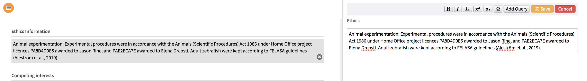

# Ethics

## What are ethics in research?

All authors are expected to adhere to the guidelines set by their institutional review board or ethics committee when the study was approved. For example, animals should not undergo any unnecessary suffering if this can be avoided, and human participants should be be allowed the right to confidentiality and data protection.&#x20;

There are two main types of studies, clinical trials and observational studies.&#x20;

### Clinical trials&#x20;

Clinical trials involve human participants that receive certain interventions such as medical products, medical procedures, changes to environment, and diet. It is the researchers' aim to determine if the approach or product will have different outcomes to those that are currently used. For example, testing a new medication for heart conditions.&#x20;

eLife follows the recommendations of the **** [**ICMJE**](http://www.icmje.org/about-icmje/faqs/clinical-trials-registration/) that all trials must have been prospectively registered to be considered for publication, and the clinical trial registration number will be requested during submission.

There are numerous clinical trial registries that are accepted by eLife, see here for more information about the [**ICMJE**](http://www.icmje.org/about-icmje/faqs/clinical-trials-registration/) **** as an example. Clinical trials are identified with a trial registration number, which is unique to that particular registry. Typically this information will be included in a structured abstract, however if the scope of an article is not purely clinical, but a clinical trial has nevertheless been undertaken, this information will need to be included in the ethics statement instead. This statement will include both the clinical trial registry and the clinical trial number, so that it can be accurately identified by readers.

### Observational studies

Observational studies assess health or behaviour outcomes in the participants with minimal interventions. Most observational studies are not ethically sensitive and the main ethical risk within these studies are related to safety, confidentiality, and consent.&#x20;

## What needs to be checked?

If the study includes the use of animals or people, we ask authors to provide an ethics statement during submission to indicate that the study has been approved and that the guidelines have been adhered to. Each institute will have their own statement.&#x20;

The statement should be checked to ensure it makes sense and is formatted correctly, with no missing spaces or obvious typos. These are included within the article details but the authors may choose to expand on these within the main text as well.&#x20;

Not all articles need these statements and are only included if the study involved human or animal subjects.&#x20;

## How is this information added?&#x20;

During the submission process, authors need to answer the ethics section of the submission information page.&#x20;

.png>)

Authors are expected to fill this in accurately as this information will be exported from eJP to the production vendors in the XML. The production vendors do not make any changes to this section during typesetting, unless it is to correct an obvious error such as a duplication of statement text 'Animal experimentation: and Human subjects:' which the authors may add in themselves. This is not required as they are generated automatically depending on the statement included.&#x20;



## Examples

**Ethics statement for animal subjects:**&#x20;

Animal experimentation: All training and experimental procedures were in accordance with the National Institutes of Health Guide for the Care and Use of Laboratory Animals and were approved by the University of Pennsylvania Institutional Animal Care and Use Committee (protocol #804726). Details about monkey training, behavioral tasks, and caudate recording were reported previously (Fan et al., 2018; Doi et al., 2020).

**Ethics statement for human participants:**

Human subjects: Mothers provided informed consent for their infants to be included in the PreSSMat birth cohort and to have clinical data, cord blood and newborn heel prick samples collected and analysed. The study was approved by the Research Review and Ethical Review Committees of the International Centre for Diarrhoeal Disease Research, Bangladesh (PR-16039) on July 10, 2016. Approvals were also obtained from the Research Ethics Boards of the Ottawa Health Science Network (20160219-01H) on June 10, 2016, and the Children's Hospital of Eastern Ontario (16/20E) on June 8, 2016.

**Ethics statement for clinical trials:**&#x20;

Clinical trial registration Clinical Trials.gov no. NCT02752672.

## Schematron checks

### Content checks

#### ethics-title-test

**Error:** _fn-group\[@content-type='ethics-information'] must have a title that contains 'Ethics'. Currently it is 'XXXXXX'._

**Action:** This error will show if the title is anything but 'Ethics', the title should be corrected to 'Ethics'. This test is looking for an exact match so 'Ethic' or any other spelling mistake is not allowed. As this is in the meta data, the production vendor support team would need to fix this.&#x20;

#### ethics-broken-unicode-test

**Warning:** _Ethics statement likely contains a broken unicode - XXXXXX._

**Action:** Sometimes when articles are exported from eJP, some characters appear as broken unicode. Make sure the ethics statement does not have a broken unicode - if it does, search for the unicode online to see what the character should be and replace accordingly.&#x20;

#### sec-test-4

**Warning:** _Section has a title 'XXXXXX'. Is it a duplicate of, or very similar to, the ethics statement (in the article details page)? If so, it should be removed. If not, then which statement is correct? The one in this section or 'XXXXXX'?_

**Action:** Sometimes authors include the ethics statement within the main text as well as in eJP, these can often be removed if they are duplicates. If the text looks very similar, Editorial should be contacted to determine which is the correct statement to use. This warning may appear if the word 'ethics' are used within the main text, for example "Results: Editors' views on publication ethics". In this case, the warning should be ignored.&#x20;

#### ethics-info-conformity

**Error:** _The ethics statement must end with a full stop._

**Action:** Make sure there is a full stop at the end of the statement. If there is already a full stop, ensure there is not an extra space following it.&#x20;

#### ethics-info-supplemental-conformity

**Warning:** _Ethics statement contains the phrase 'supplemental figure'. This will almost certainly need updating to account for eLife's figure labelling._

**Action:** If the ethics statement contains the phrase 'supplemental figure', this will need to be updated to use the final labels e.g. Figure 1—figure supplement 1. If it is not clear how to do this, add the following author query:

* Please update your ethics statement to use the final labels for all figure supplements and supplementary files mentioned.

### XML structure checks&#x20;

#### ethics-test-1

**Error:** _Ethics fn-group can only be captured as a child of a sec \[@sec-type='additional-information']_

**Action:** The Ethics fn-group should be captured within the 'additional-information' in the XML. The production vendors will need to fix this.&#x20;

#### ethics-test-2

**Error:** _Ethics fn-group may not have more than 3 fn elements. Currently there are XXXXXX._

**Action**: Authors are allowed to include one ethics statement for clinical trial registration, one for human, one for animal. If there are additional statements, Editorial may need to be contacted so they can confirm which should be used.&#x20;

#### ethics-test-3

**Error:** _Ethics fn-group must have at least one fn element._

**Action:**  In the XML, the fn element contains the ethics statement. This element should only be present if an ethics statement has been provided. This error will fire if a fn group does not have an fn element. Double check which ethics statement should be present in this fn-group and correct accordingly.

#### ethics-test-4

**Error:** _This fn must have an @fn-type='other'_

**Action:** If the fn-type is not 'other' this will need to be corrected by the production vendors.&#x20;

## XML structure

```markup
<fn-group content-type="ethics-information">
  <title>Ethics</title>
  <fn fn-type="other" id="fn1">
    <p>Clinical trial registration Clinical Trials.gov no. NCT02752672.</p>
  </fn>
  <fn fn-type="other" id="fn2">
    <p>Human subjects: A clinical study in psoriatic patients treated with dithranol was completed in cooperation with the Department of Dermatology, Klagenfurt State Hospital. Clinical trial procedures were approved by the ethics committee of the federal state of Carinthia, Austria (protocol number A23/15) and all participants gave written informed consent in accordance with the principles of the Declaration of Helsinki.</p>
  </fn>
  <fn fn-type="other" id="fn3">
    <p>Animal experimentation: All mouse experiments were approved by the Austrian Government, Federal Ministry for Science and Research (protocol numbers BMWF-66-010/0032-11/3b/2018, 66.009/0200-WF/II/3b/2014) and animal experiments performed in Vienna were additionally approved by the Animal Experimental Ethics Committee of the Medical University of Vienna.</p>
  </fn>
</fn-group>
```

