# Feature content

## What is feature content?

At eLife, the term 'feature content' covers all non-research content published by the journal. This is synonymous with 'magazine content' and can be found under this heading on the eLife website: [https://elifesciences.org/magazine](https://elifesciences.org/magazine).

This content is overseen by the Features team and consists in part of blogposts and [podcasts](https://elifesciences.org/podcast) that do not required Production intervention to publish. Digests are also published in a dedicated [section](https://elifesciences.org/digests) under the magazine heading, in addition to being included in the related article.

In addition to this, however, there are four categories of Feature article that come through the Production process:

* **Insight** - a commentary article accompanying one or more research articles, usually written by the editors or reviewers who worked on the article, providing context for a broader audience and discussing the importance of the findings being reported.
* **Editorial** - an editorial piece written by one or more of eLife's deputy or senior editors, or the editor-in-chief, usually addressing a specific issue or development in the scientific community and/or eLife in particular.
* **Feature contribution** - an article that is not reporting any scientific findings but instead offers a perspective or comment on events, issues or developments in the scientific community.
* **Feature research** - an article that reports the results of meta-research; that is, studies carried out on the research community and its practices - research on how research is done. 

### Feature templates

There are five Feature templates that map to the above article types. Aside from differences in the content of the articles, these reflect different PDF layouts.

| Template number | Article type | PDF format | Possible content |
| :--- | :--- | :--- | :--- |
| Template 1 | Insight | Two column, with key information box on first page; one-sentence abstract displayed as stand-first | Labelled figures, no digest, no decision/response, no editors/reviewers, no funding, no data availability |
| Template 2 | Editorial | Two column, one-sentence abstract displayed as stand-first | Illustrations, no digest, pull-quotes, no decision/response, no editors/reviewers, no funding, no data availability |
| Template 3 | Feature contribution | Two column, one-sentence abstract displayed as stand-first | Illustrations, no digest, pull-quotes, no decision/response, no editors/reviewers, no funding, no data availability |
| Template 4 | Feature contribution | Two column, full abstract | Labelled figures, tables, boxes, no digest, pull-quotes, no decision/response, no editors/reviewers, no funding, no data availability |
| Template 5 | Feature research | Two column, full abstract | Labelled figures, tables, boxes, no digest, possible decision/response, editors/reviewers, funding information, data availability section |

The template for each Feature article will be indicated using the article file name in the exported files, for example "elife50543\_template3.docx" or "elife46563\_template4.docx".

### Unique features of feature content

Feature content includes the following items not found in research content:

* **Title prefix** - a brief category label displayed in front of the title, currently captured in the XML as a 'sub-display-channel' subject element. Text is given in title case.

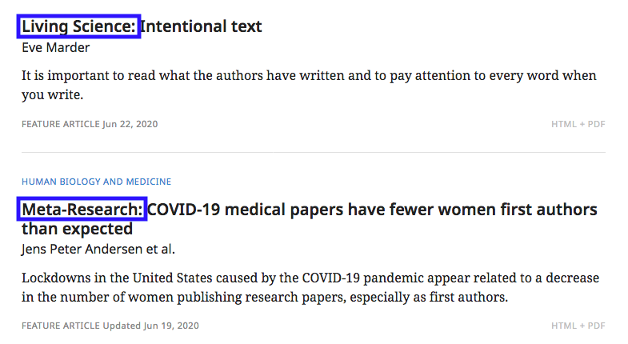

* **Author bio** - a short description of the author's affiliation and any notable positions held. This is given in addition to author affiliations, rather than replacing them, but supercedes them for display.

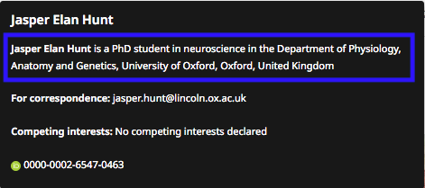

* **Illustrations** - unlabelled figures with a single sentence description. May also include an attribution.

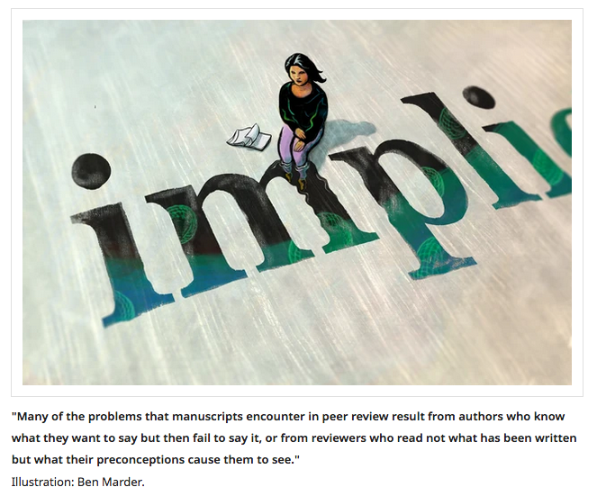

* **Key info box** - in Insights specifically, the details of the article\(s\) being commented upon are given in a box on the first page of the PDF. This content is not currently displayed online.

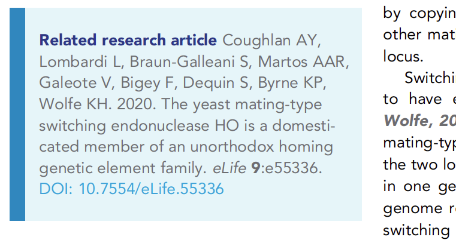

* **Pull-quotes** - in Templates 2-4, pull-quotes can be used to highlight key points in the text.

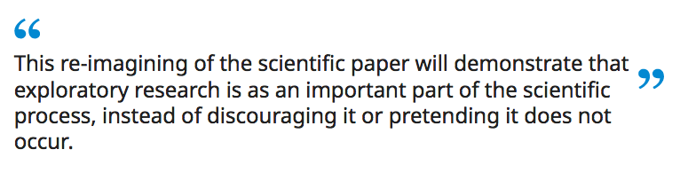

## Submission and export of feature content

Feature content is submitted to eLife via two paths: articles submitted via the the normal submission process and articles commissioned or invited by the Feature team. When articles are submitted via the normal process, they will go through peer review, usually overseen by the Features editors, and likely have decision and response sections. Commissioned articles are not reviewed and so will have no editors or review materials associated with them. These will be uploaded to the submissions system by the Features team, who will use the 'auto-accept' option to bypass the reviewing process.

In both cases, the Features team will carry out checks and editing tasks before the articles are exported for production. Part of this involves formatting the article files using 'pseudo-tagging' to designate the various parts of the content for processing. If the article needs to be published as an accepted manuscript \(PoA\), then this will need to be done before these changes are made to ensure a clean accepted manuscript is published. When the PoA process has been carried out, the article should be held in the export queue until the pseudo-tagging has been added.

The article file will also be renamed to indicate which template should be used and will rename any figure files to indicate the width at which they should be placed in the PDF. Since feature content uses a two-column PDF template, there are more options for figure placement than in research content. These are described using the following classes:

* **Class A** = 1 column wide
* **Class B** = 1 column plus the margin wide
* **Class C** = 2 columns wide
* **Class D** = 2 columns plus the margin wide \(i.e. full page\)

The class chosen for each figure will be indicated in the file name.

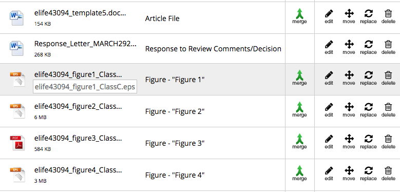

Once the files have been edited, the article will be exported. At this point, the Features team may contact the Production team by email to advise them whether a decision/response will be included, or any unusual elements such as complex boxes, or to give a specific deadline for getting the proof to the authors.

## Production process for feature content

### Pre-editing

Feature content should be processed as soon as possible after export \(within 24 hours for Insights, Editorials and Template 3/4 content, within 48 hours for Template 5 content\). If more time is required, the content processors should let the Production team know as soon as possible.

No copy-editing should be required for feature content as this will already have been carried out by the Feature team prior to export. In very rare cases where external copy-editing is required, the Features team will advise the Production team who will request that the article is moved into the external copy-editing workflow.

Once a feature article has been processed, it will be moved to the pre-author check stage to allow the Production team to check the content prior to author proofing.

### Pre-author checks

The Production team will check feature content before it goes out to the author to ensure that it has been processed correctly, and to make sure any special requirements have been fulfilled. In order to do this, it will be necessary to open the article in the submission system to compare against the processed version.

#### Title prefix

The title prefix is displayed as the 'sub display channel' in the article details page. This should be in title case \(as opposed to the sentence case used for all other eLife headings\).

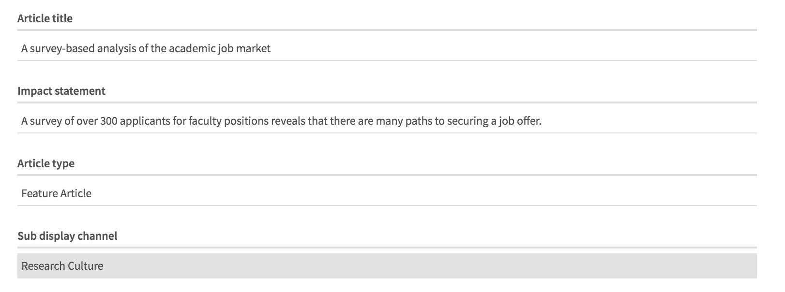

#### Author bio

The author bio displays under the author name and can be edited in the author details panel.

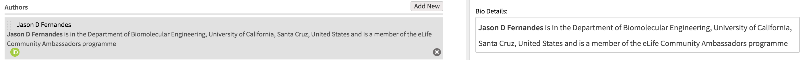

Each author should be assigned the same affiliations that are described in the bio. Note that these do not have to be exactly the same. For example, an affiliation may be described as "" but would be entered as two affiliations, "" and "".

The author's name should be given in bold and the bio should not end in a full-stop.

#### Key info box

In Insight articles, a key info box will be displayed at the start of the Content page, just below the Abstract. It should contain the details of the related research article\(s\), with the DOI hyperlinked to the correct page. 

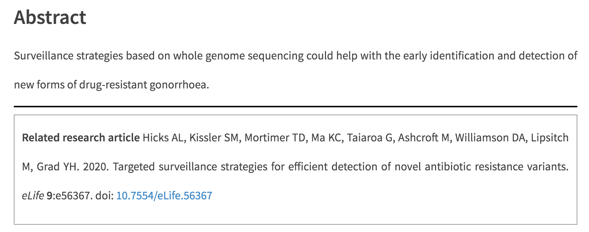

#### Pull-quotes

Pull-quotes should be placed after the same paragraphs indicated in the article file.

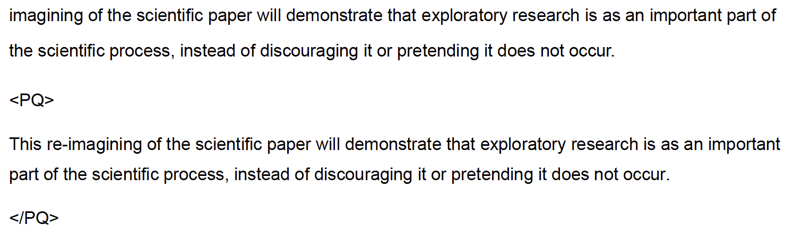

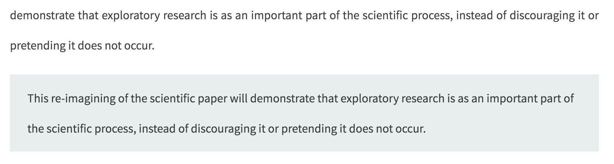

Pull-quotes should ideally appear at a similar point in the PDF; however this may not be possible if the figure and column layout does not allow it.

#### PDF display

Figures in the PDF should display at the correct width corresponding to the class given in the file name \(see [above](feature-content.md#submission-and-export-of-feature-content)\).

### Author proofing

Author proofing for feature content proceeds in the same manner as for research content. The proofing email will be copied to the Features team and the Features editor. Author correspondence during proofing should be handled by whichever of the Production or Features teams is most appropraite. That is, technical questions about the proofing system and problems with the proof should be handled by the Production team while requests to make extensive changes should be referred to the Features team.

### Feature review

Once author proofing is complete, the article will move into the 'Feature Review' stage to allow the Features team to check over the authors' edits. They will be alerted with an email notification once this occurs.

Once they have completed their checks, they will sign the article off to Post Author Validation. If anything needs changing or correcting and the Feature team cannot make the required edits via the proofing system, they will email instructions to the Production team who will respond accordingly, either by passing the instructions on to the content processors or by making a note to fix the outstanding issues at the post-author check stage.

### Post-author checks

## Schematron checks

### Content

#### feature-title-test-1

**Error**: _title starts with the sub-display-channel. This is certainly incorrect._

**Action**: This error indicates that the title prefix \(sub-display-channel\) has been included at the start of the article title as well as in the correct field. Remove the repeated text from the article title.

#### feature-subj-test-2

**Error**: _The content of the sub-display-channel should be in title case - XXXXXX_

**Action**: Correct the title prefix \(sub-display-channel\) so that it is in title case rather than, for example, in sentence case. XXXXXX will be the text of the title prefix.

#### feature-subj-test-3

**Error**: _sub-display-channel ends with a colon. This is incorrect._

**Action**: Delete the colon from the end of the title prefix \(sub-display-channel\).

#### feature-author-test-1

**Error**: _Author must contain child bio in feature content._

**Action**: Every author in a feature article should have a bio element. The text for this should be given in the exported article file. Ensure that this is added to the author indicated.

#### feature-bio-test-1

**Error**: _bio must contain a bold element which contains the name of the author - XXXXXX._

**Action**: The author's name in the bio should be in bold. Check that this has been done and that the bold formatting does not spill over into the rest of the text. XXXXXX will be the affected author.

#### feature-bio-test-2

**Warning**: _bio does not contain the institution text as it appears in their affiliation \('XXXXXX'\). Is this correct?_

**Action**: 

#### feature-bio-test-6

**Warning**: _Some of the text from XXXXXX's affiliations does not appear in their bio - XXXXXX. Is this correct?_

**Action**: 

#### feature-bio-test-3

**Error**: _bio cannot end with a full stop - 'XXXXXX'._

**Action**: remove the full-stop from the end of the author bio. XXXXXX will be the text of the affected bio.

#### feature-bio-test-4

**Error**: _One and only 1 &lt;p&gt; is allowed as a child of bio. XXXXXX_

**Action**: 

#### feature-bio-test-5

**Error**: _XXXXXX is not allowed as a child of &lt;bio&gt;. - XXXXXX_

**Action**: 

#### feature-template-test-1

**Error**: _XXXXXX is a template XXXXXX but it has a decision letter or author response, which cannot be correct, as only template 5s are allowed these._

**Action**: Only Template 5 feature articles should have decision letter and author response sections.

#### feature-template-test-2

**Error**: _XXXXXX is a template XXXXXX so the article element must have a @article-type="research-article". Instead the @article-type="XXXXXX"._

**Action**: Template 5 feature articles must have an attribute of `@article-type="research-article"` on the &lt;article&gt; element. If this error fires, it indicates that the article-type attribute has another value and this needs to be corrected to "research-article". 

#### feature-template-test-3

**Warning**: _XXXXXX is a template XXXXXX but it does not \(currently\) have a decision letter. Is that OK?_

**Action**: This warning will fire if a Template 5 article does not have a decision letter section. Check the article notes - if no decision/response was expected for the current article, this should have been recorded. If there are no notes, the Production team should contact the Feature team to check the status of the decision/response for the article.

#### feature-template-test-4

**Warning**: _XXXXXX is a template XXXXXX but it does not \(currently\) have an author response. Is that OK?_

Action: This warning will fire if a Template 5 article does not have an author response section. Check the article notes - if no decision/response was expected for the current article, this should have been recorded. If there are no notes, the Production team should contact the Feature team to check the status of the decision/response for the article.

#### feature-templates-no-bre

**Error**: _XXXXXX is a template XXXXXX, which means that it should not have any BREs. This XXXXXX has XXXXXX. Please remove any senior/reviewing editors._

**Action**: Template 1–4 articles should not have 

#### feature-templates-author-cont

**Warning**: _XXXXXX is a template XXXXXX, which means that it should very likely not have any Author contributions. This XXXXXX has XXXXXX. Please check with eLife production whether author contributions should be present._

**Action**: This warning indicates that the authors of a Template 1, 2, 3 or 4 article have author contirbutions. This is highly unusual as articles using these templates do not typically include contributions. eLife has, however, published Editorials \(Template 2\) articles with contributions, so they are allowed in unusual cases. Check for any notes indicating that contributions are required for the current article.

### Structure

#### feat-custom-meta-test-1

**Error**: _XXXXXX is not allowed in a Template type meta-value._

**Action**: 

#### feat-custom-meta-test-2	

**Error**: _Template type meta-value must one of '1','2','3','4', or '5'._

**Action**: 

#### feat-custom-meta-test-info	

**Info**: _Template X._

**Action**: No action required, this is just an information message stating the template used for the article. X will be the number of the template being used \(1, 2, 3, 4 ,5\).

#### feat-custom-meta-test-3	

**Error**: _XXXXXX must be a template 1. Currently it is a template XXXXXX._

**Action**: An article with the article type 'Insight' must use Template 1. Please change the article to this template.

#### feat-custom-meta-test-4	

**Error**: _XXXXXX must be a template 2. Currently it is a template XXXXXX._

**Action**: An article with the article type 'Editorial' must use Template 2. Please change the article to this template.

#### feat-custom-meta-test-5

**Error**: _XXXXXX must be a template 3, 4, or 5. Currently it is a template XXXXXX._

**Action**:

#### feature-article-category-test-1

**Error**: _article categories for XXXXXX must contain one and only one subj-group\[@subj-group-type='sub-display-channel'._

**Action**: Only one title prefix \(sub-display-channel\) is allowed per article. This is captured in the XML as the element  &lt;subj-group subj-group-type="sub-display-channel"&gt;. This error indicates that zero or more than one elements of this type are present. Remove any extra title prefixes. If no title prefix is present in the article file, the Features team must be contacted to provide one. XXXXXX will be the article type.

#### feature-subj-test-4

**Error**: _There is more than one sub-display-channel subjects. This is incorrect._

**Action**: Only one title prefix \(sub-display-channel\) is allowed per article. This error indicates that two `<subject>` elements have been included in  `<subj-group subj-group-type="sub-display-channel">`. Remove any extra title prefixes/`<subject>` elements to correct this.

#### features-custom-meta-presence

**Error**: _2 custom-meta\[@specific-use='meta-only'\] must be present in custom-meta-group for XXXXXX._

**Action**:

