# Funding Information

If you are looking for a list of schematron messages related to the funding section, please click [here](funding-information.md#schematron-warnings).

### Funding section overview

* All funding received by authors in the process of researching and publishing the article needs to be referenced in the funding table. 
* Every funder must have at least one author associated with it.
* Grant references are optional. 
  * [Only one grant number](funding-information.md#multiple-grant-references-in-one-entry) should be displayed per entry in the funding table. 
  * If two or more grants are present in one entry, they should be [split into multiple funding entries](funding-information.md#multiple-grant-references-in-one-entry). 
* Whenever the funding section is edited, an author query must be added so the authors can approve the change.

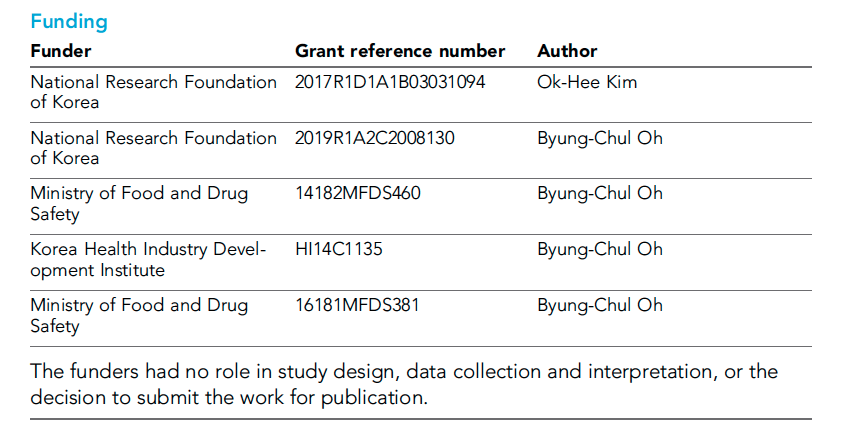

### Funder Registry

The details of each funding reference need to be checked individually. Ideally, every funder should be validated against the Funder Registry.

Validated funders are indicated by a green tick at the end of the funder name.   
If a funder is not validated, check whether it is on the[ Funder Registry](https://gitlab.com/crossref/open_funder_registry) list \(note: this list is updated sporadically so please re-download it every time you need to check it\).   
Try re-typing the funder name if it is in the registry, this can make it "stick".    
If the funder is not in the registry, conduct an online search. Sometimes the name may need correcting slightly, or what the author has listed as the funder is funded by another organisation that is in the Funder Registry \(see [here](funding-information.md#splitting-out-parent-and-sub-funders) for examples of how to capture this information\).

The Funder Registry contains variants of funder names. For example, the following all refer to the same [funder](http://data.crossref.org/fundingdata/funder/10.13039/501100004792):

* Ministère de l'Education Nationale, de l'Enseignement Superieur et de la Recherche
* French Ministry of Higher Education and Research
* Ministry of Higher Education and Research
* MESR

All of these are valid. Leave as the author has provided as long as it validates. 

### Acknowledgements section

Please check the acknowledgements section of the article for additional funders that may not have been entered into the table. The schematron validator will present a warning if funders on the Funder Registry registry are not entered into the table - but it will not pick up every instance and will sometimes fire unnecessarily, for instance if the funder name is anglicised in the acknowledgements section but not in the funding table or if the author is acknowledging help or indirect funding. You will need to manually check and use your discretion to decide whether a funder belongs in the funding table.

## Examples

* [Funder details in acknowledgements section but not in funding section](funding-information.md#funder-details-in-acknowledgements-section-but-not-in-funding-section)
* [Multiple grant references in one entry](funding-information.md#multiple-grant-references-in-one-entry)
* [Third-party funding vs funding to authors](funding-information.md#third-party-funding-vs-funding-to-authors)
* [Splitting out parent and sub-funders](funding-information.md#splitting-out-parent-and-sub-funders)
* [Funders that are in Funder Registry but hard to track down - non-English funder names that require translation](funding-information.md#funders-that-are-in-funder-registry-but-hard-to-track-down-non-english-funder-names-that-require-translation)
* [Funders not in the Funder Registry](funding-information.md#funders-not-in-the-funder-registry)
* [Examples of when to ignore/pay attention to the schematron message](funding-information.md#examples-of-when-to-ignore-pay-attention-to-the-schematron-messages)
* [No funding information given](funding-information.md#no-funding-information-given)

### Funder details in acknowledgements section but not in funding section

In article 51144, the acknowledgements section states:

> We thank Shellee Cunnington, Mark Cafaro, and Jim Kuchenbecker for technical assistance. Tissue was provided by the Tissue Distribution Program at the Washington National Primate Research Center \(WaNPRC; supported through NIH grant P51 OD-010425\), and we thank the WaNPRC staff, particularly Chris English and Audrey Baldessari, for making these experiments possible. Fred Rieke and Chris Chen assisted in tissue preparation. We thank Fred Rieke for helpful discussions. We also thank Ione Fine, Phil Mardoum, Christian Puller, and Greg Schwartz for feedback on a previous version of this manuscript. This work was supported in part by grants from the NIH \(NEI R01-EY027323 to MBM; NEI R01-EY029247 to EJC, FR, and MBM.; NEI P30-EY001730 to the Vision Core\), Research to Prevent Blindness Unrestricted Grant \(to the University of Washington Department of Ophthalmology\), **Latham Vision Research Innovation Award \(to MBM\), and the Alcon Young Investigator Award \(to MBM\).**

When this article came out of pre-editing, the information for the Latham Vision Research Innovation Award had not been added, and the Alcon Research Institute did not have grant reference details added. The following steps should have been taken:

#### For the Latham Vision Research Innovation Award

1. Try adding the Latham Vision Research Innovation Award as a funder
2. This doesn’t validate, so do an online search for ‘Latham Vision Research Innovation Award’
3. One of the first pages that comes up is [this](https://ophthalmology.washington.edu/about-uw-ophthalmology/donate/vision-research-priorities), suggesting this is an award which is given out by the University of Washington’s department of Ophthalmology

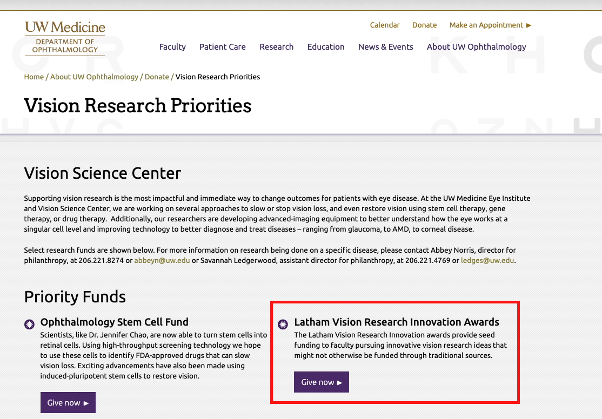

1. Try entering the funder as ‘University of Washington department of Ophthalmology’. However, this does not appear as a funder so we can just keep it as ‘University of Washington’.

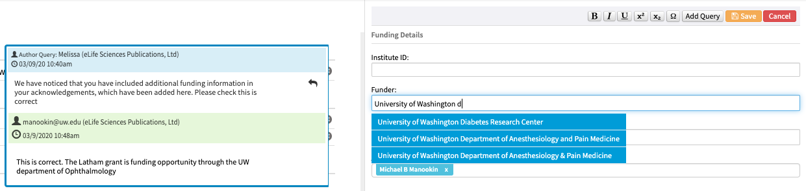

1. Enter the funder as ‘University of Washington’ and ‘Latham Vision Research Innovation Award’ as the grant reference, and assign the correct author to this funder \(in this case, it would be ‘MBM’ i.e. Michael B Manookin\)
2. Leave the following author query for the authors to confirm this information has been entered correctly.

   * Please check that the edited funding details are still correct.

#### For the Alcon Research Institute

1. Search for ‘Alcon Young Investigator Award’ online - which brings up [this page](https://www.alcon.com/alcon-research-institute), suggesting the funder is called Alcon Research Institute, and the award itself is the Alcon Young Investigator Award
2. Enter this information in the funding table and assign the correct author \(in this case, it would be ‘MBM’ i.e. Michael B Manookin\)

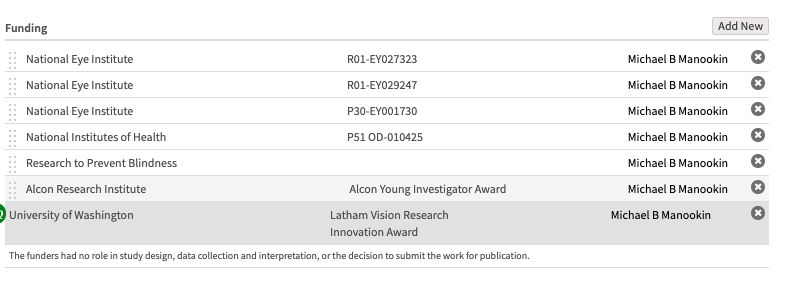

In article 50927, the acknowledgements section states:

> This work was supported by the National Institutes of Health through **National Institute of Neurological Disorders and Stroke grants R01-NS084142, R01-NS095368, and R01-NS110669**, the Gatsby Charitable Trust, the Simons Foundation, and NSF NeuroNex Award DBI-1707398. We thank Steven Siegelbaum, Kenneth Miller, Sean Escola, Ning Qian, and colleagues at Columbia Neurotheory Center for their useful discussions and suggestions.

The authors had added the National Institute of Neurological Disorders and Stroke as a funder - which validated against the Funder Registry registry. However, only one grant reference was entered \(R01-NS084142\), although the acknowledgements section mentions three. This is also a good example of parent and sub-funders - click [here](funding-information.md#splitting-out-parent-and-sub-funders) for more information about splitting these out.


The steps to take in this case are:

1. Add a new funder and enter ‘National Institute of Neurological Disorders and Stroke’ in the funder field
2. Add the grant reference R01-NS095368 and assign the same authors as in the first entry \(Jyun-you Liou, Elliot H Smith, Catherine Schevon\)
3. Add a new funder and do the same again for the grant reference R01-NS110669
4. Leave the following author query asking the authors to confirm the edits to both funder entries:

* Please check that the edited funding details are still correct.


Some funders can be tricky to track down. For example, the acknowledgements section of 51440 states:

> This work was supported by NIH/NINDS grants NS087095 and NS110945, **and the COBRE Neuroscience award P30 103498.** We thank Todd Clason, and the Molecular and Imaging Cores, at the University of Vermont. Thanks to John Clements for providing the deconvolution algorithm used to estimate the rate of synaptic vesicle release.

The funding table did not include the information about the COBRE Neuroscience award: 

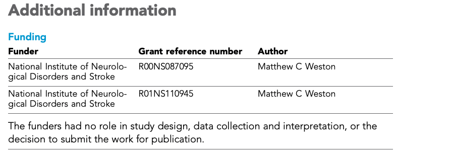

Looking up the COBRE Neuroscience Award online takes you to [this](http://www.med.uvm.edu/neurocobre/about) page. It looks like the COBRE Neuroscience Award is given out by the University of Vermont but supported by a grant from the National Institute of General Medical Sciences under the award number P30 GM 103498. This information has been entered into the funding table as below:


Note that this is a complicated example, and the authors should be asked to confirm whether this change is correct using the following author query.

* Please check that the edited funding details are still correct.

### Multiple grant references in one entry

Sometimes, multiple grant references will be entered under the same funder. In the example below, the first entry for the funder 'Cancerfonden' has the grant reference 'CAN2011/1180; CAN 2018/793'. If grant references include semi-colons or commas, this usually indicates multiple grants from the same funder. If you need to split funding entries, cross-check with the acknowledgements to see if they have specified different authors for each of the grants, and add an author query if you are unsure the split is correct.

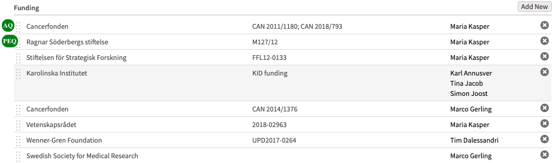

In this case, split the grant references into two entries, enter the same author for both, and leave the following author query:

* Please check that the edited funding details are still correct.

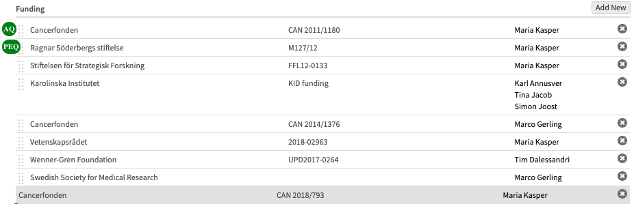

Note that the presence of a comma or semi-colon doesn't always indicate that there are multiple grant references. For example, in article 53308: 

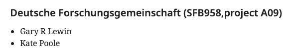

This is referring to a single grant - the 'project A09' part is just giving extra information about the project which received the grant. This does not need to be split into multiple entries. In article 49206, a grant was incorrectly split into two entries:

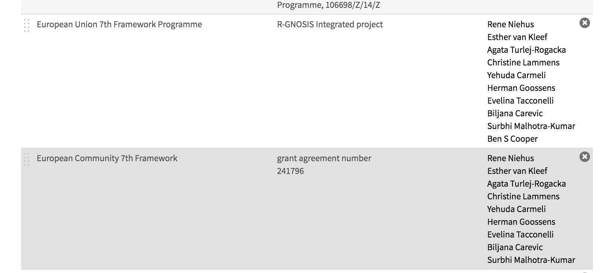

The information in eJP was as below: 

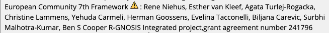

In this case, 'R-GNOSIS Integrated project, grant agreement number 241796' is all referring to the same grant given out by the European Community 7th Framework. 

It can be tricky to work out when grants should be split into multiple entries in the funding table. Therefore, make sure an author query is left whenever any change is made to the funding section to make sure the authors can approve the change.

### Third-party funding vs funding to authors

Sometimes authors will include information about third-party funders in their acknowledgements. Third party funding is any funding that did not go directly to the authors but to the institutes or labs they work at. These funders do not need to be listed in the funding table as they did not directly fund the work presented in the paper. For example, the acknowledgements section of 51915 states:

> The authors thank Drs. Silvia Arber, Ruth Ashery-Padan, James Li, Andrew McMahon, Michael Robinson, David Ornitz, Xin Sun and Stephen Tsang for mice, Drs. Bridget Hogan, Gord Fishell, Suzanne Mansour and Gail Martin for in situ probes. We also thank Drs. Carlo Maurer and Kenneth Olive for help with Laser Capture Microscopy, Drs. Howard Worman and Ji-Yeon Shin for advice on Lamin A/C antibody, Dr. Mukesh Bansal for bioinformatics analysis, Joseph Ryo for critical reading of the manuscript. The work was supported by NIH \(EY017061 and EY025933 to XZ\). **The Columbia Ophthalmology Core Facility is supported by NIH Core grant 5P30EY019007 and unrestricted funds from Research to Prevent Blindness \(RPB\).** XZ is supported by Jules and Doris Stein Research to Prevent Blindness Professorship. AG was a recipient of STARR fellowship. QW is supported by a Postdoctoral Fellowship from Natural Sciences and Engineering Research Council of Canada.

This information does not need to be added to the funding table as it refers to the Columbia Ophthalmology Core Facility and not a specific author. Note that the schematron validator would show the following [warning](funding-information.md#fundref-test-1) \(with the doi for NIH listed\): 

> Acknowledgements contains funder\(s\) in the open funder registry, but their doi is not listed in the funding section. Please check -

However, this is okay to ignore in this case.

### Splitting out parent and sub-funders

Many funders are sub-funders of parent funding bodies. As a general rule, we need to be as specific as possible when editing entries in the funding table, and credit the sub-funder where appropriate.

When parent and sub-funders are both listed in the acknowledgements, the sub-funder should be entered into the funding table. For example, the National Institutes of Health is a parent funder with many sub-funders. In article 50927, the acknowledgements section states:

> This work was supported by the **National Institutes of Health through National Institute of Neurological Disorders and Stroke** grants R01-NS084142, R01-NS095368, and R01-NS110669, the Gatsby Charitable Trust, the Simons Foundation, and NSF NeuroNex Award DBI-1707398. We thank Steven Siegelbaum, Kenneth Miller, Sean Escola, Ning Qian, and colleagues at Columbia Neurotheory Center for their useful discussions and suggestions.

The funder to enter in this case is the National Institute of Neurological Disorders and Stroke - not the National Institutes of Health.

Another example of this is the Horizon 2020 funding given out by the European Commission. In this article, the acknowledgements section states:

> We thank D Thomas Rutkowski for providing Atf6-/- MEFs and Svenja Siebels for helpful advice on the DPI-ELISA. This study was supported by the Deutsche Forschungsgemeinschaft \(BR 1730/6-1 to WB\), the **EU Horizon 2020 Marie Sklodowska-Curie ITN-TREATMENT** \(Grant 721236 to BT\), the German-Israeli Foundation \(Grant I-1471–414.13/2018 to BT\), and Giovanni Armenise-Harvard Foundation \(Career Development Award to EvA\).

The parent funder here is Horizon 2020, which is listed in the Funder Registry. However, to be as specific as possible, H2020 Marie Skłodowska-Curie Actions should be entered, as this is also in the Funder Registry.

Sometimes, authors will enter programs as main funders. If the authors have entered a details for specific program as a funder \(e.g. 'Lois Pope LIFE Fellows Program'\), check whether this is an award issued by a funding body which is in the registry \(in this case, that would be the [University of Miami](http://biomed.med.miami.edu/graduate-programs/neuroscience/events/lois-pope-life-fellowship-awards)\). The program name should then be moved to the grant reference column and the funding body's name entered in its place:


### Funders that are in Funder Registry but hard to track down - non-English funder names that require translation

Some funders in the Funder Registry will not validate unless they are entered in a non-English language. For example, the Spanish Ministry of Economy and Competitiveness \(MINECO\) will not validate unless it is entered in Spanish, or entered in English as the 'Ministry of Economy and Competitiveness':

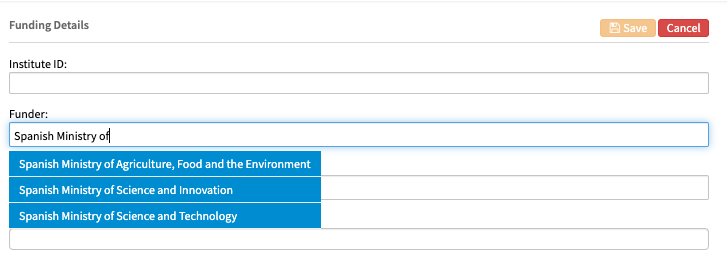

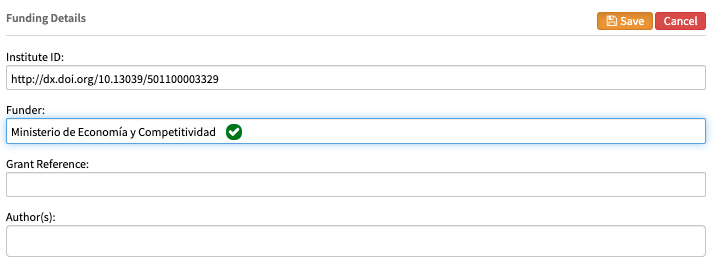

### Funders not in the Funder Registry

In article 51928, the acknowledgements section states:

> This work was supported by Baylor College of Medicine, Texas Children’s Hospital, the National Institute of Neurological Disorders and Stroke \(AMB: F31NS101891, JJW: F31NS092264, RVS: R01NS089664 and R01NS100874\), the Eunice Kennedy Shriver National Institute of Child Health and Human Development \(U54HD083092\), a BCM IDDRC Project Development Award, **the Hamill Foundation**, the Mrs. Clifford Elder White Graham Endowed Research Fund, and the Bachmann-Strauss Dystonia and Parkinson Foundation, Inc. The content is solely the responsibility of the authors and does not necessarily represent the official views of the National Center for Research Resources or the National Institutes of Health.

When adding the Hamill Foundation as a funder, it did not validate against the Funder Registry.

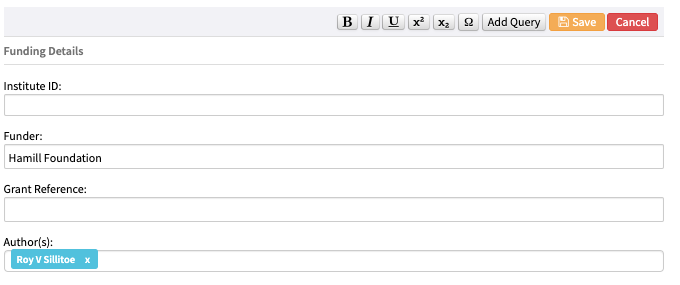

The following schematron [warning](funding-information.md#institution-id-test) was present: 

> Whenever possible, a funder should have a doi - please check whether there is an appropriate doi in the open funder registry. \(institution-id\[@institution-id-type="FundRef"\] is not present in institution-wrap\).

An online search for 'Hamill Foundation' leads to [this page](https://www.guidestar.org/profile/23-7028238). As this looks like a legitimate funder, we can ignore the schematron warning in this case.  

The funding table may also already have unvalidated funders in it. For example, in article 51712:

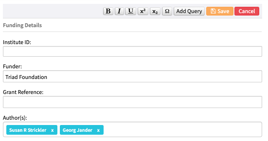

An online search for the 'Triad Foundation' leads to [this page](https://fconline.foundationcenter.org/fdo-grantmaker-profile?collection=grantmakers&key=TRIA018). As this looks like a legitimate funder, the schematron warning can be ignored. 

### Examples of when to ignore/pay attention to the schematron messages

In article 49392, the acknowledgements section states:

> This work was supported by Grants-in-aid for Scientific Research from the Ministry of Education, Culture, Sports, Science and Technology \(MEXT\) of Japan \(26221005\); the Project for Development of Innovative Research on Cancer Therapeutics \(P-DIRECT\) \(14069014\) and the Project for Cancer Research And Therapeutic Evolution \(P-CREATE\) from **Japan Agency for Medical Research and Development \(AMED\)**; a grant from Tokyo Biochemical Research Foundation; a Keio Gijuku Academic Development Funds. We would like to thank Miyuki Saito for technical assistance and JeongHoon Park, Misako Horikawa, and Ryoko Suzuki for preparation of the manuscript.

The following [schematron warning](funding-information.md#fundref-test-1) fired:

> Acknowledgements contains funder\(s\) in the open funder registry, but their doi is not listed in the funding section. Please check - Research and Development - http://dx.doi.org/10.13039/100006190.

This warning fired because the phrase 'Research and Development' was present in the acknowledgments. However, in this case, this phrase is part of the name of another funder - Japan Agency for Medical Research and Development. Therefore, this warning can be ignored.

### No funding information given

In rare cases, a study will not have any funders associated with it - in which case the funding statement should read 'No external funding was received for this work'. If this is not the case the following author query needs to be left asking the authors to confirm no funding was received. 

* Please confirm whether any funding was received for this work.

## Schematron warnings

The following tests are run on the funding section. X or XXXXXX refers to quoted text which will change depending on the article. 

### Content warnings

These warnings relate to the content of a funding statement.

#### funding-group-test-3

**Warning:** _Is this funding-statement correct? - 'XXXXXX' Usually it should be 'No external funding was received for this work.'_

**Action:** This will fire if there are no funding entries and the funding statement does not state 'No external funding was received for this work.' If the acknowledgements section mentions funding for the work, add the funders into the table and leave the following author query: 

* We have added the additional funding information from your acknowledgements. Please check the changes to your funding details and confirm they are correct.

If no funders are mentioned, the funding statement should be 'No external funding was received for this work.' If this statement is not already present, please leave the following author query for the authors to confirm that no external funding was received:

* Please confirm whether any funding was received for this work.

#### award-id-test-1

**Warning:** _Funding entry with id 'fundX' has a comma or semi-colon in the award id. Should this be separated out into several funding entries? - 'XXXXXX'_

**Action:** This will fire if the grant reference has a comma or semi-colon. If this seems like multiple grant references, split them out into separate funding entries and leave the following author query. 

* Please check that the edited funding details are still correct.

For more information on splitting out grant references, see [here](funding-information.md#multiple-grant-references-in-one-entry).

#### award-id-test-2

**Error:** _Award id contains - ''N/A" - This entry should be empty._

**Action:** If any grant reference entry has 'N/A', please delete this text.

#### award-id-test-3

**Error:** _Award id contains - ''None" - This entry should be empty._

**Action:** If any grant reference entry has 'None' please delete this text.

#### award-id-test-4

**Warning**: _Award id contains what looks like a broken unicode - 'XXXXXX'._

**Action**: Sometimes when articles are exported from eJP, some characters appear as broken unicode. Make sure the grant reference entry does not have broken unicode - if it does, search for the unicode online to see what the character should be and replace accordingly. For example:

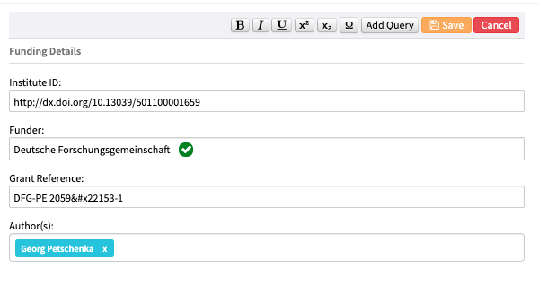

The character / is appearing as broken unicode. Doing an online search for &\#x2215 will show what the correct character should be.

#### institution-id-test

**Warning:** _Whenever possible, a funder should have a doi - please check whether there is an appropriate doi in the open funder registry. \(institution-id\[@institution-id-type="FundRef"\] is not present in institution-wrap\)._

**Action:** This warning will fire if a funder does not have a Funder Registry DOI associated with it. In these cases, first check that the funder name has been entered correctly by looking it up in the [Funder Registry](https://gitlab.com/crossref/open_funder_registry). Try searching for partial matches to the provided text. If no matches are returned, search for the entered funder online.

If an online search shows that the funder is legitimate \(e.g. returns a website for the mentioned organisation\) but it is not on the Funder Registry and has no parent funding body, this warning can be ignored \(see [above](funding-information.md#funders-not-in-the-funder-registry)\).

If the authors have entered a details for specific program \(e.g. 'Lois Pope LIFE Fellows Program'\), check whether this is an award issued by a funding body which is in the registry \(in this case, that would be the [University of Miami](http://biomed.med.miami.edu/graduate-programs/neuroscience/events/lois-pope-life-fellowship-awards)\). The program name should then be moved to the grant reference column and the funding body's name entered in its place. See also how to [split parent and sub-funders](funding-information.md#splitting-out-parent-and-sub-funders).

For more information on the Funder Registry, see [here](funding-information.md#funder-registry).

#### fundref-test-1

**Warning:** _Acknowledgements contains funder\(s\) in the open funder registry, but their doi is not listed in the funding section. Please check - 'XXXXXX'._

**Action:** This will fire if funders are mentioned in the acknowledgements section, but have not been added to the funding table. You may need to add funders into the table, but this may not be necessary - if for example, it refers to [third-party funding](funding-information.md#third-party-funding-vs-funding-to-authors). It may also not be necessary if the acknowledgements section mentions institutions of the individuals they are thanking, e.g.:

> The authors thank \[...\] Dr. Evan Reid \(University of Cambridge\) \[...\] The Leica SP8 microscope used in this study was purchased by the University of Manchester Strategic Fund.

The University of Cambridge should not be listed in the funding table because it is not mentioned as a funder but as the institution of one of the authors. The University of Manchester should also not be listed in the funding table because it is listed here as a third-party funder - i.e. it did not provide funding to the authors. For more guidance on adding funders into the table, see examples [here](funding-information.md#examples).

#### award-group-test-7

**Error:** _There is no author associated with the funding for 'XXXXXX', which is incorrect. \(There is no xref from a contrib pointing to this &lt;award-group id="fundX"&gt;\)_

**Action:** Make sure the funder listed in the warning message has an author associated with it. If it doesn't, check eJP to see if this information is there and check the acknowledgements to see if the authors have mentioned which author received the funding in question. If there is no information about this, please leave the following author query: 

* Please confirm which author received this funding.

### XML structure warnings

These warnings relate to the XML structure of the funding section. For more information about what the XML should look like, see [below](funding-information.md#xml-structure). 

#### funding-group-test-1

**Error:** _One funding-statement should be present in funding-group._

**Action:** Make sure the article has a funding statement. If no funding was received for the work, this should state 'No external funding was received for this work.' If funding was received for the work, the statement should state 'The funders had no role in study design, data collection and interpretation, or the decision to submit the work for publication.' If neither of these are present, check the acknowledgements section - if it mentions funding for the work, add the funders into the table and leave the following author query: 

* We have added the additional funding information from your acknowledgements. Please check the changes to your funding details and confirm they are correct.

If no funders are mentioned, please leave the following author query for the authors to confirm that no external funding was received:

* Please confirm whether any funding was received for this work.

#### funding-group-test-2

**Warning:** _There is no funding for this article. Is this correct?_

**Action:** This will fire if there are no funding entries. If the acknowledgements section mentions funding for the work, add the funders into the table and add the following author query:

* Please check that the edited funding details are still correct.

Additionally, make sure the funding statement reads: 'The funders had no role in study design, data collection and interpretation, or the decision to submit the work for publication.'

If no funders are mentioned, there should be a funding statement which reads 'No external funding was received for this work.' Please add the following author query:

* Please confirm whether any funding was received for this work.

If the authors confirm no funding was received, make sure the funding statement reads: 'No external funding was received for this work.'

#### award-group-test-1

**Error:** _award-group must have an @id, the value of which conforms to the convention 'fund', followed by a digit._

**Action:** Make sure each funder has a funding id in the format 'fund' and a number e.g. fund1, fund2. It should be impossible for this error to occur - please contact the Production team if you see it. 

#### award-group-test-2

**Error:** _award-group must contain a funding-source._

**Action:** Make sure a funder name is present in the award group element \(see [below](funding-information.md#xml-structure) for XML structure\). It should be impossible for this error to occur - please contact the Production team if you see it. 

#### award-group-test-3

**Error:** _award-group must contain a principal-award-recipient._

**Action:** Make sure the funder listed in the warning message has an author associated with it. If it doesn't, check eJP to see if this information is there and check the acknowledgements to see if the authors have mentioned which author received the funding in question. If there is no information about this, please leave the following author query: 

* Please confirm which author received this funding.

#### award-group-test-4

**Error:** _award-group may contain one and only one award-id._

**Action:** Make sure there is only one grant reference per funder. It should be impossible for this error to occur - please contact the Production team if you see it. 

#### award-group-test-5

**Error:** _funding-source must contain an institution-wrap._

**Action:** Make sure the institution-wrap element \(containing the funder doi and funder name\) is present in the xml \(see [below](funding-information.md#xml-structure) for XML structure\). It should be impossible for this error to occur - please contact the Production team if you see it. 

#### award-group-test-6

**Error:** _Every piece of funding must have an institution. &lt;award-group id="XXXXXX"&gt; does not have one._

**Action:** Make sure there is an institution element in the xml per award group \(see [below](funding-information.md#xml-structure) for XML structure\). It should be impossible for this error to occur - please contact the Production team if you see it. 

#### award-group-test-8

**Error:** _Every piece of funding must only have 1 institution. &lt;award-group id="XXXXXX"&gt; has XXXXXX - XXXXXX_

**Action:** Make sure there is only institution element in the xml per award group \(see [below](funding-information.md#xml-structure) for XML structure\). It should be impossible for this error to occur - please contact the Production team if you see it. 

\_\_

## XML structure

Article with funding

```markup
<front>
    . . .
    <article-meta>
        . . . 
        <funding-group>
        <funding-group>
            <award-group id="par-1">
                <funding-source>
                    <institution-wrap>
                        <institution-id institution-id-type="FundRef">http://dx.doi.org/10.13039/501100001711</institution-id>
                        <institution>Schweizerischer Nationalfonds zur Förderung der Wissenschaftlichen Forschung</institution>
                    </institution-wrap>
                </funding-source>
                <award-id>PZ00P3-161472</award-id>
                <principal-award-recipient>
                    <name><surname>Züst</surname>
                    <given-names>Tobias</given-names></name>
                </principal-award-recipient>
            </award-group>
            <funding-statement>The funders had no role in study design, data collection and interpretation, or the decision to submit the work for publication.</funding-statement>
    <article-meta>
</front>
```

Article with no funding

```markup
<front>
    . . .
    <article-meta>
        . . . 
        <funding-group>
            <funding-statement>No external funding was received for this work</funding-statement>
        </funding-group>
    <article-meta>
<front>
```

