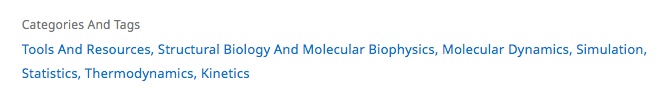

# Keywords

## What are keywords?

Keywords are scientific terms that allow articles to be searchable on the journal's website and through online search engines, such as PMC and Google Scholar. These also provide an accurate representation of what the study was about. Despite being such a small part of the submission, keywords can have a big impact on the number of people who can find the article once published and as a result, the higher amount of citations.

## Examples of keywords

The words chosen should ideally be specific to the topic of the article, contain a mixture of words and phrases, and it is beneficial to include additional words that are not included in the title.  

Here is an example of keywords for the following article:

**Article title:** On the importance of statistics in molecular simulations for thermodynamics, kinetics and simulation box size

**Subject area:** Structural Biology And Molecular Biophysics

**Keywords:** Molecular Dynamics, Simulation, Statistics, Thermodynamics, Kinetics

Keywords are not visible in the PDF but are included within the XML. These are present at the bottom of the article's webpage, alongside the research category. 



## What needs to be checked?

Keywords are decided by the authors and entered into eJP during the submission process. 

Please check these are: 

* In sentence case only, with the exception of proper nouns
* In italics if appropriate \(e.g. _E. coli_\)
* A maximum of 6 words 

## Research organisms

### List of allowed Research organism

Note that those captured in italics below, should _always_ be in italics in the article as well.

* _A. thaliana_
* _B. subtilis_
* _C. elegans_
* _C. intestinalis_
* Chicken
* _Chlamydomonas reinhardtii_
* _Daphnia_
* _Dictyostelium_
* _D. melanogaster_
* _E. coli_
* Human
* Maize
* Mouse
* _M. thermophila_
* _Neurospora_
* _N. crassa_
* _O. fasciatus_
* _P. cynocephalus_
* _P. dumerilii_
* _P. falciparum_
* _Planarian_
* Rat
* _S. cerevisiae_
* _S. enterica serovar Typhi_
* _S. pombe_
* _S. pyogenes_
* Rhesus macaque
* Viruses
* _Xenopus_
* Zebrafish
* Other
* None

## Schematron checks

### Content checks

**test-auth-kwd-group-presence-2**

**Error**: _XXXXXX articles must not have any author keywords_

**Action**: This will fire if a Correction or Retraction notice contains author keywords. They should be deleted in Kriya.

**test-ro-kwd-group-presence-2**

**Warning**: _XXXXXX does not contain a Research Organism keyword group. Is this correct?_

**Action**: This will fire if any one of the following article types does not contain a research organism keyword - Research Article, Research Advance, Replication Study, Research Communication. Even in the case where no research organisms were used in a work a keyword containing 'None' should be added. Check in eJP if one has been selected \(Exeter should check the output from eJP\). If not, then add 'None' as a keyword and add the following author query:

* Please confirm whether any research organisms were used for this work.

**kwd-group-title**

**Error**: _kwd-group title is XXXXXX, which is wrong. It should be 'Research organism'._

**Action**: The title for a keyword group containing research organisms \(`<kwd-group kwd-group-type="research-organism">`\) should be 'Research organism'. If this fires, it means something has gone awry in Kriya and will need to be correct by Exeter or Exeter's support team.

**kwd-upper-case**

**Error**: _research-organism kwd elements should start with an upper-case letter._

**Action**: Research organism keywords must start with an upper-case letter. If it is a misspelling of one of the set research organisms, then correct it. If it is not a misspelling or it is unclear which one should be used, then Exeter should check with eLife Production who should determine which of the [**set research organism**](keywords.md#list-of-allowed-research-organism) keywords should be used.

**kwd-child-test**

**Error**: _research-organism keywords cannot have child elements such as XXXXXX._

**Action**: This will fire if a research organism keyword has any child element which is not italic. This includes formatting such as bold, superscript etc., but also other XML elements. If the keyword contains un-allowed formatting, then remove it or re-key the keyword in Kriya. If it contains other elements, then Exeter will need to fix this.

**auth-kwd-check**

**Warning**: _Keyword - 'XXXXXX' - does not appear in the article text with this capitalisation. Should it be XXXXXX instead?_

**Action**: This will fire if an author keyword is not entirely in lower case, and does not appear in the article with that capitalisation. This may mean that the capitalisation for that keyword is incorrect \(that it should perhaps be made entirely lower case\). Search the word\(s\) in the article to see if it is used with different capitalisation, and if it is then update the keyword accordingly. If it doesn't appear in the article, then google it to determine whether it is a proper noun \(in which case the capitalisation can be left\) or not \(in which case it should still be made entirely lower case\).

**auth-kwd-check-2**

**Warning**: _Keyword contains what looks like a broken unicode - XXXXXX._

**Action**: This will fire for keywords containing broken unicode such as `&#x03B2;-cell regeneration`. Search the broken unicode text online followed by the word 'unicode' in order to find the correct symbol. In the example above, doing so reveals that the correct letter is Greek small letter Beta, so the keyword should be updated to `β-cell regeneration`.

**test-auth-kwd-group-presence-1**

**Error**: _One author keyword group must be present in article-meta._

**Action**: This will fire if more than 1 or no author keyword group element \(`<kwd-group kwd-group-type="author-keywords">`\) is present in any article which is not a correction or retraction notice. Check the article in eJP \(Exeter should check the eJP output\) to see if there are any keywords for that article. If there are, then they should be added in. If there are none, then the following author query should be added:

* Please provide keywords for use in PMC and other downstream services.

**non-ro-kwd-presence-test**

**Warning**: _kwd-group must contain at least one kwd_

**Action**: This will fire if there is an author keyword group which contains no actual keywords. Check the article in eJP \(Exeter should check the eJP output\) to see if there are any keywords for that article. If there are, then they should be added in. If there are none, then the following author query should be added:

* Please provide keywords for use in PMC and other downstream services.

**ro-kwd-presence-test**

**Warning**: _kwd-group must contain at least one kwd_

**Action**: This will fire if there is an author keyword group which contains no actual keywords. Check in eJP if one has been selected \(Exeter should check the output from eJP\). If not, then add 'None' as a keyword and add the following author query:

* Please confirm whether any research organisms were used for this work.

### XML structure checks

**test-ro-kwd-group-presence-1**

**Error**: _More than 1 Research organism keyword group is present in article-meta. This is incorrect._

**Action**: This will fire if more than one `<kwd-group kwd-group-type="research-organism">` element is present as a child of `<article-meta>`. If this fires, it means something has gone awry in Kriya and Exeter will need to correct it.

**kwd-group-type**

**Error**: _kwd-group must have a @kwd-group-type 'research-organism', or 'author-keywords'._

**Action**: This will fire if a `<kwd-group>` element does not have a `kwd-group-type` attribute with the value 'research-organism', or 'author-keywords'. If this fires it means something has gone awry in Kriya and Exeter will need to fix it.

## XML structure

```markup
<kwd-group kwd-group-type="author-keywords">
<kwd>decision-making</kwd>
<kwd>network model</kwd>
<kwd>NMDA receptor</kwd>
<kwd>schizophrenia</kwd>
<kwd>ketamine</kwd>
</kwd-group>
```

## Changes


