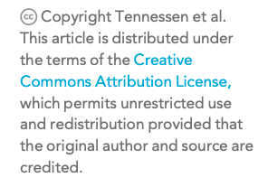
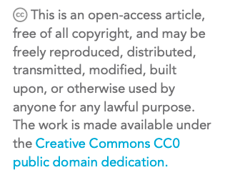
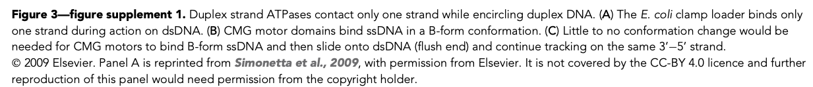
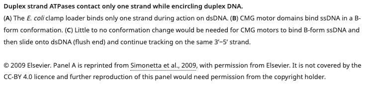

# Licensing and copyright

## Article-level licensing

All eLife's articles are published under a [**CC BY 4.0**](https://creativecommons.org/licenses/by/4.0/) or [**CC0**](https://creativecommons.org/share-your-work/public-domain/cc0/) license, which by default applies to the whole article including all assets. The CC BY 4.0 license permits content to be freely shared and adapted by others, as long as the original work is credited, while the CC0 license places the content in the public domain so it can be used freely with no restrictions. The license of the article will be captured in the underlying XML \(see [**here**](licensing-and-copyright.md#article-level-license-cc-by-4-0) ****and ****[**here**](licensing-and-copyright.md#article-level-license-cc-0)\). A different copyright statement will be present for CC BY content compared to CC0 content in the article PDF.





## Asset-level licensing

As above, all eLife's article assets are published under a CC BY 4.0 or CC0 license, following the license of the article itself. Where assets are adapted or reproduced from previously published content, they may need to be exempted from the article-level license, with the details included in the underlying XML. This is most common for figures, however may also apply to other assets.





## Figure adaptations and reproductions

### Redrawn figures

Figures and figure supplements \(in part or in whole\) may be redrawn or 'adapted' from previously published content. This usually means that the authors are not reproducing anything directly but are instead redrawing a figure or simply using the same data to create new content. However, as this term is used inconsistently by authors, eLife needs to determine whether the figure is an adaptation/redrawing or a reproduction, either by comparing the image to the original if possible, or by asking the authors to confirm this. If the figure is a clear adaptation or redrawing, and as long as the authors provide a suitable citation and state clearly, for example, that “Panel A in Figure 2 has been adapted from Smith and Jones, 2015”, no further action is required.

### Reproduced figures

If a figure has been reproduced, or if the legend for a figure or figure supplement states that the image is ‘reprinted from’, ‘reproduced from’ \(or anything similar\), we may need to add licensing information for the reproduced elements. This will usually apply to panels within figures instead of whole figures.

The editorial team check figure permissions as part of submission quality checks. They will leave a note for Exeter if permissions information needs to be added to the XML. The production team is the backstop in this process and may need to veto previous decisions or double-check the communication and decision-making process.


Note: if multiple panels have been reproduced and require permissions information to be added, these should not be merged into a single permissions tag. Each panel should have a separate permissions tag.


#### Reproductions from CC BY-licensed content

All eLife's articles are published under a [**CC BY 4.0**](https://creativecommons.org/licenses/by/4.0/) or [**CC0**](https://creativecommons.org/share-your-work/public-domain/cc0/) license. The CC BY 4.0 license allows content to be freely shared and adapted by others, as long as the original work is credited, while the CC0 license places the content in the public domain so it can be used freely with no restrictions. 

If an article has reproduced figures from content that was previously published under a [**CC BY**](https://creativecommons.org/licenses/) \(2, 3 or 4\), that content must be properly attributed and credited \(provide full citation details and license\). We may also need to add extra tagging. Check the license of the article \(you can find this from the [**permissions-info**](licensing-and-copyright.md#permissions-info) message\) and the license of the previously published content. 

* If the license of the previously published content matches the license of the article, no additional tagging needs to be added.
* If the article license is CC BY but the reproduced image is CC0, no additional tagging needs to be added.
* If the article license is CC0 but the reproduced figure is CC BY, this needs to be indicated in the underlying XML as the authors/creators/publishers still retain copyright of the original figure. For example:

```markup
<permissions>
    <copyright-statement>© Brand, 2018.</copyright-statement>
    <copyright-year>2018</copyright-year>
    <copyright-holder>Françoise Brand </copyright-holder>
    <license>
        <ali:license_ref>http://creativecommons.org/licenses/by/4.0/
        </ali:license_ref> 
        <license-p>Image courtesy of Françoise Brand, Swiss Tropical 
        and Public Health Institute and University of Basel. Published under 
        a <ext-link ext-link-type="uri" xlink:href="http://creativecommons.org/
        licenses/by/4.0/">CC BY 4.0 license.</ext-link>
        </license-p>
    </license>
</permissions>
```

If the reproduced image is CC BY-SA, CC BY-NC or CC BY-SA, this also needs to be indicated in the underlying XML as these licenses are not as permissive as CC BY or CC0. For example, in 52371, the following text was present in a caption:

> Photo credit: Marine snail \(Original photo by Katja Schulz, courtesy of Wikipedia, Creative Commons Attribution: Creative Commons, Attribution 2.0 Generic license\); Chambered nautilus \(Original photo by Profbergert, courtesy of Wikipedia, Creative Commons Attribution-Share Alike 3.0 Unported license\)

No tagging needed to be added for the marine snail image as this was published under a CC BY 2.0 license. However, the chambered nautilus image needed additional tagging as this was published under a CC BY-SA license. The authors were asked for the copyright year and the following tagging was added:

```markup
<permissions>
    <copyright-statement>© Berger, 2007</copyright-statement>
    <copyright-year>2007</copyright-year>
     <copyright-holder>Lee Berger</copyright-holder>
     <license>
        <ali:license_ref>https://creativecommons.org/licenses/by-sa/3.0/
        </ali:license_ref>
        <license-p>Chambered nautilus image courtesy of Lee Berger. Published 
        under a <ext-link ext-link-type=“uri” 
        xlink:href=“https://creativecommons.org/licenses/by-sa/3.0/”>CC BY SA 3.0 
        unported license.</ext-link>
        </license-p>
     </license>
</permissions>
```

#### Reproductions from non-CC BY-licensed content

If authors chose to exactly reproduce a figure or panel from a previously published, non-CC BY 2, 3, or 4 media in part or in whole, it will need to be published under a separate license. This is because the original content will have been published under a license that is less permissive. For eLife to reproduce the content, it must be made clear that the license holder has given permission for the material to be reprinted, and that it is not covered by the CC BY or CC0 license that applies to the rest of the eLife article. The authors will need to confirm they have permission from the license holders to reproduce the material and state what has been reproduced in the legend. A permissions statement will also need to be added in the XML with the license details for the reproduced material. The permissions text may have been provided already as part of a legend. If so, it should be moved into the permissions tagging.

The editorial team may have left a note for Exeter if permissions information needs to be added to the XML, for example:

> FAO Exeter: Figure Permissions
>
> copyright-year: 2009  
> copyright-holder: Elsevier  
> permissions: Figure 1A is reprinted from Simonetta, et al, 2009, with permission from Elsevier. It is not covered by the CC-BY 4.0 licence and further reproduction of this panel would need permission from the copyright holder.

This information should be added in the XML, for example:

| Sticky note field | Content | XML tag |
| :--- | :--- | :--- |
| copyright-year | 2009 | `<copyright-year>2009</copyright-year>` |
| copyright-holder | Elsevier | `<copyright-holder>Elsevier</copyright-holder>` |
| permissions | Figure 1A is reprinted from Simonetta, et al, 2009, with permission from Elsevier. It is not covered by the CC-BY 4.0 licence and further reproduction of this panel would need permission from the copyright holder | `<license-p> Figure 1A is reprinted from <xref ref-type="bibr"rid="bib40">Simonetta et al., 2009</xref>, with permission from Elsevier. It is not covered by the CC-BY 4.0 licence and further reproduction of this panel would need permission from the copyright holder. </license-p>` |
|  | \`\` | `<copyright-statement>© 2009 Elsevier</copyright-statement>` |


The copyright-statement field will not be provided in the sticky note but the XML tag can be populated from the copyright year and copyright holder. It should contain a '©' symbol followed by the copyright year and copyright holder. 


```markup
<permissions>
    <copyright-statement>© 2009 Elsevier</copyright-statement>
    <copyright-year>2009</copyright-year>
    <copyright-holder>Elsevier</copyright-holder>
    <license>
        <license-p>
        Figure 1A is reprinted from
        <xref ref-type="bibr" rid="bib40">Simonetta et al., 2009</xref>, with
        permission from Elsevier. It is not covered by the CC-BY 4.0 licence 
        and further reproduction of this panel would need permission from the 
        copyright holder.
        </license-p>
    </license>
</permissions>
```

If the note from editorial says a figure does not require permissions, these should still be checked. If it is not possible to check \(because the content is behind access controls, for example\), discuss this case with the Production team. However, where possible, figure permissions should be double-checked regardless of what the note says.

## Schematron checks

### Content checks

These checks relate to the content of figures and figure supplements. X or XXXXXX refers to quoted text which will change depending on the article.

#### permissions-info

**Info**: _This article is licensed under a XXXXXX license. XXXXXX_

**Action**: This information message will appear for every article to denote which license the article will be published under. eLife's articles are either published under CC BY 4.0 or CC0 licenses. This message can be useful for determining what additional XML tagging needs to be added for content reproduced from CC BY-licensed content \(see [**here**](licensing-and-copyright.md#reproductions-from-cc-by-licensed-content)\).

#### permissions-notification

**Info**: _XXXXXX has permissions - 'XXXXXX'._

**Action**: This information message will appear for any asset that has permissions information added. No action is required. 

#### permissions-test-1

**Error**: _permissions must contain copyright-statement._

**Action**: This error will fire if the permissions wrapper for an article does not have a copyright-statement element. The copyright statement is made up of the copyright symbol © followed by the copyright year, and the copyright holder. Exeter will need to add this, for example:`<copyright-statement>© 2019, Smith et al</copyright-statement>`

This will not fire for CC0 articles as these do not have copyright statements. See an example of XML for the article-level license of a CC-BY article [**here**](licensing-and-copyright.md#article-level-license-cc-by-4-0) or a CC0 article [**here**](licensing-and-copyright.md#article-level-license-cc-0).  

#### permissions-test-2

**Error**: _permissions must contain copyright-year in the format 0000. Currently it is XXXXXX_

**Action**: This error will fire if the copyright year of an article is entered in a format other than numerical e.g. 'two thousand and twenty' instead of '2020'. Exeter will need to correct this. This will not fire for CC0 articles. See an example of XML for the article-level license of a CC-BY article [**here**](licensing-and-copyright.md#article-level-license-cc-by-4-0) or a CC0 article [**here**](licensing-and-copyright.md#article-level-license-cc-0).  

#### permissions-test-3

**Error**: _permissions must contain copyright-holder._

**Action**: This error will fire if there is no copyright holder for an article \(does not apply to CC0 articles\). Exeter will need to correct this. The copyright holder should be entered as the surname of the first author followed by 'et al' \(e.g. Smith et al\). If there is only one author, the 'et al' is not required \(e.g. Smith\). If there are only two authors, the surnames of both authors should be entered with no 'et al' \(e.g. Smith and Jones\). See an example of XML for the article-level license of a CC-BY article [**here**](licensing-and-copyright.md#article-level-license-cc-by-4-0) or a CC0 article [**here**](licensing-and-copyright.md#article-level-license-cc-0).  

#### permissions-test-4

**Error**: _permissions must contain an ali:free\_to\_read element._

**Action**: This error will fire if there is no ali:free\_to\_read element in the permissions wrapper for the article. This will need to be added by Exeter. See an example of XML for the article-level license of a CC-BY article [**here**](licensing-and-copyright.md#article-level-license-cc-by-4-0) or a CC0 article [**here**](licensing-and-copyright.md#article-level-license-cc-0).  

#### permissions-test-5

**Error**: _permissions must contain license._

**Action**: This error will fire if there is no &lt;license&gt; element in the permissions wrapper. This will need to be added by Exeter. The license element contains information about which CC license the article is published under. See an example of XML for the article-level license of a CC-BY article [**here**](licensing-and-copyright.md#article-level-license-cc-by-4-0) or a CC0 article [**here**](licensing-and-copyright.md#article-level-license-cc-0).  

#### permissions-test-6

**Error**: _copyright-year must match the contents of the year in the pub-date\[@publication-format='electronic'\]\[@date-type='publication'\]. Currently, copyright-year=XXXXXX and pub-date=XXXXXX._

**Action**: This error will fire if the copyright year for the article does not match the published date of the article \(for example, if an article was published in 2020 but the copyright year is 2019\). This will need to be corrected by Exeter. This will not apply to CC0 articles as the permissions will not not contain a copyright year element.. See an example of XML for the article-level license of a CC-BY article [**here**](licensing-and-copyright.md#article-level-license-cc-by-4-0) or a CC0 article [**here**](licensing-and-copyright.md#article-level-license-cc-0).  

#### permissions-test-7

**Error**: _copyright-holder is incorrect. If the article has one author then it should be their surname. If it has two authors it should be the surname of the first, then ' and ' and then the surname of the second. If three or more, it should be the surname of the first, and then ' et al'. Currently it's XXXXXX_

**Action**: This error will fire if the copyright holder for the article is incorrect. The copyright holder should entered as the surname of the first author followed by 'et al' \(e.g. Smith et al\). If there is only one author, the 'et al' is not required \(e.g. Smith\). If there are only two authors, the surnames of both authors should be entered with no 'et al' \(e.g. Smith and Jones\). This will need to be corrected by Exeter. See an example of XML for the article-level license of a CC-BY article [**here**](licensing-and-copyright.md#article-level-license-cc-by-4-0) or a CC0 article [**here**](licensing-and-copyright.md#article-level-license-cc-0).

#### permissions-test-8

**Error**: _copyright-statement must contain a concatenation of '© ', copyright-year, and copyright-holder. Currently it is XXXXXX when according to the other values it should be XXXXXX_

**Action**: This error will fire if the copyright statement for the article is incorrect. The copyright statement must be made up of the copyright symbol © followed by the correct copyright year, and the correct copyright holder \(e.g. © 2019, Smith et al\). This test checks whether the contents of the copyright statement match the values indicated in the copyright year and copyright holder fields. If any of these are incorrect, they will need to be fixed by Exeter. 

#### permissions-test-9

**Error**: _license does not have an @xlink:href which is equal to '_[http://creativecommons.org/publicdomain/zero/1.0/](http://creativecommons.org/publicdomain/zero/1.0/)_' or '_[http://creativecommons.org/licenses/by/4.0/](http://creativecommons.org/licenses/by/4.0/)_'._

**Action**: This error will fire if the license element for the article has a link other than _'_[http://creativecommons.org/publicdomain/zero/1.0/](http://creativecommons.org/publicdomain/zero/1.0/)_'_ or _'_[http://creativecommons.org/licenses/by/4.0/](http://creativecommons.org/licenses/by/4.0/)_'._ This will need to be corrected by Exeter. 

#### license-test-1

**Error**: _license must contain ali:license\_ref._

**Action**: This error will fire if there is no ali:license\_ref element in the license element for the article. This element includes an appropriate creative commons link depending on which license the article will be published under. Exeter will need to add this. See an example of XML for the article-level license of a CC-BY article [**here**](licensing-and-copyright.md#article-level-license-cc-by-4-0) or a CC0 article [**here**](licensing-and-copyright.md#article-level-license-cc-0).  

#### license-test-2

**Error**: _license must contain one and only one license-p._

**Action**: This error will fire if the license for the article contains none or more than one license-p element. The license-p element includes a copyright statement, for example:

> This article is distributed under the terms of the [**Creative Commons Attribution License**](http://creativecommons.org/licenses/by/4.0), which permits unrestricted use and redistribution provided that the original author and source are credited.

See an example of XML for the article-level license of a CC-BY article [**here**](licensing-and-copyright.md#article-level-license-cc-by-4-0) or a CC0 article [**here**](licensing-and-copyright.md#article-level-license-cc-0). Exeter will need to correct this and include a link to the appropriate creative commons link depending on which license the article will be published under.

#### reproduce-test-1

**Warning:** _The caption for XXXXXX contains the text 'reproduced from', but has no permissions. Is this correct?_

**Action**: This warning will appear if a figure or video caption includes the text 'reproduced from' but there is no permissions information tagged in the XML. If no notes have been left about permissions information to add, query the Production team who will discuss it with the Editorial team. See more about this [**here**](allowed-assets/figures.md#adapted-and-reproduced-images).

#### reproduce-test-2

**Warning:** _The caption for XXXXXX contains the text 'reproduced with permission', but has no permissions. Is this correct?_

**Action**: This warning will appear if a figure or video caption includes the text 'reproduced with permission' but there is no permissions information in the XML. If no notes have been left about permissions information to add, query the Production team who will discuss it with the Editorial team. See more about this [**here**](allowed-assets/figures.md#adapted-and-reproduced-images).

#### reproduce-test-3

**Warning:** _The caption for XXXXXX contains the text 'adapted from ...', but has no permissions. Is this correct?_

**Action**: This warning will appear if a figure or video caption includes the text 'adapted from' but there is no permissions information in the XML. If no notes have been left about permissions information, query the Production team who will discuss it with the Editorial team. See more about this [**here**](allowed-assets/figures.md#adapted-and-reproduced-images).

#### reproduce-test-4

**Warning:** _The caption for XXXXXX contains the text 'reprinted from', but has no permissions. Is this correct?_

**Action**: This warning will appear if a figure or video caption includes the text 'reprinted from' but there is no permissions information in the XML. If no notes have been left about permissions information to add, query the Production team who will discuss it with the Editorial team. See more about this [**here**](allowed-assets/figures.md#adapted-and-reproduced-images).

#### reproduce-test-5

**Warning:** _The caption for XXXXXX contains the text 'reprinted with permission', but has no permissions. Is this correct?_

**Action**: This warning will appear if a figure or video caption includes the text 'reprinted with permission' but there is no permissions information in the XML. If no notes have been left about permissions information, query the Production team who will discuss it with the Editorial team. See more about this [**here**](allowed-assets/figures.md#adapted-and-reproduced-images).

#### reproduce-test-6

**Warning:** _The caption for XXXXXX contains the text 'modified from', but has no permissions. Is this correct?_

**Action**: This warning will appear if a figure or video caption includes the text 'modified from' but there is no permissions information in the XML. If no notes have been left about permissions information, query the Production team who will discuss it with the Editorial team. See more about this [**here**](allowed-assets/figures.md#adapted-and-reproduced-images).

#### reproduce-test-7

**Warning:** _The caption for XXXXXX contains the text 'modified with', but has no permissions. Is this correct?_

**Action**: This warning will appear if a figure or video caption includes the text 'modified with_'_ but there is no permissions information in the XML. If no notes have been left about permissions information, query the Production team who will discuss it with the Editorial team. See more about this [**here**](allowed-assets/figures.md#adapted-and-reproduced-images).

#### reproduce-test-8

**Warning:** _The caption for XXXXXX contains the text 'used with permission', but has no permissions. Is this correct?_

**Action**: This warning will appear if a figure or video caption includes the text 'used with permission_'_ but there is no permissions information in the XML. If no notes have been left about permissions information, query the Production team who will discuss it with the Editorial team. See more about this [**here**](allowed-assets/figures.md#adapted-and-reproduced-images).

#### fig-permissions-test-1 

**Error:** _permissions for XXXXXX has a copyright-statement, but not a copyright-year or copyright-holder which is incorrect._

**Action**: This will appear if the permissions statement has a copyright statement but no copyright year or holder. These should be added - query the Production team if you don't know what these should be.

#### fig-permissions-test-2

**Error:** _permissions for XXXXXX has a copyright-year, but not a copyright-statement or copyright-holder which is incorrect._

**Action**: This will appear if the permissions statement has a copyright year but no copyright statement or holder. These should be added - query the Production team if you don't know what these should be.

#### fig-permissions-test-3

**Error:** _permissions for XXXXXX has a copyright-holder, but not a copyright-statement or copyright-year which is incorrect._

**Action**: This will appear if the permissions statement has a copyright holder but no copyright statement or year. These should be added - query the Production team if you don't know what these should be.

#### fig-permissions-test-4

**Error:** _permissions for XXXXXX must contain a license-p element._

**Action**: This will appear if the permissions statement doesn't have a `<license-p>` element. Exeter will need to add this.

#### fig-permissions-test-5

**Error:** _permissions for XXXXXX has XXXXXX &lt;copyright-statement&gt; elements, when there can only be 0 or 1._

**Action**: This will appear if a permissions statement has more than 1 &lt;copyright-statement&gt; element. If the contents of these elements are the same, delete the duplicates. If they are different, double-check what the correct statement should be by comparing with the instructions given by the Production team.

#### fig-permissions-test-6

**Error:** _permissions for XXXXXX has XXXXXX &lt;copyright-holder&gt; elements, when there can only be 0 or 1._

**Action**: This will appear if a permissions statement has more than 1 `<copyright-holder>` element. If the contents of these elements are the same, delete the duplicates. If they are different, double-check what the correct copyright holder should be by comparing with the instructions given by the Production team.

#### fig-permissions-test-7

**Error:** _permissions for XXXXXX has XXXXXX &lt;copyright-year&gt; elements, when there can only be 0 or 1._

**Action**: This will appear if a permissions statement has more than 1 `<copyright-year>` element. If the contents of these elements are the same, delete the duplicates. If they are different, double-check what the correct copyright year should be by comparing with the instructions given by the Production team.

#### fig-permissions-test-8

**Error:** _permissions for XXXXXX has XXXXXX &lt;license&gt; elements, when there can only be 0 or 1._ 

**Action**: This error will appear if a permissions statement has more than 1 `<license>` element. If the contents of these elements are the same, delete the duplicates. If they are different, double-check what the correct license should be by comparing with the instructions given by the Production team.

#### fig-permissions-test-9

**Error**: _permissions for XXXXXX has a &lt;license&gt; element, but not &lt;license-p&gt; element, which is incorrect._

**Action**: This error will appear if a permissions statement has a `<license>` element but no `<license-p>` element. Double-check the instructions given by the Production team to see what this should be. 

#### fig-permissions-test-10

**Error**: _permissions for XXXXXX has XXXXXX &lt;license-p&gt; elements, when there can only be 0 or 1._

**Action**: This error will appear if a permissions statement has more than 1 `<license-p>` element. If the contents of these elements are the same, delete the duplicates. If they are different, double-check what the correct `<license-p>` text should be by comparing with the instructions given by the Production team.

#### fig-permissions-test-11

**Error**: _figure level permissions must either have a &lt;copyright-statement&gt; or a  &lt;license&gt; element, but those for XXXXXX have neither._

**Action**: This error will appear if a permissions statement has no `<copyright-statement>` or `<license>` elements. Query the Production team if these were not provided in the permissions instructions. 

#### fig-permissions-test-12

**Warning**: _XXXXXX permissions - the &lt;license-p&gt; for all rights reserved type permissions should usually end with 'further reproduction of this panel/illustration/figure would need permission from the copyright holder.', but XXXXXX's doesn't. Is this correct? \(There is no '_[_https://creativecommons.org/_](https://creativecommons.org/)_' type link so presumed ARR.\)_

**Action**: If the copyright statement for a figure includes 'All rights reserved', the permissions statement should end with 'further reproduction of this panel/illustration/figure would need permission from the copyright holder' - you just need to add it in if this is missing. For example in 50403, the copyright statement includes 'All rights reserved' but the license-p does not have any information about further reproductions of the figure:

```markup
<permissions>
    <copyright-statement>© 2006 John Wiley and Sons. All Rights Reserved
    </copyright-statement>
    <copyright-year>2006</copyright-year>
    <copyright-holder>John Wiley and Sons</copyright-holder>
    <license>
        <license-p>
        Figure 5—figure supplement 1 modifed from
        <xref ref-type="bibr" rid="bib63">Schwarz et al. (2006)</xref>
        with permission. Original image modified from
        <xref ref-type="bibr" rid="bib65">Stämpfli and Hille (1976)</xref>.
        </license-p>
    </license>
</permissions>
```

The license-p element should be corrected to: 

```markup
<permissions>
    <copyright-statement>© 2006 John Wiley and Sons. All Rights Reserved
    </copyright-statement>
    <copyright-year>2006</copyright-year>
    <copyright-holder>John Wiley and Sons</copyright-holder>
    <license>
        <license-p>
        Figure 5—figure supplement 1 modifed from
        <xref ref-type="bibr" rid="bib63">Schwarz et al. (2006)</xref>
        with permission. Original image modified from
        <xref ref-type="bibr" rid="bib65">Stämpfli and Hille (1976)</xref>. 
        Further reproduction of this figure would need permission from the 
        copyright holder.
        </license-p>
    </license>
</permissions>
```

If there is no '[**https://creativecommons.org/**](https://creativecommons.org/)' type link in the license element and also none in a ali:license\_ref element \(because the image is not CC-BY\), the schematron will automatically assume the figure permission is 'All rights reserved' - query the Production team to check this is correct.

#### fig-permissions-test-13

**Warning**: _XXXXXX permissions - the &lt;license-p&gt; contains a CC link, but the license does not have an ali:licens\_ref element, which is very likely incorrect._

**Action**: This warning will fire if there is a '[**https://creativecommons.org/**](https://creativecommons.org/)**'** type link in the license element but there is no ali:license\_ref element. Exeter will need to add the ali:license\_ref element in. 

### XML structure checks

These checks relate to the XML structure of licensing tagging.

#### permissions-parent

**Error**: _permissions is not allowed as a child of XXXXXX_

**Action**: This error will fire if a permissions element is not wrapped under a parent asset such as a table, figure, video, box, or supplementary material. Check which asset the permissions element should be associated with and ask Exeter to correct this.  

#### test-permissions-presence

**Error**: _There must be one and only one permissions element in the article-meta. Currently there are XXXXXX_

**Action**: This error will fire if there are none or more than one permission elements under the article-meta. Every article should have article-level licensing including a permissions element in the front matter. If there are multiple, check which is correct by comparing against the copyright year, copyright holder and copyright statements \(and checking the license of the article\) and ask Exeter to correct this. See an example of XML for the article-level license of a CC-BY article [**here**](licensing-and-copyright.md#article-level-license-cc-by-4-0) or a CC0 article [**here**](licensing-and-copyright.md#article-level-license-cc-0).  

## XML structure

#### Article-level license \(CC BY 4.0\)

```markup
<article>
    <front>
      <permissions>
        <copyright-statement>© 2019, Smith et al</copyright-statement>
        <copyright-year>2019</copyright-year>
        <copyright-holder>Smith et al</copyright-holder>
        <ali:free_to_read/>
        <license xlink:href="http://creativecommons.org/licenses/by/4.0/">
          <ali:license_ref>http://creativecommons.org/licenses/by/4.0/
          </ali:license_ref>
          <license-p>This article is distributed under the terms of the <ext-link
          ext-link-type="uri" xlink:href="http://creativecommons.org/licenses/
          by/4.0/">Creative Commons Attribution License</ext-link>, which permits 
          unrestricted use and redistribution provided that the original author 
          and source are credited.</license-p>
        </license>
      </permissions>
    </front>
```

#### Article-level license \(CC0\)

```markup
<article>
    <front>
        <permissions>
        <ali:free_to_read/>
            <license xlink:href="http://creativecommons.org/publicdomain/zero/1.0/">
            <ali:license_ref>http://creativecommons.org/publicdomain/zero/1.0/
            </ali:license_ref>
            <license-p>
                This is an open-access article, free of all copyright, and may be
                freely reproduced, distributed, transmitted, modified, built upon,
                or otherwise used by anyone for any lawful purpose. The work is 
                made available under the <ext-link ext-link-type="uri"
                xlink:href="http://creativecommons.org/publicdomain/zero/1.0/">
                Creative Commons CC0 public domain dedication</ext-link>.
            </license-p>
            </license>
        </permissions>
    </front>
```

#### Asset-level license \(for a figure with non-CC BY permissions\):

```markup
<fig id="fig3s1" position="float" specific-use="child-fig">
    <label>Figure 3—figure supplement 1.</label>
    <caption>
        <title>Duplex strand ATPases contact only one strand while encircling 
        duplex DNA.</title>
        <p>(<bold>A</bold>) The<italic>E. coli</italic>clamp loader binds only
        one strand during action on dsDNA. (<bold>B</bold>) CMG motor domains
        bind ssDNA in a B-form conformation. (<bold>C</bold>) Little to no 
        conformation change would be needed for CMG motors to bind B-form ssDNA 
        and then slide onto
        dsDNA (flush end) and continue tracking on the same 3’−5’ strand.</p>
    </caption>
    <graphic mime-subtype="tiff" mimetype="image" xlink:href="elife-46515-fig3-
    figsupp1-v2.tif"/>
    <permissions>
        <copyright-statement>© 2009 Elsevier</copyright-statement>
        <copyright-year>2009</copyright-year>
        <copyright-holder>Elsevier</copyright-holder>
        <license>
            <license-p>
            Panel A is reprinted from <xref ref-type="bibr" rid="bib40">Simonetta
            et al., 2009</xref>, with permission from Elsevier. It is not covered
            by the CC-BY 4.0 licence and further reproduction of this panel would
            need permission from the copyright holder.
            </license-p>
        </license>
    </permissions>
</fig>
```

#### Asset-level license \(for a figure with CC BY permissions\)

```markup
<fig>
     <label>Figure 2.</label>
     <permissions>
       <copyright-statement>© Berger, 2007</copyright-statement>
       <copyright-year>2007</copyright-year>
       <copyright-holder>Lee Berger</copyright-holder>
       <license>
       <ali:license_ref>https://creativecommons.org/licenses/by-sa/3.0/
       </ali:license_ref>
         <license-p>Chambered nautilus image courtesy of Lee Berger. Published
          under a <ext-link ext-link-type="uri"
          xlink:href="https://creativecommons.org/licenses/by-sa/3.0/">CC BY 
          SA 3.0 unported license</ext-link>.</license-p>
       </license>
     </permissions>
</fig>
```

