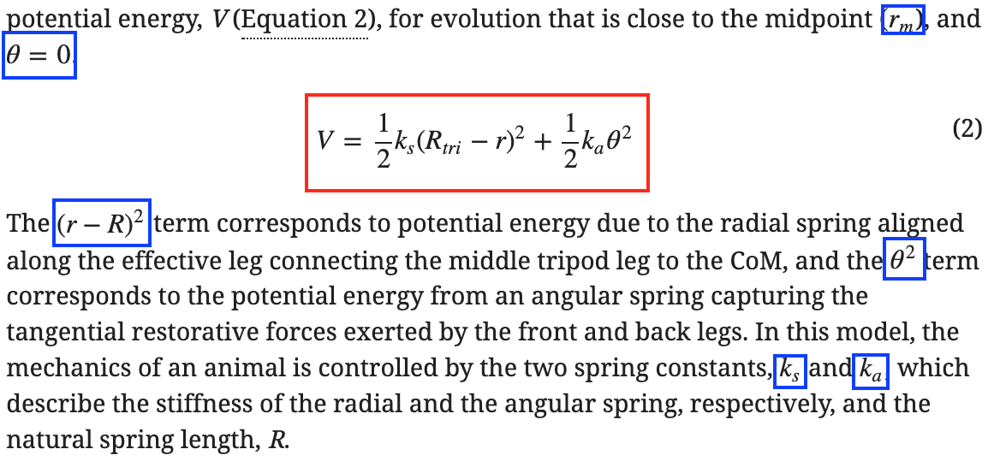
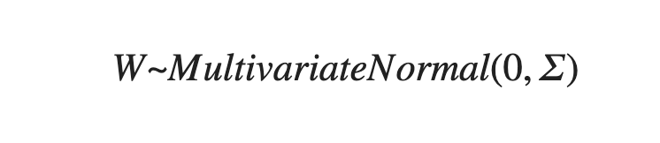
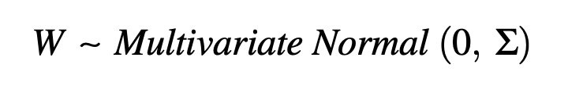
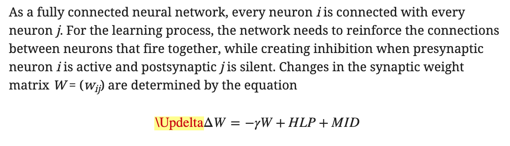
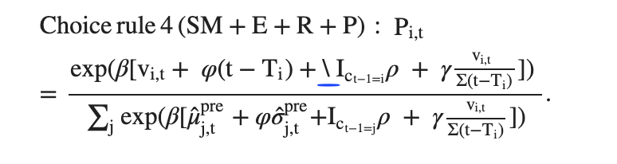
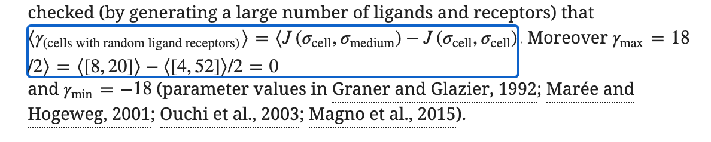
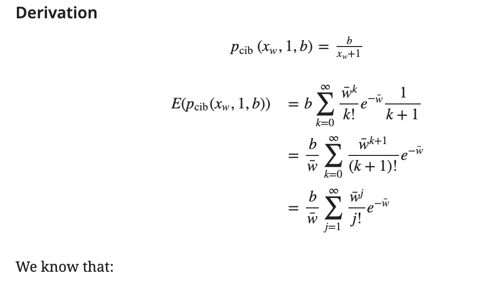

# Maths

Many eLife articles contain maths. It can be rendered inline \(inline with the text in a paragraph/list item/table cell or similar\) or as display equations \(equations which are given extra emphasis by being distinct from the text and, in some cases labelled and cited elsewhere in the text\). eLife captures math content either as plain text \(for simple maths\) or as [**MathML**](https://en.wikipedia.org/wiki/MathML) which is a mathematical markup language. Similarly, in their original files, authors can capture maths in varying ways - either as plain text, as MathML \(by using an equation editor in Word or similar word processors\), in [**LaTeX**](https://en.wikipedia.org/wiki/LaTeX), or in other ways \(see also [**What can equations contain**](maths.md#what-can-equations-contain)\).

The equation editor in Kriya uses LaTeX notation, which is then converted to MathML for inclusion in the XML.

## What needs to be checked?

* Equations include the same information as in the original manuscript.
* That there are no Schematron errors for equations.
* Font use is consistent in the text \(see [**maths as plain text**](maths.md#maths-as-plain-text)\).
* There are no unnecessary equations in the text for content which should be captured as plain text \(but err on the side of caution; see [**maths as plain text**](maths.md#maths-as-plain-text)\).
* The labels for display equations are consistent \(see [**display equation labelling**](maths.md#display-equation-labelling)\).
* Equations appear the same in the HTML and in the PDF.

## Where are equations allowed

Equations can be captured in two ways, inline or as a display equation. Inline equations can only appear inline within the text, so as part of a paragraph, list item, or table cell. Display equations look distinct from the text, and in rare cases can be captured directly under a section, but in many cases they are captured in the same way as inline equations, but simply rendered with more prominence than inline equations.

For example below, inline equations are marked in blue, and the display equation is marked in red:



## What can equations contain

Display equations can \(but don't have to\) have a label. Inline equations cannot have a label. They both must contain some math markup, MathML. 

Equations should not be provided as images. If an author manuscript contains maths captured as images, either Exeter need to typeset the maths themselves, or eLife production staff need to go back to authors and ask them to provide it in a machine readable format.

## Maths as plain text

Equations slow the load time of content in web pages, and may not appear in downstream locations. Therefore, certain maths content \(single operators \[+, –, ±\], numbers alone, some individual characters\) should be converted to plain text where possible. However, this should be done with caution, equations should not be changed to text at the expense of meaning. Equations appear in a different font \(Stix\) to plain text in the PDF. If a symbol is used in a display equation, and then referenced in a preceding or subsequent paragraph \(typically defining or expounding what that symbol represents\), the symbol in the paragraph should be tagged as an inline equation, so that the fonts match, and the reader can easily discern that it is the same symbol from the equation.

Here is an example of where changing equations to plain text is inappropriate:


For example, the first _i_ is present in the inline equation that precedes it, and therefore it needs to be captured as an equation to match the formatting/font, so that the reader can tell it is the same symbol.

### Pre-author

At content loading and/or pre-editing the following instances of maths should be changed to plain text:

* Superscript and Subscript for content which are not references to parts of a display formula. For example n$$^{2}$$ should be changed to n².
* Expressions captured partially in maths, for example x$$=10$$, should be changed to x=10.
* Symbols which are not referenced in a display equation, which do not need to be captured in maths - for example degree symbols \($$\degree$$ changed to °\).
* Just numbers only - for example $$123$$ changed to 123.

All other instances should be retained as equations, unless specified by eLife Production staff.

### Post-author

At post-author stages, any author feedback relating to equations should be addressed. In some cases the feedback may be in the form of 'this x does not have the same format as in equation 1', in which case the action should be to capture that content as an equation in order to keep the font consistent for that symbol.

### Equations in abstracts

Abstracts are sent to many downstream services, and some of these are not able to render maths if provided as MathML \(or LaTeX, or images\). Therefore, if it is possible to capture an equation in an abstract as plain text, then it should be done. 

For example, until recently PubMed were unable to render mathML in abstracts. As a result eLife currently replace any equation in an abstract with the text `[Formula: see text]` in the content that we send them.

## Display equation labelling

Display equation labels do not need to be distinct throughout the entire article, but they **do** need to be distinct within the main body, and within an appendix. This means that the label numbering can begin again in an appendix, i.e. there can be an equation with the label `(1)` in the main body, in Appendix 1, Appendix 2 and so on, but there cannot be more than one equation with the label `(1)` within the main body of an article, or within a single appendix.

Note that eLife permits different styles of labels, for example, \(1\), 1, 1a, 1b, A1, 1.1, A1.1 etc.

## Adding maths in Kriya

The equation editor in Kriya accepts LaTeX as its input. It also has examples of notation that can be used as a guide to help include the equation correctly.


As stated above, eLife capture maths in the XML as MathML, so this LaTeX is converted to MathML upon XML generation.

### A note on deleting equations in Kriya

When you need to delete an equation in Kriya, **do not** do so by opening the equation, deleting the content, and then saving the empty equation. Using this method will insert an empty equation into the document, which will flag a Schematron error.

Instead equation should be deleted by backspacing or deleting the equation as you would with normal text.

### A note on Kriya 1

There is an issue in Kriya 1.5 whereby if an equation which just contains 0 alone, it will not be rendered or included in the XML. In these cases, it will have to be captured as plain text instead, unless of course the 0 is incorrectly captured as a standalone equation, in which case it should be included as part of the larger equation that it belongs and the standalone equation deleted.

## Mathpix Snip

If you are unfamiliar with LaTeX notation, then you can use a tool such as [**Mathpix snip**](https://mathpix.com/) to screenshot a picture of the maths, it will then provide you with the latex notation. Note that this is free for up to 50 pictures a month.

## LaTeX cheatsheet

Below contains some simple LaTeX instructions which are standard and included in Kriya \(as well as most packages\). It is by no means an exhaustive list. Kriya's equation editor has instructions on how to capture certain markup that is helpful. 

### Subscript and superscript

`x_{subscript-here}` $$x_{subscript-here}$$

`x^{superscript-here}` $$x^{superscript-here}$$

`x^{superscript-here}_{subscript-here}`  $$x^{superscript-here}_{subscript-here}$$

`\overset{x}{y} = \underset{x}{y}`  $$\overset{x}{y} = \underset{x}{y}$$

`\overset{x}{\underset{z}{y}}` $$\overset{x}{\underset{y}{z}} $$

### Fractions

`\frac{numerator}{denominator}` $$\frac{numerator}{denominator}$$

### Roots

`\sqrt{2} = \sqrt[n]{3}` $$\sqrt{2} = \sqrt[n]{3}$$

### Greek

* `\alpha` $$\alpha$$
* `\beta` $$\beta$$
* `\gamma` $$\gamma$$
* `\Gamma` $$\Gamma$$
* `\delta` $$\delta$$
* `\Delta` $$\Delta$$
* `\epsilon` $$\epsilon$$
* `\varepsilon` $$\varepsilon$$
* `\zeta` $$\zeta$$
* `\eta` $$\eta$$
* `\theta` $$\theta$$
* `\Theta` $$\Theta$$
* `\vartheta` $$\vartheta$$
* `\iota` $$\iota$$
* `\kappa` $$\kappa$$
* `\lambda` $$\lambda$$
* `\Lambda` $$\Lambda$$
* `\mu` $$\mu$$
* `\nu` $$\nu$$
* `\xi` $$\xi$$
* `\Xi` $$\Xi$$
* `\pi` $$\pi$$
* `\Pi` $$\Pi$$
* `\varpi` $$\varpi$$
* `\rho` $$\rho$$
* `\varrho` $$\varrho$$
* `\sigma` $$\sigma$$
* `\Sigma` $$\Sigma$$
* `\varsigma` $$\varsigma$$
* `\tau` $$\tau$$
* `\upsilon` $$\upsilon$$
* `\Upsilon` $$\Upsilon$$
* `\phi` $$\phi$$
* `\Phi` $$\Phi$$
* `\varphi` $$\varphi$$
* `\chi` $$\chi$$
* `\psi` $$\psi$$
* `\Psi` $$\Psi$$
* `\omega` $$\omega$$
* `\Omega` $$\Omega$$

### Decorations and notation

`\overline{x+y}=\underline{x+y}` $$\overline{x+y}=\underline{x+y}$$

`\widehat{x+y} = \widetilde{x+y}` $$\widehat{x+y} = \widetilde{x+y}$$

`\overbrace{x+y}=\underbrace{x+y}` $$\overbrace{x+y}=\underbrace{x+y}$$

`\dot{x} + \ddot{y} + \ddddot{z} + \bar{\omega}` $$\dot{x}+\ddot{y}+\ddddot{z}+\bar{\omega}$$

`\overrightarrow{AB} \underleftarrow{AB} \underleftrightarrow{AB}`  

$$\overrightarrow{AB}\hspace{90pt} \underleftarrow{AB}\hspace{90pt} \underleftrightarrow{AB}$$

`\overbrace{x}^{y} = \underbrace{x}_{y}` $$\overbrace{x}^{y} = \underbrace{x}_{y}$$

`\sum{x} = \sum\limits_{x}{y} = \sum\limits_{i=0}^{n}{i}` $$\sum{x} = \sum\limits_{x}{y} = \sum\limits_{i=0}^{n}{i}$$

### Integrals

`\int{\rho}` $$\int{\rho}$$

`\int\limits_{^{x}{y}}^{z}{\Delta}` $$\int\limits_{^{x}{y}}^{z}{\Delta}$$

`\int_{x=1}^{n}{x}\;dx` $$\int_{x=1}^{n}{x}\;dx $$

`\oint{x}` $$\oint{x}$$

`\oint\limits_{\oint{x} }^{y}{z}` $$\oint\limits_{\oint{x} }^{y}{z}$$  

### Spacing

`here\, is\, some\, text` $$here\, is\, some\, text$$

`here\> is\> some\> text` $$here\> is\> some\> text$$

`here\; is\; some\; text` $$here\; is\; some\; text$$

`here\enspace is\enspace some\enspace text` $$here\enspace is\enspace some\enspace text$$

`here\quad is\quad some\quad text` $$here\quad is\quad some\quad text$$

`here\qquad is\qquad some\qquad text` $$here\qquad is\qquad some\qquad text$$

`here\hspace{15pt} is\hspace{30pt} sometext` $$here\hspace{15pt} is\hspace{30pt} sometext$$

`here\\ is\\ some\\[1 cm] text` $$here\\ is\\ some\\[1 cm] text$$

### Fonts

`text\; is\; italic\; by\; default\; 123`  $$text\; is\;italic\; by\; default\; 123$$

`\mathrm{roman\,text}\; and\; \text{text}` $$\mathrm{roman\,text}\; and\; \text{text}$$

`\mathrm{roman\,text\, \mathit{use\> mathit\> to\> escape\> parent\> formatting}\> roman\, text}` $$\mathrm{roman\,text\, \mathit{use\> mathit\> to\> escape\> parent\> formatting}\> roman\, text}$$

`\mathscr{ONLY\quad CAPITAL\quad LETTERS}` $$\mathscr{ONLY\quad CAPITAL\quad LETTERS}$$

`\mathbb{ONLY\quad CAPITAL\quad LETTERS}` $$\mathbb{ONLY\quad CAPITAL\quad LETTERS}$$

`\mathfrak{AaBbCcDdEe}` $$\mathfrak{AaBbCcDdEe}$$

`\mathcal{AaBbCcDdEe}` $$\mathcal{AaBbCcDdEe}$$

### Fences \(brackets\)

`() [] \Big[\Big] \{\} \langle \rangle \lfloor \rfloor \lceil \rceil | \|` 

$$\;()\hspace{5pt} []\hspace{20pt} \Big[\Big]\hspace{25pt} \{\}\hspace{15pt} \langle\hspace{30pt} \rangle\hspace{30pt} \lfloor\hspace{30pt} \rfloor\hspace{30pt} \lceil\hspace{25pt} \rceil\hspace{17pt} |\hspace{8pt} \|$$

### Sets

`\cup \cap \bigcup \bigcap \subset \subseteq \supset \supseteq \in \notin \forall \exists \neg \vee \wedge \vdash \models \setminus`

$$\cup\; \cap\; \bigcup\; \bigcap\; \subset\; \subseteq\; \supset \;\supseteq\; \in\; \notin\; \forall\; \exists\; \neg\; \vee\; \wedge\; \vdash\; \models\; \setminus$$

### Matrices and cases

`\begin{matrix} x_{1} & x^{2} \\ x_{3}^{4} & \gamma \end{matrix}`  $$\begin{matrix} x_{1} & x^{2} \\ x_{3}^{4} & \gamma \end{matrix}$$

`\begin{pmatrix} a & b \\ c & d \end{pmatrix}`  $$\begin{pmatrix} a & b \\ c & d \end{pmatrix}$$

`\begin{bmatrix} a & b \\ c & d \end{bmatrix}`  $$\begin{bmatrix} a & b \\ c & d \end{bmatrix}$$

`f_{n} = \begin{cases} a \qquad\qquad \text{if n = 0} \\ r \cdot f_{n-1} \hspace{14pt} \text{else} \end{cases}`

$$f_{n} = \begin{cases} a \qquad\qquad \text{if n = 0} \\ r \cdot f_{n-1} \hspace{14pt} \text{else} \end{cases}$$

### Alignment

`\begin{align*} \nabla \cdot \mathbb{A}\; = \alpha \\ \nabla \cdot \mathbb{B}\; = \beta \end{align*}`

$$\begin{align*} \nabla \cdot \mathbb{A}\; = \alpha \\ \nabla \cdot \mathbb{B}\; = \beta \end{align*}$$

### Symbols

`+  -  \pm \times \div \cdot \oplus \otimes \ne < > \le \ge \approx \infty`

$$+ \hspace{3pt} - \hspace{7pt} \pm\hspace{14pt} \times\hspace{14pt} \div\hspace{16pt} \cdot\hspace{18pt} \oplus\hspace{27pt} \otimes\hspace{14pt} \ne\hspace{4pt} <\hspace{2pt} >\hspace{5pt} \le\hspace{9pt} \ge\hspace{15pt} \approx\hspace{20pt} \infty$$

`\cong \neq \equiv \prec \succ \preceq \succeq \mp \vee \wedge \ll \gg` 

$$\hspace{10pt}\cong\hspace{15pt}\neq\hspace{15pt}\equiv\hspace{19pt}\prec\hspace{19pt}\succ\hspace{20pt}\preceq\hspace{25pt}\succeq\hspace{17.5pt}\mp\hspace{12pt}\vee\hspace{12pt}\wedge\hspace{12pt}\ll\hspace{10pt}\gg$$

## Equations on the eLife website

Equations are rendered on the eLife website using [**MathJax**](https://www.mathjax.org/). Note that there are certain space limitations on the eLife website for equations, if they are particularly long they may be wrapped across numerous lines in order to fit within the content container, and since they are an object which is separate from the normal text in the page, the wrapping may not correspond with the text \(see also [**inline-formula-length-test-1**](maths.md#inline-formula-length-test-1) ****and the example therein\).

eLife have an arrangement with Exeter whereby they are paid more for LaTeX articles, and expected to carefully check the maths against the original files at pre-editing. LaTeX articles also have an extended turn-around time \(compared with non-LaTeX articles\).

During pre-publication checks, special care should be given to equations by eLife production staff, to ensure that there is no discrepancy between the equations as they appear on Continuum and the equations as they appear in the PDF.

## Schematron checks

### Content checks

#### **inline-formula-test-2**

**Warning**: _There is no space between inline-formula and the preceding text - XXXXXX - Is this correct?_

**Action**: In almost all cases this warning fires, a space will need to be added before the inline equation. The only exception would be if both of the following two conditions are satisfied:

1.  A particular character or characters need to be captured as an inline equation so that the font matches how those characters appear elsewhere in the article \(see above\).
2. This character \(or characters\) should be placed directly after the preceding text without any space. 

Here is an example of a case where the warning could be ignored, taken from [**https://elifesciences.org/articles/56942.pdf**](https://elifesciences.org/articles/56942.pdf).


The underlined mathematical fraktur 'R' must be tagged as an inline equation to match the font used for that term used elsewhere.

If Exeter are unsure, they can query the eLife production team via slack for instruction.

#### **inline-formula-test-3**

**Warning**: _There is no space between inline-formula and the following text - XXXXXX - Is this correct?_

**Action**: In almost all cases this warning fires, a space will need to be added after the inline equation. The only exception would be if both of the following two conditions are satisfied:

1.  A particular character or characters need to be captured as an inline equation so that the font matches how those characters appear elsewhere in the article \(see above\).
2. This character \(or characters\) should be placed directly before the following text without any space. 

Here is an example of a case where the warning could be ignored taken from [**https://elifesciences.org/articles/56942.pdf**](https://elifesciences.org/articles/56942.pdf).


The underlined mathematical fraktur 'R' must be tagged as an inline equation to match the font used for that term used elsewhere..

If Exeter are unsure, they can query the eLife production team via slack for instruction.

#### **math-test-14**

**Warning**: _mml:math only contains numbers and/or operators - 'XXXXXX'. Is it necessary for this to be set as a formula, or can it be captured with as normal text instead?_

**Action**: This warning will fire at all stages if there is maths which only contains numbers and/or operators \(such as +, ±, ~, × etc.\). At pre-author stages, unless these symbols or numbers are used in an inline formula and referring to particular parts of a display formula, then they can be changed to plain text. At post-author stages, if the authors have deliberately added these as equations, then they should be left as equations.  Otherwise they can be changed to plain text.

#### **math-test-3**

**Error**: _mml:math only contains '±', which is unnecessary. Capture this as a normal text '±' instead._

**Action**: As the message suggests, the action here should be to delete the equation in Kriya, and add the '±' as plain text. In rare cases, where a single equation may have been split into multiple when processing the article, it may instead be appropriate to add this symbol \(and whatever else, as required\) to a single inline equation. If there are other equations with little or truncated content directly preceding or following this equation then check the source file to determine if this course of action is more appropriate.

#### **math-test-4**

**Error**: _mml:math only contains '±' followed by digits, which is unnecessary. Capture this as a normal text instead._

**Action**: As the message suggests, the action here should be to delete the equation in Kriya, and add the '±' and digits as plain text. In rare cases, where a single equation may have been split into multiple when processing the article, it may instead be appropriate to add this symbol \(and whatever else, as required\) to a single inline equation. If there are other equations with little or truncated content directly preceding or following this equation then check the source file to determine if this course of action is more appropriate.

#### **math-test-5**

**Error**: _mml:math only contains '×', which is unnecessary. Capture this as a normal text '×' instead._

**Action**: As the message suggests, the action here should be to delete the equation in Kriya, and add the '×' as plain text. In rare cases, where a single equation may have been split into multiple when processing the article, it may instead be appropriate to add this symbol \(and whatever else, as required\) to a single inline equation. If there are other equations with little or truncated content directly preceding or following this equation then check the source file to determine if this course of action is more appropriate.

#### **math-test-6**

**Error**: _mml:math only contains '~', which is unnecessary. Capture this as a normal text '~' instead._

**Action**: As the message suggests, the action here should be to delete the equation in Kriya, and add the '~' as plain text. In rare cases, where a single equation may have been split into multiple when processing the article, it may instead be appropriate to add this symbol \(and whatever else, as required\) to a single inline equation. If there are other equations with little or truncated content directly preceding or following this equation then check the source file to determine if this course of action is more appropriate.

#### **math-test-7**

**Error**: _mml:math only contains '~' and digits, which is unnecessary. Capture this as a normal text instead._

**Action**: As the message suggests, the action here should be to delete the equation in Kriya, and add the '~' and digits as plain text. In rare cases, where a single equation may have been split into multiple when processing the article, it may instead be appropriate to add this symbol \(and whatever else, as required\) to a single inline equation. If there are other equations with little or truncated content directly preceding or following this equation then check the source file to determine if this course of action is more appropriate.

#### **math-test-8**

**Warning**: _mml:math only contains 'μ', which is likely unnecessary. Should this be captured as a normal text 'μ' instead?_

**Action**: Typically in scientific articles this character is used to denote micro. However, it may also \(or instead\) be used as a constant or variable in an equation which represents a certain value. Depending on it's usage in an article, it may be appropriate to retain this as an equation or to delete it and instead capture the character as plain text. 

Check if the character has been used in a display equation elsewhere. If it has, and this is being used to denote that same variable, then it _must_ be left as an inline equation to retain consistent font throughout the article.

Typically, if this character has been used to communicate micro, such as in 'μm', or similar, then it can be converted to plain text however this is not _certainly_ the case. If in doubt, leave this character as an equation unless the authors specify otherwise during proofing.

#### **math-test-9**

**Error**: _mml:math only contains '%' and digits, which is unnecessary. Capture this as a normal text instead._

**Action**: As the message suggests, the action here should be to delete the equation in Kriya, and add the percentage symbol and numbers as plain text. In rare cases, where a single equation may have been split into multiple when processing the article, it may instead be appropriate to add this symbol \(and whatever else, as required\) to a single inline equation. If there are other equations with little or truncated content directly preceding or following this equation then check the source file to determine if this course of action is more appropriate.

#### **math-test-12**

**Error**: _mml:math only contains '%', which is unnecessary. Capture this as a normal text instead._

**Action**: As the message suggests, the action here should be to delete the equation in Kriya, and add the percentage symbol as plain text. In rare cases, where a single equation may have been split into multiple when processing the article, it may instead be appropriate to add this symbol \(and whatever else, as required\) to a single inline equation. If there are other equations with little or truncated content directly preceding or following this equation then check the source file to determine if this course of action is more appropriate.

#### **math-test-10**

**Error**: _mml:math only contains '°', which is likely unnecessary. This should be captured as a normal text '°' instead._

**Action**: As the message suggests, the action here should be to delete the inline equation in Kriya, and add the degree symbol as plain text.

#### **math-test-11**

**Warning**: _mml:math contains '○' \(the white circle symbol\). Should this be the degree symbol instead - '°', or '∘' \(the ring operator symbol\)?_

**Action**: Check the context in which this symbol is used. If it follows numbers and/or is used in the context of discussing temperature, rotation or angles, then replace the inline equation with a plain text degree symbol. If it is definitely supposed to be a white circle symbol, then check how it's been used elsewhere - if the character is present in a display equation, then it will need to remain as an inline equation to keep the font consistent. The aim here is to remove unnecessary math markup, but not to the detriment of keeping fonts/meaning consistent in the article.

#### **math-test-13**

**Warning**: _mml:math only contains 'XXXXXX', which is likely unnecessary. Should this be captured as normal text instead?_

**Action**: This warning will fire at all stages if there is maths which only contains numbers and/or operators \(such as +, ±, ~, × etc.\). At pre-author stages, unless these symbols or numbers are used in an inline formula and referring to particular parts of a display formula, then they can be changed to plain text. At post-author stages, if the authors have deliberately added these as equations, then they should be left as equations.  Otherwise they can be changed to plain text.

#### **math-test-15**

**Warning**: _mml:math seems to only contain the formula for a cation - 'XXXXXX' - which is likely unnecessary. Should this be captured as normal text instead?_

**Action**: This warning will fire at all stages if there is an equation which only contains a cation, such as $$Ca^{+2}$$.

At pre-author stages, unless these symbols or numbers are used in an inline formula and referring to particular parts of a display formula, then they can be changed to plain text. At post-author stages, if the authors have deliberately added these as equations, then they should be left as equations. Otherwise they can be changed to plain text.

A cation is a positively charged ion \(which would be attracted to the cathode in electrolysis\). It can be identified in the text as it will look like a chemical element followed by a superscript plus \(+\) sign and superscript or subscript numbers.

Here are some more examples of cations:

$$Al^{+3}\quad Ba^{+2}\quad Cs^{+}\quad K^{+}\quad Zn^{+2}$$

#### **math-test-16**

**Warning**: _mml:math seems to only contain the formula for an anion - 'XXXXXX' - which is likely unnecessary. Should this be captured as normal text instead?_

**Action**: This warning will fire at all stages if there is an equation which only contains an anion, such as $$CI^{-}$$.

At pre-author stages, unless the anion is used in an inline formula and referring in the text to particular parts of a display formula, then they can be changed to plain text. At post-author stages, if the authors have deliberately added these as equations, then they should be left as equations. Otherwise they can be changed to plain text.

An anion is a negatively charged ion \(which would be attracted to the anode in electrolysis\). It can be identified in the text as it will look like a chemical element followed by a superscript minus \(-\) sign and superscript or subscript numbers.

Here are some more examples of anions:

$$Br^{-}\quad F^{-}\quad N^{3-}\quad O^{2-}\quad S^{-}$$

#### **math-test-17**

**Warning**: _mml:math only contains number\(s\) and square root symbol\(s\) 'XXXXXX', which is likely unnecessary. Should this be captured as normal text instead? Such as XXXXXX?_

**Action**: This warning will fire if a equation contains only numbers accompanied by a square root symbol. It's likely that it can be replaced with plain text '√' and the numbers, but check how this and similar content has been captured elsewhere in the article and ensure that it's consistent.

#### **math-test-18**

**Warning**: _abstract contains MathML \(XXXXXX\). Is this necessary? MathML in abstracts may not render downstream, so if it can be represented using normal text/unicode, then please do so instead._

**Action**: This will fire for any equation in an abstract. If the equation can be represented with plain text alternatives, then it should be changed to that. If it cannot, then the message can be ignored.

#### **math-test-19**

**Warning**: _Maths containing 'XXXXXX' has what looks like words or terms which need separating with a space. With it's current markup the space will not be preserved on the eLife website. Please add in the space\(s\) using the latext '\;' in the appropriate place\(s\), so that the space is preserved in the HTML._

**Action**: This warning will fire for equations that contain words or letters which may be missing the required spacing in the MathML \(in the XML\) in order for the spacing to render on our site. Check the rest of the article or the source manuscript to determine whether authors intended the word\(s\)/term\(s\) to include a space or not.

Here is a published example to illustrate case where intervention would be needed. 

\*\*\*\*[**https://elifesciences.org/articles/47602\#equ7**](https://elifesciences.org/articles/47602#equ7)\*\*\*\*



Here, you can see that on the eLife website, there is no space between 'Multivariate' and 'Normal'. Whereas if you check [**the PDF**](https://elifesciences.org/articles/47602.pdf) you can see that the authors intended for there to be space in between those words:



To fix this open up the equation editor in Kriya and replace any spaces used with `\;` so that the space is retained in the XML/on the website \(see also [**Spacing**](maths.md#spacing) above\).

#### **pre-mathcolor-test-1**

**Warning**: _math \(XXXXXX element\) containing 'XXXXXX' has a colour style which is not red, blue or purple - 'XXXXXX' - which is not allowed. If it is clear that colours are supposed to be used, but you are not sure which ones, then please query the authors - 'eLife only supports the following colours for text and maths - 'red', 'blue' and 'purple'. Please confirm how you would like the colour\(s\) here captured given this information.'._

**Action**: The only colours eLife permit for text is red, blue or purple and this is still the case for maths. As the message suggests, this will fire at pre-author stages when maths contains a colour which is not permitted. Exeter should add the following author query:

* eLife only supports the following colours for text and maths - 'red', 'blue' and 'purple'. Please confirm how you would like the colour\(s\) here captured given this information.

#### **final-mathcolor-test-1**

**Error**: _math \(XXXXXX element\) containing 'XXXXXX' has a color style which is not red, blue or purple - 'XXXXXX' - which is not allowed. Only 'red', 'blue' and 'purple' are allowed._

**Action**: The only colours eLife permit for text is red, blue or purple and this is still the case for maths. As the message suggests, this will fire at post-author stages when maths contains a colour which is not permitted. Exeter should check the response the authors had to the query which was \(hopefully\) added before they proofed. If the authors suggest a suitable solution \(such as removing the colours, adding different forms of emphasis such as bold, or by asking for the colours to be changed to the permitted ones\), then Exeter can implement their suggestion. If the query was missed or if the authors did not provide a suitable solution, then Exeter should add a note to the article for the attention of the Production team at Publisher Review. The Production team can then determine the correct course of action, which likely will be to go back to the authors and clarify their options.

#### **mathcolor-test-2**

**Warning**: _math \(XXXXXX element\) containing 'XXXXXX' has XXXXXX colour formatting. Is this OK?_

**Action**: This warning will fire at all stages when maths is formatted with one of the permitted colours for text \(red, blue or purple\). At pre-author stages, Exeter should add the following author query:

* Where possible, we prefer that colours are not used in text in the interests of accessibility and because they will not display in downstream HTML \(for example in PMC\). Would it be possible to capture the same meaning in this equation with more common forms of emphasis \(such as bold, italic or underline\)? If so please stipulate below how the equation should be revised. Please note that this is a suggestion and these permitted colours can be published if required.

At post-author stages, this warning can be ignored.

#### **pre-mathbackground-test-1**

**Warning**: _math \(XXXXXX element\) containing 'XXXXXX' has 'XXXXXX' colour background formatting. This likely means that there's a mistake in the content which will not render correctly online. Please check this carefully against the original manuscript. If it's not a mistake, and the background colour is deliberate, then please add the following author query -&gt; 'Where possible, we prefer that colours are not used in text in the interests of accessibility and because they will not display in downstream HTML \(for example in PMC\). eLife does not support background colours for text, however we do support the following colours for text itself - 'red', 'blue' and 'purple'. Please confirm how you would like the colour\(s\) captured here given this information, and note that our preference would be to use more common forms of emphasis \(such as bold, italic or underline\) if possible to still convey the same meaning.'._

**Action**: This warning will fire at pre-author stages for maths in the text, which has background colour formatting \(similar to highlighting\). eLife does not permit this for text, and only permit certain colours for text \(red, blue, or purple\). Exeter should check that this isn't a processing error by confirming the colours were in the original manuscript exported from eJP, and if it isn't a processing error, then they should add the following author query:

* Where possible, we prefer that colours are not used in text in the interests of accessibility and because they will not display in downstream HTML \(for example in PMC\). eLife does not support background colours for text, however we do support the following colours for text itself - 'red', 'blue' and 'purple'. Please confirm how you would like the colour\(s\) captured here given this information, and note that our preference would be to use more common forms of emphasis \(such as bold, italic or underline\) if possible to still convey the same meaning.'

#### **pre-mathbackground-test-2**

**Warning**: _math \(XXXXXX element\) containing 'XXXXXX' has 'XXXXXX' colour background formatting. This likely means that there's a mistake in the content which will not render correctly online. Please check this carefully against the original manuscript. If it's not a mistake, and the background colour is deliberate, then please ensure that the background colour is captured for the table cell \(rather than the maths\)._

**Action**: This warning will fire at pre-author stages for maths in a table, which has background colour formatting \(similar to highlighting\). eLife do not permit background colouring for text, and only permit certain colours for text itself \(red, blue, or purple\), and [**certain colours for table cells**](allowed-assets/tables.md#allowed-colours-in-tables). Exeter should check that this isn't a processing error by confirming the colours were in the original manuscript exported from eJP. If the colours were present for the table cell\(s\) in the original manuscript then that formatting should be removed from the equation and added to the cell; then the steps required for colours in tables cells should be followed, as directed by the Schematron messages after re-validating \(see also the [**Tables page**](allowed-assets/tables.md)\). If, in the original manuscript, there was background colour for the maths, then it should be changed as colour for the text of the maths. 

#### **final-mathbackground-test-1**

**Error**: _math \(XXXXXX element\) containing 'XXXXXX' has 'XXXXXX' colour background formatting. This likely means that there's a mistake in the content which will not render correctly online. If it's not a mistake, and the background colour is deliberate, then this will need to removed._

**Action**: This warning will fire at post-author stages for maths in the text, which has background colour formatting \(similar to highlighting\). eLife do not permit this for text, and only permit certain colours for text \(red, blue, or purple\). Exeter should check that this isn't a processing error by confirming the colours were in the original manuscript exported from eJP, and if it isn't a processing error, then they should check the response from an author if an author query was added relating to this at pre-editing. If there was no author query, they should flag it to the eLife Production staff, who at Pub Review stage should contact the authors, letting them know about the constraints and asking them how they would like to proceed.

#### **final-mathbackground-test-2**

**Error**: _math \(XXXXXX element\) containing 'XXXXXX' has 'XXXXXX' colour background formatting. This likely means that there's a mistake in the content which will not render correctly online. If it's not a mistake, and the background colour is deliberate, then either the background colour will need to added to the table cell \(rather than the maths\), or it needs to be removed._

**Action**: This warning will fire at post-author stages for maths in a table, which has background colour formatting \(similar to highlighting\). eLife do not permit background colouring for text, and only permit certain colours for text itself \(red, blue, or purple\), and [**certain colours for table cells**](allowed-assets/tables.md#allowed-colours-in-tables). Exeter should check that this isn't a processing error by confirming the colours were in the original manuscript exported from eJP. If the colours were present for the table cell\(s\) in the original manuscript then that formatting should be removed from the equation and added to the cell; then the steps required for colours in tables cells should be followed, as directed by the Schematron messages after re-validating \(see also the [**Tables page**](allowed-assets/tables.md)\). If, in the original manuscript, there was background colour for the maths, then it should be changed as colour for the text of the maths. 

#### **mtext-test-1**

**Warning**: _math \(XXXXXX element\) contains 'XXXXXX' which looks suspiciously like LaTeX markup. Is it correct? Or is there missing content or content which has been processed incompletely?_

**Action**: This warning will fire in cases where an equation contains what may be LaTeX markup, meaning that the maths may not be processed correctly. Check against the original manuscript to determine what the equation is supposed to look like, and compare. It may be the case that the equation appears OK in Kriya and in the PDF, but it may still be incorrect on the eLife website. In most cases, this warning should not be ignored. Only in cases where the authors have used rather strange notation or a backslash should this be ignored. It will fire for text content in an equation containing a backslash \(`\`\). Here is an example of when it needs to be fixed:



Taken from [**https://elifesciences.org/articles/51207**](https://elifesciences.org/articles/51207). In this case, when comparing against the original manuscript, it's clear that `\Updelta` simply needs to be removed. But in other cases the LaTeX notation that the authors used may not be supported, and alternative LaTeX notation should be used to render the desired character\(s\). Tools such as Mathpix snip may be useful here since they will use relatively standard LaTeX notation \(where possible\), or you can use the help in the equation editor in Kriya or use the [**cheatsheet**](maths.md#latex-cheatsheet) above.

\*\*\*\*[**Here**](https://elifesciences.org/articles/51260#equ13) is an example of where it can be ignored \(because there is a backslash in the equation\):



#### **inline-formula-length-test-1**

**Warning**: _Inline formula containing 'XXXXXX' is particularly long. Consider either splitting this up into multiple equations or capturing this as a display equation, as the display on Continuum will likely be strange._

**Action**: This warning will fire at all stages for an inline formula which does not contain a table and is more than 90 characters long. Such length formulas will need to be wrapped over multiple lines in the HTML on the eLife website, which will affect the readability within the text. For example from [**https://elifesciences.org/articles/56349**](https://elifesciences.org/articles/56349):



At pre-author stages, an author query should be added:

* This inline formula is lengthy enough that it will run over two lines in the HTML, which will make comprehension more difficult. We suggest that this is captured on a new line instead. Please confirm whether that is acceptable.

At post-author stages, if the above query has been added, then action should be taken depending on the authors response. If the above query was not added, then eLife Production should contact the authors at Pub Review with the same query.

#### **equation-label-conformance-1**

**Error**: _Duplicated display formula labels - XXXXXX is present more than once in the same appendix._

**Action**: This will fire at all stages if two or more equations in a single appendix have the same label. Exeter should query the eLife Production team, who will determine the best course of action. If this is an obvious typo, then the equations can be renumbered so that they are sequential. Note that we can have equations 1a, 1b and so on, so it may be appropriate to renumber in that fashion. If the authors have included an equation from a different paper \(for example Equation 1 from Smith et al.\), and retained the numbering from that paper, as well as including their own equation 1, then the label in the equation taken from the other paper can be removed, and references to it in the text can be updated to reflect that \(any citations for Equation 1 changed to Equation 1 from Smith et al., 2020\) etc. An author query should be added so that the authors are aware of the change and can suggest an alternative if desired:

* Please note that we have re-labelled/removed the label from this equation as we do not permit more than one equation with the same label within an appendix.

#### **equation-label-conformance-2**

**Error**: _Duplicated display formula labels - XXXXXX is present more than once in the main body of the text._

**Action**: This will fire at all stages if two or more equations in a single appendix have the same label. Exeter should query the eLife Production team, who will determine the best course of action. If this is an obvious typo, then the equations can be renumbered so that they are sequential. Note that we can have equations 1a, 1b and so on, so it may be appropriate to renumber in that fashion. 

If the authors are referring to an equation from a different paper \(for example Equation 1 from Smith et al. and there is also an equation 1 from the authors\), then the label in the equation taken from the other paper can be removed, and references to it in the text can be updated to reflect that \(any citations for Equation 1 changed to Equation 1 from Smith et al., 2020\) etc. An author query should be added so that the authors are aware of the change and can suggest an alternative if desired:

* Please note that we have re-labelled/removed the label from this equation as we do not permit more than one equation with the same label within the main body of the article.

### XML structure checks

#### **disp-formula-test-2**

**Error**: _disp-formula must contain an mml:math element._

**Action**: This will fire at all stages if there is no mml:math element as a child of the disp-formula element. If this has fired, it means something has gone awry in Kriya, and will likely need to be looked into by the Exeter support team. 

#### **disp-formula-test-3**

**Warning**: _In the vast majority of cases disp-formula should be a child of p. XXXXXX is a child of XXXXXX. Is that correct?_

**Action**: This warning will fire at all stages if an display formula is not placed as a child of a `<p>` element. The only case where this can be ignored \(and note that these are very rare occurrences\), is when a display formula appears as the first piece of content within a section, in which case it will be a child of `<sec>` \(it cannot be placed as the first item in a paragraph, see [**disp-formula-test-4**](maths.md#disp-formula-test-4) below\). The Exeter support team will likely need to correct this.

\*\*\*\*[**Here is an example**](https://elifesciences.org/articles/62105#s16-5-1) of when a display formula appears as the first piece of content within a section, and in this particular instance this warning would fire, but can be ignored.



#### **disp-formula-test-4**

**Error**: _disp-formula cannot be placed as the first child of a p element with no content before it \(ie. &lt;disp-formula ...\). Either capture it at the end of the previous paragraph or capture it as a child of XXXXXX_

**Action**: This error will fire at all stages when a `<disp-formula>` element has been placed at the start of a `<p>` element \(with no text or other elements before it\). This tagging will cause the article to fail on Continuum. If the display formula is the first piece of content in a section, or directly placed after a table or figure \(for example\), then it should be captured as a child of `<sec>`. If it comes after a paragraph of text, then it should be placed at the end of that `<p>` tag.

#### **inline-formula-test-1**

**Error**: _inline-formula must contain an mml:math element._

**Action**: This will fire at all stages if there is no mml:math element as a child of the inline-formula element. If this has fired, it means something has gone awry in Kriya, and will likely need to be looked into by the Exeter support team. 

#### **inline-formula-test-4**

**Error**: _XXXXXX must be a child of p, td, th or title. The formula containing XXXXXX is a child of XXXXXX_

**Action**: This will fire at all stages if an inline-formula element is not a child of either a p, title, td or th element. If this has fired, it means something has gone awry in Kriya, and will likely need to be looked into by the Exeter support team. 

#### **math-test-1**

**Error**: _mml:math must not be empty._

**Action**: This will fire at all stages if an mml:math element contains no content. In Kriya this will essentially be an empty formula. The action should be to attempt to delete, the extra equation, or add in the missing content \(as appropriate\). If this does not work, then it will need to be looked into by the Exeter support team.

#### **math-test-2**

**Error**: _math contains an mml:merror with 'XXXXXX'. This will almost certainly not render correctly._

**Action**: This error will fire at all stages if a mathML element called `merror` is present. This means that the equation will not render correctly in the HTML on the eLife website. Here is an example from [**39441**](https://elifesciences.org/articles/39441/figures#fig4):


Try re-entering the LaTeX for the equation in the equation editor in Kriya. If you do not know how to capture it in LaTeX, try using a tool such as Mathpix snip. Save the equation, download the latest XML and revalidate. If that has not solved the problem, then the Exeter support team will need to look into the issue.

#### **disp-formula-child-test-1**

**Error**: _XXXXXX element is not allowed as a child of disp-formula._

**Action**: This error will fire at all stages for any element which is a child of `<disp-formula>` that is not either `<label>` or `<mml:math>`. The Exeter support team will need to fix this.

#### **inline-formula-child-test-1**

**Error**: _XXXXXX element is not allowed as a child of inline-formula._

**Action**: This error will fire at all stages for any element which is a child of `<inline-formula>` that is `<mml:math>`. The Exeter support team will need to fix this.

#### **mml-math-id-test**

**Error**: _mml:math @id in disp-formula must be in the format 'm0'. XXXXXX does not conform to this._

**Action**: This error will fire at any stage __if an mml:math element in the main body or an appendix has an id which is not in the format `m0`. The Exeter support team will need to fix this.

#### **sub-mml-math-id-test**

**Error**: _mml:math @id in disp-formula must be in the format 'sa0m0'. XXXXXX does not conform to this._

**Action**: This error will fire at any stage __if an mml:math element within a sub-article which is not in the format `sa0m0`. The Exeter support team will need to fix this.

#### **disp-formula-id-test**

**Error**: _disp-formula @id must be in the format 'equ0'._

**Action**: This error will fire at any stage __if an disp-formula element in the main body or an appendix has an id which is not in the format `equ0`. The Exeter support team will need to fix this.

#### **sub-disp-formula-id-test**

**Error**: _disp-formula @id must be in the format 'sa0equ0' when in a sub-article. XXXXXX does not conform to this._

**Action**: This error will fire at any stage __if a disp-formula element within a sub-article which is not in the format `sa0equ0`. The Exeter support team will need to fix this.

## XML structure

Inline equations are captured using `<inline-formula>`.

Display equations are captured using `<disp-formula>`.

### MathML basics

The top level element containing the equation is `<math>`. This element and any of its descendants must be bound to the namespace http://www.w3.org/1998/Math/MathML. In JATS this namespace is typically declared on the root element for the document \(`<article>`\) as `mml`, and as a result, mathML elements will have the prefix `mml:` before their name in the XML \(in line with Clark notation\).

The most common, basic elements are listed below. More information on MathML can be found [**here**](https://developer.mozilla.org/en-US/docs/Web/MathML).

* `<mi>` - this element contains identifiers such as constants, variables or function names. 
*  `<mo>` - this element contains operators such as equal signs, commas, parentheses, multiplication symbols, semicolons, and so on. 
* `<mn>` - this element contains numerals, which could be just digits, digits with a comma or full stop, or roman numerals and so on.
* `<mtext>` - this element contains text. 
* `<mspace>` - this element denotes blank space. The size of the space is determined by its attributes.

An inline equation:

```markup
<p> ...
    <inline-formula>
        <mml:math id="inf6">
            <mml:mrow>
                <mml:mrow>
                    <mml:mi>ρ</mml:mi>
                    <mml:mo>/</mml:mo>
                    <mml:mi>μ</mml:mi>
                </mml:mrow>
                <mml:mo>=</mml:mo>
                <mml:mn>0.001</mml:mn>
            </mml:mrow>
        </mml:math>
    </inline-formula>
    ...
</p>
```

A display equation with a label:

```markup
<p> ...
    <disp-formula id="equ1">
        <label>(1)</label>
        <mml:math id="m1">
            <mml:mrow>
                <mml:mrow>
                    <mml:msub>
                        <mml:mi>n</mml:mi>
                        <mml:mrow>
                            <mml:mo stretchy="false">(</mml:mo>
                            <mml:msub>
                                <mml:mi>s</mml:mi>
                                <mml:mn>1</mml:mn>
                            </mml:msub>
                            <mml:mo>,</mml:mo>
                            <mml:msub>
                                <mml:mi>s</mml:mi>
                                <mml:mn>2</mml:mn>
                            </mml:msub>
                            <mml:mo stretchy="false">)</mml:mo>
                        </mml:mrow>
                    </mml:msub>
                    <mml:mo>∝</mml:mo>
                    <mml:mrow>
                        <mml:msub>
                            <mml:mi>t</mml:mi>
                            <mml:mrow>
                                <mml:mo stretchy="false">(</mml:mo>
                                <mml:msub>
                                    <mml:mi>s</mml:mi>
                                    <mml:mn>1</mml:mn>
                                </mml:msub>
                                <mml:mo>,</mml:mo>
                                <mml:msub>
                                    <mml:mi>s</mml:mi>
                                    <mml:mn>2</mml:mn>
                                </mml:msub>
                                <mml:mo stretchy="false">)</mml:mo>
                            </mml:mrow>
                        </mml:msub>
                        <mml:mo>⁢</mml:mo>
                        <mml:msub>
                            <mml:mi>f</mml:mi>
                            <mml:mrow>
                                <mml:mo stretchy="false">(</mml:mo>
                                <mml:msub>
                                    <mml:mi>s</mml:mi>
                                    <mml:mn>1</mml:mn>
                                </mml:msub>
                                <mml:mo>,</mml:mo>
                                <mml:msub>
                                    <mml:mi>s</mml:mi>
                                    <mml:mn>2</mml:mn>
                                </mml:msub>
                                <mml:mo stretchy="false">)</mml:mo>
                            </mml:mrow>
                        </mml:msub>
                    </mml:mrow>
                </mml:mrow>
                <mml:mo>.</mml:mo>
            </mml:mrow>
        </mml:math>
    </disp-formula>
</p>
```

A display equation without a label:

```markup
<p>
    <disp-formula id="equ1">
        <mml:math id="m1">
            <mml:mstyle displaystyle="true" scriptlevel="0">
                <mml:mrow>
                    <mml:msub>
                        <mml:mi>F</mml:mi>
                        <mml:mrow>
                            <mml:mi>p</mml:mi>
                        </mml:mrow>
                    </mml:msub>
                    <mml:mo>=</mml:mo>
                    <mml:msub>
                        <mml:mi>I</mml:mi>
                        <mml:mrow>
                            <mml:mi>s</mml:mi>
                        </mml:mrow>
                    </mml:msub>
                    <mml:mrow>
                        <mml:mo>/</mml:mo>
                    </mml:mrow>
                    <mml:mo stretchy="false">(</mml:mo>
                    <mml:mi mathvariant="normal">Σ</mml:mi>
                    <mml:msub>
                        <mml:mi>I</mml:mi>
                        <mml:mrow>
                            <mml:mi>p</mml:mi>
                        </mml:mrow>
                    </mml:msub>
                    <mml:mo stretchy="false">)</mml:mo>
                </mml:mrow>
            </mml:mstyle>
        </mml:math>
    </disp-formula>
</p>

```

