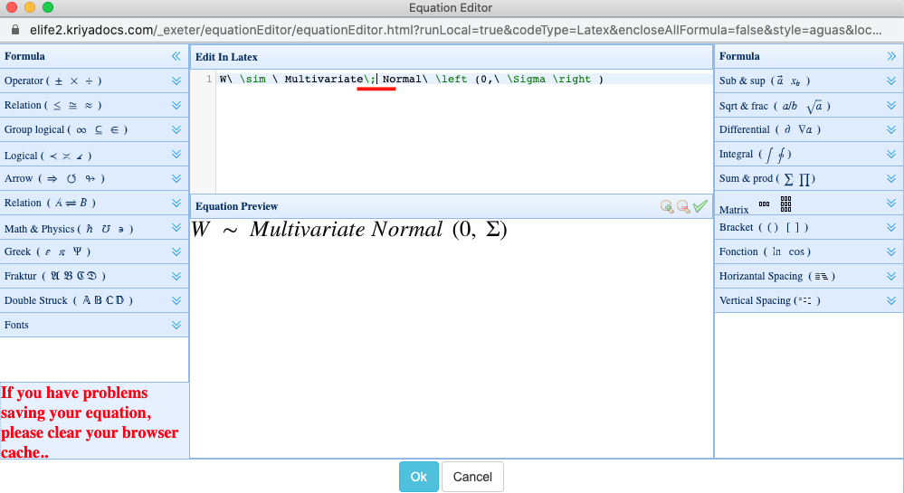

# Maths

Many eLife articles contain maths. It can be rendered inline \(inline with the text in a paragraph/list item/table cell or similar\) or as display equations. eLife captures math content either as plain text \(for simple maths\) or as [**MathML**](https://en.wikipedia.org/wiki/MathML) which is a mathematical markup language. Similarly, in their original files, authors can capture maths in varying ways. Either as plain text, as MathML \(by using an equation editor in Word or similar word processors\) or in [**LaTeX**](https://en.wikipedia.org/wiki/LaTeX).

## What needs to be checked?

* test

## Schematron checks

### Content checks

**inline-formula-test-2**

**Warning**: _There is no space between inline-formula and the preceding text - XXXXXX - Is this correct?_

**Action**: In almost all cases this warning fires, a space will need to be added before the inline equation. The only exception would be if both of the following two conditions are satisfied:

1.  A particular character or characters need to be captured as an inline equation so that the font matches how those characters appear elsewhere in the article \(see above\).
2. This character \(or characters\) should be placed directly after the preceding text without any space. 

Here is an example of a case where the warning could be ignored, taken from [**https://elifesciences.org/articles/56942.pdf**](https://elifesciences.org/articles/56942.pdf).

The underlined mathematical fraktur 'R' must be tagged as an inline equation to match the font used for that term used elsewhere.

If Exeter are unsure, they can query the eLife production team via slack for instruction.

**inline-formula-test-3**

**Warning**: _There is no space between inline-formula and the following text - XXXXXX - Is this correct?_

**Action**: In almost all cases this warning fires, a space will need to be added after the inline equation. The only exception would be if both of the following two conditions are satisfied:

1.  A particular character or characters need to be captured as an inline equation so that the font matches how those characters appear elsewhere in the article \(see above\).
2. This character \(or characters\) should be placed directly before the following text without any space. 

Here is an example of a case where the warning could be ignored taken from [**https://elifesciences.org/articles/56942.pdf**](https://elifesciences.org/articles/56942.pdf).

The underlined mathematical fraktur 'R' must be tagged as an inline equation to match the font used for that term used elsewhere..

If Exeter are unsure, they can query the eLife production team via slack for instruction.

**math-test-14**

**Warning**: _mml:math only contains numbers and/or operators - 'XXXXXX'. Is it necessary for this to be set as a formula, or can it be captured with as normal text instead?_

**Action**:

**math-test-3**

**Error**: _mml:math only contains '±', which is unnecessary. Capture this as a normal text '±' instead._

**Action**: As the message suggests, the action here should be to delete the equation in Kriya, and add the '±' as plain text. In rare cases, where a single equation may have been split into multiple when processing the article, it may instead be appropriate to add this symbol \(and whatever else, as required\) to a single inline equation. If there are other equations with little or truncated content directly preceding or following this equation then check the source file to determine if this course of action is more appropriate.

**math-test-4**

**Error**: _mml:math only contains '±' followed by digits, which is unnecessary. Capture this as a normal text instead._

**Action**: As the message suggests, the action here should be to delete the equation in Kriya, and add the '±' and digits as plain text. In rare cases, where a single equation may have been split into multiple when processing the article, it may instead be appropriate to add this symbol \(and whatever else, as required\) to a single inline equation. If there are other equations with little or truncated content directly preceding or following this equation then check the source file to determine if this course of action is more appropriate.

**math-test-5**

**Error**: _mml:math only contains '×', which is unnecessary. Capture this as a normal text '×' instead._

**Action**: As the message suggests, the action here should be to delete the equation in Kriya, and add the '×' as plain text. In rare cases, where a single equation may have been split into multiple when processing the article, it may instead be appropriate to add this symbol \(and whatever else, as required\) to a single inline equation. If there are other equations with little or truncated content directly preceding or following this equation then check the source file to determine if this course of action is more appropriate.

**math-test-6**

**Error**: _mml:math only contains '~', which is unnecessary. Capture this as a normal text '~' instead._

**Action**: As the message suggests, the action here should be to delete the equation in Kriya, and add the '~' as plain text. In rare cases, where a single equation may have been split into multiple when processing the article, it may instead be appropriate to add this symbol \(and whatever else, as required\) to a single inline equation. If there are other equations with little or truncated content directly preceding or following this equation then check the source file to determine if this course of action is more appropriate.

**math-test-7**

**Error**: _mml:math only contains '~' and digits, which is unnecessary. Capture this as a normal text instead._

**Action**: As the message suggests, the action here should be to delete the equation in Kriya, and add the '~' and digits as plain text. In rare cases, where a single equation may have been split into multiple when processing the article, it may instead be appropriate to add this symbol \(and whatever else, as required\) to a single inline equation. If there are other equations with little or truncated content directly preceding or following this equation then check the source file to determine if this course of action is more appropriate.

**math-test-8**

**Warning**: _mml:math only contains 'μ', which is likely unnecessary. Should this be captured as a normal text 'μ' instead?_

**Action**: Typically in scientific articles this character is used to denote micro. However, it may also \(or instead\) be used as a constant or variable in an equation which represents a certain value. Depending on it's usage in an article, it may be appropriate to retain this as an equation or to delete it and instead capture the character as plain text. 

Check if the character has been used in a display equation elsewhere. If it has, and this is being used to denote that same variable, then it _must_ be left as an inline equation to retain consistent font throughout the article.

Typically, if this character has been used to communicate micro, such as in 'μm', or similar, then it can be deleted however this is not _certainly_ the case. If in doubt, leave this character as an equation unless the authors specify otherwise during proofing.

**math-test-9**

**Error**: _mml:math only contains '%' and digits, which is unnecessary. Capture this as a normal text instead._

**Action**: As the message suggests, the action here should be to delete the equation in Kriya, and add the percentage symbol and numbers as plain text. In rare cases, where a single equation may have been split into multiple when processing the article, it may instead be appropriate to add this symbol \(and whatever else, as required\) to a single inline equation. If there are other equations with little or truncated content directly preceding or following this equation then check the source file to determine if this course of action is more appropriate.

**math-test-12**

**Error**: _mml:math only contains '%', which is unnecessary. Capture this as a normal text instead._

**Action**: As the message suggests, the action here should be to delete the equation in Kriya, and add the percentage symbol as plain text. In rare cases, where a single equation may have been split into multiple when processing the article, it may instead be appropriate to add this symbol \(and whatever else, as required\) to a single inline equation. If there are other equations with little or truncated content directly preceding or following this equation then check the source file to determine if this course of action is more appropriate.

**math-test-10**

**Error**: _mml:math only contains '°', which is likely unnecessary. This should be captured as a normal text '°' instead._

**Action**: As the message suggests, the action here should be to delete the inline equation in Kriya, and add the degree symbol as plain text.

**math-test-11**

**Warning**: _mml:math contains '○' \(the white circle symbol\). Should this be the degree symbol instead - '°', or '∘' \(the ring operator symbol\)?_

**Action**: Check the context in which this symbol is used. If it follows numbers and/or is used in the context of discussing temperature, rotation or angles, then replace the inline equation with a plain text degree symbol. If it is definitely supposed to be a white circle symbol, then check how it's been used elsewhere - if the character is present in a display equation, then it will need to remain as an inline equation to keep the font consistent. The aim here is to remove unnecessary math markup, but not to the detriment of keeping fonts/meaning consistent in the article.

**math-test-13**

**Warning**: _mml:math only contains 'XXXXXX', which is likely unnecessary. Should this be captured as normal text instead?_

**Action**: 

**math-test-15**

**Warning**: _mml:math seems to only contain the formula for a cation - 'XXXXXX' - which is likely unnecessary. Should this be captured as normal text instead?_

**Action**:

**math-test-16**

**Warning**: _mml:math seems to only contain the formula for an anion - 'XXXXXX' - which is likely unnecessary. Should this be captured as normal text instead?_

**Action**:

**math-test-17**

**Warning**: _mml:math only contains number\(s\) and square root symbol\(s\) 'XXXXXX', which is likely unnecessary. Should this be captured as normal text instead? Such as XXXXXX?_

**Action**: This warning will fire if a equation contains only numbers accompanied by a square root symbol. It's likely that it can be replaced with plain text '√' and the numbers, but check how this and similar content has been captured elsewhere in the article and ensure that it's consistent.

**math-test-18**

**Warning**: _abstract contains MathML \(XXXXXX\). Is this necessary? MathML in abstracts may not render downstream, so if it can be represented using normal text/unicode, then please do so instead._

**Action**: This will fire for any equation in an abstract. If the equation can be represented with plain text alternatives, then it should be changed to that. If it cannot, then the message can be ignored.

**math-test-19**

**Warning**: _Maths containing 'XXXXXX' has what looks like words or terms which need separating with a space. With it's current markup the space will not be preserved on the eLife website. Please add in the space\(s\) using the latext '\;' in the appropriate place\(s\), so that the space is preserved in the HTML._

**Action**: This warning will fire for equations that contain words or letters which may be missing the required spacing in the MathML \(in the XML\) in order for the spacing to render on our site. Check the rest of the article or the source manuscript to determine whether authors intended the word\(s\)/term\(s\) to include a space or not.

Here is a published example to illustrate case where intervention would be needed. 

\*\*\*\*[**https://elifesciences.org/articles/47602\#equ7**](https://elifesciences.org/articles/47602#equ7)\*\*\*\*

Here, you can see that on the eLife website, there is no space between 'Multivariate' and 'Normal'. Whereas if you check [**the PDF**](https://elifesciences.org/articles/47602.pdf) you can see that the authors intended for there to be space in between those words:

To fix this open up the equation editor in Kriya and replace any spaces used with `\;` so that the space is retained in the XML/on the website.

Here is that equation in Kriya before the edit:

And here is the same equation with the change:

**pre-mathcolor-test-1**

**Warning**: _math \(XXXXXX element\) containing 'XXXXXX' has a color style which is not red, blue or purple - 'XXXXXX' - which is not allowed. If it is clear that colours are supposed to be used, but you are not sure which ones, then please query the authors - 'eLife only supports the following colours for text and maths - 'red', 'blue' and 'purple'. Please confirm how you would like the colour\(s\) here captured given this information.'._

**Action**: The only colours eLife permit for text is red, blue or purple and this is still the case for maths. As the message suggests, this will fire at pre-author stages when maths contains a colour which is not permitted. Exeter should add the following author query:

* eLife only supports the following colours for text and maths - 'red', 'blue' and 'purple'. Please confirm how you would like the colour\(s\) here captured given this information.

**final-mathcolor-test-1**

**Error**: _math \(XXXXXX element\) containing 'XXXXXX' has a color style which is not red, blue or purple - 'XXXXXX' - which is not allowed. Only 'red', 'blue' and 'purple' are allowed._

**Action**: The only colours eLife permit for text is red, blue or purple and this is still the case for maths. As the message suggests, this will fire at post-author stages when maths contains a colour which is not permitted. Exeter should check the response the authors had to the query which was \(hopefully\) added before they proofed. If the authors suggest a suitable solution \(such as removing the colours, adding different forms of emphasis such as bold, or by asking for the colours to be changed to the permitted ones\), then Exeter can implement their suggestion. If the query was missed or if the authors did not provide a suitable solution, then Exeter should add a note to the article for the attention of the Production team at Publisher Review. The Production team can then determine the correct course of action, which likely will be to go back to the authors and clarify their options.

**mathcolor-test-2**

**Warning**: _math \(XXXXXX element\) containing 'XXXXXX' has XXXXXX colour formatting. Is this OK?_

**Action**: This warning will fire at all stages when maths is formatted with one of the permitted colours for text \(red, blue or purple\). At pre-author stages, Exeter should add the following author query:

* Where possible, we prefer that colours are not used in text in the interests of accessibility and because they will not display in downstream HTML \(for example in PMC\). Would it be possible to capture the same meaning in this equation with more common forms of emphasis \(such as bold, italic or underline\)? If so please stipulate below how the equation should be revised. Please note that this is a suggestion and these permitted colours can be published if required.

At post-author stages, this warning can be ignored.

**pre-mathbackground-test-1**

**Warning**: _math \(XXXXXX element\) containing 'XXXXXX' has 'XXXXXX' colour background formatting. This likely means that there's a mistake in the content which will not render correctly online. Please check this carefully against the original manuscript. If it's not a mistake, and the background colour is deliberate, then please add the following author query -&gt; 'Where possible, we prefer that colours are not used in text in the interests of accessibility and because they will not display in downstream HTML \(for example in PMC\). eLife does not support background colours for text, however we do support the following colours for text itself - 'red', 'blue' and 'purple'. Please confirm how you would like the colour\(s\) captured here given this information, and note that our preference would be to use more common forms of emphasis \(such as bold, italic or underline\) if possible to still convey the same meaning.'._

**Action**: This warning will fire at pre-author stages for maths in the text, which has background colour formatting \(similar to highlighting\). eLife do not permit this for text, and only permit certain colours for text \(red, blue, or purple\). Exeter should check that this isn't a processing error by confirming the colours were in the original manuscript exported from eJP, and if it isn't a processing error, then they should add the following author query:

* Where possible, we prefer that colours are not used in text in the interests of accessibility and because they will not display in downstream HTML \(for example in PMC\). eLife does not support background colours for text, however we do support the following colours for text itself - 'red', 'blue' and 'purple'. Please confirm how you would like the colour\(s\) captured here given this information, and note that our preference would be to use more common forms of emphasis \(such as bold, italic or underline\) if possible to still convey the same meaning.'

**pre-mathbackground-test-2**

**Warning**: _math \(XXXXXX element\) containing 'XXXXXX' has 'XXXXXX' colour background formatting. This likely means that there's a mistake in the content which will not render correctly online. Please check this carefully against the original manuscript. If it's not a mistake, and the background colour is deliberate, then please ensure that the background colour is captured for the table cell \(rather than the maths\)._

**Action**: This warning will fire at pre-author stages for maths in a table, which has background colour formatting \(similar to highlighting\). eLife do not permit background colouring for text, and only permit certain colours for text itself \(red, blue, or purple\), and [**certain colours for table cells**](allowed-assets/tables.md#allowed-colours-in-tables). Exeter should check that this isn't a processing error by confirming the colours were in the original manuscript exported from eJP. If the colours were present for the table cell\(s\) in the original manuscript then that formatting should be removed from the equation and added to the cell; then the steps required for colours in tables cells should be followed, as directed by the Schematron messages after re-validating \(see also the [**Tables page**](allowed-assets/tables.md)\). If, in the original manuscript, there was background colour for the maths, then it should be changed as colour for the text of the maths. 

**final-mathbackground-test-1**

**Error**: _math \(XXXXXX element\) containing 'XXXXXX' has 'XXXXXX' colour background formatting. This likely means that there's a mistake in the content which will not render correctly online. If it's not a mistake, and the background colour is deliberate, then this will need to removed._

**Action**:

**final-mathbackground-test-2**

**Error**: _math \(XXXXXX element\) containing 'XXXXXX' has 'XXXXXX' colour background formatting. This likely means that there's a mistake in the content which will not render correctly online. If it's not a mistake, and the background colour is deliberate, then either the background colour will need to added to the table cell \(rather than the maths\), or it needs to be removed._

**Action**:

**mtext-test-1**

**Warning**: _math \(XXXXXX element\) contains 'XXXXXX' which looks suspiciously like LaTeX markup. Is it correct? Or is there missing content or content which has been processed incompletely?_

**Action**:

**inline-formula-length-test-1**

**Warning**: _Inline formula containing 'XXXXXX' is particularly long. Consider either splitting this up into multiple equations or capturing this as a display equation, as the display on Continuum will likely be strange._

**Action**:

**equation-label-conformance-1**

**Error**: _Duplicated display formula labels - XXXXXX is present more than once in the same appendix._

**Action**:

**equation-label-conformance-2**

**Error**: _Duplicated display formula labels - XXXXXX is present more than once in the main body of the text._

**Action**:

### XML structure checks

**disp-formula-test-2**

**Error**: _disp-formula must contain an mml:math element._

**Action**:

**disp-formula-test-3**

**Warning**: _In the vast majority of cases disp-formula should be a child of p. XXXXXX is a child of XXXXXX. Is that correct?_

**Action**:

**disp-formula-test-4**

**Error**: _disp-formula cannot be placed as the first child of a p element with no content before it \(ie. &lt;disp-formula ...\). Either capture it at the end of the previous paragraph or capture it as a child of XXXXXX_

**Action**:

**inline-formula-test-1**

**Error**: _inline-formula must contain an mml:math element._

**Action**:

**inline-formula-test-4**

**Error**: _XXXXXX must be a child of p, td, th or title. The formula containing XXXXXX is a child of XXXXXX_

**Action**:

**math-test-1**

**Error**: _mml:math must not be empty._

**Action**:

**math-test-2**

**Error**: _math contains an mml:merror with 'XXXXXX'. This will almost certainly not render correctly._

**Action**:

**disp-formula-child-test-1**

**Error**: _XXXXXX element is not allowed as a child of disp-formula._

**Action**:

**inline-formula-child-test-1**

**Error**: _XXXXXX element is not allowed as a child of inline-formula._

**Action**:

**mml-math-id-test**

**Error**: _mml:math @id in disp-formula must be in the format 'm0'. XXXXXX does not conform to this._

**Action**:

**sub-mml-math-id-test**

**Error**: _mml:math @id in disp-formula must be in the format 'sa0m0'. XXXXXX does not conform to this._

**Action**:

**disp-formula-id-test**

**Error**: _disp-formula @id must be in the format 'equ0'._

**Action**:

**sub-disp-formula-id-test**

**Error**: _disp-formula @id must be in the format 'sa0equ0' when in a sub-article. XXXXXX does not conform to this._

**Action**:

