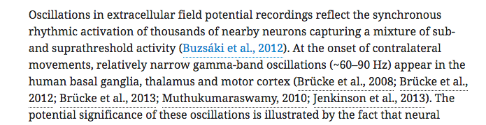

# Reference citations

## What is a reference citation?

A reference citation is an in-text citation for a reference as given in an article's reference list. This is in contrast to an asset citation \(for figures, tables etc\).



eLife uses 'name-year' citation style, where each reference is cited using the name of the first author and the year of publication. This style behaves differently depending on how many authors there are for a reference:

* One author - Smith, 2010
* Two authors - Smith and Jones, 2010
* Three or more authors - Smith et al., 2010

If two or more references would produce the same citation, they should be distinguished with the addition of a,b,c,d etc to the years:

* Smith et al., 2010a
* Smith et al., 2010b

In most cases, reference citations will appear inside brackets. Where multiple references are cited in one set of brackets, each citation should be separated from the next with a semi-colon followed by a space.

## What needs to be checked?

Most of the major possible issues with reference citations will be picked up by [schematron rules](reference-citations.md#schematron-warnings). It is, however, important to be aware of the style rules relating to the following when adding or removing reference citations:

* Brackets around citations \(when to use, when these are not required\)
* ; should be used as a separator between citations
* How to identify unconverted citations

Examples of these can be found in the next section.

## Examples

### Brackets around citations

Most of the time, references citations will be contained within parentheses:

"Correspondingly, the inactivation of PDGFα receptor \(PDGFRα\), which is majorly expressed in OPCs \(**Pringle et al., 1992**\), results in . . ."

Multiple reference citations may appear within one set of parentheses:

"On the one hand, behavioral and task-set learning are modeled on an abstract, psychological level \(**Botvinick et al., 2009**; **Collins and Koechlin, 2012**; **Donoso et al., 2014**\)."

Where references are cited within a parenthetical statement, square brackets may be used to separate them from the text. This is the only time it is appropriate to use square brackets around a citation:

". . . behavioral policy \(recurrent versus open-ended sessions, while controlling for trial perceived difficulty, as implemented by reaction times \[**Shenhav et al., 2013**; **Shenhav et al., 2014**\]\)."

Citations in parentheses may be accompanied by additional text, usually a direction to the reader. For example, "\(see **Smith et al., 2010**\)" or "\(**Dare et al., 1950**; **Morgan et al., 1953**; for a review, see **Ellis, 2004**\)". In these cases, square brackets are not required. 

Where multiple sets of parenthetical citations occur one after the other, these should be merged together. This applies to both reference and asset citations, which should be combined into the same set of brackets if they occur together. So, for example

 “\(**Figure 1**\) \(**Harrison et al, 2020**; **Albert and Smith, 1998**\)”

should be changed to

“\(**Figure 1**; **Harrison et al, 2020**; **Albert and Smith, 1998**\)”.

### Citations that do not require brackets

Authors will sometimes use a name/year citation as a part of a sentence. For example:

"In consistent with our results, **Shin et al., 2014** also found that Akt activity is not affected by Gab1 deletion in SCs."

In these cases, no parentheses are required around the citation. If parentheses are provided for these cases, they should be removed. So

"\(**Shin et al., 2014**\) also found that . . ."

would need to be changed to

"**Shin et al., 2014** also found that . . ."

Similarly, if a sentence refers to something in a particular reference, parentheses are not required. Small grammatical changes may be necessary in such cases. The following:

“Peptide arrays were purchased from the MIT Biopolymers Laboratory as described previously in \(**Karagöz et al., 2011**; **Gardner and Walter, 2017**\).”

should be changed to

“Peptide arrays were purchased from the MIT Biopolymers Laboratory as described previously in **Karagöz et al., 2011** and **Gardner and Walter, 2017**.”

### Citations close to mentions of author names

Occasionally, the authors of a cited publication may be referred to by name in the same sentence as a parenthetical citation. If the citation appears in parentheses immediately after the author names, it may be appropriate to replace the author names with a non-parenthetical citation and delete the parenthetical one. So:

"Murakoshi et al. \(**Murakoshi et al., 2004**\) used a single molecule fluorescence energy transfer \(FRET\) technique to observe single molecule activation of RAS molecules in the plasma membrane of cells."

could be changed to

"**Murakoshi et al., 2004** used a single molecule fluorescence energy transfer \(FRET\) technique to observe single molecule activation of RAS molecules in the plasma membrane of cells."

However, if the citation is at the end of the sentence, or more than one publication is cited after the author name\(s\), this would not an appropriate change. This, for example, should be left as it stands:

"Pearce et al. designed a framework based on variable-order Markov models that learns statistics describing the temporal sequences in melodic sequences at various time-scales \(IDyOM; **Pearce, 2005**\)."

Please note that in some cases, the author of the reference will be mentioned in the context of a scientific term or method. In these cases, it is absolutely fine to leave the reference in brackets, as in the following:

". . . we used the Lilliefors test \(**Lilliefors, 1967**\) to assure that in most of the cases . . ."

### Citations that have not been converted properly

If the authors have provided the citations in their submitted file using another reference style e.g. numbered references in superscript or brackets, a conversion will be run to change this to eLife style. For example,

"Förster resonance energy transfer \(smFRET\) or colocalization single-molecule spectroscopy \(CoSMoS\) can be dramatically extended with recently developed photostable dyes \[**3,4**\]."

will be converted to

"Förster resonance energy transfer \(smFRET\) or colocalization single-molecule spectroscopy \(CoSMoS\) can be dramatically extended with recently developed photostable dyes \(**Grimm et al., 2015**; **Altman et al., 2012**\)."

Most of the time this process is successful. Sometimes, however, reference citations will not be converted correctly, leaving instances of superscript or bracketed numbers where there should be a name/year citation. These should be replaced with the corresponding citations in eLife style.

Please be aware of this issue when dealing with uncited references: that may be caused by the citations not converting correctly.

## Schematron warnings

### Content warnings

#### pre-ref-xref-test-1

**Error**: _XXXXXX - citation does not conform to house style. It should be 'XXXXXX'. Preceding text = 'XXXXXX'._

**Action**: This error will fire at the pre-author stage if the text within a reference citation link \(the `<xref>` element\) does not match the standard style of '**Smith, 2010**' \( `<xref ref-type="bibr" rid="bib16">Smith, 2010</xref>`\), '**Smith and Jones, 2007**' \( `<xref ref-type="bibr" rid="bib16">Smith and Jones, 2007</xref>`\) or '**Smith et al., 2000**' \( `<xref ref-type="bibr" rid="bib16">Smith et al., 2000</xref>`\) . This may occur due to an error when a new reference is added, or if the text for the citation link is in the wrong style.

For example, if the validator does not correctly pick up the author names, the citation may render as '**et al., 2010**'. This can usually be fixed by checking that the details have been entered correctly and revalidating the reference. Alternatively, the authors may have used a different name/year citation style such as '**Jones \(2010\)**' \( `<xref ref-type="bibr" rid="bib16">Jones (2010)</xref>`\). This should be corrected to the standard citation style \('Jones et al. \(2010\)' should be changed to 'Jones et al., 2010' for this example\).

XXXXXX in this message will be the incorrect citation, the proposed correct citation and the text that precedes the citation, respectively.

#### final-ref-xref-test-1

**Error**: _XXXXXX - citation does not conform to house style. It should be 'XXXXXX' or 'XXXXXX'. Preceding text = 'XXXXXX'._

**Action**: This warning will fire at the post-author stage if the text within a reference citation link \(the `<xref>` element\) does not match the standard style of '**Smith, 2010**' \( `<xref ref-type="bibr" rid="bib16">Smith, 2010</xref>`\), '**Smith and Jones, 2007**' \( `<xref ref-type="bibr" rid="bib16">Smith and Jones, 2007</xref>`\) or '**Smith et al., 2000**' \( `<xref ref-type="bibr" rid="bib16">Smith et al., 2000</xref>`\) . This may occur due to an error when a new reference is added, or if the text for the citation link is edited incorrectly.

For example, if the validator does not correctly pick up the author names, the citation may render as '**et al., 2010**'. This can usually be fixed by checking that the details have been entered correctly and revalidating the reference. Alternatively, an edit to the text following a reference citation might delete part of the citation: " . . . \(**Smith et al., 201**~~**0**\). The~~\). These results . . . " This will result in incomplete text within the citation \(`<xref ref-type="bibr" rid="bib16">Smith et al., 201</xref>`\) and will need to be corrected so that the text is complete \('Smith et al., 201' should be corrected to 'Smith et al., 2010' for this example\).

During author proofing, the authors may request that an alternate style such as '**Smith \(2010\)**' be used for particular reference citations. This style - **Smith \(2010\)**, **Smith and Jones \(2009\)**, **Smith et al. \(2008\)** - is allowed by this rule. If it highlights citations like these, please ensure that the closing bracket is within the citation link. That is,`<xref ref-type="bibr" rid="bib16">Smith et al. (2000</xref>)` would be an error and should be corrected to `<xref ref-type="bibr" rid="bib16">Smith et al. (2000)</xref>`.

XXXXXX in this message will be the incorrect citation, the proposed correct citation and the text that precedes the citation, respectively.

#### ref-xref-test-2

**Warning**: _There is no space between citation and the preceding text - XXXXXX - Is this correct?_

**Action**: This warning will fire if a reference citation runs on with the text immediately before it, e.g. ". . . as described previously in**Karagöz et al., 2017**." This can happen if, for example, a citation was incorrectly converted from superscript number citation style, or if a new citation was added without appropriate spacing. To resolve the warning, add the missing space.

XXXXXX in this message will be the text where the citation runs on with the text.

#### ref-xref-test-3

**Warning**: _There is no space between citation and the following text - XXXXXX - Is this correct?_

**Action**: This warning will fire if a reference citation runs on with the text immediately after it, e.g. ". . . as described previously in **Karagöz et al., 2017**and . . ." This can happen if, for example, a citation was incorrectly converted from superscript number citation style, or if a new citation was added without appropriate spacing. To resolve the warning, add the missing space. XXXXXX in this message will be the text that needs checking.

#### ref-xref-test-4

**Error**: _citation doesn't contain numbers, which must be incorrect - XXXXXX_

**Action**: This error will fire in a reference citation does not contain any numbers, e.g. it is just '**Smith et al.,**' rather than '**Smith et al., 2010**'  \( `<xref ref-type="bibr" rid="bib16">Smith et al.,</xref>`\). Correct the citation text so that both name and year are present. XXXXXX in this message will be the current, incorrect citation text.

#### ref-xref-test-5

**Error**: _citation doesn't contain letters, which must be incorrect - XXXXXX_

**Action**: This error will fire in a reference citation does not contain any numbers, e.g. it is just '**2010**' rather than '**Smith et al., 2010**  \( `<xref ref-type="bibr" rid="bib16">2010</xref>`\). Correct the citation text so that both name and year are present. XXXXXX in this message will be the current, incorrect citation text.

#### ref-xref-test-11

**Warning**: _'XXXXXX' - citation is preceded by text ending with a possessive, preposition or verb and bracket which suggests the bracket should be removed._

**Action**: This warning will indicate instances such as ". . . as described previously in \(**Karagöz et al., 2017**\)", where it might not be appropriate to have the citation in parentheses. If the citation is part of the flow of the sentence, the parentheses should be removed. Please note that this message may appear even when the current text is fine \(e.g. \). See [above](reference-citations.md#citations-that-do-not-require-brackets) for more on when removing brackets is appropriate. XXXXXX in this message will be the text that needs checking.

#### ref-xref-test-12

**Warning**: _'XXXXXX' - citation is followed by a bracket and a possessive, preposition or verb which suggests the bracket is unnecessary._

**Action**: This warning will indicate instances such as "\(**Shin et al., 2014**\) also found that . . .", where it might not be appropriate to have the citation in parentheses. If the citation is part of the flow of the sentence, the parentheses should be removed. Please note that this message may appear even when the current text is fine \(e.g. \). See [above](reference-citations.md#citations-that-do-not-require-brackets) for more on when removing brackets is appropriate. XXXXXX in this message will be the text that needs checking.

#### ref-xref-test-14

**Warning**: _citation is preceded by text containing much of the citation text which is possibly unnecessary - XXXXXX_

**Action**: This will fire if the author of a reference is mentioned in close proximity to the citation of that reference. It might indicate that the citation needs to take the place of the author name\(s\). See [above](reference-citations.md#citations-close-to-mentions-of-author-names) for examples of how to deal with this. This warning can be ignored if it is not appropriate to make a change. XXXXXX in this message will be the text that needs checking.

#### ref-xref-test-15

**Warning**: _citation is followed by text containing much of the citation text. Is this correct? - 'XXXXXX'_

**Action**: This will fire if the author of a reference is mentioned in close proximity to the citation of that reference. It might indicate that the citation needs to take the place of the author name\(s\). See [above](reference-citations.md#citations-close-to-mentions-of-author-names) for examples of how to deal with this. This warning can be ignored if it is no appropriate to make a change. XXXXXX in this message will be the text that needs checking.

#### ref-xref-test-19

**Error**: _XXXXXX - citation doesn't start with an author's name which is incorrect._

**Action**: This error indicates that the text within a reference citation does not start with the surname of the first author in the corresponding reference. This could be related to **ref-xref-test-5**, above.  The citation text should be corrected to include the first author's surname. XXXXXX in this message will indicate the text that needs correcting.

#### ref-xref-test-20

**Error**: _citation is followed by '\);', which in turn is followed by another link. This must be incorrect \(the bracket should be removed\) - 'XXXXXX'._

**Action**: This error will fire when a reference citation is followed by a closing parenthesis and then by a semi-colon and another citation, e.g. ". . . **Smith et al., 2010**\); **Jones et al., 2019** . . ." This should be corrected to remove the closing bracket after the first citation, leaving only the semi-colon as a separator: ". . . **Smith et al., 2010**; **Jones et al., 2019** . . ." XXXXXX in this message will indicate the text where this error is present.

#### ref-xref-test-21

**Warning**: _citation is preceded by a letter or number immediately followed by '\('. Is there a space missing before the '\('? - 'XXXXXX'._

**Action**: This warning indicates that a citation in parentheses has run on with the text immediately preceding it, e.g. ". . . majorly expressed in OPCs\(**Pringle et al., 1992**\) . . ." A space should be added between the opening parenthesis and the word immediately before it. XXXXXX in this message will indicate the text that needs to be corrected.

#### ref-xref-test-22

**Warning**: _citation is followed by a '\)' which in turns is immediately followed by a letter or number. Is there a space missing after the '\)'? - 'XXXXXX'._

**Action**: This warning indicates that a citation in parentheses has run on with the text immediately following it, e.g. ". . . in OPCs \(**Pringle et al., 1992**\)and . . ." A space should be added between the closing parenthesis and the word immediately after it. XXXXXX in this message will indicate the text that needs to be corrected.

#### ref-xref-test-27

**Warning**: _citation is followed by '\) \(', which in turn is followed by another link - 'XXXXXX'. Should the closing and opening brackets be replaced with a '; '? i.e. 'XXXXXX'._

**Action**: This warning indicates that two citations \(to references or assets\) have been placed in two set of parentheses immediately next to each other, e.g.  “\(**Harrison et al, 2020**\) \(**Figure 1**\) ”. The two sets of parentheses should be merged and the citations should be separated with a semi-colon instead \(see [above](reference-citations.md#brackets-around-citations)\). XXXXXX in this message will indicate the text that needs to be corrected and a suggestion for how to correct it, respectively.

#### ref-xref-test-28

**Warning**: _citation is preceded by '\) \(', which in turn is preceded by another link - 'XXXXXX'. Should the closing and opening brackets be replaced with a '; '? i.e. 'XXXXXX'._

**Action**: This warning indicates that two citations \(to references or assets\) have been placed in two set of parentheses immediately next to each other, e.g.  “\(**Figure 1**\) \(**Harrison et al, 2020**\) ”. The two sets of parentheses should be merged and the citations should be separated with a semi-colon instead \(see [above](reference-citations.md#brackets-around-citations)\). XXXXXX in this message will indicate the text that needs to be corrected and a suggestion for how to correct it, respectively.

#### ref-presence

**Error**: _element contains 'Ref.' which is either incorrect or unnecessary._

**Action**: This error will fire if the text 'Ref.' or 'ref.' is present in a paragraph. This is likely to occur when the author writes something like "As can be seen in ref. **Shin et al., 2014** . . ." It may be a hold-over from processing numbered citations into name/year citations, e.g.  "As can be seen in ref. 6 . . ." The text 'ref.' should be removed as it is redundant.

Please note that this rule will fire regardless of the context in which 'ref.' is used, even when it does not precede a reference citation \(for example, "ref. PMID 000001"\). In such cases, it is sufficient to simply remove the full stop after 'ref'.

#### refs-presence

**Error**: _element contains 'Refs.' which is either incorrect or unnecessary._

**Action**: This error will fire if the text 'Refs.' or 'refs.' is present in a paragraph. This is likely to occur when the author writes something like "As can be seen in Refs. **Shin et al., 2014; Smith et al., 2017** . . ." It may be a hold-over from processing numbered citations into name/year citations, e.g.  "As can be seen in Refs. 6, 7 . . ." The text 'Refs.' should be removed as it is redundant.

Please note that this rule will fire regardless of the context in which 'refs.' is used, even when it does not precede a reference citation \(for example, "refs. PMID 000001, PMID 000005"\). In such cases, it is sufficient to simply remove the full stop after 'refs'.

#### xref-bibr-presence

**Warning**: _Abstract contains a citation - 'XXXXXX' - which isn't usually allowed. Check that this is correct._

**Action**: An article abstract should not contain any live reference citations as these cannot be rendered correctly on downstream services such as PubMed. If citations are present in the abstract, please delete them and inform the author using an author query. If these were the only citations of those references in the article \(which is usually unlikely\), please ask the author to add new citations for them in the main text. XXXXXX in this message will be the citation\(s\) in the abstract.

#### xref-column-test

**Warning**: 'XXXXXX' citation is in a column in the Key Resources Table which usually does not include references. Is it correct?

**Action**: This warning indicates that a citation has been included in the Key Resources Table outside of the columns 'Source or reference' or 'Additional information' \(columns 3 and 5, respectively\). This may indicate that a superscript number has been incorrectly converted to a reference citation. Check the table for the indicated citation and compare to the original file to confirm whether or not it should be present.

### XML structure warnings

#### ref-xref-parent-test

**Error**: _xref - XXXXXX - has a formatting parent element - XXXXXX - which is not correct._

**Action**: Reference citations should not be contained within style formatting such as italics or bold. If this formatting is present, please remove it. For example, if a citation is within bold tags`<bold><xref ref-type="bibr" rid="bib16">Blogss et al., 2010</xref></bold>`, these tags need to be removed.

XXXXXX in this message will be the citation and the formatting element respectively.

#### ref-xref-child-test

**Error**: _xref - XXXXXX - has a formatting child element - XXXXXX - which is not correct._

**Action**: Reference citations should not contain style formatting such as superscript or bold \(italics is an exception, see **ref-xref-italic-child-test**\). If this formatting is present, please remove it. XXXXXX in this message will be the citation and the formatting element respectively.

#### ref-xref-italic-child-test

**Warning**: xref - XXXXXX - contains italic formatting. Is this correct?

**Action**: Reference citations should not usually contain italic formatting. The only exception to this rule is if italics are present in the name of a collaboration e.g. "The _C. elegans_ Sequencing Consortium." If the formatting is present in a collaboration name, this should be retained in the citation, "**The** _**C. elegans**_ **Sequencing Consortium, 1998**". Otherwise, italic formatting in a reference citation should be removed. XXXXXX in this message will be the citation containing italics.

#### bibr-xref-target-test

**Error**: xref with @ref-type='XXXXXX' points to XXXXXX. This is not correct.

**Action**: This error will fire if a reference citation `<xref>` \(e.g. one with the attribute `ref-type="bibr"`\) points not to some other element such as a figure. 

## XML structure

```markup
Furthermore, central spindle specifiers have sperm-specific localization 
patterns at mid-late anaphase I instead of residing strongly within the 
spindle midzone (<xref ref-type="bibr" rid="bib13">Davies et al., 2014</xref>;
 <xref ref-type="bibr" rid="bib14">de Carvalho et al., 2008</xref>; 
 <xref ref-type="bibr" rid="bib16">Dumont et al., 2010</xref>; 
 <xref ref-type="bibr" rid="bib49">Maton et al., 2015</xref>; 
 <xref ref-type="bibr" rid="bib80">Schumacher et al., 1998</xref>; 
 <xref ref-type="bibr" rid="bib83">Severson et al., 2000</xref>). 
```

