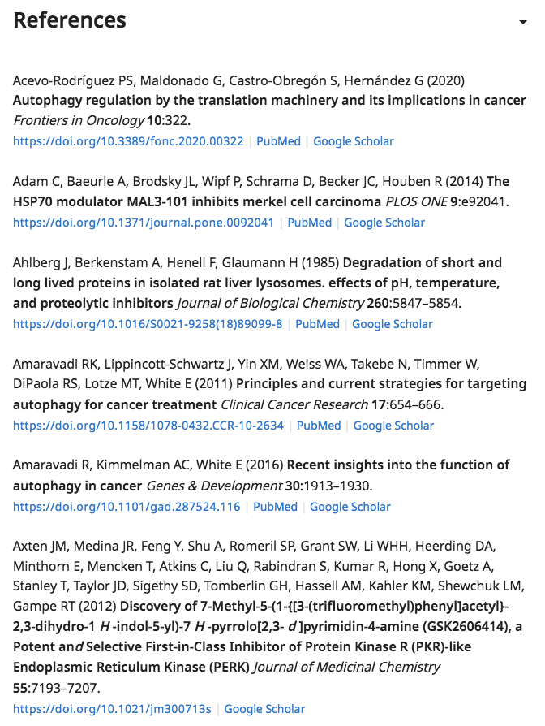
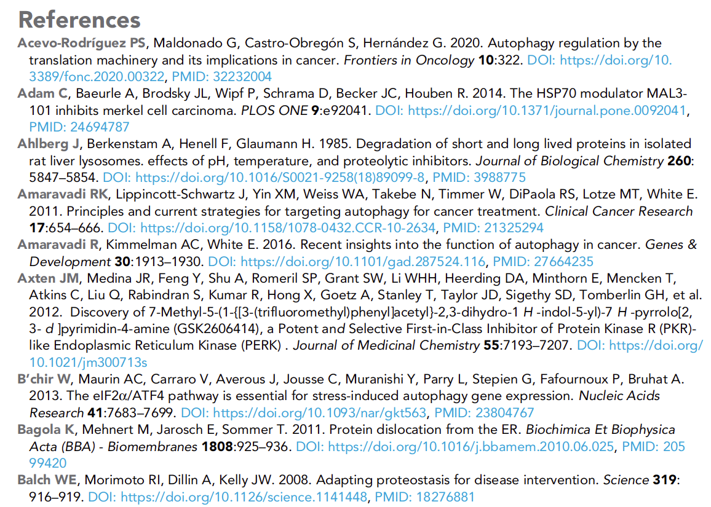

# References

## What is a reference list?

Most eLife articles will include a reference list \(otherwise known as a bibliography\) that contains details for all the previous work being cited in the text. These will usually consist mostly of journal articles and books but may also cover websites, papers presented at conferences, software, data and other published material. Whenever research is published, it will be supported with a large number of references; we have had articles with upwards of 150 references. Some review articles, which survey the available literature on a subject, may reach as high as 200+ references.

The reference list is included at the end of the article, in the back matter. References are ordered alphabetically by the surname of the first author for each entry, then by year, and then by the surnames of the second, third, fourth etc authors as necessary. Each reference list covers the entire article in which it appears; references in appendices are not treated separately from those in the main text.





The style used for references in articles - that is, the way the details are formatted and ordered - is derived from the APA style but is unique to eLife. Full author lists are presented online, but where there are more than 20 authors listed, 'et al.' will be used to truncate the list in the PDF \(compare Axten et al., 2021 in the two lists shown above\). This is in order to save space; some journal articles have over 100 authors!

eLife permits references to the following items, for which type-specific guidance has been provided on dedicated pages:

* \*\*\*\*[**Books**](book-references.md)\*\*\*\*
* \*\*\*\*[**Conference papers**](conference-reference.md)\*\*\*\*
* \*\*\*\*[**Data**](data-references.md)\*\*\*\*
* \*\*\*\*[**Journal articles**](journal-references.md)\*\*\*\*
* **Patents**
* \*\*\*\*[**Preprints**](preprint-references.md)\*\*\*\*
* \*\*\*\*[**Reports**](report-references.md)\*\*\*\*
* \*\*\*\*[**Software**](software-references.md)\*\*\*\*
* \*\*\*\*[**Theses**](thesis-references.md)\*\*\*\*

## What needs to be checked?

### Reference ordering

References in eLife are ordered by the following criteria:

* Surname of the first author
* then date of publication
* then, if necessary, surname of second, third, etc authors

So, for example, consider the following selection of references:

* Gilson PR, Nebl T, Vukcevic D, Moritz RL, Sargeant T, Speed TP, Schofield L, Crabb BS. 2006
* Gilson PR, Crabb BS. 2009
* Hillringhaus S, Dasanna AK, Gompper G, Fedosov DA. 2019
* Hillringhaus S, Dasanna AK, Gompper G, Fedosov DA. 2020
* Hoogerbrugge PJ, Koelman JMVA. 1992
* Keeley A, Soldati D. 2004
* Keeley A, Soldati D, Smith J, Bloggs M. 2004
* Koch M. 2016

As you can see, the first author provides the main ordering criterion, followed by the publication date in cases where the first surnames for separate references are the same. In cases where the first surname and date are the same, the second and then third author surnames provide the next level of ordering \(here, Keeley and Soldati are followed by Keeleym Soldati and Smith\).

#### References with the same citation

An additional layer of ordering comes from handling references with identical citations. This refers not to to the reference details themselves but the string that is used to cite them. Consider:

* Keeley A, Soldati D. 2004
* Keeley A, Soldati D, Smith J, Bloggs M. 2004

In the text, these will be cited as 'Keeley and Soldati, 2004' and 'Keeley et al., 2004', respectively, and are therefore easily distinguished. However, if both references were

* Keeley A, Soldati D. 2004
* Keeley A, Soldati D. 2004

then they would both be cited as  'Keeley and Soldati, 2004'. Similarly, if two or more references included the same first surname and date, with the same or different author lists, e.g.

* Keeley A, Smith J, Baum J. 2004
* Keeley A, Soldati D, Smith J, Bloggs M. 2004
* Keeley A, Soldati D, Smith J, Bloggs M. 2004

all of them would be cited as 'Keeley et al., 2004'. In order to prevent confusion, references with identical citation strings are distguished by added a letter to the year. This means the first example becomes

* Keeley A, Soldati D. 2004a
* Keeley A, Soldati D. 2004b

and the second

* Keeley A, Smith J, Baum J. 2004a
* Keeley A, Soldati D, Smith J, Bloggs M. 2004b
* Keeley A, Soldati D, Smith J, Bloggs M. 2004c

resulting in citations of 'Keeley and Soldati, 2004a' and 'Keeley and Soldati, 2004b', and 'Keeley et al., 2004a', 'Keeley et al., 2004b' and 'Keeley et al., 2004c'. The dates are then treated in alphabetical sequence, so '2004b' must appear after '2004a' in the reference list.

Letters should be assigned on the basis of which reference is cited first in the text. So, the first reference citation should have the year suffic a, the second b, the third c and so on.

### Combining multiple reference lists

In some instances, authors will provide multiple reference lists in their submitted article files. This will usually entail providing the reference list for an appendix separately from the reference list for the main text, perhaps because these are in separate documents. In these cases, all the reference lists should be combined and any duplicate entries removed.

This will be carried out during initial processing of the article files so there usually will not be nothing to check at the subsequent stages. If an appendix is missed or otherwise needs to be added in later, any references included exclusively in that section should be added to the main reference list.

### General reference formatting


## Schematron warnings

### Content warnings

#### ref-list-title-test

**Warning**: _reference list usually has a title that is 'References', but currently it is 'XXXXXX' - is that correct?_

**Action**: This warning indicates that the reference list has a title other than 'References'. This should be corrected to use the standard heading.

#### ref-list-distinct-1

**Error**: _In the reference list, each reference must be unique in its citation style \(combination of authors and year\). If a reference's citation is the same as anothers, a lowercase letter should be suffixed to the year \(e.g. Smith et al., 2020a\). XXXXXX does not meet this requirement._

**Action**: This error indicates that two or more references have the same citation string e.g. Smith et al., 2020 and Smith et al., 2020. The references will need to be updated to distinguish the citations by applying a a letter to the year field. The first reference cited should have the year updated to e.g. 2020a, the second to 2020b and so on. See [**above**](./#references-with-the-same-citation) for more details on this.

#### err-elem-cit-gen-date-1-2

**Warning**: _The numeric value of the first 4 digits of the &lt;year&gt; element must be between 1700 and the current year + 5 years \(inclusive\). Reference 'XXXXXX' does not meet this requirement as it contains the value 'XXXXXX'.–_

**Action**: This warning indicates a reference has a date that is outside the range 1700 to five years past the current year. Any reference that has a year pre-1700 or after the current year+5 will be flagged by this test. The reference should be checked to ensure that no error has occurred in processing the details provided by the author; for example, has a volume number been accidentally input as the year?

If the year is correct and pre-1700, check to ensure that publication details have been provided \(publisher name must be present for books, journal name must be present for articles etc\). Please note that for books, the reference should be to the specific edition used and this will usually have a modern publication date that should be used.

If the year is more than five years in the future, the authors should be queried to check the reference details:

* Please confirm that this reference is in press as the year provided is more than five years in the future.

#### err-elem-cit-gen-date-1-4

**Warning**: _The numeric value of the first 4 digits of the @iso-8601-date attribute on the &lt;year&gt; element must be between 1700 and the current year + 5 years \(inclusive\). Reference 'XXXXXX' does not meet this requirement as the attribute contains the value 'XXXXXX'._

**Action**: 

#### err-elem-cit-gen-date-1-6

**Error**: _If the &lt;year&gt; element contains the letter 'a' after the digits, there must be another reference with the same first author surname \(or collab\) with a letter "b" after the year. Reference 'XXXXXX' does not fulfill this requirement._

**Action**: This error indicates that a reference has a year value with a letter 'a' at the end but that there is no subsequent reference with 'b' at the end. Letter suffixes to years should only be added if there are multiple references with the same details that need their citations distinguished. Either the letter must be removed from the indicated reference, or a subsequent reference with the same author/year combination must be updated to add a 'b' suffice to the year.

#### err-elem-cit-gen-date-1-7

**Error**: _If the &lt;year&gt; element contains any letter other than 'a' after the digits, there must be another reference with the same first author surname \(or collab\) with the preceding letter after the year. Reference 'XXXXXX' does not fulfill this requirement._

**Action**: This error indicates that a reference has a year value with a letter 'a' at the end but that there is no subsequent reference with 'b' at the end. Letter suffixes to years should only be added if there are multiple references with the same details that need their citations distinguished. Either the letter must be removed from the indicated reference, or a subsequent reference with the same author/year combination must be updated to add a 'b' suffix to the year.

#### elem-cit-source

**Error**: _A &lt;source&gt; element within a XXXXXX type &lt;element-citation&gt; must contain at least two characters. - XXXXXX. See Ref 'XXXXXX'._

**Action**: The error indicates a reference's source field \(journal name, book title, database name etc.\) contains zero or one characters only. This will certainly be a mistake as virtually every source for a reference will consist of at least two characters. Check that the details have been captured correctly from the original article file and correct as necessary. If it is unclear what the source for the reference is, please query the author:

* Please provide the source for this reference \(e.g. book, journal, webiste, or database\).

#### err-elem-cit-high-2-2

**Error**: _The order of &lt;element-citation&gt;s in the reference list should be name and date, arranged alphabetically by the first author’s surname, or by the value of the first &lt;collab&gt; element. In the case of two authors, the sequence should be arranged by both authors' surnames, then date. For three or more authors, the sequence should be the first author's surname, then date. Reference 'XXXXXX' appears to be in a different order._

**Action**: This error indicates that the order of the reference list does not match eLife style. See above for more details on the preferred ordering. In Kriya 1.5, a 'reorder references in alphabetical order' option can be found under the 'edit' menu. Clicking this will place the references in the correct sequence but the article must be saved and the page refreshed before this shows correctly in the display. In Kriya 2.0, ordering should update automatically following edits or additions to the reference list.

Check that the sequence of references is indeed incorrect, accounting for any special characters \(these should be treated as the equivalent standard letters for the purposes of ordering e.g. ë would be treated as e\). It is possible for an author's name to include characters not accounted for by the rules and this must be fed back to the Production team member responsible for maintaining the schematron. If the order is wrong and the system tools do not automatically correct this, the article will need to go back to the production vendor to resolve the problem.

#### err-xref-high-2-1

**Error**: _Citations in the text to references with the same author\(s\) in the same year must be arranged in the same order as the reference list. The xref with the value 'XXXXXX' is in the wrong order in the text. Check all the references to citations for the same authors to determine which need to be changed._

**Action**: This error indicates that two or more references whose citations need to be distinguished using letter suffixes are being cited in an order that does not match the order of the suffixes. For example, Smith et al., 1999b is cited before Smith et al., 1999a. The order of the suffixes will therefore need to be changed to match the citation order. **DO NOT** change the citation order as this will likely introduce errors.

For the current example, Smith et al., 1999b would need to be changed to Smith et al., 1999a and vice versa.

#### pre-element-cite-year

**Warning**: _'XXXXXX' type references must have a year. Reference 'XXXXXX' does not. If you are unable to determine this, please ensure to add an author query asking for the year of publication._

**Action**: This warning will fire, at the pre-author stage if a reference does not contain a year. This is incorrect as every reference must include a year. Check that the reference details have been correctly processed from the provided article file and if no date was provided, please query the authors:

* Please provide the year for this reference.

#### final-element-cite-year

**Error**: _'XXXXXX' type references must have a year. Reference 'XXXXXX' does not. If you are unable to determine this, please ensure to query the authors for the year of publication._

**Action**: This error will fire at the post-author stage if a reference does not contain a year. This is incorrect as every reference must include a year. Check that the reference details have been correctly processed from the provided article file and whether the author was queried about this during proofing. If no date was provided, the Production team will need to follow up with the authors to determine the correct date.

#### pre-element-cite-string-date

**Warning**: '_XXXXXX' type references must have a year. Reference 'XXXXXX' does not. If you are unable to determine this, please ensure to add an author query asking for the year of publication._

**Action**:

#### final-element-cite-string-date

**Error**: _'XXXXXX' type references must have a year. Reference 'XXXXXX' does not. If you are unable to determine this, please ensure to query the authors for the year of publication._

**Action**:

#### link-href-conformance

**Error**: _@xlink:href must start with either "http://", "https://", or "ftp://". The &lt;ext-link&gt; element in Reference 'XXXXXX' is 'XXXXXX', which does not._

**Action:** This error indicates that a provided link does not begin with "http://", "https://", or "ftp://". A URL that does not begin with one of these is invalid, so this will need to be corrected. If the link is provided in the form www.google.com, navigate to the website in a browser and replace the link with the full URL - in this case, https://www.google.com/. If the URL does not resolve, query the authors as follows:

* Please provide the full URL for this reference \(including the http, https or ftp prefix\).

#### pre-pub-id-test-1

**Warning**: _@xlink:href must start with an http:// or ftp:// protocol. - XXXXXX does not. If this information is missing, please ensure to query it with the authors._

**Action:** This error indicates that a provided link does not begin with "http://", "https://", or "ftp://". A URL that does not begin with one of these is invalid, so this will need to be corrected. If the link is provided in the form www.google.com, navigate to the website in a browser and replace the link with the full URL - in this case, https://www.google.com/. If the URL does not resolve, query the authors as follows:

* Please provide the full URL for this reference \(including the http, https or ftp prefix\).

#### final-pub-id-test-1

**Error**: _@xlink:href must start with an http:// or ftp:// protocol. - XXXXXX does not._

**Action:** This error indicates that a provided link does not begin with "http://", "https://", or "ftp://". A URL that does not begin with one of these is invalid, so this will need to be corrected. If the link is provided in the form www.google.com, navigate to the website in a browser and replace the link with the full URL - in this case, https://www.google.com/. If the URL does not resolve, check whether the authors have been queried to provide the full link. If this has not been given, the Production team will need to follow up with the authors.

#### pre-pub-id-test-2

**Warning**: _pub-id is tagged as a doi, but it is not one - XXXXXX. If this information is missing, please ensure to query it with the authors._

**Action**: This warning indicates, at the pre-author stage, that a DOI field contains content that does not match the standard format for a DOI. Check whether this is an error in processing the original article file; for example, has a DOI such as 10.7554/eLife.27621 been processed without the standard formatting \(e.g. 107554eLife27621\)? Alternatively, has a URL been added as a DOI by mistake \(e.g. https://elifesciences.org/articles/27621\)? If it is not possible to determine the correct DOI either from the provided content or validating the reference against PubMed or CrossRef, the authors should be queried to provide the missing details:

* Please confirm the DOI for this reference.

#### final-pub-id-test-2

**Error**: _pub-id is tagged as a doi, but it is not one - XXXXXX_

**Action**: This error indicates, at the pre-author stage, that a DOI field contains content that does not match the standard format for a DOI. Check whether the authors have been asked to provide the correct DOI and if they have not done so, and if it is not possible to determine the correct DOI either from a web search or validating the reference against PubMed or CrossRef, the Production team will need to follow up with the authors to determine whether a DOI exists for this reference.

#### pub-id-test-3

**Error**: _pub-id is tagged as a pmid, but it contains a character\(s\) which is not a digit - XXXXXX_

**Action**: This error indicates that a PubMed ID has been entered with non-numerical characters \(e.g. letters, symbols etc\). These will need to be removed. Find the correct ID by revalidating the reference or searching for it on [**PubMed**](https://pubmed.ncbi.nlm.nih.gov/). Since PMIDs are usualy added via validation, this issue may require intervention from the content processors to fix.

#### pub-id-test-4

**Warning**: _pub id contains whitespace - XXXXXX - which is very likely to be incorrect._

**Action**: This warning indicates that a pub id \(DOI or PubMed ID\) has been entered that includes a space. If the space\(s\) is present at the beginning or end of the ID, it should be removed. PMIDs should not have spaces in the middle, so if one is present, double-check the correct ID by revalidating the reference or searching for it on [**PubMed**](https://pubmed.ncbi.nlm.nih.gov/). A DOI may include a space, although this is extremely unusual. Look the reference up online to confirm the DOI and correct if necessary.

#### pub-id-test-5

**Error**: _XXXXXX pub-id ends with a full stop - XXXXXX - which is not correct. Please remove the full stop._

**Action**: Remove the full stop from the end of the indicated pub id \(DOI or PubMed ID\).

#### duplicate-ref-test-1

**Error**: _ref 'XXXXXX' has the same doi as another reference, which is incorrect. Is it a duplicate?_

**Action**: This error means that two or more references \(that are not books\) have the same DOI. This will be incorrect as DOIs are unique for each publication. Check whether the same reference has been mistakenly entered twice, or with minor variation between entires \(e.g. the same article is listed in two places with different author lists\). The duplication should be removed and all citations updated to point to a single instance of the reference. If the details for the references with the same DOI are different, this likely means that the DOI is for one of references only. Double-check by looking up the DOI and seeing which reference it resolves to. The DOI should then be removed from the other reference\(s\) and where possible, the correct DOI\(s\) added instead.

#### duplicate-ref-test-2

**Warning**: _ref 'XXXXXX' has the same doi as another reference, which might be incorrect. If they are not different chapters from the same book, then this is incorrect._

**Action**: This warning indicates that a book reference has the same DOI as another reference. This is possible if the references indicate different chapters in the same book, since a DOI might only have been registered for the whole book rather than individual parts. Confirm whether this is the case and if DOIs are available for the individual chapters, update each reference accordingly. If the book reference has the same DOI as a non-book reference, this will be incorrect and likely means the DOI is for one of references only. Double-check by looking up the DOI and seeing which reference it resolves to. The DOI should then be removed from the other reference\(s\) and where possible, the correct DOI\(s\) added instead.

#### duplicate-ref-test-3

**Warning**: _ref 'XXXXXX' has the same title and source as another reference, which is almost certainly incorrect - 'XXXXXX', 'XXXXXX'._

**Action**: This warning will fire if two or more references have the same title and source \(journal title, book title, database name etc\). This may not be a mistake as sometimes journals will publish articles with the same title on multiple occasions, or the authors may be citing mutliple editions of the same work. Check to see whether the reference details match beyond the title and source. If they have different authors or a different version/edition number is given, nothing needs to be changed. If the other reference details are identical, this likely indicates reference duplication. Exact duplicates should be removed and all citations updated to point to a single instance of the reference.

If it is unclear what action needs to be taken, the authors should be queried:

* This reference has the same title and source as another in the reference list. Please confirm whether all instances should be retained or if this is a duplicate and should be removed.

#### duplicate-ref-test-4

**Warning:** _ref 'XXXXXX' has the same title as another reference, but a different source. Is this correct? - 'XXXXXX'_

**Action:** This warning will appear if two references have the same titles. This may happen if the authors include two separate reference lists which have been collated into one, leaving duplicate references. Check the details of both references and if the information is exactly the same, delete one of the duplicates. If the other details of the references differ \(e.g. year, author list, where the article was published\), then both references should be kept. For example, this warning will fire if the two references below are in the same article. However, as the other details of the references differ, both should be kept in the reference list. 


#### duplicate-ref-test-6

**Error**: _ref 'XXXXXX' has a doi which is the same as the article itself 'XXXXXX' which must be incorrect._

**Action**: This will indicate a reference that has the same DOI as the current article. Since an article should not cite itself, this must be an error. Check the details for the reference and try to confirm the correct DOI. For example, did the authors intend to cite a preprint version of their article, or a dataset associated with it? It may be possible to determine this by checking the original article file.

If it is unclear how to proceed, the authors should be queried:

* This reference has the same DOI as the current article. Please could you provide the correct DOI and update the reference details if necessary.

#### pre-ref-link-presence

**Warning**: _'XXXXXX' has no linked citations. Either the reference should be removed or a citation linking to it needs to be added._

**Action**: At the pre-author stage, this warning indicates that a reference is not cited in the text. All reference listed must be cited at least once. The author should be queried to provide the missing citation.

#### final-ref-link-presence

**Error**: _'XXXXXX' has no linked citations. Either the reference should be removed or a citation linking to it needs to be added._

**Action**: At the post-author stage, this error indicates that a reference is not cited in the text. All reference listed must be cited at least once. The author should be queried to provide the missing citation.

In the event that a reference is only cited in a supporting file or in a figure image, a citation should ideally be added to the legend for that file/figure. If this is not possible for a supporting file, the reference will need to be removed from the reference list and the details placed in the file itself instead.

#### ref-given-names-test-1

**Warning**: _Given names should always be initialised. Ref 'XXXXXX' contains a given names with a string longer than 4 characters - 'XXXXXX' in XXXXXX. Is this a surname captured as given names? Or a fully spelt out given names?_

**Action**: This warning will fire if a given name field contains more than four characters. This may indicate that a surname has been mistakenly included as a given name. The reference should be looked up and the details corrected where necessary. If an author in a reference does in fact have more than four initials, this warning can be ignored.

#### bssubtilis-ref-article-title-check

**Info**: _ref XXXXXX references an organism - 'B. subtilis' - but there is no italic element with that correct capitalisation or spacing._

**Action**: This is an information message indicating that an organism is mentioned in a reference title without the correct italics, capitalisation or spacing. This is likely the result of reference validation bringing in the details without the ideal formatting \(this formatting may not have been supplied when the article was sent to PubMed or Crossref\). Unless an author complains, no changes are required. If they do request that organism names are fixed in the reference list, correct the indicated term to match the capitalisation and spacing in the message, and put it into italics.

#### bacillusssubtilis-ref-article-title-check

**Info**: _ref XXXXXX references an organism - 'Bacillus subtilis' - but there is no italic element with that correct capitalisation or spacing._

**Action**: This is an information message indicating that an organism is mentioned in a reference title without the correct italics, capitalisation or spacing. This is likely the result of reference validation bringing in the details without the ideal formatting \(this formatting may not have been supplied when the article was sent to PubMed or Crossref\). Unless an author complains, no changes are required. If they do request that organism names are fixed in the reference list, correct the indicated term to match the capitalisation and spacing in the message, and put it into italics.

#### dsmelanogaster-ref-article-title-check

**Info**: _ref XXXXXX references an organism - 'D. melanogaster' - but there is no italic element with that correct capitalisation or spacing._

**Action**: This is an information message indicating that an organism is mentioned in a reference title without the correct italics, capitalisation or spacing. This is likely the result of reference validation bringing in the details without the ideal formatting \(this formatting may not have been supplied when the article was sent to PubMed or Crossref\). Unless an author complains, no changes are required. If they do request that organism names are fixed in the reference list, correct the indicated term to match the capitalisation and spacing in the message, and put it into italics.

#### drosophilasmelanogaster-ref-article-title-check

**Info**: _ref XXXXXX references an organism - 'Drosophila melanogaster' - but there is no italic element with that correct capitalisation or spacing._

**Action**: This is an information message indicating that an organism is mentioned in a reference title without the correct italics, capitalisation or spacing. This is likely the result of reference validation bringing in the details without the ideal formatting \(this formatting may not have been supplied when the article was sent to PubMed or Crossref\). Unless an author complains, no changes are required. If they do request that organism names are fixed in the reference list, correct the indicated term to match the capitalisation and spacing in the message, and put it into italics.

#### escoli-ref-article-title-check

**Info**: _ref XXXXXX references an organism - 'E. coli' - but there is no italic element with that correct capitalisation or spacing._

**Action**: This is an information message indicating that an organism is mentioned in a reference title without the correct italics, capitalisation or spacing. This is likely the result of reference validation bringing in the details without the ideal formatting \(this formatting may not have been supplied when the article was sent to PubMed or Crossref\). Unless an author complains, no changes are required. If they do request that organism names are fixed in the reference list, correct the indicated term to match the capitalisation and spacing in the message, and put it into italics.

#### escherichiascoli-ref-article-title-check

**Info**: _ref XXXXXX references an organism - 'Escherichia coli' - but there is no italic element with that correct capitalisation or spacing._

**Action**: This is an information message indicating that an organism is mentioned in a reference title without the correct italics, capitalisation or spacing. This is likely the result of reference validation bringing in the details without the ideal formatting \(this formatting may not have been supplied when the article was sent to PubMed or Crossref\). Unless an author complains, no changes are required. If they do request that organism names are fixed in the reference list, correct the indicated term to match the capitalisation and spacing in the message, and put it into italics.

#### sspombe-ref-article-title-check

**Info**: _ref XXXXXX references an organism - 'S. pombe' - but there is no italic element with that correct capitalisation or spacing._

**Action**: This is an information message indicating that an organism is mentioned in a reference title without the correct italics, capitalisation or spacing. This is likely the result of reference validation bringing in the details without the ideal formatting \(this formatting may not have been supplied when the article was sent to PubMed or Crossref\). Unless an author complains, no changes are required. If they do request that organism names are fixed in the reference list, correct the indicated term to match the capitalisation and spacing in the message, and put it into italics.

#### schizosaccharomycesspombe-ref-article-title-check

**Info**: _ref XXXXXX references an organism - 'Schizosaccharomyces pombe' - but there is no italic element with that correct capitalisation or spacing._

**Action**: This is an information message indicating that an organism is mentioned in a reference title without the correct italics, capitalisation or spacing. This is likely the result of reference validation bringing in the details without the ideal formatting \(this formatting may not have been supplied when the article was sent to PubMed or Crossref\). Unless an author complains, no changes are required. If they do request that organism names are fixed in the reference list, correct the indicated term to match the capitalisation and spacing in the message, and put it into italics.

#### sscerevisiae-ref-article-title-check

**Info**: _ref XXXXXX references an organism - 'S. cerevisiae' - but there is no italic element with that correct capitalisation or spacing._

**Action**: This is an information message indicating that an organism is mentioned in a reference title without the correct italics, capitalisation or spacing. This is likely the result of reference validation bringing in the details without the ideal formatting \(this formatting may not have been supplied when the article was sent to PubMed or Crossref\). Unless an author complains, no changes are required. If they do request that organism names are fixed in the reference list, correct the indicated term to match the capitalisation and spacing in the message, and put it into italics.

#### saccharomycesscerevisiae-ref-article-title-check

**Info**: _ref XXXXXX references an organism - 'Saccharomyces cerevisiae' - but there is no italic element with that correct capitalisation or spacing._

**Action**: This is an information message indicating that an organism is mentioned in a reference title without the correct italics, capitalisation or spacing. This is likely the result of reference validation bringing in the details without the ideal formatting \(this formatting may not have been supplied when the article was sent to PubMed or Crossref\). Unless an author complains, no changes are required. If they do request that organism names are fixed in the reference list, correct the indicated term to match the capitalisation and spacing in the message, and put it into italics.

#### cselegans-ref-article-title-check

**Info**: _ref XXXXXX references an organism - 'C. elegans' - but there is no italic element with that correct capitalisation or spacing._

**Action**: This is an information message indicating that an organism is mentioned in a reference title without the correct italics, capitalisation or spacing. This is likely the result of reference validation bringing in the details without the ideal formatting \(this formatting may not have been supplied when the article was sent to PubMed or Crossref\). Unless an author complains, no changes are required. If they do request that organism names are fixed in the reference list, correct the indicated term to match the capitalisation and spacing in the message, and put it into italics.

#### caenorhabditisselegans-ref-article-title-check

**Info**: _ref XXXXXX references an organism - 'Caenorhabditis elegans' - but there is no italic element with that correct capitalisation or spacing._

**Action**: This is an information message indicating that an organism is mentioned in a reference title without the correct italics, capitalisation or spacing. This is likely the result of reference validation bringing in the details without the ideal formatting \(this formatting may not have been supplied when the article was sent to PubMed or Crossref\). Unless an author complains, no changes are required. If they do request that organism names are fixed in the reference list, correct the indicated term to match the capitalisation and spacing in the message, and put it into italics.

#### asthaliana-ref-article-title-check

**Info**: _ref XXXXXX references an organism - 'A. thaliana' - but there is no italic element with that correct capitalisation or spacing._

**Action**: This is an information message indicating that an organism is mentioned in a reference title without the correct italics, capitalisation or spacing. This is likely the result of reference validation bringing in the details without the ideal formatting \(this formatting may not have been supplied when the article was sent to PubMed or Crossref\). Unless an author complains, no changes are required. If they do request that organism names are fixed in the reference list, correct the indicated term to match the capitalisation and spacing in the message, and put it into italics.

#### arabidopsissthaliana-ref-article-title-check

**Info**: _ref XXXXXX references an organism - 'Arabidopsis thaliana' - but there is no italic element with that correct capitalisation or spacing._

**Action**: This is an information message indicating that an organism is mentioned in a reference title without the correct italics, capitalisation or spacing. This is likely the result of reference validation bringing in the details without the ideal formatting \(this formatting may not have been supplied when the article was sent to PubMed or Crossref\). Unless an author complains, no changes are required. If they do request that organism names are fixed in the reference list, correct the indicated term to match the capitalisation and spacing in the message, and put it into italics.

#### msthermophila-ref-article-title-check

**Info**: _ref XXXXXX references an organism - 'M. thermophila' - but there is no italic element with that correct capitalisation or spacing._

**Action**: This is an information message indicating that an organism is mentioned in a reference title without the correct italics, capitalisation or spacing. This is likely the result of reference validation bringing in the details without the ideal formatting \(this formatting may not have been supplied when the article was sent to PubMed or Crossref\). Unless an author complains, no changes are required. If they do request that organism names are fixed in the reference list, correct the indicated term to match the capitalisation and spacing in the message, and put it into italics.

#### myceliophthorasthermophila-ref-article-title-check

**Info**: _ref XXXXXX references an organism - 'Myceliophthora thermophila' - but there is no italic element with that correct capitalisation or spacing._

**Action**: This is an information message indicating that an organism is mentioned in a reference title without the correct italics, capitalisation or spacing. This is likely the result of reference validation bringing in the details without the ideal formatting \(this formatting may not have been supplied when the article was sent to PubMed or Crossref\). Unless an author complains, no changes are required. If they do request that organism names are fixed in the reference list, correct the indicated term to match the capitalisation and spacing in the message, and put it into italics.

#### dictyostelium-ref-article-title-check

**Info**: _ref XXXXXX references an organism - 'Dictyostelium' - but there is no italic element with that correct capitalisation or spacing._

**Action**: This is an information message indicating that an organism is mentioned in a reference title without the correct italics, capitalisation or spacing. This is likely the result of reference validation bringing in the details without the ideal formatting \(this formatting may not have been supplied when the article was sent to PubMed or Crossref\). Unless an author complains, no changes are required. If they do request that organism names are fixed in the reference list, correct the indicated term to match the capitalisation and spacing in the message, and put it into italics.

#### psfalciparum-ref-article-title-check

**Info**: _ref XXXXXX references an organism - 'P. falciparum' - but there is no italic element with that correct capitalisation or spacing._

**Action**: This is an information message indicating that an organism is mentioned in a reference title without the correct italics, capitalisation or spacing. This is likely the result of reference validation bringing in the details without the ideal formatting \(this formatting may not have been supplied when the article was sent to PubMed or Crossref\). Unless an author complains, no changes are required. If they do request that organism names are fixed in the reference list, correct the indicated term to match the capitalisation and spacing in the message, and put it into italics.

#### plasmodiumsfalciparum-ref-article-title-check

**Info**: _ref XXXXXX references an organism - 'Plasmodium falciparum' - but there is no italic element with that correct capitalisation or spacing._

**Action**: This is an information message indicating that an organism is mentioned in a reference title without the correct italics, capitalisation or spacing. This is likely the result of reference validation bringing in the details without the ideal formatting \(this formatting may not have been supplied when the article was sent to PubMed or Crossref\). Unless an author complains, no changes are required. If they do request that organism names are fixed in the reference list, correct the indicated term to match the capitalisation and spacing in the message, and put it into italics.

#### ssenterica-ref-article-title-check

**Info**: _ref XXXXXX references an organism - 'S. enterica' - but there is no italic element with that correct capitalisation or spacing._

**Action**: This is an information message indicating that an organism is mentioned in a reference title without the correct italics, capitalisation or spacing. This is likely the result of reference validation bringing in the details without the ideal formatting \(this formatting may not have been supplied when the article was sent to PubMed or Crossref\). Unless an author complains, no changes are required. If they do request that organism names are fixed in the reference list, correct the indicated term to match the capitalisation and spacing in the message, and put it into italics.

#### salmonellasenterica-ref-article-title-check

**Info**: _ref XXXXXX references an organism - 'Salmonella enterica' - but there is no italic element with that correct capitalisation or spacing._

**Action**: This is an information message indicating that an organism is mentioned in a reference title without the correct italics, capitalisation or spacing. This is likely the result of reference validation bringing in the details without the ideal formatting \(this formatting may not have been supplied when the article was sent to PubMed or Crossref\). Unless an author complains, no changes are required. If they do request that organism names are fixed in the reference list, correct the indicated term to match the capitalisation and spacing in the message, and put it into italics.

#### sspyogenes-ref-article-title-check

**Info**: _ref XXXXXX references an organism - 'S. pyogenes' - but there is no italic element with that correct capitalisation or spacing._

**Action**: This is an information message indicating that an organism is mentioned in a reference title without the correct italics, capitalisation or spacing. This is likely the result of reference validation bringing in the details without the ideal formatting \(this formatting may not have been supplied when the article was sent to PubMed or Crossref\). Unless an author complains, no changes are required. If they do request that organism names are fixed in the reference list, correct the indicated term to match the capitalisation and spacing in the message, and put it into italics.

#### streptococcusspyogenes-ref-article-title-check

**Info**: _ref XXXXXX references an organism - 'Streptococcus pyogenes' - but there is no italic element with that correct capitalisation or spacing._

**Action**: This is an information message indicating that an organism is mentioned in a reference title without the correct italics, capitalisation or spacing. This is likely the result of reference validation bringing in the details without the ideal formatting \(this formatting may not have been supplied when the article was sent to PubMed or Crossref\). Unless an author complains, no changes are required. If they do request that organism names are fixed in the reference list, correct the indicated term to match the capitalisation and spacing in the message, and put it into italics.

#### psdumerilii-ref-article-title-check

**Info**: _ref XXXXXX references an organism - 'P. dumerilii' - but there is no italic element with that correct capitalisation or spacing._

**Action**: This is an information message indicating that an organism is mentioned in a reference title without the correct italics, capitalisation or spacing. This is likely the result of reference validation bringing in the details without the ideal formatting \(this formatting may not have been supplied when the article was sent to PubMed or Crossref\). Unless an author complains, no changes are required. If they do request that organism names are fixed in the reference list, correct the indicated term to match the capitalisation and spacing in the message, and put it into italics.

#### platynereissdumerilii-ref-article-title-check

**Info**: _ref XXXXXX references an organism - 'Platynereis dumerilii' - but there is no italic element with that correct capitalisation or spacing._

**Action**: This is an information message indicating that an organism is mentioned in a reference title without the correct italics, capitalisation or spacing. This is likely the result of reference validation bringing in the details without the ideal formatting \(this formatting may not have been supplied when the article was sent to PubMed or Crossref\). Unless an author complains, no changes are required. If they do request that organism names are fixed in the reference list, correct the indicated term to match the capitalisation and spacing in the message, and put it into italics.

#### pscynocephalus-ref-article-title-check

**Info**: _ref XXXXXX references an organism - 'P. cynocephalus' - but there is no italic element with that correct capitalisation or spacing._

**Action**: This is an information message indicating that an organism is mentioned in a reference title without the correct italics, capitalisation or spacing. This is likely the result of reference validation bringing in the details without the ideal formatting \(this formatting may not have been supplied when the article was sent to PubMed or Crossref\). Unless an author complains, no changes are required. If they do request that organism names are fixed in the reference list, correct the indicated term to match the capitalisation and spacing in the message, and put it into italics.

#### papioscynocephalus-ref-article-title-check

**Info**: _ref XXXXXX references an organism - 'Papio cynocephalus' - but there is no italic element with that correct capitalisation or spacing._

**Action**: This is an information message indicating that an organism is mentioned in a reference title without the correct italics, capitalisation or spacing. This is likely the result of reference validation bringing in the details without the ideal formatting \(this formatting may not have been supplied when the article was sent to PubMed or Crossref\). Unless an author complains, no changes are required. If they do request that organism names are fixed in the reference list, correct the indicated term to match the capitalisation and spacing in the message, and put it into italics.

#### osfasciatus-ref-article-title-check

**Info**: _ref XXXXXX references an organism - 'O. fasciatus' - but there is no italic element with that correct capitalisation or spacing._

**Action**: This is an information message indicating that an organism is mentioned in a reference title without the correct italics, capitalisation or spacing. This is likely the result of reference validation bringing in the details without the ideal formatting \(this formatting may not have been supplied when the article was sent to PubMed or Crossref\). Unless an author complains, no changes are required. If they do request that organism names are fixed in the reference list, correct the indicated term to match the capitalisation and spacing in the message, and put it into italics.

#### oncopeltussfasciatus-ref-article-title-check

**Info**: _ref XXXXXX references an organism - 'Oncopeltus fasciatus' - but there is no italic element with that correct capitalisation or spacing._

**Action**: This is an information message indicating that an organism is mentioned in a reference title without the correct italics, capitalisation or spacing. This is likely the result of reference validation bringing in the details without the ideal formatting \(this formatting may not have been supplied when the article was sent to PubMed or Crossref\). Unless an author complains, no changes are required. If they do request that organism names are fixed in the reference list, correct the indicated term to match the capitalisation and spacing in the message, and put it into italics.

#### nscrassa-ref-article-title-check

**Info**: _ref XXXXXX references an organism - 'N. crassa' - but there is no italic element with that correct capitalisation or spacing._

**Action**: This is an information message indicating that an organism is mentioned in a reference title without the correct italics, capitalisation or spacing. This is likely the result of reference validation bringing in the details without the ideal formatting \(this formatting may not have been supplied when the article was sent to PubMed or Crossref\). Unless an author complains, no changes are required. If they do request that organism names are fixed in the reference list, correct the indicated term to match the capitalisation and spacing in the message, and put it into italics.

#### neurosporascrassa-ref-article-title-check

**Info**: _ref XXXXXX references an organism - 'Neurospora crassa' - but there is no italic element with that correct capitalisation or spacing._

**Action**: This is an information message indicating that an organism is mentioned in a reference title without the correct italics, capitalisation or spacing. This is likely the result of reference validation bringing in the details without the ideal formatting \(this formatting may not have been supplied when the article was sent to PubMed or Crossref\). Unless an author complains, no changes are required. If they do request that organism names are fixed in the reference list, correct the indicated term to match the capitalisation and spacing in the message, and put it into italics.

#### csintestinalis-ref-article-title-check

**Info**: _ref XXXXXX references an organism - 'C. intestinalis' - but there is no italic element with that correct capitalisation or spacing._

**Action**: This is an information message indicating that an organism is mentioned in a reference title without the correct italics, capitalisation or spacing. This is likely the result of reference validation bringing in the details without the ideal formatting \(this formatting may not have been supplied when the article was sent to PubMed or Crossref\). Unless an author complains, no changes are required. If they do request that organism names are fixed in the reference list, correct the indicated term to match the capitalisation and spacing in the message, and put it into italics.

#### cionasintestinalis-ref-article-title-check

**Info**: _ref XXXXXX references an organism - 'Ciona intestinalis' - but there is no italic element with that correct capitalisation or spacing._

**Action**: This is an information message indicating that an organism is mentioned in a reference title without the correct italics, capitalisation or spacing. This is likely the result of reference validation bringing in the details without the ideal formatting \(this formatting may not have been supplied when the article was sent to PubMed or Crossref\). Unless an author complains, no changes are required. If they do request that organism names are fixed in the reference list, correct the indicated term to match the capitalisation and spacing in the message, and put it into italics.

#### escuniculi-ref-article-title-check

**Info**: _ref XXXXXX references an organism - 'E. cuniculi' - but there is no italic element with that correct capitalisation or spacing._

**Action**: This is an information message indicating that an organism is mentioned in a reference title without the correct italics, capitalisation or spacing. This is likely the result of reference validation bringing in the details without the ideal formatting \(this formatting may not have been supplied when the article was sent to PubMed or Crossref\). Unless an author complains, no changes are required. If they do request that organism names are fixed in the reference list, correct the indicated term to match the capitalisation and spacing in the message, and put it into italics.

#### encephalitozoonscuniculi-ref-article-title-check

**Info**: _ref XXXXXX references an organism - 'Encephalitozoon cuniculi' - but there is no italic element with that correct capitalisation or spacing._

**Action**: This is an information message indicating that an organism is mentioned in a reference title without the correct italics, capitalisation or spacing. This is likely the result of reference validation bringing in the details without the ideal formatting \(this formatting may not have been supplied when the article was sent to PubMed or Crossref\). Unless an author complains, no changes are required. If they do request that organism names are fixed in the reference list, correct the indicated term to match the capitalisation and spacing in the message, and put it into italics.

#### hssalinarum-ref-article-title-check

**Info**: _ref XXXXXX references an organism - 'H. salinarum' - but there is no italic element with that correct capitalisation or spacing._

**Action**: This is an information message indicating that an organism is mentioned in a reference title without the correct italics, capitalisation or spacing. This is likely the result of reference validation bringing in the details without the ideal formatting \(this formatting may not have been supplied when the article was sent to PubMed or Crossref\). Unless an author complains, no changes are required. If they do request that organism names are fixed in the reference list, correct the indicated term to match the capitalisation and spacing in the message, and put it into italics.

#### halobacteriumssalinarum-ref-article-title-check

**Info**: _ref XXXXXX references an organism - 'Halobacterium salinarum' - but there is no italic element with that correct capitalisation or spacing._

**Action**: This is an information message indicating that an organism is mentioned in a reference title without the correct italics, capitalisation or spacing. This is likely the result of reference validation bringing in the details without the ideal formatting \(this formatting may not have been supplied when the article was sent to PubMed or Crossref\). Unless an author complains, no changes are required. If they do request that organism names are fixed in the reference list, correct the indicated term to match the capitalisation and spacing in the message, and put it into italics.

#### sssolfataricus-ref-article-title-check

**Info**: _ref XXXXXX references an organism - 'S. solfataricus' - but there is no italic element with that correct capitalisation or spacing._

**Action**: This is an information message indicating that an organism is mentioned in a reference title without the correct italics, capitalisation or spacing. This is likely the result of reference validation bringing in the details without the ideal formatting \(this formatting may not have been supplied when the article was sent to PubMed or Crossref\). Unless an author complains, no changes are required. If they do request that organism names are fixed in the reference list, correct the indicated term to match the capitalisation and spacing in the message, and put it into italics.

#### sulfolobusssolfataricus-ref-article-title-check

**Info**: _ref XXXXXX references an organism - 'Sulfolobus solfataricus' - but there is no italic element with that correct capitalisation or spacing._

**Action**: This is an information message indicating that an organism is mentioned in a reference title without the correct italics, capitalisation or spacing. This is likely the result of reference validation bringing in the details without the ideal formatting \(this formatting may not have been supplied when the article was sent to PubMed or Crossref\). Unless an author complains, no changes are required. If they do request that organism names are fixed in the reference list, correct the indicated term to match the capitalisation and spacing in the message, and put it into italics.

#### ssmediterranea-ref-article-title-check

**Info**: _ref XXXXXX references an organism - 'S. mediterranea' - but there is no italic element with that correct capitalisation or spacing._

**Action**: This is an information message indicating that an organism is mentioned in a reference title without the correct italics, capitalisation or spacing. This is likely the result of reference validation bringing in the details without the ideal formatting \(this formatting may not have been supplied when the article was sent to PubMed or Crossref\). Unless an author complains, no changes are required. If they do request that organism names are fixed in the reference list, correct the indicated term to match the capitalisation and spacing in the message, and put it into italics.

#### schmidteasmediterranea-ref-article-title-check

**Info**: _ref XXXXXX references an organism - 'Schmidtea mediterranea' - but there is no italic element with that correct capitalisation or spacing._

**Action**: This is an information message indicating that an organism is mentioned in a reference title without the correct italics, capitalisation or spacing. This is likely the result of reference validation bringing in the details without the ideal formatting \(this formatting may not have been supplied when the article was sent to PubMed or Crossref\). Unless an author complains, no changes are required. If they do request that organism names are fixed in the reference list, correct the indicated term to match the capitalisation and spacing in the message, and put it into italics.

#### ssrosetta-ref-article-title-check

Info: _ref XXXXXX references an organism - 'S. rosetta' - but there is no italic element with that correct capitalisation or spacing._

**Action**: This is an information message indicating that an organism is mentioned in a reference title without the correct italics, capitalisation or spacing. This is likely the result of reference validation bringing in the details without the ideal formatting \(this formatting may not have been supplied when the article was sent to PubMed or Crossref\). Unless an author complains, no changes are required. If they do request that organism names are fixed in the reference list, correct the indicated term to match the capitalisation and spacing in the message, and put it into italics.

#### salpingoecasrosetta-ref-article-title-check

**Info**: _ref XXXXXX references an organism - 'Salpingoeca rosetta' - but there is no italic element with that correct capitalisation or spacing._

**Action**: This is an information message indicating that an organism is mentioned in a reference title without the correct italics, capitalisation or spacing. This is likely the result of reference validation bringing in the details without the ideal formatting \(this formatting may not have been supplied when the article was sent to PubMed or Crossref\). Unless an author complains, no changes are required. If they do request that organism names are fixed in the reference list, correct the indicated term to match the capitalisation and spacing in the message, and put it into italics.

#### nsvectensis-ref-article-title-check

**Info**: _ref XXXXXX references an organism - 'N. vectensis' - but there is no italic element with that correct capitalisation or spacing._

**Action**: This is an information message indicating that an organism is mentioned in a reference title without the correct italics, capitalisation or spacing. This is likely the result of reference validation bringing in the details without the ideal formatting \(this formatting may not have been supplied when the article was sent to PubMed or Crossref\). Unless an author complains, no changes are required. If they do request that organism names are fixed in the reference list, correct the indicated term to match the capitalisation and spacing in the message, and put it into italics.

#### nematostellasvectensis-ref-article-title-check

**Info**: _ref XXXXXX references an organism - 'Nematostella vectensis' - but there is no italic element with that correct capitalisation or spacing._

**Action**: This is an information message indicating that an organism is mentioned in a reference title without the correct italics, capitalisation or spacing. This is likely the result of reference validation bringing in the details without the ideal formatting \(this formatting may not have been supplied when the article was sent to PubMed or Crossref\). Unless an author complains, no changes are required. If they do request that organism names are fixed in the reference list, correct the indicated term to match the capitalisation and spacing in the message, and put it into italics.

#### ssaureus-ref-article-title-check

**Info**: _ref XXXXXX references an organism - 'S. aureus' - but there is no italic element with that correct capitalisation or spacing._

**Action**: This is an information message indicating that an organism is mentioned in a reference title without the correct italics, capitalisation or spacing. This is likely the result of reference validation bringing in the details without the ideal formatting \(this formatting may not have been supplied when the article was sent to PubMed or Crossref\). Unless an author complains, no changes are required. If they do request that organism names are fixed in the reference list, correct the indicated term to match the capitalisation and spacing in the message, and put it into italics.

#### staphylococcussaureus-ref-article-title-check

**Info**: _ref XXXXXX references an organism - 'Staphylococcus aureus' - but there is no italic element with that correct capitalisation or spacing._

**Action**: This is an information message indicating that an organism is mentioned in a reference title without the correct italics, capitalisation or spacing. This is likely the result of reference validation bringing in the details without the ideal formatting \(this formatting may not have been supplied when the article was sent to PubMed or Crossref\). Unless an author complains, no changes are required. If they do request that organism names are fixed in the reference list, correct the indicated term to match the capitalisation and spacing in the message, and put it into italics.

#### vscholerae-ref-article-title-check

**Info**: _ref XXXXXX references an organism - 'V. cholerae' - but there is no italic element with that correct capitalisation or spacing._

**Action**: This is an information message indicating that an organism is mentioned in a reference title without the correct italics, capitalisation or spacing. This is likely the result of reference validation bringing in the details without the ideal formatting \(this formatting may not have been supplied when the article was sent to PubMed or Crossref\). Unless an author complains, no changes are required. If they do request that organism names are fixed in the reference list, correct the indicated term to match the capitalisation and spacing in the message, and put it into italics.

#### vibrioscholerae-ref-article-title-check

**Info**: _ref XXXXXX references an organism - 'Vibrio cholerae' - but there is no italic element with that correct capitalisation or spacing._

**Action**: This is an information message indicating that an organism is mentioned in a reference title without the correct italics, capitalisation or spacing. This is likely the result of reference validation bringing in the details without the ideal formatting \(this formatting may not have been supplied when the article was sent to PubMed or Crossref\). Unless an author complains, no changes are required. If they do request that organism names are fixed in the reference list, correct the indicated term to match the capitalisation and spacing in the message, and put it into italics.

#### tsthermophila-ref-article-title-check

**Info**: _ref XXXXXX references an organism - 'T. thermophila' - but there is no italic element with that correct capitalisation or spacing._

**Action**: This is an information message indicating that an organism is mentioned in a reference title without the correct italics, capitalisation or spacing. This is likely the result of reference validation bringing in the details without the ideal formatting \(this formatting may not have been supplied when the article was sent to PubMed or Crossref\). Unless an author complains, no changes are required. If they do request that organism names are fixed in the reference list, correct the indicated term to match the capitalisation and spacing in the message, and put it into italics.

#### tetrahymenasthermophila-ref-article-title-check

**Info**: _ref XXXXXX references an organism - 'Tetrahymena thermophila' - but there is no italic element with that correct capitalisation or spacing._

**Action**: This is an information message indicating that an organism is mentioned in a reference title without the correct italics, capitalisation or spacing. This is likely the result of reference validation bringing in the details without the ideal formatting \(this formatting may not have been supplied when the article was sent to PubMed or Crossref\). Unless an author complains, no changes are required. If they do request that organism names are fixed in the reference list, correct the indicated term to match the capitalisation and spacing in the message, and put it into italics.

#### csreinhardtii-ref-article-title-check

**Info**: _ref XXXXXX references an organism - 'C. reinhardtii' - but there is no italic element with that correct capitalisation or spacing._

**Action**: This is an information message indicating that an organism is mentioned in a reference title without the correct italics, capitalisation or spacing. This is likely the result of reference validation bringing in the details without the ideal formatting \(this formatting may not have been supplied when the article was sent to PubMed or Crossref\). Unless an author complains, no changes are required. If they do request that organism names are fixed in the reference list, correct the indicated term to match the capitalisation and spacing in the message, and put it into italics.

#### chlamydomonassreinhardtii-ref-article-title-check

**Info**: _ref XXXXXX references an organism - 'Chlamydomonas reinhardtii' - but there is no italic element with that correct capitalisation or spacing._

**Action**: This is an information message indicating that an organism is mentioned in a reference title without the correct italics, capitalisation or spacing. This is likely the result of reference validation bringing in the details without the ideal formatting \(this formatting may not have been supplied when the article was sent to PubMed or Crossref\). Unless an author complains, no changes are required. If they do request that organism names are fixed in the reference list, correct the indicated term to match the capitalisation and spacing in the message, and put it into italics.

#### nsattenuata-ref-article-title-check

**Info**: _ref XXXXXX references an organism - 'N. attenuata' - but there is no italic element with that correct capitalisation or spacing._

**Action**: This is an information message indicating that an organism is mentioned in a reference title without the correct italics, capitalisation or spacing. This is likely the result of reference validation bringing in the details without the ideal formatting \(this formatting may not have been supplied when the article was sent to PubMed or Crossref\). Unless an author complains, no changes are required. If they do request that organism names are fixed in the reference list, correct the indicated term to match the capitalisation and spacing in the message, and put it into italics.

#### nicotianasattenuata-ref-article-title-check

**Info**: _ref XXXXXX references an organism - 'Nicotiana attenuata' - but there is no italic element with that correct capitalisation or spacing._

**Action**: This is an information message indicating that an organism is mentioned in a reference title without the correct italics, capitalisation or spacing. This is likely the result of reference validation bringing in the details without the ideal formatting \(this formatting may not have been supplied when the article was sent to PubMed or Crossref\). Unless an author complains, no changes are required. If they do request that organism names are fixed in the reference list, correct the indicated term to match the capitalisation and spacing in the message, and put it into italics.

#### escarotovora-ref-article-title-check

**Info**: _ref XXXXXX references an organism - 'E. carotovora' - but there is no italic element with that correct capitalisation or spacing._

**Action**: This is an information message indicating that an organism is mentioned in a reference title without the correct italics, capitalisation or spacing. This is likely the result of reference validation bringing in the details without the ideal formatting \(this formatting may not have been supplied when the article was sent to PubMed or Crossref\). Unless an author complains, no changes are required. If they do request that organism names are fixed in the reference list, correct the indicated term to match the capitalisation and spacing in the message, and put it into italics.

#### erwiniascarotovora-ref-article-title-check

**Info**: _ref XXXXXX references an organism - 'Erwinia carotovora' - but there is no italic element with that correct capitalisation or spacing._

**Action**: This is an information message indicating that an organism is mentioned in a reference title without the correct italics, capitalisation or spacing. This is likely the result of reference validation bringing in the details without the ideal formatting \(this formatting may not have been supplied when the article was sent to PubMed or Crossref\). Unless an author complains, no changes are required. If they do request that organism names are fixed in the reference list, correct the indicated term to match the capitalisation and spacing in the message, and put it into italics.

#### esfaecalis-ref-article-title-check

**Info**: _ref XXXXXX references an organism - 'E. faecalis' - but there is no italic element with that correct capitalisation or spacing._

**Action**: This is an information message indicating that an organism is mentioned in a reference title without the correct italics, capitalisation or spacing. This is likely the result of reference validation bringing in the details without the ideal formatting \(this formatting may not have been supplied when the article was sent to PubMed or Crossref\). Unless an author complains, no changes are required. If they do request that organism names are fixed in the reference list, correct the indicated term to match the capitalisation and spacing in the message, and put it into italics.

#### hsapiens-ref-article-title-check

**Info**: _ref XXXXXX references an organism - 'H. sapiens' - but there is no italic element with that correct capitalisation or spacing._

**Action**: This is an information message indicating that an organism is mentioned in a reference title without the correct italics, capitalisation or spacing. This is likely the result of reference validation bringing in the details without the ideal formatting \(this formatting may not have been supplied when the article was sent to PubMed or Crossref\). Unless an author complains, no changes are required. If they do request that organism names are fixed in the reference list, correct the indicated term to match the capitalisation and spacing in the message, and put it into italics.

#### homosapiens-ref-article-title-check

**Info**: _ref XXXXXX references an organism - 'Homo sapiens' - but there is no italic element with that correct capitalisation or spacing._

**Action**: This is an information message indicating that an organism is mentioned in a reference title without the correct italics, capitalisation or spacing. This is likely the result of reference validation bringing in the details without the ideal formatting \(this formatting may not have been supplied when the article was sent to PubMed or Crossref\). Unless an author complains, no changes are required. If they do request that organism names are fixed in the reference list, correct the indicated term to match the capitalisation and spacing in the message, and put it into italics.

#### ctrachomatis-ref-article-title-check

**Info**: _ref XXXXXX references an organism - 'C. trachomatis' - but there is no italic element with that correct capitalisation or spacing._

**Action**: This is an information message indicating that an organism is mentioned in a reference title without the correct italics, capitalisation or spacing. This is likely the result of reference validation bringing in the details without the ideal formatting \(this formatting may not have been supplied when the article was sent to PubMed or Crossref\). Unless an author complains, no changes are required. If they do request that organism names are fixed in the reference list, correct the indicated term to match the capitalisation and spacing in the message, and put it into italics.

#### chlamydiatrachomatis-ref-article-title-check

**Info**: _ref XXXXXX references an organism - 'Chlamydia trachomatis' - but there is no italic element with that correct capitalisation or spacing._

**Action**: This is an information message indicating that an organism is mentioned in a reference title without the correct italics, capitalisation or spacing. This is likely the result of reference validation bringing in the details without the ideal formatting \(this formatting may not have been supplied when the article was sent to PubMed or Crossref\). Unless an author complains, no changes are required. If they do request that organism names are fixed in the reference list, correct the indicated term to match the capitalisation and spacing in the message, and put it into italics.

#### enterococcussfaecalis-ref-article-title-check

**Info**: _ref XXXXXX references an organism - 'Enterococcus faecalis' - but there is no italic element with that correct capitalisation or spacing._

**Action**: This is an information message indicating that an organism is mentioned in a reference title without the correct italics, capitalisation or spacing. This is likely the result of reference validation bringing in the details without the ideal formatting \(this formatting may not have been supplied when the article was sent to PubMed or Crossref\). Unless an author complains, no changes are required. If they do request that organism names are fixed in the reference list, correct the indicated term to match the capitalisation and spacing in the message, and put it into italics.

#### xlaevis-ref-article-title-check

**Info**: _XXXXXX contains an organism - 'X. laevis' - but there is no italic element with that correct capitalisation or spacing._

**Action**: This is an information message indicating that an organism is mentioned in a reference title without the correct italics, capitalisation or spacing. This is likely the result of reference validation bringing in the details without the ideal formatting \(this formatting may not have been supplied when the article was sent to PubMed or Crossref\). Unless an author complains, no changes are required. If they do request that organism names are fixed in the reference list, correct the indicated term to match the capitalisation and spacing in the message, and put it into italics.

#### xenopuslaevis-ref-article-title-check

**Info**: _XXXXXX contains an organism - 'Xenopus laevis' - but there is no italic element with that correct capitalisation or spacing._

**Action**: This is an information message indicating that an organism is mentioned in a reference title without the correct italics, capitalisation or spacing. This is likely the result of reference validation bringing in the details without the ideal formatting \(this formatting may not have been supplied when the article was sent to PubMed or Crossref\). Unless an author complains, no changes are required. If they do request that organism names are fixed in the reference list, correct the indicated term to match the capitalisation and spacing in the message, and put it into italics.

#### xtropicalis-ref-article-title-check

**Info**: _XXXXXX contains an organism - 'X. tropicalis' - but there is no italic element with that correct capitalisation or spacing._

**Action**: This is an information message indicating that an organism is mentioned in a reference title without the correct italics, capitalisation or spacing. This is likely the result of reference validation bringing in the details without the ideal formatting \(this formatting may not have been supplied when the article was sent to PubMed or Crossref\). Unless an author complains, no changes are required. If they do request that organism names are fixed in the reference list, correct the indicated term to match the capitalisation and spacing in the message, and put it into italics.

#### xenopustropicalis-ref-article-title-check

**Info**: _XXXXXX contains an organism - 'Xenopus tropicalis' - but there is no italic element with that correct capitalisation or spacing._

**Action**: This is an information message indicating that an organism is mentioned in a reference title without the correct italics, capitalisation or spacing. This is likely the result of reference validation bringing in the details without the ideal formatting \(this formatting may not have been supplied when the article was sent to PubMed or Crossref\). Unless an author complains, no changes are required. If they do request that organism names are fixed in the reference list, correct the indicated term to match the capitalisation and spacing in the message, and put it into italics.

#### mmusculus-ref-article-title-check

**Info**: _XXXXXX contains an organism - 'M. musculus' - but there is no italic element with that correct capitalisation or spacing._

**Action**: This is an information message indicating that an organism is mentioned in a reference title without the correct italics, capitalisation or spacing. This is likely the result of reference validation bringing in the details without the ideal formatting \(this formatting may not have been supplied when the article was sent to PubMed or Crossref\). Unless an author complains, no changes are required. If they do request that organism names are fixed in the reference list, correct the indicated term to match the capitalisation and spacing in the message, and put it into italics.

#### musmusculus-ref-article-title-check

**Info**: _XXXXXX contains an organism - 'Mus musculus' - but there is no italic element with that correct capitalisation or spacing._

**Action**: This is an information message indicating that an organism is mentioned in a reference title without the correct italics, capitalisation or spacing. This is likely the result of reference validation bringing in the details without the ideal formatting \(this formatting may not have been supplied when the article was sent to PubMed or Crossref\). Unless an author complains, no changes are required. If they do request that organism names are fixed in the reference list, correct the indicated term to match the capitalisation and spacing in the message, and put it into italics.

#### dimmigrans-ref-article-title-check

**Info**: _XXXXXX contains an organism - 'D. immigrans' - but there is no italic element with that correct capitalisation or spacing._

**Action**: This is an information message indicating that an organism is mentioned in a reference title without the correct italics, capitalisation or spacing. This is likely the result of reference validation bringing in the details without the ideal formatting \(this formatting may not have been supplied when the article was sent to PubMed or Crossref\). Unless an author complains, no changes are required. If they do request that organism names are fixed in the reference list, correct the indicated term to match the capitalisation and spacing in the message, and put it into italics.

#### drosophilaimmigrans-ref-article-title-check

**Info**: _XXXXXX contains an organism - 'Drosophila immigrans' - but there is no italic element with that correct capitalisation or spacing._

**Action**: This is an information message indicating that an organism is mentioned in a reference title without the correct italics, capitalisation or spacing. This is likely the result of reference validation bringing in the details without the ideal formatting \(this formatting may not have been supplied when the article was sent to PubMed or Crossref\). Unless an author complains, no changes are required. If they do request that organism names are fixed in the reference list, correct the indicated term to match the capitalisation and spacing in the message, and put it into italics.

#### dsubobscura-ref-article-title-check

**Info**: _XXXXXX contains an organism - 'D. subobscura' - but there is no italic element with that correct capitalisation or spacing._

**Action**: This is an information message indicating that an organism is mentioned in a reference title without the correct italics, capitalisation or spacing. This is likely the result of reference validation bringing in the details without the ideal formatting \(this formatting may not have been supplied when the article was sent to PubMed or Crossref\). Unless an author complains, no changes are required. If they do request that organism names are fixed in the reference list, correct the indicated term to match the capitalisation and spacing in the message, and put it into italics.

#### drosophilasubobscura-ref-article-title-check

**Info**: _XXXXXX contains an organism - 'Drosophila subobscura' - but there is no italic element with that correct capitalisation or spacing._

**Action**: This is an information message indicating that an organism is mentioned in a reference title without the correct italics, capitalisation or spacing. This is likely the result of reference validation bringing in the details without the ideal formatting \(this formatting may not have been supplied when the article was sent to PubMed or Crossref\). Unless an author complains, no changes are required. If they do request that organism names are fixed in the reference list, correct the indicated term to match the capitalisation and spacing in the message, and put it into italics.

#### daffinis-ref-article-title-check

**Info**: _XXXXXX contains an organism - 'D. affinis' - but there is no italic element with that correct capitalisation or spacing._

**Action**: This is an information message indicating that an organism is mentioned in a reference title without the correct italics, capitalisation or spacing. This is likely the result of reference validation bringing in the details without the ideal formatting \(this formatting may not have been supplied when the article was sent to PubMed or Crossref\). Unless an author complains, no changes are required. If they do request that organism names are fixed in the reference list, correct the indicated term to match the capitalisation and spacing in the message, and put it into italics.

#### drosophilaaffinis-ref-article-title-check

**Info**: _XXXXXX contains an organism - 'Drosophila affinis' - but there is no italic element with that correct capitalisation or spacing._

**Action**: This is an information message indicating that an organism is mentioned in a reference title without the correct italics, capitalisation or spacing. This is likely the result of reference validation bringing in the details without the ideal formatting \(this formatting may not have been supplied when the article was sent to PubMed or Crossref\). Unless an author complains, no changes are required. If they do request that organism names are fixed in the reference list, correct the indicated term to match the capitalisation and spacing in the message, and put it into italics.

#### dobscura-ref-article-title-check

**Info**: _XXXXXX contains an organism - 'D. obscura' - but there is no italic element with that correct capitalisation or spacing._

**Action**: This is an information message indicating that an organism is mentioned in a reference title without the correct italics, capitalisation or spacing. This is likely the result of reference validation bringing in the details without the ideal formatting \(this formatting may not have been supplied when the article was sent to PubMed or Crossref\). Unless an author complains, no changes are required. If they do request that organism names are fixed in the reference list, correct the indicated term to match the capitalisation and spacing in the message, and put it into italics.

#### drosophilaobscura-ref-article-title-check

**Info**: _XXXXXX contains an organism - 'Drosophila obscura' - but there is no italic element with that correct capitalisation or spacing._

**Action**: This is an information message indicating that an organism is mentioned in a reference title without the correct italics, capitalisation or spacing. This is likely the result of reference validation bringing in the details without the ideal formatting \(this formatting may not have been supplied when the article was sent to PubMed or Crossref\). Unless an author complains, no changes are required. If they do request that organism names are fixed in the reference list, correct the indicated term to match the capitalisation and spacing in the message, and put it into italics.

#### ftularensis-ref-article-title-check

**Info**: _XXXXXX contains an organism - 'F. tularensis' - but there is no italic element with that correct capitalisation or spacing._

**Action**: This is an information message indicating that an organism is mentioned in a reference title without the correct italics, capitalisation or spacing. This is likely the result of reference validation bringing in the details without the ideal formatting \(this formatting may not have been supplied when the article was sent to PubMed or Crossref\). Unless an author complains, no changes are required. If they do request that organism names are fixed in the reference list, correct the indicated term to match the capitalisation and spacing in the message, and put it into italics.

#### francisellatularensis-ref-article-title-check

**Info**: _XXXXXX contains an organism - 'Francisella tularensis' - but there is no italic element with that correct capitalisation or spacing._

**Action**: This is an information message indicating that an organism is mentioned in a reference title without the correct italics, capitalisation or spacing. This is likely the result of reference validation bringing in the details without the ideal formatting \(this formatting may not have been supplied when the article was sent to PubMed or Crossref\). Unless an author complains, no changes are required. If they do request that organism names are fixed in the reference list, correct the indicated term to match the capitalisation and spacing in the message, and put it into italics.

#### pplantaginis-ref-article-title-check

**Info**: _XXXXXX contains an organism - 'P. plantaginis' - but there is no italic element with that correct capitalisation or spacing._

**Action**: This is an information message indicating that an organism is mentioned in a reference title without the correct italics, capitalisation or spacing. This is likely the result of reference validation bringing in the details without the ideal formatting \(this formatting may not have been supplied when the article was sent to PubMed or Crossref\). Unless an author complains, no changes are required. If they do request that organism names are fixed in the reference list, correct the indicated term to match the capitalisation and spacing in the message, and put it into italics.

#### podosphaeraplantaginis-ref-article-title-check

**Info**: _XXXXXX contains an organism - 'Podosphaera plantaginis' - but there is no italic element with that correct capitalisation or spacing._

**Action**: This is an information message indicating that an organism is mentioned in a reference title without the correct italics, capitalisation or spacing. This is likely the result of reference validation bringing in the details without the ideal formatting \(this formatting may not have been supplied when the article was sent to PubMed or Crossref\). Unless an author complains, no changes are required. If they do request that organism names are fixed in the reference list, correct the indicated term to match the capitalisation and spacing in the message, and put it into italics.

#### planceolata-ref-article-title-check

**Info**: _XXXXXX contains an organism - 'P. lanceolata' - but there is no italic element with that correct capitalisation or spacing._

**Action**: This is an information message indicating that an organism is mentioned in a reference title without the correct italics, capitalisation or spacing. This is likely the result of reference validation bringing in the details without the ideal formatting \(this formatting may not have been supplied when the article was sent to PubMed or Crossref\). Unless an author complains, no changes are required. If they do request that organism names are fixed in the reference list, correct the indicated term to match the capitalisation and spacing in the message, and put it into italics.

#### plantagolanceolata-ref-article-title-check

**Info**: _XXXXXX contains an organism - 'Plantago lanceolata' - but there is no italic element with that correct capitalisation or spacing._

**Action**: This is an information message indicating that an organism is mentioned in a reference title without the correct italics, capitalisation or spacing. This is likely the result of reference validation bringing in the details without the ideal formatting \(this formatting may not have been supplied when the article was sent to PubMed or Crossref\). Unless an author complains, no changes are required. If they do request that organism names are fixed in the reference list, correct the indicated term to match the capitalisation and spacing in the message, and put it into italics.

#### mtrossulus-ref-article-title-check

**Info**: _XXXXXX contains an organism - 'M. trossulus' - but there is no italic element with that correct capitalisation or spacing._

**Action**: This is an information message indicating that an organism is mentioned in a reference title without the correct italics, capitalisation or spacing. This is likely the result of reference validation bringing in the details without the ideal formatting \(this formatting may not have been supplied when the article was sent to PubMed or Crossref\). Unless an author complains, no changes are required. If they do request that organism names are fixed in the reference list, correct the indicated term to match the capitalisation and spacing in the message, and put it into italics.

#### mytilustrossulus-ref-article-title-check

**Info**: _XXXXXX contains an organism - 'Mytilus trossulus' - but there is no italic element with that correct capitalisation or spacing._

**Action**: This is an information message indicating that an organism is mentioned in a reference title without the correct italics, capitalisation or spacing. This is likely the result of reference validation bringing in the details without the ideal formatting \(this formatting may not have been supplied when the article was sent to PubMed or Crossref\). Unless an author complains, no changes are required. If they do request that organism names are fixed in the reference list, correct the indicated term to match the capitalisation and spacing in the message, and put it into italics.

#### medulis-ref-article-title-check

**Info**: _XXXXXX contains an organism - 'M. edulis' - but there is no italic element with that correct capitalisation or spacing._

**Action**: This is an information message indicating that an organism is mentioned in a reference title without the correct italics, capitalisation or spacing. This is likely the result of reference validation bringing in the details without the ideal formatting \(this formatting may not have been supplied when the article was sent to PubMed or Crossref\). Unless an author complains, no changes are required. If they do request that organism names are fixed in the reference list, correct the indicated term to match the capitalisation and spacing in the message, and put it into italics.

#### mytilusedulis-ref-article-title-check

**Info**: _XXXXXX contains an organism - 'Mytilus edulis' - but there is no italic element with that correct capitalisation or spacing._

**Action**: This is an information message indicating that an organism is mentioned in a reference title without the correct italics, capitalisation or spacing. This is likely the result of reference validation bringing in the details without the ideal formatting \(this formatting may not have been supplied when the article was sent to PubMed or Crossref\). Unless an author complains, no changes are required. If they do request that organism names are fixed in the reference list, correct the indicated term to match the capitalisation and spacing in the message, and put it into italics.

#### mchilensis-ref-article-title-check

**Info**: _XXXXXX contains an organism - 'M. chilensis' - but there is no italic element with that correct capitalisation or spacing._

**Action**: This is an information message indicating that an organism is mentioned in a reference title without the correct italics, capitalisation or spacing. This is likely the result of reference validation bringing in the details without the ideal formatting \(this formatting may not have been supplied when the article was sent to PubMed or Crossref\). Unless an author complains, no changes are required. If they do request that organism names are fixed in the reference list, correct the indicated term to match the capitalisation and spacing in the message, and put it into italics.

#### mytiluschilensis-ref-article-title-check

**Info**: _XXXXXX contains an organism - 'Mytilus chilensis' - but there is no italic element with that correct capitalisation or spacing._

**Action**: This is an information message indicating that an organism is mentioned in a reference title without the correct italics, capitalisation or spacing. This is likely the result of reference validation bringing in the details without the ideal formatting \(this formatting may not have been supplied when the article was sent to PubMed or Crossref\). Unless an author complains, no changes are required. If they do request that organism names are fixed in the reference list, correct the indicated term to match the capitalisation and spacing in the message, and put it into italics.

#### umaydis-ref-article-title-check

**Info**: _XXXXXX contains an organism - 'U. maydis' - but there is no italic element with that correct capitalisation or spacing._

**Action**: This is an information message indicating that an organism is mentioned in a reference title without the correct italics, capitalisation or spacing. This is likely the result of reference validation bringing in the details without the ideal formatting \(this formatting may not have been supplied when the article was sent to PubMed or Crossref\). Unless an author complains, no changes are required. If they do request that organism names are fixed in the reference list, correct the indicated term to match the capitalisation and spacing in the message, and put it into italics.

#### ustilagomaydis-ref-article-title-check

**Info**: _XXXXXX contains an organism - 'Ustilago maydis' - but there is no italic element with that correct capitalisation or spacing._

**Action**: This is an information message indicating that an organism is mentioned in a reference title without the correct italics, capitalisation or spacing. This is likely the result of reference validation bringing in the details without the ideal formatting \(this formatting may not have been supplied when the article was sent to PubMed or Crossref\). Unless an author complains, no changes are required. If they do request that organism names are fixed in the reference list, correct the indicated term to match the capitalisation and spacing in the message, and put it into italics.

#### pknowlesi-ref-article-title-check

**Info**: _XXXXXX contains an organism - 'P. knowlesi' - but there is no italic element with that correct capitalisation or spacing._

**Action**: This is an information message indicating that an organism is mentioned in a reference title without the correct italics, capitalisation or spacing. This is likely the result of reference validation bringing in the details without the ideal formatting \(this formatting may not have been supplied when the article was sent to PubMed or Crossref\). Unless an author complains, no changes are required. If they do request that organism names are fixed in the reference list, correct the indicated term to match the capitalisation and spacing in the message, and put it into italics.

#### plasmodiumknowlesi-ref-article-title-check

**Info**: _XXXXXX contains an organism - 'Plasmodium knowlesi' - but there is no italic element with that correct capitalisation or spacing._

**Action**: This is an information message indicating that an organism is mentioned in a reference title without the correct italics, capitalisation or spacing. This is likely the result of reference validation bringing in the details without the ideal formatting \(this formatting may not have been supplied when the article was sent to PubMed or Crossref\). Unless an author complains, no changes are required. If they do request that organism names are fixed in the reference list, correct the indicated term to match the capitalisation and spacing in the message, and put it into italics.

#### paeruginosa-ref-article-title-check

**Info**: _XXXXXX contains an organism - 'P. aeruginosa' - but there is no italic element with that correct capitalisation or spacing._

**Action**: This is an information message indicating that an organism is mentioned in a reference title without the correct italics, capitalisation or spacing. This is likely the result of reference validation bringing in the details without the ideal formatting \(this formatting may not have been supplied when the article was sent to PubMed or Crossref\). Unless an author complains, no changes are required. If they do request that organism names are fixed in the reference list, correct the indicated term to match the capitalisation and spacing in the message, and put it into italics.

#### pseudomonasaeruginosa-ref-article-title-check

**Info**: _XXXXXX contains an organism - 'Pseudomonas aeruginosa' - but there is no italic element with that correct capitalisation or spacing._

**Action**: This is an information message indicating that an organism is mentioned in a reference title without the correct italics, capitalisation or spacing. This is likely the result of reference validation bringing in the details without the ideal formatting \(this formatting may not have been supplied when the article was sent to PubMed or Crossref\). Unless an author complains, no changes are required. If they do request that organism names are fixed in the reference list, correct the indicated term to match the capitalisation and spacing in the message, and put it into italics.

#### tbrucei-ref-article-title-check

**Info**: _XXXXXX contains an organism - 'T. brucei' - but there is no italic element with that correct capitalisation or spacing._

**Action**: This is an information message indicating that an organism is mentioned in a reference title without the correct italics, capitalisation or spacing. This is likely the result of reference validation bringing in the details without the ideal formatting \(this formatting may not have been supplied when the article was sent to PubMed or Crossref\). Unless an author complains, no changes are required. If they do request that organism names are fixed in the reference list, correct the indicated term to match the capitalisation and spacing in the message, and put it into italics.

#### trypanosomabrucei-ref-article-title-check

**Info**: _XXXXXX contains an organism - 'Trypanosoma brucei' - but there is no italic element with that correct capitalisation or spacing._

**Action**: This is an information message indicating that an organism is mentioned in a reference title without the correct italics, capitalisation or spacing. This is likely the result of reference validation bringing in the details without the ideal formatting \(this formatting may not have been supplied when the article was sent to PubMed or Crossref\). Unless an author complains, no changes are required. If they do request that organism names are fixed in the reference list, correct the indicated term to match the capitalisation and spacing in the message, and put it into italics.

#### drerio-ref-article-title-check

**Info**: _XXXXXX contains an organism - 'D. rerio' - but there is no italic element with that correct capitalisation or spacing._

**Action**: This is an information message indicating that an organism is mentioned in a reference title without the correct italics, capitalisation or spacing. This is likely the result of reference validation bringing in the details without the ideal formatting \(this formatting may not have been supplied when the article was sent to PubMed or Crossref\). Unless an author complains, no changes are required. If they do request that organism names are fixed in the reference list, correct the indicated term to match the capitalisation and spacing in the message, and put it into italics.

#### daniorerio-ref-article-title-check

**Info**: _XXXXXX contains an organism - 'Danio rerio' - but there is no italic element with that correct capitalisation or spacing._

**Action**: This is an information message indicating that an organism is mentioned in a reference title without the correct italics, capitalisation or spacing. This is likely the result of reference validation bringing in the details without the ideal formatting \(this formatting may not have been supplied when the article was sent to PubMed or Crossref\). Unless an author complains, no changes are required. If they do request that organism names are fixed in the reference list, correct the indicated term to match the capitalisation and spacing in the message, and put it into italics.

#### drosophila-ref-article-title-check

**Info**: _ref XXXXXX references an organism - 'Drosophila' - but there is no italic element with that correct capitalisation or spacing._

**Action**: This is an information message indicating that an organism is mentioned in a reference title without the correct italics, capitalisation or spacing. This is likely the result of reference validation bringing in the details without the ideal formatting \(this formatting may not have been supplied when the article was sent to PubMed or Crossref\). Unless an author complains, no changes are required. If they do request that organism names are fixed in the reference list, correct the indicated term to match the capitalisation and spacing in the message, and put it into italics.

#### xenopus-ref-article-title-check

**Info**: _ref XXXXXX references an organism - 'Xenopus' - but there is no italic element with that correct capitalisation or spacing._

**Action**: This is an information message indicating that an organism is mentioned in a reference title without the correct italics, capitalisation or spacing. This is likely the result of reference validation bringing in the details without the ideal formatting \(this formatting may not have been supplied when the article was sent to PubMed or Crossref\). Unless an author complains, no changes are required. If they do request that organism names are fixed in the reference list, correct the indicated term to match the capitalisation and spacing in the message, and put it into italics.

### XML structure warnings

#### ext-link-attribute-content-match

**Error**: &lt;ext-link&gt; must contain content and have an @xlink:href, the value of which must be the same as the content of &lt;ext-link&gt;. The &lt;ext-link&gt; element in Reference 'XXXXXX' has @xlink:href='XXXXXX' and content 'XXXXXX'.

**Action**: This error indicates that the attribute `xlink:href` on an `<ext-link>` element within a reference does not contain the same value as the content of the element. For example, it will fire on the following:

```markup
<ext-link ext-link-type="uri" xlink:href="https://awww.pymol.org/">https://www.pymol.org/</ext-link>  
```

The `xlink:href` must be corrected to match the contents of the &lt;ext-link&gt; element. This will likely require the content processors to intervene as the attribute value should be generated automatically from the provided URL.

#### err-elem-cit-high-3-3

**Error**: _The sequence of ids in the &lt;ref&gt; elements must increase monotonically \(e.g. 1,2,3,4,5, . . . ,50,51,52,53, . . . etc\). Reference 'XXXXXX' has the value 'XXXXXX', which does not fit this pattern._

**Action**: This error indicates that a reference ID \(e.g. bib3, bib45 etc.\) does not appear in numerical order. The ID for each reference should match the order in which it appears in the reference list. That is, the first reference should be bib1, the second bib2, the third bib3 and so on. If the reference list is reordered, the IDs should be updated to match the new sequence.

Since these IDs are automatically generated by the system, this error will likely need the content processors' support team to intervene and fix the issue.

#### err-elem-cit-high-6-2

**Error**: _element-citation must have a publication-type attribute with one of these values: 'journal', 'book', 'data', 'patent', 'software', 'preprint', 'web', 'periodical', 'report', 'confproc', or 'thesis'. Reference 'XXXXXX' has 'XXXXXX'._

**Action**: This error will fire if the `publication-type` attribute on an `<element-citation>` element is not does not one of the allowed values. The reference should be edited to ensure that it is set to one of the allowed reference type. If this does not resolve the problem, the content processors will need to send the article to the support team. 

#### err-elem-cit-gen-date-1-3

**Error**: _All &lt;year&gt; elements must have @iso-8601-date attributes. Reference 'XXXXXX' does not._

**Action**: This error indicates that the `iso-8601-date` attribute is missing from a year element. Every `<year>` element should be accompanied by this attribute:

```markup
<year iso-8601-date="2013">2013</year>
```

Re-add the year for the affected reference, ensuring no spaces or formatting are present in the entered value. If this does not clear the error, the content processor support team will need to fix the element.

#### pre-err-elem-cit-gen-date-1-5

**Warning**: _The numeric value of the first 4 digits of the @iso-8601-date attribute must match the first 4 digits on the &lt;year&gt; element. Reference 'XXXXXX' does not meet this requirement as the element contains the value 'XXXXXX' and the attribute contains the value 'XXXXXX'. If there is no year, and you are unable to determine this, please query with the authors._

**Action**:

#### final-err-elem-cit-gen-date-1-5

**Error**: _The numeric value of the first 4 digits of the @iso-8601-date attribute must match the first 4 digits on the &lt;year&gt; element. Reference 'XXXXXX' does not meet this requirement as the element contains the value 'XXXXXX' and the attribute contains the value 'XXXXXX'. If there is no year, and you are unable to determine this, please query with the authors._

**Action**:

#### err-elem-cit-high-1

**Error**: _The only element that is allowed as a child of &lt;ref&gt; is &lt;element-citation&gt;. Reference 'XXXXXX' has other elements._

**Action**: This error will appear if an element other than `<element-citation>` is present as a child of a `<ref>` element. The incorrect elements should be removed from the XML. This will likely require support team intervention.

#### err-elem-cit-high-3-1

**Error**: _Each &lt;ref&gt; element must have an @id attribute._

**Action**: Every `<ref>` element should be assigned an `id` attribute equal to 'bibX' where X is the numerical position of the reference in the preference list. That is, the first reference should have the ID 'bib1', the second 'bib2', the third 'bib3' and so on. This error indicates that the `id` attribute is missing from the indicated reference. The XML will need to be corrected to ensure the ID is correctly included.

#### err-elem-cit-high-3-2

**Error**: _Each &lt;ref&gt; element must have an @id attribute that starts with 'bib' and ends with a number. Reference 'XXXXXX' has the value 'XXXXXX', which is incorrect._

**Action**: Every `<ref>` element should be assigned an `id` attribute equal to 'bibX' where X is the numerical position of the reference in the preference list. That is, the first reference should have the ID 'bib1', the second 'bib2', the third 'bib3' and so on. This error indicates that an id is present with a value that does not conform to this pattern.

#### pre-empty-elem-cit-des

**Warning**: _XXXXXX element is empty - this is not allowed. It must contain content. If the details are missing and cannot be determined, please query the authors._

**Action**:

#### final-empty-elem-cit-des

**Error**: _XXXXXX element is empty - this is not allowed. It must contain content._

**Action**:

#### tagging-elem-cit-des

**Error**: _XXXXXX element contains tagging, which should be removed - 'XXXXXX'._

**Action**:

#### pub-id-doi-test-1

**Error**: _pub-id has a doi link - XXXXXX - but its pub-id-type is XXXXXX instead of doi._

**Action**:

#### pub-id-doi-test-2

**Error**: _pub id has a doi link - XXXXXX - but the identifier is not the doi - 'XXXXXX', which is incorrect. Either the doi link is correct, and the identifier needs changing, or the identifier is correct and needs adding after 'https://doi.org/' in order to create the real doi link._

**Action**:

