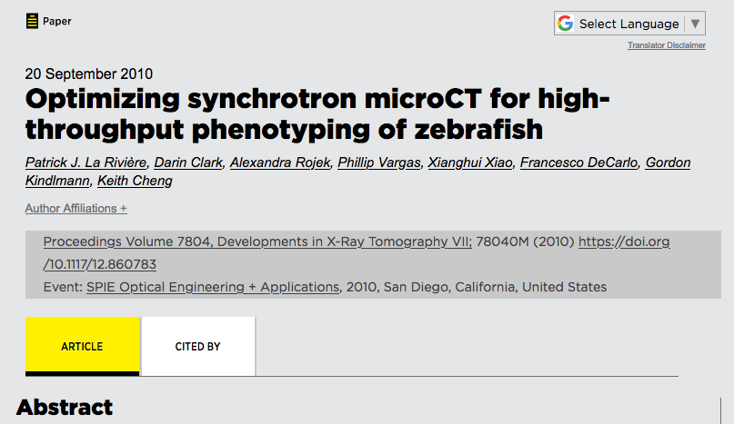

# Conference references


For change log, click [**here**](conference-reference.md#change-log).


## What is a conference reference?

A conference reference gives bibliographic details for work presented at a conference, or published in the proceedings for a conference. This usually means a paper, but this reference type should be used for posters as well. For simplicity, this page uses 'article' to mean both kinds of presentation.


## What needs to be added?

The following information can be added for journal references:

| Kriya field         | Mandatory?                                                            | XML element                                                                                                                        | Example                                                                                  |
| ------------------- | --------------------------------------------------------------------- | ---------------------------------------------------------------------------------------------------------------------------------- | ---------------------------------------------------------------------------------------- |
| Author(s)           | At least one author or collaboration is required; both can be present | \<person-group person-group-type="author">\<name>\<surname>Bloggs\</surname>\<given-names>J\</given-names>\</name>\</person-group> | Bloggs J                                                                                 |
| Collaboration(s)    | At least one author or collaboration is required; both can be present | \<person-group person-group-type="author">\<collab>Tulsa 1000 Investigators\</collab>\</person-group>                              | Tulsa 1000 Investigators                                                                 |
| Year                | Yes                                                                   | \<year iso-8601-date="2018">2018\</year>                                                                                           | 2018                                                                                     |
| Article title       | Yes                                                                   | \<article-title>Image-domain material decomposition using data-driven sparsity models for dual-energy CT\</article-title>          | Image-domain material decomposition using data-driven sparsity models for dual-energy CT |
| Conference name     | Yes                                                                   | \<conf-name>2018 IEEE 15th International Symposium on Biomedical Imaging (ISBI)\</conf-name>                                       | 2018 IEEE 15th International Symposium on Biomedical Imaging (ISBI)                      |
| Conference location | No                                                                    | \<conf-loc>Washington, DC, USA \</conf-loc>                                                                                        | Washington, DC, USA                                                                      |
| e-location ID       | No (if first/last pages are present, there can be no e-location ID)   | \<elocation-id>e51381\</elocation-id>                                                                                              | 78040M                                                                                   |
| First page          | No (if an e-location ID is present, there can be no first/last pages) | \<fpage>52\</fpage>                                                                                                                | 52                                                                                       |
| Last page           | No (if an e-location ID is present, there can be no first/last pages) | \<lpage>56\</lpage>                                                                                                                | 56                                                                                       |
| DOI                 | Yes (if there is one)                                                 | \<pub-id pub-id-type="doi">10.1109/ISBI.2018.8363521\</pub-id>                                                                     | 10.1109/ISBI.2018.8363521                                                                |

Non-mandatory fields are required if they exist. Check the source of the reference if possible (e.g. if the conference article is available online). Schematron warnings may also pick up incomplete references, and these should be checked at the source of the reference.

* **Authors**: Enter each author name as a surname(s) followed by initials.&#x20;
* **Collaboration:** Articles can have group or individual authors or a combination of both. Group authors should be placed in the order in which they appear in the original source. An author list can be a mix of both individual and group authors e.g. Smith J, Jones T, National Institutes of Health, Bloggs J etc.
* **Year**: This should be the year the conference article was presented/published. This field can include a letter suffix (e.g. 2020a) if needed to distinguish between citations (see more [**here**](../reference-citations.md#what-is-a-reference-citation)).
* **Article title**: The title of the conference article. Can contain italics, superscript and subscript as required.
* **Conference name**: The full  (not abbreviated) name of the conference at which the article was presented (or the proceedings thereof, where applicable e.g. [**Proceedings Volume 7804, Developments in X-Ray Tomography VII**](https://www.spiedigitallibrary.org/conference-proceedings-of-spie/7804.toc)).
* **Conference location**: Where the conference took place. Usually some combination of city, state and country.
* **e-location ID:** The e-location identifier for the article (if applicable; most references will have either page numbers or an e-location ID).
* **First page:** The page number on which the article starts (if applicable). Some page numbers will be prefixed with letters.
* **Last page:** The page number on which the article ends (if applicable; some articles are one-page long and so a last page is not required as it is the same as the first page). Some page numbers will be prefixed with letters.
* **DOI:** The Digital Object Identifier for the article (if applicable).

If any of the mandatory information is not provided, look up the article online. Conference articles are not consistently indexed at PubMed or CrossRef, so usually this will entail searching for the [**title and conference name**](conference-reference.md#finding-reference-details). If the information still can't be found, please leave the following author query, replacing 'XXXXXX' with the missing information:

* Please provide the XXXXXX for this reference.

## How to add a conference reference

Right-click where you want to add the citation and click on Add New > Add New Reference and select 'Conference' under Reference Type.

The default fields in Kriya will need to be altered to include the following information in the order below. To delete an unnecessary field click the red 'bin' button (if this doesn't work, try re-validating after all fields have been filled out, or change the field type to the one you need). To add a field click the green '+' button to the entry above where you need to add it.

* Author&#x20;
* Collaboration (if applicable)
* Year
* Article title
* Conference name
* Conference location (if applicable)
* e-location ID or first and last page (if available)
* DOI (if available)

Once you have entered the information in the fields, click on 'Search PubMed'. This will compare the information entered to the PubMed database and ensures that a PubMed ID (if available; only some conference proceedings are indexed at this site). If this does not generate results, click on 'Search Crossref', which may return results if the conference DOIs were registered at CrossRef.

Regardless of whether any corresponding PubMed or CrossRef records are returned, press 'Insert Reference' to add the entry to the reference list.


## Finding reference details

Details for conference references can usually be found online; searching the article title together with the conference name should provide a landing page if one is available.

In cases where the conference being cited is associated with the [**IEEE**](https://www.ieee.org), there will likely be both an online page for the article and a corresponding DOI. These should be easy to locate; an example record is given below.


Conferences in optics and photonics may be found at the [**SPIE Digital Library**](https://www.spiedigitallibrary.org) and will be assigned DOIs. For example, this conference article cited in [**10.7554/eLife.44898**](https://doi.org/10.7554/eLife.44898) has the following landing page:



## Schematron checks&#x20;

### Content checks

#### conf-doi-test-1

**Warning**: _XXXXXX is a conference ref without a doi, but it's a conference which is known to possibly have dois - (XXXXXX). Should it have one?_

**Action**: This warning indicates a reference to a conference article associated with an organisation that is known to register DOIs. Search the article title and conference name online to identify a corresponding DOI (if one exists). Please note that this warning does not indicate that the reference definitely has a DOI - articles from older conferences may not have associated DOIs, so if none can be found, ignore this warning.

#### err-elem-cit-confproc-10-1

**Error**: _\<conf-name> is required. Reference 'XXXXXX' has XXXXXX \<conf-name> elements._

**Action**: Every conference reference must contain a conference name. This error indicates that no conference name is present. Compare the reference to the original manuscript file to check for processing errors such as the conference name being tagged as a conference title or as part of the article title. If one has not been provided, please query the author with the following:

* Please provide the conference name for this reference.

#### err-elem-cit-confproc-12-3

**Error**: _If both \<lpage> and \<fpage> are present, the value of \<fpage> must be less than the value of \<lpage>. Reference 'XXXXXX' has \<lpage> XXXXXX, which is less than or equal to \<fpage> XXXXXX._

**Action**: This error will appear if a journal reference has a first page value larger than the last page value (this can happen if the authors truncate the last page, e.g. 123–34). If possible, look the article up online to find the correct page range. If this is not possible, add the following author query:

* Please provide the correct page range for this reference.

#### err-elem-cit-confproc-12-2&#x9;

**Error**: _The citation may contain no more than one of any of \<fpage>, \<lpage>, and \<elocation-id> elements. Reference 'XXXXXX' has XXXXXX \<fpage> elements, XXXXXX \<lpage> elements, and XXXXXX \<elocation-id> elements._

**Action:** This error will appear if a conference reference has more than one of any of the elements in the message (e.g. multiple first pages). Ensure that the beginning and end of a page range have been tagged as first page and last page respectively, and remove the extra instances of any duplicate elements.&#x20;

#### err-elem-cit-confproc-12-1

**Error**: _The citation may contain \<fpage> and \<lpage>, only \<fpage>, or only \<elocation-id> elements, but not a mixture. Reference 'XXXXXX' has XXXXXX \<fpage> elements, XXXXXX \<lpage> elements, and XXXXXX \<elocation-id> elements._

**Action**: This error will fire if a conference reference has both an elocation ID and page range. References should only have one or the other. Check the original article file to make sure this is not a processing error (such as the first page being captured as an elocation ID) and if this does not resolve the issue, try to find the conference article online.

If an eLocation ID is provided, this should usually be favoured over the page range.

#### err-elem-cit-confproc-12-4

**Error**: _The content of the \<fpage> and \<lpage> elements can contain any alpha numeric value but no child elements are allowed. Reference 'XXXXXX' has XXXXXX child elements in \<fpage> and XXXXXX child elements in \<lpage>._

**Action**: This error indicates that child elements are present within the first page and/or last page elements. Only plain text letters and numbers are permitted in these elements, so any formatting (bold, italics etc) or hyperlinks should be removed.

### Structure checks

#### err-elem-cit-confproc-2-1

**Error**: _One and only one person-group element is allowed. Reference 'XXXXXX' has XXXXXX \<person-group> elements._

**Action**: This error indicates that a conference reference has zero or more than one `<person-group>` elements. Look the conference article up online if possible to identify the correct author list. If there are no authors given or the article cannot be found, please raise an author query on the proof for the missing information.

* Please provide the author list for this reference.

#### err-elem-cit-confproc-2-2

**Error**: _Each \<person-group> must have a @person-group-type attribute of type 'author'. Reference 'XXXXXX' has a \<person-group> element with @person-group-type attribute 'XXXXXX'._

**Action**: Correct the \<person-group> element so that it has the attribute `person-group-type="author"`. This will either need to be done by removing all current authors and re-adding them, or by contacting the proofing system support team.

#### err-elem-cit-confproc-8-1

**Error**: _Each \<element-citation> of type 'confproc' must contain one and only one \<article-title> element. Reference 'XXXXXX' has XXXXXX \<article-title> elements._

**Action:** This error indicates that a conference reference either has no article title or more than one article title. If the article title is missing and cannot be located online using the other details provided (conference name, page range, DOI), please add the following author query:

* Please provide the title for this reference.

If the reference has more than one article title, it may indicate a processing error. Compare the reference to the original article file and correct accordingly.

#### err-elem-cit-confproc-8-2

**Error**: _An \<article-title> element in a reference may contain characters and \<italic>, \<sub>, and \<sup>. No other elements are allowed. Reference 'XXXXXX' does not meet this requirement._

**Action:** This error will appear if there are formatting elements in the article title other than italics, superscripts and subscripts (e.g. bold, underline). Make sure any disallowed formatting is removed.

#### err-elem-cit-confproc-10-2

**Error**: _No elements are allowed inside \<conf-name>. Reference 'XXXXXX' has child elements within the \<conf-name> element._

**Action:** This error will appear if there are elements in the conference name (e.g. formatting such as bold or italics, or hyperlinks). Delete the current contents of this field and paste in an unformatted version of the conference name.

#### err-elem-cit-confproc-11-2

**Error**: _No elements are allowed inside \<conf-loc>. Reference 'XXXXXX' has child elements within the \<conf-loc> element._

**Action:** This error will appear if there are elements in the conference location (e.g. formatting such as bold or italics, or hyperlinks). Delete the current contents of this field and paste in an unformatted version of the conference location.

#### err-elem-cit-confproc-16-1

**Error**: _A maximum of one \<pub-id> element is allowed. Reference 'XXXXXX' has XXXXXX \<pub-id> elements._

**Action**: Only one pub-id element (the DOI) is allowed in a conference reference. Any additional pub-ids should be removed.

#### err-elem-cit-confproc-17

**Error**: _The only tags that are allowed as children of \<element-citation> with the publication-type="confproc" are: \<person-group>, \<year>, \<article-title>, \<conf-loc>, \<conf-name>, \<fpage>, \<lpage>, \<elocation-id>, \<ext-link>, and \<pub-id>. Reference 'XXXXXX' has other elements._

**Action:** This error indicates that elements are present in a conference reference that are not allowed. Check the fields present in the reference match those given [**above**](conference-reference.md#what-needs-to-be-added). Update or remove any additional elements. If this does not clear the error, the support team may need to be consulted.

## XML structure

```markup
<ref id="bib17">
    <element-citation publication-type="confproc">
        <person-group person-group-type="author">
            <name><surname>Li</surname><given-names>Z</given-names></name>
            <name><surname>Ravishankar</surname><given-names>S</given-names></name>
            <name><surname>Long</surname><given-names>Y</given-names></name>
            <name><surname>Fessler</surname><given-names>JA</given-names></name>
        </person-group>
        <year iso-8601-date="2018">2018</year>
        <article-title>Image-domain material decomposition using data-driven 
        sparsity models for dual-energy CT</article-title>
        <conf-name>2018 IEEE 15th International Symposium on Biomedical Imaging</conf-name>
        <conf-loc>Province, RI</conf-loc>
        <fpage>1004</fpage>
        <lpage>1011</lpage>
        <pub-id pub-id-type="doi">10.1109/ISBI.2018.8363521</pub-id>
    </element-citation>
</ref>
```

## Change log

