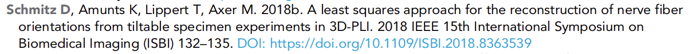
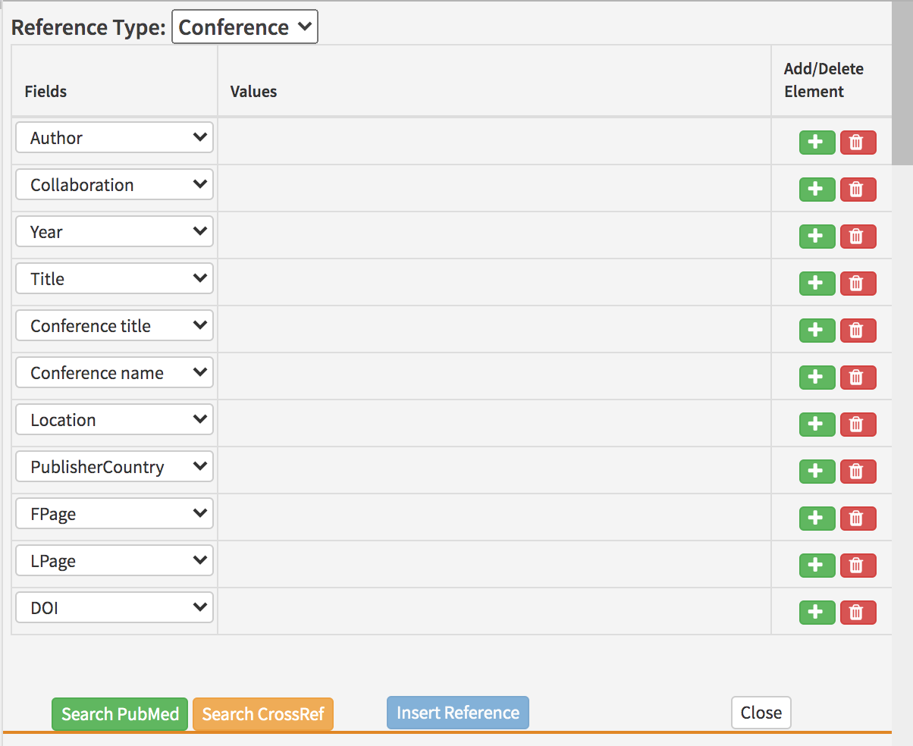

# Conference references

## What is a conference reference?

A conference reference gives bibliographic details for work presented at a conference, or published in the proceedings for a conference.



## What needs to be added?

The following information can be added for journal references:

| Kriya field | Mandatory? | XML element | Example |
| :--- | :--- | :--- | :--- |
| Author\(s\) | At least one author or collaboration is required; both can be present | &lt;person-group person-group-type="author"&gt;&lt;name&gt;&lt;surname&gt;Bloggs&lt;/surname&gt;&lt;given-names&gt;J&lt;/given-names&gt;&lt;/name&gt;&lt;/person-group&gt; | Bloggs J |
| Collaboration\(s\) | At least one author or collaboration is required; both can be present | &lt;person-group person-group-type="author"&gt;&lt;collab&gt;Tulsa 1000 Investigators&lt;/collab&gt;&lt;/person-group&gt; | Tulsa 1000 Investigators |
| Year | Yes | &lt;year iso-8601-date="2018"&gt;2018&lt;/year&gt; | 2018 |
| Article title | Yes | &lt;article-title&gt;Boundary learning by optimization with topological constraints&lt;/article-title&gt; | Boundary learning by optimization with topological constraints |
| Conference title | No | &lt;source&gt;Independent component analysis and signal separation&lt;/source&gt; | Independent component analysis and signal separation |
| Conference location | No | &lt;conf-loc&gt;Province, RI&lt;/conf-loc&gt; | Province, RI |
| Conference data | No | &lt;&lt;conf-date&gt;&lt;/conf-date&gt; |  |
| Conference name | Yes | &lt;conf-name&gt;2018 IEEE 15th International Symposium on Biomedical Imaging \(ISBI\)&lt;/conf-name&gt; | 2018 IEEE 15th International Symposium on Biomedical Imaging \(ISBI\) |
| e-location ID | No \(if first/last pages are present, there can be no e-location ID\) | &lt;elocation-id&gt;e51381&lt;/elocation-id&gt; | e51381 |
| First page | No \(if an e-location ID is present, there can be no first/last pages\) | &lt;fpage&gt;132&lt;/fpage&gt; | 132 |
| Last page | No \(if an e-location ID is present, there can be no first/last pages\) | &lt;lpage&gt;135&lt;/lpage&gt; | 135 |
| DOI | Yes \(if there is one\) | &lt;pub-id pub-id-type="doi"&gt; | 10.1083/jcb.200510010 |

**Non-mandatory fields are required if they exist**. Validation of references via PubMed or Crossref API tools should pull them in if the author did not provide them. Schematron warnings may also pick up incomplete references, and these should be checked at the source of the reference.

* **Authors**: Enter each author name as a surname\(s\) followed by initials. 
* **Collaboration:** Articles can have group or individual authors or a combination of both. Group authors should be placed in the order in which they appear in the original source. An author list can be a mix of both individual and group authors e.g. Smith J, Jones T, National Institutes of Health, Bloggs J etc.
* **Year**: This should be the year the article was published. This field can include a letter suffix \(e.g. 2020a\) if needed to distinguish between citations \(see more [here](../reference-citations.md#what-is-a-reference-citation)\).
* **Article title**: The title of the article. Can contain italics, superscript and subscript as required.
* **Journal name**: The full \(not abbreviated\) name of the journal in which the article was published.
* **Volume:** The volume of the journal in which the article was published \(if applicable\). eLife does not include issue numbers in journal references, so this information does not need to be added.
* **e-location ID:** The e-location identifier for the article \(if applicable; most journal references will have either page numbers or an e-location ID\).
* **First page:** The page number on which the article starts \(if applicable; most journal references will have either page numbers or an e-location ID\). Some page numbers will be prefixed with letters.
* **Last page:** The page number on which the article ends \(if applicable; some articles are one-page long and so a last page is not required as it is the same as the first page\). Some page numbers will be prefixed with letters.
* **DOI:** The Digital Object Identifier for the article \(if applicable\).
* **PMID:** The PubMed Identifier for the article \(if applicable\). This will not be supplied by the author but is added during pre-editing via the PubMed API tool.
* **InPress**: If a paper has been accepted for publication but the final publication details are not yet known, this field should have the text 'In press'. 

If any of the mandatory information is not provided, look up the article on [**PubMed**](https://pubmed.ncbi.nlm.nih.gov/) or the journal website. If the information still can't be found, please leave the following author query, replacing 'XXXXXX' with the missing information:

* Please provide the XXXXXX for this reference.


## How to add a conference reference

Right-click where you want to add the citation and click on Add New &gt; Add New Reference and select Conference under Reference Type.

The default fields in Kriya will need to be altered to include the following information in the order below. To delete an unnecessary field click the red 'bin' button \(if this doesn't work, try re-validating after all fields have been filled out, or change the field type to the one you need\). To add a field click the green '+' button to the entry above where you need to add it.

* Author 
* Collaboration \(if applicable\)
* Year 
* Article title
* Conference title \(if applicable\)
* Conference location \(if applicable\)
* Conference name
* e-location ID or first and last page \(if available\)
* DOI \(if available\)




## Finding reference details

Details for conference references can usually be found online, however there is no central indexing service for conferences as there is for journals \(PubMed\). Searching the article title together with the conference name should provide a landing page if one is available.

If the conference is one associated with the [**IEEE**](https://www.ieee.org/), there will likely be both an online page for the article and a corresponding DOI.


## Schematron checks 

### Content checks

#### conf-doi-test-1

**Warning**: _XXXXXX is a conference ref without a doi, but it's a conference which is know to possibly have dois - \(XXXXXX\). Should it have one?_

**Action**: This warning indicates a reference to a conference article associated with an organisation that is known to register DOIs. Search the article title and conference name online to identify a corresponding DOI \(if one exists\).

#### err-elem-cit-confproc-8-1

**Error**: _Each &lt;element-citation&gt; of type 'confproc' must contain one and only one &lt;article-title&gt; element. Reference 'XXXXXX' has XXXXXX &lt;article-title&gt; elements._

\_\_

#### err-elem-cit-confproc-9-1

**Error**: _Each &lt;element-citation&gt; of type 'confproc' must not contain more than one &lt;source&gt; element\(s\). Reference 'XXXXXX' has XXXXXX &lt;source&gt; elements._

**Action**:

#### err-elem-cit-confproc-10-1

**Error**: _&lt;conf-name&gt; is required. Reference 'XXXXXX' has XXXXXX &lt;conf-name&gt; elements._

**Action**: 

#### err-elem-cit-confproc-12-3

**Error**: _If both &lt;lpage&gt; and &lt;fpage&gt; are present, the value of &lt;fpage&gt; must be less than the value of &lt;lpage&gt;. Reference 'XXXXXX' has &lt;lpage&gt; XXXXXX, which is less than or equal to &lt;fpage&gt; XXXXXX._

**Action**:

#### err-elem-cit-confproc-12-2	

**Error**: _The citation may contain no more than one of any of &lt;fpage&gt;, &lt;lpage&gt;, and &lt;elocation-id&gt; elements. Reference 'XXXXXX' has XXXXXX &lt;fpage&gt; elements, XXXXXX &lt;lpage&gt; elements, and XXXXXX &lt;elocation-id&gt; elements._

**Action**:

#### err-elem-cit-confproc-12-1

**Error**: _The citation may contain &lt;fpage&gt; and &lt;lpage&gt;, only &lt;fpage&gt;, or only &lt;elocation-id&gt; elements, but not a mixture. Reference 'XXXXXX' has XXXXXX &lt;fpage&gt; elements, XXXXXX &lt;lpage&gt; elements, and XXXXXX &lt;elocation-id&gt; elements._

**Action**:

#### err-elem-cit-confproc-12-4

**Error**: _The content of the &lt;fpage&gt; and &lt;lpage&gt; elements can contain any alpha numeric value but no child elements are allowed. Reference 'XXXXXX' has XXXXXX child elements in &lt;fpage&gt; and XXXXXX child elements in &lt;lpage&gt;._

**Action:**

#### err-elem-cit-confproc-16-1

**Error**: _A maximum of one &lt;pub-id&gt; element is allowed. Reference 'XXXXXX' has XXXXXX &lt;pub-id&gt; elements._

**Action**:

#### err-elem-cit-confproc-2-2

**Error**: _Each &lt;person-group&gt; must have a @person-group-type attribute of type 'author'. Reference 'XXXXXX' has a &lt;person-group&gt; element with @person-group-type attribute 'XXXXXX'._

**Action**:

#### err-elem-cit-confproc-9-2-2

**Error**: _A &lt;source&gt; element within a &lt;element-citation&gt; of type 'confproc' may only contain the child elements&lt;italic&gt;, &lt;sub&gt;, and &lt;sup&gt;. No other elements are allowed. Reference 'XXXXXX' has child elements that are not allowed._

**Action**:

#### err-elem-cit-confproc-8-2

**Error**: _An &lt;article-title&gt; element in a reference may contain characters and &lt;italic&gt;, &lt;sub&gt;, and &lt;sup&gt;. No other elements are allowed. Reference 'XXXXXX' does not meet this requirement._

**Action**:

#### err-elem-cit-confproc-10-2

**Error**: _No elements are allowed inside &lt;conf-name&gt;. Reference 'XXXXXX' has child elements within the &lt;conf-name&gt; element._

**Action**:

#### err-elem-cit-confproc-11-2

**Error**: _No elements are allowed inside &lt;conf-loc&gt;. Reference 'XXXXXX' has child elements within the &lt;conf-loc&gt; element._

**Action**: 

### Structure checks

#### err-elem-cit-confproc-2-1

Error: One and only one person-group element is allowed. Reference 'XXXXXX' has XXXXXX &lt;person-group&gt; elements.

**Action**:

#### err-elem-cit-confproc-17

**Error**: _The only tags that are allowed as children of &lt;element-citation&gt; with the publication-type="confproc" are: &lt;person-group&gt;, &lt;year&gt;, &lt;article-title&gt;, &lt;source&gt;, &lt;conf-loc&gt;, &lt;conf-name&gt;, &lt;fpage&gt;, &lt;lpage&gt;, &lt;elocation-id&gt;, &lt;ext-link&gt;, and &lt;pub-id&gt;. Reference 'XXXXXX' has other elements._

**Action:** This error indicates that elements are present in a conference reference that are not allowed.

## XML structure

```markup
<ref id="bib17">
    <element-citation publication-type="confproc">
        <person-group person-group-type="author">
            <name><surname>Funke</surname><given-names>J</given-names></name>
            <name><surname>Andres</surname><given-names>B</given-names></name>
            <name><surname>Hamprecht</surname><given-names>F</given-names></name>
            <name><surname>Cardona</surname><given-names>A</given-names></name>
            <name><surname>Cook</surname><given-names>M</given-names></name>
        </person-group>
        <year iso-8601-date="2012">2012</year>
        <article-title>Efficient automatic 3D reconstruction of branching neurons
        from EM data</article-title>
        <conf-name>Computer Vision and Pattern Recognition</conf-name>
        <conf-date>16-21 June 2012</conf-date>
        <conf-loc>Province, RI</conf-loc>
        <fpage>1004</fpage>
        <lpage>1011</lpage>
    </element-citation>
</ref>
```

