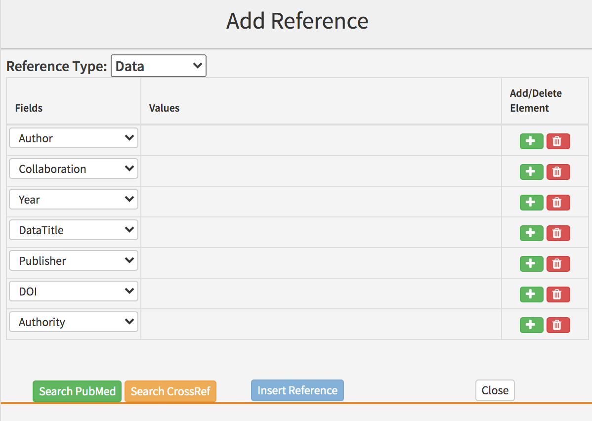
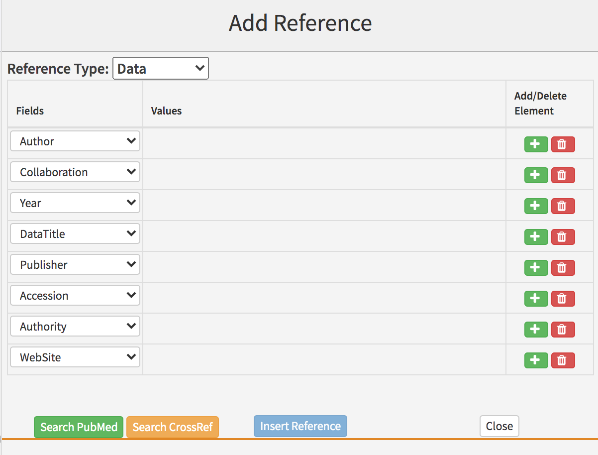

# Data references

## What is a data reference?

A data reference gives bibliographic details for a dataset deposited with a structured repository, database or other data-sharing platform. These may be in addition to those in the [**data availability section**](../data-availability.md), or they may repeat those listed in that section.

## What needs to be added?

The following information can be added for data references:

| Kriya field | Mandatory? | XML element | Example |
| :--- | :--- | :--- | :--- |
| Author\(s\) | At least one author or collaboration is required; both can be present | &lt;person-group person-group-type="author"&gt;&lt;name&gt;&lt;surname&gt;Bloggs&lt;/surname&gt;&lt;given-names&gt;J&lt;/given-names&gt;&lt;/name&gt;&lt;/person-group&gt; | Bloggs J |
| Collaboration\(s\) | At least one author or collaboration is required; both can be present | &lt;person-group person-group-type="author"&gt;&lt;collab&gt;Tulsa 1000 Investigators&lt;/collab&gt;&lt;/person-group&gt; | Tulsa 1000 Investigators |
| Year | Yes | &lt;year iso-8601-date="2008"&gt;2008&lt;/year&gt; | 2008 |
| Dataset title | Yes | &lt;data-title&gt;Transcriptomes of the hybrid mouse diversity panel subjected to Isoproterenol challenge&lt;/data-title&gt; | Transcriptomes of the hybrid mouse diversity panel subjected to Isoproterenol challenge |
| Database | Yes | &lt;source&gt;NCBI Gene Expression Omnibus&lt;/source&gt; | NCBI Gene Expression Omnibus |
| Accession | Yes, or DOI should be present | &lt;pub-id assigning-authority="NCBI" pub-id-type="accession" xlink:href="https://www.ncbi.nlm.nih.gov/geo/query/acc.cgi?acc=GSE48760"&gt;GSE48760&lt;/pub-id&gt; | GSE48760 |
| DOI | Yes, or Accession should be present | &lt;pub-id assigning-authority="Dryad" pub-id-type="doi"&gt;10.5061/dryad.zcrjdfn8n&lt;/pub-id&gt; | 10.5061/dryad.zcrjdfn8n |
| Assigning authority | No | assigning-authority="NCBI" | NCBI |

**Non-mandatory fields are required if they exist**.

* **Authors**: Enter each author name as a surname\(s\) followed by initials. 
* **Collaboration:** Articles can have group or individual authors or a combination of both. Group authors should be placed in the order in which they appear in the original source. An author list can be a mix of both individual and group authors e.g. Smith J, Jones T, National Institutes of Health, Bloggs J etc.
* **Year**: This should be the year the article was published. This field can include a letter suffix \(e.g. 2020a\) if needed to distinguish between citations \(see more [here](../reference-citations.md#what-is-a-reference-citation)\).
* **Dataset title**: The title of the dataset. Can contain italics, superscript and subscript as required.
* **Database**: The full \(not abbreviated\) name of the database in which the dataset is stored.
* **Accession**: A unique identifier for the dataset. Usually an alphanumeric string e.g. GSE48760, EMD-22286, MSV000086293 etc. Must be accompanied by a URL for the dataset which may or may not contain the accession number as well.
* **DOI:** The Digital Object Identifier for the dataset.
* **Assigning authority**: The body that assigned the accession number or DOI to the dataset.

If any of the mandatory information is not provided, look up the dataset online, preferably using the URL provided. If the information still can't be found, please leave the following author query, replacing 'XXXXXX' with the missing information:

* Please provide the XXXXXX for this reference.

## How to add a data reference

Right-click where you want to add the citation and click on Add New &gt; Add New Reference and select Data under Reference Type.

The default fields in Kriya will need to be altered to include the following information in the order below. To delete an unnecessary field click the red 'bin' button \(if this doesn't work, try re-validating after all fields have been filled out, or change the field type to the one you need\). To add a field click the green '+' button to the entry above where you need to add it.

* Author 
* Collaboration \(if applicable\)
* Year 
* Data title
* Publisher
* DOI \[OR\] Accession
* Authority
* Website \[if using Accession\]

Once you have entered the information in the fields, click on 'Search Crossref'. This will likely return no results. When the search has completed, hit 'Insert Reference' to add the dataset to the reference list.

## Finding reference details

In most cases, where a dataset is cited, a URL will have been provided that will lead directly to a landing page including all the details required for the reference. For example, [**https://www.ncbi.nlm.nih.gov/geo/query/acc.cgi?acc=GSE48760**](https://www.ncbi.nlm.nih.gov/geo/query/acc.cgi?acc=GSE48760), [**https://doi.org/10.5061/dryad.pzgmsbcgc**](https://doi.org/10.5061/dryad.pzgmsbcgc), or [**https://massive.ucsd.edu/ProteoSAFe/dataset.jsp?task=715e60ce44ae4ecea2b84e28dd336c01**](https://massive.ucsd.edu/ProteoSAFe/dataset.jsp?task=715e60ce44ae4ecea2b84e28dd336c01). However, some of these landing pages are more useful than others for checking the details required for a reference. Compare GEO to MassIVE:

The NCBI Gene Expression Omnibus \(GEO\) has highly structured landing pages that clearly show the title and contributors \(authors\) for each dataset. So with a GEO URL, it is easy to locate the full details.

The Mass Sepctrometry Interactive Virtual Environment \(MassIVE\), however, only clearly shows the title for the article. Author details are limited to the citation associated with the data and the primary contact \(effectivley corresponding author\) for the dataset. Since the authors for the dataset may differ from those on the associated publication and the contact is unlikely to be solely responsible for collecting the data, an author query may be required to seek the full author list for the reference.

In cases where no URL has been provided but an accession number is available, it should be possible to find the URL either by searching in the indicated database or by plugging the accession number into known URL structures. See [**here**](../data-availability.md#database-examples) for a table of commonly used databases and their associated URL structures.

## Schematron checks

### Structure checks

#### err-elem-cit-data-3-1

**Error**: _Data references must have one and only one &lt;person-group person-group-type='author'&gt;. Reference 'XXXXXX' has XXXXXX._

**Action**: This error indicates either that there is more than one `<person-group>` element with the attribute `person-group-type` equal to "author", "compiler" or "curator, or that there is one or more `<person-group>` element with another value for this attribute. Multiple author, compiler or curator lists should be combined and any `<person-group>` elements with incorrect attributes should be corrected. The latter will likely require support team intervention. Please note that while eLife allows compliers and curators in addition or instead of authors on datasets, the systems are not set up to allow this at present.

#### pre-err-elem-cit-data-3-2

**Warning**: _Data references must have one and only one &lt;person-group person-group-type='author'&gt;. Reference 'XXXXXX' has 0. If this information is missing, please query the authors asking for it._

**Action**: This warning indicates that a data reference has zero &lt;person-group&gt; elements. If possible, look the dataset up online to identify the correct author list. If there are no authors given or the dataset cannot be found, please raise an author query on the proof for the missing information.

* Please provide the author list for this reference.

#### final-err-elem-cit-data-3-2	

**Error**: _Data references must have one and only one &lt;person-group person-group-type='author'&gt;. Reference 'XXXXXX' has 0._

**Action**: This error indicates that a data reference has zero &lt;person-group&gt; elements. If possible, look the dataset up online to identify the correct author list. If there are no authors given or the dataset cannot be found, please query the authors for the missing information.

#### err-elem-cit-data-10

**Error**: _\[err-elem-cit-data-10\] Each &lt;element-citation&gt; of type 'data' must contain one and only one &lt;data-title&gt; element. Reference 'XXXXXX' has XXXXXX &lt;data-title&gt; elements._

**Action**: This error indicates that a data reference either has no title or more than one title. If the title is missing and cannot be located online using the other details provided \(accession, DOI\), please add the following author query:

* Please provide the title for this reference.

If the reference has more than one title, it may indicate a processing error. Compare the reference to the original article file and correct accordingly.

#### err-elem-cit-data-11-2

**Error**: _\[err-elem-cit-data-11-2\] Each &lt;element-citation&gt; of type 'data' must contain one and only one &lt;source&gt; element. Reference 'XXXXXX' has XXXXXX &lt;source&gt; elements._

**Action**: This error indicates that more than one &lt;source&gt; element \(database name\) is present in a conference reference. The extra &lt;source&gt; elements should be removed — however please check whether the contents should be moved to the dataset title or the database name fields first. If possible locate the dataset online to check for the correct details.

#### err-elem-cit-data-11-3-2

**Error**: _\[err-elem-cit-data-11-3-2\] A &lt;source&gt; element within a &lt;element-citation&gt; of type 'data' may only contain the child elements&lt;italic&gt;, &lt;sub&gt;, and &lt;sup&gt;. No other elements are allowed. Reference 'XXXXXX' has disallowed child elements._

**Action**: This error will appear if there are formatting elements in the `<source>` element \(database name\) other than italics, superscripts and subscripts \(e.g. bold, underline\). Make sure any disallowed formatting is removed.

#### err-elem-cit-data-13-1

**Error**: _\[err-elem-cit-data-13-1\] There must be at least one pub-id OR an &lt;ext-link&gt;. There may be more than one pub-id. Reference 'XXXXXX' has XXXXXX &lt;pub-id elements and XXXXXX &lt;ext-link&gt; elements._

**Action**: 

#### err-elem-cit-data-17-1

**Error**: _\[err-elem-cit-data-17-1\] The &lt;ext-link&gt; element is required if there is no &lt;pub-id&gt;. Reference 'XXXXXX' has XXXXXX &lt;pub-id&gt; elements and XXXXXX &lt;ext-link&gt; elements._

**Action**:

#### err-elem-cit-data-18

**Error**: _\[err-elem-cit-data-18\] The only tags that are allowed as children of &lt;element-citation&gt; with the publication-type="data" are: &lt;person-group&gt;, &lt;data-title&gt;, &lt;source&gt;, &lt;year&gt;, &lt;pub-id&gt;, &lt;version&gt;, and &lt;ext-link&gt;. Reference 'XXXXXX' has other elements._

**Action**: 

#### err-elem-cit-data-14-2

**Error**: _\[err-elem-cit-data-14-2\] If the pub-id is of pub-id-type doi, it may not have an @xlink:href. Reference 'XXXXXX' has a &lt;pub-id element with type doi and an @link-href with value 'XXXXXX'._

**Action**: This error indicates that the attribute `@xlink:href` is present on a DOI in a data reference. The proofing system support team will need to remove this attribute.

#### err-elem-cit-data-13-2

**Error**: _\[err-elem-cit-data-13-2\] Each pub-id element must have a pub-id-type which is either accession or doi. Reference 'XXXXXX' has a &lt;pub-id element with the type 'XXXXXX'._

**Action**: 

#### err-elem-cit-data-14-1

**Error**: _\[err-elem-cit-data-14-1\] If the pub-id is of any pub-id-type except doi, it must have an @xlink:href. Reference 'XXXXXX' has a &lt;pub-id element with type 'XXXXXX' but no @xlink-href._

**Action**: 

