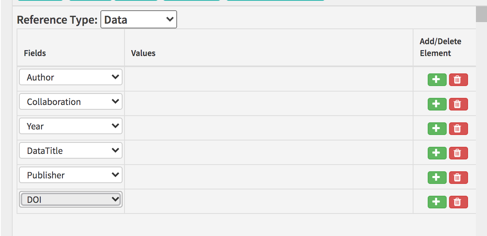
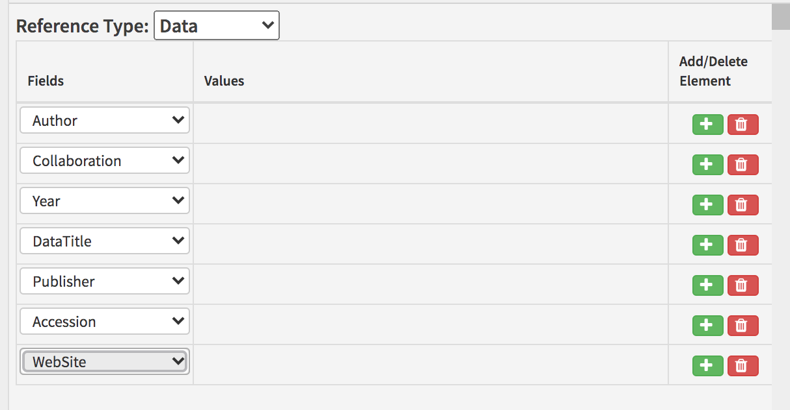
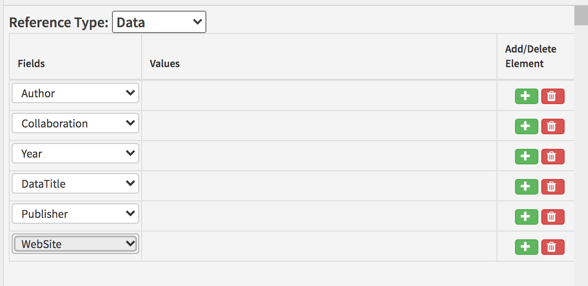
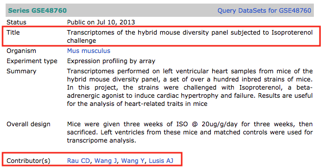
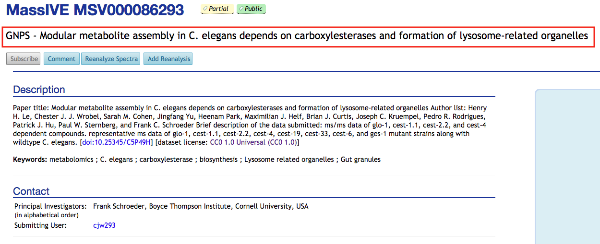

# Data references


For change log, click [**here**](data-references.md#changelog).


## What is a data reference?

A data reference gives bibliographic details for a dataset deposited in a structured repository, database or other data-sharing platform. These may be in addition to those in the [**data availability section**](../data-availability.md), or they may repeat those listed in that section, where the authors wish to directly cite them in the text.

## What needs to be added?

The following information can be added for data references:

| Kriya field | Mandatory? | XML element | Example |
| :--- | :--- | :--- | :--- |
| Author\(s\) | At least one author or collaboration is required; both can be present | &lt;person-group person-group-type="author"&gt;&lt;name&gt;&lt;surname&gt;Bloggs&lt;/surname&gt;&lt;given-names&gt;J&lt;/given-names&gt;&lt;/name&gt;&lt;/person-group&gt; | Bloggs J |
| Collaboration\(s\) | At least one author or collaboration is required; both can be present | &lt;person-group person-group-type="author"&gt;&lt;collab&gt;Tulsa 1000 Investigators&lt;/collab&gt;&lt;/person-group&gt; | Tulsa 1000 Investigators |
| Year | Yes | &lt;year iso-8601-date="2008"&gt;2008&lt;/year&gt; | 2008 |
| Dataset title | Yes | &lt;data-title&gt;Transcriptomes of the hybrid mouse diversity panel subjected to Isoproterenol challenge&lt;/data-title&gt; | Transcriptomes of the hybrid mouse diversity panel subjected to Isoproterenol challenge |
| Publisher | Yes | &lt;source&gt;NCBI Gene Expression Omnibus&lt;/source&gt; | NCBI Gene Expression Omnibus |
| Accession | No | &lt;pub-id assigning-authority="NCBI" pub-id-type="accession" xlink:href="https://www.ncbi.nlm.nih.gov/geo/query/acc.cgi?acc=GSE48760"&gt;GSE48760&lt;/pub-id&gt; | GSE48760 |
| DOI | No | &lt;pub-id assigning-authority="Dryad" pub-id-type="doi"&gt;10.5061/dryad.zcrjdfn8n&lt;/pub-id&gt; | 10.5061/dryad.zcrjdfn8n |
| Website | Yes unless a DOI is present | &lt;ext-link ext-link-type="uri" xlink:href="https://github.com/ChristofferNellaker/Clinical\_Face\_Phenotype\_Space\_Pipeline"&gt;                 https://github.com/ChristofferNellaker/Clinical\_Face\_Phenotype\_Space\_Pipeline&lt;/ext-link&gt; | https://github.com/ChristofferNellaker/Clinical\_Face\_Phenotype\_Space\_Pipeline |

Non-mandatory fields are required if they exist.

* **Authors**: Enter each author name as a surname\(s\) followed by initials. 
* **Collaboration:** Articles can have group or individual authors or a combination of both. Group authors should be placed in the order in which they appear in the original source. An author list can be a mix of both individual and group authors e.g. Smith J, Jones T, National Institutes of Health, Bloggs J etc.
* **Year**: This should be the year the article was published. This field can include a letter suffix \(e.g. 2020a\) if needed to distinguish between citations \(see more [here](../reference-citations.md#what-is-a-reference-citation)\).
* **Dataset title**: The title of the dataset. Can contain italics, superscript and subscript as required.
* **Publisher**: The full \(not abbreviated\) name of the database in which the dataset is stored.
* **Accession**: A unique identifier for the dataset. Usually an alphanumeric string e.g. GSE48760, EMD-22286, MSV000086293 etc. Must be accompanied by a website for the dataset, which may or may not contain the accession number as well. Must not be included if DOI used.
* **DOI:** The Digital Object Identifier for the dataset. Must not be included if Accession used.
* **Website**: If a dataset has a DOI, a website URL is not required. Otherwise, every dataset must have a URL. Note that if this is accompanied by an accession number, it will be tagged as an attribute on a `<pub-id>` element. If not, it will be included as an `<ext-link>` element. This will not affect display but will affect the underlying XML.

If any of the mandatory information is not provided, look up the dataset online using the title, identifier and/or URL provided. If the information still can't be found, please leave the following author query, replacing 'XXXXXX' with the missing information:

* Please provide the XXXXXX for this reference.

## How to add a data reference

Right-click where you want to add the citation and click on Add New &gt; Add New Reference and select Data under Reference Type.

The default fields in Kriya will need to be altered to include the following information in the order below. To delete an unnecessary field click the red 'bin' button \(if this doesn't work, try re-validating after all fields have been filled out, or change the field type to the one you need\). To add a field click the green '+' button to the entry above where you need to add it.

* Author 
* Collaboration \(if applicable\)
* Year 
* Data title
* Publisher
* DOI \[OR\] Accession \(where applicable\)
* Website \[must be added if using accession; must not be added if using DOI\]







Once you have entered the information in the fields, click on 'Search Crossref'. This will likely return no results. Regardless of whether it does, once the search has completed, hit 'Insert Reference' to add the dataset to the reference list.

## Finding reference details

In most cases, where a dataset is cited, a URL will have been provided that will lead directly to a landing page including all the details required for the reference. For example, [**https://www.ncbi.nlm.nih.gov/geo/query/acc.cgi?acc=GSE48760**](https://www.ncbi.nlm.nih.gov/geo/query/acc.cgi?acc=GSE48760), [**https://doi.org/10.5061/dryad.pzgmsbcgc**](https://doi.org/10.5061/dryad.pzgmsbcgc), or [**https://massive.ucsd.edu/ProteoSAFe/dataset.jsp?task=715e60ce44ae4ecea2b84e28dd336c01**](https://massive.ucsd.edu/ProteoSAFe/dataset.jsp?task=715e60ce44ae4ecea2b84e28dd336c01). However, some of these landing pages are more useful than others for checking the details required for a reference. Compare GEO to MassIVE:



The NCBI Gene Expression Omnibus \(GEO\) has highly structured landing pages that clearly show the title and contributors \(authors\) for each dataset. So with a GEO URL, it is easy to locate the full details.



The Mass Spectrometry Interactive Virtual Environment \(MassIVE\), however, only clearly shows the title for the article. Author details are limited to the citation associated with the data and the primary contact \(effectively corresponding author\) for the dataset. Since the authors for the dataset may differ from those on the associated publication and the contact is unlikely to be solely responsible for collecting the data, an author query may be required to seek the full author list for the reference.

In cases where no URL has been provided but an accession number is available, it should be possible to find the URL either by searching in the indicated database or by plugging the accession number into known URL structures. See [**here**](../data-availability.md#database-examples) for a table of commonly used databases and their associated URL structures.

## Schematron checks

### Structure checks

#### err-elem-cit-data-3-1

**Error**: _Data references must have one and only one &lt;person-group person-group-type='author'&gt;. Reference 'XXXXXX' has XXXXXX._

**Action**: This error indicates either that there is more than one `<person-group>` element with the attribute `person-group-type` equal to "author" or that there is one or more `<person-group>` element with another value for this attribute. Multiple author lists should be combined and any `<person-group>` elements with incorrect attributes should be corrected. The latter will likely require support team intervention.

Please note that while eLife allows compliers and curators in addition or instead of authors on datasets, the systems are not set up to allow this at present.

#### pre-err-elem-cit-data-3-2

**Warning**: _Data references must have one and only one &lt;person-group person-group-type='author'&gt;. Reference 'XXXXXX' has 0. If this information is missing, please query the authors asking for it._

**Action**: This warning will fire at pre-author stages, indicating that a data reference has zero `<person-group>` elements. If possible, look the dataset up online to identify the correct author list. If there are no authors given or the dataset cannot be found, please raise an author query on the proof for the missing information.

* Please provide the author list for this reference.

#### final-err-elem-cit-data-3-2	

**Error**: _Data references must have one and only one &lt;person-group person-group-type='author'&gt;. Reference 'XXXXXX' has 0._

**Action**: This error will fire at final stages, indicating that a data reference has zero `<person-group>` elements. If possible, look the dataset up online to identify the correct author list. If there are no authors given or the dataset cannot be found, please query the authors for the missing information.

#### pre-err-elem-cit-data-10

**Warning**: _Data reference 'XXXXXX' has XXXXXX data-title elements, when it should contain one. If this information is missing, please query it with the authors._

**Action**: This warning will fire at pre-author stages, indicating that a data reference either has no title or more than one title. If the title is missing and cannot be located online using the other details provided \(accession, DOI\), please add the following author query:

* Please provide the title for this reference.

If the reference has more than one title, it may indicate a processing error. Compare the reference to the original article file and correct accordingly, combining the multiple titles into one field.

#### final-err-elem-cit-data-10

**Error**: Data reference 'XXXXXX' has XXXXXX data-title elements. It must contain one \(and only one\).

**Action**: This error will fire at final stages, indicating that a data reference either has no title or more than one title. If the title is missing and cannot be located online using the other details provided \(accession, DOI\), please query the authors.

If the reference has more than one title, it may indicate a processing error and should be corrected, combining the multiple titles into one field.

#### pre-err-elem-cit-data-11-2

**Warning**: _Data reference 'XXXXXX' has XXXXXX source elements, when it should contain one. If this information is missing, please query it with the authors._

**Action**: This warning will fire at pre-author stages, indicating that more than one `<source>` element \(database name\) is present in a data reference. The extra `<source>` elements should be removed — however please check whether the contents should be moved to the dataset title or the database name fields first. If possible locate the dataset online to check for the correct details.

#### final-err-elem-cit-data-11-2

**Error**: _Data reference 'XXXXXX' has XXXXXX source elements. It must contain one \(and only one\)._

**Action**: This error will fire at final stages, indicating that more than one `<source>` element \(database name\) is present in a data reference. The extra `<source>` elements should be removed — however please check whether the contents should be moved to the dataset title or the database name fields first. If possible locate the dataset online to check for the correct details.

#### err-elem-cit-data-11-3-2

**Error**: _A &lt;source&gt; element within a &lt;element-citation&gt; of type 'data' may only contain the child elements &lt;italic&gt;, &lt;sub&gt;, and &lt;sup&gt;. No other elements are allowed. Reference 'XXXXXX' has disallowed child elements._

**Action**: This error will appear if there are formatting elements in the article title other than italics, superscripts and subscripts \(e.g. bold, underline\). Make sure any disallowed formatting is removed from the article title.

#### pre-err-elem-cit-data-13-1

**Warning**_:_ _There should be one \(and only one\) pub-id or one \(and only one\) ext-link. Reference 'XXXXXX' has XXXXXX &lt;pub-id&gt; elements and XXXXXX &lt;ext-link&gt; elements. If this information is missing, please query it with the authors._

**Action**: One pub-id \(`<pub-id>`, DOI or accession number\) or one URL \(`<ext-link>`\) must be present in a data reference. This error indicates \(at pre-author stages\) that none or more than one of these is present in the reference. If more than one URL is present, check whether the provided URL has been mistagged e.g. split into two fields and correct accordingly. Extra URLs will need to be removed; if more than one URL has been provided per data reference, the Production team should be alerted and they will need to investigate the issue \(e.g. maybe the author is citing multiple datasets at once\).

If no DOI, accession number, or URL has been provided, query the author for the required information:

* Please provide the identifier, DOI, or URL for this dataset.

#### final-err-elem-cit-data-13-1

**Error**: T_here must be one \(and only one\) pub-id or one \(and only one\) ext-link. Reference 'XXXXXX' has XXXXXX &lt;pub-id&gt; elements and XXXXXX &lt;ext-link&gt; elements._

**Action**: One pub-id \(`<pub-id>`, DOI or accession number\) or one URL \(`<ext-link>`\) must be present in a data reference. This error indicates \(at final stages\) that none or more than one of these is present in the reference. Where applicable, locate the missing information and add it in, or remove the extra elements. The author may need to be queried if no identifier or URL has been provided, or multiple URLs have been provided for one dataset.

#### elem-cit-data-pub-id-ext-link

**Error**: _Dataset reference 'XXXXXX' has both &lt;pub-id&gt; &lt;ext-link&gt; elements. There can only be one or the other, not both._

**Action**: One pub-id \(`<pub-id>`, DOI or accession number\) or one URL \(`<ext-link>`\) must be present in a data reference. This error indicates that both are present. If the reference contains a DOI, edit it to remove any website field present in the system; only the DOI is required. if the reference has an accession number, this is likely a tagging error. Try revalidating the reference and if this does not resolve the problem, it will need to be escalated to the support team.

#### pre-err-elem-cit-data-17-1

**Warning**: _The &lt;ext-link&gt; element is required if there is no &lt;pub-id&gt;. Reference 'XXXXXX' has XXXXXX &lt;pub-id&gt; elements and XXXXXX &lt;ext-link&gt; elements. If this information is missing, please query it with the authors._

**Action**: Where neither a DOI nor an accession number is present, a URL must be provided. This warning indicates \(at pre-author stages\) that no URL has been given for a reference with no DOI or accession. Query the author for the missing details:

* Please provide the identifier, DOI, or URL for this dataset.

#### final-err-elem-cit-data-17-1

**Error**: _The &lt;ext-link&gt; element is required if there is no &lt;pub-id&gt;. Reference 'XXXXXX' has XXXXXX &lt;pub-id&gt; elements and XXXXXX &lt;ext-link&gt; elements._

**Action**: Where neither a DOI nor an accession number is present, a URL must be provided. This warning \(at final stages\) indicates that no URL has been given for a reference with no DOI or accession. The author will need to be contacted to provide the missing information.

#### err-elem-cit-data-18

**Error**: _The only tags that are allowed as children of &lt;element-citation&gt; with the publication-type="data" are: &lt;person-group&gt;, &lt;data-title&gt;, &lt;source&gt;, &lt;year&gt;, &lt;pub-id&gt;, &lt;ext-link&gt; and &lt;version&gt;. Reference 'XXXXXX' has other elements._

**Action**: This error will appear if a data reference has any XML elements other than the ones in the message \(e.g. string date\). Check the XML and remove the extra elements from the reference. This may require support team intervention if the elements cannot be removed by deleting unwanted fields in the user interface.

#### data-cite-person-group

**Error**: _The person-group for a data reference must have the attribute person-group-type="author". This one in reference 'XXXXXX' has either no person-group attribute or the value is incorrect \(XXXXXX\)._

**Action**: Correct the &lt;person-group&gt; element so that it has the attribute `person-group-type="author"`. This will either need to be done by removing all current authors and re-adding them, or by contacting the proofing system support team.

#### err-elem-cit-data-14-2

**Error**: _If the pub-id is of pub-id-type doi, it may not have an @xlink:href. Reference 'XXXXXX' has a &lt;pub-id element with type doi and an @link-href with value 'XXXXXX'._

**Action**: If a data reference has a DOI, it should not have a website URL as well. This error indicates a reference has both a DOI and a URL. Remove the URL.

#### err-elem-cit-data-13-2

**Error**: _Each pub-id element must have a pub-id-type which is either accession or doi. Reference 'XXXXXX' has a &lt;pub-id element with the type 'XXXXXX'._

**Action**: Only `<pub-id>` elements of `pub-id-type="doi"` or `pub-id-type="accession"` are allowed in data references. This error indicates a reference has a `<pub-id>` element with another type. This may mean a DOI or an accession number has been tagged incorrectly. The incorrect pub-id should be removed and the contents moved to either a DOI or accession field.

#### err-elem-cit-data-14-1

**Error**: _If the pub-id is of any pub-id-type except doi, it must have an @xlink:href. Reference 'XXXXXX' has a &lt;pub-id element with type 'XXXXXX' but no @xlink-href._

**Action**: This error indicates a URL has not been provided for a dataset with an accession number. Please locate the URL for the dataset using the database name and accession/identifier, or query the author for the missing information if this is not possible.

* Please provide the direct URL for this dataset.

## XML structure

Data reference with accession number:

```markup
<ref id="bib21">
    <element-citation publication-type="data">
        <person-group person-group-type="author">
            <name><surname>Hoang</surname><given-names>C</given-names></name>
            <name><surname>Swift</surname><given-names>GH</given-names></name>
            <name><surname>Azevedo-Pouly</surname><given-names>A</given-names></name>
            <name><surname>MacDonald</surname><given-names>RJ</given-names></name>
        </person-group>
        <year iso-8601-date="2015">2015</year>
        <data-title>Effects on the transcriptome of adult mouse pancreas (principally
        acinar cells) by the inactivation of the Ptf1a gene in vivo</data-title>
        <source>NCBI Gene Expression Omnibus</source>
        <pub-id pub-id-type="accession" assigning-authority="NCBI"
        xlink:href="http://www.ncbi.nlm.nih.gov/geo/query/acc.cgi?acc=GSE70542">GSE70542</pub-id>
    </element-citation>
</ref>
```

Data reference with DOI:

```markup
<ref id="bib26">
    <element-citation publication-type="data">
        <person-group person-group-type="author">
            <name><surname>Kok</surname><given-names>K</given-names></name>
            <name><surname>Ay</surname><given-names>A</given-names></name>
            <name><surname>Li</surname><given-names>L</given-names></name>
            <name><surname>Arnosti</surname><given-names>DN</given-names></name>
        </person-group>
        <year iso-8601-date="2015">2015</year>
        <data-title>Data from: Genome-wide errant targeting by Hairy</data-title>
        <source>Dryad Digital Repository</source>
        <pub-id pub-id-type="doi" assigning-authority="Dryad Digital Repository">
        10.5061/dryad.cv323</pub-id>
    </element-citation>
</ref>
```

Data reference with website only:

```markup
<ref id="bib89">
    <element-citation publication-type="data">
        <person-group person-group-type="author">
            <name>
                <surname>Test</surname>
                <given-names>A</given-names>
            </name>
            <name>
                <surname>Test</surname>
                <given-names>B</given-names>
            </name>
        </person-group>
        <year iso-8601-date="2020">2020</year>
        <data-title>Dataset title</data-title>
        <source>Gene Expression Omnibus</source>
        <ext-link ext-link-type="uri" xlink:href="https://www.ncbi.nlm.nih.gov/geo/"
            >https://www.ncbi.nlm.nih.gov/geo/</ext-link>
    </element-citation>
</ref>
```

## Changelog


