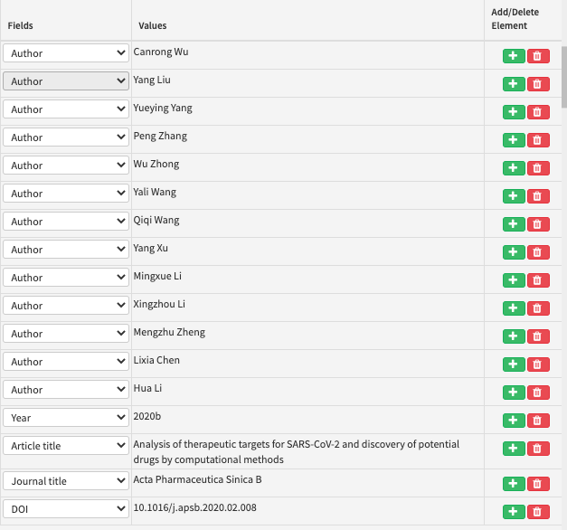
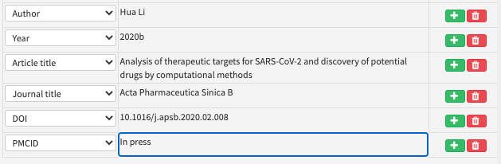
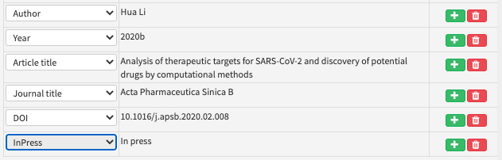
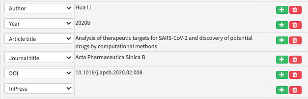
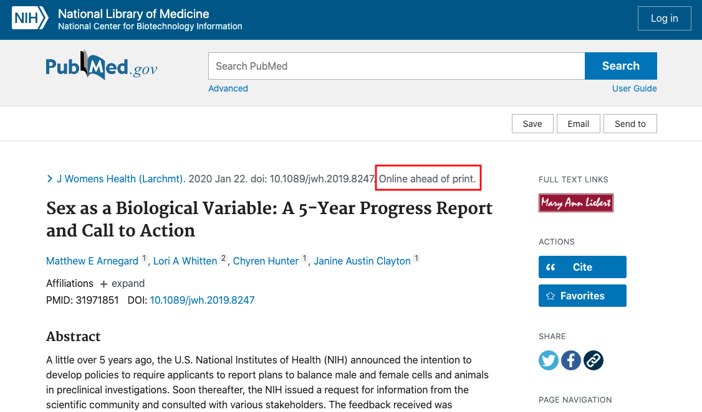
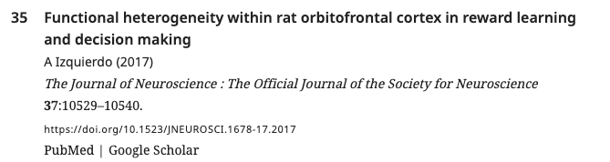
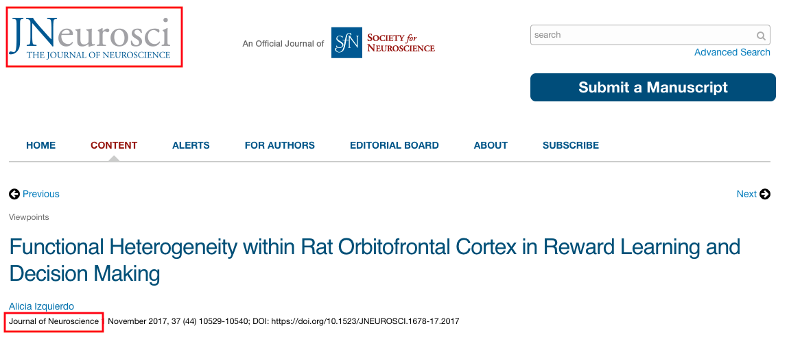

# Journal references

## What is a journal reference?

A journal reference gives bibliographic details for articles published in academic journals.


For eLife articles, each part of the reference is formatted specifically:


## What needs to be added?

The following information can be added for journal references:

| Kriya field | Mandatory? | XML element | Example |
| :--- | :--- | :--- | :--- |
| Author\(s\) | At least one author or collaboration is required; both can be present | &lt;person-group person-group-type="author"&gt;&lt;name&gt;&lt;surname&gt;Bloggs&lt;/surname&gt;&lt;given-names&gt;J&lt;/given-names&gt;&lt;/name&gt;&lt;/person-group&gt; | Bloggs J |
| Collaboration\(s\) | At least one author or collaboration is required; both can be present | &lt;person-group person-group-type="author"&gt;&lt;collab&gt;Tulsa 1000 Investigators&lt;/collab&gt;&lt;/person-group&gt; | Tulsa 1000 Investigators |
| Year | Yes | &lt;year iso-8601-date="2008"&gt;2008&lt;/year&gt; | 2008 |
| Article title | Yes | &lt;article-title&gt;"TIP47 is a key effector for Rab9 localization"&lt;/article-title&gt; | TIP47 is a key effector for Rab9 localization |
| Journal name | Yes | &lt;source&gt;The Journal of Cell Biology&lt;/source&gt; | The Journal of Cell Biology |
| Volume | No | &lt;volume&gt;173&lt;/volume&gt; | 173 |
| e-location ID | No \(if first/last pages are present, there can be no e-location ID\) | &lt;elocation-id&gt;e51381&lt;/elocation-id&gt; | e51381 |
| First page | No \(if an e-location ID is present, there can be no first/last pages\) | &lt;fpage&gt;917&lt;/fpage&gt; | 917 |
| Last page | No \(if an e-location ID is present, there can be no first/last pages\) | &lt;lpage&gt;926&lt;/lpage&gt; | 926 |
| DOI | Yes \(if there is one\) | &lt;pub-id pub-id-type="doi"&gt; | 10.1083/jcb.200510010 |
| PMID | Yes \(if there is one\) | &lt;pub-id pub-id-type="pmid"&gt; | 16769818 |
| InPress | No | &lt;comment&gt;In press&lt;/comment&gt; | In press |

**Non-mandatory fields are required if they exist**. Validation of references via PubMed or Crossref API tools should pull them in if the author did not provide them. Schematron warnings may also pick them up and should be checked at source.

* **Authors**: Enter each author name as a surname\(s\) followed by initials. 
* **Collaboration:** Articles can have group or individual authors or a combination of both. Group authors should be placed in the order in which they appear in the original source. An author list can be a mix of both individual and group authors e.g. Smith J, Jones T, National Institutes of Health, Bloggs J etc.
* **Year**: This should be the year the article was published. This field can include a letter suffix \(e.g. 2020a\) if needed to distinguish between citations \(see more [here](../reference-citations.md#what-is-a-reference-citation)\).
* **Article title**: The title of the article. Can contain italics, superscript and subscript as required.
* **Journal name**: The full \(not abbreviated\) name of the journal in which the article was published.
* **Volume:** The volume of the journal in which the article was published \(if applicable\). eLife does not include issue numbers in journal references, so this information does not need to be added.
* **e-location ID:** The e-location identifier for the article \(if applicable; most journal references will have either page numbers or an e-location ID\).
* **First page:** The page number on which the article starts \(if applicable; most journal references will have either page numbers or an e-location ID\). Some page numbers will be prefixed with letters.
* **Last page:** The page number on which the article ends \(if applicable; some articles are one-page long and so a last page is not required as it is the same as the first page\). Some page numbers will be prefixed with letters.
* **DOI:** The Digital Object Identifier for the article \(if applicable\).
* **PMID:** The PubMed Identifier for the article \(if applicable\). This will not be supplied by the author but is added during pre-editing via the PubMed API tool.
* **InPress**: If a paper has been accepted for publication but the final publication details are not yet known, this field should have the text 'In press'. 

If any of the mandatory information is not provided, and can't be found after looking up the article online please leave the following author query, replacing 'XXXXXX' with the missing information:

* Please provide the XXXXXX for this reference.

## How to add a journal reference

Right-click where you want to add the citation and click on Add New &gt; Add New Reference and select Journal under Reference Type.


The default fields in Kriya will need to be altered to include the following information in the order below. To delete an unnecessary field click the red 'bin' button \(if this doesn't work, try re-validating after all fields have been filled out, or change the field type to the one you need\). To add a field click the green '+' button to the entry above where you need to add it.

* Author 
* Collaboration \(if applicable\)
* Year 
* Article title
* Journal name
* Volume \(if available\)
* e-location ID or first and last page \(if available\)
* DOI \(if available\)
* PMID \(if available\)
* InPress \(if applicable\)

Once you have entered the information in the fields, click on 'Search PubMed'. This will compare the information entered to the PubMed database and ensures that a PubMed ID and a DOI is added \(if there is one - not all journals use DOIs\). If this does not generate results, click on 'Search CrossRef'. Most journal DOIs are registered with CrossRef \(including non-life sciences articles\).


Click the article with the correct authors, title and journal. This should automatically fill in the remaining fields if the information hasn't been added already.


Often you don't need to fill in all the details for a journal reference - filling in some of the fields and then clicking on the 'Search CrossRef' button will usually give you the correct article. The rest of the details will then be automatically filled in when you click on the article. Then, click on 'Insert Reference' to add the reference to the article.

Some journal references will not appear when searching the PubMed and CrossRef databases. If you have entered the article details correctly and verified that it is the same in the original submitted version, you can just click on 'Insert Reference' to add the reference to the article.

Watch out for unexpanded journal names when trying to validate them. Sometimes, the authors may have provided the contracted version of the journal name, e.g. 'Mol Biol Evo' for 'Molecular Biology and Evolution' \(they will likely take this from a source like PubMed which shows the contracted version by default\). If this is not expanded to the full version of the name, the validator may not be able to pick up the reference correctly to assign DOI/PMID.

Look out for journal names that are incorrectly run on to the end of article titles \(e.g. 'Reversal of prolonged obesity-associated cerebrovascular dysfunction by inhibiting microglial Tak1. _Nature'\)_. This is often caught by the schematron rules but in some cases, it may not be.

### How to add an 'In press' field



To add an 'In press' comment to a journal reference, add a new field \(which is not the 'In press' field\) and enter the text 'In press'.



Then change the field to 'In press' and validate the reference before saving it.



This is the only way to add an 'In press' comment, as at the moment, it is not possible to add text to the 'In press' field in Kriya.



## Finding reference details

Journals are not standardised in the way they archive their articles. Some journals do not use volume numbers, page ranges, e-locations, or DOIs, so these details will not be present for all journal references. Many journals publish articles online 'ahead of print' \(eLife calls this 'Publish on Acceptance', or 'PoA'\) so the full details may be unavailable until the print or full version is issued.  

For example after entering the reference details below and searching CrossRef, there doesn't appear to be any information about volume, page numbers, e-location IDs:


Searching for this reference online, one of the results is the page below. This reference is to an article that has been published online ahead of print. As there is no information here about volume, e-location ID or page range here, these fields do not need to be filled out. 



## Schematron checks 

### Content checks

These checks relate to the content of journal references. X or XXXXXX refers to quoted text which will change depending on the article.

#### err-elem-cit-journal-6-5-2

**Error:** _&lt;lpage&gt; must be larger than &lt;fpage&gt;, if present. Reference 'XXXXXX' has first page &lt;fpage&gt; = 'XXXXXX' but last page &lt;lpage&gt; = 'XXXXXX'._

**Action:** This error will appear if a journal reference has a first page value larger than the last page value \(this can happen if the authors truncate the last page, e.g. 123-34\). Look up the article online to identify the appropriate page range information and correct the reference. If the article in fact has an e-location ID rather than a page range, remove any first or last pages and enter the ID in the e-location ID field.

#### err-elem-cit-journal-6-6

**Error:** _If the content of &lt;fpage&gt; begins with a letter, then the content of &lt;lpage&gt; must begin with the same letter. Reference 'XXXXXX' does not._

**Action:** This error will appear if a journal reference has a first page value beginning with a letter, but a last page value that does not \(e.g. first page: e45, last page: 60\) Update the last page to start with the same letter\(s\) as the first page.

#### err-elem-cit-journal-13

**Error:** _Comment elements with content other than 'In press' are not allowed. Reference 'XXXXXX' has such a &lt;comment&gt; element._

**Action:** This error will appear if the 'In press' field in Kriya has any text other than 'In press'. If the comment element contains relevant bibliographic information \(article title, journal name, volume, etc\) move this information to the correct fields and delete the comment element. If the comment contains a variant on 'In press' \(e.g. 'in production', 'forthcoming' etc\), correct this to 'In press' and leave the following author query:

* Please check whether this In press reference has now been published and, if so, please provide the full citation details.

If the comment contains text that indicates the article is pre-acceptance \(e.g. 'manuscript in preparation' 'in preparation', 'under review' etc\), leave the following author query.

* Please update this reference if this article is now in press. If it is still in preparation, it will need to be removed from the reference list and cited in the text as, for example 'Smith et al., in preparation'.

If the authors respond to say the article is now in press, add the 'In press' field \([**see above**](journal-references.md#how-to-add-an-in-press-field)\). If the authors respond to say the article is still in preparation, the reference will need to be removed from the reference list and cited in the text as, for example 'Smith et al., in preparation'.

#### err-elem-cit-journal-10

**Error:** _If &lt;pub-id pub-id-type="pmid"&gt; is present, the content must be all numeric. The content of &lt;pub-id pub-id-type="pmid"&gt; in Reference 'XXXXXX' is XXXXXX._

**Action:** This error will appear if a PubMed ID has any letters. PMIDs should only contain numbers - search for the article on [**PubMed**](https://pubmed.ncbi.nlm.nih.gov/) to get the correct ID and enter this.

#### ref-article-title-check

**Info:** _XXXXXX_ _contains an organism - 'XXXXXX - but there is no italic element with that correct capitalisation or spacing._

**Example:** bib1 contains an organism - 'X. laevis' - but there is no italic element with that correct capitalisation or spacing.

**Action:** This message will appear if an article title contains a species name \(or multiple\) which should usually be italicised. In research content however, these messages do not need to be acted upon unless the author has specifically asked for these to be corrected. In feature content, the indicated species names should be italicised.

#### PLOS-1

**Error:** _ref 'XXXXXX' contains XXXXXX. 'PLOS' should be upper-case._

**Action:** This error will appear if a journal reference has a 'journal name' field that includes 'PLOS' capitalised incorrectly. Make sure this is corrected to 'PLOS' in all cases. For example, 'Plos; PLoS; Plos Biology, PLoS Medicine' should be changed to 'PLOS, PLOS, PLOS Biology, PLOS Medicine'. 

#### PLOS-2

**Error:** _ref 'XXXXXX' contains XXXXXX. 'PLOS ONE' should be upper-case._

**Action:** This error will appear if a journal reference has a 'journal name' field that includes 'PLOS ONE' capitalised incorrectly. For example 'Plos one; PLoS One; PLOS One' should all be changed to 'PLOS ONE'. 

#### PNAS

**Error:** _ref 'XXXXXX' has the doi for 'PNAS' but the journal name is XXXXXX, which is incorrect._

**Action:** This error will appear if a journal reference has the doi prefix for PNAS \(10.1073/pnas\) but the journal name has been entered as something other than 'PNAS'. Apply the correct capitalisation for the journal name. For example, 'Proceedings of the National Academy of Sciences, Proceedings of the National Academy of Sciences of the United States of America' should all be changed to 'PNAS'.

#### RNA

**Error:** _ref 'XXXXXX' contains XXXXXX. 'RNA' should be upper-case._

**Action:** This error will appear if a journal reference has an article title including 'RNA' with incorrect capitalisation \(e.g. Rna, rna\). Make sure this is corrected to 'RNA'.

#### bmj

**Error:** _ref 'XXXXXX' contains XXXXXX. 'BMJ' should be upper-case._

**Action:** This error will appear if a journal reference has a journal name 'BMJ' with the incorrect capitalisation \(e.g. bmj, Bmj\). Make sure this is corrected to 'BMJ'. 

#### G3

**Error:** _ref 'XXXXXX' has the doi for 'G3' but the journal name is XXXXXX - it should be 'G3: Genes, Genomes, Genetics'._

**Action:** This error will appear if a journal reference has the journal name 'G3' formatted incorrectly. Due to an issue with how G3 supplies its data to PubMed/Crossref, the journal name will sometimes have the unicode character replacing the ':'. Change the journal name to 'G3: Genes, Genomes, Genetics'.

#### ampersand-check

**Warning:** _ref 'XXXXXX' appears to contain the text 'amp', is this a broken ampersand?_

**Action:** This error will appear if a journal reference contains the text 'amp'. This usually indicates a conversion error where '&' has converted to the text string 'amp'. Please check the article online and correct as necessary - if the source used '&' please replace 'amp' with '&'; if the source used 'and' please update 'amp' to 'and'.

#### Research-gate-check

**Error:** _ref 'XXXXXX' has a source title 'XXXXXX' which must be incorrect._

**Action:** This error will appear if a journal name has been entered as 'Research Gate' \(or 'research gate', 'researchgate' or any other capitalisation alternatives\). Research Gate is a platform for scientists to collaborate and share articles - it is not a journal. Check what the correct journal name should be by looking up the article online and enter that instead. If the article can only be found on Research Gate, and the journal name is not clear, leave the following author query:

* Please provide the journal name for this reference.

#### journal-replacement-character-presence

**Error:** _source_ _element contains the replacement character '�' which is unallowed - XXXXXX_

**Action:** This error will appear if a journal name contains the character ‘�’. This usually indicates a conversion error has occurred and an unknown, unrecognized or unrepresentable character has been replaced with ‘�’. Look up the article online and update with the correct character.

#### journal-off-presence

**Warning:** _ref 'XXXXXX' has a source title which contains the text 'official journal' - 'XXXXXX'. Is this necessary?_

**Action:** This warning will appear if a journal name includes the text 'official journal'. Often this is because the tagline of the journal has been included in the field:



Look up the article title online to check whether 'official journal' is actually part of the journal's name. For example, on the journal website for the above article, you can see that the name of the journal is just 'Journal of Neuroscience'. The journal name should be updated accordingly.



**handbook-presence**

**Error:** _Journal ref 'XXXXXX' has a journal name 'XXXXXX'. Should it be captured as a book type reference instead?_

**Action:** This error will appear if a journal reference has a journal name that includes the word 'handbook'. This indicates that the reference should actually be a book reference instead of a journal reference. Change the reference to a book reference \(hyperlink to be added\) and update the fields accordingly.

#### article-title-fullstop-check-1

**Info**: _ref 'XXXXXX' has an article-title with a full stop. Is this correct, or has the journal/source title been included? Or perhaps the full stop should be a colon ':'?_

**Action:** This message will appear if a journal reference has a title including a full stop. The journal name may also have been pulled into the title e.g. 'Reversal of prolonged obesity-associated cerebrovascular dysfunction by inhibiting microglial Tak1. _Nature'. Neuroscience._ Look up the article online to work out whether the full stop should be kept or replaced with a colon, or check whether the journal name has been incorrectly pulled into the article title.

#### article-title-fullstop-check-2

**Error:** ref 'XXXXXX' has an article-title which ends with a full stop, which cannot be correct - XXXXXX

**Action:** This error will appear if a journal reference has an article title which ends with a full stop. The full stop should be removed as this will make the journal reference incorrectly formatted. 

#### **article-title-fullstop-check-3**

**Warning:** _ref 'XXXXXX' has an article-title which ends with some full stops - is this correct? - XXXXXX_

**Action:** This error will appear if a journal reference has an article title which ends with 1+ full stops. All the full stops should be removed.

#### **article-title-correction-check**

**Warning:** _ref 'XXXXXX' has an article-title which begins with 'Correction', 'Retraction' or contains 'Erratum'. Is this a reference to the notice or the original article?_

**Action:** This warning will appear if a journal reference has an article title beginning with 'Correction', 'Retraction' or contains 'Erratum'. Read the context surrounding the citation of this reference to work out what to do. If the reference list includes both the corrected/retracted article and the original article, or if the authors mention that the citation is to a corrected/retracted article in the context, you can leave this reference in. Otherwise, check the original submitted manuscript to make sure the wrong details have not been entered for this reference. If the original submitted manuscript cites the corrected/retracted paper, leave this reference in, but leave the following author query at the pre-editing stage:

* This reference is to a correction/retraction/erratum. Please confirm whether this is correct.

If this warning appears at the post-editing stage, the authors may need to be asked about this via email.

**article-title-journal-check**

**Warning:** _ref 'XXXXXX' has an article-title which contains the text ' journal '. Is a journal name \(source\) erroneously included in the title? - 'XXXXXX'_

**Action:** This warning will appear if a journal reference has an article title which includes the text 'journal'. This may need to be removed if, for example it reads 'Journal: PNAS'. However, if the word 'journal' is part of the article title \(e.g. 'The History and Meaning of the Journal Impact Factor'\), it should be kept.

#### article-title-child-1

**Warning:** _ref 'XXXXXX' has an article-title with one child XXXXXX element, and no text. This is almost certainly incorrect. - XXXXXX_

**Action:** This warning will appear if a journal reference has an article title with formatting applied to the whole content \(e.g. if the title is entirely in italics or bold formatting\). Look up the reference online to see how it should be formatted and update accordingly. If you can't find the reference online, remove all formatting from the title.

#### a-title-replacement-character-presence

**Error:** _article-title_ ****_element contains the replacement character '�' which is unallowed - XXXXXX_

**Action:** This error will appear if an article title contains the character ‘�’. This usually indicates a conversion error has occurred and an unknown, unrecognized or unrepresentable character has been replaced with ‘�’. Look up the article online and update with the correct character.

#### journal-preprint-check

**Error:** _ref 'XXXXXX' has a source XXXXXX, but it is captured as a journal not a preprint._

**Action:** This error will appear if a journal reference has one of the following entered in the journal name field: biorxiv, arxiv, chemrxiv, peerj preprints, psyarxiv, paleorxiv, preprints. These are all preprint servers, so the reference should be changed to a preprint reference \(hyperlink to be added\) and the fields should be updated accordingly.

#### elife-ref-check

**Error:** ref 'XXXXXX' is an XXXXXX article, but it has no doi in the format 10.7554/eLife.00000, which must be incorrect.

**Action:** This error will appear if a journal reference has the journal name 'eLife' but the doi is incorrectly formatted. eLife articles have dois in the format: 10.7554/eLife.XXXXX. Look up the article online to check what the doi should be. If the article hasn't been published yet, check to see whether it is in the production process, and add the manuscript number in place of 'XXXXX'. If you don't know the manuscript number, check with the Production team, who will look up the article title in eJP. 

#### journal-conference-ref-check-1

**Warning:** _Journal ref 'XXXXXX' has the journal name XXXXXX. Should it be a conference type reference instead?_

**Action:** This warning will appear if a journal reference has a journal name including any of the following: conference
, symposium
, symposia, neural information processing
, nips
, computer vision and pattern recognition
, scipy
, workshop
, meeting
, spie
, congress
, \[number\]st
, \[number\]nd
, \[number\]rd
, \[number\]th
. This test is intended to identify journal references that are actually conference references. Look up the article online to check whether it has been published in a journal, or whether it is a paper from a conference. Check if the conference proceedings have been published in a journal \(i.e. if it is indexed on [**PubMed**](https://pubmed.ncbi.nlm.nih.gov/)\). If so, this can be kept as a journal reference, otherwise change it to a conference reference \(hyperlink to be added\).


#### journal-conference-ref-check-2

**Warning:** _Journal ref 'XXXXXX' has a journal name containing a year - XXXXXX. Should it be a conference type reference instead? Or should the year be removed from the journal name?_

**Action:** This warning will appear if a journal reference has a journal name including a year. Look up the article online to check whether it has been published in a journal, or whether it is a paper from a conference. Check if the conference proceedings have been published in a journal \(i.e. if it is indexed on [**PubMed**](https://pubmed.ncbi.nlm.nih.gov/)\). If so, this can be kept as a journal reference, otherwise change it to a conference reference \(hyperlink to be added\).


### XML Structure checks

These checks relate to the XML structure of journal references. For more information about what the XML should look like, [**see below**](journal-references.md#xml-structure).

#### err-elem-cit-journal-2-1

**Error:** _Each &lt;element-citation&gt; of type 'journal' must contain one and only one &lt;person-group&gt; element. Reference 'XXXXXX' has XXXXXX &lt;person-group&gt; elements._

**Action:** If there is no author list present, one will need to be added to the reference. Look the article up online if possible; otherwise raise an author query on the proof for the missing information. In cases where no author is given, 'Anon' will most likely need to be added in the 'Collaboration' field \(&lt;collab&gt;\). Alternatively, if the article is an [editorial piece](https://www.nature.com/articles/d41586-020-01620-1), use the name of the journal in the 'Collaboration' field. If there are multiple person-group elements, this means there has been an error in processing - Exeter will need to fix this.

#### err-elem-cit-journal-2-2

**Error:** _Each &lt;element-citation&gt; of type 'journal' must contain one &lt;person-group&gt; with the attribute person-group-type 'author'. Reference 'XXXXXX' has a &lt;person-group&gt; type of 'XXXXXX'._

**Action:** This error will appear if there is no author list, or if authors have been tagged as other kinds of contributors \(e.g. editors or curators\). If there is no author list, make sure this is added by searching for the article details online. If there are contributors other than authors or collaborations, this means there has been an error in processing - Exeter will need to fix this.

#### err-elem-cit-journal-3-1

**Error:** _Each &lt;element-citation&gt; of type 'journal' must contain one and only one &lt;article-title&gt; element. Reference 'XXXXXX' has XXXXXX &lt;article-title&gt; elements._

**Action:** This error will appear if a journal reference has more than one or no article titles. If the authors have not provided the article title but have given other bibliographic details \(e.g. journal, volume, page range or elocation ID\) it may be possible to search for the article online. If there are not enough details to find the article title, add the following author query:

* Please provide the title for this reference.

If the reference has more than one article title, compare the details with the original submission to work out which is the correct article title and enter that. 

#### err-elem-cit-journal-4-1

**Error:** _Each &lt;element-citation&gt; of type 'journal' must contain one and only one &lt;source&gt; element. Reference 'XXXXXX' has XXXXXX &lt;source&gt; elements._

**Action:** This error will appear if a journal reference has more than one or no journal name. Check that the journal name has not been accidentally captured as part of the article title \(which will result in no source, i.e. Journal name\) or that the journal title or article title has not be split out over multiple source entries. If the authors have not provided the journal name but have given other bibliographic details \(e.g. article title, volume, page range or elocation ID\) it may be possible to search for the article online. If there are not enough details to find the article, add the following author query:

* Please provide the journal name for this reference.

#### err-elem-cit-journal-4-2-2

**Error:** _A &lt;source&gt; element within a &lt;element-citation&gt; of type 'journal' may not contain child elements. Reference 'XXXXXX' has disallowed child elements._

**Action:** This error will appear if there are formatting elements in the journal name \(e.g. bold, underline\). Delete the current contents of this field and paste in an unformatted version of the journal name.

#### err-elem-cit-journal-5-1-3

**Error:** _There may be no more than one &lt;volume&gt; element within a &lt;element-citation&gt; of type 'journal'. Reference 'XXXXXX' has XXXXXX &lt;volume&gt; elements._

**Action:** This error will appear if a journal reference has more than one volume number. Check the reference details by looking up the article online and remove the incorrect volume number\(s\). Make sure that a page number/e-location ID has not been tagged as a volume by mistake.

#### err-elem-cit-journal-12

**Error:** _The only elements allowed as children of &lt;element-citation&gt; with the publication-type="journal" are: &lt;person-group&gt;, &lt;year&gt;, &lt;article-title&gt;, &lt;source&gt;, &lt;volume&gt;, &lt;fpage&gt;, &lt;lpage&gt;, &lt;elocation-id&gt;, &lt;comment&gt;, and &lt;pub-id&gt;. Reference 'XXXXXX' has other elements._

**Action:** This error will appear if a journal reference has any xml elements other than the ones in the message \(e.g. string date\). Check the XML and remove the extra elements from the reference.

#### err-elem-cit-journal-3-2

**Error:** _An &lt;article-title&gt; element in a reference may contain characters and &lt;italic&gt;, &lt;sub&gt;, and &lt;sup&gt;. No other elements are allowed. Reference 'XXXXXX' does not meet this requirement._

**Action:** This error will appear if there are formatting elements in the article title other than italics, superscripts and subscripts \(e.g. bold, underline\). Make sure any disallowed formatting elements are removed from the article title.

#### err-elem-cit-journal-5-1-2

**Error:** _A &lt;volume&gt; element within a &lt;element-citation&gt; of type 'journal' must contain at least one character and may not contain child elements. Reference 'XXXXXX' has too few characters and/or child elements._

**Action:** This error will appear if the volume field in a journal reference is empty, or if there are formatting elements present \(e.g. bold, underline\). Make sure the correct volume number is entered if appropriate by looking up the article details online, and make sure the contents do not contain any formatting.

#### err-elem-cit-journal-6-2

**Error:** _If &lt;fpage&gt; is present, neither &lt;elocation-id&gt; nor &lt;comment&gt;In press&lt;/comment&gt; may be present. Reference 'XXXXXX' has &lt;fpage&gt; and one of those elements._

**Action:** This error will appear if a journal reference has a first page and an e-location ID and/or 'In press' comment. It can only have one of these. This error may occur if a last page has been incorrectly captured as an e-location ID. Look up the article online and update the reference. If the article has not been published, and the article is at the pre-author stage, leave the following author query: 

* Please check whether this In press reference has now been published and, if so, please provide the full citation details.

If the authors do not have a publication date, or this message appears at post-author stages, keep the 'In press' comment, and delete the first page field.

#### err-elem-cit-journal-6-3

**Error:** _If &lt;elocation-id&gt; is present, neither &lt;fpage&gt; nor &lt;comment&gt;In press&lt;/comment&gt; may be present. Reference 'XXXXXX' has &lt;elocation-id&gt; and one of those elements._

**Action:** This error will appear if a journal reference has an e-location ID and a first page and/or 'In press' comment. It can only have one of these. Look up the article online and update the reference. If the article has not been published, leave the following author query: 

If the article has not been published, leave the following author query:

* Please check whether this In press reference has now been published and, if so, please provide the full citation details.

If the authors do not have a publication date or if the publication date will be more than a few days after the publication of the eLife article, remove the e-location ID and keep the 'In press' comment.

#### err-elem-cit-journal-6-4

**Error:** _If &lt;comment&gt;In press&lt;/comment&gt; is present, neither &lt;fpage&gt; nor &lt;elocation-id&gt; may be present. Reference 'XXXXXX' has one of those elements._

**Action:** This error will appear if a journal reference has an 'In press' comment and e-location ID and/or a first page. It can only have one of these. Look up the article online and update the reference. If the article has not been published, leave the following author query: 

* Please check whether this In press reference has now been published and, if so, please provide the full citation details.

If the authors do not have a publication date or if the publication date will be more than a few days after the publication of the eLife article, remove the e-location ID and keep the 'In press' comment.

#### err-elem-cit-journal-6-5-1

**Error:** _&lt;lpage&gt; is only allowed if &lt;fpage&gt; is present. Reference 'XXXXXX' has &lt;lpage&gt; but no &lt;fpage&gt;._

**Action:** This error will appear if a journal reference has a last page but no first page. Look up the article online to identify the appropriate page range information and correct the reference. If the article in fact has an e-location ID rather than a page range, remove any first or last pages and enter the ID in the e-location ID field.

#### err-elem-cit-journal-6-7

**Error:** _The following elements may not occur more than once in an &lt;element-citation&gt;: &lt;fpage&gt;, &lt;lpage&gt;, &lt;elocation-id&gt;, and &lt;comment&gt;In press&lt;/comment&gt;. Reference 'XXXXXX' has XXXXXX &lt;fpage&gt;, XXXXXX &lt;lpage&gt;, XXXXXX &lt;elocation-id&gt;, and XXXXXX &lt;comment&gt; elements._

**Action:** This error will appear if a journal reference has more than one of any of the elements in the message \(e.g. multiple first pages\). Ensure that the beginning and end of a page range have been tagged as first page and last page respectively, and remove the extra instances of any duplicate elements. 

#### err-elem-cit-journal-9-1

**Error:** _Each &lt;pub-id&gt;, if present in a journal reference, must have a @pub-id-type of either "doi" or "pmid". The pub-id-type attribute on &lt;pub-id&gt; in Reference 'XXXXXX' is XXXXXX._

**Action:** Remove any pub-ids that are not a DOI or a PubMed ID.

#### eloc-page-assert

**Warning:** _ref 'XXXXXX' is a journal, but it doesn't have a page range or e-location. Is this right?_

**Action:** This warning will appear if a journal reference does not have a page range or e-location ID. Look up the article online to check whether these are available. These may be unavailable because the article has been published online before a print version \(and so doesn't have those details yet\). Some journals also do not use page ranges or e-location IDs to catalogue their articles. If you cannot find this information online, you can ignore this warning.

#### **volume-assert**

**Warning:** _ref 'XXXXXX' is a journal, but it doesn't have a volume. Is this right?_

**Action:** This warning will appear if a journal reference does not have a volume. Look up the article online to check whether this is available. These may be unavailable because the article has been published online before a print version \(and so doesn't have a volume number yet\). Some journals also do not use volumes to catalogue their articles. If you cannot find this information online, you can ignore this warning.

#### online-journal-w-page

**Error:** _XXXXXX is a XXXXXX article, but has a page number, which is incorrect._ 

**Action:** This error will appear if a journal reference has the journal name PLOS, eLife or mBio and a page number. These are the journals eLife knows never use page numbers for their articles, but instead use e-location IDs. Look up the article online to find the e-location ID, add this, and delete any page number fields.

#### journal-doi-test-1

**Warning:** _XXXXXX is a journal ref without a doi. Should it have one?_

**Action:** This warning will appear if a journal reference does not have a DOI. Revalidate the reference first, to ensure it is not just a system glitch. If it is still not added, look up the article on [**PubMed**](https://pubmed.ncbi.nlm.nih.gov/). If the article is listed on PubMed and no DOI is present, the reference can be left as it is. If it is not on PubMed look up the journal source online, or use [**Crossref**](https://search.crossref.org/) to check whether there should be a DOI.  
Some articles will not have DOIs. This is particularly common with older articles e.g. those published before ~1990, but some journals still do not assign DOIs to their content now \(e.g. _Development_\). The eLife Schematron attempts to filter out false positives so please inform Production staff of this message on content that does not have DOIs \(for example _Development_ references do not fire this warning\).  
While doing this check, look out for differing article information. If the author names or the title are slightly different from the published details or what is recorded in PubMed, the validator will not identify the reference.

## XML Structure

Here are some examples of how the xml will look for various journal references.

Journal reference with collaboration author.

```markup
<element-citation publication-type="journal">
  <person-group person-group-type="author">
    <name>
      <surname>Blake</surname> <given-names>JA</given-names>
    </name>
    <name>
      <surname>Bult</surname> <given-names>CJ</given-names>
    </name>
    <name>
      <surname>Eppig</surname> <given-names>JT</given-names>
    </name>
    <name>
      <surname>Kadin</surname> <given-names>JA</given-names>
    </name>
    <name>
      <surname>Richardson</surname> <given-names>JE</given-names>
    </name>
    <collab>the Mouse Genome Database Group</collab>
  </person-group>
  <year iso-8601-date="2009">2009</year>
  <article-title>The mouse genome database genotypes::phenotypes</article-title>
  <source>Nucleic Acids Research</source>
  <volume>37</volume>
  <fpage>D712</fpage>
  <lpage>D719</lpage>
  <pub-id pub-id-type="doi">10.1093/nar/gkn886</pub-id>
  <pub-id pub-id-type="pmid">18981050</pub-id>
</element-citation>
```

Journal reference with page range.

```markup
    <ref id="bib1">
        <element-citation publication-type="journal">
            <person-group person-group-type="author">
                <name><surname>Aivazian</surname><given-names>D</given-names></name>
                <name><surname>Serrano</surname><given-names>RL</given-names></name>
                <name><surname>Pfeffer</surname><given-names>S</given-names></name>
            </person-group>
            <year iso-8601-date="2006">2006</year>
            <article-title>TIP47 is a key effector for Rab9 localization</article-title>
            <source>The Journal of Cell Biology</source>
            <volume>173</volume>
            <fpage>917</fpage>
            <lpage>926</lpage>
            <pub-id pub-id-type="doi">10.1083/jcb.200510010</pub-id>
            <pub-id pub-id-type="pmid">16769818</pub-id>
        </element-citation>
```

Journal reference with eLocation ID.

```markup
    <ref id="bib5">
        <element-citation publication-type="journal">
            <person-group person-group-type="author">
                <name><surname>Llorca</surname><given-names>A</given-names></name>
                <name><surname>Ciceri</surname><given-names>G</given-names></name>
                <name><surname>Beattie</surname><given-names>R</given-names></name>
                <name><surname>Wong</surname><given-names>FK</given-names></name>
                <name><surname>Diana</surname><given-names>G</given-names></name>
                <name><surname>Serafeimidou-Pouliou</surname><given-names>E</given-names></name>
                <name><surname>Fern&#x00E1;ndez-Otero</surname><given-names>M</given-names></name>
                <name><surname>Streicher</surname><given-names>C</given-names></name>
                <name><surname>Arnold</surname><given-names>SJ</given-names></name>
                <name><surname>Meyer</surname><given-names>M</given-names></name>
                <name><surname>Hippenmeyer</surname><given-names>S</given-names></name>
                <name><surname>Maravall</surname><given-names>M</given-names></name>
                <name><surname>Marin</surname><given-names>O</given-names></name>
            </person-group>
            <year iso-8601-date="2019">2019</year>
            <article-title>A stochastic framework of neurogenesis underlies the assembly of neocortical
               cytoarchitecture</article-title>
            <source>eLife</source>
            <volume>8</volume>
            <elocation-id>e51381</elocation-id>
            <pub-id pub-id-type="doi">10.7554/eLife.51381</pub-id>
            <pub-id pub-id-type="pmid">31736464</pub-id>
        </element-citation>
    </ref>
```

'In press' journal reference.

```markup
<element-citation publication-type="journal">
  <person-group person-group-type="author">
    <name>
      <surname>Wu</surname> <given-names>C</given-names>
    </name>
    <name>
      <surname>Liu</surname> <given-names>Y</given-names>
    </name>
    <name>
      <surname>Yang</surname> <given-names>Y</given-names>
    </name>
    <name>
      <surname>Zhang</surname> <given-names>P</given-names>
    </name>
    <name>
      <surname>Zhong</surname> <given-names>W</given-names>
    </name>
    <name>
      <surname>Wang</surname> <given-names>Y</given-names>
    </name>
    <name>
      <surname>Wang</surname> <given-names>Q</given-names>
    </name>
    <name>
      <surname>Xu</surname> <given-names>Y</given-names>
    </name>
    <name>
      <surname>Li</surname> <given-names>M</given-names>
    </name>
    <name>
      <surname>Li</surname> <given-names>X</given-names>
    </name>
    <name>
      <surname>Zheng</surname> <given-names>M</given-names>
    </name>
    <name>
      <surname>Chen</surname> <given-names>L</given-names>
    </name>
    <name>
      <surname>Li</surname> <given-names>H</given-names>
    </name>
  </person-group>
  <year iso-8601-date="2020">2020b</year>
  <article-title>Analysis of therapeutic targets for SARS-CoV-2 and discovery of potential drugs by computational methods</article-title>
  <source>Acta Pharmaceutica Sinica B</source>
  <comment>In press</comment>
  <pub-id pub-id-type="doi">10.1016/j.apsb.2020.02.008</pub-id>
</element-citation>
```

