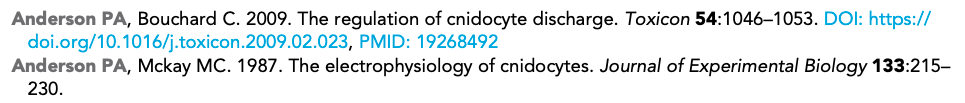
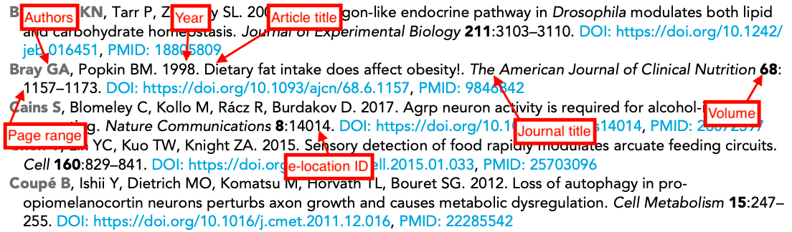
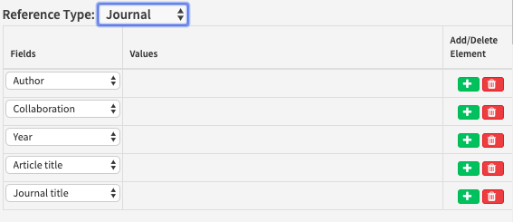
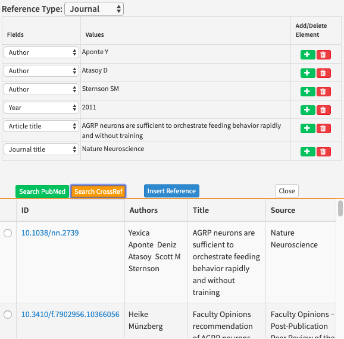
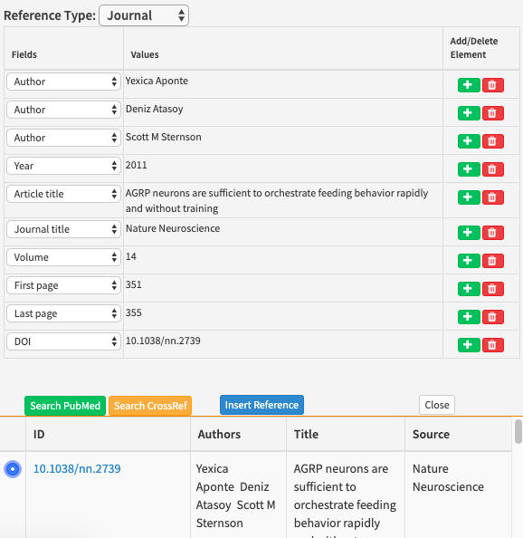
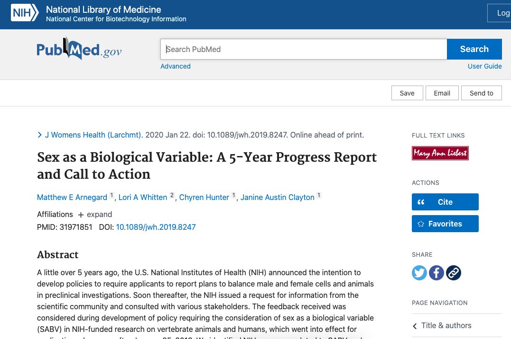

# Journal references

## What is a journal reference?

A journal reference gives bibliographic details for articles published in academic journals.




The way journal references are displayed depends on the referencing style. For eLife articles, each part of the reference is formatted specifically:



## What needs to be added?

The following information can be added for journal references:

| Kriya field | Mandatory? | XML element | Example |
| :--- | :--- | :--- | :--- |
| Author | Yes \(or a collaboration must be entered instead\) | &lt;person-group person-group-type="author"&gt; &lt;name&gt; | Bloggs J |
| Collaboration | Yes \(or authors must be entered instead\) | &lt;person-group person-group-type="author"&gt; &lt;collab&gt; | Tulsa 1000 Investigators |
| Year | Yes | &lt;year iso-8601-date="XXXXXX"&gt; where XXXXXX is the year | 2020 |
| Article title | Yes | &lt;article-title&gt;"XXXXXX" where XXXXXX is the article title | TIP47 is a key effector for Rab9 localization |
| Journal name | Yes | &lt;source&gt; | The Journal of Cell Biology |
| Volume | No | &lt;volume&gt; | 173 |
| e-location ID | No | &lt;elocation-id&gt; | e51381 |
| First page | No | &lt;fpage&gt; | 917 |
| Last page | No | &lt;lpage&gt; | 926 |
| DOI | No | &lt;pub-id pub-id-type="doi"&gt; | 10.1083/jcb.200510010 |
| PMID | No | &lt;pub-id pub-id-type="pmid"&gt; | 16769818 |

* **Authors**: Enter each author name as a surname followed by initials.
* **Collaboration:**
* **Year**: 
* **Article title:**
* Journal name: 
* Volume:
* e-location ID
* First page
* Last page
* DOI
* PMID

Where the optional information is available, this should also be added in. 

* **Authors**: Enter each author name as a surname followed by initials. 
* **Collaboration:** Articles can have group or individual authors or a combination of both. Group authors should be placed in the order in which they appear in the original source. An author list can be a mix of both individual and group authors e.g. Smith J, Jones T, National Institutes of Health, Bloggs J etc.
* **Year**: This should be the year the article was published. This field can include a letter suffix \(e.g. 2020a\) if needed to distinguish between citations \(see more [here](../reference-citations.md#what-is-a-reference-citation)\).
* **Article title**: The title of the article. Can contain italics, superscript and subscript as required.
* **Journal name**: The name of the journal in which the article was published.
* **Volume:** The volume of the journal in which the article was published \(if applicable\).
* **e-location ID:** The e-location identifier for the article \(if applicable\).
* **First page/last page:** The page number on which the article starts and ends \(if applicable\). Some page numbers will be prefixed with letters.
* **DOI:** The Digital Object Identifier for the article \(if applicable\).
* **PMID:** The PubMed Identifier for the article \(if applicable\)

If any of the mandatory information is not provided, please leave the following author query, replacing 'XXXXXX' with the missing information:

* Please provide the XXXXXX for this reference.

## How to add a journal reference

Right-click where you want to add the citation and click on Add New &gt; Add New Reference and select Journal under Reference Type.



The default fields in Kriya will need to be altered to include the following information in this order:

* Author 
* Collaboration \(if appropriate\)
* Year 
* Article title
* Journal name
* Volume \(if available\)
* e-location ID or first and last page \(if available\)
* DOI \(if available\)
* PMID \(if available\)

Once you have entered the information in the fields, click on 'Search CrossRef'. This will compare the information entered to the CrossRef database and give you a variety of articles to choose from.



Click the one with the correct authors, title and journal. This should automatically fill in the remaining fields if the information hasn't been added already.



Often you don't need to fill in all the details for a journal reference - filling in some of the fields and then clicking on the 'Search CrossRef' button will usually give you the correct article. The rest of the details will then be automatically filled in when you click on the article. 

Watch out for unexpanded journal names when trying to validate them. Sometimes, the authors may have provided the contracted version of the journal name, e.g. 'Mol Biol Evo' for 'Molecular Biology and Evolution' \(they will likely take this from a source like PubMed which shows the contracted version by default\). If this is no expanded to the full version of the name, the validator may not be able to pick up the reference correctly to assign DOI/PMID.

Look out for journal names that are incorrectly run on to the end of article titles. This is often caught by the schematron rules but in some cases, it may not be.

## Finding reference details

Journals are not standardised in the way they archive their articles. Many journals do not use volume numbers, page ranges or e-locations. If a journal reference doesn't have these when you have used the 'Search CrossRef' button, double-check by looking up the article title online. 

For example after entering the reference details below and searching CrossRef, there doesn't appear to be any information about volume, page numbers, or e-location IDs:


Searching for this reference online takes you to [this page](https://pubmed.ncbi.nlm.nih.gov/31971851/). As there is no information here about volume, e-location ID or page range here, these fields do not need to be filled out. However, the PMID is available, so you can add this to the reference.



## Articles in press or under preparation

* Please update this reference if this article is no longer In Press. If it is still unpublished, it will need to be removed from the reference list.


## 

## Schematron checks

### Schematron

The following rules apply to Journal references:

#### err-elem-cit-journal-2-1

**Error:** _Each &lt;element-citation&gt; of type 'journal' must contain one and only one &lt;person-group&gt; element. Reference 'XXXXXX' has XXXXXX &lt;person-group&gt; elements._

**Action:** If there is no author list present, one will need to be added to the reference. Look the article up online if possible; otherwise raise an author query on the proof for the missing information. In cases where no author is given, 'Anon' will most likely need to be added as a `<collab>`. Alternatively, if the article is considered an editorial piece, use the name of the journal as the `<collab>`.

#### err-elem-cit-journal-2-2

**Error:** _Each &lt;element-citation&gt; of type 'journal' must contain one &lt;person-group&gt; with the attribute person-group-type 'author'. Reference 'XXXXXX' has a &lt;person-group&gt; type of 'XXXXXX'._

**Action:** Remove the extra non-author `<person-group>`. Editors are never listed for journal references.

#### err-elem-cit-journal-3-1

**Error:** _Each &lt;element-citation&gt; of type 'journal' must contain one and only one &lt;article-title&gt; element. Reference 'XXXXXX' has XXXXXX &lt;article-title&gt; elements._

**Action:** Identify and add in the article title. If the authors have not provided this information but have given other bibliographic details \(e.g. journal, volume, page range or elocation ID\) it may be possible to search for the article online. This is especially easy if they have given the DOI! If there are not enough details to find the article, raise an author query to ask for the missing title.

#### err-elem-cit-journal-4-1

**Error:** _Each &lt;element-citation&gt; of type 'journal' must contain one and only one &lt;source&gt; element. Reference 'XXXXXX' has XXXXXX &lt;source&gt; elements._

**Action:** Identify and add in the journal name. Check that the journal name has not been accidentally captured as part of the article title. If the authors have not provided this information but have given other bibliographic details \(e.g. article title, volume, page range or elocation ID\) it may be possible to search for the article online. This is especially easy if they have given the DOI! If there are not enough details to find the article, raise an author query to ask for the missing journal name.

#### err-elem-cit-journal-4-2-2

**Error:** _A &lt;source&gt; element within a &lt;element-citation&gt; of type 'journal' may not contain child elements. Reference 'XXXXXX' has disallowed child elements._

**Action:** Check that formatting elements have not been introduced into the journal name \(e.g. bold formatting\). Delete the current contents of this field and past in an unformatted version of the journal name.

#### err-elem-cit-journal-5-1-3

**Error:** _There may be no more than one &lt;volume&gt; element within a &lt;element-citation&gt; of type 'journal'. Reference 'XXXXXX' has XXXXXX &lt;volume&gt; elements._

**Action:** Remove the extra volume number\(s\). Make sure that a page number/eloction ID has not been tagged as a volume by mistake.

#### err-elem-cit-journal-12

**Error:** _The only elements allowed as children of &lt;element-citation&gt; with the publication-type="journal" are: &lt;person-group&gt;, &lt;year&gt;, &lt;article-title&gt;, &lt;source&gt;, &lt;volume&gt;, &lt;fpage&gt;, &lt;lpage&gt;, &lt;elocation-id&gt;, &lt;comment&gt;, and &lt;pub-id&gt;. Reference 'XXXXXX' has other elements._

**Action:** Check the XML and remove the extra elements.

#### err-elem-cit-journal-3-2

**Error:** _An &lt;article-title&gt; element in a reference may contain characters and &lt;italic&gt;, &lt;sub&gt;, and &lt;sup&gt;. No other elements are allowed. Reference 'XXXXXX' does not meet this requirement._

**Action:** Remove disallowed formatting \(e.g. bold\) from the article title.

#### err-elem-cit-journal-5-1-2

**Error:** _A &lt;volume&gt; element within a &lt;element-citation&gt; of type 'journal' must contain at least one character and may not contain child elements. Reference 'XXXXXX' has too few characters and/or child elements._

**Action:** Check that the volume field has something in it and make sure that it does not contain any formatting \(bold, italic, subscript etc\).

#### err-elem-cit-journal-6-2

**Error:** _If &lt;fpage&gt; is present, neither &lt;elocation-id&gt; nor &lt;comment&gt;In press&lt;/comment&gt; may be present. Reference 'XXXXXX' has &lt;fpage&gt; and one of those elements._

**Action:** Look the article up online and make sure that the page range is correct. If the article in fact has an elocation ID rather than a page range, remove any first or last pages and retain only this ID. If the article is published, any in press tag should be removed. If the article has not been published, raise an author query to ascertain when it will be released. If this will be more than a few days after publication of the eLife article, remove the page range and retain only 'in press'.

#### err-elem-cit-journal-6-3

**Error:** _If &lt;elocation-id&gt; is present, neither &lt;fpage&gt; nor &lt;comment&gt;In press&lt;/comment&gt; may be present. Reference 'XXXXXX' has &lt;elocation-id&gt; and one of those elements._

**Action:** Look the article up online and make sure that the elocation ID is correct. If the article has a page range instead, remove the elocation ID and retain only first and last page. If the article is published, any in press tag should be removed. If the article has not been published, raise an author query to ascertain when it will be released. If this will be more than a few days after publication of the eLife article, remove the elocation ID and retain only 'in press'.

#### err-elem-cit-journal-6-4

**Error:** _If &lt;comment&gt;In press&lt;/comment&gt; is present, neither &lt;fpage&gt; nor &lt;elocation-id&gt; may be present. Reference 'XXXXXX' has one of those elements._

**Action:** Look the article up online and confirm that it is still unpublished. If it has been published, remove the in press tag and confirm that volume, page range/elocation ID are correct. If the article has not been published, raise an author query to ascertain when it will be released. If this will be more than a few days after publication of the eLife article, remove the page range/elocation ID and retain only 'in press'.

#### err-elem-cit-journal-6-5-1

**Error:** _&lt;lpage&gt; is only allowed if &lt;fpage&gt; is present. Reference 'XXXXXX' has &lt;lpage&gt; but no &lt;fpage&gt;._

**Action:** Look up the article online to identify the appropriate page range information and correct the reference. Check whether the last page present is supposed to be a single first page or an elocation ID.

#### err-elem-cit-journal-6-5-2

**Error:** _&lt;lpage&gt; must be larger than &lt;fpage&gt;, if present. Reference 'XXXXXX' has first page &lt;fpage&gt; = 'XXXXXX' but last page &lt;lpage&gt; = 'XXXXXX'._

**Action:** Look up the article online to identify the appropriate page range information and correct the reference.

#### err-elem-cit-journal-6-7

**Error:** _The following elements may not occur more than once in an &lt;element-citation&gt;: &lt;fpage&gt;, &lt;lpage&gt;, &lt;elocation-id&gt;, and &lt;comment&gt;In press&lt;/comment&gt;. Reference 'XXXXXX' has XXXXXX &lt;fpage&gt;, XXXXXX &lt;lpage&gt;, XXXXXX &lt;elocation-id&gt;, and XXXXXX &lt;comment&gt; elements._

**Action:** Remove the extra instances of these elements. Ensure that the beginning and end of a page range have been tagged as first page and last page respectively, and not both tagged as first/last pages.

#### err-elem-cit-journal-6-6

**Error:** _If the content of &lt;fpage&gt; begins with a letter, then the content of &lt;lpage&gt; must begin with the same letter. Reference 'XXXXXX' does not._

**Action:** Update the last page to start with the same letter\(s\) as the first page.

#### err-elem-cit-journal-13

**Error:** _Comment elements with content other than 'In press' are not allowed. Reference 'XXXXXX' has such a &lt;comment&gt; element._

**Action:** If the comment element contains relevant bibliographic information \(article title, journal name, volume etc\) move this to the correct elements and remove the comment. If the comment contains a variant on in press \('in production', 'forthcoming' etc\), correct this to in press and raise an author query to confirm this. If the comment contains pre-acceptance text \('in preparation', 'under review' etc\), raise an author query to ask whether the article is now in press. If so, update the reference to use the correct in press tag. If not, the reference will need to be removed from the reference list and mention in the text as e.g. 'Smith et al., in preparation'.

#### err-elem-cit-journal-10

**Error:** _If &lt;pub-id pub-id-type="pmid"&gt; is present, the content must be all numeric. The content of &lt;pub-id pub-id-type="pmid"&gt; in Reference 'XXXXXX' is XXXXXX._

**Action:** PubMed IDs should only contain numbers. If there are letters as well, it means the ID has been captured incorrectly.

#### err-elem-cit-journal-9-1

**Error:** _Each &lt;pub-id&gt;, if present in a journal reference, must have a @pub-id-type of either "doi" or "pmid". The pub-id-type attribute on &lt;pub-id&gt; in Reference 'XXXXXX' is XXXXXX._

**Action:** Remove any pub-ids that are not a DOI or a PubMed ID.

#### ref bib _references an organism - '**\_\_**_' - but there is no italic element with that correct capitalisation or spacing.

**Action:** In research content, messages about the italicisation of species names in references do not need to be acted upon unless the author has specifically requested that this be updated. In feature content, the indicated species names should be italicised.

#### XXX contains an organism - 'X. laevis' - but there is no italic element with that correct capitalisation or spacing.

#### PLOS-1

**Error:** _ref 'XXXXXX' contains XXXXXX. 'PLOS' should be upper-case._

**Action:** Apply the correct capitalisation.

**Example:** "Plos; PLoS; Plos Biology, PLoS Medicine" change to "PLOS, PLOS, PLOS Biology, PLOS Medicine"

#### PLOS-2

**Error:** _ref 'XXXXXX' contains XXXXXX. 'PLOS ONE' should be upper-case._

**Action:** Apply the correct capitalisation.

\*\*Example: "Plos one; PLoS One; PLOS One" change all to "PLOS ONE"

#### PNAS

**Error:** _ref 'XXXXXX' has the doi for 'PNAS' but the title is XXXXXX, which is incorrect._

**Action:** Make sure that the article title corresponds to that found by following the DOI. Change the journal name to PNAS.

**Example:** "Proceedings of the National Academy of Sciences, Proceedings of the National Academy of Sciences of the United States of America" should be changed to "PNAS"

#### RNA

**Error:** _ref 'XXXXXX' contains XXXXXX. 'RNA' should be upper-case._

**Action:** Ensure RNA is capitalised.

#### bmj

**Error:** _ref 'XXXXXX' contains XXXXXX. 'BMJ' should be upper-case._

**Action:** Ensure BMJ is capitalised.

#### G3

**Error:** _ref 'XXXXXX' has the doi for 'G3' but the title is XXXXXX - it should be either 'G3: Genes\|Genomes\|Genetics' or 'G3: Genes, Genomes, Genetics'._

**Action:** Due to an issue with how G3 supplies its data to PubMed/Crossref, the title will sometimes have the unicode character replacing the ':'. This will need to be corrected to the proper character.

**Example:** "" should be changed to "G3: Genes\|Genomes\|Genetics, G3: Genes, Genomes, Genetics".

#### ampersand-check

**Warning:** ref 'XXXXXX' appears to contain the text 'amp', is this a broken ampersand?

#### ref 'bib\_' has a source title '' which must be incorrect.

Journal ref 'bib\_' has a source title '' which must be incorrect. It should be a data or software type reference.

XXX element contains the replacement character '�' which is unallowed -

ref 'bibX' has a source title which contains the text 'official journal' - ''. Is this necessary?

ref 'bibX' has an article-title with a full stop. Is this correct, or has the journal/source title been included? Or perhaps the full stop should be a colon ':'?

ref 'bibX' has an article-title which ends with a full stop, which cannot be correct -

ref 'bibX' has an article-title which ends with some full stops - is this correct? -

ref 'bibX' has an article-title which begins with 'Correction', 'Retraction' or 'Erratum'. Is this a reference to the notice or the original article?

ref 'bibX' has an article-title which contains the text ' journal '. Is a journal title \(source\) erroneously included in the title? - ''

ref 'bibX' has an article-title with one child element, and no text. This is almost certainly incorrect. -

#### journal-replacement-character-presence

**Error:** element contains the replacement character '�' which is unallowed - XXXXXX

**Action:** 

#### eloc-page-assert

**Error:** _ref 'XXXXXX' is a journal, but it doesn't have a page range or e-location. Is this right?_

**Action:**

#### journal-preprint-check

**Error:** _ref 'XXXXXX' has a source XXXXXX, but it is captured as a journal not a preprint._

**Action:** 

#### elife-ref-check

**Error:** ref 'XXXXXX' is an XXXXXX article, but it has no doi in the format 10.7554/eLife.00000, which must be incorrect.

**Action:** s

#### journal-conference-ref-check-1

**Warning:** _Journal ref 'XXXXXX' has the journal title XXXXXX. Should it be a conference type reference instead?_

**Action:** s

#### journal-conference-ref-check-2

**Warning:** _Journal ref 'XXXXXX' has a journal title containing a year - XXXXXX. Should it be a conference type reference instead? Or should the year be removed from the journal title?_

**Action:** s

#### online-journal-w-page

**Error:** _XXXXXX is a XXXXXX article, but has a page number, which is incorrect._ 

**Action:** bibX is an online journal article, but has a page number, which is incorrect.

#### journal-doi-test-1

**Warning:** _XXXXXX is a journal ref without a doi. Should it have one?_

**Action:** If the article has a PubMed ID but no DOI, the reference will not have a DOI and can be left as it is. If there is no PMID, the first step is to revalidate the reference to ensure it's not just a system glitch. If this reveals nothing, look the article up online \(Google search, PubMed, Crossref\) to see if it has been assigned a DOI. Some articles will not have DOIs. This is particularly common with older articles e.g. those published before ~1990. While doing this check, keep an eye out for differing article information. If the author names or the title are slightly different from the published details or what is recorded in PubMed, the validator will not identify the reference.

### Further reading and links

* [https://www.ncbi.nlm.nih.gov/pubmed](https://www.ncbi.nlm.nih.gov/pubmed)
* [https://search.crossref.org/?q=](https://search.crossref.org/?q=)

## XML Structure

Here are some examples of how the xml will look for various software references.

Journal reference with page range.

```markup
    <ref id="bib1">
        <element-citation publication-type="journal">
            <person-group person-group-type="author">
                <name><surname>Aivazian</surname><given-names>D</given-names></name>
                <name><surname>Serrano</surname><given-names>RL</given-names></name>
                <name><surname>Pfeffer</surname><given-names>S</given-names></name>
            </person-group>
            <year iso-8601-date="2006">2006</year>
            <article-title>TIP47 is a key effector for Rab9 localization</article-title>
            <source>The Journal of Cell Biology</source>
            <volume>173</volume>
            <fpage>917</fpage>
            <lpage>926</lpage>
            <pub-id pub-id-type="doi">10.1083/jcb.200510010</pub-id>
            <pub-id pub-id-type="pmid">16769818</pub-id>
        </element-citation>
```

Journal reference with eLocation ID.

```markup
    <ref id="bib5">
        <element-citation publication-type="journal">
            <person-group person-group-type="author">
                <name><surname>Llorca</surname><given-names>A</given-names></name>
                <name><surname>Ciceri</surname><given-names>G</given-names></name>
                <name><surname>Beattie</surname><given-names>R</given-names></name>
                <name><surname>Wong</surname><given-names>FK</given-names></name>
                <name><surname>Diana</surname><given-names>G</given-names></name>
                <name><surname>Serafeimidou-Pouliou</surname><given-names>E</given-names></name>
                <name><surname>Fern&#x00E1;ndez-Otero</surname><given-names>M</given-names></name>
                <name><surname>Streicher</surname><given-names>C</given-names></name>
                <name><surname>Arnold</surname><given-names>SJ</given-names></name>
                <name><surname>Meyer</surname><given-names>M</given-names></name>
                <name><surname>Hippenmeyer</surname><given-names>S</given-names></name>
                <name><surname>Maravall</surname><given-names>M</given-names></name>
                <name><surname>Marin</surname><given-names>O</given-names></name>
            </person-group>
            <year iso-8601-date="2019">2019</year>
            <article-title>A stochastic framework of neurogenesis underlies the assembly of neocortical
               cytoarchitecture</article-title>
            <source>eLife</source>
            <volume>8</volume>
            <elocation-id>e51381</elocation-id>
            <pub-id pub-id-type="doi">10.7554/eLife.51381</pub-id>
            <pub-id pub-id-type="pmid">31736464</pub-id>
        </element-citation>
    </ref>
```

