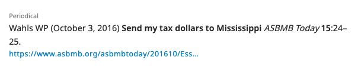
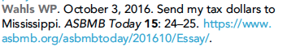

# Periodical references

## What is a periodical reference?

In the strictests sense periodicals are publications issued at regular intervals, such as newspapers, magazines and journals. However, journal articles are excluded from this definition in our context because they are a type of periodical written for a scholarly audience. Journals define periodicals as content published for a generalist audience; newspapers and magazines.





## What needs to be added?

The following information can be added for periodical references:

<table>
  <thead>
    <tr>
      <th style="text-align:left"><b>Kriya field</b>
      </th>
      <th style="text-align:left"><b>Mandatory?</b>
      </th>
      <th style="text-align:left"><b>XML element</b>
      </th>
      <th style="text-align:left">Example</th>
    </tr>
  </thead>
  <tbody>
    <tr>
      <td style="text-align:left">Author</td>
      <td style="text-align:left">At least one author or collaboration is required; both can be present</td>
      <td
      style="text-align:left">
        <p>&lt;person-group person-group-type=&quot;author&quot;&gt;</p>
        <p>&lt;name&gt;</p>
        <p>&lt;surname&gt;Wahls&lt;/surname&gt;</p>
        <p>&lt;given-names&gt;WP&lt;/given-names&gt;</p>
        <p>&lt;/name&gt;</p>
        <p>&lt;/person-group&gt;</p>
        </td>
        <td style="text-align:left">Wahls WP</td>
    </tr>
    <tr>
      <td style="text-align:left">Collaboration(s)</td>
      <td style="text-align:left">At least one author or collaboration is required; both can be present</td>
      <td
      style="text-align:left">
        <p>&lt;person-group person-group-type=&quot;author&quot;&gt;</p>
        <p>&lt;collab&gt;Tulsa 1000 Investigators&lt;/collab&gt;</p>
        <p>&lt;/person-group&gt;</p>
        </td>
        <td style="text-align:left">Tulsa 1000 Investigators</td>
    </tr>
    <tr>
      <td style="text-align:left"></td>
      <td style="text-align:left">Yes</td>
      <td style="text-align:left">
        <p>&lt;string-date iso-8601-date=&quot;1993-09-09&quot;&gt;</p>
        <p>&lt;month&gt;September&lt;/month&gt;</p>
        <p>&lt;day&gt;9&lt;/day&gt;</p>
        <p>&lt;year iso-8601-date=&#x201C;1993&quot;&gt;1993&lt;/year&gt;</p>
        <p>&lt;/string-date&gt;</p>
      </td>
      <td style="text-align:left"></td>
    </tr>
    <tr>
      <td style="text-align:left">Article title</td>
      <td style="text-align:left">Yes</td>
      <td style="text-align:left">
        <p>&lt;article-title&gt;Send my tax dollars to Mississippi&lt;/article-title&gt;</p>
        <p></p>
      </td>
      <td style="text-align:left">Send my tax dollars to Mississippi</td>
    </tr>
    <tr>
      <td style="text-align:left"></td>
      <td style="text-align:left">&lt;source&gt;ASBMB&lt;/publisher-name&gt;</td>
      <td style="text-align:left">University of Exeter</td>
      <td style="text-align:left">ASBMB Today</td>
    </tr>
    <tr>
      <td style="text-align:left"></td>
      <td style="text-align:left"></td>
      <td style="text-align:left"></td>
      <td style="text-align:left"></td>
    </tr>
    <tr>
      <td style="text-align:left"></td>
      <td style="text-align:left"></td>
      <td style="text-align:left"></td>
      <td style="text-align:left"></td>
    </tr>
    <tr>
      <td style="text-align:left"></td>
      <td style="text-align:left"></td>
      <td style="text-align:left"></td>
      <td style="text-align:left"></td>
    </tr>
  </tbody>
</table>

## How to add a periodical reference


## Schematron checks

### Content checks

### **err-elem-cit-periodical-2-1**

**Error**: _\[err-elem-cit-periodical-2-1\] Each  of type 'periodical' must contain one and only one  element. Reference 'XXXXXX' has XXXXXX  elements._

**Action**:

**err-elem-cit-periodical-2-2**

**Error**: _\[err-elem-cit-periodical-2-2\] Each  of type 'periodical' must contain one  with the attribute person-group-type set to 'author'. Reference 'XXXXXX' has a  type of 'XXXXXX'._

**Action**:

**err-elem-cit-periodical-7-1**

**Error**: _\[err-elem-cit-periodical-7-1\] There must be one and only one  element in a  element. Reference 'XXXXXX' has XXXXXX  elements in the  element._

**Action**:

**err-elem-cit-periodical-8-1**

**Error**: _\[err-elem-cit-periodical-8-1\] Each  of type 'periodical' must contain one and only one  element. Reference 'XXXXXX' has XXXXXX  elements._

**Action**:

**err-elem-cit-periodical-9-1**

**Error**: _\[err-elem-cit-periodical-9-1\] Each  of type 'periodical' must contain one and only one  element. Reference 'XXXXXX' has XXXXXX  elements._

**Action**:

**err-elem-cit-periodical-9-2-2**

**Error**: _\[err-elem-cit-periodical-9-2-2\] A  element within a  of type 'periodical' may only contain the child elements , , and . No other elements are allowed. Reference 'XXXXXX' has disallowed child elements._

**Action**:

**err-elem-cit-periodical-10-1-3**

**Error**: _\[err-elem-cit-periodical-10-1-3\] There may be at most one  element within a  of type 'periodical'. Reference 'XXXXXX' has XXXXXX  elements._

**Action**:

**err-elem-cit-periodical-11-1**

**Error**: _\[err-elem-cit-periodical-11-1\] If  is present,  must also be present. Reference 'XXXXXX' has XXXXXX  elements, XXXXXX  elements, and XXXXXX  elements._

**Action**:

**err-elem-cit-periodical-11-2**

**Error**: _\[err-elem-cit-periodical-11-2\] The citation may contain no more than one  or  elements. Reference 'XXXXXX' has XXXXXX  elements and XXXXXX  elements._

**Action**:

**err-elem-cit-periodical-11-3**

**Error**: _\[err-elem-cit-periodical-11-3\] If both  and  are present, the value of  must be less than the value of . Reference 'XXXXXX' has  XXXXXX, which is less than or equal to  XXXXXX._

**Action**:

**err-elem-cit-periodical-11-4**

**Error**: _\[err-elem-cit-periodical-11-4\] The content of the  and  elements can contain any alpha numeric value but no child elements are allowed. Reference 'XXXXXX' has XXXXXX child elements in  and XXXXXX child elements in ._

**Action**:

**err-elem-cit-periodical-13**

**Error**: _\[err-elem-cit-periodical-13\] The only tags that are allowed as children of  with the publication-type="periodical" are: , , , , , , , and . Reference 'XXXXXX' has other elements._

**Action**:

**err-elem-cit-periodical-14-1**

**Error**: _\[err-elem-cit-periodical-14-1\] There must be one and only one  element within a  of type 'periodical'. Reference 'XXXXXX' has XXXXXX  elements._

**Action**:

**err-elem-cit-periodical-7-2**

**Error**: _\[err-elem-cit-periodical-7-2\] The  element must have an @iso-8601-date attribute. Reference 'XXXXXX' does not._

**Action**:

**err-elem-cit-periodical-7-4-1**

**Error**: _\[err-elem-cit-periodical-7-4-1\] The  element in a reference must contain 4 digits, possibly followed by one \(but not more\) lower-case letter. Reference 'XXXXXX' does not meet this requirement as it contains the value 'XXXXXX'._

**Action**:

**err-elem-cit-periodical-7-4-2**

**Warning**: _\[err-elem-cit-periodical-7-4-2\] The numeric value of the 4 digits in the  element must be between 1700 and the current year \(inclusive\). Reference 'XXXXXX' does not meet this requirement as it contains the value 'XXXXXX'._

**Action**:

**err-elem-cit-periodical-7-6**

**Error**: _\[err-elem-cit-periodical-7-6\] If the  element contains the letter 'a' after the digits, there must be another reference with the same first author surname with a letter "b" after the year. Reference 'XXXXXX' does not fulfill this requirement._

**Action**:

**err-elem-cit-periodical-7-7**

**Error**: _\[err-elem-cit-periodical-7-7\] If the  element contains any letter other than 'a' after the digits, there must be another reference with the same first author surname with the preceding letter after the year. Reference 'XXXXXX' does not fulfill this requirement._

**Action**:

**err-elem-cit-periodical-7-8**

**Error**: _\[err-elem-cit-periodical-7-8\] Letter suffixes must be unique for the combination of year and first author surname. Reference 'XXXXXX' does not fulfill this requirement as it contains the  'XXXXXX' more than once for the same first author surname 'XXXXXX'._

**Action**:

**err-elem-cit-periodical-8-2**

**Error**: _\[err-elem-cit-periodical-8-2\] An  element in a reference may contain characters and , , and . No other elements are allowed. Reference 'XXXXXX' does not meet this requirement._

**Action**:

**err-elem-cit-periodical-10-1-2**

**Error**: _\[err-elem-cit-periodical-10-1-2\] A  element within a  of type 'periodical' must contain at least one character and may not contain child elements. Reference 'XXXXXX' has too few characters and/or child elements._

**Action**:

**err-elem-cit-periodical-11-5**

**Error**: _\[err-elem-cit-periodical-11-4\] If the content of  begins with a letter, then the content of  must begin with the same letter. Reference 'XXXXXX' has ='XXXXXX' and ='XXXXXX'._

**Action**:

**err-elem-cit-periodical-14-2**

**Error**: _\[err-elem-cit-periodical-14-2\] The  element must include one of each of  and  elements. Reference 'XXXXXX' does not meet this requirement as it contains XXXXXX  elements and XXXXXX  elements._

**Action**:

**err-elem-cit-periodical-14-3**

**Error**: _\[err-elem-cit-periodical-14-3\] The  element may include one  element. Reference 'XXXXXX' does not meet this requirement as it contains XXXXXX  elements._

**Action**:

**err-elem-cit-periodical-14-8**

**Error**: _\[err-elem-cit-periodical-14-8\] The format of the element content must match , space, , comma, , or , comma, . Reference 'XXXXXX' has XXXXXX._

**Action**:

**err-elem-cit-periodical-7-3**

**Error**: _\[err-elem-cit-periodical-7-3\] The @iso-8601-date value must include 4 digit year, 2 digit month, and \(optionally\) a 2 digit day. Reference 'XXXXXX' does not meet this requirement as it contains the value 'XXXXXX'._

**Action**:

**err-elem-cit-periodical-7-5**

**Error**: _\[err-elem-cit-periodical-7-5\] The numeric value of the 4 digits in the @iso-8601-date attribute must match the first 4 digits on the  element. Reference 'XXXXXX' does not meet this requirement as the element contains the value 'XXXXXX' and the attribute contains the value 'XXXXXX'._

**Action**:

**err-elem-cit-periodical-14-4**

**Error**: _\[err-elem-cit-periodical-14-4\] The content of  must be the month, written out, with correct capitalization. Reference 'XXXXXX' does not meet this requirement as it contains the value ='XXXXXX'._

**Action**:

**err-elem-cit-periodical-14-5**

**Error**: _\[err-elem-cit-periodical-14-5\] The content of  must match the content of the month section of @iso-8601-date on the parent string-date element. Reference 'XXXXXX' does not meet this requirement as it contains the value ='XXXXXX' but /@iso-8601-date='XXXXXX'._

**Action**:

**err-elem-cit-periodical-14-6**

**Error**: _\[err-elem-cit-periodical-14-6\] The content of , if present, must be the day, in digits, with no zeroes. Reference 'XXXXXX' does not meet this requirement as it contains the value ='XXXXXX'._

**Action**:

**err-elem-cit-periodical-14-7**

**Error**: _\[err-elem-cit-periodical-14-7\] The content of , if present, must match the content of the day section of @iso-8601-date on the parent string-date element. Reference 'XXXXXX' does not meet this requirement as it contains the value ='XXXXXX' but /@iso-8601-date='XXXXXX'._

**Action**:XML structure checks

**pub-name-newspaper**

**Warning**: _XXXXXX contains the text 'guardian', 'independent', 'times' or 'post' - XXXXXX - is it a newspaper reference? If so, it should be captured as a web or a periodical reference._

**Action**:

**err-elem-cit-high-6-2**

**Error**: _element-citation must have a publication-type attribute with one of these values: 'journal', 'book', 'data', 'patent', 'software', 'preprint', 'web', 'periodical', 'report', 'confproc', or 'thesis'. Reference 'XXXXXX' has 'XXXXXX'._

**Action**:

## XML structure

Here are  some examples of how the XML will look for periodical references.

```text
<ref id="bib33">
<element-citation publication-type="periodical">
<person-group person-group-type="author">
<name>
<surname>Wahls</surname>
<given-names>WP</given-names>
</name>
</person-group>
<string-date>
<month>October</month>
<day>3</day>
,
<year iso-8601-date="2016-10-03">2016</year>
</string-date>
<article-title>Send my tax dollars to Mississippi</article-title>
<source>ASBMB Today</source>
<volume>15</volume>
<fpage>24</fpage>
<lpage>25</lpage>
<ext-link ext-link-type="uri" xlink:href="https://www.asbmb.org/asbmbtoday/201610/Essay/">https://www.asbmb.org/asbmbtoday/201610/Essay/</ext-link>
</element-citation>
</ref>


<ref id="bib40">
        <element-citation publication-type="periodical">
            <person-group person-group-type="author">
                <name>
                    <surname>Schwartz</surname>
                    <given-names>J</given-names>
                </name>
            </person-group>
            <string-date iso-8601-date="1993-09-09"><month>September</month> <day>9</day>, <year iso-8601-date="1993">1993</year></string-date>
            <article-title>Obesity affects economic, social status</article-title>
            <source>The Washington Post</source>
            <fpage>A1</fpage>
            <lpage>A4</lpage>
        </element-citation>
    </ref>
```

