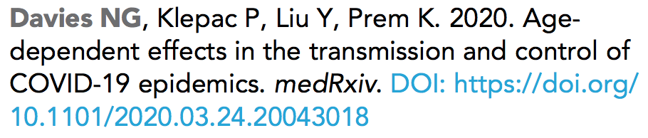
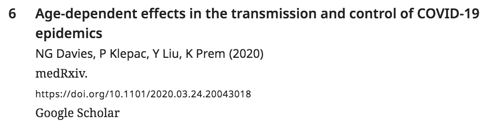
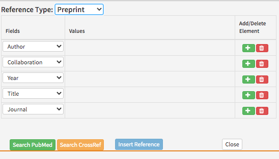
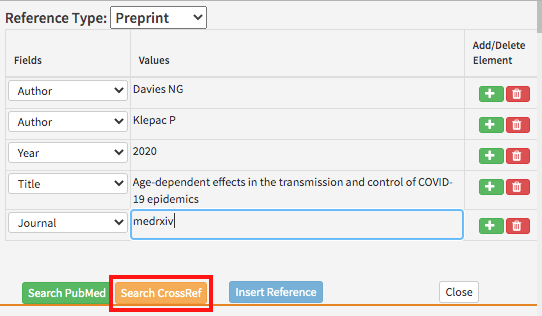
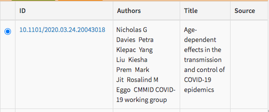
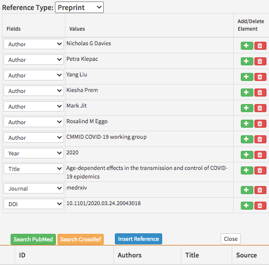

# Preprint references

## What is a preprint?

A preprint is a manuscript which has been published online, but has not gone through any form of peer review. Preprints may undergo peer review subsequent to their initial publication, and may potentially then be published in an academic journal. Popular preprint servers include \(but are not limited to\) bioRxiv, arXiv, chemRxiv, medRxiv and so on.

## What is a preprint reference?

A preprint reference provides the bibliographic details for a preprint in the reference list.





## What needs to be added?

The following information can be added for preprint references:

<table>
  <thead>
    <tr>
      <th style="text-align:left">Kriya field</th>
      <th style="text-align:left">Mandatory?</th>
      <th style="text-align:left">XML element</th>
      <th style="text-align:left">Example</th>
    </tr>
  </thead>
  <tbody>
    <tr>
      <td style="text-align:left">Author(s)</td>
      <td style="text-align:left">At least one author or collaboration is required; both can be present</td>
      <td
      style="text-align:left">&lt;person-group person-group-type=&quot;author&quot;&gt;&lt;name&gt;&lt;surname&gt;Davies&lt;/surname&gt;
        &lt;given-names&gt;NG&lt;/given-names&gt;&lt;/name&gt;&lt;/person-group&gt;</td>
        <td
        style="text-align:left">Davies NG</td>
    </tr>
    <tr>
      <td style="text-align:left">Collaboration(s)</td>
      <td style="text-align:left">At least one author or collaboration is required; both can be present</td>
      <td
      style="text-align:left">&lt;person-group person-group-type=&quot;author&quot;&gt;&lt;collab&gt;Tulsa
        1000 Investigators&lt;/collab&gt;&lt;/person-group&gt;</td>
        <td style="text-align:left">Tulsa 1000 Investigators</td>
    </tr>
    <tr>
      <td style="text-align:left">Year</td>
      <td style="text-align:left">Yes</td>
      <td style="text-align:left">&lt;year iso-8601-date=&quot;2020&quot;&gt;2020a&lt;/year&gt;</td>
      <td
      style="text-align:left">2020</td>
    </tr>
    <tr>
      <td style="text-align:left">Title</td>
      <td style="text-align:left">Yes</td>
      <td style="text-align:left">&lt;article-title&gt;Age-dependent effects in the transmission and control
        of COVID-19 epidemics&lt;/article-title&gt;</td>
      <td style="text-align:left">Age-dependent effects in the transmission and control of COVID-19 epidemics</td>
    </tr>
    <tr>
      <td style="text-align:left">Preprint server</td>
      <td style="text-align:left">Yes</td>
      <td style="text-align:left">&lt;source&gt;medRxiv&lt;/source&gt;</td>
      <td style="text-align:left">medRxiv</td>
    </tr>
    <tr>
      <td style="text-align:left">DOI</td>
      <td style="text-align:left">At least one DOI or URL is required, and they are mutually exclusive</td>
      <td
      style="text-align:left">&lt;pub-id pub-id-type=&quot;doi&quot;&gt;10.1101/2020.03.24.20043018&lt;/pub-id&gt;</td>
        <td
        style="text-align:left">10.1101/2020.03.24.20043018</td>
    </tr>
    <tr>
      <td style="text-align:left">URL</td>
      <td style="text-align:left">At least one DOI or URL is required, and they are mutually exclusive</td>
      <td
      style="text-align:left">
        <p>&lt;ext-link ext-link-type=&quot;uri&quot; xlink:href=&quot;https://arxiv.org/abs/2006.15084&quot;&gt;</p>
        <p>https://arxiv.org/abs/2006.15084&lt;/ext-link&gt;</p>
        </td>
        <td style="text-align:left">https://arxiv.org/abs/2006.15084</td>
    </tr>
  </tbody>
</table>

Validation of references via the Crossref API tool should pull in the information for preprints with a Crossref DOI \(currently only preprints from bioRxiv that are funded by NIH are indexed on PubMed so it is not a comprehensive list\). Please note some preprint servers may use DataCite for their DOIs and so will not be listed in the Crossref API. Schematron warnings may also pick up incomplete references, and these should be checked at the source of the reference.

* **Authors**: Enter each author name as a surname\(s\) followed by initials. 
* **Collaboration:** Preprints can have group or individual authors or a combination of both. Group authors should be placed in the order in which they appear in the original source. An author list can be a mix of both individual and group authors e.g. Smith J, Jones T, National Institutes of Health, Bloggs J etc.
* **Year**: This should be the year the preprint was published. This field can include a letter suffix \(e.g. 2020a\) if needed to distinguish between citations \(see more [here](../reference-citations.md#what-is-a-reference-citation)\).
* **Title**: The title of the article. Can contain italics, superscript and subscript as required.
* **Preprint server**: The full \(not abbreviated\) name of the server in which the preprint was published.
* **DOI:** The Digital Object Identifier for the preprint \(if applicable\).
* **URL:** The URL for a preprint \(if applicable\).

Please note that publication ids such as `2020.03.24.20043018` are not currently captured by eLife, but they will be in the future.

If any of the mandatory information is not provided, look up the preprint on the preprint server. You should be able to find all the mandatory information there. In the event that you cannot find it, please leave the following author query, replacing 'XXXXXX' with the missing information:

* Please provide the XXXXXX for this reference.

## **How to add a preprint reference**

Right-click where you want to add the citation and click on Add New &gt; Add New Reference and select Preprint under Reference Type.



The default fields in Kriya will need to be altered to include the following information in the order below. To delete an unnecessary field click the red 'bin' button \(if this doesn't work, try re-validating after all fields have been filled out, or change the field type to the one you need\). To add a field click the green '+' button to the entry above where you need to add it.

* Author 
* Collaboration \(if applicable\)
* Year 
* Title
* Journal \(preprint server\)
* Website \(if applicable\)
* DOI \(if applicable\)

Once you have entered the information in the fields, click on 'Search Crossref' \(only some preprints are indexed on PubMed but those that are have a Crossref DOI anyway so it is better to use Crossref\). This will compare the information entered to the Crossref database and ensures that a DOI is added \(some DOIs may be registered via DataCite and these will not appear in the Crossref API and some preprints do not have DOIs\).



Click the article with the correct authors, title and journal. This will automatically fill in the remaining fields if the information hasn't been added already.





The minimum fields that need to be populated for the PubMed and CrossRef validators to find an article are:

* First author name
* Year
* Title
* Journal

Some preprint references will not appear when searching the CrossRef database \(not all of them have DOIs or are DataCite DOIs\). If you have entered the article details correctly and verified that it is the same in the original submitted version, you can just click on 'Insert Reference' to add the reference to the article.

## Updating a preprint reference to a journal reference

If a cited preprint has been published while an eLife article is in the production process, it may be necessary to update it in the eLife article to a journal reference \(see [Journal references](journal-references.md)\). This should only be done on the instruction of the author\(s\) of the eLife article, in other words, there is no need to check every preprint reference in order to determine whether it has been published as a journal.

## Schematron checks 

### Content checks

These checks relate to the content of preprint references. X or XXXXXX refers to quoted text which will change depending on the article.

#### not-rxiv-test

**Warning**: _ref 'XXXXXX' is tagged as a preprint, but has a source XXXXXX, which doesn't look like a preprint. Is it correct?_

**Action**: This will fire if the Journal field in Kriya \(which is the source element in the XML\) has a value which is not one of the following \(ignoring capitalisation\):

* biorxiv
* arxiv
* chemrxiv
* medrxiv
* peerj preprints
* psyarxiv
* paleorxiv
* preprints

These are the known preprint servers that are commonly cited in eLife articles. If this fires, check that the reference is actually a preprint. If it is, then this can be ignored \(it is also worth notifying the production-schematron slack channel that this test needs updating to account for that preprint server\). If it's not a preprint reference \(such as a journal article for example\), then it should be captured as an appropriate reference type.

#### biorxiv-test

**Error:** _ref 'XXXXXX' has a source XXXXXX, which is not the correct proprietary capitalisation - 'bioRxiv'._

**Action**: This will fire if the preprint server \(Journal field in Kriya, source element in the XML\) contains the text bioRxiv without the correct capitalisation, for example 'Biorxiv' or 'BiOrXiV'. Ensure that bioRxiv is added with the correct capitalisation. 

#### arxiv-test

**Error:** _ref 'XXXXXX' has a source XXXXXX, which is not the correct proprietary capitalisation - 'arXiv'._

**Action**: This will fire if the preprint server \(Journal field in Kriya, source element in the XML\) contains the text arXiv without the correct capitalisation, for example 'Arxiv' or 'ArXiV'. Ensure that arXiv is added with the correct capitalisation. 

#### chemrxiv-test

**Error:** _ref 'XXXXXX' has a source XXXXXX, which is not the correct proprietary capitalisation - 'ChemRxiv'._

**Action**: This will fire if the preprint server \(Journal field in Kriya, source element in the XML\) contains the text ChemRxiv without the correct capitalisation, for example 'Chemrxiv' or 'ChEmRxIv'. Ensure that ChemRxiv is added with the correct capitalisation. 

#### medrxiv-test

**Error:** _ref 'XXXXXX' has a source XXXXXX, which is not the correct proprietary capitalisation - 'medRxiv'._

**Action**: This will fire if the preprint server \(Journal field in Kriya, source element in the XML\) contains the text medRxiv without the correct capitalisation, for example 'Medrxiv' or 'MeDRxiv'. Ensure that medRxiv is added with the correct capitalisation. 

#### peerjpreprints-test

**Error:** _ref 'XXXXXX' has a source XXXXXX, which is not the correct proprietary capitalisation - 'PeerJ Preprints'._

**Action**: This will fire if the preprint server \(Journal field in Kriya, source element in the XML\) contains the text PeerJ Preprints without the correct capitalisation, for example 'Peerj Preprints' or 'PEerJ PrePrints'. Ensure that PeerJ Preprints is added with the correct capitalisation. 

#### psyarxiv-test

**Error:** _ref 'XXXXXX' has a source XXXXXX, which is not the correct proprietary capitalisation - 'PsyArXiv'._

**Action**: This will fire if the preprint server \(Journal field in Kriya, source element in the XML\) contains the text PsyArXiv without the correct capitalisation, for example 'Psyarxiv' or 'PSyArXiv'. Ensure that PsyArXiv is added with the correct capitalisation. 

#### paleorxiv-test

**Error:** _ref 'XXXXXX' has a source XXXXXX, which is not the correct proprietary capitalisation - 'PaleorXiv'._

**Action**: This will fire if the preprint server \(Journal field in Kriya, source element in the XML\) contains the text PaleorXiv without the correct capitalisation, for example 'Paleorxiv' or 'PaLeOrXiV'. Ensure that PaleorXiv is added with the correct capitalisation.

#### preprint-replacement-character-presence

**Error:** _source element contains the replacement character '�' which is unallowed - XXXXXX_

**Action**: This error will appear if the preprint server \(Journal field in Kriya, source element in the XML\) contains the character ‘�’. This usually indicates a conversion error has occurred and an unknown, unrecognized or unrepresentable character has been replaced with ‘�’. Search the preprint on the web and update with the correct character.

#### preprint-handbook-presence

**Error:** _Preprint ref 'XXXXXX' has a source 'XXXXXX'. Should it be captured as a book type reference instead?_

**Action**: This error will appear if a preprint reference has a preprint server \(Journal field in Kriya, source element in the XML\) that includes the word 'handbook'. This indicates that the reference should actually be a book reference instead of a preprint reference. Change the reference to a book reference \(hyperlink to be added\) and update the fields accordingly.

### XML Structure checks

These checks relate to the XML structure of preprint references. For more information about what the XML should look like, [**see below**](preprint-references.md#xml-structure).

#### err-elem-cit-preprint-2-1

**Error:**_There must be one and only one person-group. Reference 'XXXXXX' has XXXXXX &lt;person-group&gt; elements._

**Action**: If there is no author list present, one will need to be added to the reference. Look the article up online if possible; otherwise raise an author query on the proof for the missing information. In cases where no author is given \(which is very unlikely for preprints\), 'Anon' will most likely need to be added in the 'Collaboration' field \(`<collab>`\). If there are multiple person-group elements, this means there has been an error in processing - Exeter will need to fix this.

#### err-elem-cit-preprint-8-1

**Error:** _Each &lt;element-citation&gt; of type 'preprint' must contain one and only one &lt;article-title&gt; element. Reference 'XXXXXX' has XXXXXX  elements._

**Action**: This error will appear if a preprint reference has more than one or no titles. If the authors have not provided the title but have given other bibliographic details \(e.g. preprint server, DOI\) it may be possible to search for the preprint online. If there are not enough details to find the title, add the following author query:

* Please provide the title for this reference.

If the reference has more than one title, compare the details with the original submission to work out which is the correct title and enter that, delete the extra title. 

#### err-elem-cit-preprint-9-1

**Error:** _Each &lt;element-citation&gt; of type 'preprint' must contain one and only one &lt;source&gt; element. Reference 'XXXXXX' has XXXXXX  elements._

**Action**: This error will appear if a preprint reference has more than one or no preprint server name. Check that the preprint server name has not been accidentally captured as part of the title \(which will result in no source, i.e. Journal\) or that the preprint server name or title has not been split out over multiple source entries. If the authors have not provided the preprint server name but have given other bibliographic details \(e.g. title, DOI\) it may be possible to search for the preprint online. If there are not enough details to find it, add the following author query:

* Please provide the preprint server for this reference.

#### err-elem-cit-preprint-10-1

**Error:** _One &lt;pub-id&gt; element is allowed. Reference 'XXXXXX' has XXXXXX  &lt;pub-id&gt; elements._

**Action**: This will fire if a preprint reference contains more than one doi. Compare the details with the original submission, or search online to work out which is the correct doi and enter that. If that doesn't work, then this will have to corrected by Exeter.

#### err-elem-cit-preprint-10-3

**Error:** _Either one &lt;pub-id&gt; or one &lt;ext-link&gt; element is required in a preprint reference. Reference 'XXXXXX' has XXXXXX &lt;pub-id&gt; elements and XXXXXX &lt;ext-link&gt; elements._

**Action**: This will fire if a preprint reference contains both a DOI and a URL \(or numerous version for each\). If the preprint has a DOI, then this should always be used, so the URL should be removed \(provided that it is correct\). If the URL is correct and DOI needs removing, this will have to be done by Exeter.

#### err-elem-cit-preprint-13

**Error:** _The only tags that are allowed as children of &lt;element-citation&gt; with the publication-type="preprint" are: &lt;person-group&gt;, &lt;article-title&gt;, &lt;source&gt;, &lt;year&gt;, &lt;pub-id&gt;, and &lt;ext-link&gt;. Reference 'XXXXXX' has other elements._

**Action**: This error will appear if a preprint reference has any xml elements other than the ones in the message \(e.g. string date\). Check the XML and remove the extra elements from the reference in Kriya.

#### err-elem-cit-preprint-2-2

**Error:** _The &lt;person-group&gt; element must contain @person-group-type='author'. The &lt;person-group&gt; element in Reference 'XXXXXX' contains @person-group-type='XXXXXX'._

**Action**: This error will appear if there is no author list, or if authors have been tagged as other kinds of contributors \(e.g. editors or curators\). If there is no author list, make sure this is added by searching for the article details online. If there are contributors other than authors or collaborations in the reference in Kriya, this means there has been an error in processing - Exeter will need to fix this.

#### err-elem-cit-preprint-10-2

**Error:** _If present, the &lt;pub-id&gt; element must contain @pub-id-type='doi'. The &lt;pub-id&gt; element in Reference 'XXXXXX' contains @pub-id-type='XXXXXX'._

**Action**: This will fire if there is a `<pub-id>` element without the attribute `pub-id-type='doi'`. The only pub-id value allowed is `'doi'`. Please delete the pub-id and add a DOI or URL.

#### err-elem-cit-preprint-8-2-1

**Error:** _A &lt;article-title&gt; element within a &lt;element-citation&gt; of type 'preprint' must contain at least two characters. Reference 'XXXXXX' has too few characters._

**Action**: This will fire if the title in a preprint reference contains fewer than 2 characters. Search for the preprint online. If there are not enough details to find the full title, add the following author query at pre-author stages:

* Please provide the title for this reference.

And contact the authors at post-authors stages in order to get this information.

#### err-elem-cit-preprint-8-2-2

**Error:** _A &lt;article-title&gt; element within a &lt;element-citation&gt; of type 'preprint' may only contain the child elements &lt;italic&gt;, &lt;sub&gt;, and &lt;sup&gt;. No other elements are allowed. Reference 'XXXXXX' has disallowed child elements._

**Action**: This error will appear if there are formatting elements in the preprint title other than italics, superscripts and subscripts \(e.g. bold, underline\). Make sure any disallowed formatting elements are removed from the title.

#### err-elem-cit-preprint-9-2-2

**Error:** _A &lt;source&gt; element within a &lt;element-citation&gt; of type 'preprint' may only contain the child elements &lt;italic&gt;, &lt;sub&gt;, and &lt;sup&gt;. No other elements are allowed. Reference 'XXXXXX' has disallowed child elements._

**Action**: This error will appear if there are formatting elements in the preprint server name other than italics, superscripts and subscripts \(e.g. bold, underline\). Make sure any disallowed formatting elements are removed from the title.

## XML structure

Here are some examples of how the XML will look for various preprint references.

Preprint reference with a DOI.

```markup
<ref id="bib6">
    <element-citation publication-type="preprint">
        <person-group person-group-type="author">
            <name>
                <surname>Davies</surname>
                <given-names>NG</given-names>
            </name>
            <name>
                <surname>Klepac</surname>
                <given-names>P</given-names>
            </name>
            <name>
                <surname>Liu</surname>
                <given-names>Y</given-names>
            </name>
            <name>
                <surname>Prem</surname>
                <given-names>K</given-names>
            </name>
        </person-group>
        <year iso-8601-date="2020">2020</year>
        <article-title>Age-dependent effects in the transmission and control of COVID-19
            epidemics</article-title>
        <source>medRxiv</source>
        <pub-id pub-id-type="doi">10.1101/2020.03.24.20043018</pub-id>
    </element-citation>
</ref>
```

Preprint reference with a URL.

```markup
<ref id="bib28">
    <element-citation publication-type="preprint">
        <person-group person-group-type="author">
            <name>
                <surname>Neto</surname>
                <given-names>EC</given-names>
            </name>
            <name>
                <surname>Hoff</surname>
                <given-names>BR</given-names>
            </name>
            <name>
                <surname>Bare</surname>
                <given-names>C</given-names>
            </name>
            <name>
                <surname>Bot</surname>
                <given-names>BM</given-names>
            </name>
            <name>
                <surname>Yu</surname>
                <given-names>T</given-names>
            </name>
            <name>
                <surname>Magravite</surname>
                <given-names>L</given-names>
            </name>
            <name>
                <surname>Stolovitzky</surname>
                <given-names>G</given-names>
            </name>
        </person-group>
        <year iso-8601-date="2016">2016</year>
        <article-title>Reducing overfitting in challenge-based competitions</article-title>
        <source>arXiv</source>
        <ext-link ext-link-type="uri" xlink:href="http://arxiv.org/abs/1607.00091"
            >http://arxiv.org/abs/1607.00091</ext-link>
    </element-citation>
</ref>
```

