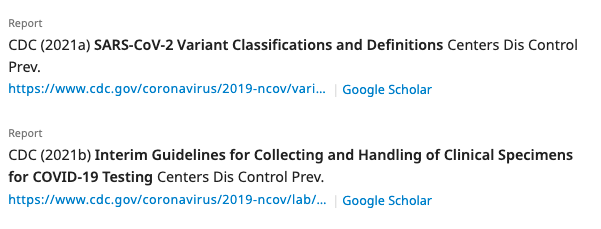
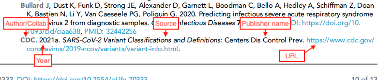
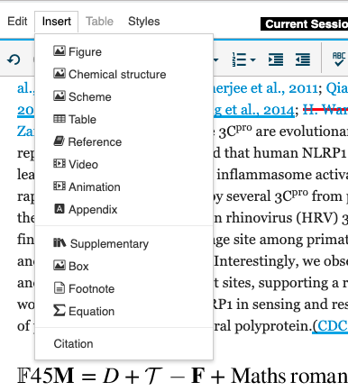
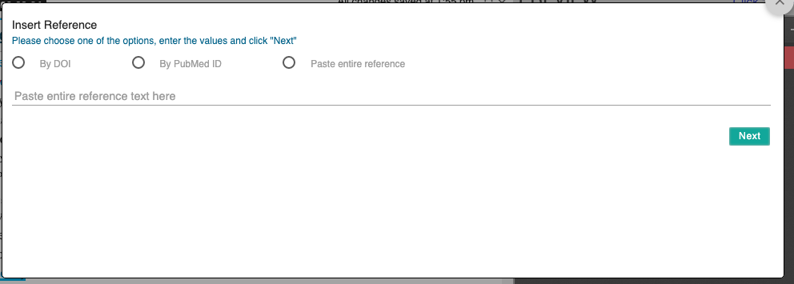
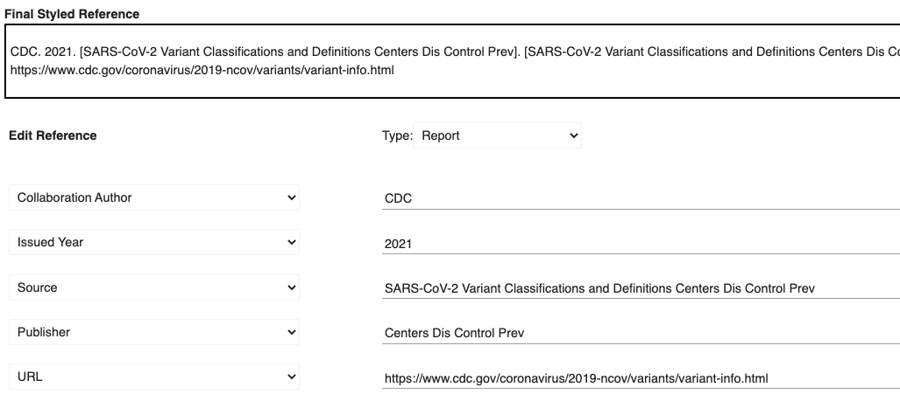

# Report references

## What is a report reference?

A report reference provides the bibliographic details for a report in the reference list. A report is any document produced by an organisation that is issued on its own rather than in a journal or as a book. It covers things like white papers and instructions from manufacturers.

##



For eLife articles, each part of the reference is formatted specifically:




## What needs to be added?

The following information can be added for report references:

| Kriya 2 field           | Mandatory?                                                            | XML element                                                                                                                                                                               | Example                                                                                                    |
| ----------------------- | --------------------------------------------------------------------- | ----------------------------------------------------------------------------------------------------------------------------------------------------------------------------------------- | ---------------------------------------------------------------------------------------------------------- |
| Author(s)               | At least one author or collaboration is required; both can be present | \<person-group person-group-type="author">\<name>\<surname>Davies\</surname> \<given-names>NG\</given-names>\</name>\</person-group>                                                      | Davies NG                                                                                                  |
| Collaboration Author(s) | At least one author or collaboration is required; both can be present | <p>&#x3C;person-group person-group-type="author"></p><p>World Health Organization &#x3C;/person-group></p>                                                                                | World Healt Organization                                                                                   |
| Issued year             | Yes                                                                   | \<year iso-8601-date="2020">2020\</year>                                                                                                                                                  | 2020                                                                                                       |
| Source                  | Yes                                                                   | \<source>Report on Antimalarial Drug Efficacy, Resistance and Response: 10 Years of Surveillance (2010–2019) Geneva\</source>                                                             | Report on Antimalarial Drug Efficacy, Resistance and Response: 10 Years of Surveillance (2010–2019) Geneva |
| Publisher               | Yes                                                                   | \<publisher-name>World Health Organization\</publisher-name>                                                                                                                              | World Health Organization                                                                                  |
| Publisher place         | Optional                                                              | \<publisher-loc>Geneva, Switzerland\</publisher-loc>                                                                                                                                      | Geneva, Switzerland                                                                                        |
| URL                     | Optional                                                              | <p>&#x3C;ext-link ext-link-type=“uri” xlink:href="https://www.who.int/publications/i/item/9789240012813"></p><p>https://www.who.int/publications/i/item/9789240012813&#x3C;/ext-link></p> | https://www.who.int/publications/i/item/9789240012813                                                      |
| DOI, ISBN               | Option                                                                | \<pub-id pub-id-type="isbn">978-92-4-001281-3\</pub-id>                                                                                                                                   | 978-92-4-001281-3                                                                                          |

Where the optional information is available, this should also be added in. Even though a URL is optional, it is prefereable.

### **How to add a report reference**

From the top toolbar click on Insert and select Reference:



You will be presented with the following interface:



Because reports are not standard references, the best option is to paste the entire reference into the interface and select 'Paste entire reference'. Then press Next. Once this is done select the Report type and change the fields on the left to match what we require:



## Schematron checks

### **XML structure checks**

These checks relate to the XML structure of report references. X or XXXXXX refers to quoted text which will change depending on the article. For examples of what the XML should look like, [**see below**](report-references.md#xml-examples).

**err-elem-cit-report-2-1**

**Error**: _\[err-elem-cit-report-2-1] One and only one person-group element is allowed. Reference 'XXXXXX' has XXXXXX  \<person-group> elements._

**Action**: If there is no author list present, one will need to be added to the reference. Look the article up online if possible; otherwise raise an author query on the proof for the missing information. In cases where no author is given, 'Anon' will most likely need to be added in the 'Collaboration' field (`<collab>`). If there are multiple person-group elements, this means there has been an error in processing - Exeter will need to fix this.

**err-elem-cit-report-9-1**

**Error**: _\[err-elem-report-report-9-1] Each \<element-citation> of type 'report' must contain one and only one \<source> element. Reference 'XXXXXX' has XXXXXX  elements._

**Action**: This error will appear if a report reference has more than one or no source. Check that the source has not been accidentally captured as a title or the publisher name. A source is required for report references so if it is missing raise an author query on the proof for the missing information.

**err-elem-cit-report-11-1**

**Error**: _\[err-elem-cit-report-11-1] \<publisher-name> is required. Reference 'XXXXXX' has XXXXXX \<publisher-name> elements._

**Action**: This error will appear if a report reference has more than one or no publisher name. Check that the publisher name has not been accidentally captured as a title, source or author. A publisher name is required for report references so if it is missing raise an author query on the proof for the missing information.

**warning-elem-cit-report-11-3**

**Warning**: _\[warning-elem-cit-report-11-3] The content of \<publisher-name> may not end with a publisher location. Reference 'XXXXXX' contains the string XXXXXX, which ends with a publisher location._

**Action**: This error will appear if a report reference has a publisher name that appears to have a geographical location at the end of it. If it does, remove the location and retag this information as \<publisher-loc> (Publisher place).

**err-elem-cit-report-15**

**Error**: _\[err-elem-cit-report-15] The only tags that are allowed as children of \<element-citation>  with the publication-type="report" are: \<person-group> , \<year>, \<source>, \<publisher-loc>, \<publisher-name>, \<ext-link>, and \<pub-id>. Reference 'XXXXXX' has other elements._

**Action**: This error will appear if a report reference has any xml elements other than the ones in the message (e.g. article title). Check the XML and remove the extra elements from the reference in Kriya.

**err-elem-cit-report-14**

**Error**: _Report reference cannot have both a doi and a URL. Reference 'XXXXXX' has a doi (XXXXXX) and a URL (XXXXXX)._

**Action**: A DOI is a persistent identifier and turns into a resolvable link, so is a preferred reference element. It is not necessary to have a URL too, so this should be removed if present when there is also a DOI.

**err-elem-cit-report-2-2**

**Error**: _\[err-elem-cit-report-2-2] Each \<person-group> must have a @person-group-type attribute of type 'author'. Reference 'XXXXXX' has a \<person-group> element with @person-group-type attribute 'XXXXXX'._

**Action**: If another label for this attribute is used (eg "curator") for reports it must be changed to "author". If this happens there has been an error in processing - Exeter will need to fix this.

**err-elem-cit-report-9-2-2**

**Error**: _\[err-elem-cit-report-9-2-2] A \<source> element within a \<element-citation> of type 'report' may only contain the child elements: \<italics>, \<sub>, and \<super>. No other elements are allowed. Reference 'XXXXXX' has child elements that are not allowed._

**Action**: The only formatting of the source allowed is superscript, subscript or italics. If something else (eg \<bold>) has been used this will need to be removed. If you cannot change this via the interface there has been an error in processing - Exeter will need to fix this.

**err-elem-cit-report-11-2**

**Error**: _\[err-elem-cit-report-11-2] No elements are allowed inside \<publisher-name>. Reference 'XXXXXX' has child elements within the \<publisher-name> element._

**Action**: This indicates an XML processing error OR that formatting has been applied to a publisher name, which is not allowed. If formatting (eg bold or italics) has been used this will need to be removed. If you cannot change this via the interface there has been an error in processing - Exeter will need to fix this.

**err-elem-cit-report-12-2**

**Error**: _\[err-elem-cit-report-12-2] The only allowed pub-id types are 'doi' and 'isbn'. Reference 'XXXXXX' has a pub-id type of 'XXXXXX'._

**Action**: This indicates a pub-id that is not an ISBN or DOI has been used or one of these has been mislabelled in the XML. Retag the field correctly to fix this error or remove the content if it is not requir

### XML examples

```
<ref id="bib15">
<element-citation publication-type="report">
<person-group person-group-type="author">
<collab>World Health Organization</collab>
</person-group>
<year iso-8601-date="2020">2020</year>
<source>Report on Antimalarial Drug Efficacy, Resistance and Response: 
10 Years of Surveillance (2010–2019) Geneva</source>
<publisher-name>World Health Organization</publisher-name>
</element-citation>
</ref>

<ref id="bib16">
<element-citation publication-type="report">
<person-group person-group-type="author">
<collab>CDC</collab>
</person-group>
<year iso-8601-date="2019">2019</year>
<source>The biggest antibiotic-resistant threats in the U.S</source>
<publisher-name>Centers for Disease Control and Prevention</publisher-name>
<ext-link ext-link-type="uri" xlink:href=
"https://www.cdc.gov/drugresistance/biggest-threats.html">
https://www.cdc.gov/drugresistance/biggest-threats.html</ext-link>
</element-citation>
</ref>

<ref id="bib4">
<element-citation publication-type="report">
<person-group person-group-type="author">
<collab>CDC</collab>
</person-group>
<year iso-8601-date="2021">2021a</year>
<source>SARS-CoV-2 Variant Classifications and Definitions</source>
<publisher-name>Centers Dis Control Prev</publisher-name>
<ext-link ext-link-type="uri" xlink:href=
"https://www.cdc.gov/coronavirus/2019-ncov/variants/variant-info.html">
https://www.cdc.gov/coronavirus/2019-ncov/variants/variant-info.html</ext-link>
</element-citation>
</ref>
<ref id="bib5">
<element-citation publication-type="report">
<person-group person-group-type="author">
<collab>CDC</collab>
</person-group>
<year iso-8601-date="2021">2021b</year>
<source>Interim Guidelines for Collecting and Handling of Clinical Specimens for 
COVID-19 Testing</source>
<publisher-name>Centers Dis Control Prev</publisher-name>
<ext-link ext-link-type="uri" xlink:href=
"https://www.cdc.gov/coronavirus/2019-ncov/lab/guidelines-clinical-specimens.html">
https://www.cdc.gov/coronavirus/2019-ncov/lab/guidelines-clinical-specimens.html
</ext-link>
</element-citation>
</ref>
```
