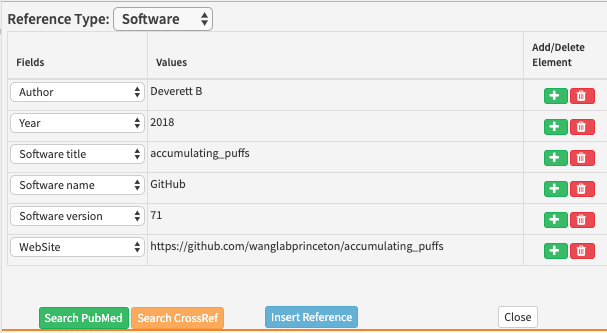

# Software references

## What is a software reference?

Within the reference list, software references provide information about any software that was used for the work presented in an article. 


Often, authors will include url links to software they have used in their studies. These need to be added as software references so they can be cited properly. 


## How to add a software reference

As a minimum, the following information needs to be added for software references:

* Author or collaboration 
* Year 
* Software title
* Software name 

Where information is also available about the software version and website, this should also be added in.

To add a GitHub reference after [forking code](../../../toolkit/github/forking-git-based-repos.md) for example, in Kriya, click on 'Add reference' and select 'Software.' 


The default fields in Kriya will need to be altered to include the following information in this order:

* Author - for GitHub references, you can just enter the first author's name
* Year - the year the repository was made 
* Software title - for GitHub references, this is the name of the repository 
* Software name - GitHub
* Software version - for GitHub references, this is the latest commit number
* Website - This should be a link to the original \(not the forked\) repository



After adding a reference, make sure a citation is added whenever the software is mentioned in the text or in the key resources table. 

## **When to add software references**

Any references to tools or packages that were used for analysing data or generating figures should be cited as a software reference. This includes entries within the key resources table. 


## **Schematron warnings**

‌The following tests are run on software references. X or XXXXXX refers to quoted text which will change depending on the article.

### **Content warnings**

‌These warnings relate to the content of a software reference.

#### **zenodo-check**

**Error**: _Journal ref 'XXXXXX' has a source title 'XXXXXX' which must be incorrect. It should be a data or software type reference._

**Action:** This error will fire if a Zenodo link has been entered as a journal reference. The ‘XXXXXX’ in this message will refer to the reference in question and its title respectively. Make sure the reference is changed to a software instead of a journal reference. 

#### **github-web-test**

**Warning**: _web ref 'XXXXXX' has a link which contains 'github', therefore it should almost certainly be captured as a software ref \(unless it's a blog post by GitHub\)._

**Action:** This warning will fire if a website reference contains the word ‘github’. If the link is to a repository on GitHub, this reference needs to be changed from a website to a software reference. If the link is to a blog post by GitHub, it can be kept as a website reference.

#### **R-test-1**

**Error**: _software ref 'XXXXXX' has a data-title - XXXXXX - but it does not have one collab element containing 'R Development Core Team'._

**Action:** This error will appear if the data title of a software is ‘R: A Language and Environment for Statistical Computing’ and there is no collaboration element present. Make sure the collaboration is entered as ‘R Development Core Team’.

#### **R-test-2**

**Error**: _software ref 'XXXXXX' has a data-title - XXXXXX - but it has XXXXXX collab element\(s\)._

**Action:** This error will appear if the data title of a software is ‘R: A Language and Environment for Statistical Computing’ and there is no collaboration element present. Make sure the collaboration is entered as ‘R Development Core Team’.

**R-test-3**

**Error**: _software ref 'XXXXXX' has a data-title - XXXXXX - but does not have a &lt;publisher-loc&gt;Vienna, Austria&lt;/publisher-loc&gt; element._

**Action:** This error will appear if the data title of a software is ‘R: A Language and Environment for Statistical Computing’ and the publisher location is not entered correctly. It should be entered as ‘Vienna, Austria’.

**R-test-4**

**Error**: _software ref 'XXXXXX' has a data-title - XXXXXX - but does not have a 'http://www.r-project.org' type link._

**Action:** This error will appear if the data title of a software is ‘R: A Language and Environment for Statistical Computing’ and the external link has not been entered correctly. Make sure the external link is added as a URI and entered as ‘http://www.r-project.org’.

**R-test-5**

**Error**: _software ref 'XXXXXX' has a source - XXXXXX - but this is the data-title._

**Action:** This error will appear if a software reference has a source which contains the text ’R: A Language and Environment for Statistical Computing’. This should be entered as a data title instead.

**R-test-6**

**Error**: _software ref 'XXXXXX' has a publisher-name - XXXXXX - but this is the data-title._

**Action:** This error will appear if a software reference has a publisher name which contains the text ’R: A Language and Environment for Statistical Computing’. This should be entered as a data title instead.

**software-replacement-character-presence**

**Error**: _software citation contains the replacement character '�' which is unallowed - XXXXXX_

**Action:** This error will fire if a software citation contains the character ‘�’. This usually indicates that processing has gone wrong, or it has been used to replace an unknown, unrecognized or unrepresentable character. Make sure the fields have all been entered correctly and update the citation. 

**software-doi-test-1**

**Warning**: _XXXXXX is a software ref with a host \(XXXXXX\) known to register dois starting with '10.5281/zenodo'. Should it have a link in the format 'http://doi.org/10.5281/zenodo...'?_

**Action:** This warning will fire if a software reference has a source

**software-doi-test-2**

**Warning**: _XXXXXX is a software ref with a host \(XXXXXX\)known to register dois starting with '10.6084/m9.figshare'. Should it have a link in the format 'http://doi.org/10.6084/m9.figshare...'?_

**Action:**

### **XML structure warnings**

**‌**These warnings relate to the XML structure of the funding section. For more information about what the XML should look like, see below.

#### **err-elem-cit-software-2-1**

**Error:** _Each &lt;element-citation&gt; of type 'software' must contain one &lt;person-group&gt; element \(either author or curator\) or one &lt;person-group&gt; with attribute person-group-type = author and one &lt;person-group&gt; with attribute person-group-type = curator. Reference 'XXXXXX' has XXXXXX &lt;person-group&gt; elements.‌_

**Action:**

#### **err-elem-cit-software-2-2**

**Error:** _Each &lt;element-citation&gt; of type 'software' must contain one &lt;person-group&gt; with the attribute person-group-type set to 'author'or 'curator'. Reference 'XXXXXX' has a &lt;person-group&gt; type of 'XXXXXX'._

**Action:**

#### **err-elem-cit-software-10-1**

**Error**: _Each &lt;element-citation&gt; of type 'software' may contain one and only one &lt;data-title&gt; element. Reference 'XXXXXX' has XXXXXX &lt;data-title&gt; elements._

**Action:** This error will appear if there are zero or more than one data title elements. Please remove the extra data title element or add one if there is none.

#### **err-elem-cit-software-16**

**Error**: _The only tags that are allowed as children of &lt;element-citation&gt; with the publication-type="software" are: &lt;person-group&gt;, &lt;year&gt;, &lt;data-title&gt;, &lt;source&gt;, &lt;version&gt;, &lt;publisher-name&gt;, &lt;publisher-loc&gt;, and &lt;ext-link&gt; Reference 'XXXXXX' has other elements._

**Action:** This error will fire if any of the named tags are present. It usually means a field in Kriya has been incorrectly selected for a software reference. Make sure the [correct fields](software-references.md#how-to-add-a-software-reference) are entered for a software reference. 

#### **err-elem-cit-software-10-2**

**Error**: _An &lt;data-title&gt; element in a reference may contain characters and &lt;italic&gt;, &lt;sub&gt;, and &lt;sup&gt;. No other elements are allowed. Reference 'XXXXXX' does not meet this requirement._

**Action:** The data title of a software reference can only have text that is italicised, superscript or subscript. This error will appear if the data title has text that is formatted differently to these. To address this, remove any formatting that is not italic, superscript or subscript, and remove any hyperlinks.

## XML Structure

Here are some examples of how the xml will look for various software references.

R software

```markup
<back>
    . . .
    <article-meta>
        . . . 
      <element-citation publication-type="software">
         <person-group person-group-type="author">
           <collab>R Development Core Team</collab>
         </person-group>
         <year iso-8601-date="2014">2014</year>
         <data-title>R: A Language and Environment for Statistical Computing</data-title>
         <version designator="3.1.0">3.1.0</version>
         <publisher-loc>Austria</publisher-loc>
         <publisher-name>R Foundation for Statistical Computing</publisher-name>
         <ext-link ext-link-type="uri" xlink:href="http://www.R-project.org">http://www.R-project.org</ext-link>
      </element-citation>
        . . .
    <article-meta>
```

Github

```markup
<back>
    . . .
    <article-meta>
        . . . 
      <element-citation publication-type="software">
         <person-group person-group-type="author">
         <name>
           <surname>Aguiar</surname> 
           <given-names>P</given-names>
         </name>
       </person-group>
       <year iso-8601-date="2020">2020</year>
       <data-title>Calculate_APs_velocities_in_MEAs</data-title>
       <version designator="d135ae9">d135ae9</version>
       <publisher-name>Github</publisher-name>
       <ext-link ext-link-type="uri" xlink:href="https://github.com/paulodecastroaguiar/Calculate_APs_velocities_in_MEAs">https://github.com/paulodecastroaguiar/Calculate_APs_velocities_in_MEAs</ext-link>
      </element-citation>
        . . .
    <article-meta>
```

Figshare

```markup
<back>
    . . .
    <article-meta>
        . . . 
      <element-citation  publication-type="software">
       <person-group person-group-type="author">
         <name>
           <surname>Zandbelt</surname> 
           <given-names>B</given-names>
         </name>
       </person-group>
       <year iso-8601-date="2017">2017</year>
       <data-title>Slice display</data-title>
       <publisher-name>Figshare</publisher-name>
       <ext-link ext-link-type="uri" xlink:href="http://doi.org/10.6084/m9.figshare.4742866.v1">http://doi.org/10.6084/m9.figshare.4742866.v1</ext-link>
      </element-citation>
        . . .
    <article-meta>
```

Zenodo

```markup
<back>
    . . .
    <article-meta>
        . . . 
      <element-citation publication-type="software">
        <person-group person-group-type="author">
           <name>
             <surname>Neymotin</surname> 
             <given-names>SA</given-names>
           </name>
           <name>
             <surname>Daniels</surname> 
             <given-names>DS</given-names>
           </name>
           <name>
             <surname>Peled</surname> 
             <given-names>N</given-names>
           </name>
           <name>
             <surname>McDougal</surname> 
             <given-names>RA</given-names>
           </name>
           <name>
             <surname>Carnevale</surname> 
             <given-names>NT</given-names>
           </name>
           <name>
             <surname>Moore</surname> 
             <given-names>CI</given-names>
           </name>
           <name>
             <surname>Dura-Bernal</surname> 
             <given-names>S</given-names>
           </name>
           <name>
             <surname>Hines</surname> 
             <given-names>M</given-names>
           </name>
           <name>
             <surname>Jones</surname> 
             <given-names>S</given-names>
           </name>
       </person-group>
       <year iso-8601-date="2018">2018</year>
       <data-title>Human neocortical neurosolver</data-title>
       <publisher-name>Zenodo</publisher-name>
       <ext-link ext-link-type="uri" xlink:href="http://doi.org/10.5281/zenodo.1446517">http://doi.org/10.5281/zenodo.1446517</ext-link>
     </element-citation>

    <article-meta>
```

