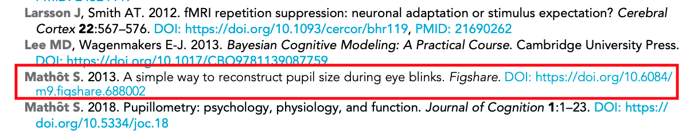
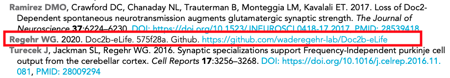
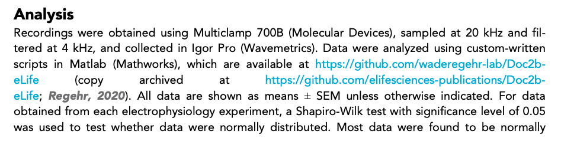
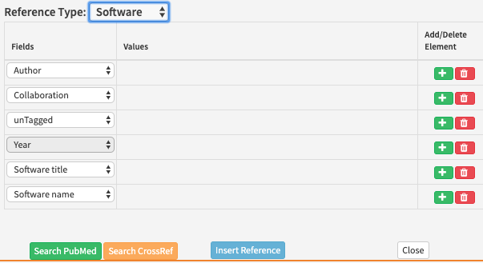
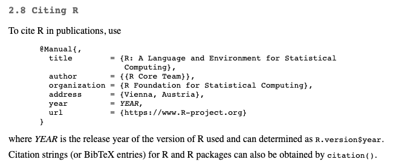
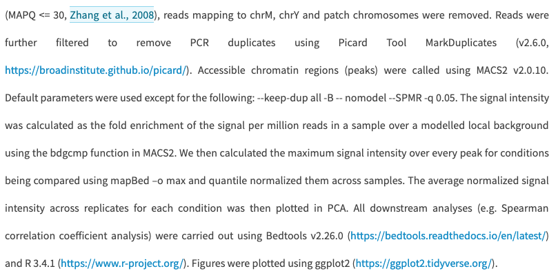
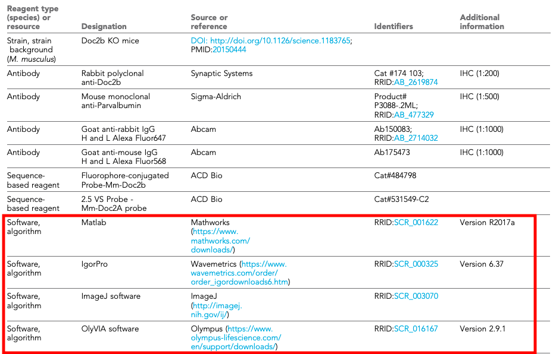
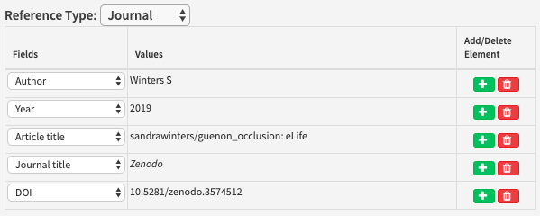
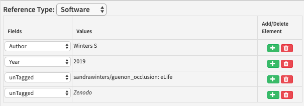
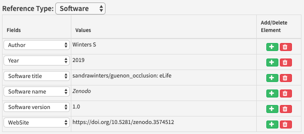

# Software references

## What is a software reference?

A software reference gives bibliographic details for a piece of software or computer code.







## What needs to be added?

The following information can be added for software references:

| Kriya field | Mandatory? | XML element | Example |
| :--- | :--- | :--- | :--- |
| Author | Yes \(or a collaboration must be entered instead\) | &lt;person-group person-group-type="author"&gt; &lt;name&gt; | Bloggs J |
| Collaboration | Yes \(or authors must be entered instead\) | &lt;person-group person-group-type="author"&gt; &lt;collab&gt; | R Development Core Team |
| Year | Yes | &lt;year iso-8601-date="XXXXXX"&gt; where XXXXXX is the year | 2020 |
| Software title | Yes | &lt;data-title&gt; | R: A Language and Environment for Statistical Computing |
| Source | No | &lt;source&gt; | GitHub |
| Software version | No | &lt;version designator="XXXXXX"&gt; where XXXXXX is the version | 3.1.0 |
| Publisher city | No | &lt;publisher-loc&gt; | Vienna |
| Publisher country | No | &lt;publisher-loc&gt; | Austria |
| Publisher | No | &lt;publisher-name&gt; | Microsoft |
| Website | No | &lt;ext-link ext-link-type="uri" xlink:href="XXXXXX"&gt; where XXXXXX is the URL | [http://doi.org/10.6084/m9.figshare.4742866.v1](http://doi.org/10.6084/m9.figshare.4742866.v1) |

Where the optional information is available, this should also be added in. 

* **Authors**: Enter each author name as a surname followed by initials. This information may be present if you follow the link to the software website. 
* **Collaboration:** If the software was made by a team this should be entered as a collaboration instead of authors ****e.g. ****R Development Core Team.
* **Year**: This should be the year that the software being cited was released. 
* **Software title**: The name of the software.
* **Source**: Where the software is hosted \(this does not necessarily mean they own the software\).
* **Software version:** The version of software that was used. This is often mentioned in the article text - if it is not, it does not need to be added in.
* **Publisher location:** The location of the publishers of the software. This is separated into city and country fields in Kriya.
* **Publisher**: The company or organisation that created the software and has ownership rights over it.
* **Website**: Some software providers add DOIs for their software. These need to be added as a full DOI links instead of just the DOI.

If any of the mandatory information for a reference cannot easily be found from what the authors have provided in text, please leave the following author query:

* eLife's policy is to include full software reference details in accordance with FAIR principles. Please provide the \[insert missing information\] for this reference.

## How to add a software reference

Make sure a citation is added whenever the software is mentioned in the text or in the key resources table. To add a GitHub reference after [forking code](../../../toolkit/forking-git-based-repos.md) for example, in Kriya, right-click where you want to add the citation and click on Add New &gt; Add New Reference and select Software under Reference Type. 



The default fields in Kriya will need to be altered to include the following information in this order:

* Author - for GitHub references, you can just enter the first author's name
* Year - the year the repository was made 
* Software title - for GitHub references, this is the name of the repository 
* Source - GitHub
* Software version - for GitHub references, this is the latest commit number
* Website - This should be a link to the original \(not the forked\) repository

An example of correctly entered fields for a GitHub repository reference is given below:

| Fields | Values |
| :--- | :--- |
| Author | Deverett B |
| Year | 2018 |
| Software title | accumulating\_puffs |
| Software name | GitHub |
| Software version | 71 |
| Website | https://www.github.com/wanglabprinceton/accumulating\_puffs |

Guidance on what information should be included in a software reference can sometimes be found on the software website. For example, for R references, the developers provide the [following information](https://cran.r-project.org/doc/FAQ/R-FAQ.html):



To add a reference for R software, add a new software reference as above. The information above needs to be entered into Kriya in the order shown below:

| Fields | Values |
| :--- | :--- |
| Collaboration | R Development Core Team |
| Year | 2014 |
| Software title | R: A Language and Environment for Statistical Computing |
| Software version | 3.1.0 |
| Publisher city | Vienna |
| Publisher country | Austria |
| Software host | R Foundation for Statistical Computing |
| Website | http://www.R-project.org |

## **When to add software references**

Any mentions of tools or packages that were used for analysing data or generating figures should be cited as a software reference. Often, authors will include URL links to software they have used in their studies either in the main text or in the key resources table. These need to be added as software references so they are in accordance with the [FAIR principles](https://www.go-fair.org/fair-principles/). Please note, this only needs to be done if the software is not already in the reference list.





## **Schematron checks**

The following tests are run on software references. X or XXXXXX refers to quoted text which will change depending on the article.

### **Content checks**

‌These checks relate to the content of a software reference.

#### **zenodo-check**

**Error**: _Journal ref 'XXXXXX' has a source title 'XXXXXX' which must be incorrect. It should be a data or software type reference._

**Action:** This error will fire if a Zenodo link has been entered as a journal reference. The ‘XXXXXX’ in this message will refer to the reference in question and its title respectively. Make sure the reference is changed to a software instead of a journal reference, and the fields are updated appropriately.



When this is changed to a software reference, there will be several untagged fields



These will need to be updated:



#### **github-web-test**

**Warning**: _web ref 'XXXXXX' has a link which contains 'github', therefore it should almost certainly be captured as a software ref \(unless it's a blog post by GitHub\)._

**Action:** This warning will fire if a website reference contains the word ‘github’. If the link is to a repository on GitHub, this reference needs to be changed from a website to a software reference and the fields should be updated appropriately \(see [above](software-references.md#how-to-add-a-software-reference)\). If the link is to a blog post by GitHub however, it can be kept as a website reference. &lt;add screenshot of this example too \(without a version number\)&gt;

#### **R-test-1**

**Error**: _software ref 'XXXXXX' has a data-title - XXXXXX - but it does not have one collab element containing 'R Development Core Team'._

**Action:** This error will appear if the data title of a software is ‘R: A Language and Environment for Statistical Computing’ and there is no collaboration element present. Make sure the collaboration is entered as ‘R Development Core Team’.

#### **R-test-2**

**Error**: _software ref 'XXXXXX' has a data-title - XXXXXX - but it has XXXXXX collab element\(s\)._

**Action:** If the data title of a software is ‘R: A Language and Environment for Statistical Computing’ there needs to be 1 collaboration element present. This error will fire if the data title is ‘R: A Language and Environment for Statistical Computing’ and the number of collaboration elements is anything other than 1 \(e.g. 0 or 7\). Make sure only one collaboration element is present \(and it is entered as ‘R Development Core Team’\).

**R-test-3**

**Error**: _software ref 'XXXXXX' has a data-title - XXXXXX - but does not have a &lt;publisher-loc&gt;Vienna, Austria&lt;/publisher-loc&gt; element._

**Action:** This error will appear if the data title of a software is ‘R: A Language and Environment for Statistical Computing’ and the publisher location is not entered correctly. 'Vienna' should be entered in the Publisher city field and 'Austria' should be entered in the Publisher country field.

**R-test-4**

**Error**: _software ref 'XXXXXX' has a data-title - XXXXXX - but does not have a 'http://www.r-project.org' type link._

**Action:** This error will appear if the data title of a software is ‘R: A Language and Environment for Statistical Computing’ and the external link has not been entered correctly. Make sure the external link is added as a URI and entered as ‘http://www.r-project.org’.

**R-test-5**

**Error**: _software ref 'XXXXXX' has a source - XXXXXX - but this is the data-title._

**Action:** This error will appear if a software reference has a source which contains the text ’R: A Language and Environment for Statistical Computing’. This should be entered as a data title instead.

**R-test-6**

**Error**: _software ref 'XXXXXX' has a publisher-name - XXXXXX - but this is the data-title._

**Action:** This error will appear if a software reference has a publisher name which contains the text ’R: A Language and Environment for Statistical Computing’. This should be entered as a data title instead.

#### **R-test-7**

**Error:** _software ref 'XXXXXX' with the title - XXXXXX - must have a publisher-name element \(Software host\) which contains 'R Foundation for Statistical Computing'._

**Action:** The publisher of R software is the 'R Foundation for Statistical Computing'. This error will fire if this has not been entered in the 'Publisher' field. Make sure this is corrected and there are no typos.

**software-replacement-character-presence**

**Error**: _software reference contains the replacement character '�' which is unallowed - XXXXXX_

**Action:** This error will fire if a software reference contains the character ‘�’. This usually indicates that processing has gone wrong, or it has been used to replace an unknown, unrecognized or unrepresentable character. Make sure the fields have all been entered correctly and update the citation. 

**software-doi-test-1**

**Warning**: _XXXXXX is a software ref with a host \(XXXXXX\) known to register dois starting with '10.5281/zenodo'. Should it have a link in the format 'https://doi.org/10.5281/zenodo...'?_

**Action:** If a software reference has a source containing 'Zenodo', there needs to be a URL that contains '10.5281/zenodo'. Make sure the DOI URL \(including https://\) is present in the website field in the reference. This is because Continuum does not currently allow DOIs for software references. &lt;add example of Zenodo landing page vs doi&gt;

**software-doi-test-2**

**Warning**: _XXXXXX is a software ref with a host \(XXXXXX\) known to register dois starting with '10.6084/m9.figshare'. Should it have a link in the format 'https://doi.org/10.6084/m9.figshare...'?_

**Action:** If a software reference has a source containing 'Figshare', there needs to be a URL that contains '10.6084/m9.figshare'. This is because Continuum does not currently allow DOIs for software references. Make sure the DOI URL \(including https://\) is present in the website field in the reference.

### **XML structure warnings**

**‌**These warnings relate to the XML structure of software references. For examples of what the XML should look like, [see below](software-references.md#xml-structure).

#### **err-elem-cit-software-2-1**

**Error:** _Each &lt;element-citation&gt; of type 'software' must contain one &lt;person-group&gt; element \(either author or curator\) or one &lt;person-group&gt; with attribute person-group-type = author and one &lt;person-group&gt; with attribute person-group-type = curator. Reference 'XXXXXX' has XXXXXX &lt;person-group&gt; elements.‌_

**Action:** This error will appear if a software reference has more than one &lt;person-group&gt; element \(which usually contains either authors or collaborations\). It should be impossible for this error to occur - please contact support team if you see it. 

#### **err-elem-cit-software-2-2**

**Error:** _Each &lt;element-citation&gt; of type 'software' must contain one &lt;person-group&gt; with the attribute person-group-type set to 'author' or 'curator'. Reference 'XXXXXX' has a &lt;person-group&gt; type of 'XXXXXX'._

**Action:** This error will appear if a software reference has a &lt;person-group&gt; element with a person-group-type that isn't an author or curator \(e.g. an author has been tagged as an editor\). It should be impossible for this error to occur - please contact the support team if you see it. 

#### **err-elem-cit-software-10-1**

**Error**: _Each &lt;element-citation&gt; of type 'software' may contain one and only one &lt;data-title&gt; element. Reference 'XXXXXX' has XXXXXX &lt;data-title&gt; elements._

**Action:** This error will appear if there is more than one data title element. Please remove the extra data title element.

#### **err-elem-cit-software-16**

**Error**: _The only tags that are allowed as children of &lt;element-citation&gt; with the publication-type="software" are: &lt;person-group&gt;, &lt;year&gt;, &lt;data-title&gt;, &lt;source&gt;, &lt;version&gt;, &lt;publisher-name&gt;, &lt;publisher-loc&gt;, and &lt;ext-link&gt; Reference 'XXXXXX' has other elements._

**Action:** This error will fire if anything other than the named tags are present. It usually means a field in Kriya has been incorrectly selected for a software reference. Make sure the [correct fields](software-references.md#how-to-add-a-software-reference) are entered for a software reference. 

#### **err-elem-cit-software-10-2**

**Error**: _An &lt;data-title&gt; element in a reference may contain characters and &lt;italic&gt;, &lt;sub&gt;, and &lt;sup&gt;. No other elements are allowed. Reference 'XXXXXX' does not meet this requirement._

**Action:** The data title of a software reference can only have text that is italicised, superscript or subscript. This error will appear if the data title has formatting elements other than these. To address this, remove any extra elements including formatting that is not italic, superscript or subscript, and remove any hyperlinks.

#### **ref-software-test-1**

**Error**: _software ref 'XXXXXX' has both a source \(Software name\) - XXXXXX - and a publisher-name \(Software host\) - XXXXXX - which is incorrect. It should have either one or the other._

**Action:** Software references can only have a source or a publisher - not both. This error will appear if the Source and Publisher fields have both been filled out. Make sure this is fixed - for more information about what these fields should contain, see [here](software-references.md#what-needs-to-be-added). 

#### **ref-software-test-2**

**Error**: _software ref 'XXXXXX' with the title - XXXXXX - must contain either one source element \(Software name\) or one publisher-name element \(Software host\)._

**Action:** Software references must have either a source or a publisher. This error will appear if the Source and Publisher fields have not been filled out. Make sure this is fixed - for more information about what these fields should contain, see [here](software-references.md#what-needs-to-be-added). 

#### **ref-software-test-3**

**Error**: _software ref 'XXXXXX' has a publisher-name \(Software host\) - XXXXXX. Since this is a software source, it should be captured in a source element. Please move into the Software name field \(rather than Software host\)._

**Action:** This error will appear if the source of a software reference has incorrectly been entered as the publisher. XXXXXX in this case will be the reference id and whatever has been entered in the 'Publisher' field respectively. To fix this, move whatever has been entered in the Publisher field into the Source field, and delete the \(now empty\) Publisher field.

#### **ref-software-test-4**

**Error**: _software ref 'XXXXXX' has a source \(Software name\) - XXXXXX. Since this is a software publisher, it should be captured in a publisher-name element. Please move into the Software host field._

**Action:** This error will appear if the publisher of a software reference has incorrectly been entered as the source. XXXXXX in this case will be the reference id and whatever has been entered in the 'Source' field respectively. To fix this, move whatever has been entered in the Source field into the Publisher field, and delete the \(now empty\) Source field.

## XML Structure

Here are some examples of how the xml will look for various software references.

R software

```markup
<back>
    . . .
    <article-meta>
        . . . 
      <element-citation publication-type="software">
         <person-group person-group-type="author">
           <collab>R Development Core Team</collab>
         </person-group>
         <year iso-8601-date="2014">2014</year>
         <data-title>R: A Language and Environment for Statistical Computing</data-title>
         <version designator="3.1.0">3.1.0</version>
         <publisher-loc>Vienna, Austria</publisher-loc>
         <publisher-name>R Foundation for Statistical Computing</publisher-name>
         <ext-link ext-link-type="uri" xlink:href="http://www.R-project.org">http://www.R-project.org</ext-link>
      </element-citation>
        . . .
    <article-meta>
```

Github

```markup
<back>
    . . .
    <article-meta>
        . . . 
      <element-citation publication-type="software">
         <person-group person-group-type="author">
         <name>
           <surname>Aguiar</surname> 
           <given-names>P</given-names>
         </name>
       </person-group>
       <year iso-8601-date="2020">2020</year>
       <data-title>Calculate_APs_velocities_in_MEAs</data-title>
       <version designator="d135ae9">d135ae9</version>
       <publisher-name>Github</publisher-name>
       <ext-link ext-link-type="uri" xlink:href="https://github.com/paulodecastroaguiar/Calculate_APs_velocities_in_MEAs">https://github.com/paulodecastroaguiar/Calculate_APs_velocities_in_MEAs</ext-link>
      </element-citation>
        . . .
    <article-meta>
```

Figshare

```markup
<back>
    . . .
    <article-meta>
        . . . 
      <element-citation  publication-type="software">
       <person-group person-group-type="author">
         <name>
           <surname>Zandbelt</surname> 
           <given-names>B</given-names>
         </name>
       </person-group>
       <year iso-8601-date="2017">2017</year>
       <data-title>Slice display</data-title>
       <publisher-name>Figshare</publisher-name>
       <ext-link ext-link-type="uri" xlink:href="http://doi.org/10.6084/m9.figshare.4742866.v1">http://doi.org/10.6084/m9.figshare.4742866.v1</ext-link>
      </element-citation>
        . . .
    <article-meta>
```

Zenodo

```markup
<back>
    . . .
    <article-meta>
        . . . 
      <element-citation publication-type="software">
        <person-group person-group-type="author">
           <name>
             <surname>Neymotin</surname> 
             <given-names>SA</given-names>
           </name>
           <name>
             <surname>Daniels</surname> 
             <given-names>DS</given-names>
           </name>
           <name>
             <surname>Peled</surname> 
             <given-names>N</given-names>
           </name>
           <name>
             <surname>McDougal</surname> 
             <given-names>RA</given-names>
           </name>
           <name>
             <surname>Carnevale</surname> 
             <given-names>NT</given-names>
           </name>
           <name>
             <surname>Moore</surname> 
             <given-names>CI</given-names>
           </name>
           <name>
             <surname>Dura-Bernal</surname> 
             <given-names>S</given-names>
           </name>
           <name>
             <surname>Hines</surname> 
             <given-names>M</given-names>
           </name>
           <name>
             <surname>Jones</surname> 
             <given-names>S</given-names>
           </name>
       </person-group>
       <year iso-8601-date="2018">2018</year>
       <data-title>Human neocortical neurosolver</data-title>
       <publisher-name>Zenodo</publisher-name>
       <ext-link ext-link-type="uri" xlink:href="http://doi.org/10.5281/zenodo.1446517">http://doi.org/10.5281/zenodo.1446517</ext-link>
     </element-citation>

    <article-meta>
```

