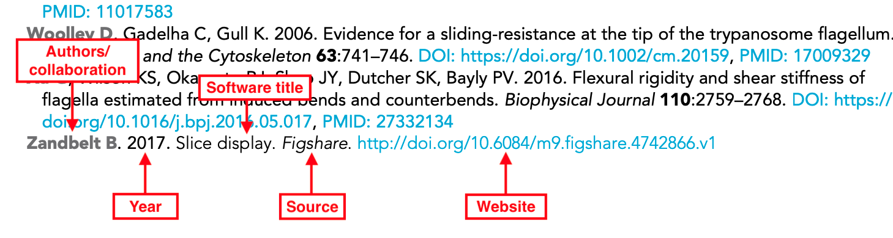
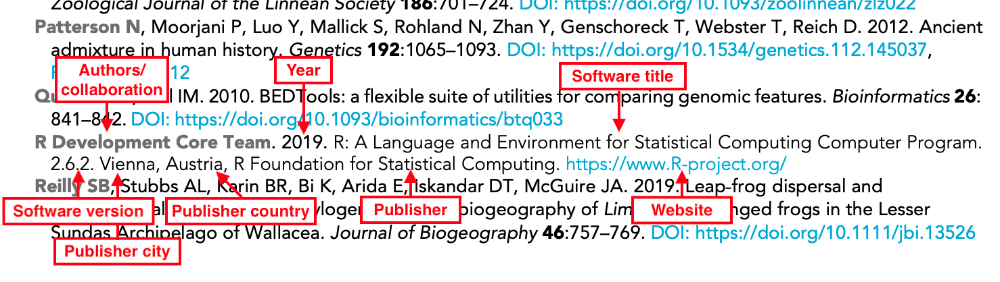
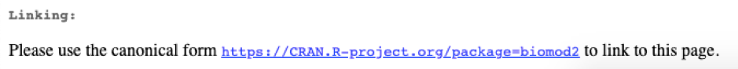
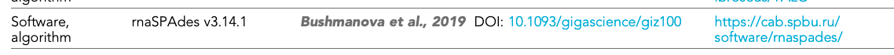
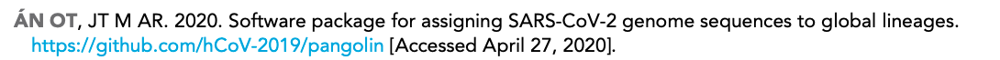
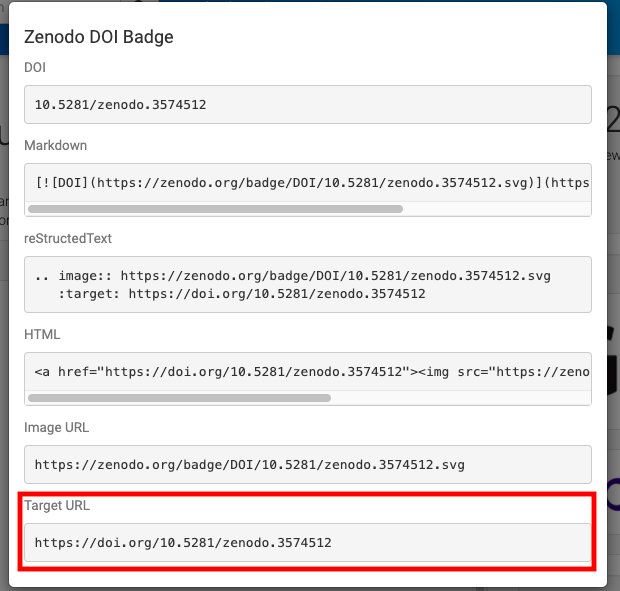
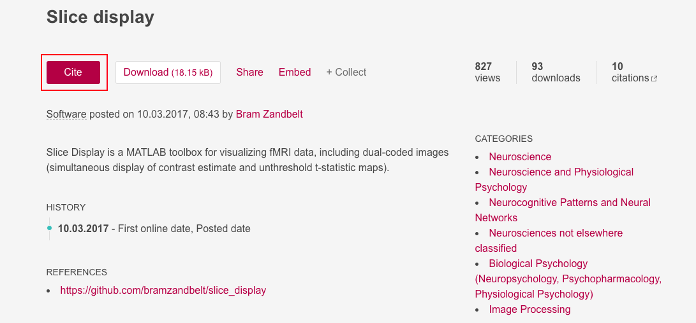
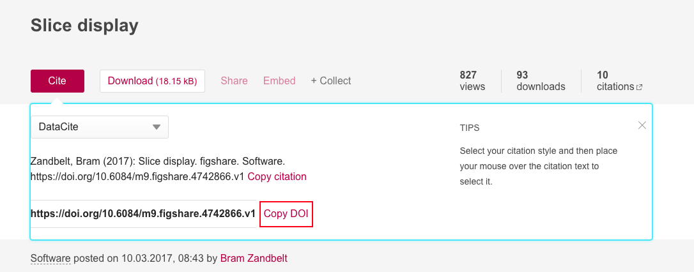

# Software references


For changelog, click [**here**](software-references.md#changelog). Updated 13/09/2021


## What is a software reference?

A software reference gives bibliographic details for a piece of software or computer code. These are hosted on various websites, and are captured in eLife articles as software references. Any code that has been specifically written as part of the work reported in an eLife paper should be archived at Software Heritage \(see more about how to do this [**here**](../../../toolkit/archiving-code.md)\).







## What needs to be added?

The following information can be added for software references:

| Kriya field | Mandatory? | XML element | Example |
| :--- | :--- | :--- | :--- |
| Author | Yes \(or a collaboration must be entered instead\) | &lt;person-group person-group-type="author"&gt; &lt;name&gt; | Bloggs J |
| Collaboration | Yes \(or authors must be entered instead\) | &lt;person-group person-group-type="author"&gt; &lt;collab&gt; | R Development Core Team |
| Year | Yes | &lt;year iso-8601-date="XXXXXX"&gt; where XXXXXX is the year | 2020 |
| Software title | Yes | &lt;data-title&gt; | Slice display |
| Software name \(Source in Kriya 2\) | Yes \(or Publisher must be entered instead\) | &lt;source&gt; | GitHub |
| Software version | No | &lt;version designator="XXXXXX"&gt; where XXXXXX is the version | 3.1.0 |
| Publisher city | No | &lt;publisher-loc&gt; | Vienna |
| Publisher country | No | &lt;publisher-loc&gt; | Austria |
| Publisher | Yes \(or Source must be entered instead\) | &lt;publisher-name&gt; | Microsoft |
| Website | No | &lt;ext-link ext-link-type="uri" xlink:href="XXXXXX"&gt; where XXXXXX is the URL | [http://doi.org/10.6084/m9.figshare.4742866.v1](http://doi.org/10.6084/m9.figshare.4742866.v1) |

Where the optional information is available, this should also be added in. 

* **Authors**: Enter each author name as a surname followed by initials. This information may be present if you follow the link to the software website. 
* **Collaboration:** If the software was made by a team this should be entered as a collaboration instead of authors ****e.g. ****R Development Core Team.
* **Year**: This should be the year that the software being cited was released. 
* **Software title**: The name of the software.
* **Software name \(Source in Kriya 2\)**: Where the software is hosted \(this does not necessarily mean the host owns the software\), if applicable.
* **Software version:** The version of software that was used. This is often mentioned in the article text - if it is not, it does not need to be added in. However, if it is provided it should be added and tagged correctly as a software version.
* **Publisher location:** The location of the publishers of the software. This is separated into city and country fields in Kriya.
* **Publisher**: The company or organisation that created the software and has ownership rights over it, if applicable.
* **Website**: Some software providers add DOIs for their software. These need to be added as a full URL links \(e.g. [http://doi.org/10.6084/m9.figshare.4742866.v1](http://doi.org/10.6084/m9.figshare.4742866.v1)\) instead of just the DOI.


If the authors have provided the RRID for a software, this does not need to be added as a software reference.


## **When to add software references**

As far as possible, any mentions of tools or packages that were used for analysing data or generating figures should be cited as a software reference \(unless the authors have already included RRIDs\). Often, authors will include URL links to software they have used in their studies either in the main text or in the key resources table. These need to be added as software references in accordance with the [**FAIR principles**](https://peerj.com/articles/cs-86/). Please note, this only needs to be done if the software is not already in the reference list. If any of the mandatory information required for a software reference is missing, search for the software online to see whether the information can be found on the software website. Once these details have been added as a software reference, please leave the following query:

* Please confirm the details have been added correctly for this software reference.

If the details can't be found online, please leave the following author query, deleting as appropriate the information that has already been provided:

* eLife follows the FAIR principles for software and data citation. Please provide the full details for this software \(author\(s\), year, software name, version, URL\) so that it can be added to the reference list. Alternatively, please provide the RRID and version number for this software.

If the authors cannot provide this information, the text can be left as is.



If the authors haven't cited the software as a software reference or provided an RRID, it is preferable to add a software reference.


## How to add a software reference

To add a software reference in Kriya, right-click where you want to add the citation and click on Add New &gt; Add New Reference and select Software under Reference Type. 


The default fields in Kriya will need to be altered to include the appropriate information. The fields we capture will differ slightly depending on the type of software reference. Make sure a citation is added whenever the software is mentioned in the text or in the key resources table. 

### GitHub/GitLab

* Author - If the repository includes information about the authors, these should be added. If not, just use the GitHub User IDs of the collaborators.
* Year - the year of the latest commit number \(outlined in red below\).
* Software title - the name of the repository.
* Software name \(Source in Kriya 2\) - GitHub.
* Software version - the ID of the latest commit number.
* Website - the URL for the repository.


An example of correctly entered fields for a GitHub repository reference is given below:

| Kriya field | Value |
| :--- | :--- |
| Author | Tindale LC |
| Author | Stockdale JE |
| Author | Coombe M |
| Author | Garlock E |
| Author | Lau WYV |
| Author | Saraswat M |
| Author | Zhang L |
| Author | Chen D |
| Author | Wallinga J |
| Author | Colijn CC |
| Year | 2020 |
| Software title | Analysis of novel Coronavirus Disease \(COVID-19\) Singapore and Tianjin outbreak clusters |
| Software name \(Source in Kriya 2\) | GitHub |
| Software version | 9e78826 |
| Website | https://github.com/carolinecolijn/ClustersCOVID19 |

The same instructions can be followed for GitLab links.

### R software and packages

R is a commonly used statistical software package. Guidance on how to cite it and its packages can sometimes be found on the software website, for example:


To add a reference for R software, add a new software reference as above. The information above needs to be entered into Kriya in the order shown below:

| Kriya field | Value |
| :--- | :--- |
| Collaboration | R Development Core Team |
| Year | 2014 |
| Software title | R: A Language and Environment for Statistical Computing |
| Software version | 3.1.0 |
| Publisher city | Vienna |
| Publisher country | Austria |
| Publisher | R Foundation for Statistical Computing |
| Website | http://www.R-project.org |

If authors refer to software packages, these will also need to be cited properly. For example:

> Modelling was executed in the R environment \(R Development Core Team, 2019\) using the biomod2 package \(version 3.3-7.1\)

Looking up [**biomod2**](https://cran.r-project.org/web/packages/biomod2/index.html) shows this is a package for R. The information from the CRAN website where this is hosted can be entered as below:

| Kriya field | Value |
| :--- | :--- |
| Author	 | Thuiller W |
| Author	 | Georges D |
| Author	 | Engler R |
| Author	 | Breiner F |
| Year | 2020 |
| Software title | biomod2: Ensemble Platform for Species Distribution Modeling |
| Software name \(Source in Kriya 2\) | CRAN |
| Software version | 3.2-7.1 |
| Website | https://CRAN.R-project.org/package=biomod2 |

Note the CRAN website gives instructions for the correct link to include when citing software packages:



The citation can then be updated as below, removing the version details:

> Modelling was executed in the R environment \(R Development Core Team, 2019\) using the biomod2 package \(Thuiller et al., 2020\)

R software also has an [**RRID**](https://scicrunch.org/resolver/RRID:SCR_001905) which can be used instead of adding a software reference. Many packages for R also have RRIDs, and these can be kept if mentioned. If the authors haven't cited the software as a software reference or provided an RRID, it is preferable to add a software reference.

### Software Heritage

After archiving code in Software Heritage \(see how to do this [**here**](../../../toolkit/archiving-code.md)\), a software reference needs to be added in the main text. The website should be the full directory link with contextual information \(see [**here**](../../../toolkit/archiving-code.md#in-the-main-text) for how to obtain this\). An example of a correctly entered Software Heritage software reference is below:

<table>
  <thead>
    <tr>
      <th style="text-align:left">Fields</th>
      <th style="text-align:left">Values</th>
    </tr>
  </thead>
  <tbody>
    <tr>
      <td style="text-align:left">Author</td>
      <td style="text-align:left">Zhan N</td>
    </tr>
    <tr>
      <td style="text-align:left">Year</td>
      <td style="text-align:left">2020</td>
    </tr>
    <tr>
      <td style="text-align:left">Software title</td>
      <td style="text-align:left">Zhan-Fan-et-al-2019-scRNAseq</td>
    </tr>
    <tr>
      <td style="text-align:left">
        <p>Software name (Source in Kriya 2)</p>
        <p></p>
      </td>
      <td style="text-align:left">Software Heritage</td>
    </tr>
    <tr>
      <td style="text-align:left">Software version</td>
      <td style="text-align:left">swh:1:rev:c008b3ff49d567a1abe9d9eed42afed4e9a27b42</td>
    </tr>
    <tr>
      <td style="text-align:left">Website</td>
      <td style="text-align:left">https://archive.softwareheritage.org/browse/directory/89513b41bd021137c72fa7cf3e57bcef4bf6c933/?origin_url=https://github.com/lifan36/Zhan-Fan-et-al-2019-scRNAseq&amp;revision=c008b3ff49d567a1abe9d9eed42afed4e9a27b42&amp;snapshot=7166156ca6702a41990236e9da386c44440b6609</td>
    </tr>
  </tbody>
</table>

### **figshare** 

An example of a figshare software reference is below. The authors may have provided a software version - if so, this should also be added.

| Kriya field | Value |
| :--- | :--- |
| Author | Zandbelt B |
| Year | 2017 |
| Software title | Slice display |
| Software name \(Source in Kriya 2\) | figshare |
| Website | http://doi.org/10.6084/m9.figshare.4742866.v1 |

Note, figshare can also be used for [**data references**](data-references.md) - double-check whether the link is for software or data and add the reference accordingly. If you cannot determine this, leave the following author query: 

* Please confirm whether this link refers to software or a dataset so we can capture it correctly in your reference list. 

Authors may upload a mixture of software and data to figshare. The Production team will liaise with the authors as necessary to decide how to capture this in these cases.

### **Zenodo**

An example of a Zenodo software reference is below. The authors may have provided a software version - if so, this should also be added.

| Kriya field | Value |
| :--- | :--- |
| Author | Boden A |
| Author | Volpato A |
| Author | Hake K |
| Author | York A |
| Author | Testa I |
| Year | 2020 |
| Software title | Lens-free scanning |
| Software name \(Source in Kriya 2\) | Zenodo |
| Software version | 0.0.2 |
| Website | https://doi.org/10.5281/zenodo.3653386 |

Note, Zenodo can also be used for [**data references**](data-references.md) – double-check whether the link is for software or data and add the reference accordingly. If you cannot determine this, leave the following author query: 

* Please confirm whether this link refers to software or a dataset so we can capture it correctly in your reference list. 

Authors may upload a mixture of software and data to Zenodo. The Production team will liaise with the authors as necessary to decide how to capture this in these cases. 

### Other

Any other links provided for software should also be added as software references as far as possible. For example, in the Key Resources Table of 66954, [**this**](https://cab.spbu.ru/software/rnaspades/) link was included:



Using a combination of the information already provided and the link for the software, a software reference can be generated:

| Kriya field | Value |
| :--- | :--- |
| Author | Bushmanova E |
| Author | Antipov D |
| Author | Lapidus A |
| Author | Prjibelski AD |
| Year | 2019 |
| Software title | rnaSPAdes |
| Software name \(Source in Kriya 2\) | Center for Algorithmic Biotechnology |
| Software version | v3.14.1 |
| Website | https://cab.spbu.ru/software/rnaspades/ |

This may not always be possible if the complete information is not available. The authors should also be asked to provide the rest of the required details if these are not available, using the following query \(deleting as appropriate the information that has already been provided\):

* Please provide the authors, year, software name, version used, and URL for this software so that we can add it to the reference list.

## **Schematron checks**

### **Content checks**

These checks relate to the content of software references. X or XXXXXX refers to quoted text which will change depending on the article.

#### **zenodo-check**

**Error**: _Journal ref 'XXXXXX' has a source title 'XXXXXX' which must be incorrect. It should be a data or software type reference._

**Action:** This error will fire if a Zenodo link has been entered as a journal reference, as in the example below. The ‘XXXXXX’ in this message will refer to the reference in question and its title respectively. Make sure the reference is changed to a software instead of a journal reference, and the fields are updated appropriately. 

Zenodo link incorrectly entered as a journal reference:

| Fields | Values |
| :--- | :--- |
| Author | Winters S |
| Year | 2019 |
| Article title | sandrawinters/guenon\_occlusion: eLife |
| Journal title | _Zenodo_ |
| DOI | 10.5281/zenodo.357451 |

When this is changed to a software reference, there will be several untagged fields

| Fields | Values |
| :--- | :--- |
| Author | Winters S |
| Year | 2019 |
| unTagged | sandrawinters/guenon\_occlusion: eLife |
| unTagged | _Zenodo_ |

These will need to be updated:

| Fields | Values |
| :--- | :--- |
| Author | Winters S |
| Year | 2019 |
| Software title | sandrawinters/guenon\_occlusion: eLife |
| Software name | _Zenodo_ |
| Software version | 1.0 |
| WebSite | https://doi.org/10.5281/zenodo.357451 |

#### **github-web-test**

**Warning**: _web ref 'XXXXXX' has a link which contains 'github', therefore it should almost certainly be captured as a software ref \(unless it's a blog post by GitHub\)._

**Action:** This warning will fire if a website reference contains the word ‘github’. If the link is to a repository on GitHub, this reference needs to be changed from a website to a software reference and the fields should be updated appropriately \(see [**above**](software-references.md#how-to-add-a-software-reference)\). In the example below, a repository is incorrectly captured as a website reference: 



The fields are as below:

| Fields | Values |
| :--- | :--- |
| Author |  ÁN OT |
| Author | JT M AR |
| Year | 2020 |
| Website | https://github.com/hCoV-2019/pangolin |
| Accessed date | April 27, 2020 |

This reference needs to be changed to a software reference, and the fields should be updated as below. The authors should also be asked to provide the rest of the required details if these are not available, using the following query \(deleting as appropriate the information that has already been provided\):

* Please provide the authors, year, software name, version used, and URL for this software so that we can add it to the reference list.

| Fields | Values |
| :--- | :--- |
| Author | ÁN OT |
| Author | JT M AR |
| Year | 2020 |
| Software title | pangolin |
| Software name | GitHub |
| Software version |  |
| Website | https://github.com/hCoV-2019/pangolin |

If the link in the reference is to a blog post by GitHub however, as the example below, it can be kept as a website reference.

| Fields | Values |
| :--- | :--- |
| Author | Heisman L |
| Year | 2020 |
| Website | https://github.blog/2020-05-15-remote-work-how-finance-legal-and-it-made-the-shift/ |
| Accessed date | May 21, 2020 |

#### **R-test-1** 

**Error**: _software ref 'XXXXXX' has a data-title '_R: A Language and Environment for Statistical Computing' _- but it does not have one collab element containing 'R Development Core Team'._

**Action:** During the conversion process, errors can occur. For example the collaboration 'R Development Core Team' can be mistakenly split over multiple collaboration fields or listed as an author. It may also be spelled incorrectly. If this error appears, make sure there is only one collaboration entered as ‘R Development Core Team’ for this reference and delete any other collaborations.

#### **R-test-2**

**Error**: _software ref 'XXXXXX' has a data-title '_R: A Language and Environment for Statistical Computing' _- but it has XXXXXX collab element\(s\)._

**Action:** During the conversion process, errors can occur. For example the collaboration 'R Development Core Team' can be mistakenly split over multiple collaboration fields or listed as an author. It may also be spelled incorrectly. If this error appears, make sure there is only one collaboration entered as ‘R Development Core Team’ for this reference and delete any other collaborations.

**R-test-3**

**Error**: _software ref 'XXXXXX' has a data-title '_R: A Language and Environment for Statistical Computing' _- but does not have a &lt;publisher-loc&gt;Vienna, Austria&lt;/publisher-loc&gt; element._

**Action:** This error will appear if the data title of a software is ‘R: A Language and Environment for Statistical Computing’ and the publisher location is not entered correctly. 'Vienna' should be entered in the Publisher city field and 'Austria' should be entered in the Publisher country field.

**R-test-4**

**Error**: _software ref 'XXXXXX' has a data-title '_R: A Language and Environment for Statistical Computing' _- but does not have a 'http://www.r-project.org' type link._

**Action:** This error will appear if the data title of a software is ‘R: A Language and Environment for Statistical Computing’ and the external link has not been entered correctly. Make sure the external link is added as a URI and entered as ‘http://www.r-project.org’.

**R-test-5**

**Error**: _software ref 'XXXXXX' has a source - XXXXXX - but this is the data-title._

**Action:** This error will appear if a software reference has a Software name \(Source in Kriya 2\) which contains the text ’R: A Language and Environment for Statistical Computing’. This should be entered as a data title instead.

**R-test-6**

**Error**: _software ref 'XXXXXX' has a publisher-name - XXXXXX - but this is the data-title._

**Action:** This error will appear if a software reference has a publisher name which contains the text ’R: A Language and Environment for Statistical Computing’. This should be entered as a data title instead.

#### **R-test-7**

**Error:** _software ref 'XXXXXX' with the title - XXXXXX - must have a publisher-name element \(Software host\) which contains 'R Foundation for Statistical Computing'._

**Action:** The publisher of R software is the 'R Foundation for Statistical Computing'. This error will fire if this has not been entered in the 'Publisher' field. Make sure this is corrected and there are no typos.

**software-replacement-character-presence**

**Error**: _software reference contains the replacement character '�' which is unallowed - XXXXXX_

**Action:** This error will fire if a software reference contains the character ‘�’. This usually indicates a conversion error has occurred and an unknown, unrecognized or unrepresentable character has been replaced with ‘�’. Search for the reference in the original submission and update with the correct character.

**software-doi-test-1**

**Warning**: _XXXXXX is a software ref with a host \(XXXXXX\) known to register dois starting with '10.5281/zenodo'. Should it have a link in the format 'https://doi.org/10.5281/zenodo...'?_

**Action:** If a software reference has a Software name \(Source in Kriya 2\) containing 'Zenodo', there needs to be a URL that contains '10.5281/zenodo'. Make sure the DOI URL \(including https://\) is present in the website field in the reference. This is because Continuum does not currently allow DOIs for software references.

To get the full URL for a Zenodo dataset, on the dataset page, click on the 'DOI' button:


The DOI badge will pop up:



Finally, just paste the URL into the Website field in Kriya.

**software-doi-test-2**

**Warning**: _XXXXXX is a software ref with a host \(XXXXXX\) known to register dois starting with '10.6084/m9.figshare'. Should it have a link in the format 'https://doi.org/10.6084/m9.figshare...'?_

**Action:** If a software reference has a Software name \(Source in Kriya 2\) containing 'figshare', there needs to be a URL that contains '10.6084/m9.figshare'. This is because Continuum does not currently allow DOIs for software references. Make sure the DOI URL \(including https://\) is present in the website field in the reference.

To get the full URL for a figshare dataset, on the dataset page, click on the 'Cite' button:



Then, click on the 'Copy DOI' button:



Finally, just paste the URL into the Website field in Kriya.

### **XML structure checks**

These checks relate to the XML structure of software references. X or XXXXXX refers to quoted text which will change depending on the article. For examples of what the XML should look like, [**see below**](software-references.md#xml-structure).

#### **err-elem-cit-software-2-1**

**Error:** _Each &lt;element-citation&gt; of type 'software' must contain one &lt;person-group&gt; element with attribute person-group-type = author. Reference 'XXXXXX' has XXXXXX &lt;person-group&gt; elements.‌_

**Action:** This error will appear if a software reference has more than one &lt;person-group&gt; element \(which usually contains either authors or collaborations\). It should be impossible for this error to occur - please contact support team if you see it. 

#### **err-elem-cit-software-2-2**

**Error:** _The &lt;person-group&gt; in a software reference must have the attribute person-group-type set to 'author'. Reference 'XXXXXX' has a &lt;person-group&gt; type of 'XXXXXX'._

**Action:** This error will appear if a software reference has a &lt;person-group&gt; element with a person-group-type that isn't an author \(e.g. an author has been tagged as an editor\). It should be impossible for this error to occur - please contact the support team if you see it. 

#### **err-elem-cit-software-10-1**

**Error**: _Each &lt;element-citation&gt; of type 'software' may contain one and only one &lt;data-title&gt; element. Reference 'XXXXXX' has XXXXXX &lt;data-title&gt; elements._

**Action:** This error will appear if there is more than one data title element. Please remove the extra data title element.

#### **err-elem-cit-software-16**

**Error**: _The only tags that are allowed as children of &lt;element-citation&gt; with the publication-type="software" are: &lt;person-group&gt;, &lt;year&gt;, &lt;data-title&gt;, &lt;source&gt;, &lt;version&gt;, &lt;publisher-name&gt;, &lt;publisher-loc&gt;, and &lt;ext-link&gt; Reference 'XXXXXX' has other elements._

**Action:** This error will fire if anything other than the named tags are present. It usually means a field in Kriya has been incorrectly selected for a software reference. Make sure the [correct fields](software-references.md#how-to-add-a-software-reference) are entered for a software reference. 

#### **err-elem-cit-software-10-2**

**Error**: _An &lt;data-title&gt; element in a reference may contain characters and &lt;italic&gt;, &lt;sub&gt;, and &lt;sup&gt;. No other elements are allowed. Reference 'XXXXXX' does not meet this requirement._

**Action:** The data title of a software reference can only have text that is italicised, superscript or subscript. This error will appear if the data title has formatting elements other than these. To address this, remove any extra elements including formatting that is not italic, superscript or subscript, and remove any hyperlinks.

#### **ref-software-test-1**

**Error**: _software ref 'XXXXXX' has both a source \(Software name\) - XXXXXX - and a publisher-name \(Software host\) - XXXXXX - which is incorrect. It should have either one or the other._

**Action:** Software references can only have a source or a publisher - not both. This error will appear if the Software name \(Source in Kriya 2\) and Publisher fields have both been filled out. Make sure this is fixed - for more information about what these fields should contain, see [here](software-references.md#what-needs-to-be-added). 

#### **ref-software-test-2**

**Error**: _software ref 'XXXXXX' with the title - XXXXXX - must contain either one source element \(Software name\) or one publisher-name element \(Software host\)._

**Action:** Software references must have either a source or a publisher. This error will appear if the Software name \(Source in Kriya 2\) and Publisher fields have not been filled out. Make sure this is fixed - for more information about what these fields should contain, see [here](software-references.md#what-needs-to-be-added). 

#### **ref-software-test-3**

**Error**: _software ref 'XXXXXX' has a publisher-name \(Software host\) - XXXXXX. Since this is a software source, it should be captured in a source element. Please move into the Software name field \(rather than Software host\)._

**Action:** This error will appear if the source of a software reference has incorrectly been entered as the publisher. XXXXXX in this case will be the reference id and whatever has been entered in the 'Publisher' field respectively. To fix this, move whatever has been entered in the Publisher field into the Software name \(Source in Kriya 2\) field, and delete the \(now empty\) Publisher field.

#### **ref-software-test-4**

**Error**: _software ref 'XXXXXX' has a source \(Software name\) - XXXXXX. Since this is a software publisher, it should be captured in a publisher-name element. Please move into the Software host field._

**Action:** This error will appear if the publisher of a software reference has incorrectly been entered as the source. XXXXXX in this case will be the reference id and whatever has been entered in the 'Software name \(Source in Kriya 2\)' field respectively. To fix this, move whatever has been entered in the Software name field into the Publisher field, and delete the \(now empty\) Source field.

#### **ref-software-test-5**

**Warning**: _XXXXXX software ref \(with id 'XXXXXX'\) does not have a version number. Is this correct?_ 

**Action:** This warning will appear if a software reference does not have a version number. If the version number is mentioned in the text, add this information to the reference in the 'Software version' field. If the version number is not included, please leave the following query.

* Please provide the version number for this software so that we can add it to the reference list. Alternatively, please provide the RRID for this software if available.

#### **ref-software-test-6**

**Warning**: _XXXXXX software ref \(with id 'XXXXXX'\) does not have a URL which is incorrect._

**Action:** This error will appear if a software reference does not have a website link. If the authors have provided a link to the website for the software, add this information to the reference in the 'Website' field. If there is no website link, please leave the following query.

* Please provide the URL for this software so that we can add it to the reference list. Alternatively, please provide the RRID for this software if available.

#### **github-no-citation**

**Warning**: _This GitHub link - XXXXXX - is included in the text, but there is no software reference for it. Please add a software reference or, in the event that all the information is not available, query the authors for the reference details._

**Action:** This warning will appear if there is a GitHub link in the article but no software reference for it. Make sure a software reference is added, following the instructions [**here**](software-references.md#github-gitlab).

#### **gitlab-no-citation**

**Warning**: _This GitLab link - XXXXXX - is included in the text, but there is no software reference for it. Please add a software reference or, in the event that all the information is not available, query the authors for the reference details._

**Action:** This warning will appear if there is a GitLab link in the article but no software reference for it. Make sure a software reference is added, following the instructions [**here**](software-references.md#github-gitlab).

## XML Structure

Here are some examples of how the XML will look for various software references.

R software

```markup
<back>
    . . .
    <article-meta>
        . . . 
      <element-citation publication-type="software">
         <person-group person-group-type="author">
           <collab>R Development Core Team</collab>
         </person-group>
         <year iso-8601-date="2014">2014</year>
         <data-title>R: A Language and Environment for Statistical Computing
         </data-title>
         <version designator="3.1.0">3.1.0</version>
         <publisher-loc>Vienna, Austria</publisher-loc>
         <publisher-name>R Foundation for Statistical Computing</publisher-name>
         <ext-link ext-link-type="uri" xlink:href="http://www.R-project.org">
         http://www.R-project.org</ext-link>
      </element-citation>
        . . .
    <article-meta>
```

Github

```markup
<back>
    . . .
    <article-meta>
        . . . 
      <element-citation publication-type="software">
         <person-group person-group-type="author">
         <name>
           <surname>Aguiar</surname> 
           <given-names>P</given-names>
         </name>
       </person-group>
       <year iso-8601-date="2020">2020</year>
       <data-title>Calculate_APs_velocities_in_MEAs</data-title>
       <version designator="d135ae9">d135ae9</version>
       <source>Github</source>
       <ext-link ext-link-type="uri" xlink:href="https://github.com/
       paulodecastroaguiar/Calculate_APs_velocities_in_MEAs">
       https://github.com/paulodecastroaguiar/Calculate_APs_velocities_in_MEAs
       </ext-link>
      </element-citation>
        . . .
    <article-meta>
```

figshare

```markup
<back>
    . . .
    <article-meta>
        . . . 
      <element-citation publication-type="software">
      <person-group person-group-type="author">
        <name>
          <surname>Zandbelt</surname> 
          <given-names>B</given-names>
        </name>
      </person-group>
      <year iso-8601-date="2017">2017</year>
      <data-title>Slice display</data-title>
      <source>figshare</source>
      <ext-link ext-link-type="uri" xlink:href="http://doi.org/10.6084/m9.
      figshare.4742866.v1">http://doi.org/10.6084/m9.figshare.4742866.v1
      </ext-link>
      </element-citation>
        . . .
    <article-meta>
```

Zenodo

```markup
<back>
    . . .
    <article-meta>
        . . . 
      <element-citation publication-type="software">
        <person-group person-group-type="author">
           <name>
             <surname>Neymotin</surname> 
             <given-names>SA</given-names>
           </name>
           <name>
             <surname>Daniels</surname> 
             <given-names>DS</given-names>
           </name>
           <name>
             <surname>Peled</surname> 
             <given-names>N</given-names>
           </name>
           <name>
             <surname>McDougal</surname> 
             <given-names>RA</given-names>
           </name>
           <name>
             <surname>Carnevale</surname> 
             <given-names>NT</given-names>
           </name>
           <name>
             <surname>Moore</surname> 
             <given-names>CI</given-names>
           </name>
           <name>
             <surname>Dura-Bernal</surname> 
             <given-names>S</given-names>
           </name>
           <name>
             <surname>Hines</surname> 
             <given-names>M</given-names>
           </name>
           <name>
             <surname>Jones</surname> 
             <given-names>S</given-names>
           </name>
       </person-group>
       <year iso-8601-date="2018">2018</year>
       <data-title>Human neocortical neurosolver</data-title>
       <source>Zenodo</source>
       <ext-link ext-link-type="uri" xlink:href="http://doi.org/10.5281/zenodo.
       1446517">http://doi.org/10.5281/zenodo.1446517</ext-link>
     </element-citation>

    <article-meta>
```

## Changelog

### 01/07/2020

#### Changes

* Updated guidance on when to add software references \(if the authors have provided the RRID for a software, this does not need to be added as a software reference\).

### 22/07/2020

#### Changes

* Updated guidance on what to use as version number for GitHub references.

### 20[22/07/2020](https://app.gitbook.com/@elifesciences/s/schematron/~/drafts/-MdGYbWH8VFLbTJ1_qTB/article-details/content/references/software-references#22-07-2020)/04/2021

#### Changes

* Added examples of more software references, updated guidance about when to query authors and updated author query.
* Changed instances of &lt;publisher-name&gt; in XML structure examples to &lt;source&gt; for all but R reference.

### 28/06/2021

#### Changes

* Changed 'GitHub' heading to '[**GitHub/GitLab**](software-references.md#github-gitlab)' 
* Added information about how to add software references which don't fall into the given categories under '[**Other**](software-references.md#other)'.

### 13/09/2021

#### Changes

* Added [**github-no-citation**](software-references.md#github-no-citation) and [**gitlab-no-citation**](software-references.md#gitlab-no-citation) tests

### 04/10/2021

#### Changes

* Updated [**github-no-citation**](software-references.md#github-no-citation) and [**gitlab-no-citation**](software-references.md#gitlab-no-citation) tests

### 07/10/2021

#### Changes

* Updated software information author query in the '[**When to add software references**](software-references.md#when-to-add-software-references)' section.

