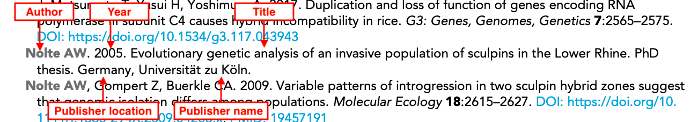
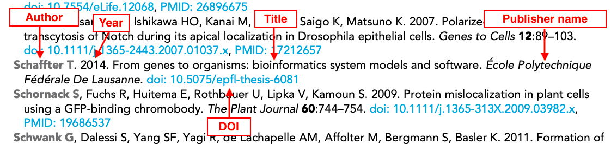
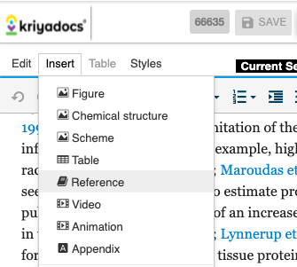
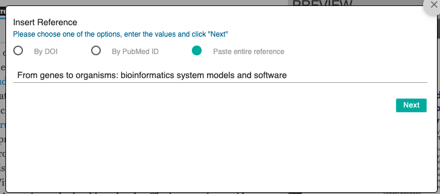
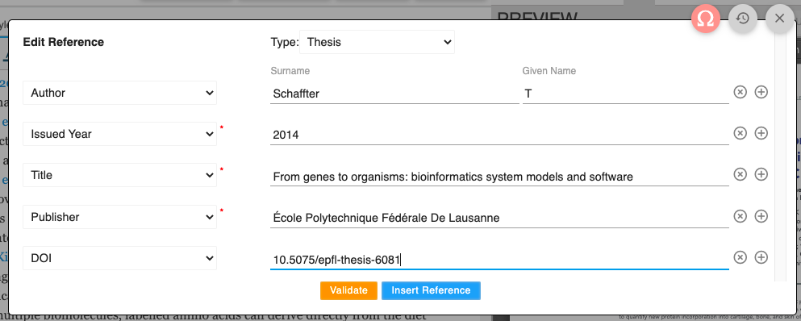
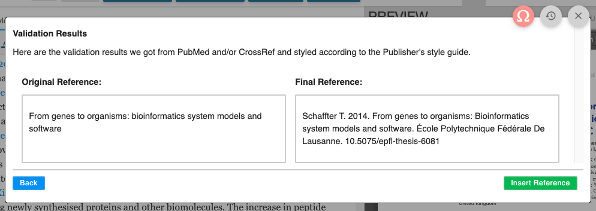

# Thesis references

## What is a thesis reference?

A thesis, or dissertation, is a document submitted by an individual for an academic degree or professional qualification presenting the author's research and findings. These can be cited in scientific literature in the same way as other references. 

.png>)





## What needs to be added?

The following information can be added for thesis references:

| **Kriya field**    | **Mandatory?**                   | **XML element**                                                                                                                                                                                             | Example                                                                                                 |
| ------------------ | -------------------------------- | ----------------------------------------------------------------------------------------------------------------------------------------------------------------------------------------------------------- | ------------------------------------------------------------------------------------------------------- |
| Author(s)          | Yes - only one author is allowed | \<person-group person-group-type="author">\<name>\<surname>Bates\</surname>\<given-names>Victoria Louise\</given-names>\</name>\</person-group>                                                             | Bates VL                                                                                                |
| Year               | Yes                              | \<year iso-8601-date="2012">2012\</year>                                                                                                                                                                    | 2012                                                                                                    |
| Article title      | Yes                              | <p> &#x3C;article-title>PhD thesis: ‘Not an Exact Science’: Medical Approaches to Age and Sexual Offences in England, 1850-1914&#x3C;/article-title></p><p></p>                                             | PhD thesis: ‘Not an Exact Science’: Medical Approaches to Age and Sexual Offences in England, 1850-1914 |
| Publisher name     | Yes                              | \<publisher-name>University of Exeter\</publisher-name>                                                                                                                                                     | University of Exeter                                                                                    |
| Publisher location | Yes                              | \<publisher-loc>Exeter, United Kingdom\</publisher-loc>                                                                                                                                                     | Exeter, United Kingdom                                                                                  |
| Website            | Yes if available                 | \<ext-link ext-link-type="uri" xlink:href="https://ore.exeter.ac.uk/repository/handle/10036/4181#JprXt3mbeIqSFbao.99">https://ore.exeter.ac.uk/repository/handle/10036/4181#JprXt3mbeIqSFbao.99\</ext-link> | https://ore.exeter.ac.uk/repository/handle/10036/41                                                     |
| DOI                | Yes if there is one              |                                                                                                                                                                                                             |                                                                                                         |

Schematron warnings may pick up incomplete references, and these should be checked at the source of the reference.

* **Authors**: A thesis reference should only have one author and no collaborations or editors etc.
* **Year**: This should be the year the thesis was completed.
* **Article title**: The title of the thesis. Can contain italics, superscript and subscript as required.
* **Publisher name**: The name of the institution where the thesis was produced.
* **Publisher location: **The city/country of the institution.
* **Website:** If available, a URL to the thesis. 
* **DOI:** The Digital Object Identifier for the thesis (if applicable).

## How to add a thesis reference

To add a thesis reference in Kriya, click on a section of text, and then on the 'Insert' menu and 'Reference'.



You can insert a reference using a DOI or PMID, or alternatively just by pasting the title. Click on Next.



Select 'Thesis' as reference type, and then add the required fields in this order:

* Author
* Issued Year
* Title
* Publisher
* Publisher location
* URL
* DOI (if available)

  Then, click on 'Validate'.



Finally, click on 'Insert Reference' and follow the Kriya prompt to add a citation for the reference where needed.



## Schematron checks

### Content checks

These checks relate to the content of Thesis references. X or XXXXXX refers to quoted text which will change depending on the article.

#### err-elem-cit-thesis-13

**Error**: _\[err-elem-cit-thesis-13] The only tags that are allowed as children of \<element-citation> with the publication-type="thesis" are: \<person-group>, \<year>, \<article-title>, \<source>, \<publisher-loc>, \<publisher-name>, \<ext-link>, and \<pub-id>. Reference 'XXXXXX' has other elements_

**Action:** This error will appear if a thesis reference has any element other than \<person-group>, \<year>, \<article-title>, \<source>, \<publisher-loc>, \<publisher-name>, \<ext-link>, and \<pub-id>. These are the only allowed elements for a thesis reference. Check the original submission to see whether the reference is definitely a thesis reference—if so, any additional elements should be deleted. If not, the reference is  likely to be another type (e.g. journal, book etc). If you are unsure, check with the Production team. 

#### err-elem-cit-thesis-8-2

**Error**: _\[err-elem-cit-thesis-8-2] An \<article-title> element in a reference may contain characters and \<italic>, \<sub>, and \<sup>. No other elements are allowed. Reference 'XXXXXX' does not meet this requirement._

**Action:** This error will fire if there are formatting elements (e.g. bold text) in a thesis reference title. Only italics, superscripts and subscripts are allowed - check the original submission to see what the title should look like and correct accordingly. 

#### err-elem-cit-thesis-9-2

**Error**: _\[err-elem-cit-thesis-9-2] No elements are allowed inside \<publisher-name>. Reference 'XXXXXX' has child elements within the \<publisher-name> element._

**Action:** This error will fire if there are formatting elements (e.g. bold text) in the publisher name element - these are not allowed. Check the original submission and correct accordingly. 

#### err-elem-cit-thesis-10-2

**Error**: _\[err-elem-cit-thesis-10-2] No elements are allowed inside \<publisher-loc>. Reference 'XXXXXX' has child elements within the  element._

**Action:** This error will fire if there are formatting elements (e.g. bold text) in the publisher location element - these are not allowed. Check the original submission and correct accordingly. 

### XML structure checks

These checks relate to the XML structure of thesis references. ‌X or XXXXXX refers to quoted text which will change depending on the article. For more information about what the XML should look like, see [**below**](thesis-references.md#xml-structure).

#### err-elem-cit-thesis-2-1

**Error:** _One and only one person-group element is allowed. Reference 'XXXXXX' has XXXXXX \<person-group> elements._

**Action:** Thesis references can only have one person-group element, and this should be of the 'author' type. This error will fire if a reference has 0 or more than one person group element. Check the reference is definitely a thesis reference, and ensure there are no empty person-group elements. If there is more than one author, this suggests the reference is the wrong type, (e.g. journal or book reference). Query the Production team if unsure. If it definitely is a thesis reference but no author names have been provided, leave the following author query:

* Please provide the name of the author of this thesis.

#### err-elem-cit-thesis-3

**Error**: _\[err-elem-cit-thesis-3] No \<collab> elements are allowed in thesis citations. Reference 'XXXXXX' has XXXXXX  elements._

**Action:** Thesis references by nature cannot have collaborations as authors, as a thesis is the work of one individual. Check the reference is definitely a thesis reference, and ensure there are no empty person-group elements. If there is a collaboration/group author this suggests the reference is the wrong type, (e.g. journal or book reference). Query the Production team if unsure.

#### err-elem-cit-thesis-6

**Error**: _\[err-elem-cit-thesis-6] No \<etal> elements are allowed in thesis citations. Reference 'XXXXXX' has XXXXXX  elements._

**Action:** Thesis references by nature cannot have multiple authors, as a thesis is the work of one individual. Check the reference is definitely a thesis reference, and ensure there are no empty person-group elements. If there is more than one author, this suggests the reference is the wrong type, (e.g. journal or book reference). Query the Production team if unsure.

#### err-elem-cit-thesis-8-1

**Error**: _\[err-elem-cit-thesis-8-1] Each \<element-citation> of type 'thesis' must contain one and only one \<article-title> element. Reference 'XXXXXX' has XXXXXX  elements._

**Action:** This error will fire if a thesis reference has zero or more than one article-title element. Check the original submission to see what the correct title should be. If this is not present, please ask the authors for this:

* Please provide the title for this thesis reference.

#### err-elem-cit-thesis-9-1

**Error**: _\[err-elem-cit-thesis-9-1]  \<publisher-name> is required. Reference 'XXXXXX' has XXXXXX  elements._

**Action:** This error will fire if a thesis reference has no publisher-name elements. This should be the name of the institution where the thesis was issued - if it is not present, please ask the authors for this:

* Please provide the publisher name for this thesis reference (i.e. the institution where the thesis was issued).

#### err-elem-cit-thesis-11-1

**Error**: _\[err-elem-cit-thesis-11-1] A maximum of one \<pub-id> element is allowed. Reference 'XXXXXX' has XXXXXX  elements._

**Action:** This error will fire if a thesis reference has more than one pub-id element (DOI field in Kriya). Check the original submission to see whether the thesis reference has a DOI - if so it should be entered in the DOI field. If not, this field is not necessary. 

#### err-elem-cit-thesis-2-2

**Error**: _\[err-elem-cit-thesis-2-2] Each \<person-group> must have a @person-group-type attribute of type 'author'. Reference 'XXXXXX' has a \<person-group> element with @person-group-type attribute 'XXXXXX'._

**Action:** This error will appear if a thesis reference has a person-group element with a type other than 'author'. The only allowed type for this element in a thesis reference is 'author'—double check the original submission to see whether the reference is definitely a thesis reference. If so, the author should be captured as such. If there is another type of person-group e.g. editor, this would suggest the reference should be a book instead. Double check with the Production team if unsure.  

#### err-elem-cit-thesis-2-3

**Error**: _\[err-elem-cit-thesis-2-3] Each thesis citation must have one and only one author. Reference 'XXXXXX' has a thesis citation with XXXXXX authors._

**Action:** This error will fire if a thesis reference has 0 or more than one name under the person-group element. Check the reference is definitely a thesis reference, and ensure there are no empty name tags. If there is more than one author, this suggests the reference is the wrong type, (e.g. journal or book reference). Query the Production team if unsure. If it definitely is a thesis reference but no author names have been provided, leave the following author query:

* Please provide the name of the author of this thesis.

#### err-elem-cit-thesis-11-2

**Error**: _\[err-elem-cit-thesis-11-2] The only allowed pub-id type is 'doi'. Reference 'XXXXXX' has a pub-id type of 'XXXXXX'._

**Action:** This error will fire if a thesis reference has a pub-id with a type other than 'doi'. If there is a DOI for the reference, ensure this is captured appropriately. If there is no DOI for a thesis but a direct URL, this should be captured in an ext-link tag with the type 'uri' instead. 

## XML structure

Here are some examples of how the XML will look for various thesis references.

#### Thesis with no URL:

```markup
<element-citation publication-type="thesis">
    <person-group person-group-type="author">
        <name>
            <surname>Nolte</surname>
            <given-names>AW</given-names>
        </name>
    </person-group>
    <year iso-8601-date="2005">2005</year>
    <article-title>Evolutionary genetic analysis of an invasive population of 
    sculpins in the Lower Rhine. PhD thesis</article-title>
    <publisher-loc>Germany</publisher-loc>
    <publisher-name>Universität zu Köln</publisher-name>
</element-citation>
```

#### Thesis with a URL:

```markup
<element-citation publication-type="thesis">
  <person-group person-group-type="author">
    <name>
     <surname>Bates</surname>
     <given-names>VL</given-names>
    </name>
  </person-group>
  <year iso-8601-date="2012">2012</year>
  <article-title>PhD thesis: ‘Not an Exact Science’: Medical Approaches to Age 
  and Sexual Offences in England, 1850-1914</article-title>
  <publisher-name>University of Exeter</publisher-name>
  <publisher-loc>Exeter, United Kingdom</publisher-loc>
  <ext-link ext-link-type="uri" xlink:href="https://ore.exeter.ac.uk/repository/handle/10036/4181#JprXt3mbeIqSFbao.99">https://ore.exeter.ac.uk/repository/handle/10036/4181#JprXt3mbeIqSFbao.99</ext-link>
</element-citation>
```

#### Thesis with a DOI:

```markup
<element-citation publication-type="thesis">
    <person-group person-group-type="author">
    <name>
        <surname>Schaffter</surname>
        <given-names>T</given-names>
    </name>
    </person-group>
    <year iso-8601-date="2014">2014</year>
    <article-title>From genes to organisms: bioinformatics system models and software</article-title>
    <publisher-name>École Polytechnique Fédérale De Lausanne</publisher-name>
    <pub-id pub-id-type="doi">10.5075/epfl-thesis-6081</pub-id>
</element-citation>
```

