# Tables

## What needs to be checked?

The following should be checked for Tables:

* Appropriate capture of heading\(s\) \(see [**Tables with multiple headers**](tables.md#tables-with-multiple-headers)\).
* Appropriate alignment and line breaks in cells.
* The presence of colours \(should be flagged by Schematron; see [**colour-check-table**](tables.md#colour-check-table) and [**Allowed colours in tables**](tables.md#allowed-colours-in-tables)\).
* Missing links for RRIDs, DOIs, PMIDs and PMCIDs.
* That links for RRIDs, DOIs, PMIDs and PMCIDs resolve.
* References to software that requires forking or adding a citation \(see [**When and how to fork repositories**](../../toolkit/forking-git-based-repos.md) and [**Software references**](references/software-references.md)\).
* A corresponding citation in the text \(note this is not necessary for Key resources tables, tables in Decision letters or Author responses, and for certain Appendix tables\).
* That a title is present \(note this is not necessary for Key resources tables, tables in Decision letters or Author responses\).
* Footnotes use the correct indicators, and follow the correct sequence.

## Where are tables allowed?

Tables can be placed in the article main text, in boxes, in appendices, in Decision Letters and in Author responses.

Tables display in both the HTML and in the PDF. Decision letters and Author responses are not included in the PDF, so their tables only appear in the HTML version of the article.

## What can tables contain?

Tables can be with or without labels \(tables without labels are referred to as inline tables\). Those with labels outside of Decision Letters and Author responses _must_ have a title. In Decision letters and Author responses the title is optional. All tables can also have an optional caption, however if there is a caption there _must_ be a title \(this is also true of tables in Decision Letter and Author responses\).

Tables should never be provided as an image \(or images\).

Any abbreviations should be included in a single footnote in the table - they should _not_ be included in the caption or title. See [**Table footers**](tables.md#table-footers).

Note that an object labelled as one table \(with one label and optional title/caption\), can actually be made up of multiple tables. This is avoided, where possible in eLife content \(see also [**Tables with multiple headers**](tables.md#tables-with-multiple-headers) and [**XML structure**](tables.md#xml-structure)\).

The content of a table can be broken down into three sections:

* Table header
* Table body
* Table footer

Tables can also have accompanying source data and/or source code files.

### Permitted table labels

Tables should have an appropriate label based on their placement in the content. The following label formats are permitted for tables at eLife:

* Table 1.
* Key resources table.
* Appendix 1—table 1.
* Box 1—table 1.
* Decision letter table 1.
* Author response table 1.

\(Note that the full stop at the end _has_ to be within the label\)

#### What to do when an author has not used one of the preferred labels

If an author's manuscript contains tables with labels that are not in one of the formats above \(or very similar\), then Exeter should query the eLife production team to determine hoe they would like this captured.

Where possible, the eLife production team should determine what the labels should be based on its placement in the text \(for example a table in a box has to be in the format Box X—table X, and a table in an appendix must be in the format Appendix X—table X\). It may be that the authors intended to capture the content as a supplementary file as well. If it is still not clear how this should be captured, then eLife production should contact the authors with the ways in which tables can be captured, and ask their preference.

Any major changes to labelling which have not been queried to the authors, should be followed up with an author query in the proofs:

* We do not allow the label \[insert original table label\] in eLife content. Therefore, we have captured this as \[insert updated label\]. Please confirm whether you are happy with this capture.

### Table header

A table can technically only have one table header \(in the XML this is the `<thead>` element, of which every `<table>` element is only allowed 1\). The header is the top row\(s\) of a table and serves as an indication of the content in the rows below it. If a table splits across multiple pages in the PDF, then this header is also displayed at the top of each subsequent page that is is split across.

If a table has multiple headings throughout it, then, if necessary these can be tagged within the table body \(and depending on the table it may also be appropriate to move the header down into the body; more on this [**below**](https://app.gitbook.com/@elifesciences/s/productionhowto/article-details/content/tables#tables-with-multiple-headers)\).

The text in table headers is rendered with bold formatting. On the eLife site, headers are also given a grey shading:

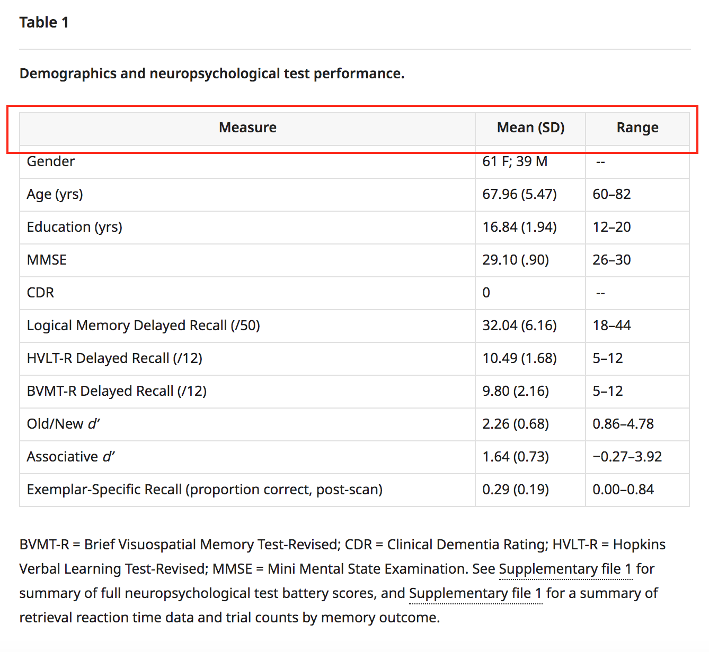

Every table cell in the header can contain the following content:

* Text \(with various different kinds of formatting\)
* Hyperlinks
* Inline images
* Code blocks
* Inline formulae
* Line breaks

See also [**th-child-test**](tables.md#th-child-test) below.

A cell can be merged with cells in rows above and below it, and can be merged with cells in the columns left and right of it.

Cells can be horizontally and vertically aligned \(see [**Table cell alignment**](tables.md#table-cell-alignment)\).

### Tables with multiple headers

What actually determines the formatting of the cells is whether each cell is formatted as a heading cell or as a normal table cell \(in the XML these are `<th>` and `<td>` elements, respectively\). The table header must contain table header cells, but the table body can contain either \(table header and normal table cells\). It is relatively common for a table body to contain header cells.

If a table has multiple headings throughout, then the cells in the table body should be captured as header cells \(`<th>`\). This has to be done by Exeter \(it currently cannot be done by eLife staff in Kriya\).

Typically an entire row should be captured as a header, although there are exceptions. See the action for [**th-row-test**](tables.md#th-row-test) for some examples.

If a table has multiple headers, spans numerous pages in the PDF, and each header is of equal importance \(or those in the body are more important than the top one\), it _might_ be appropriate to include **no** table header. This is because \(as stated in [the Table Header section](tables.md#table-header)\), the PDF will display the top heading at the top of each subsequent page, and this would be inappropriate.

\*\*\*\*[**Here is an example**](https://elifesciences.org/articles/54090#table1). 

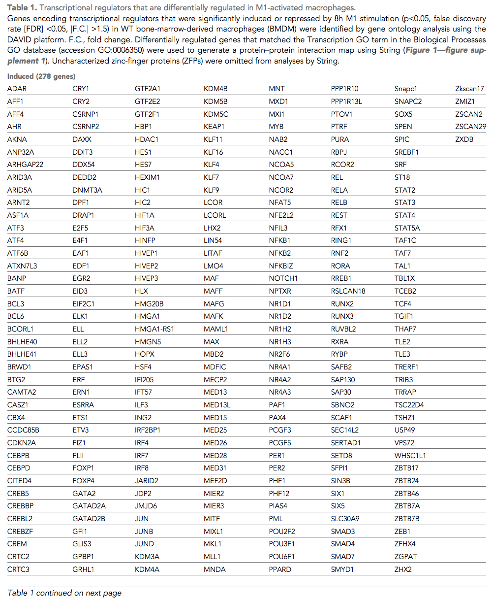

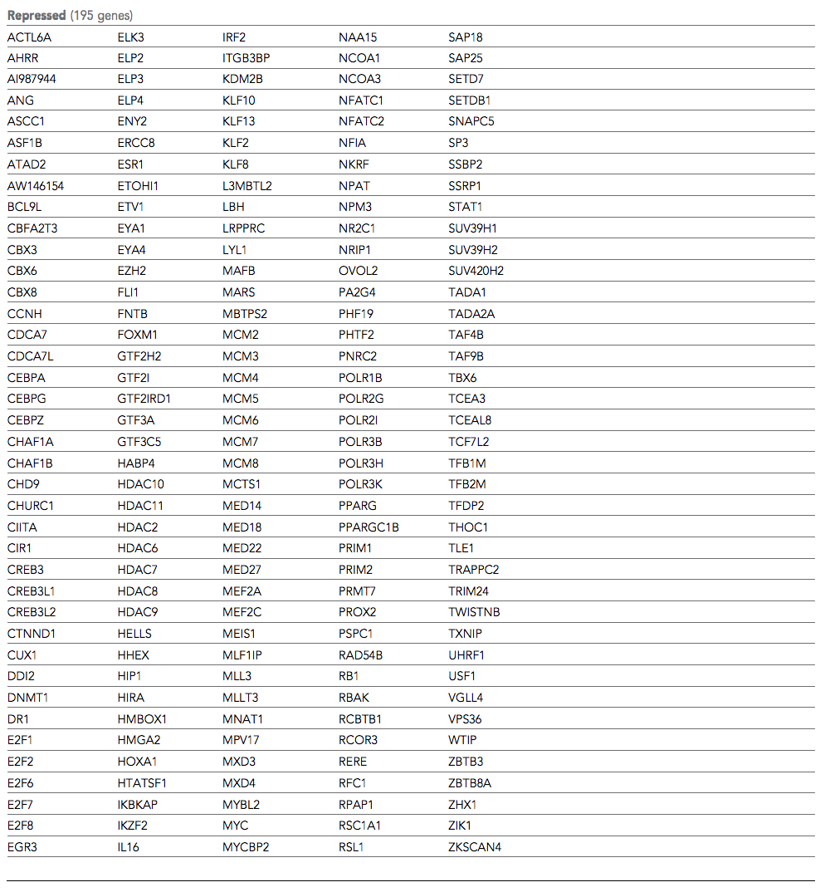

This is a relatively simple table with two headers. In the screenshots above it has been captured correctly. However, if the first heading 'Induced \(278 genes\)' was captured in the table header, then it would display at the top of the 2nd page in the PDF, which would not be appropriate, since the header for that section should instead be 'Repressed \(195 genes\)':


Similarly though, there are cases where it might be appropriate for there to be an overall header, despite there being multiple headers in the table. [**Here for example**](https://elifesciences.org/articles/51662#table1):

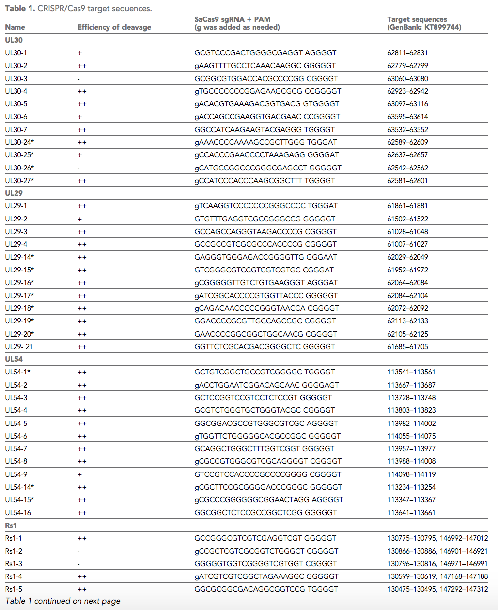

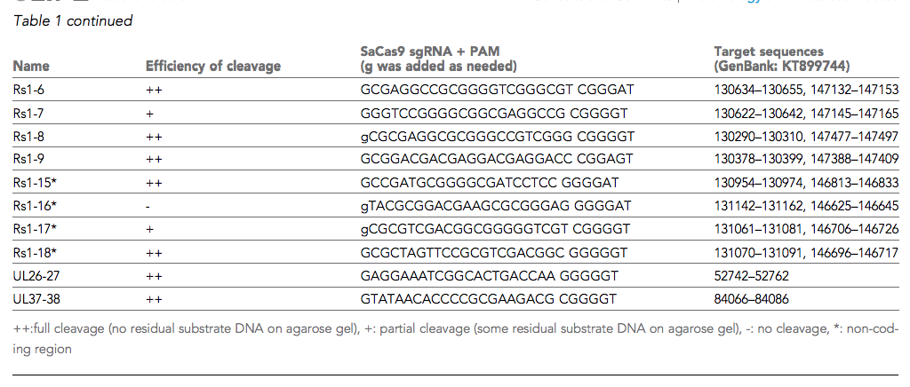

The Schematron check [**th-row-test**](tables.md#th-row-test) will fire if a table header cell is accompanied by normal table cells in the same row. See the action for examples of what to do when this fires.

A single labelled table containing multiple tables \(multiple `<table>` elements in a `<table-wrap>`\) should be avoided where possible. The only case it should be used is where a single table has multiple sections each with different numbers of columns and this cannot be represented in a single table, or where the authors have explicitly labelled a table with multiple parts, e.g. Table 1a, Table 1b etc.

#### Multiple tables within a single labelled table

As stated above, it is possible for there to actually be numerous tables in and object with a single label. This is usually unnecessary and should be avoided where possible however there are cases where this might be appropriate.

If an author has labelled different sections of their table, then multiple tables can be used \(numerous `<table>` elements within one `<table-wrap>`\).

\*\*\*\*[**Here**](https://elifesciences.org/articles/49679#table1) the author has explicitly labelled their table as table 1a and table 1b. Since we only allow Table 1, Table 2 and so on as, as table labels, and this shares a single title/caption, it is necessary to use two tables to capture the separate labelling:

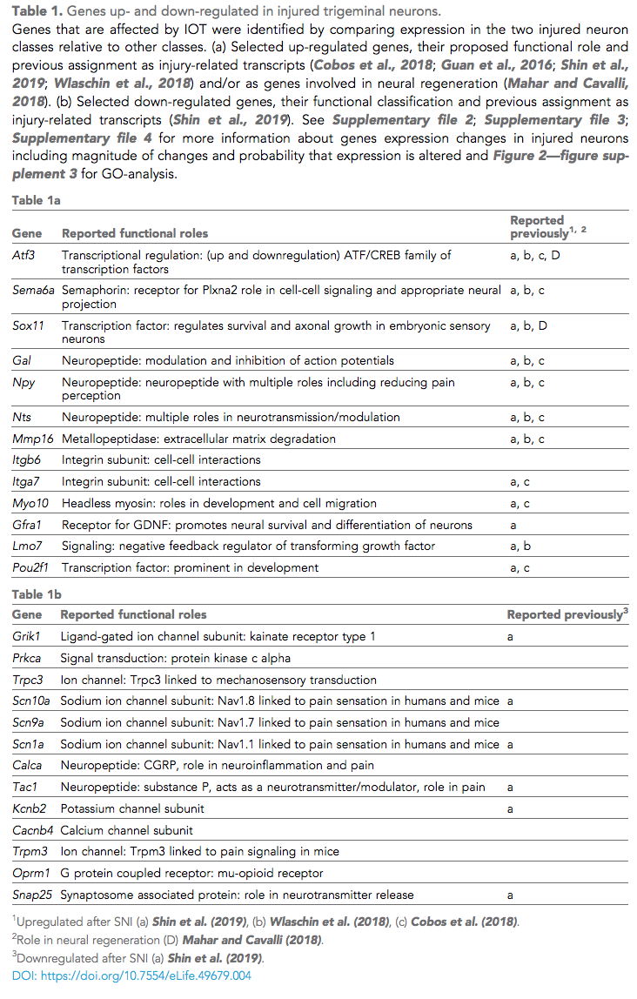

In this case, in the original manuscript, the author has captured this as two separate tables, and cited the individual sections in the text, which, along with the two separate labels is a good indication that it should be captured using two tables:

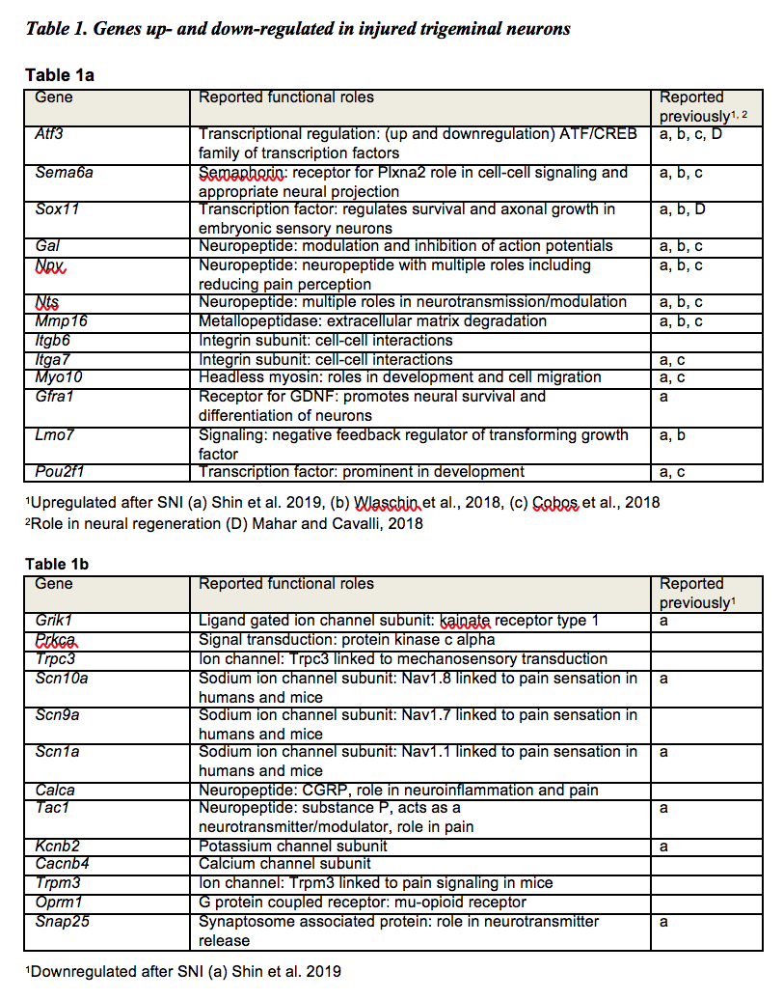

Similarly, if it is simply not possible to represent the content in one table \(i.e. because there are varying different numbers of columns, alignment, etc.\) then, provided that it is a table with multiple headers, it would be acceptable to capture it using multiple tables.

### Table body

The table body is any row and cells which are not in the header. They are usually marked up as normal cells meaning that they display with no shading on the eLife site, and the text only carries the formatting which has been applied to it \(by default, roman formatting\).

A cell can be merged with cells in rows above and below it, and can be merged with cells in the columns left and right of it.

Every table cell in the body can contain the following content:

* Text \(with various different kinds of formatting\)
* Hyperlinks
* Inline images
* Code blocks
* Inline formulae
* Line breaks

See also [td-child-test](tables.md#td-child-test) below.

Cells can be horizontally and vertically aligned \(see [**Table cell alignment**](tables.md#table-cell-alignment)\).

If a cell in the table body is entirely bold formatted, it may be appropriate to format it as a header instead of as a normal table cell. This should be clear based on what content is inside the cell and the content in the rest of the table.

### Table footers

Table footers appear at the bottom of a table. They are intended to only contain extra relevant information \(such as footnotes or attributions\), and will not contain tabulated content. eLife use the footer to contain footnotes to the table. Often these are simple paragraphs which apply to the whole table. They can however be referred to from specific cells in the table, and this is done by including an indicator at the specific place in the cell/text and at the start of the footnote in the footer.

All footnotes that have indicators should follow this sequence \*, †, ‡, §, ¶, \*\***, ††, ‡‡, §§, ¶¶,** \*\*\*, †††, ‡‡‡, §§§, ¶¶¶, \*\*\*\*, ††††, ‡‡‡‡, §§§§, ¶¶¶¶, etc. in accordance with house style. Footnotes with numbers or letters as their indicators are not allowed.

For example a footnote labelled with 1, followed by 2, followed by 3 should be relabelled using †, ‡,  and § respectively.

\*\*\*\*[**Here is an example**](https://elifesciences.org/articles/53886/figures#table2):

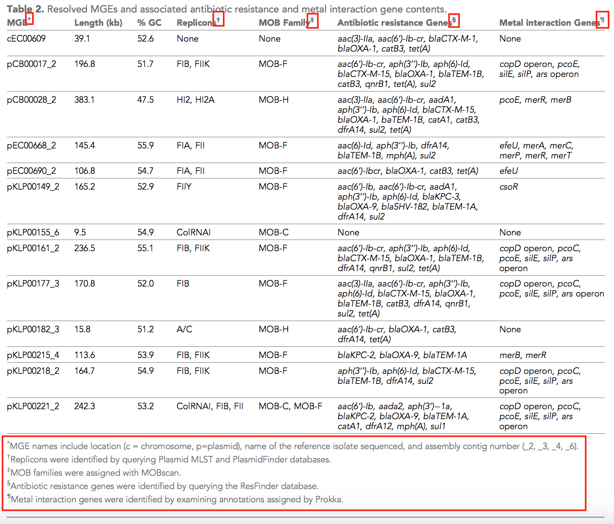

In the future we would like to be able to link footnote indicators in table cells to their respective footnotes, but currently this is not done, merely the symbol is included as \(usually superscripted\) text in both places. 

Table footers can also contain more general footnotes that are not specifically referred to from cells within the table, such as a list of abbreviations or more general notes on the table. This is also fine.

Abbreviations should be included in a single footnote. If the authors originally included abbreviations in the table title or caption, these should _always_ be moved into a footnote.

Footnotes should be placed in the following order:

1. Footnotes with labels \(if present; see above\).
2. p value footnotes \(e.g. \*p&lt;0.05; \*\*p&lt;0.01; \*\*\*p&lt;0.001\) \(if present\).
3. Undesignated footnotes \(e.g. general notes\) \(if present\). 
4. Abbreviations \(if present\).

### Table cell alignment

Table cells can be vertically aligned to the top, bottom or centre. They can also be horizontally aligned to the left, right, or centre. By default cells should be left horizontally aligned and centrally vertically aligned.

If a header spans more than one column, it is likely that central horizontal alignment will be appropriate, however this will depend on the content of the table. Checking against the table in the original manuscript will give an indication of how the authors intended cells to be aligned.

### Supporting source data/code files

Like figures, tables can have supporting source data and source code files. These should be labelled in the format **\[Table label\]—source data 1.** and **\[Table label\]—source code 1**, for example **Table 1—source data 1.**

As with figure level source data, the label and title should be displayed underneath the table in the PDF. [**Here is an example**](https://elifesciences.org/articles/46883/figures#table1sdata1) from published content:

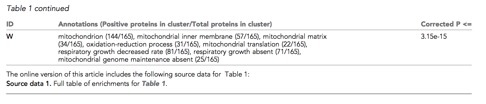

### Allowed colours in tables

eLife allow the following colours as background shading for Table cells:

* Blue
* Green 
* Orange
* Yellow
* Purple
* Red
* Pink
* Grey

eLife allow the following colours for text \(in this case text inside table cells\):

* Blue
* Purple
* Red

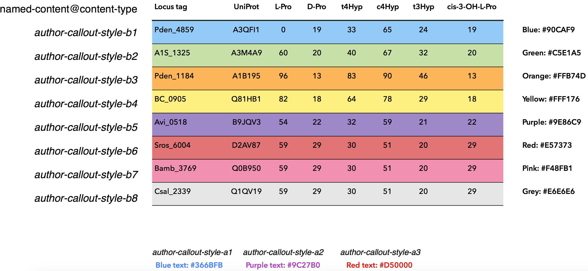

These colours have been selected with accessibility in mind. The eLife site will not support other colours.

Colours will not display downstream \(in places other than the eLife website where the content will display - for example PMC\).

As a result colours should be avoided where possible. There are two author queries relating to this, which should be added if the tests [**colour-check-table**](tables.md#colour-check-table) and [**pre-colour-check-table-2**](tables.md#pre-colour-check-table-2) fire respectively:

* Where possible, we prefer that colours are not used in tables in the interests of accessibility and because they will not display in downstream HTML \(for example in PMC\). Would it be possible to capture the same meaning in this table with more common forms of emphasis \(such as bold, italic or underline\)? If so please stipulate below how the table should be revised. Please note that this is a suggestion and supported colours in tables can be published.


* Where possible, we prefer that colours are not used in tables in the interests of accessibility and because they will not display in downstream HTML \(for example in PMC\). However, eLife does support the following colours for table cells - blue, green orange, yellow, purple, red, pink and grey. Please confirm how you would like the colour\(s\) captured here given this information, and note that our preference would be to use more common forms of emphasis \(such as bold, italic or underline\) if possible to still convey the same meaning.

But ultimately, the decision about whether to include \(supported\) colours is made by the authors.

## Key resources tables

Key resources tables contain a list of resources \(such as Genes, Strains, Antibodies, Reagents, Chemical compounds, Software etc.\) that were used in generating the research communicated in an article. 

They are always placed at the start of the Materials and methods \(or equivalent sections, such as Model and materials\).

They have the label 'Key resources table', and no title or caption.

They have a specific structure which must be followed - there will always be 5 columns, each with a header. When creating these tables, authors should use [**this template**](https://cdn.elifesciences.org/author-guide/key_resources_table.xlsx). If the structure is not adhered to, then this has to be fixed during proofing. There are Schematron tests which will flag Key resources tables with the incorrect headers or number of columns.

In some articles, Key resources tables will be captured in a supplementary file instead. This is currently acceptable and no action needs to be taken \(although in the future we will likely not allow this\).

[**Key resources table example**](https://elifesciences.org/articles/57578#keyresource):

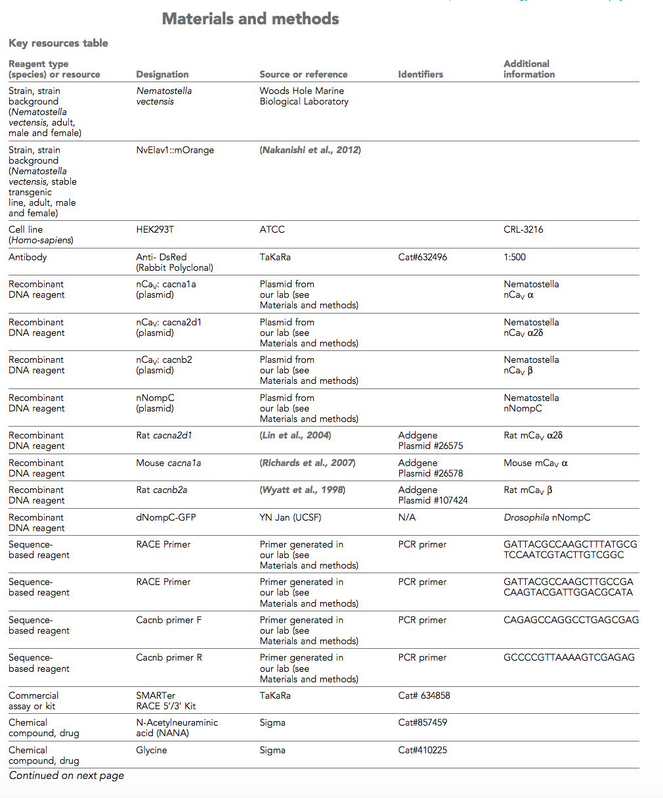

## Inline tables

These are tables without labels. This means that they are not cited from elsewhere in the text, and should be placed in the flow of text that they have been in the original manuscript. Aside from a label, title and caption, they can contain the same content as any other table.

\*\*\*\*[**Here**](https://elifesciences.org/articles/55246#s4-24) ****is an example of two inline tables:

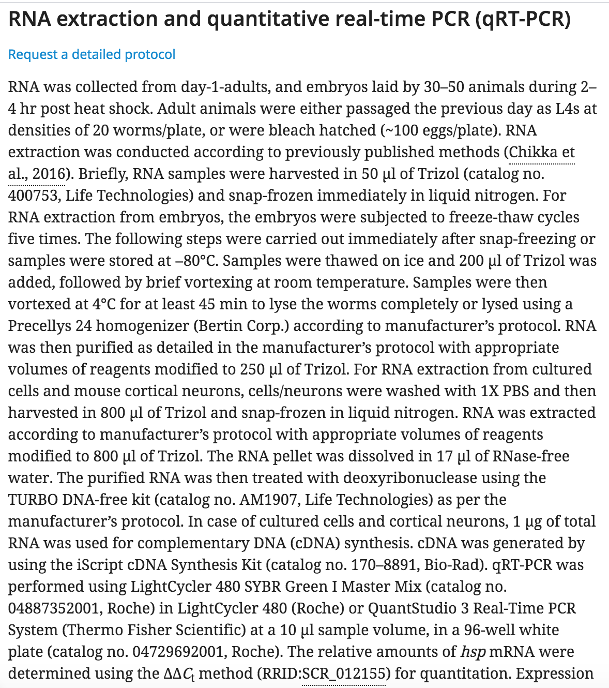

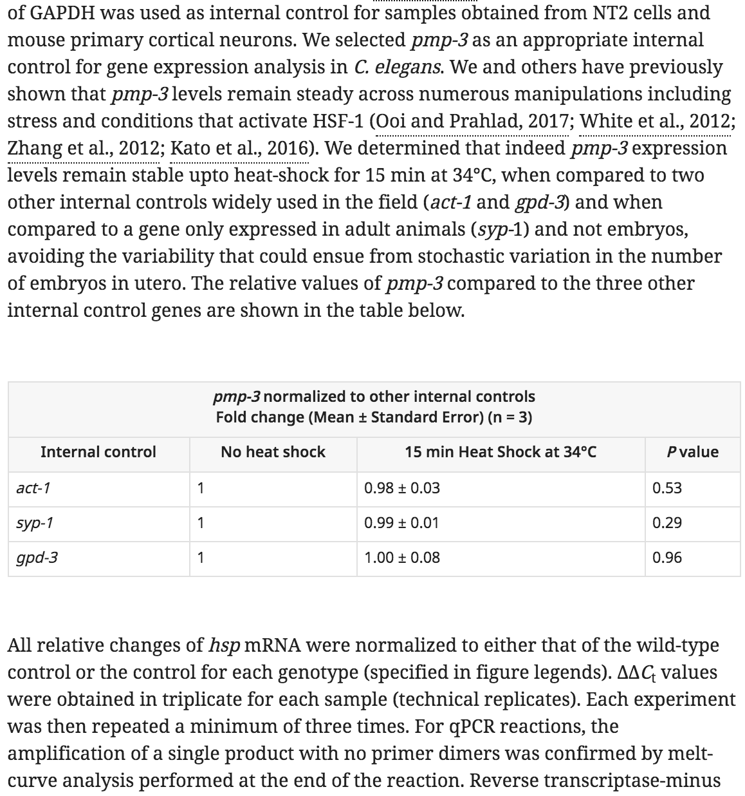

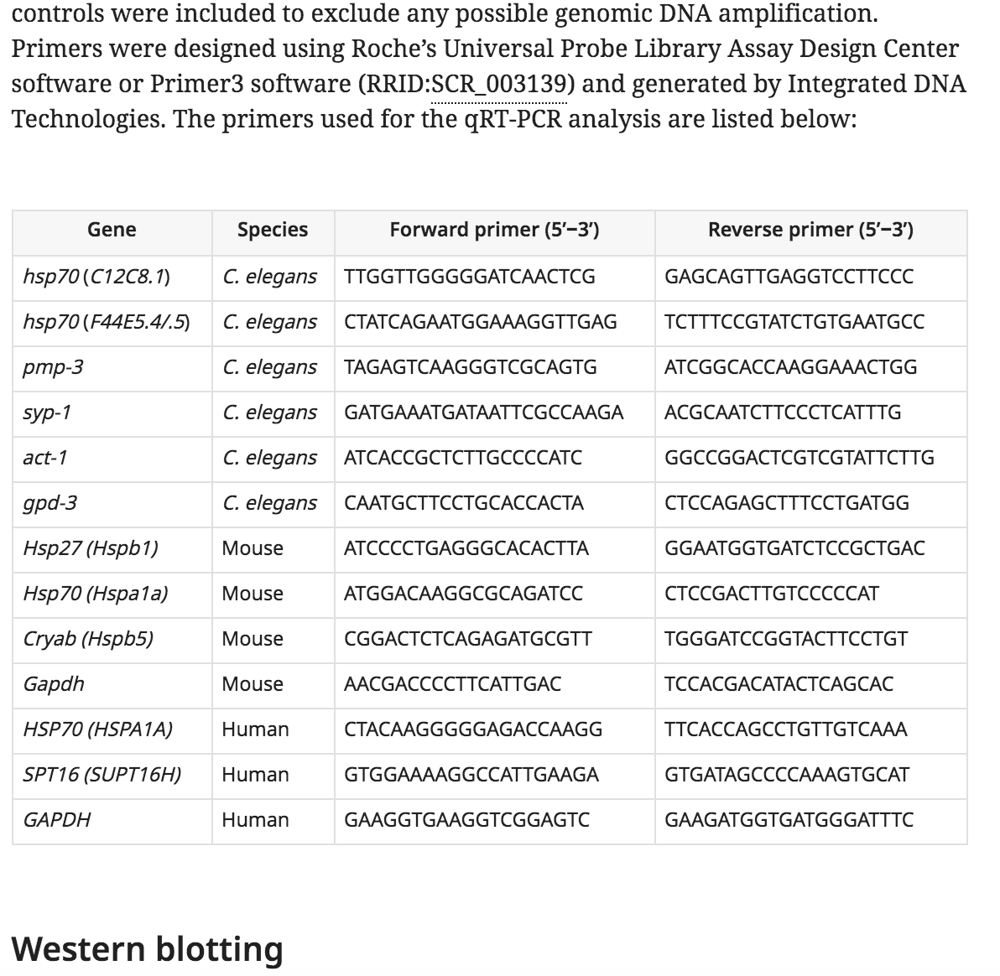

Inline tables can never have a title or caption. If authors have provided a table in their original manuscript with a title and caption, then the table should be given a label.

## Tables in feature content

Feature content can contain both inline and labelled tables. All of the same rules apply in feature content as do in normal research content, with the exception that it is not _necessary_ for a labelled table to have a citation. A citation for each table should still be pursued where possible, as good practice, but it is not needed in order to publish.

Insights do not contain tables.

Feature articles may or may not contain tables.

## Tables in corrections and retractions

Correction and retraction notices may possibly contain tables. In these, it is not necessary for the tables to be cited, and they can be placed out of sequence, since it may refer to tables in a separate article, or reproducing those tables for the purposes of explaining why a separate article has been corrected or retracted.

## Table citations

Labelled tables, which are not Key resources tables, within the main text of an article _must_ have a citation \(the exception to this is tables in [corrections or retractions](tables.md#tables-in-corrections-and-retractions) and [feature content](tables.md#tables-in-feature-content)\). Citations are optional for tables placed anywhere else in an article \(appendices, boxes, and Decision letters/Author responses\), but citations for tables in appendices should also be sought after where appropriate. 

In the XML/HTML, tables should be placed directly after their first citation in the text.

In the PDF, tables should be placed as close to their first citation as appropriately possible, unless otherwise specified by authors.

Inline tables \(that is tables with no label, title or caption\) cannot have citations and so do not require any.

### Tables cited out of sequence

If tables are cited out of sequence, i.e. Table 2 is cited in the text before Table 1, and there is still a citation for each \(and these citation _are_ in sequence\), then at pre-author stages the tables should be set and placed in the order according to their label, and the out of sequence citation\(s\) left as plain text. The following query should be added on the plain text citation:

* This citation is out of sequence with the other table citations and has therefore been left unlinked \(table placement is determined by first live citation\). Please confirm this is acceptable.

If the citations are out of sequence and there are no other in sequence citations, then, at pre-author stages, the following query should be added:

* Table X is cited out of sequence. Would it be appropriate to relabel the citation based on their first citation? If not, please provide a citation for this table elsewhere in text, in sequence with the current labelling.

## Schematron checks

The following tests are run on tables. 

### Content checks

These checks relate to the content of tables. X or XXXXXX refers to quoted text which will change depending on the article.

#### body-table-label-test-1

**Error**: _XXXXXX - Table label does not conform to the usual format._

**Action**: This will fire when a table \(outside of appendices\) has a label which is not in one of the following formats:

* Table 1.
* Key resources table.
* Author response table 1.
* Decision letter 1.

Please ensure that the table label is either in one of these formats or \(in the case where it _should not_ have a label\), the label is removed. Please note that the label _must_ end with a full stop. Please also check for [no-break spaces](https://www.fileformat.info/info/unicode/char/00a0/index.htm) in the table label text. This error will fire if any are present, and they should always be replaced with normal spacing.

#### app-table-label-test-1

**Error**: _XXXXXX - Table label does not conform to the usual format._

**Action**: This will fire when a table in an appendix has a label which is not in the format 'Appendix 1—table 1.' 

Please ensure that there are no typos, missing or extra spaces, that the capitalisation is correct, that the character between 'Appendix X' and 'table X' is an [em dash](https://www.fileformat.info/info/unicode/char/2014/index.htm), and that the label ends with a full stop. Please also check for no-break spaces in the table label text. This error will fire if any are present, and they should always be replaced with normal spacing.

#### app-table-label-test-2

**Error**: _XXXXXX - Table label does not begin with the title of the appendix it sits in. Either the table is in the incorrect appendix or the table has been labelled incorrectly._

**Action**: This will fire when a table in an appendix has a label which does not start with the title of the appendix that it sits in, for example 'Appendix 1—table 1.' in 'Appendix 2'.

Depending on the case, the table will either need to be moved into its appropriate appendix, or it will need to be re-labelled.

#### table-fn-label-test-1

**Warning**: _Footnote starts with label which is not in line with house style - XXXXXX. Footnote symbols should be in the order: \*, †, ‡, §, ¶, \*\*, ††, ‡‡, §§, ¶¶, etc._

**Action**: Footnote indicators should be in the following sequence \*_,_ †, ‡, §, ¶, \*\***, ††, ‡‡, §§, ¶¶, \*\*\***, †††, ‡‡‡, §§§, ¶¶¶, \*\*\*\*, ††††, ‡‡‡‡, §§§§, ¶¶¶¶, etc. If this warning fires, it is because a footnote has an indicator and it isn't one of the allowed symbols. The indicators should be changed in line with the sequence above.

#### pre-body-table-report

**Warning**: _XXXXXX_ _does not appear in sequence. Relative to the other numbered tables it is placed in position XX._

**Action**: This will fire at pre-author stages when a table is placed out of sequence in the body of an article \(such as Table 1 being placed after Table 2\). If this warning fires, and there is no citation for that table, please add the following author query:

* Please provide an in-text citation for this table.

If there is an in-text citation, but the citations are out of sequence \(i.e. Table 1 being cited after Table 2\), then please add the following author query:

* This citation is out of sequence with the other table citations and has therefore been left unlinked \(table placement is determined by first live citation\). Please confirm this is acceptable.

#### final-body-table-report

**Error**: _XXXXXX_ _does not appear in sequence which is incorrect. Relative to the other numbered tables it is placed in position XX._

**Action**: This will fire at post-author stages when a table is placed out of sequence in the body of an article \(such as Table 1 being placed after Table 2\). If this error fires, Production will need to contact the authors in order to determine how they would like their tables to be labelled/presented.

#### pre-app-table-report

**Warning**: _XXXXXX_ _does not appear in sequence. Relative to the other numbered tables it is placed in position XX._

**Action**: This will fire at pre-author stages when a table is placed out of sequence in an appendix \(such as Appendix 1—table 1 being placed after Appendix 1—table 2\). If this warning fires, and there is no citation for that table, please add the following author query:

* Please provide an in-text citation for this table.

If there is an in-text citation, but the citations are out of sequence \(i.e. Appendix 1—table 1 being cited after Appendix 1—table 2\), then please add the following author query:

* This citation is out of sequence with the other table citations and has therefore been left unlinked \(table placement is determined by first live citation\). Please confirm this is acceptable.

#### final-app-table-report

**Error**: _XXXXXX_ _does not appear in sequence which is incorrect. Relative to the other numbered tables it is placed in position XX._

**Action**: This will fire at post-author stages when a table is placed out of sequence in an appendix \(such as Appendix 1—table 1 being placed after Appendix 1—table 2\). If this error fires, Production will need to contact the authors in order to determine how they would like their tables to be labelled/presented.

#### xref-column-test

**Warning**: '_XXXXXX' citation is in a column in the Key Resources Table which usually does not include references. Is it correct?_

**Action**: This will fire if a citation is present in the 1st, 2nd or 4th column in a Key resources table \(these are headed 'Reagent type \(species\) or resource', 'Designation', and 'Identifiers', respectively\). If it's clear, based on the content of the rest of the table, that the citation should be moved in the 3rd \(headed 'Source/reference'\) or 5th \(headed 'Additional information'\) column, then ensure that it is moved to one of these columns. If it is not clear, and the article is at a pre-author stage, then the following query should be added:

* Please confirm, is this citation in the correct column?

If the article is post-author, then the authors should be queried to check that this is correct \(if they haven't been already\).

#### doi-link-test

**Error**: _td element containing - 'XXXXXX' - looks like it contains a doi, but it contains no link with 'doi.org', which is incorrect._

**Action**: This will fire if a table cell in a Key resources table contains an unlinked doi. All dois should be linked in the Key resources table, so action should be taken to ensure that the doi text has an embedded link \(https://doi.org/{doi}\).

#### PMID-link-test

**Error**: _td element containing - 'XXXXXX' - looks like it contains a PMID, but it contains no link pointing to PubMed, which is incorrect._

**Action**: This will fire if a table cell in a Key resources table contains an unlinked PMID. All PMIDs should be linked in the Key resources table, so action should be taken to ensure that the PMID text has an embedded link \(https://www.pubmed.ncbi.nlm.nih.gov/{PMID}\).

#### PMCID-link-test

**Error**: _td element containing - 'XXXXXX' - looks like it contains a PMCID, but it contains no link pointing to PMC, which is incorrect._

**Action**: This will fire if a table cell in a Key resources table contains an unlinked PMCID. All PMCIDs should be linked in the Key resources table, so action should be taken to ensure that the PMCID text has an embedded link \(https://www.ncbi.nlm.nih.gov/pmc/{PMCID}\).

#### colour-check-table

**Warning**: _XXXXXX element has colour background. Is this correct? It contains XXXXXX._

**Action**: This will fire if a table cell in a table has colour formatting \(a style attribute beginning with 'author-callout'\). eLife only allow the following colours in table cells -  blue, green orange, yellow, purple, red, pink and grey. When this fires \(and [**pre-colour-check-table-2**](tables.md#pre-colour-check-table-2) does not fire\) an author query should be added to the table \(only 1 per table\):

* Where possible, we prefer that colours are not used in tables in the interests of accessibility and because they will not display in downstream HTML \(for example in PMC\). Would it be possible to capture the same meaning in this table with more common forms of emphasis \(such as bold, italic or underline\)? If so please stipulate below how the table should be revised. Please note that this is a suggestion and supported colours in tables can be published.

#### pre-colour-check-table-2

**Warning**: _element containing 'XXXXXX' has an @style with an unallowed value - 'XXXXXX'. The only allowed values are 'author-callout-style-b1', 'author-callout-style-b2', 'author-callout-style-b3', 'author-callout-style-b4', 'author-callout-style-b5', 'author-callout-style-b6', 'author-callout-style-b7', 'author-callout-style-b8' for blue, green orange, yellow, purple, red, pink and grey respectively. Please ensure one of these is used. If it is clear that colours are supposed to be used, but you are not sure which ones, then please query the authors - 'eLife only supports the following colours for table cells - blue, green orange, yellow, purple, red, pink and grey. Please confirm how you would like the colour\(s\) here captured given this information.'._

**Action**: This will fire at a pre-author stage if a table cell in a table has a style attribute with an unallowed value. Usually this will be because the colour formatting is not a supported colour. If it _is_ one of the supported colours and this message fires this is a problem - it means that the content has not been tagged correctly.

In the case where it is a colour that is not supported \(brown for example\), then as the message suggests the following author query should be added:

* Where possible, we prefer that colours are not used in tables in the interests of accessibility and because they will not display in downstream HTML \(for example in PMC\). However, eLife does support the following colours for table cells - blue, green orange, yellow, purple, red, pink and grey. Please confirm how you would like the colour\(s\) captured here given this information, and note that our preference would be to use more common forms of emphasis \(such as bold, italic or underline\) if possible to still convey the same meaning.

See also [**Allowed colours in table cells**](tables.md#allowed-colours-in-tables).

#### final-colour-check-table-2

**Error**: _element containing 'XXXXXX' has an @style with an unallowed value - 'XXXXXX'. The only allowed values are 'author-callout-style-b1', 'author-callout-style-b2', 'author-callout-style-b3', 'author-callout-style-b4', 'author-callout-style-b5', 'author-callout-style-b6', 'author-callout-style-b7', 'author-callout-style-b8' for blue, green orange, yellow, purple, red, pink and grey respectively._

**Action**: This will fire at a post-author stage if a table cell in a table has a style attribute with an unallowed value. Usually this will be because the colour formatting is not a supported colour. If it _is_ one of the supported colours and this message fires this is a problem - it means that the content has not been tagged correctly. If it is not a supported colour, ensure to check the author's response to the query which should have been added pre-author. If the response isn't clear about how to proceed \(or the query was mistakenly not left\), then Production will need to contact the author to ask how they would like to proceed.

See also [**Allowed colours in table cells**](tables.md#allowed-colours-in-tables).

#### table-wrap-test-3

**Error**: _table-wrap has an inline id XXXXX but it has a label - XXXXX, which is not correct._

**Example message**: table-wrap has an inline id inline-table1 but it has a label - Table 1., which is not correct.  

**Action**: This will fire if a table has an id which is not correct based on its label. There are two possible scenarios here:

1. A labelled table \(e.g. Table 1\) with the incorrect id.
2. An inline \(un-labelled\) table with the correct id, but an unnecessary label.

Check against the original manuscript in order to determine whether the table should be labelled or not. This can be determined if the author has included a label or if they have included a title and/or caption \(if they have included a title and/or caption but no label in the original manuscript then one will have to provided\). If \(after having checked the manuscript\) it should be a labelled table, then Exeter will have to correct the id. A table with a label must have an id in the format `table1`.  

If the second scenario is the case, the erroneous label should be removed, and the id left as it is.

#### table-wrap-test-4

**Error**: _table-wrap with id XXXXX has no label which is not correct._

**Action**: This is the inverse of [table-wrap-test-3](tables.md#table-wrap-test-3). It will fire if a table without a label has a label which is in the format `table1`. There are two scenarios here:

1. A table with the correct id which is missing its label.
2. An inline \(un-labelled\) table with the incorrect id.

Check against the original manuscript in order to determine whether the table should be labelled or not. This can be determined if the author has included a label, or if they have included a title and/or caption. If \(after having checked the manuscript\) it should be a labelled table, then ensure the correct label is added \(Exeter will have to do this\). A table with id in the format `table1`, must have a label in the format 'Table 1.' 

If the second scenario is the case, the id will need to be corrected so that it is in the format `inlinetable1`. 

#### kr-table-wrap-test-1

**Error**: _table-wrap has an id 'keyresource' but its label is not 'Key resources table', which is incorrect._

**Action**: Key resources tables must have the label 'Key resources table', and an id `keyresource`. This will fire is a table has that id, but it does not have a label, or the label is not exactly as specified above. Action should be taken to ensure both of these conditions are met.

#### pre-table-wrap-cite-1

**Warning**: _There is no citation to XXXXXX. Ensure to query the author asking for a citation._

**Action**: This will fire at pre-author stages for tables \(which are not Key resources tables\) with labels. If this fires \(and there are no issues with labelling or the table id\), then the following author query should be added:

* Please provide an in-text citation for this table.

The only exception to this is where the article contains an appendix and there is no appropriate place to cite the tables in the appendix \(for example if it is _only_ made up of tables\). In such cases, adding a query is not necessary.

#### final-table-wrap-cite-1

**Warning**: _There is no citation to XXXXXX. Ensure this is added._

**Action**: This will fire at post-author stages for tables \(which are not Key resources tables\) with labels, in articles which are not corrections or retractions. If this fires \(and there are no issues with labelling or the table id\), and the authors have not indicated in response to a query where the citation should be, then eLife production should contact the authors to get an appropriate citation.

The only exception to this is where the article contains an appendix and there is no appropriate place to cite the tables in the appendix \(for example if it is _only_ made up of tables\).

#### feat-table-wrap-cite-1

**Warning**: _There is no citation to XXXXXX. Is this correct?_

**Action**: This will fire at all stages for tables \(which are not Key resources tables\) with labels, in feature content \(insights or feature articles\). 

If this fires at a **pre-author stage** \(and there are no issues with labelling or the table id\), then the following author query should be added:

* Please provide an in-text citation for this table.

If this fires at a **post-author stage**, this should be **ignored** by Exeter and eLife production should check with Features as to whether there should be a citation \(if it isn't already clear\).

#### kr-table-not-tagged

**Error**: _XXXXXX has headings that are for the Key resources table, but it does not have an @id='keyresource'._

**Action**: This will at all stages fire if a table has all the Key resources table headings but does not have an  id `keyresource`. If this fires, ensure that the Table is captured as a Key resources table \(with the correct id, label and no title or caption\).

#### kr-table-not-tagged-2

**Warning**: _XXXXXX has the title XXXXXX but it is not tagged as a key resources table. Is this correct?_

**Action**: This will fire at all stages if a table has a title containing the text 'Key resource'. If it _is_ a key resources table, then this should be captured as a Key resources table \(with the correct id, label and no title or caption\). If it is not \(i.e. just a normal table, without the standard Key resources table headings, which happens to have the text 'Key resource' in it's title\), then this message can be ignored.

#### kr-table-header-1

**Warning**: _Key resources tables should have 5 column headings \(th elements\) but this one has X. Either it is incorrectly typeset or the author will need to be queried in order to provide the table in the correct format._

**Action**: This will fire at all stages if a Key resources table does not have the correct number of headings. All Key resources tables should have 5 headings/columns. If the table is typeset correctly \(**please check this carefully**\), as the author provided it, then the following author query should be added:

* This Key resource table is not in the correct format. Please provide a revised table as a Word or Excel file in response to the proofing email. A template for the table can be found at https://cdn.elifesciences.org/author-guide/key\_resources\_table.xlsx. We regret that this was not brought to your attention earlier and apologise for the inconvenience.

#### kr-table-header-2

**Warning**: _Key resources table has more than 1 row in its header, which is incorrect._

**Action**: This will fire at all stages if a Key resources table has more than one row in it's header. It is **very** likely that this means the table has been incorrectly typeset. If this is the case please correct. If this has been checked very carefully and the table is as the author provided it, then the following author query should be added:

* This Key resource table is not in the correct format. Please provide a revised table in the required format using this guide - [https://cdn.elifesciences.org/author-guide/key\_resources\_table.xlsx](https://cdn.elifesciences.org/author-guide/key_resources_table.xlsx). The table can be provided as an editable file \(such as word or excel\) in response to the proofing email. We regret that this was not brought to your attention earlier and apologise for the inconvenience.

#### kr-table-header-3

**Warning**: _Key resources table has no rows in its header, which is incorrect._

**Action**: This will fire at all stages if a Key resources table has no rows in it's header. It is **very** likely that this means the table has been incorrectly typeset. Action should be taken to include the required headings for Key resources tables \(see [Key resources tables](tables.md#key-resources-tables)\).

For example, the header may be present as a row in the body of the table, rather than captured as a proper header.

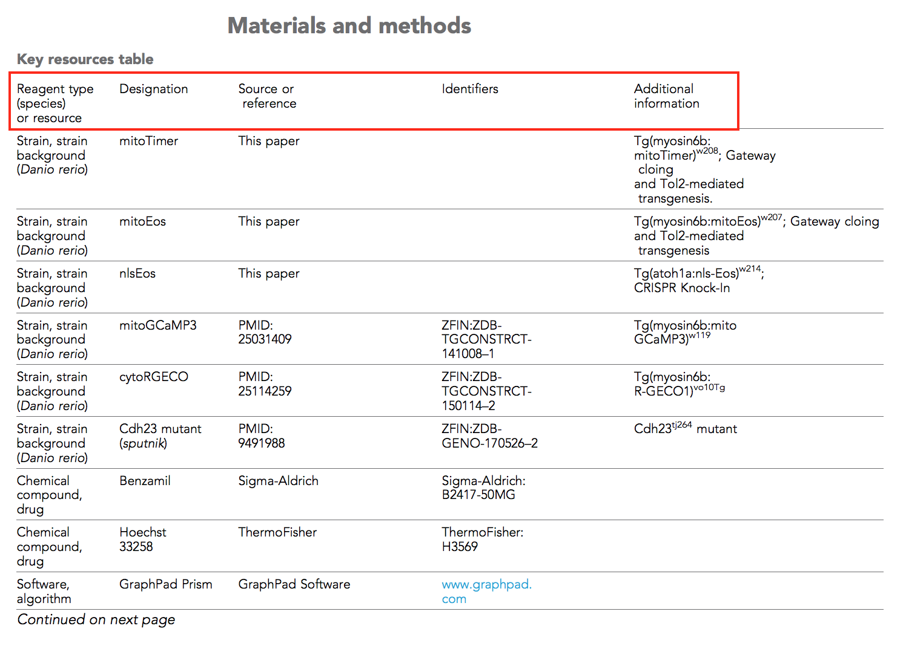

#### kr-table-header-4

**Warning**: _The first column header in a Key resources table is usually 'Reagent type \(species\) or resource' but this one has 'XXXXXX'._

**Action**: This will fire at all stages if the first header in a Key resources table is not 'Reagent type \(species\) or resource'. If it's clearly a typo, then this should be corrected. If the table is completely different to how it should be \(see [above](tables.md#key-resources-tables)\), then please add the following author query:

* This Key resource table is not in the correct format. Please provide a revised table in the required format using this guide - [https://cdn.elifesciences.org/author-guide/key\_resources\_table.xlsx](https://cdn.elifesciences.org/author-guide/key_resources_table.xlsx). The table can be provided as an editable file \(such as word or excel\) in response to the proofing email. We regret that this was not brought to your attention earlier and apologise for the inconvenience.

#### kr-table-header-5

**Warning**: _The second column header in a Key resources table is usually 'Designation' but this one has 'XXXXXX'._

**Action**: This will fire at all stages if the second header in a Key resources table is not 'Designation'. If it's clearly a typo, then this should be corrected. If the table is completely different to how it should be \(see [above](https://app.gitbook.com/@elifesciences/s/productionhowto/article-details/content/tables#key-resources-tables)\), then please add the following author query:

* This Key resource table is not in the correct format. Please provide a revised table as a Word or Excel file in response to the proofing email. A template for the table can be found at https://cdn.elifesciences.org/author-guide/key\_resources\_table.xlsx. We regret that this was not brought to your attention earlier and apologise for the inconvenience.

#### kr-table-header-6

**Warning**: _The third column header in a Key resources table is usually 'Source or reference' but this one has 'XXXXXX'._

**Action**: This will fire at all stages if the third header in a Key resources table is not 'Source or reference'. If it's clearly a typo, then this should be corrected. If the table is completely different to how it should be \(see [above](https://app.gitbook.com/@elifesciences/s/productionhowto/article-details/content/tables#key-resources-tables)\), then please add the following author query:

* This Key resource table is not in the correct format. Please provide a revised table in the required format using this guide - [https://cdn.elifesciences.org/author-guide/key\_resources\_table.xlsx](https://cdn.elifesciences.org/author-guide/key_resources_table.xlsx). The table can be provided as an editable file \(such as word or excel\) in response to the proofing email. We regret that this was not brought to your attention earlier and apologise for the inconvenience.

#### kr-table-header-7

**Warning**: _The fourth column header in a Key resources table is usually 'Identifiers' but this one has 'XXXXXX'._

**Action**: This will fire at all stages if the fourth header in a Key resources table is not 'Identifiers'. If it's clearly a typo, then this should be corrected. If the table is completely different to how it should be \(see [above](https://app.gitbook.com/@elifesciences/s/productionhowto/article-details/content/tables#key-resources-tables)\), then please add the following author query:

* This Key resource table is not in the correct format. Please provide a revised table in the required format using this guide - [https://cdn.elifesciences.org/author-guide/key\_resources\_table.xlsx](https://cdn.elifesciences.org/author-guide/key_resources_table.xlsx). The table can be provided as an editable file \(such as word or excel\) in response to the proofing email. We regret that this was not brought to your attention earlier and apologise for the inconvenience.

#### kr-table-header-8

**Warning**: _The fifth column header in a Key resources table is usually 'Additional information' but this one has 'XXXXXX'._

**Action**: This will fire at all stages if the fifth header in a Key resources table is not 'Additional information'. If it's clearly a typo, then this should be corrected. If the table is completely different to how it should be \(see [above](https://app.gitbook.com/@elifesciences/s/productionhowto/article-details/content/tables#key-resources-tables)\), then please add the following author query:

* This Key resource table is not in the correct format. Please provide a revised table in the required format using this guide - [https://cdn.elifesciences.org/author-guide/key\_resources\_table.xlsx](https://cdn.elifesciences.org/author-guide/key_resources_table.xlsx). The table can be provided as an editable file \(such as word or excel\) in response to the proofing email. We regret that this was not brought to your attention earlier and apologise for the inconvenience.

#### kr-table-body-1

**Error**: _Table cell in_ Key resources _table containing 'XXXXXX' is captured as a table header cell \(th\), which is not allowed. Ensure that this is changed to a normal table cell \(td\)._

**Action**: This will fire for any table cell in the body of a Key Resources table which is captured with heading formatting \(as a `<th>` element\). This should always be changed to a normal table cell \(`<td>` element\).

#### table-test-2

**Warning**: _table doesn't have a header \(thead\). Is this correct?_

**Action**: This will fire if a table does not have a header \(the `<table>` element does not have a child `<thead>` element\). This could either mean that the table has been incorrectly typeset without headers, or there could be a good reason that it does not have a header \(see [Tables with multiple headers](https://app.gitbook.com/@elifesciences/s/productionhowto/article-details/content/tables#tables-with-multiple-headers)\). Checking against the original manuscript should give an indication of how this table should be captured. If it is an error then this should be fixed by Exeter, otherwise the message can be ignored.

#### tbody-test-1

**Error**: _tbody must have at least one row \(tr\)._

**Action**: This will fire if the body of a table does not have a row. This is unlikely to occur and if it does, would indicate that the table has been typeset incorrectly, which will need to be fixed by Exeter.

#### thead-test-1

**Error**: _thead must have at least one row \(tr\)._

**Action**: This will fire if the header of a table does not have a row. This is unlikely to occur and if it does, would indicate that the table has been typeset incorrectly, which will need to be fixed by Exeter.

#### tr-test-1

**Error**: _row \(tr\) must contain at least one heading cell \(th\) or data cell \(td\)._

**Action**: This will fire if the a row does not have any table cells. This is unlikely to occur and if it does, would indicate that the table has been typeset incorrectly, which will need to be fixed by Exeter.

#### tr-test-2

**Warning**: _table row in body contains a th element \(a header\). Please check that this is correct._

**Action**: This will fire for table cells which are styled as headers, but are in the table body. If the table has numerous headers throughout it \(and is supposed to\), then this can be ignored. Otherwise Exeter will have to change this to a normal table cell.

#### tr-test-3

**Error**: _table row in header contains a td element \(table data\), which is not allowed. Only th elements \(table heading cells\) are allowed in a row in the table header._

**Action**: This will fire for table cells which are not styled as headers, but are in the header of the table. The cell should be given heading formatting.

#### th-row-test

**Warning**: _Table header cell containing 'XXXXXX' has table data \(not header\) cells next to it on the same row. Is this correct? Should the whole row be header cells, or should this cell extend across the whole row?_

**Action**: This will fire if a table row contains a mixture of table header cells and normal table cells. This is relatively unusual, although there are a some cases where this would be appropriate. Checking the table in the original manuscript will give some indication of how the headings in a table should look like, and if any changes are required these will need to be implemented by Exeter.

In a case like [this](https://elifesciences.org/articles/53910#table1)

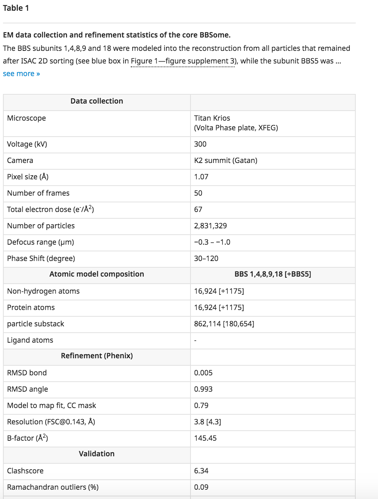

all the table cells next to 'Refinement \(Phenix\)' and 'Validation' \(in their rows\) should be given table header formatting.

In a case like [this](https://elifesciences.org/articles/52505#table1) 

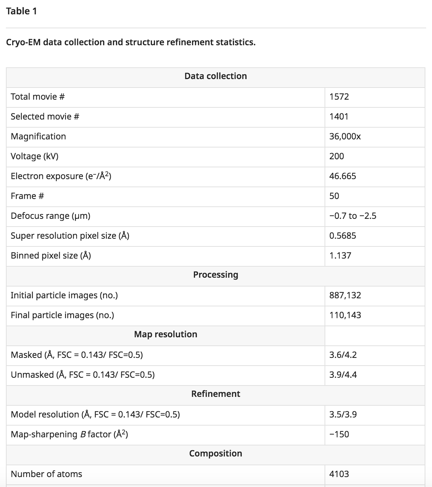

'Map resolution' should be made into one cell spanning across its entire row \(formatted as a header\). This change should be made to achieve consistency with all of the other headings in this table.

In a case like [this](https://elifesciences.org/articles/53498#table1)

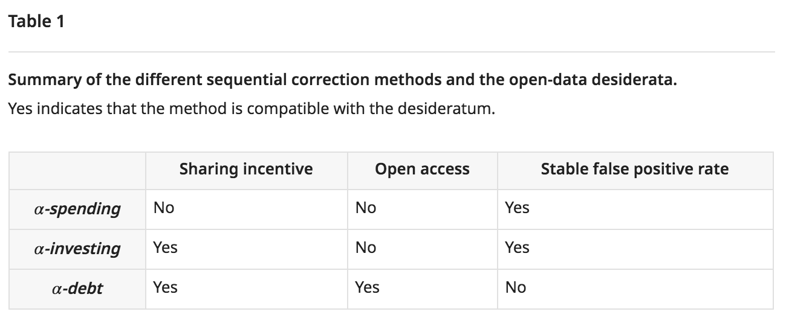

the warning can be ignored, as all the cells in the first column serve as another header.

#### xref-column-test

**Warning**: _'XXXXXXX' citation is in a column in the Key Resources Table which usually does not include references. Is it correct?_

**Action**: This will fire at all stages if a citation in a Key resources table is not in the third or fifth row \(the commonly used ones for citations\). If it is clear that this needs to moved to a different column or is a mistake \(for example a superscript number converted to a citation which should have been left as a number\), then it should be corrected. If not clear, and at a pre-author stage please add this author query:

* Please confirm whether this citation is in the correct column in the Key resources table.

#### table-xref-conformity-1

**Warning**: _'XXXXXXX' - citation points to table, but does not include the string 'Table', which is very unusual._

**Action**: This will fire at all stages if a main text table citation does not contain the word 'Table'. In cases where this fires for text like 'See **Tables 1** and **2**', the test will fire for the **2** and can be ignored. If this fires for any other reason it likely indicates that the citation directs to the incorrect location.

#### table-xref-conformity-2

**Warning**: _'XXXXXXX' - citation points to an Appendix table, but does not include the string 'table', which is very unusual._

**Action**: This will fire at all stages if an Appendix text table citation does not contain the word 'table'. In cases where this fires for text like 'See **Appendix 1–tables 1** and **2**', the test will fire for the **2** and can be ignored. If this fires for any other reason it likely indicates that the citation directs to the incorrect location.

#### table-xref-conformity-3

**Warning**: _'XXXXXXX' - Citation content does not match what it directs to._

**Action**: This will fire at all stages if the text in a main text table citation does not contain the number of the label that the table directs to. For example if **Table 2**, links to Table 3. 

#### table-xref-conformity-4

**Warning**: _'XXXXXXX' - Citation content does not match what it directs to._

**Action**: This will fire at all stages if the text in an appendix table citation does not contain the number of the label that the table directs to. For example if **Appendix 1–table 1**, links to Appendix 1–table 2. 

#### table-xref-test-1

**Warning**: _'XXXXXXX' - Citation is in the caption of the Table that it links to. Is it correct or necessary?_

**Action**: This will fire at all stages if a table citation is in the caption of the table that it links to. This would indicate either an unnecessary link, or that the citation is incorrect and needs to be updated. This should be queried with the authors:

* XXXXX - Please confirm whether this citation is correct and if not, what it should be updated to.

#### table-xref-test-2

**Warning**: _citation is preceded by a letter or number immediately followed by '\('. Is there a space missing before the '\('?  - 'XXXXX'._

**Action**: This will fire at all stages for text such as 'found at the end\(**Table 1**\).'. In this case, the missing space needs to be added between 'end' and '\(**Table 1**\)'.

#### table-xref-test-3

**Warning**: _citation is followed by a '\)' which in turns is immediately followed by a letter or number. Is there a space missing after the '\)'?  -  'XXXXX'._

**Action**: This will fire at all stages for text such as ' end \(**Table 1**\)and in **Figure 1**'. In this case, the missing space needs to be added between '\(**Table 1**\)' and 'and'.

#### table-xref-test-4

**Warning**: _'Incomplete citation. Table citation is followed by text which suggests it should instead be a link to source data or code - 'XXXXXX'._

**Action**: This will fire at all stages for pieces of text like - 'See **Table 1**–Source data 1', where only Table 1 is linked. In these cases, the citation should be updated to link to the source data file \(provided there is one\). If there is no source data, but it has been referred to, then the following author query needs to be added:

* XXXXXX is cited in the text but has not been provided. Please either correct the citation, provide the file and a title and legend, or confirm that this citation refers to another article.

#### table-xref-test-5

**Warning**: _citation is preceded by 'XXXXXX'. The 'cf.' is unnecessary and should be removed._

**Action**: This will fire at all stages if a table citation is preceded by the text 'cf.'. Shorthand for confer is unnecessary and, as the message text suggests, the 'cf.' should be removed.

#### table-data-test-2

**Warning**: _XXXXXX ends with X, but it is placed XXX. Either it is misnumbered or it should be moved to a different position._

**Example:** _'Table 2—source data 2.' ends with 2, but it is placed 1st. Either it is misnumbered or it should be moved to a different position._

**Action**: This will fire at all stages if source data for a table is not placed in the correct sequence based upon its label, for example Table 2—source data 2 is placed before Table 2—source data 1. If this fires, the action should be to re-order the source data files based on their labels.

#### table-code-test-2

**Warning**: _XXXXXX ends with X, but it is placed XXX. Either it is misnumbered or it should be moved to a different position._

**Example:** _'Table 2—source code 2.' ends with 2, but it is placed 1st. Either it is misnumbered or it should be moved to a different position._

**Action**: This will fire at all stages if source code for a table is not placed in the correct sequence based upon its label, for example Table 2—source code 2 is placed before Table 2—source code 1. If this fires, the action should be to re-order the source data files based on their labels.

### **XML structure checks**

These checks relate to the XML structure of tables. X or XXXXXX refers to quoted text which will change depending on the article. For more information about what the XML should look like, see [**below**](tables.md#xml-structure).

#### app-table-wrap-id-test-1

**Error**: _table-wrap @id in appendix must be in the format 'app0table0'. XXXXXX does not conform to this._

**Action**: This will fire when the value if the `id` attribute for a table \(with a label\) in the appendix is not in the format `app0table0`. If this fires, it either means that the Table is in the incorrect appendix, or the id needs to be corrected.

#### app-table-wrap-id-test-2

**Error**: _table-wrap @id must start with XXXXXX._

**Action**: This will fire when the value if the `id` attribute for a table \(with a label\) in the appendix does not start with `app` and the appendix number. For example, the ids for any tables in Appendix 1 should start with `app1`. If this fires, it either means that the Table is in the incorrect appendix, or the id needs to be corrected.

#### resp-table-wrap-id-test

**Warning**: _table-wrap @id in author reply must be in the format 'resptable0' or 'sa0table0' if it has a label, or in the format 'respinlinetable0' or 'sa0inlinetable0' if it does not._

**Action**: This will fire when the value if the `id` attribute for a table in the decision letter or author response is not in any of the below formats:

With a label:

* resptable0
* sa0table0

Without a label:

* respinlinetable0
* sa0inlinetable0

Exeter will need to correct this issue if it fires.

#### table-wrap-id-test

**Error**: _table-wrap @id must be in the format 'table0', unless it doesn't have a label, in which case it must be 'inlinetable0' or it is the key resource table which must be 'keyresource'._

**Action**: This will fire when the value if the `id` attribute for a table in the body of an article \(i.e. not in appendices or decision letters or author responses\) is incorrect. If it is a Key resources table, the id must be `keyresource`_._ If the table has a label, it must be in the format `table0`. It it does not have a label, it needs to be in the format `inlinetable0`.

#### table-wrap-test-1

**Error**: _table-wrap must have one table._

**Action**: This will fire if a `<table-wrap>` element does not have a child `<table>` element, meaning that no table is actually present. If this fires, it has been typeset incorrectly and steps should be taken to correct it.

#### table-wrap-test-2

**Warning**: _table-wrap has more than one table - Is this correct?_

**Action**: This will fire if a `<table-wrap>` element more than one a child `<table>` element. If the table has two or more sections in it with differing numbers of columns, but it has the same label \(and title\), then this warning can be ignored. If it does not, the table should be collated so that there is only one table element - only Exeter are able to do this.

#### table-test-1

**Error**: _table must have at least one body \(tbody\)._

**Action**: This will fire if a `<table>` element does not have a child `<tbody>` element. This means that something has gone wrong with the typesetting - there may just be a header, or there may be no content at all. The table will need to be corrected.

#### td-child-test

**Error**: _td cannot contain XXXXXX. Only the following elements are allowed - 'bold', 'italic', 'sup', 'sub', 'sc', 'ext-link', 'xref', 'break', 'named-content', 'monospace', 'code','inline-graphic','underline', and 'inline-formula'._

**Action**: The list of allowed elements correspond to the following types of content respectively - bold, italics, superscript, subscript, small caps, citations, hyperlinks, line breaks, colour formatting, monospace, code, inline images, underline, and inline formulae. This will fire if a table data cell contains any other type of content, and will likely need to be corrected by Exeter.

#### th-child-test

**Error**: _th cannot contain XXXXXX. Only the following elements are allowed - 'bold', 'italic', 'sup', 'sub', 'sc', 'ext-link', 'xref', 'break', 'named-content', 'monospace',  'code', 'inline-graphic', and 'inline-formula'._

**Action**: The list of allowed elements correspond to the following types of content respectively - bold, italics, superscript, subscript, small caps, citations, hyperlinks, line breaks, colour formatting, monospace, code, inline images, and inline formulae. \(Note that while underline is allowed in table data cells, it is not allowed in header cells.\) This will fire if a table header cell contains any other type of content, and will likely need to be corrected by Exeter.

#### th-child-test-2

**Warning**: _th contains bold. Is this correct?_

**Action**: If this fires in live content, then the bold formatting should be removed. Header formatting is always in bold so the bold formatting is superfluous. The only reason this can be ignored is if this fires in an article which is being published as a new version.

#### pre-pmid-spacing-table

**Error**: _PMID link should be preceding by 'PMID:' with no space but instead it is preceded by 'XXXXXX'_

**Action**: This will fire if a link which points to [PubMed](https://pubmed.ncbi.nlm.nih.gov/) is preceded by 'PMID:' or 'PMID' followed by a space. As the message suggest the space between PMID: and the link should be removed.

#### final-pmid-spacing-table

**Warning**: _PMID link should be preceding by 'PMID:' with no space but instead it is preceded by 'XXXXXX'_

**Action**: This will fire if a link which points to [PubMed](https://pubmed.ncbi.nlm.nih.gov/) is preceded by 'PMID:' or 'PMID' followed by a space. As the message suggest the space between PMID: and the link should be removed. This is warning, because of a possible edge case, where an author would want to include some content which is not a PMID, but points to PubMed and requires a space before it.

## XML structure

Each Table is wrapped in a `<table-wrap>` element.

The table itself is captured in a `<table>` element. A `<table-wrap>` can contain numerous `<table>` elements, so a table with one label, can in fact be made up of numerous tables. More than one `<table>` in a `<table-wrap>` should be avoided where possible. The only case it should be used is where a single table has multiple sections each with different numbers of columns, or where the authors have explicitly labelled a table with multiple parts, e.g. Table 1a, table 1b etc.

Each table header is captured in a `<thead>` element, as a child of `<table>`.

The body of a table is wrapped in a `<tbody>` element.

Table footers should be captured using the `<table-wrap-foot>` element, which is captured as a child of `<table-wrap>`.

Each table row is captured in a `<tr>` element, which can contain either table data cells \(`<td>`\) or table header cells \(`<th>`\).

An empty `<break/>` element should be used to break text between two lines in a table cell.

Horizontal cell alignment is defined using the `align` attribute.

Vertical cell alignment is defined using the `valign` attribute.

### Example of [a simple table](https://elifesciences.org/articles/56451#table1):

```markup
<table-wrap id="table1" position="float">
    <label>Table 1.</label>
    <caption>
        <title>Kinetics of the transitions between IF and OF conformations</title>
    </caption>
    <table frame="hsides" rules="groups">
        <thead>
            <tr>
                <th valign="top">Condition</th>
                <th valign="top"><italic>t</italic><sub>IF</sub> (s)</th>
                <th valign="top"><italic>t</italic><sub>OF</sub> (s)</th>
            </tr>
        </thead>
        <tbody>
            <tr>
                <td valign="top">WT, 5 mM ATP</td>
                <td valign="top">16.1 ± 2.2</td>
                <td valign="top">28.8 ± 4.8</td>
            </tr>
            <tr>
                <td valign="top">WT, 5 mM ATP + 10 µM LTC<sub>4</sub></td>
                <td valign="top">4.7 ± 0.8</td>
                <td valign="top">30.8 ± 5.2</td>
            </tr>
            <tr>
                <td valign="top">E1454Q, 5 mM ATP + 10 µM LTC<sub>4</sub></td>
                <td valign="top">7.7 ± 1.5</td>
                <td valign="top">31.7 ± 5.5</td>
            </tr>
        </tbody>
    </table>
    <table-wrap-foot>
        <fn>
            <p>Shown are the average lifetimes (mean ± SEM) of the composite IF state and the OF
                state for WT and E1454Q MRP1 with indicated ATP and substrate concentrations. The
                effect of dye photobleaching on the apparent IF/OF lifetime has been corrected
                for.</p>
        </fn>
    </table-wrap-foot>
</table-wrap>
```

### Example of a [table with multiple `<table>` elements](https://elifesciences.org/articles/49679#table1):

```markup
<table-wrap id="table1" position="float">
    <label>Table 1.</label>
    <caption>
        <title>Genes up- and down-regulated in injured trigeminal neurons.</title>
        <p>Genes that are affected by IOT were identified by comparing expression in the two injured
            neuron classes relative to other classes. (a) Selected up-regulated genes, their
            proposed functional role and previous assignment as injury-related transcripts (<xref
                ref-type="bibr" rid="bib7">Cobos et al., 2018</xref>; <xref ref-type="bibr"
                rid="bib13">Guan et al., 2016</xref>; <xref ref-type="bibr" rid="bib25">Shin et al.,
                2019</xref>; <xref ref-type="bibr" rid="bib32">Wlaschin et al., 2018</xref>) and/or
            as genes involved in neural regeneration (<xref ref-type="bibr" rid="bib21">Mahar and
                Cavalli, 2018</xref>). (b) Selected down-regulated genes, their functional
            classification and previous assignment as injury-related transcripts (<xref
                ref-type="bibr" rid="bib25">Shin et al., 2019</xref>). See <xref
                ref-type="supplementary-material" rid="supp2">Supplementary file 2</xref>; <xref
                ref-type="supplementary-material" rid="supp3">Supplementary file 3</xref>; <xref
                ref-type="supplementary-material" rid="supp4">Supplementary file 4</xref> for more
            information about genes expression changes in injured neurons including magnitude of
            changes and probability that expression is altered and <xref ref-type="fig" rid="fig2s3"
                >Figure 2—figure supplement 3</xref> for GO-analysis.</p>
    </caption>
    <table frame="hsides" rules="groups">
        <thead>
            <tr>
                <th colspan="3" valign="top">Table 1a</th>
            </tr>
            <tr>
                <th valign="top">Gene</th>
                <th valign="top">Reported functional roles</th>
                <th valign="top">Reported previously<sup>1, 2</sup></th>
            </tr>
        </thead>
        <tbody>
            <tr>
                <td valign="top">
                    <italic>Atf3</italic>
                </td>
                <td valign="top">Transcriptional regulation: (up and downregulation) ATF/CREB family
                    of transcription factors</td>
                <td valign="top">a, b, c, D</td>
            </tr>
            <tr>
                <td valign="top">
                    <italic>Sema6a</italic>
                </td>
                <td valign="top">Semaphorin: receptor for Plxna2 role in cell-cell signaling and
                    appropriate neural projection</td>
                <td valign="top">a, b, c</td>
            </tr>
            <tr>
                <td valign="top">
                    <italic>Sox11</italic>
                </td>
                <td valign="top">Transcription factor: regulates survival and axonal growth in
                    embryonic sensory neurons</td>
                <td valign="top">a, b, D</td>
            </tr>
            <tr>
                <td valign="top">
                    <italic>Gal</italic>
                </td>
                <td valign="top">Neuropeptide: modulation and inhibition of action potentials</td>
                <td valign="top">a, b, c</td>
            </tr>
            <tr>
                <td valign="top">
                    <italic>Npy</italic>
                </td>
                <td valign="top">Neuropeptide: neuropeptide with multiple roles including reducing
                    pain perception</td>
                <td valign="top">a, b, c</td>
            </tr>
            <tr>
                <td valign="top">
                    <italic>Nts</italic>
                </td>
                <td valign="top">Neuropeptide: multiple roles in neurotransmission/modulation</td>
                <td valign="top">a, b, c</td>
            </tr>
            <tr>
                <td valign="top">
                    <italic>Mmp16</italic>
                </td>
                <td valign="top">Metallopeptidase: extracellular matrix degradation</td>
                <td valign="top">a, b, c</td>
            </tr>
            <tr>
                <td valign="top">
                    <italic>Itgb6</italic>
                </td>
                <td valign="top">Integrin subunit: cell-cell interactions</td>
                <td valign="top"/>
            </tr>
            <tr>
                <td valign="top">
                    <italic>Itga7</italic>
                </td>
                <td valign="top">Integrin subunit: cell-cell interactions</td>
                <td valign="top">a, c</td>
            </tr>
            <tr>
                <td valign="top">
                    <italic>Myo10</italic>
                </td>
                <td valign="top">Headless myosin: roles in development and cell migration</td>
                <td valign="top">a, c</td>
            </tr>
            <tr>
                <td valign="top">
                    <italic>Gfra1</italic>
                </td>
                <td valign="top">Receptor for GDNF: promotes neural survival and differentiation of
                    neurons</td>
                <td valign="top">a</td>
            </tr>
            <tr>
                <td valign="top">
                    <italic>Lmo7</italic>
                </td>
                <td valign="top">Signaling: negative feedback regulator of transforming growth
                    factor</td>
                <td valign="top">a, b</td>
            </tr>
            <tr>
                <td valign="top">
                    <italic>Pou2f1</italic>
                </td>
                <td valign="top">Transcription factor: prominent in development</td>
                <td valign="top">a, c</td>
            </tr>
        </tbody>
    </table>
    <table frame="hsides" rules="groups">
        <thead>
            <tr>
                <th colspan="3" valign="top">Table 1b</th>
            </tr>
            <tr>
                <th valign="top">Gene</th>
                <th valign="top">Reported functional roles</th>
                <th valign="top">Reported previously<sup>3</sup></th>
            </tr>
        </thead>
        <tbody>
            <tr>
                <td valign="top">
                    <italic>Grik1</italic>
                </td>
                <td valign="top">Ligand-gated ion channel subunit: kainate receptor type 1</td>
                <td valign="top">a</td>
            </tr>
            <tr>
                <td valign="top">
                    <italic>Prkca</italic>
                </td>
                <td valign="top">Signal transduction: protein kinase c alpha</td>
                <td valign="top"/>
            </tr>
            <tr>
                <td valign="top">
                    <italic>Trpc3</italic>
                </td>
                <td valign="top">Ion channel: Trpc3 linked to mechanosensory transduction</td>
                <td valign="top"/>
            </tr>
            <tr>
                <td valign="top">
                    <italic>Scn10a</italic>
                </td>
                <td valign="top">Sodium ion channel subunit: Nav1.8 linked to pain sensation in
                    humans and mice</td>
                <td valign="top">a</td>
            </tr>
            <tr>
                <td valign="top">
                    <italic>Scn9a</italic>
                </td>
                <td valign="top">Sodium ion channel subunit: Nav1.7 linked to pain sensation in
                    humans and mice</td>
                <td valign="top"/>
            </tr>
            <tr>
                <td valign="top">
                    <italic>Scn1a</italic>
                </td>
                <td valign="top">Sodium ion channel subunit: Nav1.1 linked to pain sensation in
                    humans and mice</td>
                <td valign="top">a</td>
            </tr>
            <tr>
                <td valign="top">
                    <italic>Calca</italic>
                </td>
                <td valign="top">Neuropeptide: CGRP, role in neuroinflammation and pain</td>
                <td valign="top"/>
            </tr>
            <tr>
                <td valign="top">
                    <italic>Tac1</italic>
                </td>
                <td valign="top">Neuropeptide: substance P, acts as a neurotransmitter/modulator,
                    role in pain</td>
                <td valign="top">a</td>
            </tr>
            <tr>
                <td valign="top">
                    <italic>Kcnb2</italic>
                </td>
                <td valign="top">Potassium channel subunit</td>
                <td valign="top">a</td>
            </tr>
            <tr>
                <td valign="top">
                    <italic>Cacnb4</italic>
                </td>
                <td valign="top">Calcium channel subunit</td>
                <td valign="top"/>
            </tr>
            <tr>
                <td valign="top">
                    <italic>Trpm3</italic>
                </td>
                <td valign="top">Ion channel: Trpm3 linked to pain signaling in mice</td>
                <td valign="top"/>
            </tr>
            <tr>
                <td valign="top">
                    <italic>Oprm1</italic>
                </td>
                <td valign="top">G protein coupled receptor: mu-opioid receptor</td>
                <td valign="top"/>
            </tr>
            <tr>
                <td valign="top">
                    <italic>Snap25</italic>
                </td>
                <td valign="top">Synaptosome associated protein: role in neurotransmitter
                    release</td>
                <td valign="top">a</td>
            </tr>
        </tbody>
    </table>
    <table-wrap-foot>
        <fn>
            <p><sup>1</sup>Upregulated after SNI (a) <xref ref-type="bibr" rid="bib25">Shin et al.
                    (2019)</xref>, (b) <xref ref-type="bibr" rid="bib32">Wlaschin et al.
                    (2018)</xref>, (c) <xref ref-type="bibr" rid="bib7">Cobos et al.
                (2018)</xref>.</p>
            <p><sup>2</sup>Role in neural regeneration (D) <xref ref-type="bibr" rid="bib21">Mahar
                    and Cavalli (2018)</xref>.</p>
        </fn>
        <fn>
            <p><sup>3</sup>Downregulated after SNI (a) <xref ref-type="bibr" rid="bib25">Shin et al.
                    (2019)</xref>.</p>
        </fn>
    </table-wrap-foot>
</table-wrap>
```

### Example of an ['inline' table containing inline images and inline formula](https://elifesciences.org/articles/45413#s8-6):

```markup
<table-wrap id="inlinetable7" position="anchor">
    <table frame="hsides" rules="groups">
        <thead>
            <tr>
                <th valign="top">#</th>
                <th valign="top">Name</th>
                <th valign="top">Units</th>
                <th valign="top">Description</th>
                <th valign="top">Mathematical formula</th>
            </tr>
        </thead>
        <tbody>
            <tr>
                <td valign="top">1</td>
                <td valign="top">Interface Contour <break/><inline-graphic mime-subtype="tiff"
                        mimetype="image" xlink:href="elife-45413-inf1-v2.tif"/></td>
                <td valign="top">[pixels]</td>
                <td valign="top">Distance between two corners of the defined cell edge</td>
                <td valign="top"><break/><inline-formula><mml:math id="inf1"><mml:mstyle
                                displaystyle="true" scriptlevel="0"
                                            ><mml:mrow><mml:msub><mml:mi>L</mml:mi><mml:mrow><mml:mi>E</mml:mi></mml:mrow></mml:msub><mml:mo>=</mml:mo><mml:munderover><mml:mo
                                            movablelimits="false"
                                                >∑</mml:mo><mml:mrow><mml:mi>i</mml:mi><mml:mo>=</mml:mo><mml:mn>1</mml:mn></mml:mrow><mml:mrow><mml:mi>n</mml:mi></mml:mrow></mml:munderover><mml:mrow><mml:msqrt><mml:mo
                                                stretchy="false"
                                                  >(</mml:mo><mml:msub><mml:mi>x</mml:mi><mml:mrow><mml:mi>i</mml:mi></mml:mrow></mml:msub><mml:mo>−</mml:mo><mml:msub><mml:mi>x</mml:mi><mml:mrow><mml:mi>i</mml:mi><mml:mo>+</mml:mo><mml:mn>1</mml:mn></mml:mrow></mml:msub><mml:msup><mml:mo
                                                  stretchy="false"
                                                  >)</mml:mo><mml:mrow><mml:mn>2</mml:mn></mml:mrow></mml:msup><mml:mo>+</mml:mo><mml:mo
                                                stretchy="false"
                                                  >(</mml:mo><mml:msub><mml:mi>y</mml:mi><mml:mrow><mml:mi>i</mml:mi></mml:mrow></mml:msub><mml:mo>−</mml:mo><mml:msub><mml:mi>y</mml:mi><mml:mrow><mml:mi>i</mml:mi><mml:mo>+</mml:mo><mml:mn>1</mml:mn></mml:mrow></mml:msub><mml:msup><mml:mo
                                                  stretchy="false"
                                                  >)</mml:mo><mml:mrow><mml:mn>2</mml:mn></mml:mrow></mml:msup></mml:msqrt></mml:mrow></mml:mrow></mml:mstyle></mml:math></inline-formula>
                    <break/>Where L<sub>E</sub> is the interface contour length,
                        <break/>p(x<sub>i</sub>,y<sub>i</sub>) is an edge pixel from an ordered list
                    of edge pixels with cornerpixel1(x<sub>1</sub>,y<sub>1</sub>) and
                        cornerpixel2(x<sub>n+1</sub>,y<sub>n+1</sub>)</td>
            </tr>
            <tr>
                <td valign="top">2</td>
                <td valign="top">Straight-line Interface Length <break/><inline-graphic
                        mime-subtype="tiff" mimetype="image" xlink:href="elife-45413-inf2-v2.tif"
                    /></td>
                <td valign="top">[pixels]</td>
                <td valign="top">Straight line distance between two corner points</td>
                <td valign="top"><break/><inline-formula><mml:math id="inf2"><mml:mstyle
                                displaystyle="true" scriptlevel="0"
                                            ><mml:mrow><mml:msub><mml:mi>L</mml:mi><mml:mrow><mml:mi>S</mml:mi></mml:mrow></mml:msub><mml:mo>=</mml:mo><mml:msqrt><mml:mo
                                            stretchy="false"
                                                  >(</mml:mo><mml:msub><mml:mi>x</mml:mi><mml:mrow><mml:mn>1</mml:mn></mml:mrow></mml:msub><mml:mo>−</mml:mo><mml:msub><mml:mi>x</mml:mi><mml:mrow><mml:mn>2</mml:mn></mml:mrow></mml:msub><mml:msup><mml:mo
                                                stretchy="false"
                                                  >)</mml:mo><mml:mrow><mml:mn>2</mml:mn></mml:mrow></mml:msup><mml:mo>+</mml:mo><mml:mo
                                            stretchy="false"
                                                  >(</mml:mo><mml:msub><mml:mi>y</mml:mi><mml:mrow><mml:mn>1</mml:mn></mml:mrow></mml:msub><mml:mo>−</mml:mo><mml:msub><mml:mi>y</mml:mi><mml:mrow><mml:mn>2</mml:mn></mml:mrow></mml:msub><mml:msup><mml:mo
                                                stretchy="false"
                                                  >)</mml:mo><mml:mrow><mml:mn>2</mml:mn></mml:mrow></mml:msup></mml:msqrt></mml:mrow></mml:mstyle></mml:math></inline-formula>
                    <break/>L<sub>s</sub> is the straight-line interface length where
                        p(x<sub>1</sub>,y<sub>1</sub>) is the first corner pixel on the cell edge
                        p(x<sub>2</sub>,y<sub>2</sub>) is the last corner pixel on the cell
                    edge</td>
            </tr>
            <tr>
                <td valign="top">3</td>
                <td valign="top">Fragmented Junction Contour <break/><inline-graphic
                        mime-subtype="tiff" mimetype="image" xlink:href="elife-45413-inf3-v2.tif"
                    /></td>
                <td valign="top">[pixels]</td>
                <td valign="top">Sum of stained fragments along the single pixel edge</td>
                <td valign="top"><break/><inline-formula><mml:math id="inf3"><mml:mstyle
                                displaystyle="true" scriptlevel="0"
                                            ><mml:mrow><mml:msub><mml:mi>L</mml:mi><mml:mrow><mml:mi>F</mml:mi></mml:mrow></mml:msub><mml:mo>=</mml:mo><mml:munderover><mml:mo
                                            movablelimits="false"
                                                >∑</mml:mo><mml:mrow><mml:mi>j</mml:mi><mml:mo>=</mml:mo><mml:mn>1</mml:mn></mml:mrow><mml:mrow><mml:mi>n</mml:mi></mml:mrow></mml:munderover><mml:mrow><mml:msqrt><mml:mo
                                                stretchy="false"
                                                  >(</mml:mo><mml:msub><mml:mi>x</mml:mi><mml:mrow><mml:mi>j</mml:mi></mml:mrow></mml:msub><mml:mo>−</mml:mo><mml:msub><mml:mi>x</mml:mi><mml:mrow><mml:mi>j</mml:mi><mml:mo>+</mml:mo><mml:mn>1</mml:mn></mml:mrow></mml:msub><mml:msup><mml:mo
                                                  stretchy="false"
                                                  >)</mml:mo><mml:mrow><mml:mn>2</mml:mn></mml:mrow></mml:msup><mml:mo>+</mml:mo><mml:mo
                                                stretchy="false"
                                                  >(</mml:mo><mml:msub><mml:mi>y</mml:mi><mml:mrow><mml:mi>j</mml:mi></mml:mrow></mml:msub><mml:mo>−</mml:mo><mml:msub><mml:mi>y</mml:mi><mml:mrow><mml:mi>j</mml:mi><mml:mo>+</mml:mo><mml:mn>1</mml:mn></mml:mrow></mml:msub><mml:msup><mml:mo
                                                  stretchy="false"
                                                  >)</mml:mo><mml:mrow><mml:mn>2</mml:mn></mml:mrow></mml:msup></mml:msqrt></mml:mrow></mml:mrow></mml:mstyle></mml:math></inline-formula>
                    <break/>Where L<sub>F</sub> is the fragmented junction contour length as the sum
                    of the contour length of each junction fragment, p(x<sub>j</sub>,y<sub>j</sub>)
                    is an edge pixel from an ordered list of edge pixels with
                        p(x<sub>1</sub>,y<sub>1</sub>) being the first pixel on the cell edge
                    fulfilling I(p(x<sub>j</sub>,y<sub>j</sub>)) &gt; Θ<sub>I</sub> AND
                        p(x<sub>n+1</sub>,y<sub>n+1</sub>) being the last pixel on the cell edge
                    fulfilling I(p(x<sub>j</sub>,y<sub>j</sub>)) &gt; Θ<sub>I</sub>, where
                        <break/>Θ<sub>I</sub> is the a priori defined intensity threshold, and
                        <break/>I(p(x<sub>j</sub>,y<sub>j</sub>)) being the intensity of a given
                    pixel <break/>Fragments must be at least two pixels</td>
            </tr>
            <tr>
                <td valign="top">4</td>
                <td valign="top">Dilation Cycles</td>
                <td valign="top">[unitless]</td>
                <td valign="top">Number of cycles used to dilate the defined edge</td>
                <td valign="top">Number of times the binary image dilate algorithm is used to expand
                    the defined edge. Essentially one dilation cycle changes a line of pixel width
                    one to a line of pixel width 3. Two dilation cycles make the line five
                    pixels-wide, etc.</td>
            </tr>
            <tr>
                <td valign="top">5</td>
                <td valign="top">Interface Area <break/><inline-graphic mime-subtype="tiff"
                        mimetype="image" xlink:href="elife-45413-inf4-v2.tif"/></td>
                <td valign="top">[pixels<sup>2</sup>]</td>
                <td valign="top">Area in pixels of the dilated edge area between two corners</td>
                <td valign="top"><inline-formula><mml:math id="inf4"><mml:mstyle displaystyle="true"
                                scriptlevel="0"
                                                ><mml:mrow><mml:msub><mml:mi>A</mml:mi><mml:mrow><mml:mi>E</mml:mi></mml:mrow></mml:msub><mml:mo>=</mml:mo><mml:munderover><mml:mo
                                            movablelimits="false"
                                                >∑</mml:mo><mml:mrow><mml:mi>i</mml:mi><mml:mo>=</mml:mo><mml:mn>1</mml:mn></mml:mrow><mml:mrow><mml:mi>o</mml:mi></mml:mrow></mml:munderover><mml:mrow><mml:mo
                                            stretchy="false"
                                                  >(</mml:mo><mml:msub><mml:mi>A</mml:mi><mml:mrow><mml:mi>p</mml:mi></mml:mrow></mml:msub><mml:msub><mml:mo
                                                stretchy="false"
                                                  >)</mml:mo><mml:mrow><mml:mi>l</mml:mi></mml:mrow></mml:msub></mml:mrow></mml:mrow></mml:mstyle></mml:math></inline-formula>
                    <break/>Where A<sub>E</sub> is the interface area as the sum of pixel area
                        A<sub>p</sub> of all pixels in the dilated edge area and where
                        <break/>A<sub>p</sub> is the pixel area with
                        A<sub>p</sub> = 1px*1px = 1px<sup>2</sup> and <break/>o is the number of
                    pixels in the interface area</td>
            </tr>
            <tr>
                <td valign="top">6</td>
                <td valign="top">Junction marker 1 Area <break/><inline-graphic mime-subtype="tiff"
                        mimetype="image" xlink:href="elife-45413-inf5-v2.tif"/></td>
                <td valign="top">[pixels<sup>2</sup>]</td>
                <td valign="top">Area covered by junction marker staining within the interface
                    area</td>
                <td valign="top"><inline-formula><mml:math id="inf5"><mml:mstyle displaystyle="true"
                                scriptlevel="0"
                                                ><mml:mrow><mml:msub><mml:mi>A</mml:mi><mml:mrow><mml:mi>F</mml:mi><mml:mi>T</mml:mi></mml:mrow></mml:msub><mml:mo>=</mml:mo><mml:munderover><mml:mo
                                            movablelimits="false"
                                                >∑</mml:mo><mml:mrow><mml:mi>k</mml:mi><mml:mo>=</mml:mo><mml:mn>1</mml:mn></mml:mrow><mml:mrow><mml:mi>m</mml:mi></mml:mrow></mml:munderover><mml:mrow><mml:mo
                                            stretchy="false"
                                                  >(</mml:mo><mml:msub><mml:mi>A</mml:mi><mml:mrow><mml:mi>p</mml:mi></mml:mrow></mml:msub><mml:msub><mml:mo
                                                stretchy="false"
                                                  >)</mml:mo><mml:mrow><mml:mi>k</mml:mi></mml:mrow></mml:msub></mml:mrow></mml:mrow></mml:mstyle></mml:math></inline-formula>
                    <break/>Where A<sub>FT</sub> is the junction marker area as the sum of pixel
                    area A<sub>P</sub> of all pixels fulfilling the conditions
                        <break/>p(x<sub>k</sub>,y<sub>k</sub>) Є A<sub>E</sub>, AND
                        <break/>I(p(x<sub>k</sub>,y<sub>k</sub>)) &gt; Θ<sub>I</sub> and where
                        <break/>A<sub>P</sub> is the pixel area with
                        A<sub>P</sub> = 1px*1px = 1px<sup>2</sup> and <break/>m is the number of
                    pixels in the fragmented interface area A<sub>FT</sub></td>
            </tr>
            <tr>
                <td valign="top">7</td>
                <td valign="top">Junction marker 1 Intensity <break/><inline-graphic
                        mime-subtype="tiff" mimetype="image" xlink:href="elife-45413-inf6-v2.tif"
                    /></td>
                <td valign="top">[A.U.]</td>
                <td valign="top">Sum of cadherin (junctional protein) Intensity within the interface
                    area.</td>
                <td valign="top">
                    <break/><break/><inline-formula><mml:math id="inf6"><mml:mstyle
                                displaystyle="true" scriptlevel="0"
                                            ><mml:mrow><mml:msub><mml:mi>I</mml:mi><mml:mrow><mml:mi>F</mml:mi><mml:mi>T</mml:mi></mml:mrow></mml:msub><mml:mo>=</mml:mo><mml:munderover><mml:mo
                                            movablelimits="false"
                                                >∑</mml:mo><mml:mrow><mml:mi>k</mml:mi><mml:mo>=</mml:mo><mml:mn>1</mml:mn></mml:mrow><mml:mrow><mml:mi>m</mml:mi></mml:mrow></mml:munderover><mml:mrow><mml:msub><mml:mi>I</mml:mi><mml:mrow><mml:mi>k</mml:mi></mml:mrow></mml:msub></mml:mrow></mml:mrow></mml:mstyle></mml:math></inline-formula>
                    <break/>Where, I<sub>FT</sub> is the junction marker intensity as the sum of
                    intensities I<sub>k</sub> of all pixels fulfilling the conditions <break/>1)
                        p(x<sub>k</sub>,y<sub>k</sub>) Є A<sub>E</sub>, AND <break/>2)
                        I(p(x<sub>k</sub>,y<sub>k</sub>)) &gt; Θ<sub>I</sub> with m being the number
                    of pixels in the fragmented interface area A<sub>FT</sub></td>
            </tr>
            <tr>
                <td valign="top">8</td>
                <td valign="top">Junction Contour <break/><inline-graphic mime-subtype="tiff"
                        mimetype="image" xlink:href="elife-45413-inf7-v2.tif"/></td>
                <td valign="top">[pixels]</td>
                <td valign="top">Sum of pixel distances between the first and last junction marker
                    pixels along the interface contour</td>
                <td valign="top"><break/><inline-formula><mml:math id="inf7"><mml:mstyle
                                displaystyle="true" scriptlevel="0"
                                            ><mml:mrow><mml:msub><mml:mi>L</mml:mi><mml:mrow><mml:mi>j</mml:mi></mml:mrow></mml:msub><mml:mo>=</mml:mo><mml:munderover><mml:mo
                                            movablelimits="false"
                                                >∑</mml:mo><mml:mrow><mml:mi>j</mml:mi><mml:mo>=</mml:mo><mml:mn>1</mml:mn></mml:mrow><mml:mrow><mml:mi>n</mml:mi></mml:mrow></mml:munderover><mml:mrow><mml:msqrt><mml:mo
                                                stretchy="false"
                                                  >(</mml:mo><mml:msub><mml:mi>x</mml:mi><mml:mrow><mml:mi>j</mml:mi></mml:mrow></mml:msub><mml:mo>−</mml:mo><mml:msub><mml:mi>x</mml:mi><mml:mrow><mml:mi>j</mml:mi><mml:mo>+</mml:mo><mml:mn>1</mml:mn></mml:mrow></mml:msub><mml:msup><mml:mo
                                                  stretchy="false"
                                                  >)</mml:mo><mml:mrow><mml:mn>2</mml:mn></mml:mrow></mml:msup><mml:mo>+</mml:mo><mml:mo
                                                stretchy="false"
                                                  >(</mml:mo><mml:msub><mml:mi>y</mml:mi><mml:mrow><mml:mi>j</mml:mi></mml:mrow></mml:msub><mml:mo>−</mml:mo><mml:msub><mml:mi>y</mml:mi><mml:mrow><mml:mi>j</mml:mi><mml:mo>+</mml:mo><mml:mn>1</mml:mn></mml:mrow></mml:msub><mml:msup><mml:mo
                                                  stretchy="false"
                                                  >)</mml:mo><mml:mrow><mml:mn>2</mml:mn></mml:mrow></mml:msup></mml:msqrt></mml:mrow></mml:mrow></mml:mstyle></mml:math></inline-formula>
                    <break/>Where L<sub>J</sub> is the junction contour length and
                        p(x<sub>j</sub>,y<sub>j</sub>) is an edge pixel from an ordered list of edge
                    pixels with p(x<sub>1</sub>,y<sub>1</sub>) being the first pixel on the cell
                    edge fulfilling I(p(x<sub>k</sub>,y<sub>k</sub>)) &gt; Θ<sub>I</sub> AND
                        p(x<sub>n+1</sub>,y<sub>n+1</sub>) being the last pixel on the cell edge
                    fulfilling I(p(x<sub>k</sub>,y<sub>k</sub>)) &gt; Θ<sub>I</sub></td>
            </tr>
            <tr>
                <td valign="top">9</td>
                <td valign="top">Straight-line Junction Length <break/><inline-graphic
                        mime-subtype="tiff" mimetype="image" xlink:href="elife-45413-inf8-v2.tif"
                    /></td>
                <td valign="top">[pixels]</td>
                <td valign="top">Euclidian distance from first to the last pixel of junction marker
                    one on the interface contour</td>
                <td valign="top"><inline-formula><mml:math id="inf8"><mml:mstyle displaystyle="true"
                                scriptlevel="0"
                                                ><mml:mrow><mml:msub><mml:mi>L</mml:mi><mml:mrow><mml:mi>J</mml:mi><mml:mi>S</mml:mi></mml:mrow></mml:msub><mml:mo>=</mml:mo><mml:msqrt><mml:mo
                                            stretchy="false"
                                                  >(</mml:mo><mml:msub><mml:mi>x</mml:mi><mml:mrow><mml:mn>1</mml:mn></mml:mrow></mml:msub><mml:mo>−</mml:mo><mml:msub><mml:mi>x</mml:mi><mml:mrow><mml:mn>2</mml:mn></mml:mrow></mml:msub><mml:msup><mml:mo
                                                stretchy="false"
                                                  >)</mml:mo><mml:mrow><mml:mn>2</mml:mn></mml:mrow></mml:msup><mml:mo>+</mml:mo><mml:mo
                                            stretchy="false"
                                                  >(</mml:mo><mml:msub><mml:mi>y</mml:mi><mml:mrow><mml:mn>1</mml:mn></mml:mrow></mml:msub><mml:mo>−</mml:mo><mml:msub><mml:mi>y</mml:mi><mml:mrow><mml:mn>2</mml:mn></mml:mrow></mml:msub><mml:msup><mml:mo
                                                stretchy="false"
                                                  >)</mml:mo><mml:mrow><mml:mn>2</mml:mn></mml:mrow></mml:msup></mml:msqrt></mml:mrow></mml:mstyle></mml:math></inline-formula>
                    <break/><break/>L<sub>JS</sub> is the straight-line junction length where
                        p(x<sub>1</sub>,y<sub>1</sub>) is the first pixel on the edge fulfilling
                        I(p(x<sub>1</sub>,y<sub>1</sub>)) &gt; Θ<sub>I</sub> and
                        p(x<sub>2</sub>,y<sub>2</sub>) is the last pixel on the edge fulfilling
                        I(p(x<sub>2</sub>,y<sub>2</sub>) &gt; Θ<sub>I</sub>
                    <break/>Θ<sub>I</sub> is the a priori defined intensity threshold, and
                        <break/>I(p(x<sub>j</sub>,y<sub>j</sub>)) being the intensity of a given
                    pixel</td>
            </tr>
        </tbody>
    </table>
</table-wrap>
```

