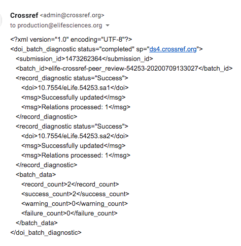
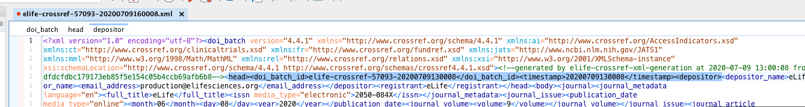
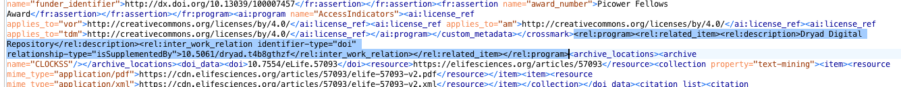

# Fixing Crossref/Dryad failures

## What is Crossref? 

Crossref is most commonly know for providing Digital Object Identifiers \(DOIs\) for research outputs making them easier to locate, cite, and more. DOIs allow the reader to follow a stable link straight to the content even when a website has changed. Each publisher will have their own ID in the DOI and this is followed by a slash and a string of numbers that are unique to the content. 

Here is an example of an eLife DOI: 10.7554/eLife.58603

At eLife, when an article is PoAed, the DOI is submitted automatically to Crossref and once processed, it will be registered with them. This is also triggered when a VOR article is ready for publication and sent to Continuum. If it has a date in the future ,say for press, the DOI will then be registered on the day of publication.  

## Crossref emails

Production receive Crossref emails for both PoA and VOR articles that are sent for publication on Continuum. 

These typically look like this: 

Each email needs to be checked to ensure there have been no failures. At the bottom of the email, you should look at the following section: 

If any failures are counted, you will need to check the email which will outline where the failure has occurred. 

In the case above, the DOI for the Dryad dataset was not live which has caused the failure. This is one of our most common failures.

## What to do when a failure occurs 

To correct the failure, you will need to follow these steps. 

* Go to the Crossref admin page: [**https://doi.crossref.org/servlet/useragent?func=showHome**](https://doi.crossref.org/servlet/useragent?func=showHome)\*\*\*\*
* Select ‘Submission administration’.
* Search with no restrictions, which will bring up the list of submissions processed by Crossref. Recent errors will be highlighted with a red ‘E’ symbol:

* Locate the article that has failed.
* Copy the file name.
* Right/ctrl click on the file icon to the right of the ID \(blue text\) and click ‘Save link as’.
* **Important note:** To prevent further failures, both the doi\_batch\_id elements and timestamp need to be edited as Crossref will reject any file that has the same batch id and timestamp as a previously submitted file. So to avoid this, you should edit the time on the doi\_batch\_id you will use as the file name to reflect the updated time you will change in the XML. In this instance, the doi\_batch\_id was changed to 'elife-crossref-57093-20200709160008.xml'.
* Now open the XML file using your XML editor, such as Oxygen.
* As mentioned above, the timestamp and doi\_batch\_id elements need to be updated so do this first. You will find these at the top of the XML. Change these to a future time, for best practice up to an hour ahead of when you are correcting this failure, so here we changed both to 'elife-crossref-57093-20200709160008'. 

* Once you have updated the timestamps, find the Dryad DOI that is causing the failure. You should check the original Crossref failure email for this information. This will be within a &lt;rel:related\_item&gt; element within a &lt;rel:program&gt; element:

* If there is only one &lt;rel:related\_item&gt;, you will need to select the entire &lt;rel:program&gt; element \(&lt;rel:program&gt; . . . &lt;/rel:program&gt;\) and delete it. You can often double click the &lt;rel:related\_item&gt; to highlight the entire string as above. 
* Alternatively, if there is more than one &lt;rel:related\_item&gt;, only delete the one that contains the problematic DOI \(&lt;rel:related\_item&gt; . . . &lt;/rel:related\_item&gt;\). 
* Now save the file.
* Pause for breath, you are doing well 🕺. 

Now navigate back to Crossref to complete the following: 

* Return to the admin page and select the 'Upload' tab.
* Select the edited XML file and click the 'upload' icon. 

* Go back to the admin page and search without restriction to bring up the whole queue again, it should now be at the top. Be aware that the old failure will still remain.
* Look out for the successful crossref email to come through. 

This has now been resolved. Unfortunately, this does mean that we will lose the Dryad information but at the moment, there is nothing we can do about this. 

