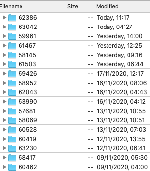
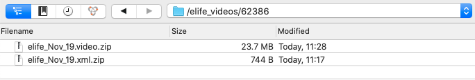
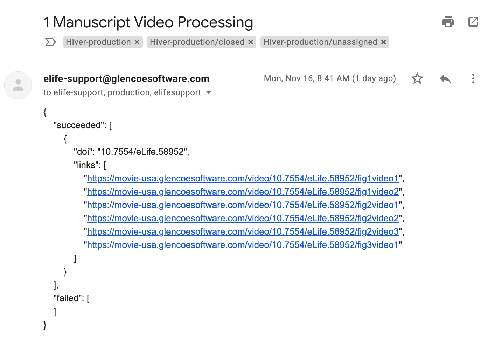

# Glencoe

Videos in eLife articles are hosted by Glencoe software Inc.

## When are videos supplied

Videos are uploaded to the Glencoe FTP once during the production process at pre-editing by Exeter. If there are any changes required to the videos during proofing, then this is done at post-author validation.

## How are videos supplied 

Exeter supply videos and metadata to the Glencoe FTP. This is an automated process, except in cases where the videos for an article are cumulatively large enough in file size, that they need to be manually uploaded.

Videos are added to a folder, the name of which is the tracking number for the respective article in the Glencoe FTP. 



Inside the folder two zips are placed \(this isn't actually a requirement from Glencoe, it could just be one zip, this is simply how Exeter have implemented it\). 



One zip contains all the videos files with a filename in the format `elife_{Month}_{day}_videos.zip`. The XML is provided in a second zip, with a filename in the format `elife_{Month}_{day}_xml.zip`.

The XML is a simple JATS file, which has a publication date of the upload date, and a `<media/>` element for each of the videos. See [**the example**](glencoe.md#example-of-xml) below.

## Troubleshooting video upload failures

Typically we don't receive notifications from Glencoe when video processing has failed \(although in some cases we may\). This is simply because the metadata or videos themselves have been provided in such a way that they cannot be processed to begin with. Glencoe only provide video transcoding error messages, so if the videos cannot be found \(due to problems with the way they are provided\), then there is no message indicating this from Glencoe. The only indication that something is not correct, is that there is no confirmation email at all.

If Exeter are unsure of the reason why videos have failed processing, they will contact the eLife production team.

Contact Fred in the eLife production team if you need access to the FTP.

Below is a checklist which outlines what the cause of the problem may be. But first, if you have [**BaseX**](../toolkit/basex.md) running locally, you can run the below XQuery on the zip files from the FTP in order to more quickly determine the cause of the problem. 



In order to run it, simply place the two zip files in a folder somewhere \(such as on your desktop\), and then in the query itself, change the following parameter so that it points to the location of that folder:

```markup
declare variable $folder := '/Users/fredatherden/Desktop/glencoe/';
```

### Checklist

* The zip files cannot contain directories. If needed, Mac users can check this using the following bash script \(in the command line\):

```text
unzip -l path-to-zipfile.zip
```

`path-to-zipfile` should be replaced with an actual path to the zip file \(including the zip filename - for example `unzip -l /Users/fredatherden/Desktop/elife_Nov_16.video.zip`\).

If there is a folder in the zip, this will be shown in the output of that command. Here is an example of a zip which contains a directory \(named `elife_Nov_16.video/`\):

```text
Archive:  /Users/fredatherden/Desktop/elife_Nov_16.video.zip
  Length      Date    Time    Name
---------  ---------- -----   ----
        0  11-17-2020 09:39   elife_Nov_16.video/
 10234324  11-16-2020 13:36   elife_Nov_16.video/elife-58952-fig1-video2.avi
 55439460  11-16-2020 13:36   elife_Nov_16.video/elife-58952-fig1-video1.avi
 55300596  11-16-2020 13:37   elife_Nov_16.video/elife-58952-fig3-video1.avi
  2290242  11-16-2020 13:36   elife_Nov_16.video/elife-58952-fig2-video2.avi
  2592582  11-16-2020 13:36   elife_Nov_16.video/elife-58952-fig2-video3.avi
 39843444  11-16-2020 13:36   elife_Nov_16.video/elife-58952-fig2-video1.avi
---------                     -------
165702153                     14 files
```

* The xml file must have the extension `.xml` \(case sensitive\).
* The xml file must be valid JATS \(archiving version 1.1\).
* The xml must contain a doi \(`<article-id pub-id-type="doi">...</article-id>`\).
* In the xml, the `<media>` element must have the following:
  * An id attribute, whose value is unique within the document.
  * An `xlink:href` attribute with the video filename. This must be the exact filename \(this is case sensitive\).
  * A `mimetype="video"` attribute.
* Video filenames must be unique for the entire journal. In other words, they need to contain the manuscript tracking number. 

If you have identified that any of these are the cause of the problem, then this should be fed back to Exeter so that they can correct the package and re-upload. 

If, after checking that all of these are correct, you are still unsure of the cause of video failures, then Glencoe should be contacted.

## After videos are supplied

After the videos have successfully been supplied, they are processed by Glencoe. This is quick and usually only takes a few seconds. Once the videos have been processed, production@elifesciences.org receive a video processing confirmation email from elife-support@glencoesoftware.com. Here is an example of one:



The videos can then be interacted with using Glencoe's API. For example https://movie-usa.glencoesoftware.com/metadata/{doi} \(where `{doi}` is replaced with an actual doi\) will return a JSON response containing information relating to all the videos uploaded for that article. Similarly individual videos can be found using the following convention http://movie-usa.glencoesoftware.com/video/{doi}/{video-id} \(where `{video-id}` is the value of the id attribute for the media element in the XML for the corresponding video\).

Here are some examples using 61467:

This http://movie-usa.glencoesoftware.com/video/10.7554/eLife.61467 returns the following JSON:

```javascript
{
    "video1": {
        "source_href": "http://static-movie-usa.glencoesoftware.com/source/10.7554/207/10505bff099f27841cf09b9e363b9f5650980b15/elife-61467-video1.mov",
        "doi": "",
        "flv_href": "http://static-movie-usa.glencoesoftware.com/flv/10.7554/207/10505bff099f27841cf09b9e363b9f5650980b15/elife-61467-video1.flv",
        "uuid": "6c956a13-dae8-46ed-a7b4-dff68b01903d",
        "title": "video1",
        "video_id": "video1",
        "solo_href": "http://movie-usa.glencoesoftware.com/video/10.7554/eLife.61467/video1",
        "height": 1398,
        "ogv_href": "http://static-movie-usa.glencoesoftware.com/ogv/10.7554/207/10505bff099f27841cf09b9e363b9f5650980b15/elife-61467-video1.ogv",
        "width": 2346,
        "legend": "",
        "href": "elife-61467-video1.mov",
        "webm_href": "http://static-movie-usa.glencoesoftware.com/webm/10.7554/207/10505bff099f27841cf09b9e363b9f5650980b15/elife-61467-video1.webm",
        "jpg_href": "http://static-movie-usa.glencoesoftware.com/jpg/10.7554/207/10505bff099f27841cf09b9e363b9f5650980b15/elife-61467-video1.jpg",
        "duration": 5.298984,
        "mp4_href": "http://static-movie-usa.glencoesoftware.com/mp4/10.7554/207/10505bff099f27841cf09b9e363b9f5650980b15/elife-61467-video1.mp4",
        "id": "",
        "size": 11645704
    }
}
```

Whereas this http://movie-usa.glencoesoftware.com/video/10.7554/eLife.61467/video1 returns a page containing the video for video 1.

Once the videos have been processed by Glencoe, Exeter then embed the links in Kriya, so that the videos are displayed for proofing.

## Why pub dates are included in the XML

Publication dates in the XML are used for the purposes of billing by Glencoe. eLife are billed on a quarterly basis, so the pub-date determines which quarter we will be billed for the videos. 

The publication date is included in the first upload, as the date of that upload \(not the publication date of the article, if there is one; see the [**example below**](glencoe.md#example-of-xml), the article's publication date is not the 16th November, that's just the date of upload\). This is so that the videos do not have to be resupplied later in the production workflow with the actual article publication date. 

We previously used to provide Glencoe the videos/metadata without the publication dates at the start of the workflow, and then resupply the metadata at the end of the workflow with the actual article publication date. However, this caused a race condition between video processing and Continuum \(which checks for the presence of videos using Glencoe's API\), and in cases where Continuum won the race, the article would fail ingestion, and in some cases remain stuck as unpublishable until developers could manually fix the problem.

Providing publication dates at the start of the workflow resolves this race condition, but it does come with a caveat - if the number of videos in an article are changed during proofing \(added or removed\), and these uploads occur either side of a quarterly billing cycle, then we are either under-, or over-paying for videos. The likelihood of this occurrence, however, is very rare.

Any subsequent uploads should contain the same publication date as the the first upload \(again, the publication date is actually the first upload date\), however if it contained a separate date it would not matter, since only the first date provided is used by Glencoe for billing. 

## Example of XML

Here is an example of an XML that was uploaded on the 16th of November 2020.

```markup
<?xml version="1.0" encoding="UTF-8"?>
<!DOCTYPE article PUBLIC "-//NLM//DTD JATS (Z39.96) Journal Archiving and Interchange DTD v1.1d1 20130915//EN" "JATS-archivearticle1.dtd">
<article xmlns:mml="http://www.w3.org/1998/Math/MathML" xmlns:xlink="http://www.w3.org/1999/xlink" article-type="research-article" dtd-version="1.1d1">
    <front>
        <journal-meta>
            <journal-id journal-id-type="nlm-ta">elife</journal-id>
            <journal-id journal-id-type="publisher-id">eLife</journal-id>
            <journal-title-group>
                <journal-title>eLife</journal-title>
            </journal-title-group>
           <publisher>
                <publisher-name>eLife Sciences Publications, Ltd</publisher-name>
            </publisher></journal-meta>
        <article-meta>
            <article-id pub-id-type="publisher-id">58952</article-id>
            <article-id pub-id-type="doi">10.7554/eLife.58952</article-id>
			<pub-date date-type="publication" publication-format="electronic">
				<day>16</day>
				<month>11</month>
				<year>2020</year>
			</pub-date>
        </article-meta>
            </front>
    <body>
    <media content-type="glencoe play-in-place height-250 width-310" mime-subtype="avi" mimetype="video" xlink:href="elife-58952-fig1-video1.avi" id="fig1video1"/>
        <media content-type="glencoe play-in-place height-250 width-310" mime-subtype="avi" mimetype="video" xlink:href="elife-58952-fig1-video2.avi" id="fig1video2"/>
        <media content-type="glencoe play-in-place height-250 width-310" mime-subtype="avi" mimetype="video" xlink:href="elife-58952-fig2-video1.avi" id="fig2video1"/>
        <media content-type="glencoe play-in-place height-250 width-310" mime-subtype="avi" mimetype="video" xlink:href="elife-58952-fig2-video2.avi" id="fig2video2"/>
        <media content-type="glencoe play-in-place height-250 width-310" mime-subtype="avi" mimetype="video" xlink:href="elife-58952-fig2-video3.avi" id="fig2video3"/>
        <media content-type="glencoe play-in-place height-250 width-310" mime-subtype="avi" mimetype="video" xlink:href="elife-58952-fig3-video1.avi" id="fig3video1"/>
    </body>
</article>
```

