# Publish on accept

## What is **Publish on Accept (PoA)?**

When authors resubmit their articles after making revisions following peer review, they are given the option to choose to ‘publish on acceptance’. This means that once their article has been accepted, eLife will publish the accepted version of their submission on before beginning the full production process.

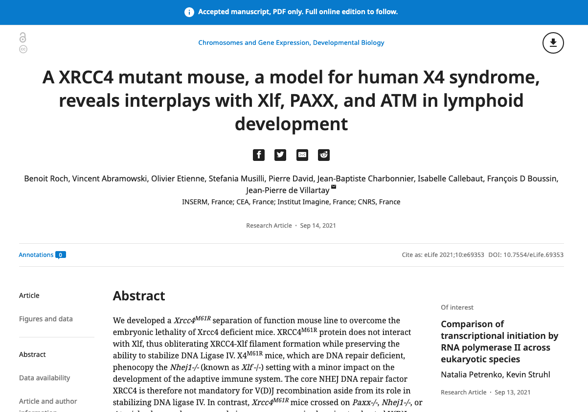

A PoA article consists of a downloadable PDF containing the accepted article text and figures, a ZIP package containing any supplementary material, and a webpage showing the article title, author list, abstract, and a stripped-down selection of metadata (one affiliation per author, funding, data availability, competing interests). For the purposes of the scientific record, this counts as the official publication of the article, allowing authors to get their work out earlier than would be possible if they waited for the final typeset version. This can be particularly important where the authors anticipate related or competing works to appear imminently, or who are publishing work in a rapidly changing field.

Prior to publication of an article where the authors have chosen the PoA option, a set of checks must be carried out to ensure the quality of the submitted materials and metadata are suitable for release. This page will detail those checks and provide general information on the PoA process.

## **PoA timing**

PoA articles are exported from the submission system, processed, and delivered to the journal website at set times each day. Currently the timing is as follows:

| Time                       | Event                                                                                                                                                    |
| -------------------------- | -------------------------------------------------------------------------------------------------------------------------------------------------------- |
| 10 minutes past each hour  | Article files (PDF, supplementary materials) and metadata are exported from the submission system                                                        |
| 20 minutes past each hour  | Processing of the PoA articles begins. This is carried out by the 'eLife bot', an automated process hosted on eLife's Amazon Web Service (AWS) instance. |
| 10:00, 12:00, 14:00, 16:00 | Processed article packages are delivered to the publication platform, Continuum.                                                                         |

Files can be edited in the bucket elife-poa-packaging until delivery to Continuum is completed.


It is vital that checks on new PoA content are completed and the articles sent for publication **BEFORE 11:00AM UK TIME** each day. The submission system runs on an hourly export cycle at nine minutes past the hour and the eLife PoA processing runs daily at 11:30M, so any PoA content not sent out by 11:09AM will not be processed.

PoA content can be sent at any time before 11:00AM and will appear in that day’s delivery to the Continuum publishing platform. Any content sent after 11:09AM will not appear on Continuum until the following day.

|                                                          |                                                                                                                                                                                                                                                                                                                                                              |
| -------------------------------------------------------- | ------------------------------------------------------------------------------------------------------------------------------------------------------------------------------------------------------------------------------------------------------------------------------------------------------------------------------------------------------------ |
| <p><strong>11:00</strong></p><p><strong>BST</strong></p> | Deadline for PoA approval on EJP. All PoA articles must be exported by this point. Any metadata updated in eJP after this point will not be up to date in the files used to generate the content for the website. Any manuscripts that miss this deadline should not be approved until after 12.30, so they will be picked up for the following day’s batch. |
| **11:09 BST**                                            | eJP exports new CSV files built from SQL queries hourly into the AWS folder “elife-ejp-ftp”. CSV files are created from the PoA SQL queries, which extract metadata from eJP database (author/manuscript info, abstract, title, ethics statement, license info etc, ie the information input into the submission screens).                                   |
| **11:09 BST**                                            | eJP automatically transfers files approved for PoA to the AWS bucket “elife-ejp-poa-delivery” as zipped packages.                                                                                                                                                                                                                                            |
| **11:30 BST**                                            | eLife bot discovers the new files in “elife-ejp-poa-delivery”.                                                                                                                                                                                                                                                                                               |
| **11:45 BST**                                            | New files are processed by the PoA Packaging system and the results sent to the outbox in “elife-poa-packaging”.                                                                                                                                                                                                                                             |
| **11:50 BST**                                            | Email notifications for workflow success/failures are sent to the Production account, copied to Editorial Office.                                                                                                                                                                                                                                            |
| **12:30 BST**                                            | PoA files are packaged and moved to the Continuum delivery bucket. Prior to this point, any of the files in the outbox are available to be replaced or deleted. As part of packaging the files for delivery to Continuum, the current date will be added to the XML as the published date UNLESS a published date already exists in the XML.                 |
| **12:35 BST**                                            | Email notification of completed and delivered PublishPoA workflows sent.                                                                                                                                                                                                                                                                                     |
| **13:00 BST**                                            | PoA content should ideally be published by this point, via the dashboard on Continuum.                                                                                                                                                                                                                                                                       |

**Accessing ‘PoA = yes’ articles in the submission system**.png>)

All active articles in the submission system are grouped into different stages, represented by folders on the main tasks screen. The Post Acceptance Check folder contains all articles that have been recently accepted where the authors have ticked ‘yes’ to the Publish on Accept option.

Any article that is ‘PoA=no’ will instead go automatically into the ‘Manuscripts to Send’ folder within the Export System. This is also where ‘PoA=yes’ articles go once they have been sent for PoA publication. The number of articles in each folder is visible on the tasks screen.

Once an article has been exported to the vendor for production processing, it will no longer appear in a folder. At this point, articles can be retrieved using the Find Manuscript option, which allows a user to search for any article using the five digit manuscript number. This can also be used at any time to quickly retrieve an article. Please note, however, that the search will return all versions of an article with the given manuscript number, so be careful to select the version that has been accepted when doing production work.

.png>)

**Article summary screen**

On accessing an article in the submission system, the user will be presented with a summary screen showing the article details and the files that have been uploaded for the submission. For an article at the Post Acceptance Check stage, prior to being sent for PoA, this will look like this:

.png>)

This, therefore, will be the typical view seen by any user conducting the PoA checks on an article.

Before conducting checks on the files and metadata, the following checks must be completed.

**Sticky notes**

Sticky notes contain important information relevant to the paper. They are given different colours based on who will be using them (yellow, green, grey etc)..png>)

Red sticky notes notes labelled "FAO Sue" contain requests to hold POA or Export if there are outstanding issues to resolve first. Red sticky notes labelled "FAO Staff - hold" indicate a member of the eLife Editorial team is dealing with an ongoing issue - this is generally used when minor issues are being resolved in parallel with the final review.

If a red sticky note indicates that the article has been submitted alongside another article (e.g ‘Co-submission’, ‘Hold for related article’ etc.), we will need to check the status of the related article and query Editorial on whether the two (or more) articles should be published together (or even PoA’d).

Red sticky notes marked ‘FAO: Production’ or similar can be left since they will be dealt with later in the process.

Any red notes will be exported alongside the article for typesetting, so if an issue is resolved before export, please change the note to green so that it does not get passed along.

**Article revision number**

The full submission number is given at the top left of the summary screen.

.png>)

The article number (the last five digests) will usually be followed by an ‘R’ number, indicating the current revision of the submission (R1, R2 etc.). If this number is NOT present, e.g. the article number reads, for example, just 04-10-2014-SR-eLife-05048, this means the article has been accepted outright after peer review **without any revisions**. In these cases, the article will have automatically been put through as ‘**PoA = yes**’ without the authors actually having been asked if they want to publish on acceptance.

It will also mean that the authors will not have been asked to upload the individual source files for their submission, likely meaning that the article files will consist of a single merged PDF document containing all the text, figures and figure supplements.

In cases such as this, **DO NOT PROCEED WITH POA**. Instead, complete the revision checks and use the template email “Acceptance at full submission/accepted appeals: list of changes needed” to contact the author (includes the PoA question). Message editorial and production teams via the publish-on-accept channel on slack to let them know.

If the author does not want to PoA, push to export queue (see below for instructions on how to change the PoA status of an article at Post Acceptance Check).

**Appeals**

If an article has been accepted after an appeal against a rejection (e.g 01-12-2015-SR-eLife-13450R1-**Appeal**), it similarly may not have gone through Editorial’s revised submission checks. Process as above.

**Acceptance letter**

The acceptance letter can be accessed by clicking on the decision statement in the bar at the top of the article summary page:

.png>)

This should be checked for any additional comments the editor and reviewers might have raised in their decision. These will most likely be placed in the **first or second paragraphs, or in a summary of the reviewers’ comments at the end of the letter.** If any requests for changes have been made, the author will need to be contacted by email using the template ‘Publication: Potential revisions’, available under the ‘Send Manuscript Correspondence with Template’ option. This email will ask the authors whether they would like to make the changes now, prior to PoA publication, or whether they are happy to leave the edits until they are proofing the final version of their article.

The article should then be placed on hold until the authors respond. Be aware that the authors may use this opportunity to address other issues in their submission. Changes at this stage outside of requested edits should be minor - any major rewrites should be brought to the attention of the production and editorial teams via the publish-on-accept Slack channel.

**Merged PDF**

****.png>)

The next step is to download the merged PDF file containing the authors’ article text, figures and figure supplements. This is the second item in the ‘Manuscript Items’ list.

This merged PDF - excepting the system-generated cover page - is what will be published as the PoA version of the article. A brief quality check is therefore required to make sure there are no major issues. These checks are detailed below in the sections referring to the individual files.

Please note the size of the merged PDF. If this is particularly large (e.g. exceeding 150MB) it may cause readers problems when they try to download it. Please ask the author for a smaller merged PDF or remove the figure supplements from the merge to achieve a smaller size (see below; the figure supplements will be available in the figure/data zip package so this will not cause an issue).

**Submission files**

The files submitted by the authors also need to undergo checks for content and quality (see below). Files can be downloaded from the summary screen and updated by returning to ‘Upload files’ section in the submission editor (click on ‘Files’ or return to the ‘Modify Manuscript Files’ option).

.png>)

.png>)

This gives access to the ‘Upload Files’ page (step 1 for article submission) allowing users to upload new files, replace existing files and alter the file type, description and order.

**Article file**

1. **Format**

The article can be in .doc, .docx, .tex or .pdf format for PoA. However, for export to the content processor, we will need an editable version of the file (.doc, .docx, .tex), so if the file is a PDF, please check whether the authors have included the editable version as a ‘related article file’.

In cases where the author has done this, the editable file will need to be swapped in as the main article file following PoA, before the article is exported to the typesetters.

If no editable article file has been provided, please contact the author to request this. We cannot process the article without an editable article file.

1. **Order**

The article file must come before the figure files on the file list on the submission system, as this is important for the generation of the merged PDF.

1. **Tracked changes**

If tracked changes are visible in the merged PDF, these must be accepted prior to PoA publication. Download the article file and accept the changes, then replace the file on the system. Make sure that when accepting the tracked changes, the ‘tracked change’ option in Word is first turned off otherwise the Merged PDF will still show tracked changes.

.png>)

**Image files**

1. **Quality**

The figures and figure supplements appear at the end of the merged PDF. They should be checked to ensure that they are of a reasonable quality. Please note that the system will usually downsample the images slightly so that some pixelation is likely, but if the figures show at a particularly low resolution, please check the source files. If these are also poor quality, please ask the authors to provide higher resolution versions before proceeding with PoA.

1. **Figures in text**

Occasionally, the authors will include copies of their figures throughout the main text, meaning they will be duplicated in the merged PDF. If the images throughout the text are good quality, please switch off the option to include the figures in the merged PDF and regenerate it.

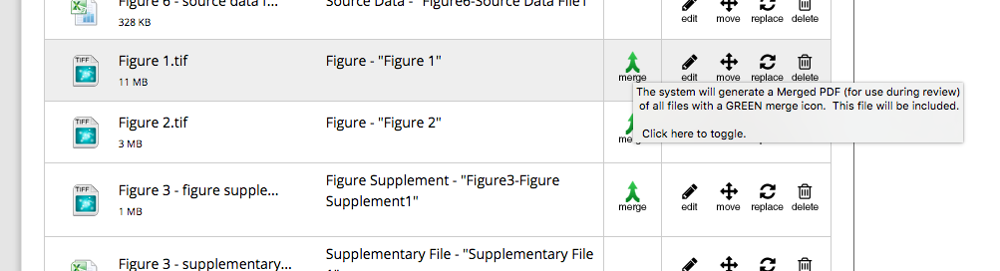

Click the green ‘merge’ option to unselect it.

.png>)

Repeat for all the figure files and then click ‘next’ to save the change and trigger the regeneration of the PDF.

If the images inline with the text in the article file are very low quality, please download the file and remove them, then replace it on the system.

**Videos**

Video files do not need to be checked for playability at this stage but the size of the file should be noted. If the videos are especially large (e.g. 100MB+) this may cause problems with the generation of the PoA files (see below) and with the production process. Articles with such large videos should therefore be flagged to the Production team on the publish-on-accept Slack channel.

If the videos are showing as 0KB, it means they have not uploaded properly. Again, please alert Production if this is the case.

**Source data files**

Source data files will usually be associated with main figures or tables, but can exist as associated with the paper as a whole. This will be indicated in the label and likely in the file name as well.

.png>)

Please correct major spelling errors if spotted (e.g. Table1—sourse data 1) as this may cause problems in generating the PoA files.

If the source data is not associated with a main figure in the system, please ensure the label follows the eLife naming convention - it should be “Source data 1”, not just “Source data file”; again, this is to ensure the files generate correctly.

If it is unclear whether the source data is associated with a figure or not, please check the legends provided in the article text.

**Source code files**

These follow the same pattern as Source code. It is slightly more likely that authors may label these files incorrectly. For example, they may use the name of the file (e.g python_code.py). Again, this must be changed to Source code 1, Source code 2 and so on.

**Supplementary files**

Again, if the file has been labelled against eLife convention (Supplementary file 1, Supplementary file 2 etc), this must be corrected before PoA using the legends in the article text as a guide.

**Related article files**

1. **Editable article files**

If the article is a LaTex submission, the authors may have uploaded a PDF as their article file and included the editable .tex file as a related article file. This is fine for PoA but before export, please switch them over.

1. **PDF for PoA publication**

A check must be made for any Related Manuscript File that is described as being ‘merged PDF for PoA’ or ‘authors’ file for accepted publication’ or a similar phrase. This will be a version of the article that the authors have provided in anticipation of PoA and it must be this file, rather than the standard Merged PDF that should be used for PoA publication. This merged PDF on the system should be replaced on the system using the option at the stop of the files page.

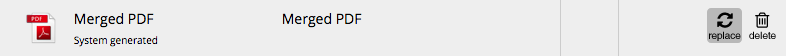

PLEASE NOTE: if any changes are requested from the authors and they have included either of the above related article files on the system, the authors must be asked to provide new versions of these files as well.

**Metadata**

**Generic note: no double quote marks are allowed in the metadata due to issues they cause during XML generation. Double quotes must therefore be changed to single quotes.**

To begin checking the metadata within the submission system, click next to move on from the ‘Files’ page to the ‘Title’ page.

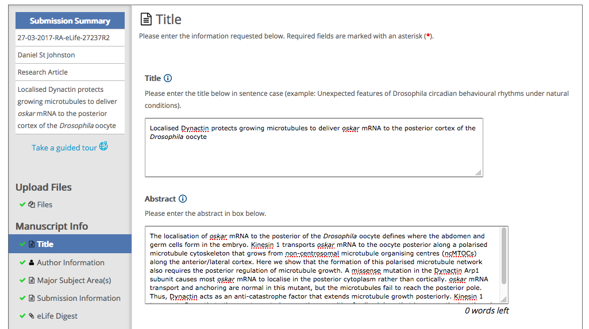

**Title**

1. **Title**

The title on the submission system must be compared against the title given in the article file. As the title is entered manually into the submission system, it is possible that typographical errors may have been introduced. Check for the following:

* Spelling errors - the spelling in the article file should be favoured.
* Missing formatting - formatting present in the article file should be replicated on the system using the appropriate tagging (italics, subscript and superscript are all allowed; bold and underlining are not).
* Double spacing - this should be changed to single spacing.
* Line breaks - make sure there are no line breaks in the title. For example:

“SMC condensin entraps chromosomal DNA by an

ATP hydrolysis dependent loading mechanism in Bacillus subtilis”

should be changed to

“SMC condensin entraps chromosomal DNA by an ATP hydrolysis dependent loading mechanism in _Bacillus subtilis_”

* Case - titles for eLife articles should be in sentence case (not ALL CAPITALS or Title Case (unless eg proper nouns). Prior to PoA, this should be corrected in the submission system but the article file does not need to be updated.

1. **Abstract**

Copy the abstract with formatting from the Word file (or merged PDF for LaTex file - and remove line breaks).

If an article is a **Clinical trial**, the abstract will be structured with headings and additional details at the end (Clinical trial info and funding). All of this must be retained for publication. Clinical trial status will usually be indicated with a sticky note.

The impact statement does not need to be checked. Use the ‘Next’ button to save any changes and move to the next screen.

**Author information**

1. **Author list**

The following needs to be checked:

* Author first name, middle name(s) or initials and surname should all match the article file. Spelling/special characters should be updated in the system if they do not match the article file and any missing initials should be added. The exception to this is if the article file only lists first initials for all authors. eLife style favours full first names.
* Any full stops after author initials should be removed as this is against eLife style.
* The suffix field is reserved for numerals (I, II, III etc) and junior (Jr) and senior (Sr) indicators. Academic letters (PhD, MD etc) should be removed from this field. If it is unclear what a particular suffix means, query it with eLife Production.
* Author order must match the article file. This is **extremely important** as it may cause disputes between the authors and require an official correction if the authorship order is published incorrectly. Author order is designated in the ‘Author #’ column and can be altered by ‘drag and drop’ (click to the immediate right of the ‘Author #’ boxes to move the author block).
* If any authors listed in the article file are not present in the submission system, or any authors on the system are missing from the article file, this must be queried with the author). **Hold the article until this has been resolved.**
* One corresponding author will be indicated using the **tick box** between the author number and name. This designates the primary corresponding author/corresponding author for proofs. Any additional corresponding authors should be indicated using the **‘co-corresponding author’ tick box** within the author details. All authors indicated as corresponding authors on the article cover page must be designated on the system using either the main corresponding author tick box or the co-corresponding author tick box..png>)
* The email address for the corresponding author(s) should match that provided in the article file. If it does not, query the author (they may have used a personal account on the system but want to use an institutional account for correspondence from readers).
* Each author should have ‘author contributions’. These are checked prior to PoA, so no edits should be required to this section. However, please alert Editorial and Production if no contributions are present.

1. **Author affiliations**

No need to check.

1. **Competing interests**

No need to check.

1. **Group authors**

Any group authors mentioned in the author’s article file must be included on the submission system prior to PoA, if not already present in the author information.

The order of the group author(s) is indicated by selecting from a drop-down menu. Ensure that the group author is placed in the correct sequence with the other authors as per the article file’s author list. Any competing interests listed for the group author(s) present in the article file but not on the system should be added prior to PoA publication.

For every group author, check whether a list of the members of that group is given in the article file. Ideally, this list should give the full name of each member and their affiliation. If this list is not present, check whether it has been provided as a separate file and alert Production via slack.

If the phrase ‘**on behalf of**’ is present in the author’s article file followed by the name of a group author or consortium, Production must be alerted prior to PoA so that they can update the XML manually.

\<on-behalf-of> tagging must be added to the XML rather than the standard group authorship tagging. It should be placed after the authors and before the affiliations in the \<contrib-group>. This must be done while the article is in the elife-poa-packaging/outbox folder (see below):

```markup
<contrib-group>
<contrib contrib-type="author" id="author-165641">
<name><surname>Xiong</surname><given-names>Ziyi</given-names></name>
<xref ref-type="aff" rid="aff1">1</xref>
<xref ref-type="other" rid="par-19"/>
<xref ref-type="fn" rid="conf1"/>
</contrib>
<contrib contrib-type="author" corresp="yes" id="author-20004">
<name><surname>Kay</surname><given-names>Jon</given-names></name>
<xref ref-type="aff" rid="aff1">1</xref>
<xref ref-type="corresp" rid="cor2">*</xref>
<xref ref-type="other" rid="par-1"/>
<xref ref-type="fn" rid="conf1"/>
</contrib>
<on-behalf-of>on behalf of the International Visible Trait Genetics (VisiGen) Consortium</on-behalf-of>
<aff id="aff1"><institution content-type="dept">Department of Genetic Identification</institution>, <institution>Erasmus MC University Medical Center</institution>, <addr-line><named-content content-type="city">Rotterdam</named-content></addr-line>, <country>Netherlands</country></aff>
. . .
 </contrib-group>
```

**Major subject area(s)**

1. **Major subject areas(s)**

One or more of these will have been selected by the author. Does not need to be checked.

1. **Research organisms(s)**

One or more of these will have been selected by the author. Does not need to be checked.

1. **Keywords/other research organism**

The author can add up to six keywords and/or free-text research organisms. Make sure that these are all in lower cases, excepting proper nouns (e.g. Parkinson's disease) and species names (_S. cerevisiae_).

**Submission information**

1. **Permissions**

Authors may sometimes adapt or reproduce figures from other works as part of their figures. If they exactly reproduce images from previously published works not covered by an open access license or free of copyright, they will need permission to do so.

During submission, the authors are asked to indicate if they have reused previously published images. At full and revised submission QC, possible cases where images require permissions will be flagged to Editorial using turquoise sticky notes. If permissions are required, the Editorial team will follow up with the authors for full details and add a red sticky note instructing Production/content processors that further action is required.

The following details are required for adding a permissions statement for a reproduced image:

* Affected figure (e.g. Figure 1)
* Copyright year (e.g. 2009)
* Copyright holder (e.g. Elsevier)
* Permissions statement (e.g. ‘Panel A is reprinted from Simonetta, et al, 2009, with permission from Elsevier. It is not covered by the CC-BY 4.0 licence and further reproduction of this panel would need permission from the copyright holder.’

Please make sure that this information is present in the red sticky note and that there are no outstanding turquoise notes pending Editorial approval.

1. **Funding**

No need to check.

1. **Datasets**

There are two parts to the datasets section, **Generated datasets** and **Previously published datasets**. The authors are asked to provide details of any major datasets that have been generated as part of their work and any previously published major datasets they have used in that work. They can include one or both of these types of dataset and the checks on them are largely the same.

The following fields should be completed for each dataset: **Author(s)**, **Year**, **Dataset Title**, **Direct URL to the Dataset** and **Accessibility Information** or **Accession No**.

.png>)

The following should be checked:

* If any of the information described above is completely missing, the authors should be queried to provide the missing details, UNLESS a working direct URL is present and the information can be taken directly from the dataset (e.g. GEO datasets such as [http://www.ncbi.nlm.nih.gov/geo/query/acc.cgi?acc=GSE14308](http://www.ncbi.nlm.nih.gov/geo/query/acc.cgi?acc=GSE14308) list the full author list, year and title on the summary page)
* All provided URLs must be functional and the data must be publicly available. For any URLs that return ‘this data is not public’ or ‘not found’ pages, the author must be asked to make the data public (you can proceed once the author has agreed to make the data publicly available).
* If the URL redirects to some form of login page, please alert Production.
* Any URL provided must be a **direct link** to the dataset being cited. Links to the database are not specific enough. If an accession number is provided, it may be possible to derive the specific URL. Please see the [Common Changes guide](https://docs.google.com/document/d/1iKUW353vySZd8lqkW_d7W7Ys21BpEWLXvOCYe62Ei5c/edit#bookmark=id.ebet0mx8eux1) for common dataset URL structures.
* If a review link is given for a dataset, this must be updated to the final URL. Review links can usually be identified because they contain ‘token’ or ‘review(er)’. Again, see the [Common Changes guide](https://docs.google.com/document/d/1iKUW353vySZd8lqkW_d7W7Ys21BpEWLXvOCYe62Ei5c/edit#bookmark=id.ebet0mx8eux1) for examples common review URL structures.
* For Dryad and figshare datasets, a DOI link should be given as the URL rather than the direct URL for the dataset (e.g. [http://dx.doi.org/10.5061/dryad.50410](http://dx.doi.org/10.5061/dryad.50410)). If the author has just provided the DOI itself (e.g. DOI: 10.5061/dryad.50410) this needs to be updated to a URL in the above style.
* When checking that the URL provided works and gives access to a publicly available dataset, check that the title on the resulting page matches the title given in the system. Alert Production if this is not the case.
* For all publicly available datasets with an accession number, the Accessibility information should take the form ‘Publicly available at XXXX (accession no. XXXXX)’. This should be updated if the authors have only provided the accession number or the database name in this field. The accession number can be derived from most dataset URLs.
* For all publicly available datasets without an accession number, the Accessibility information should take the form ‘Publicly available at XXXX (http://XXXXX)’ where the bracketed term is the URL for the database homepage.
* EXCEPTION: Dryad datasets always have the following accessibility statement: ‘Available at Dryad Digital Repository under a CC0 Public Domain Dedication’

1. **Ethics**

If exists, remove any double quotes if present

**eLife Digest**

This page can be ignored, no checks are required.

**Publish on Accept**

This page contains the question the authors are asked concerning PoA. If the article is in the Post Acceptance Check, it will have been answered ‘yes’. This screen can be used to change the PoA status is required.

**Author Suggestions**

This page can be ignored, no checks are required.

**Publication Fee**

This page can be ignored, no checks are required.

**Licensing**

This MUST be completed. Alert Editorial via the publish-on-accept slack channel immediately if it is not. A completed example is shown below. Clicking on ‘Edit’ brings up the specific license that has been completed.

.png>)

There are two options: **CCBY 4.0 Creative Commons license** and **CC0 1.0 Public Domain Dedication**. If any of the authors are affiliated with an American government organisation (e.g. the US Department of Energy or the National Institutes of Health), they MUST use the CC0 license.

**Exporting PoA articles**

Once the article is ready to send for PoA publication, click ‘Post Acceptance Checklist’ under ‘Manuscript Workflow Tasks.

.png>)

This will bring up the following screen. Click ‘View Checklist’ then, ensuring that ‘Yes’ is selected, click ‘Save Changes’.

.png>)

Once this is done, the ‘Post Acceptance Check Completed’ button will appear. Click this to export the article into the PoA workflow.

.png>)

The article will sit waiting for export until the next allotted export slot. These take place every nine past the hour, every hour, each day and will deliver any articles sent for PoA to the “elife-ejp-poa-delivery” bucket hosted on the Amazon Web Service (AWS). Any changes made to the files between approval for export and the actual export should be reflected in the package that is sent to the AWS.

Once an article has been sent for PoA, it will be moved to the ‘Manuscripts to Send’ folder within the Export system.

**Removing articles from the Post Acceptance queue without export**

If an article ever needs to be removed from the post acceptance check queue without being sent for PoA, the same process as above should be followed but select the ‘No’ radio button viewing the checklist. On saving and clicking ‘Post Acceptance Check Completed’, the article will be moved directly to the ‘Manuscripts to Send’ folder without being queued for export.

In cases where this is being done because an author has decided not to PoA their article after all, the ‘Previous Interactions’ screen in the Submission Information should then be updated to ‘PoA=no’.

**PoA post-export process**

Once daily, the submission system will automatically export PoA articles to the AWS bucket “elife-ejp-poa-delivery”. Hourly, the submission system will also export CSV files containing the results of SQL queries on the database holding the metadata for all submitted eLife articles. These are sent to the AWS folder “elife-ejp-ftp”.

At the moment, the deadline for PoA export is set at 11:00 BST. At 11:09 each day, the above exports will take place and the files sent at this point will be used for PoA generation.

**Packaging**

At 11:30 BST, the eLife Bot will look for files sent to “elife-ejp-poa-delivery”. If it finds them, it will use these files and the CSV output in “elife-ejp-ftp to generate the following files and place them in the folder “elife-poa-packaging”:

* **Merged PDF** - this is the merged PDF from the submission system containing **Article Files** and **Figures** but crucially with the auto-generated cover page removed.
* **Article XML** **file** - this is generated from the CSV output files containing the article metadata and is required for web display of the PoA article. Unlike the final article XML produced during typesetting, it contains only the metadata (author names, affiliations, received/acceptance date, abstract, keywords, funding, datasets). The published date is NOT added on initial generation and is only automatically added when the files are supplied to Continuum.
* **Data Supplement (DS) file** - a compressed folder containing any figure supplements, data supplements, source data, source code, videos or supplementary files accompanying the submission. If a submission has none of these files, no DS file will be produced.

**Success and failures**

At 11:50 BST, the eLife Bot will send a message out to state whether it has succeeded or failed in generating these files from the raw files. This basic message will state the article DOI and which processes have run successfully (True) or not (False). It also lists the raw output file that has been processed from the elife-ejp-poa-delivery bucket (‘document’). The subject line will state either "Success!" or "FAILED" depending on whether all the process statuses are ‘true’ or not.

.png>)

Success notices can just be filed. There are two main types of failures, listed below.

* **Decapitation failure:** The eLife Bot removes the submission system-generated cover page by ‘decapitating’ the merged PDF - it works out how many pages the cover page occupies and then removes them. A small percentage of decapitations fail because the Bot cannot determine the end of the cover page. When this happens, the PDF will not generate.

.png>)

To fix this, Production staff will need to download the merged PDF from the submission system and manually remove the cover page. This can be done by opening the file in Mac Preview, going to the Contact Sheet view and simply deleting the cover page(s):

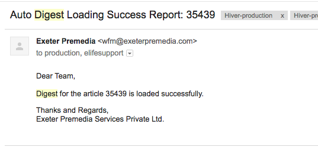

Once this has been done, rename the file to decap_elife_poa_eXXXXX.pdf (where XXXXX is the article number) and upload it into the elife-poa-packaging/outbox folder.

* **XML generation failure:** When this happens, the problems will usually be because something is missing from the CSV output (e.g. Editor name) or because the Bot has encountered something in the CSV file it cannot process (e.g. an unusual character). If the problem is not immediately obvious from examining the article metadata, contact Graham Nott ([gnott@starglobal.ca](mailto:gnott@starglobal.ca)). An XML generation failure will mean that it is unlikely the article can be PoAed on the day of the failure. It will need to be re-exported once the issue has been fixed (see below).

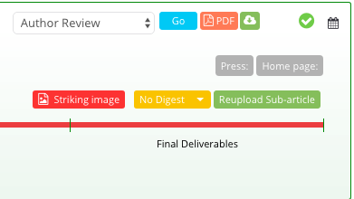

**Manually editing generated PoA files**

Between 12:00 BST and 12:30 BST, the PoA article files are available in the elife-poa-packaging outbox to be replaced or deleted as necessary. If a PoA article is put on hold after it has been exported, for example, staff can go into the outbox and delete the corresponding files for that article before it can be sent on to Continuum. Similarly, if there is a decapitation failure (see above), the article PDF can be downloaded, modified and reuploaded.

.png>)

If an article requires on behalf of tagging, this will need to be added at this stage. Download the XML and make the necessary edits (see PoA articles with ‘on behalf of’ tagging).

Please note: as there is only half an hour available for this kind of editing, be aware of any exceptionally large article files (particularly Data Supplements). These can sometimes take longer than half an hour to download and replace, so may need to be edited once the article is on Continuum (see [PoA version 2+](broken-reference) process, below).

After 12:30, the eLife Bot will begin packaging up the the PoA files and delivering them to Continuum. No further edits can be made to them after this point and they will be removed from the outbox as they are sent.

The PoA article packages will be moved to Continuum delivery bucket (elife-production-final) and will copy them to the packaging archive (elife-poa-packaging/published, contains folders for each day).

**Publishing PoA articles**

Once an article has been processed into Continuum, it will be available to check on the Production staging site, [https://prod.elifesciences.org](https://prod.elifesciences.org). On the [publishing dashboard](https://prod--ppp-dash.elifesciences.org/current), PoA articles are indicated by the label on the left.

.png>)

As with fully typeset articles, users logged into the staging site can preview PoA articles using the right-hand buttons. The chief visual different on first viewing the article is that PoA content only shows the author list and abstract online, with no body text.

.png>)

Check that the abstract is displaying correctly - it is possible that XML conversion errors may break certain characters or introduced bugs, so make sure that special characters like degrees signs, Greek letters and maths expressions are all showing up without issue. Download the article PDF from the top right-hand corner and check that this opens correctly, that there are no conversion errors and that the figures at the end show up correctly.

Quickly scan the roll-over boxes that show up when the cursor is hovered over the author names to ensure that the author affiliations and any competing interests are displaying correctly. Once this is done, scroll down and open the ‘Article and author information’ section to check that the funding information is being displayed correctly.

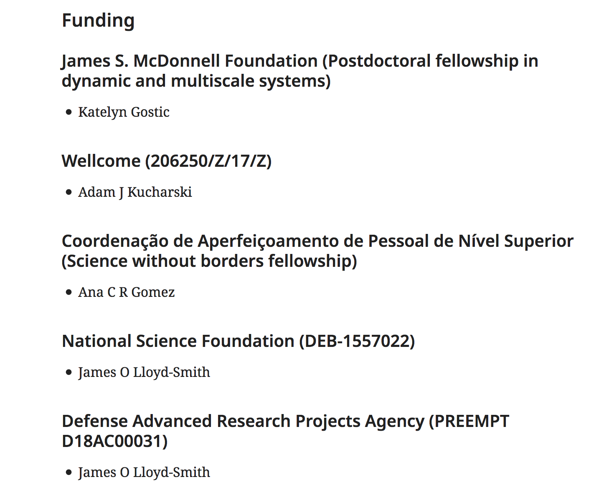

Move to the ‘Figures and data’ tab. This will display the major datasets section and the download link for the supplementary files zipped folder. This should be downloaded and unzipped to ensure that none of the files within have become corrupted during preparation.

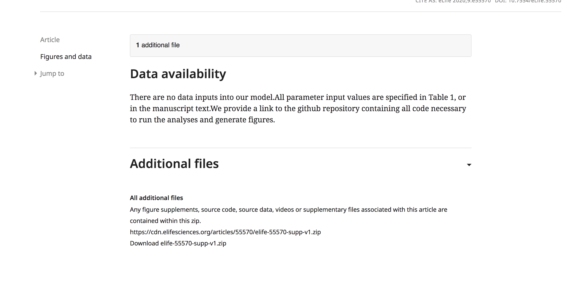

Once the article has been checked and is ready to publish, return to the dashboard and hit ‘Publish Now’. A box will pop up asking for confirmation; once this is OKed, the article will be queued for publication then published in about ten-twenty seconds.

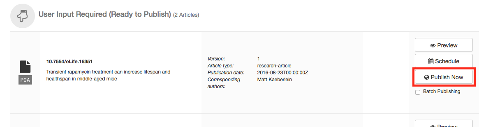

It may take a few minutes for the article to show up online on the front page. PoA articles will show without any impact statement under the title.

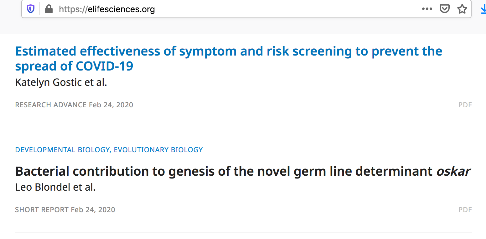

**Re-exporting PoA articles**

If it is necessary to send an article again for PoA, either because the XML failed to generate or because it was put on hold after being exported, the article will need to be re-exported**.**

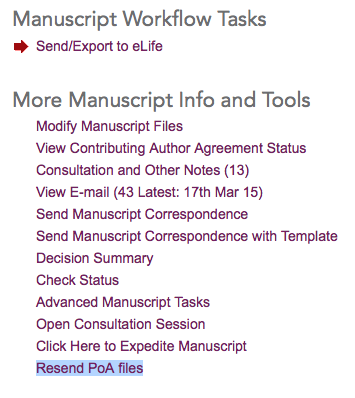

Once any necessary edits have been made to the article files and metadata, go to the Tasks tab and select the ‘Resend PoA files’ button. This will bring up a list of the files to be resent and the option to do so. Once send has been clicked, the article will be exported with the rest of the PoA batch for that day at 11:09AM. Please note that there will be no repeat of the ‘Post Acceptance Checklist Completed’ email, as there is no checklist to complete when re-sending an article.

**PoA version 2+**

It is occasionally necessary to update PoA articles once they have been published. This can be for a variety of reasons, including errors the authors have identified after publications, mistakes in the generated XML document and issues with the merged PDF, to give three examples.

In cases where the content of the article is changing (textual changes or figure replacement), the article will need to be resent of PoA using the step outlined above. In this scenario, no further intervention will be needed and the article will flow through the normal PoA workflow to Continuum. Remember to update the typeset proofs as well if necessary.

Where there is an issue with the XML or where there is a conversion error in the merged PDF, manual intervention may be required to correct the problem. To manually create a version 2 (or 3, 4, 5 etc) of a PoA article, access the elife-production-final bucket on the AWS and locate the required article package using a search function.

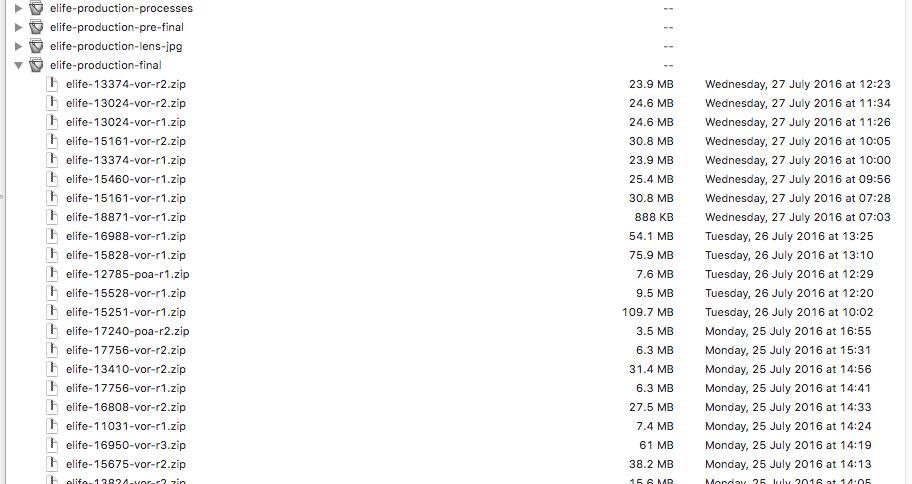

PoA packages are distinguished from their version of record counterparts with the three letter code after the article number. The revision (r) number at the end of the package name indicates the number of times the article has been supplied to the publishing platform. In most cases, at this stage, this will be r1 indicating that the article has only been supplied once (the initial publication).

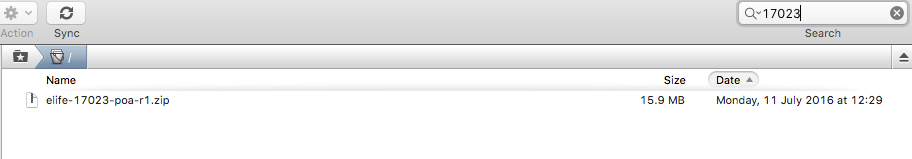

Download the latest version of the article (r1 if creating a version 2, r2 if creating a version 3 etc) and unzip it. This will create a folder containing the XML, merged PDF and supplementary file package for the article.

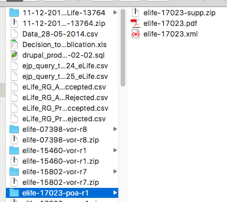

If making changes to the supplementary material, this second zip will also need to be expanded, creating a folder containing the figure supplements, source data etc associated with the article.

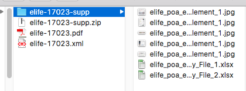

Make the required changes to the XML file, merged PDF or supplementary materials. If replacing the merged PDF, it is good practice to rename the published PDF with an appropriate suffix (e.g. \_old) to keep track of it.

The XML should be opened using an appropriate editor (e.g. Oxygen) but it must NOT be converted to a multi-line file. Please do not add whitespace/line breaks when editing. To improve readability, toggle ‘line wrap’ from the ‘Tools/Document’ menu in Oxygen.

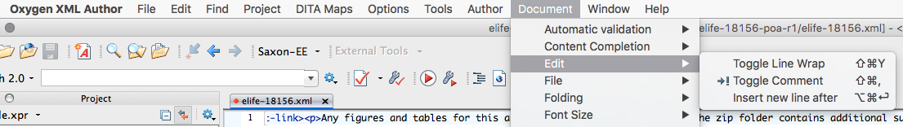

If any changes are made in the supplementary material package, it will need to be re-compressed using [FolderWasher](http://sw.ixoft.com/folderwasher/) in order to remove operating system-specific files (this is a problem with compressing folders on Macs) that might prevent another user unzipping the folder. Open FolderWasher and drag the supplement folder into it. Run with the option to zip after washing and rename the resulting zipped folder to overwrite the downloaded supplementary file zip.

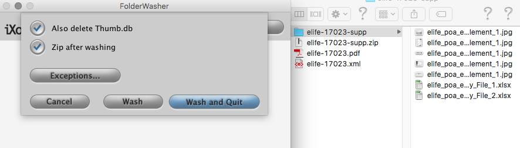


Once the files have been updated, the package needs to be compressed. Select the three files (XML, PDF and ZIP) and right click/ctrl click to bring up the file menu. Hit ‘Compress 3 Items’. Please note: do NOT under any circumstances just re-zip the folder as a whole. This will introduce an extra layer into the file structure when the package is unzipped by Continuum, which will in turn cause an error during processing.

Rename the resulting zipped file using the same structure as the downloaded package but with the revision number (r) increased by one.

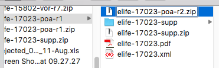

Drag the new package into the elife-production-final bucket. Once it has uploaded fully, the new version of the article will be ingested into Continuum. It will appear on the dashboard with a version number.

IMPORTANT: Always remember to update the proofs in Kriya to reflect the changes made with the V2. This may require sending new files to Exeter or simply instructing them to make the required edits.

**PoA press**

eLife’s press officer will investigate some accepted articles to see if it would be appropriate to issue press releases for them. While this is being done, the articles should be placed on hold. The press officer will send instructions over by email, usually listing one or two articles to be held. In many cases, the hold will be released with no action. In some cases, however, the article will need to be scheduled for a specific time and date.

If a PoA article is being press released, it will need to be scheduled for release on the appropriate Tuesday. As the published date for each PoA article is by default set during XML generation to the current day, the Production team must manually alter this date.

Once the article XML has been generated, go to the elife-poa-packaging outbox and download it.

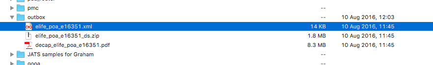

Open the XML and locate the publication date. This will be tagged as follows (though remember not to add line breaks to the XML, they are given here for demonstration processes only):

```markup
<pub-date date-type="pub" publication-format="electronic">
<day>10</day>
<month>08</month>
<year>2016</year>
</pub-date>
```

Update the publication date, save and then replace the XML file in the outbox with the new version. On ingest to Continuum, the article page will now show the intended future publication date.

Once the article has been checked, it can then be scheduled using the same process outlined [below](https://docs.google.com/document/d/12ujE_DbG4euaI1-1m7kJHaEYBNAVbGUJ5SYYa2ZT65M/edit#bookmark=id.hhw6p99grrt1) for the full versions of articles.
