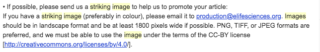

# Striking images

## **What is a striking image?** 

To maximise the impact of an article upon its release, it is beneficial to accompany an article with an eye catching image that highlights the research article. 

At eLife, when an acceptance letter is sent out, we encourage authors to submit a promotional image which we call a 'striking image' to the Production team and during their submission to eJP.

It is important to know that when authors send these images to us, they may refer to them in other ways. Other journals include promotional images and use them in different ways, such as: 

* **Cover images** - These are used as front cover images on the article's journal issue. 
* **Graphical abstracts** - A single, visual summative which explains the key findings of the study. Authors can use a relevant figure for this from the article or create a new image.  Please see below for an example. 

## **Uses for striking images**

Striking images can be used in the following ways 

* a homepage image \[see [**here**](https://elifesciences.org/archive/2020) for the homepage archive\]
* within the eLife digest \[see [**here**](https://elifesciences.org/digests) for the digest channel\] 
* to promote the article via social media channels \[see [**here**](https://twitter.com/eLife/status/1278358999386259457) for an example on Twitter\]

The authors are also free to use these images for their own social media and press releases and do not need to ask permission for this. 

## **Requirements** 

These images should preferably be in colour, in a landscape format and we at least 1800 x 900 pixels. Photographs, microscopy images and illustrations work best. PNG, TIFF, or JPEG formats are preferred, and we must be able to use the image under the terms of the CC-BY license. 

This information is provided to authors, and it is up to them to ensure the images they provide adhere to these guidelines. We do not check them and we upload whatever is provided to Kriya. 

## Examples of suitable striking images

 

 

## Uploading a striking image 

Authors can email Production with a striking image via email as indicated in the acceptance email from Editorial and will have been provided with the guidance shown below.

They may only include the title of the article without the article number but you can often find this by searching in eJP using the article title or email address of the author. If you are unable to do so, the author will need to be asked for this so that we can ensure the striking image is uploaded correctly. 

Depending on the status of the article, you can upload this striking image through eJP or the Kriya dashboard. 

### **Uploading via eJP** 

To upload this via eJP, you should bring up the accepted version of the article. 

Ensure this article has not already been exported from eJP to Kriya. To check, you can look to see if under  'More Manuscript Info and Tools' on the right hand side of the page, and see if the 'Export to Exeter' option is not displaying but instead says 'Resend/Export to Exeter Premedia'. Alternatively, you can look in the Production inbox for the XML notification.  

 Once you are sure that the article has not yet been exported, click 'Modify Manuscript Files' under the 'More Manuscript Info and Tools' menu. 

This will bring up the file list as shown below.  

You can drag and drop the striking image into this field and it will automatically load to the bottom of the list. You should scroll down and click 'Upload files'.

Once this has been uploaded, you will be presented with a drop down menu to select the file type. Please select 'Potential Striking Image'. This will then bring up a title and legend box that can be filled in. The authors may not provide a title so you can leave this as 'Potential Striking Image' but if any caption or image credit has been included in the email, ensure this is added to the legend and click save. 

Once you have done this, click 'Save and Exit'

### Uploading via Kriya 

To attach a striking image to an article, download the image provided by the author, go to the article in the Kriya dashboard and click on 'Striking image'. 

When the uploader appears, select the file and then click on 'Update'. Leave the 'metacontent' as is, unless the authors have provided a caption or attribution information in which case these should be entered instead. 

It is worth noting that you are unable to select multiple images to upload through the 'Select file' icon and each image will need to be selected separately \(but within the same uploading session\). This is because with each image upload, it will overwrite what is previously in the striking images AWS bucket. To add additional images to an article has already has an image, please see 

After clicking on 'Update' the uploader will not automatically close. You will need to refresh the page. Double-check the article in the dashboard to make sure the 'Striking image' button is now green. Alternatively, you can bring up the striking images AWS bucket at the same time and after you have clicked update, you can refresh the bucket to ensure this has been uploaded. 

### Uploading via the striking images AWS bucket 

If an article already has a striking image but the authors would like to add another, and it has already been exported to Kriya, the image will need to be uploaded straight to the striking image bucket. To do this, open the elife-striking-images bucket in Cyberduck \(or similar program\) and search for the manuscript number. 

Open this folder and drag and drop the new striking image in to upload it. Make sure the striking image is titled appropriately - e.g. '56754-b\_striking\_image' if there is already a '56754-a\_striking\_image'. If the authors have provided a title, caption, or attribution information, enter this into a .txt file and save with the same title \(i.e. '56754-b\_striking\_image'\). If they have not provided this information, you do not need to include a .txt file. 

