# Press processes

## What is press content? 

In the event that a paper has potentially broad public significance, authors may consider a press release. To coordinate this, they may discuss this with their institutional press officer and then get in touch with eLife directly, or they may be contacted by eLife's Media Relations Manager, Emily Packer. Both PoA and VoR articles can be associated with a press release, which will be written prior to publication, either in-house at eLife, by a freelance writer, or by the author's institution. The Production team has a weekly meeting with Emily to schedule and to track the progress of upcoming press articles. They are almost always scheduled for Tuesday publication, but if authors insist on a different press publication date, this might be accommodated. Press content must be prioritised by both the content processors and the Production team. You can find examples of eLife (or freelance)-written press packs** **[**here**](https://elifesciences.org/for-the-press).  

## Press meetings 

Press meetings usually occur on a Thursday morning, and are attended by a member of the Production team and Emily. The meeting is an opportunity to confirm scheduled articles, check articles in progress, and estimate press dates for upcoming articles. These three stages will be covered below. 

### Confirm scheduled articles 

Before the meeting starts, the representative from Production needs to ensure that both Kriya 1 and Kriya 2 are refreshed and that they have the [**digest tracker**](https://docs.google.com/spreadsheets/d/17Llag-aEnbuARu5ORDJFki4K73xzy1fz2B2XG_QHQPI/edit#gid=1376331906)** **and** **[**actions sheet**](https://docs.google.com/document/d/1gWMKdmcl4i7EC_bHvrbpBcUKoXuMQ4WfrVDJ1HxQ0cc/edit?ts=56dd55b5) open in another tab. They start by running through all the articles marked as scheduled on the actions sheet, starting with the PoAs and then moving on to the VoRs. 

.png>)

### Check articles in progress

They should then move over to Kriya and filter only for press articles, running through the articles in chronological order by press date (unfortunately, Kriya does not order them chronologically). In Kriya 1, you do this by selecting 'With Press Date' under 'Total'.  

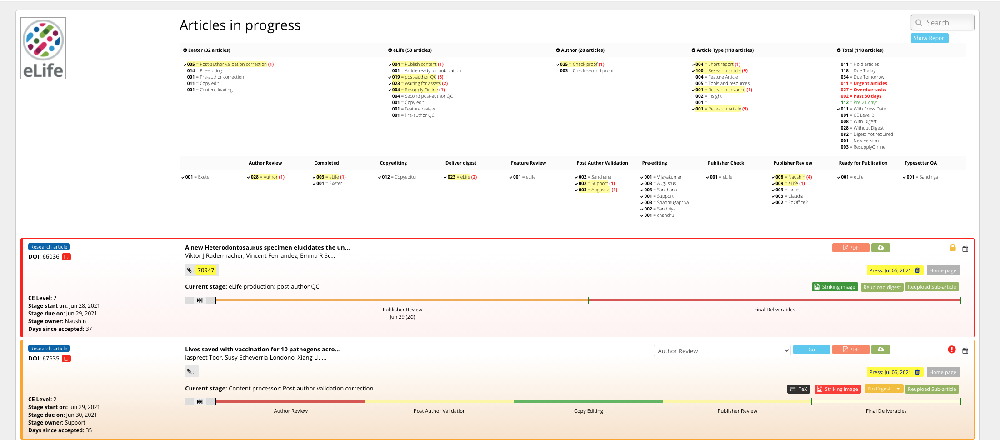

In Kriya 2, this can be done by selecting the list view and ticking 'Yes' under the 'Press release date' filter. 

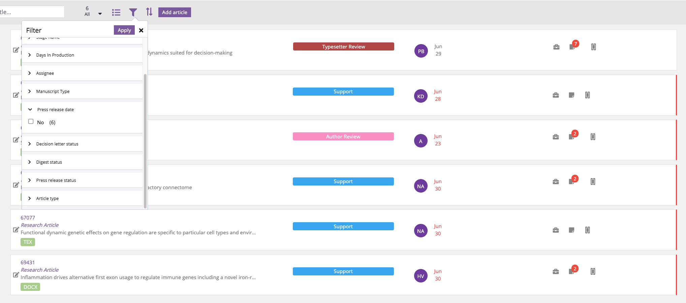

When checking the status of press articles, if any of those marked for the upcoming Tuesday are still at the Author Review stage, they may not need to be pushed back at this point, and Emily can be updated on these in the [**Press Update email**](press-processes.md#press-update-email)** **on Monday. However, if we have already corresponded with the authors and they have requested extensive edits and/or a second round of review, the press date should be pushed back by a week. Articles that have passed the Author Review stage should be on track for publication on the upcoming Tuesday unless something goes wrong - if it looks like an article will not make its press date, Emily should be informed via Slack. 

### Estimate press dates for upcoming articles

Emily will then enquire about the status of potential press articles. The estimated due date will depend on the stage an article is currently at. Unless there are problems, this is how long articles spend at each stage: 

* Pre-editing - 2 days (4 for LaTex) 
* Copyediting - 2 days 
* Typesetter QA - 1 day 
* Waiting for assets (if relevant) - check due date of digest on the [**digest tracker**](https://docs.google.com/spreadsheets/d/17Llag-aEnbuARu5ORDJFki4K73xzy1fz2B2XG_QHQPI/edit#gid=1376331906)**. **(if it is only waiting for a decision letter this will usually be loaded within a couple of days)
* Author review - 2 days 
* PAV - 1 day 
* Publisher review - 1 day

\
If an article has been marked as getting a digest, you should refer to the [**digest tracker**](https://docs.google.com/spreadsheets/d/17Llag-aEnbuARu5ORDJFki4K73xzy1fz2B2XG_QHQPI/edit#gid=1376331906) which will give you a due date for the digest.

.png>)

Generally, the best-case scenario is that a no-digest article will take 4 days to get to the author review stage and a week and a half in total to get to publication. If the article is due to reach the author for review on either a Monday or a Tuesday, then it can be scheduled for the following Tuesday. If it's due to go out to the author later in the week, it should be scheduled for the Tuesday of the week after. If the article in question has not yet reached Kriya, Emily will make a note to check this in next week's meeting. 

### Press articles with related content 

Sometimes co-publishing VoRs will be press-released. In this case, when providing Emily with a date, you should check the status of both articles to find a date that both should be realistically ready for. For VoRs which are being accompanied by an Insight, you must aim for a date which coincides with the due date of the Insight. Emily should have already been copied into an email letting her know of the Insight's due date (an example of which is shown [**below**](press-processes.md#press-correspondence)), or you can consult the #thisweek channel on Slack where Peter Rogers (Features Editor) regularly sends out updates about Insights. Read more about Insights and feature content [**here**](https://elifesciences.gitbook.io/productionhowto/-M1eY9ikxECYR-0OcnGt/article-details/content/feature-content). 

### Marking articles as press in Kriya 

After a date has been agreed, Emily will supply you with a publication time for the prospective press article. The times vary from article to article, usually due to the corresponding author's time zone. Press articles can be marked in Kriya 2 by clicking on the relevant article and then the pen and paper icon next to 'Press Release Date'. You can then choose a date and time. You must specify whether this date is confirmed by selecting from the drop-down menu next to 'Confirmed'. 

.png>)

On Kriya 1, press articles can be scheduled by clicking the press icon and choosing a date. A pop up will then prompt you to specify whether this date is confirmed. 

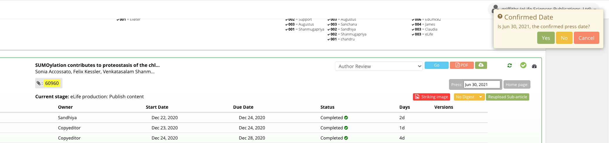

## Continuum workflow for press articles 

Sometimes the VoR of an article will be ready to publish before the PoA has been press-released. If the PoA has already been scheduled, you need to un-schedule it just before sending the VoR to Continuum. To do this, you locate the relevant article, then press the 'cancel' button. If the PoA hasn't been scheduled yet, you can send the VoR to Continuum as usual. However, be sure to email Editorial Office and CC Emily in to let them know the VoR has caught up and the PoA no longer needs to be scheduled (as this would result in overwriting the VoR).

The VoR can then be sent through to Continuum and checked and scheduled as usual. This is done by locating the relevant article on the dashboard and clicking the 'schedule' button. You will then have the option to select the date and time, after which you click 'schedule'. The article should then be visible under the 'scheduled' tab on the dashboard. 

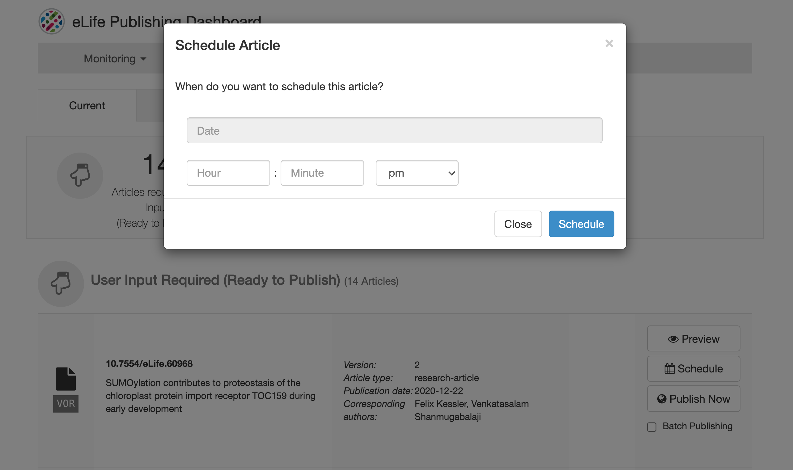

## Press correspondence 

### Press enquiries 

Emails arriving in the Production inbox which relate to press content must be categorised as such using the 'Press' Hiver tag. When authors enquire about press, Emily should be copied into the response (press@elifesciences.org) using the template shown below. You will need to provide Emily with an estimated publication date so she can propose a date to them. Emily will then follow up with the authors directly, and let you know when the press date has been confirmed. You can then schedule this on Kriya as outlined [**above**](press-processes.md#marking-articles-in-kriya). 

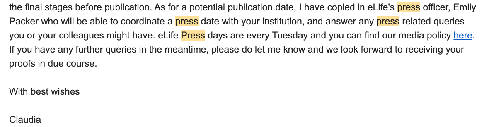

The Production team is also copied into emails from both Emily and freelancers to Editorial Office, asking them to put recently accepted articles on hold whilst she looks into potential press, or for them to be scheduled if she has decided on press. You can read more about how to process these emails [**here**](toolkit/managing-production-queries.md#press-emails)**. **

Once an email comes through from Editorial Office saying that the PoA has indeed been put on hold, you can add it to the [**actions sheet**](https://docs.google.com/document/d/1gWMKdmcl4i7EC_bHvrbpBcUKoXuMQ4WfrVDJ1HxQ0cc/edit)** **under 'PoAs on hold for possible press'. 

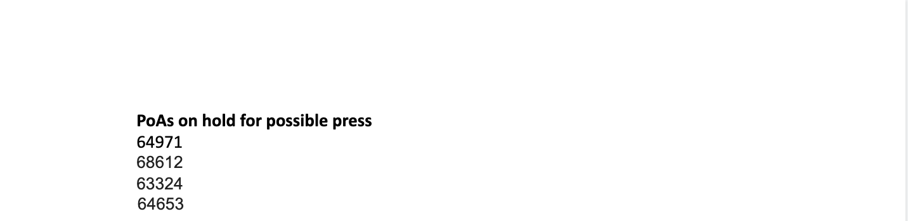


If you send a VoR to Continuum and notice that it is listed in the 'PoAs on hold for possible press' section, let Editorial Office know that the VoR has caught up. This is to prevent Editorial Office sending the PoA once the VoR has already been scheduled and overwriting it. 


We are also copied into emails asking for Editorial Office to release the hold on certain PoAs previously held for press. This is because either Emily or the freelancers have decided not to do press work on it. The article that has been released can then be deleted from the 'PoAs on hold for possible press' heading in the [**actions spreadsheet**](https://docs.google.com/document/d/1gWMKdmcl4i7EC_bHvrbpBcUKoXuMQ4WfrVDJ1HxQ0cc/edit) . 

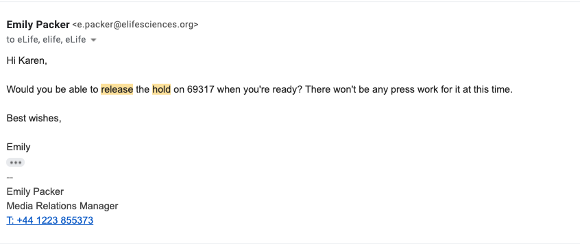

The Production team is also copied in to emails from Features to Emily informing her of publication dates for prospective insights, should she want to coordinate a press-release with the related article. 

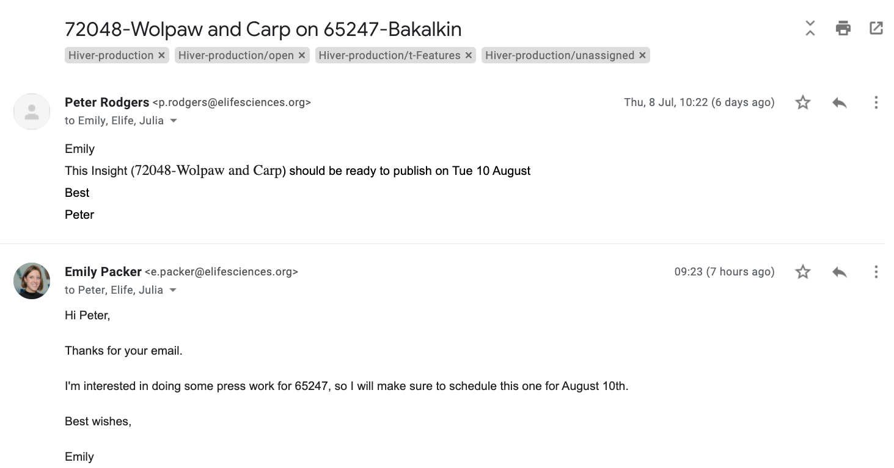

In their correspondence relating to press, authors sometimes enquire about embargo periods. In your reply, you can outline that we do not release content under embargo, except under exceptional circumstances. Authors are completely free to release their content ahead of publication and to talk with the media at any stage. You should link to our media policy [**here**](https://elifesciences.org/media-policy)**. **

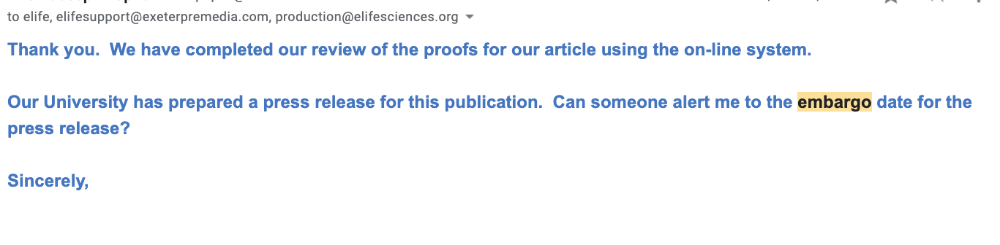

### Press update email 

On Mondays at around 3.30pm, the Production team sends an email to Emily, updating her on the status of the press articles for the next day. It is important that the person sending the email cross-checks the press articles listed under the relevant date on the** **[**actions spreadsheet**](https://docs.google.com/document/d/1gWMKdmcl4i7EC_bHvrbpBcUKoXuMQ4WfrVDJ1HxQ0cc/edit?ts=56dd55b5), with those listed on the [**manuscript tracker**](https://docs.google.com/spreadsheets/d/1TVgTAUijt9pVa_d8TRFcpPvipE31zcgBh0r9M5dFn4Q/edit#gid=2075183460)** **and those on [**Continuum**](https://prod--ppp-dash.elifesciences.org/current). These articles should appear under the** **[**'Scheduled'**](https://prod--ppp-dash.elifesciences.org/scheduled?view=list\&start=30-06-2021\&end=30-06-2022)** **section on the Continuum dashboard. 

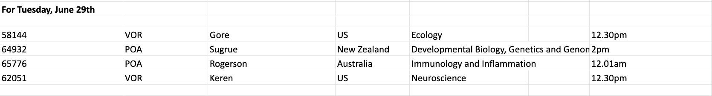

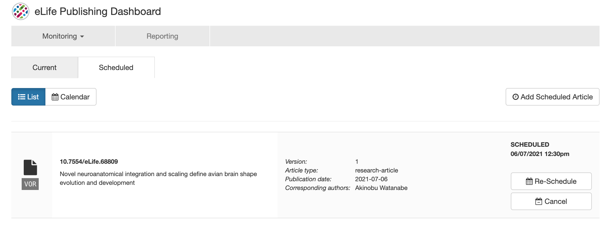

As can be seen in the screenshot below, the email should clearly list all of the articles that have been scheduled, specifying the time and date and whether they have any related content such as an Insight. If a press article has a related Insight which is not ready, the article should still be published on the agreed date. If a related co-publishing VoR is not ready, however, both articles will likely need to be pushed back. Emily should be informed of this in the first instance, either via email or Slack. She will then check with the authors or ask Production to do so, to see whether they would like to go ahead with press or wait for the other paper. In the event that any articles need to be pushed back, this should be indicated here, giving a clear reason for the delay so that Emily can inform the authors. 

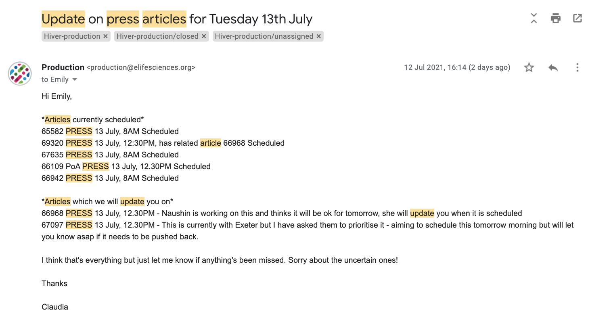

If an article still isn't scheduled on Monday afternoon but it has a press time of 12pm or later, depending on the scale of edits still needed, the article may still be able to make its press time. If a press article has not yet been scheduled, but it is expected that it will still make the press date, Emily should be sent a second email at the end of the day updating her on its status. 

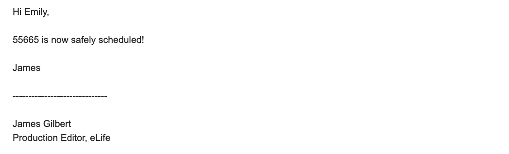

## Schematron checks

#### press-pub-date-check

**Warning: **_The publication date for this article is in the future (XXXX-XX-XX), but the day of publication is not a Tuesday (for Press). Is that correct?_

**Action: **This will fire if the publication date is in the future and is not on a Tuesday. Consult the dashboard in Kriya and/or the [**manuscript tracker**](https://docs.google.com/spreadsheets/d/1TVgTAUijt9pVa_d8TRFcpPvipE31zcgBh0r9M5dFn4Q/edit#gid=2075183460) to check whether the article is marked as press. If so, ensure you have the correct publication date. This will likely be a Tuesday, but there are some exceptions when other days are accommodated. Feature content will also be scheduled in advance for any day of the week. Exeter, please ignore this warning. 
