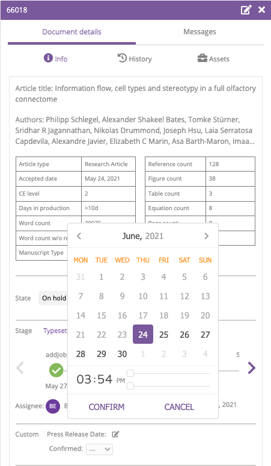
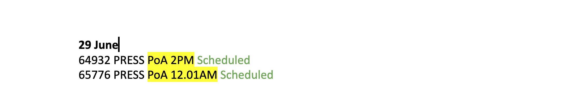

# Press processes

## What is press content? 

Both VoR and PoA articles can be associated with a press release, either written in-house at eLife, by a freelance writer, or by the author's institution. Press days at eLife are Tuesdays, but you can follow the status of these articles throughout the week on the [Manuscript tracker](https://docs.google.com/spreadsheets/d/1TVgTAUijt9pVa_d8TRFcpPvipE31zcgBh0r9M5dFn4Q/edit#gid=2075183460). Press content must be prioritised by both the content processors and the production team to prevent the need to push the article back by a week to the next press date. The production team has a weekly meeting with eLife's Media Relations Manager \(Emily Packer\) to schedule and to track the progress of upcoming press articles. 

## Press meetings 

Press meetings usually occur on a Thursday morning, and are attended by one member of the production team and eLife's Media Relations Manager \(Emily Packer\). Before the meeting starts, the representative from production needs to ensure that Kriya is refreshed and that they have the [digest tracker](https://docs.google.com/spreadsheets/d/17Llag-aEnbuARu5ORDJFki4K73xzy1fz2B2XG_QHQPI/edit#gid=1376331906) and [actions sheet](https://docs.google.com/document/d/1gWMKdmcl4i7EC_bHvrbpBcUKoXuMQ4WfrVDJ1HxQ0cc/edit?ts=56dd55b5) open in another tab. 

## Press correspondence 

### Email correspondence 

Emails which relate to press content must be categorised as such using the 'press' Hiver tag. Authors will sometimes inquire about press in their emails, and when this happens, Emily  should be copied into the response using the template \(as shown below\). It is also advisable to take the same course of action when an author inquires about a publication date, as often this means that they are considering press. You will also need to provide Emily with an estimated publication date over Slack or in a separate email so she can propose a date to them.

Emily will then follow up with the authors directly, and let you know when the press date has been confirmed. These can then be marked as press articles in Kriya by clicking on the relevant article and then the pen and paper icon next to 'Press Release Date'. You can then choose a date and time. You must then outline whether it is confirmed or not by selecting from the drop-down menu next to 'Confirmed'.

The production team is also copied in to emails between Joanne \(freelance writer\), Emily, and Editorial Office relating to the scheduling of PoA articles \(see below\). 

The first email will usually relate to the PoA being put on hold, and when a date has been agreed, a second email is sent, requesting that Editorial Office schedule the PoA. When we have received confirmation from Editorial Office that the PoA has been scheduled, we can mark it on the actions sheet under the relevant press date \(see below\).

### Press update email 

On Mondays at around 3pm, the production team sends an email to Emily, updating her on the status of the press articles for the next day. It is important that the person sending the email cross-checks the press articles listed as scheduled on the [actions spreadsheet](https://docs.google.com/document/d/1gWMKdmcl4i7EC_bHvrbpBcUKoXuMQ4WfrVDJ1HxQ0cc/edit?ts=56dd55b5), with those listed under the relevant date on the [manuscript tracker](https://docs.google.com/spreadsheets/d/1TVgTAUijt9pVa_d8TRFcpPvipE31zcgBh0r9M5dFn4Q/edit#gid=2075183460) \(a spreadsheet updated by Emily\). This prevents any articles being missed, and is an opportunity to check that all of the articles are scheduled for the correct time and date. 

As can be seen in the screenshot below, the email should clearly list all of the articles that have been scheduled, specifying the time they have been scheduled for and whether they have any related content such as an Insight. If for some reason any of the articles are not yet scheduled, this should be outlined in this email. If any articles need to be pushed back, this should be also indicated here, giving a clear reason for the delay so that Emily can inform the authors. 

If it is expected that the article in question will still make the press date \(either it could be scheduled later that day or on the morning of the Tuesday\), Emily must be sent a second email at the end of the day updating her on its status. 

