# Production checklist

## Publisher Check&#x20;

This is the stage prior to content being sent to authors and it is aimed to catch and resolve issues before it's sent out to them. The majority of research content will skip this stage, that is, unless they require a higher copyediting level**, **or if it is feature content, which always comes into this stage.&#x20;

The article will come into the 'Publisher Check' section on Kriya, and you will assign it to yourself as shown [**below**](production-checklist.md#assigning-articles)**.** The process for carrying out a Publisher Check is then largely similar to the process for a [**Publisher Review**](production-checklist.md#publisher-review), except that you need to use the Pre- version of the Schematron validator instead of the Final one. Pre-author checks for Feature content will also entail some additional checks.&#x20;

### **Copyediting **

All research content will go through the same level of copyediting, carried out by the content processors. That is, unless editorial informs production that the article requires a more rigorous copyedit. If this is the case, the article will need to be sent to one of our external copyeditors, and in order to assign it to them, we will need to ask Exeter for the article to come into the publisher check stage. Following this, the first step would be to email one of the external level 3 copyeditors to enquire as to whether they have the capacity to copyedit the article. You will then need to assign the article to the relevant copyeditor.

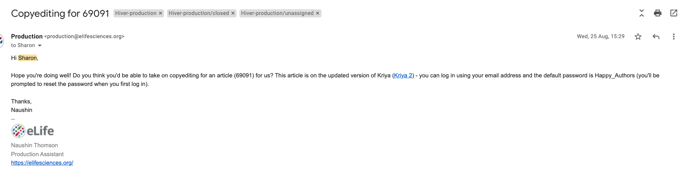

#### Assigning to a copyeditor &#x20;

* Log into publisher check, and proceed to the 'Approve' button.
* Assign to one of the copyeditors - this will appear as once of the options (add a screenshot when you next do this).&#x20;
* After copyediting, the article will come back into publisher check. This is the point at which the production team carries out the publisher check (as opposed to before it goes out to the copyeditor).&#x20;

### Feature content&#x20;

As indicated above, feature content requires some additional checks to be carried out. You can read about some of the unique features of feature content here. One of these are the in-text queries left by the Features team for the authors. These queries are entered into the file before it is submitted to eJP, so they will be present in the file there. These will be raised when the features team want to make an edit, but want to ensure the authors are happy with it prior to publication. These are done using the following format: \[OK] or \[QUERY]. These need to be removed at publisher review.&#x20;

There are two Schematron checks for the presence of these tags - **make sure they are added in.**&#x20;

### Signing off&#x20;

On completion of a Publisher Check, the content will not be sent to Continuum to be scheduled, and instead it will either be sent&#x20;

* to the typesetter (if there are edits to be made)
* to the author (if it is ready for them to review it), or&#x20;
* to the 'waiting for assets' queue if it is waiting for a digest or decision letter.&#x20;

Alternatively, if a feature article is waiting for a decision letter, instead of sending it to the 'Waiting for Assets' queue, we put it on hold under our name. See [**below** ](production-checklist.md#putting-articles-on-hold)for how to do this.&#x20;

## Publisher Review&#x20;

Once an author has made all the required revisions to their manuscript, it is signed off and comes back to the production team ready for its Publisher Review. This stage of the process is to check over all revisions made by the content processors and the author, and to provide a broader check on the article to make sure it is up to standard for publication – this involves validating the XML and reviewing the PDFs.&#x20;

## Checks prior to starting&#x20;

### Prioritising articles&#x20;

Articles that should be given priority at Publisher Review include:

* Features content
* Press for the following week&#x20;

However, the following content can be de-prioritised on days in which there is a lot of content to get through:

* Press for a few weeks' time
* Articles with related content that is not yet in production (for example, Insights or related articles)

### Assigning articles&#x20;

In order to assign an article, click on the relevant article in the 'Publisher Review' column. This will prompt a pop-up, displaying the 'Document details' for that article. You then click on the pen and paper button next to 'Assignee'.

This will generate a drop down menu, displaying the available users. Choose the person's name from the list.&#x20;

#### Entering the article&#x20;

Once you have assigned an article to yourself, to enter an article, click the pen and paper button to the left of the panel.&#x20;

### Notes&#x20;

* Notes can be added by both production and the content processors. To view these on Kriya 2, click on the article in question on the dashboard, then on the Messages tab and then the Notes tab, as illustrated below.&#x20;
* This is where the production team can add any pieces of relevant information from their correspondence with the author.
* It is important at Publisher Review to check that any notes left previously have received a positive response and the correct action has been taken.&#x20;
* Whilst carrying out a Publisher Review, if there are changes to be made they generally should be  communicated to the content processors via a Typesetter Query, as opposed to through the Notes.&#x20;

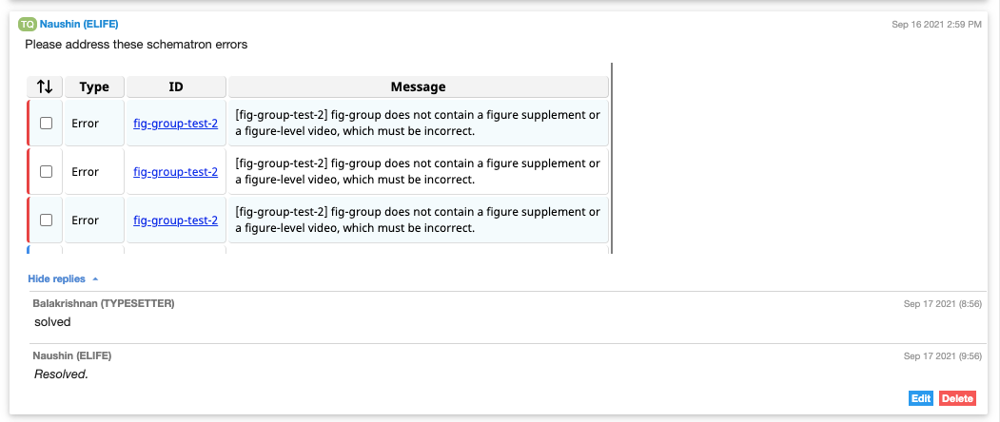

### Emails&#x20;

In addition to checking an article’s history in Notes, you must also check for any emails associated with it.&#x20;

Start by searching the production inbox using the article reference number and look for the thread marked ‘Author Correspondence’.&#x20;


Sometimes authors may not respond to the proofing email so the title of the email thread may be non-standard or different. For instance, we need to search with the number followed by 'r' (e.g. 70146r), in order for certain editorial/eJP emails to be returned in the search result.&#x20;


If there are emails from the author, read this for actions they have asked for. If they have asked to see second proofs in their correspondence, ensure that this is added into the Notes section on Kriya.&#x20;

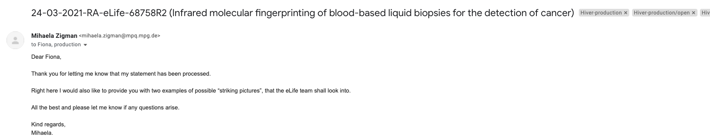

### **Press **

You will also want to check whether the article is marked for press. This will be indicated in the 'Custom' section, under the 'Document details' and 'Info' tabs. As mentioned before, if the press date is imminent, these articles should be prioritised at Publisher Review and the press date indicated should be added in the [**Publication History**](production-checklist.md#publication-history)** **section within the article.

### Linked articles&#x20;

Some articles will be linked to other articles, indicating that they might need to be published together. If there is one or more linked article, they will be displayed in the 'Related articles' section, under the 'Document details' and 'Info' tabs. Under 'Article type', on the 'Document details' page, you can see what kind of article it is. The colour of the label indicates its progress through the system.&#x20;

* **Red **means it is not in Kriya yet - it is still within EJP and not yet exported
* **Yellow **means that it is in progress within Kriya&#x20;
* **Green** means it has been published

Often the stage of the linked article will depend on the type of article that it is linked with. Articles linked to Advances will have already been published (this is because an Advance builds upon the research of a previously published article by the same authors). Insights, on the other hand, usually come into production some time after the research article because they are commissioned at the time of acceptance.&#x20;

Sometimes the article that is displayed as linked is just a previously submitted, earlier version of the article, or a co-submission that has been deleted. This can be checked by navigating to** **[**EJP**](https://submit.elifesciences.org/cgi-bin/main.plex?form\_type=display\_home\_dt\&j\_id=415\&ms\_id\_key=939ftdnExAd7Sp1L0RMdP2ZlOqdw\&ft\_key=hWPdklIQy6iZaZp8bgLQ\&old\_form\_type=\&from\_ms\_id=\&from\_ms\_rev\_no=)**, **clicking 'Find Manuscript' on the homepage and entering the manuscript number on the following page. Then, scroll down the page to view the article's 'Related Manuscripts'.

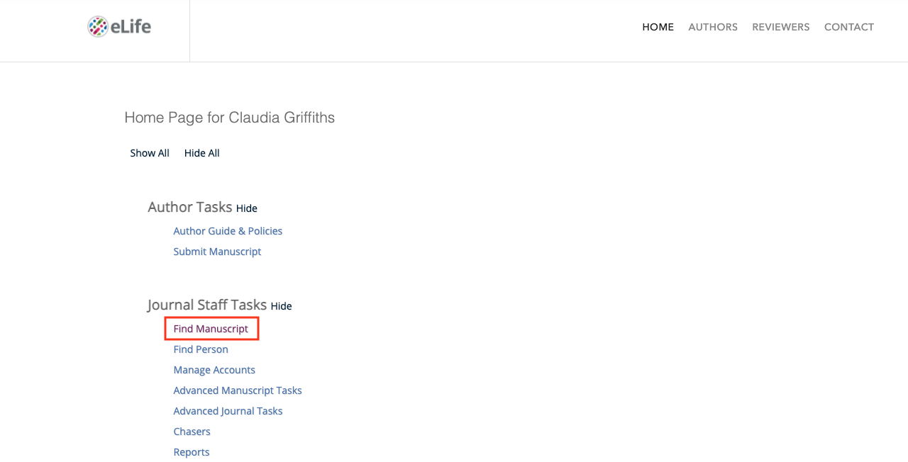

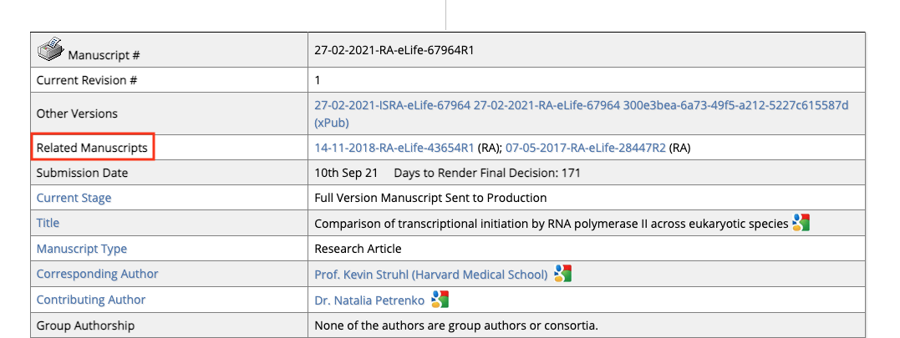

If the article appears to be a previously submitted, earlier version, or a co-submission that has been deleted, then the related article can be un-linked via the 'Related article' section in the Publisher Review.

## Article details checks&#x20;

**The following checks — from checking over the title, to the editors and reviewers should only take a few minutes. **

### Title&#x20;

* Check that the title makes sense.
* Only italic formatting is allowed.
* Check that it avoids unexplained acronyms.&#x20;
* The capitalisation should be sentence case, but proper nouns can be capitalised.&#x20;

### Major subject areas

There should be at least one major subject area present. Ensure to consult EJP if these are missing. Click on 'Find Manuscript' on the homepage and entering the manuscript number on the following page. Then, scroll down the page to view the article's 'Major Subject Area(s)' to see what they should be.&#x20;

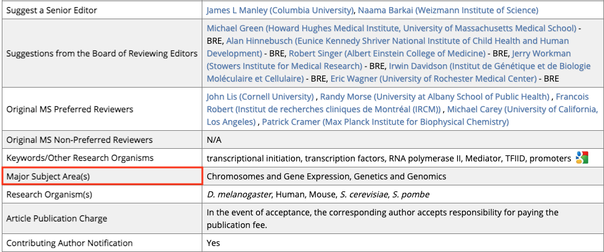

Add any missing items in using the 'Add Major Subject Area' button.&#x20;

.png>)

### Authors&#x20;

Open the details for each author individually and conduct the following checks:

* If an author has an ORCID ID, follow the link to ensure that it leads to the correct page (sometimes the names will differ slightly - this is not an issue).&#x20;
* Check that the name is split correctly: ensure that forenames and surnames are in the correct place, and any surname prefixes such as ‘von’ are in the ‘surname’ box. Initials should go after the first name in the ‘Given name, initials’ box, not the ‘Initials:’ field - this second field is just an override for the PDF and is usually left empty.
* If the 'Corresponding Email' box is ticked, their email address should be present. Add from EJP if not.&#x20;
* Check that they have at least one affiliation, but do not check the affiliations themselves, this will be done at the next [**stage**](production-checklist.md#affiliations)**.**
* If an author contributed equally with another author, in the 'Equal contributor with:' section, at least one other author name will be tagged.&#x20;

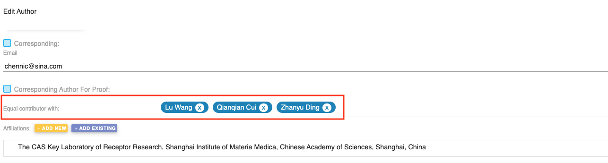

* Author contributions will be listed here - check that they are formatted correctly and that any free-form contributions at the end are sensibly phrased and are not repetitive **(provide an example of this).**
* Any competing interests that an author may have, e.g. if they work as an editor for eLife or another journal, need to be listed here. If they have ticked the ‘None’ box, ensure that nothing is listed.&#x20;

### Affiliations&#x20;

* Ensure that there are no spelling errors and that the capitalisation is correct.&#x20;
* Ensure that states and postal details aren't included.&#x20;

### Publication History&#x20;

* The received, accepted, PoA (if relevant) and preprint dates will be pre-filled from the submission system.

* You can check whether the article was PoAed via the validator, see [**here**](production-checklist.md#xml)**.** You do not need to check the other history dates, apart from the preprint date. Copy the DOI from the 'Link' box to navigate to the preprint site.&#x20;
* Click on the 'History' tab and compare the date to that in the proofing system. Change if this has been entered incorrectly.

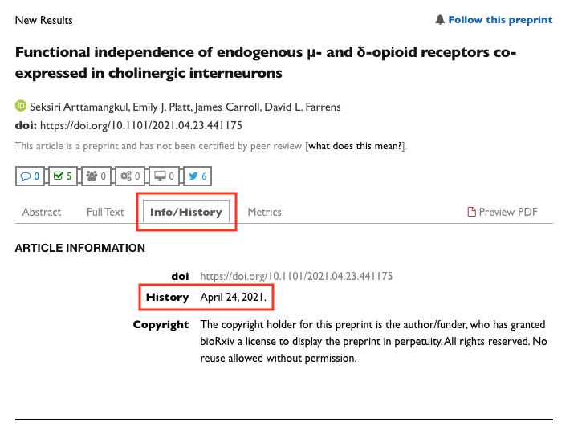

* If an article has not been PoAed, a VOR publication date will need to be added. If you are sure that the article will be published, add in today's date, if not, leave it blank for the date to be entered later. At this point, you will need to refer back to the dashboard to check if the article has been marked for press. If so, you will need to enter the press date. Click the 'Add New Date' button to do so and enter the relevant date.&#x20;

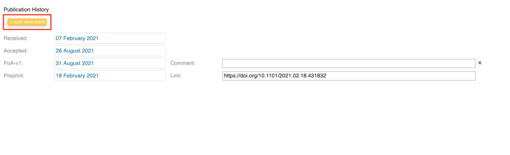

### Funding

* Every funder must have at least one author associated with it.
* Only one grant number should be displayed per entry in the funding table. If two or more grants are present in one entry, they should be split into multiple funding entries.
* Whenever the funding section is edited, an author query must be added so the authors can approve the change.
* The funding statement may differ depending on the article.&#x20;
* Ideally, each funder should be validated against the Crossref Funder Registry. Validated funders are indicated by a green tick. If it is not validated, try retyping the funder. If this doesn’t work, navigate to the [**Crossref Funder Registry**](https://www.crossref.org/services/funder-registry/) and check if it is on there. If you still cannot find the funder, then conduct a Google search and attempt to determine whether the funder is an accredited body or not. Sometimes the name may need correcting slightly, or may be translated into English when it is registered in the original language.&#x20;
* Award IDs are optional.
* To read more about funding, consult this [**page. **](article-details/content/funding-information.md)****

### Data availability&#x20;

The Data availability statement (DAS) should ideally be at least one sentence and should end in a full-stop. If there are any GitHub links in the DAS, these may need to be archived. You can find out [**here**](toolkit/archiving-code.md#check-whether-the-repo-contains-code-and-is-public)** **whether this is necessary. Generated datasets mentioned in this statement should be included in the ‘Major Datasets - Generated’ field below. Sometimes data will be mentioned in the DAS but not entered in the Major Datasets - Generated table. Read more about what to do in this situation [**here**](article-details/content/data-availability.md#what-is-the-data-availability-section)**.**&#x20;

All datasets provided need to be publicly available at the point of publication. The author must provide a direct URL to the dataset, not the URL for the entire database. Follow any links and check that you are able to access the dataset(s). You may need to query the authors to make their datasets public or to provide you with more information. Sometimes data will be described as 'available on request'. Read about what to do in this situation [**here. **](article-details/content/data-availability.md#data-available-on-request)****

### Impact Statement&#x20;

* A full stop should be added to the end if missing.
* General spelling errors or missing spaces between words should be corrected.
* Italics should be applied to any species names if not already present.
* Any possessive phrases ('we show', 'this study shows' etc.) should be removed or replaced with third-person alternatives.
* Excepting their use in scientific terms (e.g. ratios 1:800), if a colon or semi-colon is present, the statement should be rephrased (unless the article is a Replication study, in which case the statement should begin 'Editors' summary:').
* Uncommon abbreviations should be spelled out per the article text.
* Brackets are not forbidden but should be removed if not required for clarity.&#x20;
*   If the statement repeats the article title at length, it should be rephrased to avoid this.

    Whenever an impact statement is edited, the author must be notified about this.&#x20;
* In extreme cases, where it is not possible to create an acceptable impact statement from the text provided (e.g. they have provided multiple sentences and it is unclear how they should be combined), the author must be queried to start again.&#x20;
* Read in more detail about checking Impact Statements and the appropriate queries for authors [**here**](article-details/content/article-structure/abstract-digest-impact-statement.md#impact-statements)**. **

### Editors and reviewers&#x20;

* The senior and reviewing editors need to have their full name, institution and country listed.
* Reviewers require a full name, but institution and country are optional. If a country is listed without an institution, remove the affiliation.&#x20;
* For both sets of names, the same rules as for authors apply - names split properly, no full-stops after initials etc.

* We also have guest editors and these will often not have affiliations in Kriya. Missing affiliations can be queried with editorial via the #prod-editorial channel on Slack.&#x20;

.png>)

### XML

Firstly, we need to validate the XML using our [**XML Validator**](https://basex-validator.elifesciences.org)**. **Download the XML file from the tab along the top of the page on Kriya and then drag it onto the 'Upload XML' box on the validator webpage.&#x20;

Then click the 'Final' button. This will highlight any errors or style issues that might need fixing in the article. Items highlighted as warnings should be checked and then addressed if necessary. Errors will need to be fixed. Clicking on the hyperlinked warning/error message will take you to its relevant entry on the production GitBook which should help you rectify the issue if action is required.&#x20;

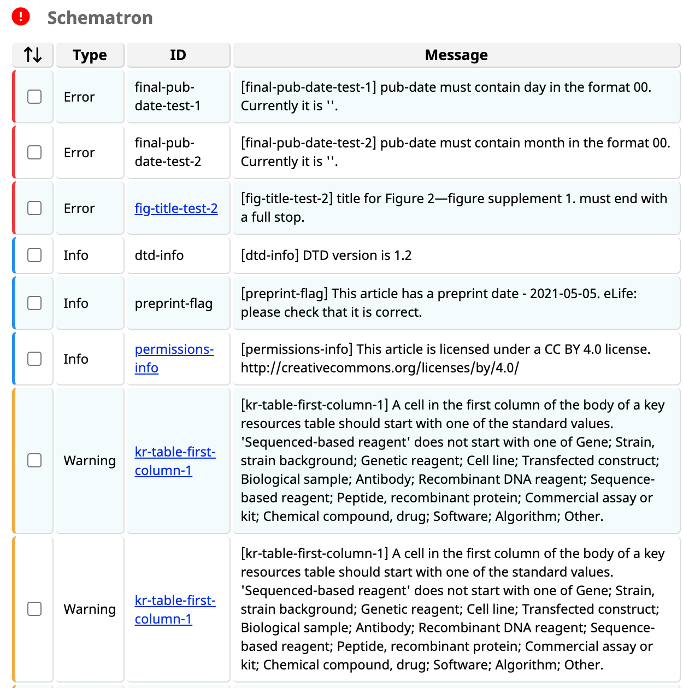

You also need to click 'Validate Pub Date'. This will prompt a pop up which will notify you if any of these values are unexpected and need looking into.&#x20;

* If the publication date does not match that of the POA version of the article, then ensure that the correct date is entered into the PoA-v1 field under [**Publication History. **](production-checklist.md#publication-history)****
* If the article has not been PoA-d and you have not yet entered a VoR date, the validator will generate the message below. A date will ultimately need to be added in this section (if the article has not been POA-d). Consult the [**Publication History**](production-checklist.md#publication-history)** **section** **if you are unsure what would be most appropriate in this field.

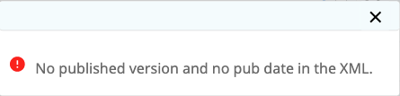


Please be aware that this will not flag POAs that have been scheduled for press (since that information is not available anywhere in any API).&#x20;


### Queries&#x20;

This is where queries from the content processors to the author and/or production (and vice versa) will appear. You should check the 'open queries' section to see if there is any action that needs to be taken, but you should also check the 'resolved queries' section to ensure that all of the necessary action has been taken here too.&#x20;

#### Querying authors at publisher review

If you have a query for the authors, the best way to contact them is via email. You must endeavour to keep all the correspondence to as few threads as possible. If a thread has not yet been started, locate the proofing email sent out to the authors and start your correspondence on that thread. Guidance on corresponding with authors can be found [**here. **](toolkit/interacting-with-authors.md)You may need to put the article on 'Hold' while waiting for a response to your query. Find out how to do that** **[**here**](production-checklist.md#putting-articles-on-hold)**. **

### Changes&#x20;

Now navigate to the ‘Changes’ tab. Recorded here is every edit made by the author, the content processors and Crossref. These changes will be automatically approved unless you reject them. When reviewing the changes, you can toggle between viewing the main article text with and without tracked changes by clicking on the eye symbol at the top of the window.

* Use the drop down menu to select the role that you would like to filter for (this will default to just showing just the author's changes otherwise).&#x20;
* You will need to filter for those made by the content processors, to ensure that no errors have been introduced.&#x20;
* Pay attention to cases where the author has reverted or change substantial sections of the copy-editor’s changes to make sure the text still makes sense and so that we are aware of anything that needs feeding back.&#x20;
* Author changes need to be checked one at a time and any mistakes they may have introduced (stray letters, missing or extra spaces etc) should be corrected.&#x20;
* At this stage, the author should not be rewriting large sections of their text. If they have done so, raise the changes with Editorial to check whether the editors need to approve them. Rewording a sentence is fine as long as the content is largely the same, but rewriting the entire discussion is not.
* If the author has made edits in the Decision letter or Author response sections, you may want to consult with the production team as to whether these should be accepted. You can also check to see if an explanation for the edits has been provided by email or in the Notes/response to queries. Guidance on decision letters can be found [**here**](article-details/content/decision-letters-and-author-responses.md#general-guidance-for-decision-letter-proofing-queries)**. **

### Figures, Tables and Additional Files tabs

Open each of these tabs and scroll through each item.&#x20;

* Check that each item is labelled with the correct category, either as a ‘Figure’, ‘Video’, ‘Table’, ‘Equation’ or ‘Figure Supplement’.&#x20;
* Check that each item has a label and title (legend optional) and check that the numbering on the items is correct.&#x20;
* Watch a few seconds of each video to make sure that they are functioning correctly.&#x20;
* Once you have made these checks, navigate to the ‘Supplementary files’ tab and ensure that each item downloads correctly.

Find out more about article level assets in their respective pages:** **[**Figures and figure supplements**](article-details/content/allowed-assets/figures.md)**, **[**Tables**](article-details/content/allowed-assets/tables.md)**, **[**Additional files.**](article-details/content/allowed-assets/additional-files.md)&#x20;

### References&#x20;

The references will be checked by the Schematron when you validate the XML. One possible issue is that a reference does not have a DOI or PMID. These will be highlighted with a red line. Any missing information generally be found through a Google search.

### Download PDFs

Click on 'Export PDF' to generate the article PDFs (aim to do another task at this point as the generation process can take up to 10 minutes). Scroll through the PDFs, paying particular attention to the figures and tables, ensuring that there are no rendering issues. Then, if the article has figure supplements, you will need to do the same for the figures PDF - click on 'Export Figures PDF' to generate the figures PDF.

### Signing off&#x20;

To do this, click on the 'Approve' tab at the top of the page. This will prompt the pop up below, where you should select the appropriate option depending on the state of the article:

* **Send back to the Typesetter for correction:** If there are changes that need to be made that you will need the content processors to carry out.&#x20;
* **Send back to the author for revision: **If the author has requested to see another round of proofs.
* **Send to Continuum:** If you believe the content is now ready to be published.&#x20;
* **Ready for Publication: **If the article is waiting for related content to be finalised (i.e., you need to wait for this other content to be ready to update the pub date), but is ready to publish otherwise. This will keep the article in the publisher review section in Kriya until you send it to Continuum.&#x20;

### Putting articles on 'Hold'

If, for example, you are waiting for a query relating to this article to be answered by the authors or by editorial, you will most likely need to put the article on hold until you are able to proceed with it. To do this, locate the 'state' section under the 'document details' tab on the dashboard and change it to 'on hold'. You will be prompted to select a reason and input a comment. &#x20;

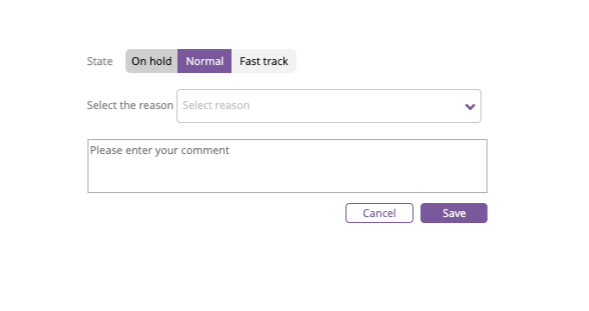

### Updating the actions sheet&#x20;

It is important that all articles in Continuum are recorded on the production actions document. Underneath your name, add your article in the following format:

* \[Article number] Loading...
* Once your article has loaded onto Continuum (this can take up to 10 minutes), you can change this to: \[Article number] Ready to check&#x20;

If you have noticed any issues with your article (including if it needs resupplying) you should outline this next to the article number.&#x20;

If the article is scheduled for press, this should be captured in the following way:

* \[Article number] PRESS \[press date, time] Scheduled&#x20;

## Continuum Check

This is our final pre-publication check, which is done on our eLife's platform [**Continuum. **](https://prod--ppp-dash.elifesciences.org/current)Once an article has been sent to Continuum from Kriya, it should arrive around 5 minutes. If it does not arrive, you will need to contact Exeter via email to ask them to investigate and push it through. If it is an article with today's date as the publication date, and you believe that Exeter might not be able to push the article through before the end of the day, you will need to ask them to change the date to the next working day. Occasionally articles will fail on Continuum due to errors. These need to be investigated.

* On the dashboard, locate the article that is ready to check using the Ctrl-F buttons. Click the preview button on the article that is ready to check - this will take you to a preview of the HTML version of the article.&#x20;

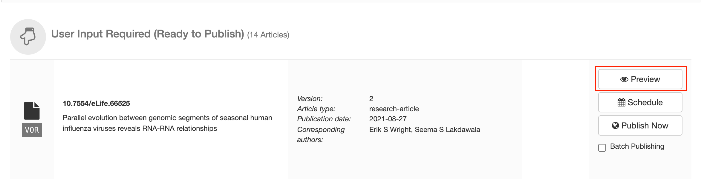

* Download the main PDF via the dropdown ‘arrow’ icon on the right-hand side.

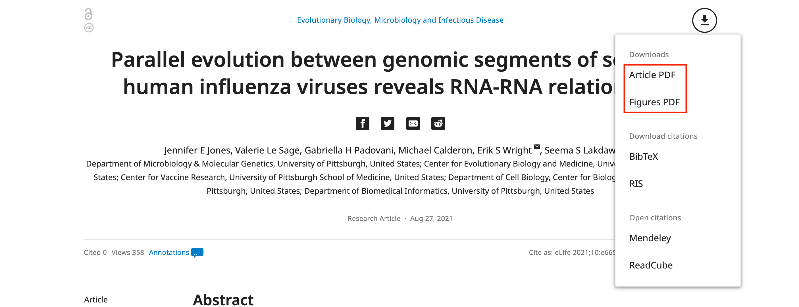

* Reduce the size of the three versions so that you can have all open at once (this will require two screens).&#x20;
* Check the figures first by selecting the ‘Figures and Data’ tab on the HTML view.&#x20;

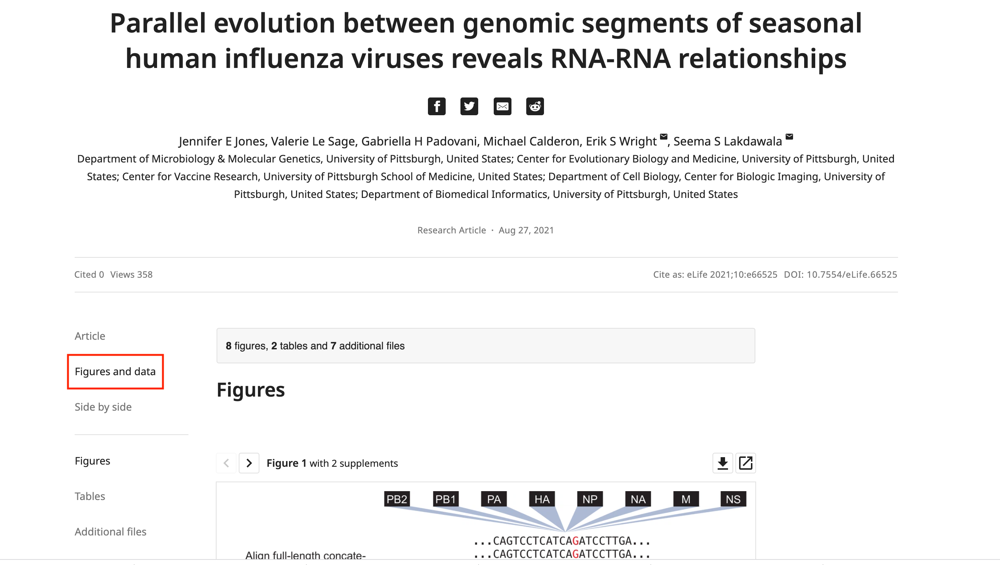

* Cross-check each figure and figure supplement across all three versions, to ensure that there are no colour shifts. If colour shifting has occurred, this article will need to be resupplied and sent back to Exeter so that they can fix it. Find out more about resupplying here.&#x20;

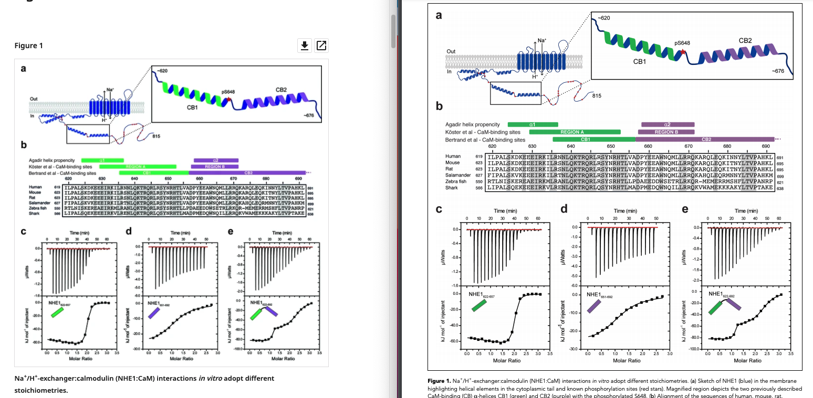

* Check that any Source data or supplementary files download correctly from this page.
* Check that the dataset information is correct and that the URL links correctly. All data should be publicly available by this point.&#x20;
* Close the figures PDF and return to the main ‘Article’ tab.
* Scroll down the PDF, checking carefully for any errors - in particular, check:
  * that the tables and figures are correct
  * that there are no rendering issues
  * the funding table matches up to the acknowledgments
  * that all RRIDs are linked
  * the date
* Now close the PDF, and do the same for the HTML version.
* When this is done, open the inbox and search the article number - make sure to also search with 'r' in front of the article number, as outlined [**above. **](production-checklist.md#emails)****
  * Check that it has a successful Crossref report, i.e that there are no failures (find out how to fix these here).&#x20;
  * Check that everything was resolved with the author
  * Check that there are no emails relating to Press for this article
  * Now open Kriya and find the article.
    * Check that all notes have been resolved
    * Check that there are no linked articles
    * Check that there is no press
* If everything is satisfactory, then you can return to Continuum and publish the article.&#x20;

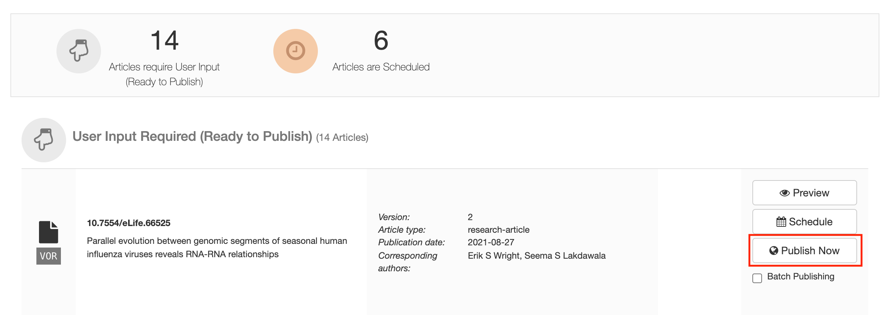

* Strike-through the article on the Actions sheet

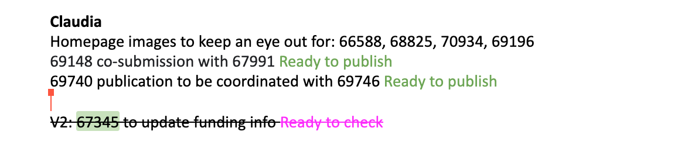

### Resupplying to Kriya&#x20;

If you find a problem with an article whilst doing the Continuum check, it will need to be resupplied to Kriya in order to fix it. To do this, you need to search for the article number in the search bar at the top of the dashboard in Kriya. You then can then assign the article to yourself, as shown [**above**](production-checklist.md#assigning-articles)**. **Within the article, if you click the 'Approve' button you will have the option to resupply it.&#x20;

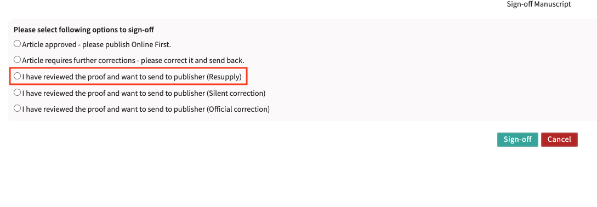

This will then move the article to Publisher Review where you can either make the relevant changes yourself, or if this is not possible, you can send the article to the content processors.  Once the changes have been made, you will then need to send to Continuum and proceed as usual.&#x20;

## Schematron checks

### **Content checks **

**final-feat-ok-test**

**Error**: _\[error-final-feat-ok-test] XXXXXX element contains \[OK] or \[OK?] which should be removed - XXXXXX_

**Action**: This error will appear** **if the tag \[OK] or \[OK?] is present. This is flagged as it is likely an in-text query left by features, and should be removed at publisher review.&#x20;

**final-feat-query-test**

**Error**: _\[error-final-feat-query-test] XXXXXX element contains \[Query] or \[QUERY] which should be removed - XXXXXX_

**Action**: This error will appear** **if the tag \[_Query_] or \[QUERY] is present. This is flagged as it is likely an in-text query left by features, and should be removed at publisher review.&#x20;
