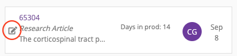
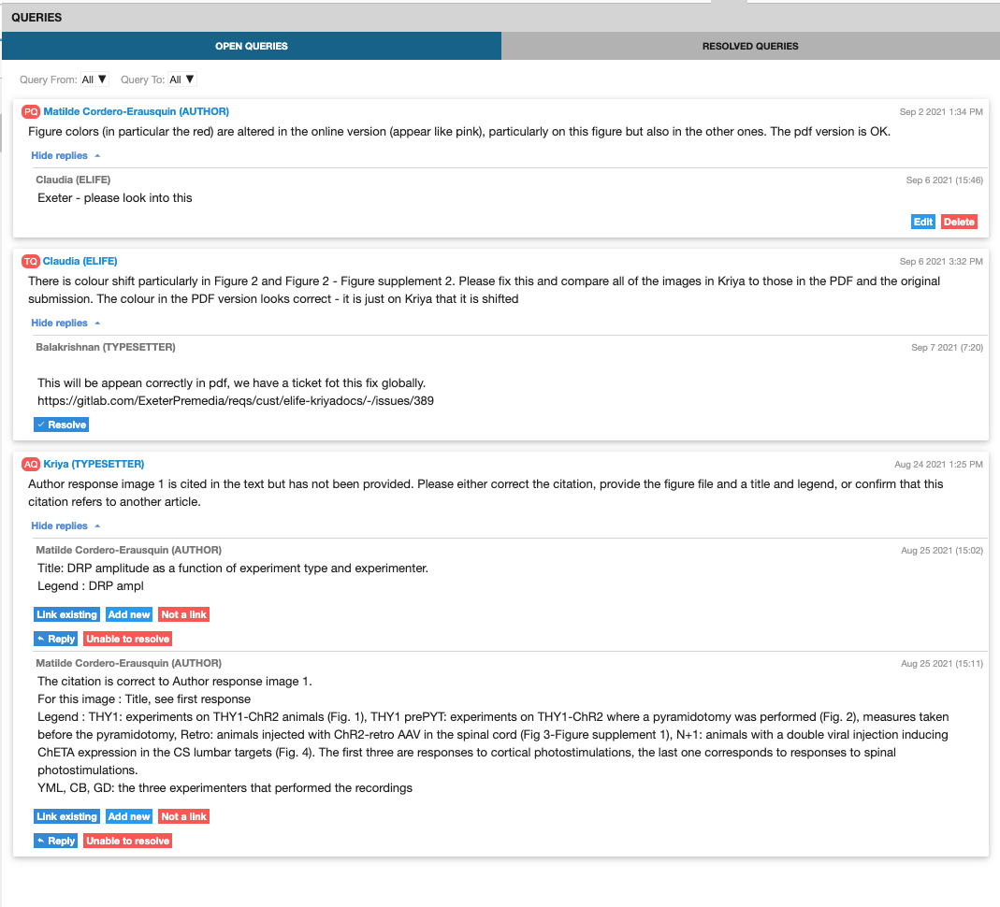

# Production Checklist

## Publisher Review 

Once an author has made all the required revisions to their manuscript, it is signed off and comes back to the Production team ready for its Publisher Review. This stage of the process is to check over all revisions made by the content processors and the author, and to provide a broader check on the article to make sure it is up to standard for publication - this involves validating the XML and reviewing the PDFs. 

## Checks prior to starting 

### Prioritising articles 

Articles that should be given priority at Publisher Review include:

* Press articles
* Feature content

### Notes 

* Notes can be added by both Production and the content processors. To view these on Kriya 2, click on the article in question on the dashboard, then on the 'messages' tab and then the 'notes' tab, as illustrated below. 
* This is where the Production team can add any pieces of relevant information from their correspondence with the author.
* It is important at Publisher Review to check that any notes left previously have received a positive response and the correct action has been taken. 
* Whilst carrying out a Publisher Review, if there are changes to be made they generally should be  communicated to the content processors via a Typesetter Query, as opposed to through the notes. 

### Emails 

In addition to checking an article’s history in notes, you must also check for any emails associated with it. Search the article reference number, look for the thread marked ‘Author Correspondence’, and check for any issues. If there are any, you will need to check whether these have been actioned. 

### **Press** 

You will also want to check whether the article is marked for press. This will be indicated in the 'custom' section, under the 'document details' and 'info' tabs. As mentioned before, these articles should be prioritised at Publisher Review and the press date noted and inputted in the [**Publication History**](production-checklist.md#publication-history) ****section within the article. 

### Linked articles 

Some articles will be linked to other articles, indicating that they might need to be published together. If there is one or more linked article, they will be displayed in the 'related articles' section, under the 'document details' and 'info' tabs. Under 'article type', on the 'document details' page, you can see what kind of article it is. The colour of the label indicates its progress through the system. 

* **Red** means it is not in the system yet
* **Yellow** means that it is in progress in the system 
* **Green** means it has been published

Sometimes the article that is displayed as linked is just a previously submitted, earlier version of the article. This can be checked by entering the number on EJP. If this is so, the related article can be un-linked via the 'Related article' section in the Publisher Review. 

### Assigning articles 

In order to assign an article to you, click on the relevant article in the 'Publisher Review' column. This will prompt a pop-up, displaying the 'Document details' for that article. You then click on the pen and paper button next to 'Assignee'. 

This will generate a drop down menu, displaying the available users. Choose your name from the list. 

#### Entering the article 

Once you have assigned an article to yourself, to enter an article, click the pen and paper button to the left of the panel. 

## Article details checks 

### Title 

* Check that the title makes sense.
* Only italic formatting is allowed.
* Check that it avoids unexplained acronyms. 
* For latin words, the general rule is that genes, bacteria and species such as ‘S. pombe’ should be italicised, and that phrases such as ‘in vivo’ or ‘in vitro’ should not be italicised. However continuity between the title, impact statement and article content is most important, so please check that italics are consistent.
* The capitalisation should be sentence case, but proper nouns can be capitalised. 

### Major subject areas

There should be at least one major subject area present. 

### Authors 

Open the details for each author individually and conduct the following checks:

* If an author has an ORCID ID, follow the link to ensure that it leads to the correct page \(e.g. one with the same name as given in the manuscript\).
* Check that the name is split correctly: ensure that forenames and surnames are in the correct place, and any surname prefixes such as ‘von’ are in the ‘surname’ box. Initials should go after the first name in the ‘Given name, initials’ box, not the ‘Initials:’ field - this second field is just an override for the PDF and is usually left empty.
* If the 'corresponding author' box is ticked, their email address will be included in their details.
* Check that they have at least one affiliation, but do not check the affiliations themselves, this will be done at the next stage.
* Author contributions will be listed here - check that they are formatted correctly and that any free-form contributions at the end are sensibly phrased and are not repetitive.
* If an author contributed equally with another author, they will be linked. If the ‘Equal contributor with’ box is ticked, ensure that another name is tagged with it. 
* Any competing interests that an author may have, e.g. if they work as an editor for eLife or another journal, need to be listed here. If they have ticked the ‘None’ box, ensure that nothing is listed. 

### Affiliations 

Sometimes affiliations need to be split up i.e., if there are two departments listed. A centre, within a department, within an institution, is okay. Two departments within an institution is not. Sometimes, authors belonging to two departments at the same institution will try to merge them into one affiliation, they need to be separated into two distinct affiliations. 

### Publication History 

* The received, accepted, PoA \(if relevant\) and preprint dates will be pre-filled from the submission system.
* You don't need to check that these dates are correct at this point, they will be validated when you run the XML through the ****[**validator**](https://basex-validator.elifesciences.org/)**.** Read about how to do this [**here.** ](production-checklist.md#xml)\*\*\*\*
* If the article has not been published as an accepted manuscript and is only going to be published as a version of record \(VoR\), you will need to add a publication date. Apply the planned press date if relevant, or use the current date if you know you are will be published that day. Otherwise, leave it blank for it to be filled in once the article is ready. 

### Funding

All funding received by authors in the process of researching and creating the article needs to be referenced here. Open each funding reference individually in order to check the details.

Ideally, we want every funder to be validated against the CrossRef Funder Registry. Validated funders are indicated by a green tick. If it is not validated, try retyping the funder. If this doesn’t work, navigate to the [**CrossRef Funder Registry**](https://www.crossref.org/services/funder-registry/) and check if it is on there. If you still cannot find the funder, then conduct a Google search and attempt to determine whether the funder is an accredited body or not. Sometimes the name may need correcting slightly, or may be translated into English when it is registered in the original language. 

Every funder must have at least one author associated with it. Grant references, however, are optional.

### Data availability 

The Data availability statement \(DAS\) should ideally be at least one sentence and should end in a full-stop. If there are any GitHub links in the DAS, these may need to be archived. You can find out [**here**](toolkit/archiving-code.md#check-whether-the-repo-contains-code-and-is-public) ****whether this is necessary. Generated datasets mentioned in this statement should be included in the ‘Major Datasets - Generated’ field below. 

All datasets provided need to be publicly available at the point of publication. The author must provide a direct URL to the dataset, not the URL for the entire database. Follow this link and check that you are able to access the dataset. You may need to query the authors to make their datasets public or to provide you with more information. Read in more detail about checking DAS and 'Major Datasets - Generated' sections [**here**](article-details/content/data-availability.md#what-is-the-data-availability-section)**.** 

### Impact Statement 

* Check that it ends in a full stop. 
* Check that it is clear and concise \(30 words or less\).
* Check that it does not simply repeat the title.
* Check that it is written in the third person.
* If the author was requested to provide a new impact statement during proofing, check that the new version is acceptable.

### Editors and reviewers 

* The senior and reviewing editors need to have their full name, institution and country listed.
* Reviewers require a full name, but institution and country are optional. If a country is listed without an institution, remove the country.
* For both sets of names, the same rules as for authors apply - names split properly, no full-stops after initials etc.

### Queries 

This is where queries from the content processors to the author and/or Production \(and vice versa\) will appear. You should check the 'open queries' section to see if there is any action that needs to be taken, but you should also check the 'resolved queries' section to ensure that all of the necessary action has been taken here too. 

### Changes 

Now navigate to the ‘Changes’ tab. Recorded here is every edit made by the author, the content processors and Crossref. These changes will be automatically approved unless you reject them. When reviewing the changes, you can toggle between viewing the main article text with and without tracked  changes by clicking on the eye symbol at the top of the window.

* Use the drop down menu to select the role that you would like to filter for. 
* You will need to filter for those made by the content processors, to ensure that no errors have been introduced. 
* Pay attention to cases where the author has reverted or change substantial sections of the copy-editor’s changes to make sure the text still makes sense and so that we are aware of anything that needs feeding back. 
* Author changes need to be checked one at a time and any mistakes they may have introduced \(stray letters, missing or extra spaces etc\) should be corrected. 
* At this stage, the author should not be rewriting large sections of their text. If they have done so, raise the changes with Editorial to check whether the editors need to approve them. Rewording a sentence is fine as long as the content is largely the same, but rewriting the entire discussion is not.
* If the author has made edits in the Decision letter or Author response sections, you may want to consult with the Production team as to whether these should be accepted. You can also check to see if an explanation for the edits has been provided by email or in the notes/response to queries. Guidance on decision letters can be found [**here**](article-details/content/decision-letters-and-author-responses.md#general-guidance-for-decision-letter-proofing-queries)**.** 

### Figures, Tables and Additional Files tabs

Open each of these tabs and scroll through each item. 

* Check that each item is labelled with the correct category, either as a ‘Figure’, ‘Video’, ‘Table’, ‘Equation’ or ‘Figure Supplement’. 
* Check that each item has a label and title \(legend optional\) and check that the numbering on the items is correct. 
* Watch a few seconds of each video to make sure that they are functioning correctly. 
* Once you have made these checks, navigate to the ‘Supplementary files’ tab and ensure that each item downloads correctly.

Find out more about article level assets in their respective pages: ****[**figures and figure supplements**](article-details/content/allowed-assets/figures.md)**,** [**tables**](article-details/content/allowed-assets/tables.md)**,** [**additional files.**](article-details/content/allowed-assets/additional-files.md) 

### References 

Check that all the journal references have DOIs. If a reference does not have a DOI, it will be highlighted with a red line. The DOI or any other missing information generally be found through a Google search. 

### XML

We then validate the XML using our [**XML Validator**](https://basex-validator.elifesciences.org/)**.** Download the XML file from the tab along the top of the page on Kriya and then drag it onto the 'Upload XML' box on the validator webpage. Then click the 'Final' button. This will highlight any errors or style issues that might need fixing in the article. Items highlighted as warnings should be checked and then addressed if necessary. Errors will need to be fixed. Clicking on the hyperlinked warning/error message will take you to its relevant entry on the Production GitBook which should help you rectify the issue if action is required. 

You also need to click 'Validate Pub Date'. This will prompt a pop up which will notify you if any of these values are unexpected and need looking into. 

### Download PDFs

Download the PDFs and scroll down them, paying particular attention to the figures and tables, ensuring that there are no rendering issues.

### Signing off 

To do this, click on the 'Approve' tab at the top of the page. This will prompt the pop up below, where you should select the appropriate option depending on the state of the article:

* **Send back to the Typesetter for correction:** If there are changes that need to be made that you will need the content processors to carry out. 
* **Send back to the author for revision:** If the author has requested to see another round of proofs.
* **Send to Continuum:** If you believe the content is now ready to be published. 

### Updating the actions sheet 

It is important that all articles in Continuum are recorded on the Production actions document. Underneath your name, add your article in the following format:

* \[Article number\] Loading...
* Once your article has loaded onto Continuum \(this can take up to 10 minutes\), you can change this to: \[Article number\] Ready to check 

If you have noticed any issues with your article \(including if it needs resupplying\) you should outline this next to the article number. 

If the article is scheduled for press, this should be captured in the following way:

* \[Article number\] PRESS \[press date, time\] Scheduled 

## Publisher Check 

This is the stage prior to content being sent to authors and it is aimed to catch and resolve issues before it's sent out to them. The majority of research content will skip this stage, that is, unless they require a higher copyediting level. If this is the case, Publisher Check will be carried out before it is sent out to an external copyeditor. Feature content, however, will always come into this stage. 

The article will come into the 'Publisher Check' section, and you will assign it to yourself as shown [**above**](production-checklist.md#assigning-articles)**.** The process for carrying out a Publisher Check is then largely similar to the process for a [**Publisher Review**](production-checklist.md#publisher-review), with the exception of Feature content, for which you will have to carry out some additional checks. You can find out how to carry out pre-author checks for feature content ****[**here**](article-details/content/feature-content.md#pre-author-checks)**.** 

On completion of a Publisher Check, the content will not be sent to Continuum to be scheduled, and instead it will be sent to the typesetter \(if there are edits to be made\), to the author \(if it is ready for them to review it\), or to the 'waiting for assets' queue if it is waiting for a digest or decision letter. If a feature article is waiting for a decision letter, instead of sending it to the 'waiting for assets' queue, we put it on hold under our name. To do this, you locate the 'state' section under the 'document details' tab on the dashboard and change it to 'on hold'. You will be prompted to select a reason and input a comment. 

