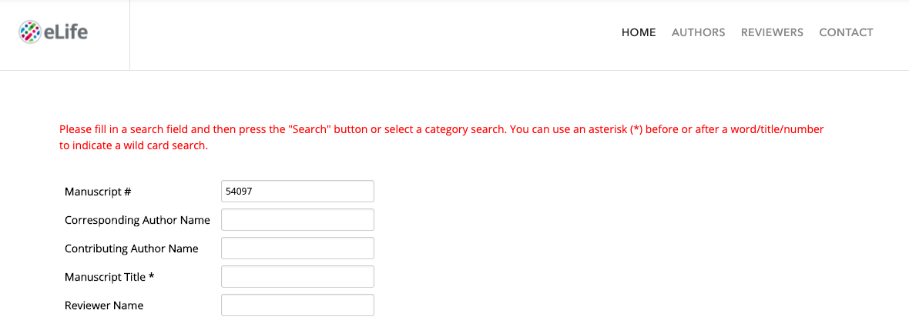
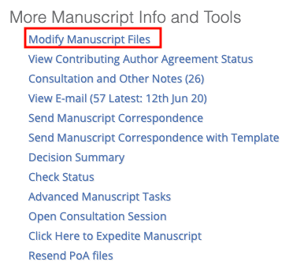
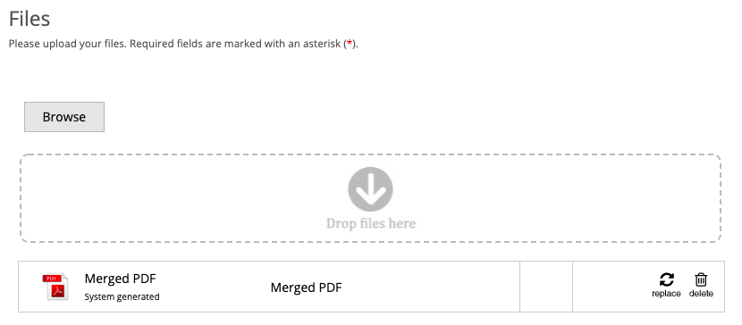
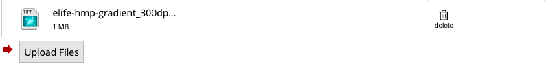
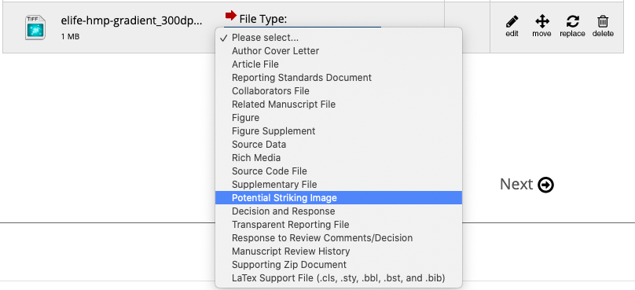
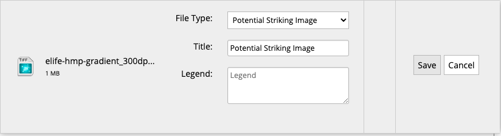
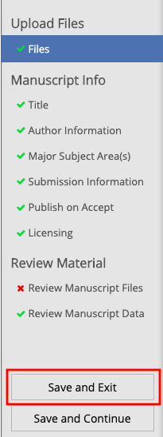

# Striking images

## What is a striking image?

Striking images may be used to highlight published articles on the eLife website's homepage and on social media. They do not appear in the article itself. 

Requirements for striking images:

* No images with graphs or text
* No cartoons, graphical abstracts or summary figures
* Colour photographs, microscopy images and illustrations work best \(examples [**here**](https://elifesciences.org/archive/2019)\) 
* Images should have strong visual impact and not be composed of more than one or two panels
* Images should be landscape and a minimum size of 1800 x 900 pixels

## Uploading striking images in Kriya

To attach a striking image to an article, download the image provided by the author, go to the article in the Kriya dashboard and click on 'Striking image'. 

When the uploader appears, select the file and then click on 'Update'. Leave the 'metacontent' as is, unless the authors have provided a caption or attribution information in which case these should be entered instead. 

After clicking on 'Update' the uploader will not automatically close. You will need to refresh the page. Double-check the article in the dashboard to make sure the 'Striking image' button is now green.

## Uploading striking images in eJP

If the article is not yet in Kriya, look it up in eJP. 

Scroll down and click on the correct entry \(should say 'Accept full submission' in the last column\).

On the right hand side, under 'More manuscript info and tools', click on 'Modify manuscript files'.

Drag and drop the striking image into the uploader:

Scroll down to the end of the list of files and click on 'Upload files'. 

Once it has uploaded, select 'Potential striking image' as the file type.

Enter a title and legend/attribution information if the authors have provided this information. Otherwise, leave these fields as they are and click on 'Save'.

On the left hand side, click on 'Save and exit'.  

The striking image will then be exported with the article in the next export cycle. 

## Uploading striking images to the bucket

If an article already has a striking image but the authors would like to add another, and it has already been exported to Kriya, the image will need to be uploaded straight to the striking image bucket. To do this, open the elife-striking-images bucket in Cyberduck \(or similar program\) and search for the manuscript number. 

Open this folder and drag and drop the new striking image in to upload it. Make sure the striking image is titled appropriately - e.g. '56754-b\_striking\_image' if there is already a '56754-a\_striking\_image'. If the authors have provided a title, caption, or attribution information, enter this into a .txt file and save with the same title \(i.e. '56754-b\_striking\_image'\). If they have not provided this information, enter 'metacontent' in the .txt file and save with the same title. Drag this into the folder as well to upload it.

