# Archiving code

## Overview

Any code that has been specifically written as part of the work reported in an eLife paper should be made freely accessible under an open-source license. This allows readers to replicate the results using the same tools the authors used. As authors may continue to develop their code in the future, eLife archives the version that exists at the point of publication at [**Software Heritage**](https://www.softwareheritage.org/). Only code that has been created for the specific work should be archived.

It is usually possible to work out whether a repository needs to be archived based on the context.

### Context checklist

* Code mentioned in the Data Availability Statement \(e.g. “All analysis code has been made available on GitHub \([**https://github.com/learning-memory-and-decision-lab/NassarBrucknerFrank\_eLife\_2019**](https://github.com/learning-memory-and-decision-lab/NassarBrucknerFrank_eLife_2019)\).”\) should usually be archived.
* If one of the authors of the paper also authored the code, this usually indicates that it was generated for the work and should be archived.
* Code that is mentioned in the text only and referred to as being a ‘package’ is unlikely to have been created for this specific work and therefore doesn’t need to be archived \(unless it is a custom package\). Adding a [**software reference**](../article-details/content/references/software-references.md#how-to-add-a-software-reference) would be more appropriate in these cases. See [**below**]() for examples of this.
* Any references to custom code or software usually indicates it needs to be archived. 
* If the repository is years old, this usually indicates that the code should not be archived as it probably was not created specifically for the paper.
* Code described in Tools and Resources articles usually does not need to be archived as there will be no results to replicate using it. However, there are some cases where this will be required \([**see below**](archiving-code.md#when-to-fork-code-in-tools-and-resources-papers)\). 

## Checklist for archiving repositories

1. [**Should the repo should be archived?**](archiving-code.md#context-checklist)
2. [**Is the repo public and does it contain code?**](archiving-code.md#check-whether-the-code-is-present-and-public)
3. \*\*\*\*[**Does the correct version of the code already exist at Software Heritage?**](archiving-code.md#check-whether-the-correct-version-of-the-code-already-exists-at-software-heritage)
4. If it does not, [**archive code at Software Heritage**](archiving-code.md#how-to-archive-code-in-software-heritage)**.**
5. \*\*\*\*[**Add the SWHID to the article text to indicate where the copy is archived**](archiving-code.md#add-the-swhid-to-the-article-text)**.**
6. \*\*\*\*[**Add a software reference for the repository**](../article-details/content/references/software-references.md#how-to-add-a-software-reference)**.**
7. \*\*\*\*[**Add an author query to indicate the repo has been archived, text updated, and \(if appropriate\) ask the authors to add a license/readme.**](archiving-code.md#add-an-author-query)\*\*\*\*

## Check whether the repo contains code and is public

Visit the URL provided in the text. If you see a 404 page such as this:

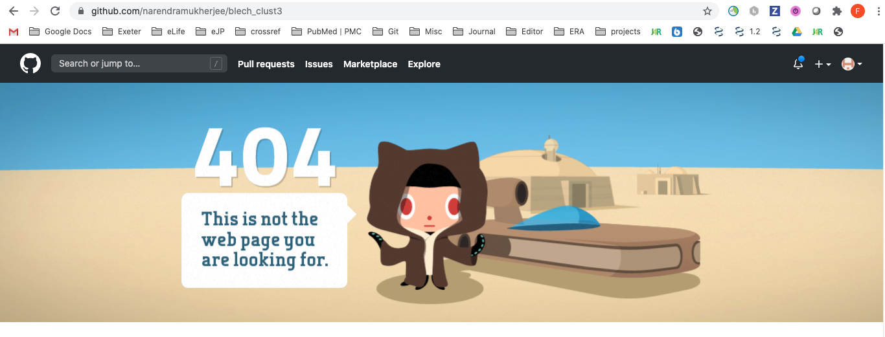

first determine whether there's a typo in the URL. If there's no typo and you cannot determine the correct repo, then add the following author query:

* Please ensure that all scripts/data/code \(as necessary\) are added to this repository, and that it is publicly available. We would also like to ask you to license the contents of the repo \(we would recommend using an open source license \[https://opensource.org/licenses\]\). Guidance on what license might better suit you can be found at https://choosealicense.com/ and instructions on how to add a license to a GitHub repository are available here https://help.github.com/articles/adding-a-license-to-a-repository/. Once your code has been committed and licensed, we will archive it at Software Heritage.

The same action should be taken if the repo is empty

All the other steps in the process will have to wait until the authors have responded and acted upon this query.

## Check whether the correct version of the code already exists at Software Heritage

If the repo contains code and is public, go to the [**Software Heritage archive**](https://archive.softwareheritage.org/)**:**

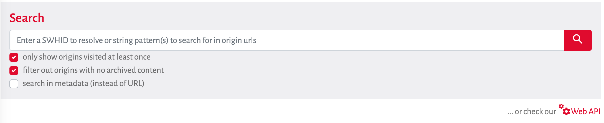

Untick 'only show origins visited at least once' and 'filter out origins with no archived content', and enter the URL for the repo containing the code. 

If there are no results, this indicates that the code has yet to be archived. Follow the steps [**below**](archiving-code.md#how-to-archive-code-in-software-heritage) to do so. 

If it's already archived it will appear in the results. Check that the result is the correct repo and the most up-to-date version of that repo \(by comparing the latest commit date\). If the latest version of the code is archived, the next step is to [**add the SWHID to the article**](archiving-code.md#add-the-swhid-to-the-article-text).

If the code is not the latest version, follow the steps [**below for archiving code**](https://app.gitbook.com/@elifesciences/s/productionhowto/~/drafts/-MIxO7WNOziUlsqSYqlV/toolkit/archiving-code#how-to-archive-code-in-software-heritage).

### Example of an older version that is archived

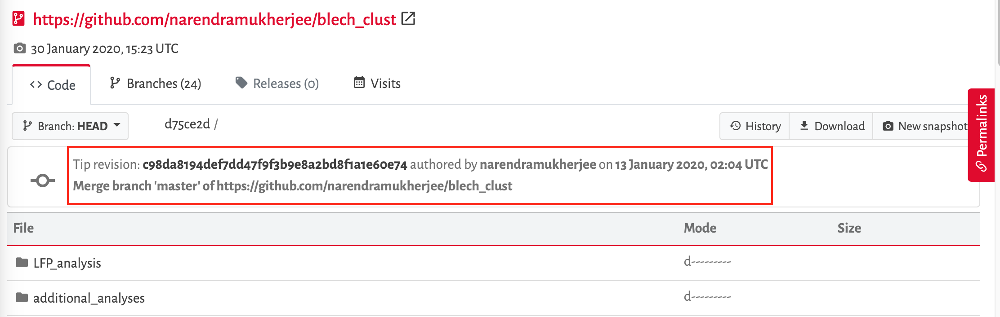

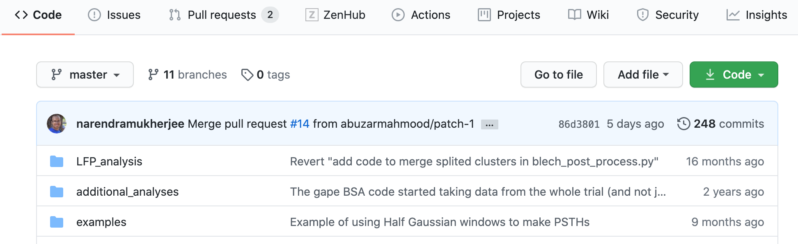

## How to archive code in Software Heritage

From the [**search page**](https://archive.softwareheritage.org/)**,** click 'Save code now' in the left-hand panel:

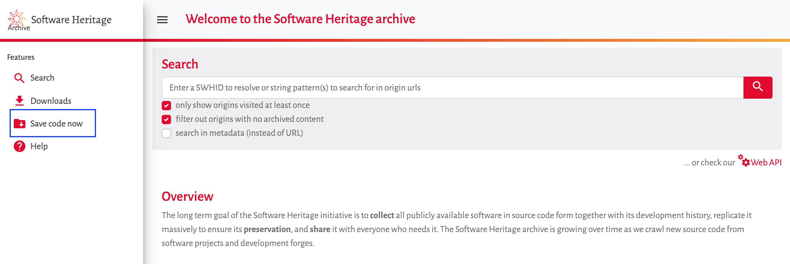

This can also be done if looking at a particular repo in Software Heritage:

### If the code is in GitHub or GitLab

* Visit the [**save code now page**](https://archive.softwareheritage.org/save/).
* ensure the origin type is 'git' and enter the URL in the 'origin url' field

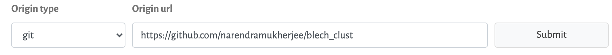

* Click Submit. You should see a green message pop-up:

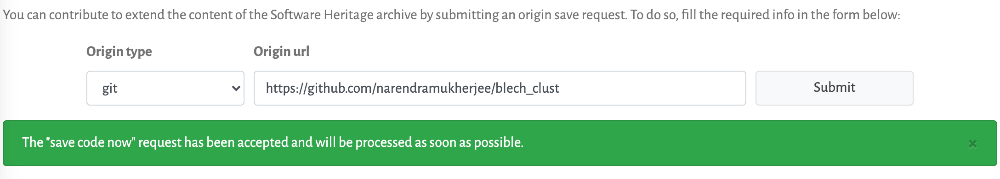

* The status of the archiving can be seen in the '[**Browse save requests**](https://archive.softwareheritage.org/save/#requests)' tab:

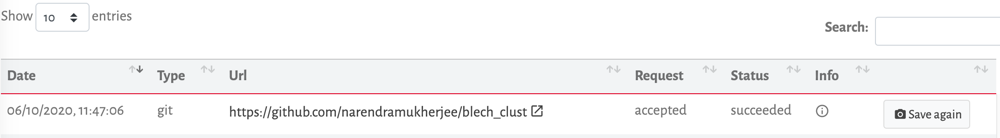

The time this process takes is dependent on the contents of the repo, but on average for new repos it may take around 2 hours. Updating repos should be much quicker \(although again this is dependent on the nature of the update\).

### If the code is not in GitHub or GitLab

If the code is stored elsewhere, then you will need to determine what revision control system is used. Bitbucket, Assembla, and SourceFourge all offer other version control in addition to Git, so this will have to be determined from the repo itself.

Any code with git-based revision control systems can follow [**the workflow above**](archiving-code.md#if-the-code-is-in-github-or-gitlab).

Any code with mercurial-based revision control systems can follow [**the workflow above**](archiving-code.md#if-the-code-is-in-github-or-gitlab), but with the caveat that 'hg' instead of 'git' is selected as the Origin type.

Any code with subversion-based revision control systems can follow [**the workflow above**](archiving-code.md#if-the-code-is-in-github-or-gitlab), but with the caveat that 'svn' instead of 'git' is selected as the Origin type.

Any code that does not use git, mercurial or subversion, will need to be deposited in a different way. Software Heritage are able to accept these kinds of deposits, but eLife does not have the functionality setup to do this yet.

If you are unable to determine which revision control system is used, add an author query:

* Per eLife policy we would like to archive your code on Software Heritage. In order for us to do so, we need to know what revision control system is used in the repo. Please confirm this \(for example, git, mercurial, subversion etc.\).

## **Add the SWHID to the article text**

Software Heritage Identifiers \(SWHID\) are unique and persistent ids used to reference code. They can reference a specific line of code, file, repo, and version of code. For our purposes we want to point to a specific version of a whole repo \(or repos\).

To get a SWHID for a repo, click the 'Permalinks' sidebar tab \(on the right-hand side of the page\):

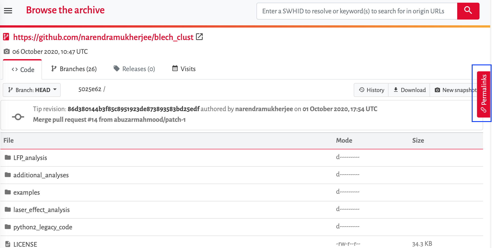

Click the revision tab in the sidebar, and **untick** 'Add contextual information':

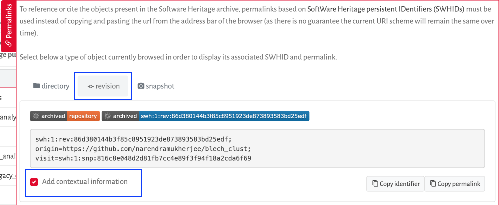

We want to add the abbreviated SWHID to the text with an embedded link to the archived version.

### Add the SWHID to the appropriate place in the text

The authors may have referred to their code in the article text and/or in the data availability statement. 

* If a link to a repository is included the data availability statement, always add the text 'copy archived at XXXXXX', replacing 'XXXXXX' with the hyperlink to the archived code on Software Heritage.


We cannot include embedded hyperlinks in data availability statements in Kriya 1.5, so the full URL has to be included instead of the SWHID with the embedded link.



If the archiving at Software Heritage takes a long time, and as a result the SWHID cannot be added yet, do not hold the article to wait until this has been completed \(unless just before publication\). Instead add the following text in the article:

> copy archived at \[URL to be added\]

`[URL to be added]` can then be replaced at a later stage \(such as at PAV or Publisher Review\) with the SWHID.


* If it is included in the article text, you only need to add this text the first time it is mentioned \(note, this needs to be done for each separate repository link if there are multiple\). The authors may only have included this link in their Key Resources Table so make sure the new link is added there if this is the case.

  If the authors have only referred to the code in the data availability statement, add the following query:

  * Please add a mention of your code to the main text of your article so we can add it to your reference list.

* A software reference also needs to be added in the main article \(see [**here**](../article-details/content/references/software-references.md) for how to do this\) - this should only be done after the code has been archived. Please note software citations can't be added in the data availability statement.

**Example**

> Our spike sorting code is freely available at [https://github.com/narendramukherjee/blech\_clust](https://github.com/narendramukherjee/blech_clust) \([Mukherjee, 2019](https://elifesciences.org/articles/45968#bib60); copy archived at [swh:1:rev:86d380144b3f85c8951923de873893583bd25edf](https://archive.softwareheritage.org/swh:1:rev:86d380144b3f85c8951923de873893583bd25edf/)\).


SWHIDs can be appended to 'https://archive.softwareheritage.org/' in order to obtain the hyperlink to the resource the SWHID points to


## Add an author query


This should only be done before author proofing. It is unnecessary to add this query after author proofing.


Now that the code has been archived an author query needs adding to let the authors know what has occurred and to ensure that the code is presented with best practice.

The following should be requested from the authors \(if they aren't already present\):

* An open source license for their code \(see [**below**](archiving-code.md#how-to-determine-whether-a-repo-has-an-open-source-license) for how to determine this\).
* A README.md file including a link to the eLife paper.

One of the following four author queries should be added, depending on whether the repo contains any of the above:

If the repo has neither a license or a readme with a reference to the eLife article, add the following author query:

* Per eLife policy, we have archived your code at Software Heritage and updated the text and Data Availability Statement to reflect this. Please confirm that you are happy with the revised wording. Please also ensure that your repo has a README.md file containing a reference to your eLife paper. Finally, please ensure it is licensed with an open source license \[https://opensource.org/licenses\]. Guidance on what license might better suit you can be found at https://choosealicense.com/ and instructions on how to add a license to a GitHub repository are available here https://help.github.com/articles/adding-a-license-to-a-repository/.

If the repo has a license, but no readme containing a reference to the eLife paper, add the following author query:

* Per eLife policy, we have archived your code at Software Heritage and updated the text and Data Availability Statement to reflect this. Please confirm that you are happy with the revised wording. Please also ensure that your repo has a README.md file containing a reference to your eLife paper.

If the repo has a readme with a reference to the eLife article, but no license, add the following author query:

* Per eLife policy, we have archived your code at Software Heritage and updated the text and Data Availability Statement to reflect this. Please confirm that you are happy with the revised wording. Please also ensure that your repo is licensed with an open source license \[https://opensource.org/licenses\]. Guidance on what license might better suit you can be found at https://choosealicense.com/ and instructions on how to add a license to a GitHub repository are available here https://help.github.com/articles/adding-a-license-to-a-repository/.

If the repo has both a readme with a reference to the eLife article, and a license, add the following author query:

* Per eLife policy, we have archived your code at Software Heritage and updated the text and Data Availability Statement to reflect this. Please confirm that you are happy with the revised wording.

## Troubleshooting

### How to determine whether a repo has an open-source license

For GitHub repositories, the licensing information, if available, can be seen in the 'About section' \(see below\). If this icon is not present, double-check the repository for a file with 'LICENSE' in the name or check the 'README' file which may include licensing information.

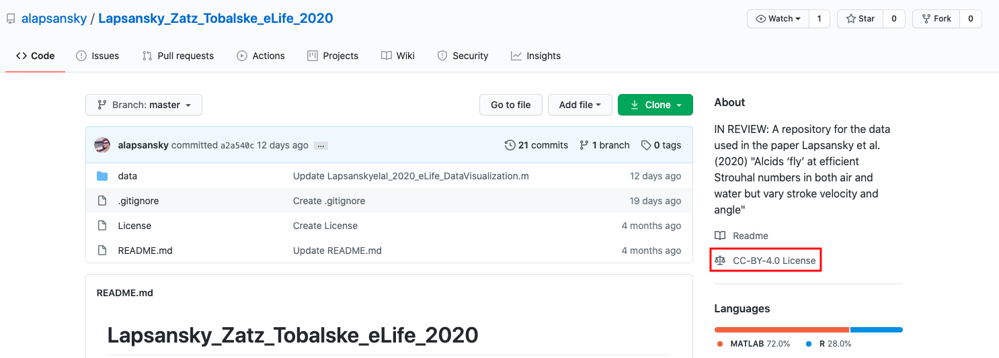

You can check whether a license is open-source by clicking on it. In the above example, clicking on the MIT license brings up this information: 

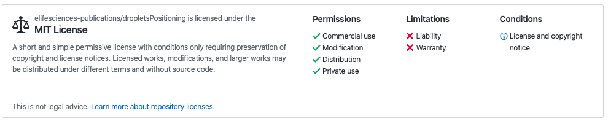

If the license allows free use, modifications and distribution, it is an open-source license.

The following are all commonly used open-source licenses:

* \*\*\*\*[**Apache License 2.0**](https://opensource.org/licenses/Apache-2.0)\*\*\*\*
* \*\*\*\*[**BSD 3-Clause "New" or "Revised" license**](https://opensource.org/licenses/BSD-3-Clause)\*\*\*\*
* \*\*\*\*[**BSD 2-Clause "Simplified" or "FreeBSD" license**](https://opensource.org/licenses/BSD-2-Clause)\*\*\*\*
* \*\*\*\*[**GNU General Public License \(GPL\)**](https://opensource.org/licenses/gpl-license)\*\*\*\*
* \*\*\*\*[**GNU Library or "Lesser" General Public License \(LGPL\)**](https://opensource.org/licenses/lgpl-license)\*\*\*\*
* \*\*\*\*[**MIT license**](https://opensource.org/licenses/MIT)\*\*\*\*
* \*\*\*\*[**Mozilla Public License 2.0**](https://opensource.org/licenses/MPL-2.0)\*\*\*\*
* \*\*\*\*[**Common Development and Distribution License**](https://opensource.org/licenses/CDDL-1.0)\*\*\*\*
* \*\*\*\*[**Eclipse Public License version 2.0**](https://opensource.org/licenses/EPL-2.0)\*\*\*\*

### Examples of code that doesn't need to be **archived**

Often, authors will include links or references to software they have used in their studies. These do not need to be archived if they were not generated specifically for the paper. In the example below, none of the GitHub repositories linked need to be archived, as they are references to software that is already available. They should be added as [**software references**](../article-details/content/references/software-references.md#how-to-add-a-software-reference) instead.

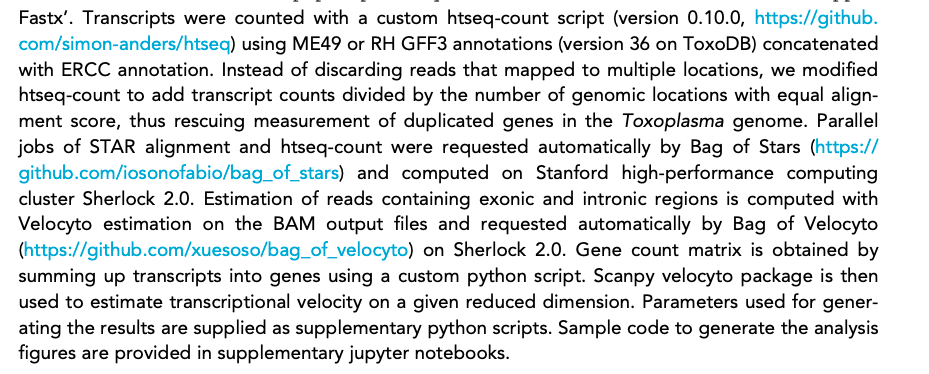

### Previously forked or archived repos

Sometimes, authors will refer to code that has been forked or archived for a previous eLife article. While rare, this case occurs most commonly in research advances. No action is required unless the code has been updated since the previous publication. For example, in 55159:

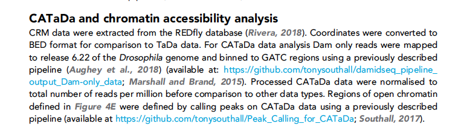

Comparing the forked/archived repositories to the ones that are linked in the article shows that the code has not been updated \(see below, note both repositories were last updated 2 years ago\). Therefore, the repository doesn't need to be archived. Instead, [**software references**](../article-details/content/references/software-references.md#how-to-add-a-software-reference) should be added. 

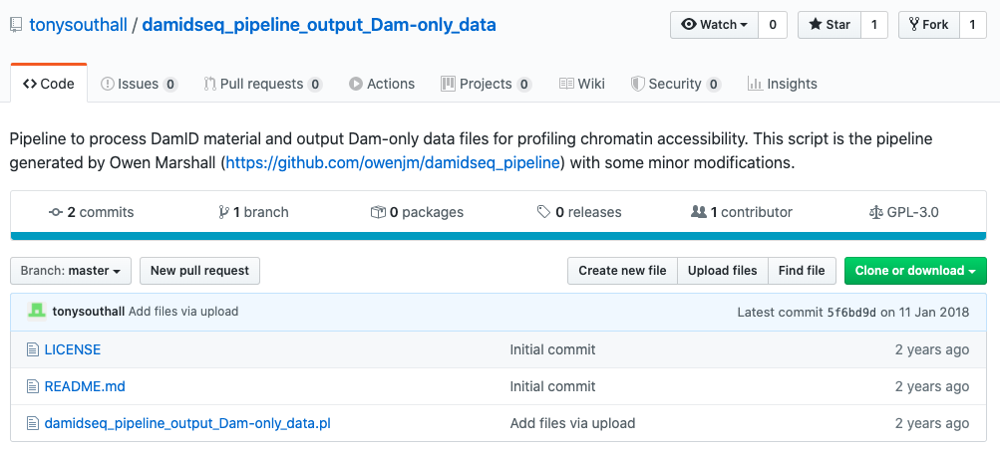

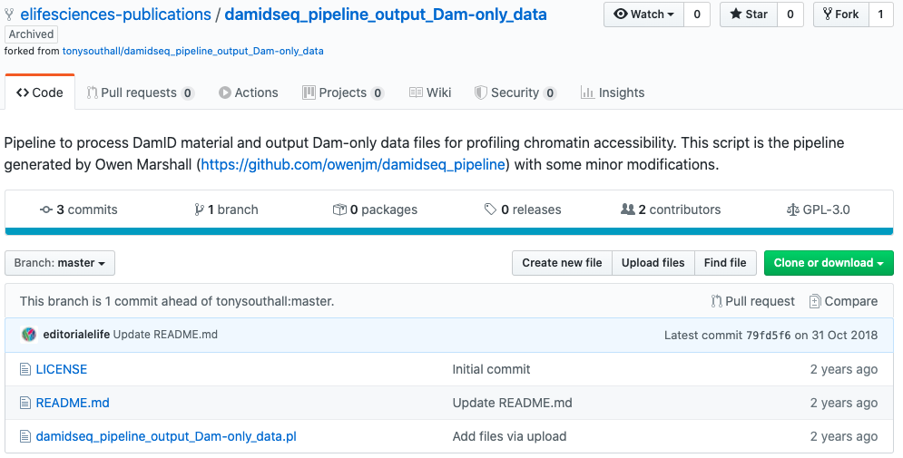

The same is true for archived code.

However, if the code has been updated since the fork/archival, then it should be re-archived at Software Heritage, and the text should be updated by following the steps from the top of [**the checklist**](archiving-code.md#checklist-for-archiving-repositories).

If someone else’s code has been modified for an eLife paper, this code should not be archived. A [**software reference**](../article-details/content/references/software-references.md#how-to-add-a-software-reference) to the original code should be added however.

### If a link to a GitHub user is provided

Sometimes authors provide a link to a GitHub user account instead of a specific repository, as in 52658 below:

* All data have been uploaded to https://github.com/horwitzlab.

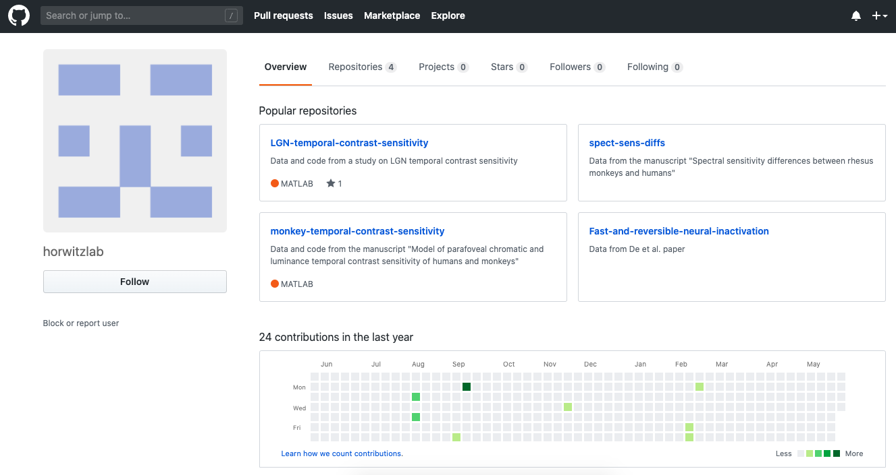

As this does not link to a specific repository, the code cannot be archived. We need the authors to confirm which repository holds the code for the study. Please leave the following author query:

* Please confirm which repositories contain the code for this paper. 

### If code is hosted on an institutional website

Sometimes authors will upload their code to an institutional or lab website. For example, in 54983:

> A comprehensive and curated sequence library was prepared querying the Blastp web server and using a custom Python script \([http://dfns.u-shizuoka-ken.ac.jp/labs/proeng/librarycuration.html](http://dfns.u-shizuoka-ken.ac.jp/labs/proeng/librarycuration.html)\), which exhibited more than 30% sequence identity with E. coli BirA \(EU08004.1\).

The link here is to an institutional website:

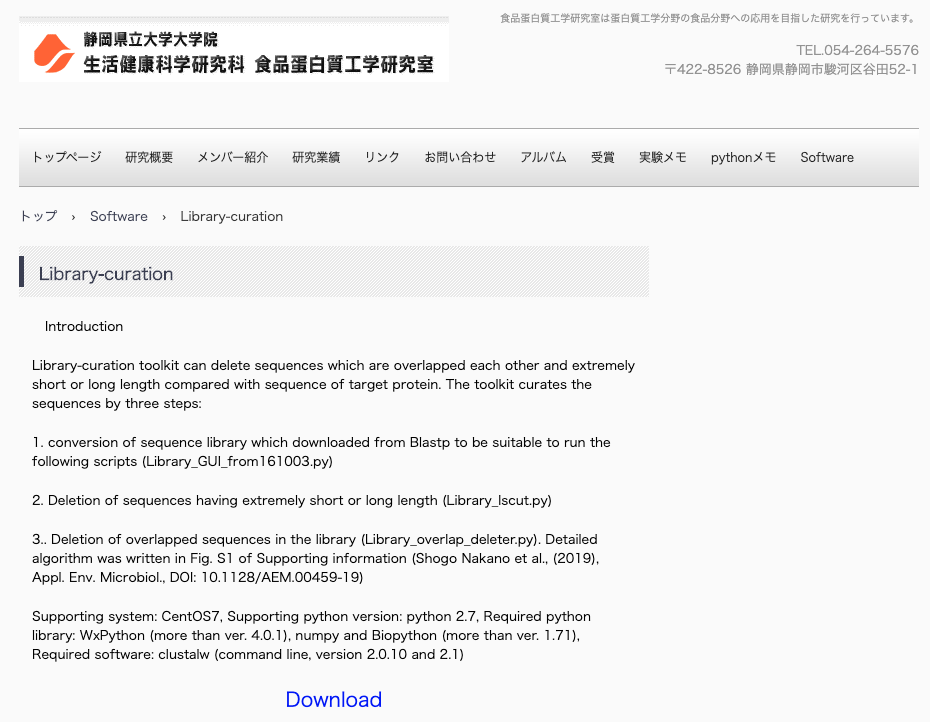

As it is not possible to archive this, the following query needs to be left:

* We see that you have included a custom script hosted on a lab website. In the interests of transparency and reproducibility, please upload this to a dedicated software repository \(such as GitHub, GitLab etc.\) and ensure that the software is licensed with an open source license \[https://opensource.org/licenses\]. We can provide guidance for you if required. Once your code has been uploaded and licensed, we will archive it at Software Heritage.

If the link to the code is not to a GitHub/GitLab/SourceForge/Bitbucket repository, and instead to a lab/institution website \(which will usually have the lab's name in the title of the website or on the page\), the above query should be added.

### When to archive code in Tools and Resources papers

If the repository has the same name as the tool being described in the paper, this usually indicates that it should not be archived. For example the data availability statement of 51322 states:

> All data \(schematics, soft- and hardware documentation\) for constructing the MaCaQuE or equivalent systems is made available via GitHub: [https://github.com/sensorimotorgroupdpz/MaCaQuE](https://github.com/sensorimotorgroupdpz/MaCaQuE).

The abstract of this paper states:

> We present an experimental environment \(Reach Cage\) and a versatile visuo-haptic interaction system \(MaCaQuE\) for investigating goal-directed whole-body movements of unrestrained monkeys.

As this paper describing the MaCaQuE system, and the code is for constructing this system, it does not need to be archived.

However, if data was analysed in the paper as in the example below, the linked repositories should be archived. 

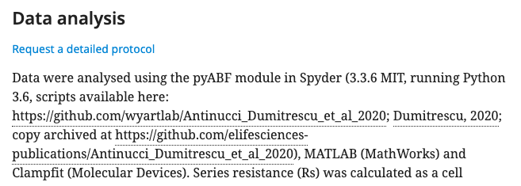

### If no links or source code files are provided

If authors refer to custom code but there is no link to this and no source code has been provided, please leave the following query:

* We notice that you refer to custom but it seems this hasn't been provided. Please send source code files to production@elifesciences.org, or upload the code to a dedicated software repository \(such as GitHub, GitLab etc.\) and ensure it is licensed with an open source license \[https://opensource.org/licenses\]. Guidance on what license might better suit you can be found at https://choosealicense.com/ and instructions on how to add a license to a GitHub repository are available here https://help.github.com/articles/adding-a-license-to-a-repository/. Once your code has been licensed, we will archive it at Software Heritage.

## Schematron checks

The following tests relate to software that may need to be archived.

#### **code-fork-info**

**Warning**: _Article possibly contains code that needs forking. Search - XXXXXX_

**Action**: This warning will appear if the following words are present: github, gitlab, codeplex, sourceforge, bitbucket or assembla. 'XXXXXX' in this warning will be one of these words. If this warning fires, it may indicate there is code which needs to be archived. [**See above**]() to determine whether this is necessary. If the code was specifically written as part of the work reported, it should be archived and a software reference should be added \([**see above**]()\). If it is previously published code please query the author to provide full citation details:

* eLife follows the FAIR principles for software and data citation. Please provide the full bibliographic details \(author\(s\), year, full title, publisher, version, URL\) for this software so that it can be added to the reference list. 

#### ext-link-child-test-3

**Error**: _ext-link - XXXXXX - contains the phrase 'copy archived', which is incorrect._

**Action**: This error will appear if the phrase 'copy archived' is included in the hyperlink to the archived repository. 'XXXXXX' in this error message will be the text which has hyperlink formatting. When pasting in the SWHID link, make sure only the url is hyperlinked. 

#### final-missing-url-test

**Warning**: _XXXXXX element contains the text 'URL to be added' - XXXXXX. If this is a software heritage link, then please ensure that it is added. If it is a different URL, then it may be worth querying with the authors to determine what needs to be added._

**Action**: This will fire at post-author stages for any paragraph or table cells containing the text URL to be added. As detailed above, if the archiving of code takes a long time, then articles should not be held to wait for this process to finish. Instead, the text `[URL to be added]` should be included and the article should proceed in the production process. After author proofing, the code should have become archived, and so the SHWID can be added to the text. Replace the text `[URL to be added]` with the SWHID containing an embedded hyperlink. The code can be found by searching the original repo hyperlink in the Software Heritage archive.

If the text is unrelated to any code archiving process \(for example if it was present in the original manuscript, and not updated during author proofing\), then the eLife production team should query the authors asking what content should be included at Pub review.

