# Fixing Crossref/Dryad failures


For changelog, click [**here**](fixing-crossref-dryad-failures.md#changelog). Last updated 20/11/2020.


## What is Crossref? 

Crossref is most commonly known for registering Digital Object Identifiers \(DOIs\) for research outputs, making them easier to locate and cite. DOIs allow the reader to follow a stable link straight to the content even when a URL has changed. Crossref DOIs begin with '10.', followed by a publisher's unique 4 digit number and a slash \(eLife's is 7554/\). Following that each publisher assigns a unique set of characters to each DOI they publish, eLife uses eLife.XXXXX where XXXXX is the manuscript number assigned to an article in eJP. For example: 10.7554/eLife.58603.

DOIs are deposited at the point the article is loaded to Continuum if the publication date is today or in the past, or at the start of the day matching the publication date. If the article has been PoA'd, the metadata deposited with Crossref is enhanced with the full-text information available from the final VoR publication. Each time an article is published the metadata is sent to Crossref so any mistakes are overwritten and any additional information published is added to the Crossref record. When content is sent to Continuum with a future date, for instance press content, the DOI will be registered at midnight the day before publication. 

## Crossref emails

Production receives Crossref emails for both PoA and VOR articles that are sent for publication on Continuum. 

There are two types of Crossref email - those for registering the DOI and reference list for an article, and those for registering the peer review materials \(decision/response Crossref submission\).

The Crossref submission emails for registering the DOI and reference list typically look like this: 

Whereas the submission emails for the peer review materials typically look like this:

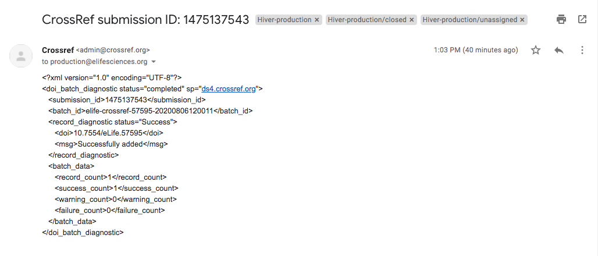

Each email needs to be checked to ensure there have been no failures. At the bottom of the email, you should look at the following section: 

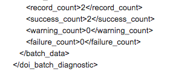

Great! There is no action needed when you see the above. 

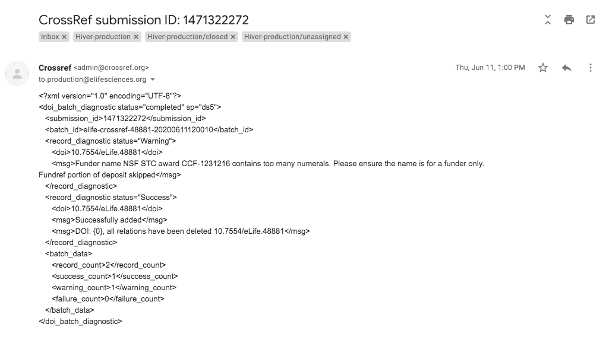

Occasionally, we may receive a warning email. The most common reason for this is where a funder name contains numerals or the name is too long, which Crossref flags as unusual. If the warning relates to a funder name, it is safe to assume this has already been checked by the time you are publishing the article, so this can be ignored.  

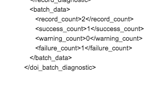

If any failures are listed, you will need to check the rest of the content of the email \(shown below\), which will outline where the failure has occurred.

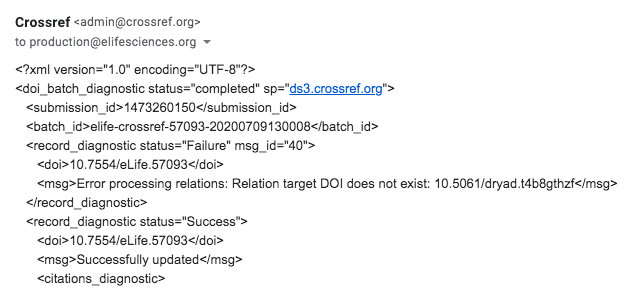

When sending content metadata to Crossref we list all citations within the article. In the case above, the DOI for the Dryad dataset that was referenced in the article was not live yet when we sent the metadata to Crossref. As the Dryad DOIs are minted by Crossref too, their system automatically checks whether the cited DOI exists in their system and if it does not, fails our submission. This is one of our most common failures. It is a Catch-22, Dryad do not release datasets to view and hence register their DOIs until the article which they are about is published. We submit Crossref metadata just before publication. If the article has been PoA'd and there is a failure for the VOR article, check in case we have not sent the citation details to Crossref, so Dryad can know the article their dataset is linked to is published. Sometimes even if we have sent the notification that the article has been accepted, Dryad might not have released the data by the time of VOR. There can be a lag in their system, which can vary. 

## What to do when a failure occurs \(Dryad\)

To correct Dryad failures, you must first set up the transformation scenario \(this only needs to be done once\) in Oxygen \(an XML editor\). To do this, please visit [**here**](oxygen.md) for guidance. 

Once this has been set up, you can correct failures in the blink of an eye. When a failure occurs, you need to download the XML and carry out the procedure below. Note, the transformation scenario will only work for Dryad failures. 

## Replacing the XML at Crossref \(Dryad\)

* Go to the Crossref admin page: [**https://doi.crossref.org/servlet/useragent?func=showHome**](https://doi.crossref.org/servlet/useragent?func=showHome) ****and log in \(please ask Production for these credentials\). 
* Select ‘Submission administration’.
* Search for the DOI number with no restrictions, which will bring up the list of submissions processed by Crossref. Recent errors will be highlighted with a red ‘E’ symbol:

* Locate the article that has failed.
* Right/ctrl click on the file icon to the right of the ID \(blue text\) and click ‘Save link as’. When you download a file it automatically downloads with the filename `submissionAdmin.xml`. 
* Now open the XML file using your XML editor, such as Oxygen.
* In the top toolbar, click configure transformation scenarios \(or press cmd + shift + t\).
* Tick the scenario you setup \(see [**above**](fixing-crossref-dryad-failures.md#what-to-do-when-a-failure-occurs)\).
* Click 'Apply associated \(1\)'.

This process will remove the failure and create a new XML file.

**Pro tip:** Next time, you only have to press cmd + shift + t and it will do the work for you 🕺 

**Now navigate back to Crossref to complete the following:** 

* Return to the admin page and select the 'Upload' tab.
* Select the corrected XML file and click the 'upload' icon. 

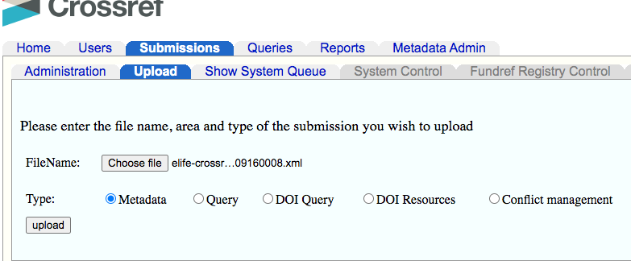

* Go back to the admin page and search without restriction to bring up the whole queue again, it should now be at the top. Be aware that the old failure will still remain.
* Look out for the success Crossref email to come through. 

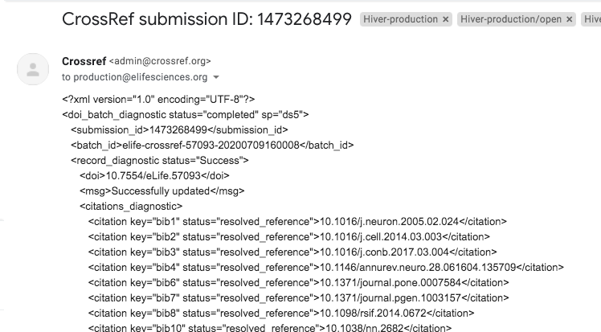

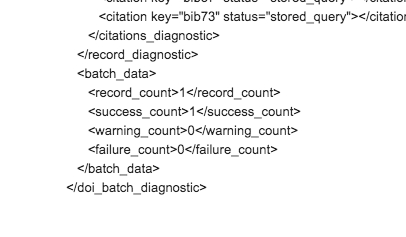

This has now been resolved. Unfortunately, this does mean that the citation to the Dryad dataset will not be registered with Crossref but a manual workaround is not desirable.

## What to do when a failure occurs \(non-Dryad\) 

Occasionally, we receive Crossref failures that are not related to Dryad. Depending on the nature of the error, this often requires a manual fix. 

Some failures alert us to issues within the proof such as a duplicate ORCID ID. This could occur due to a user error during the submission of the article or during proofing.

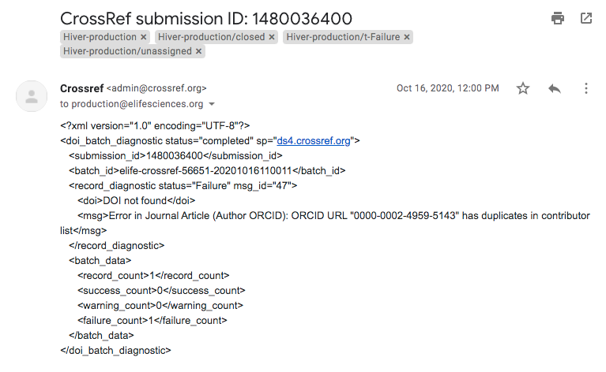

In the case above, the proof had to be sent back to Exeter so they could remove the duplicated ORCID ID. You may wish to email the author in case they would like to add in the correct ORCID ID. The article can then be resent to Continuum and we should receive a success email from Crossref. 

Other failures can be a result of a non-Dryad dataset which is not yet live. This often occurs when an article is PoA'd and has included a DOI to a dataset that has been held for publication.

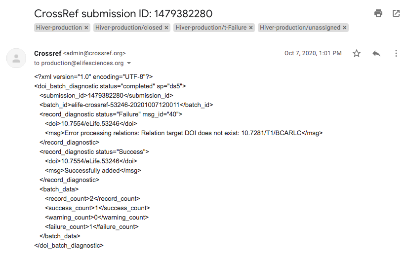

These type of failures are resolved in a similar way to a Dryad failure, however we do not have a scenario in Oxygen set up for these, as they can vary, so this must be removed manually as shown [**below**](fixing-crossref-dryad-failures.md#replacing-the-xml-at-crossref-non-dryad). 

## Replacing the XML at Crossref \(non-Dryad\)

* Go to the Crossref admin page: ****[**https://doi.crossref.org/servlet/useragent?func=showHome**](https://doi.crossref.org/servlet/useragent?func=showHome) and log in \(please ask Production for these credentials\). 
* Select ‘Submission administration’.
* Search for the DOI number with no restrictions, which will bring up the list of submissions processed by Crossref. Recent errors will be highlighted with a red ‘E’ symbol:

* Locate the article that has failed.
* Copy the filename and right/ctrl click on the file icon to the right of the ID \(blue text\). Click ‘Save link as’ and paste the old filename into the 'Save As:' field. When running the Dryad scenario, Oxygen will automatically change this name for you as Crossref will reject any files with duplicated names. This will need to be changed manually in this instance so you will need to change the filename so that the time is in the future \(this only needs to be an hour or so\) and click save. 
* Open the XML file using your XML editor, such as Oxygen.
* You also need to update the timestamp and doi\_batch\_id elements within the XML for the same reason as above \(duplicated file names\). These can be found at the top of the file:

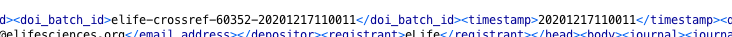

* Update the timestamp string in both elements so that it is later than in the originally submitted file. It is good practice to make the new timestamp about 10-15 minutes in the future relative to when you are editing the file. So, this would now look as follows:

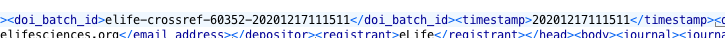

* Now it is time to remove the DOI causing the failure. Using the Find/Replace function in Oxygen, search for the DOI in the Crossref failure email.

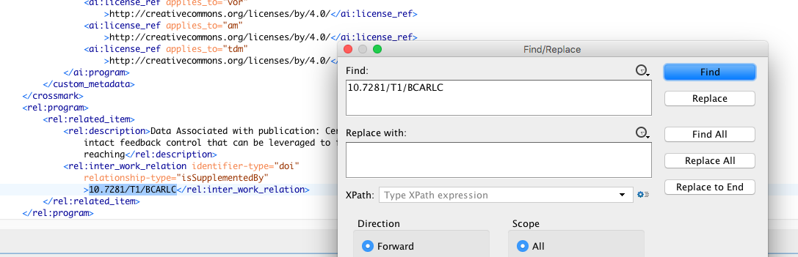

* **Please note,** the XML has been formatted for training purposes, this should not be done normally. 
* You will see the troublesome DOI highlighted. Double click on the `<rel :program>` tag that the DOI is located within to highlight the block of tagging that we need to remove. 

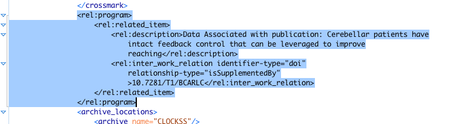

* Delete this using your backspace button \(or whatever works for you\) and save the file. 

#### Now navigate back to Crossref to complete the following: 

* Return to the admin page and select the 'Upload' tab.
* Select the corrected XML file and click the 'upload' icon. 
* Go back to the admin page and search without restriction to bring up the whole queue again, it should now be at the top. Be aware that the old failure will still remain.
* Look out for the success Crossref email to come through. 

## Changelog

#### 20/11/2020

#### Changes

* Adding how to fix non-Dryad crossref failures.

