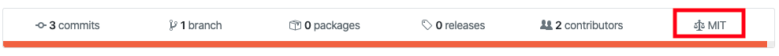
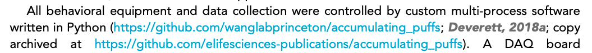
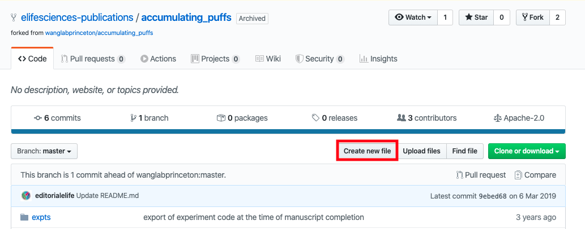
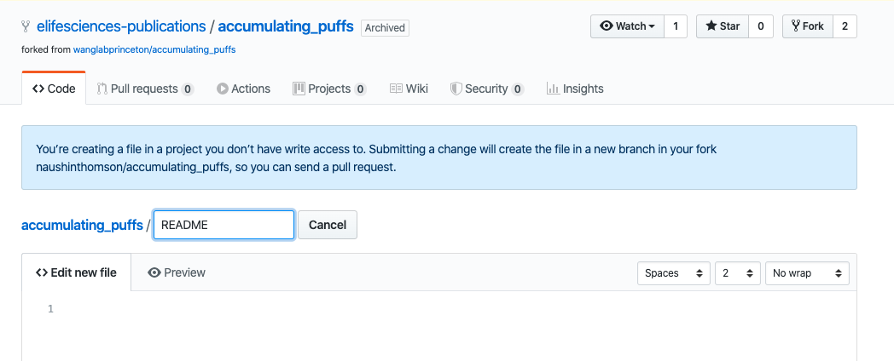
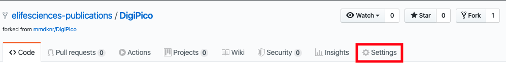
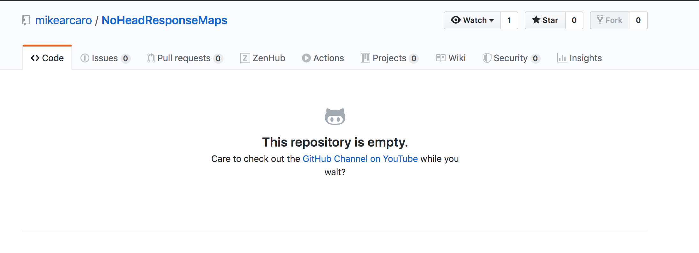

# When and how to fork repositories

## Overview

Any code that has been specifically written as part of the work reported in an eLife paper should be made freely accessible under an open-source license. This allows readers to replicate the results using the same tools the authors used. As authors may continue to develop their code in the future, eLife forks \(clones\) the version that exists at the point of publication to a GitHub account for archiving purposes. Only code that has been created for the specific work and has an appropriate license can be forked.

It is usually possible to work out whether a repository needs to be forked based on the context:

* Code mentioned in the Data Availability Statement \(e.g. “All analysis code has been made available on GitHub \([https://github.com/learning-memory-and-decision-lab/NassarBrucknerFrank\_eLife\_2019](https://github.com/learning-memory-and-decision-lab/NassarBrucknerFrank_eLife_2019)\).”\) should usually be forked.
* If one of the authors of the paper also authored the code, this usually indicates that it was generated for the work and should be forked.
* Code that is mentioned in the text only and referred to as being a ‘package’ is unlikely to have been created for this specific work and therefore doesn’t need to be forked \(unless it is a custom package\). Adding a [software reference](../article-details/content/references/software-references.md#how-to-add-a-software-reference) would be more appropriate in these cases. See [below](forking-git-based-repos.md#examples-of-code-that-doesnt-need-to-be-forked) for examples of this.
* Any references to custom code or software usually indicates it needs to be forked. 
* If the repository is years old, this usually indicates that the code should not be forked as it probably was not created specifically for the paper.
* Code described in Tools and Resources articles usually does not need to be forked as there will be no results to replicate using it. However, there are some cases where this will be required \([see below](forking-git-based-repos.md#when-to-fork-code-in-tools-and-resources-papers)\). 

## Checklist for forking repositories

1. [Make sure the repository has an open-source license](forking-git-based-repos.md#checking-licenses)
2. [Fork the code to elife-sciences-publications \(import code if needed\)](forking-git-based-repos.md#fork-the-code-to-elife-sciences-publications)
3. [Add the new URL to the article text to indicate where the copy is archived](forking-git-based-repos.md#adding-the-new-url-to-the-article)
4. [Add a software reference for the repository](../article-details/content/references/software-references.md#how-to-add-a-software-reference)
5. [Add an author query to indicate the repo has been forked and text has been added](forking-git-based-repos.md#add-an-author-query-to-indicate-the-repo-has-been-forked)
6. [Add the eLife paper reference to the README of the forked repository](forking-git-based-repos.md#add-the-elife-paper-reference-to-the-readme-of-the-forked-repository)
7. [Archive the forked repository](forking-git-based-repos.md#archiving-the-forked-repository)

## Make sure the repository has an open source license

Only software with an open-source license can be forked. For GitHub repositories, the licensing information, if available, can be seen in the toolbar \(see below\). If this icon is not present, double-check the repository for a file with 'LICENSE' in the name or check the 'README' file which may include licensing information.

You can check whether a license is open-source by clicking on it. In the above example, clicking on the MIT license brings up this information: 

If the license allows free use, modifications and distribution, it is an open-source license, and the repository can be forked. 

The following are all commonly used open-source licenses:

* [Apache License 2.0](https://opensource.org/licenses/Apache-2.0)
* [BSD 3-Clause "New" or "Revised" license](https://opensource.org/licenses/BSD-3-Clause)
* [BSD 2-Clause "Simplified" or "FreeBSD" license](https://opensource.org/licenses/BSD-2-Clause)
* [GNU General Public License \(GPL\)](https://opensource.org/licenses/gpl-license)
* [GNU Library or "Lesser" General Public License \(LGPL\)](https://opensource.org/licenses/lgpl-license)
* [MIT license](https://opensource.org/licenses/MIT)
* [Mozilla Public License 2.0](https://opensource.org/licenses/MPL-2.0)
* [Common Development and Distribution License](https://opensource.org/licenses/CDDL-1.0)
* [Eclipse Public License version 2.0](https://opensource.org/licenses/EPL-2.0)

If there is no license, please add the following author query \(if the code is not on GitHub, please remove the text "...and instructions on how to add a license to GitHub…"\):

* We notice that you have made your code available but it seems it hasn't been licensed. Software without a license cannot be safely integrated, modified and redistributed. With this in mind, we would like to ask you to license your code \(we would recommend using an open source license \[https://opensource.org/licenses\]\). Guidance on what license might better suit you can be found at https://choosealicense.com/ and instructions on how to add a license to a GitHub repository are available here https://help.github.com/articles/adding-a-license-to-a-repository/. Once your code has been licensed, we will fork it to our own GitHub repository for archiving purposes.

## Fork the code to elife-sciences-publications

If an open-source license is present, the next step is to fork the code. Make sure you are logged in to  a GitHub account that has permission to fork to elife-sciences-publications and follow the link to the author's repository. For eLife staff, this is the Production GitHub, and for Exeter this is XXXXXX. Then, click on 'Fork' \(circled below\) and select 'elife-sciences-publications'.

The forking process will then begin. When it is complete, you will be taken to the new page in the eLife Science Publications repository with the forked code.

### Importing code from other repositories

Sometimes, authors will upload their code to repositories other than GitHub \(e.g. GitLab or Bitbucket\). In these cases, the code will need to be imported to eLife's repository. 

From the [eLife repository](https://github.com/elifesciences-publications), follow these steps: 

* Create a new repository by clicking the 'New' button on the right.
* Give the repository a name. Either use the name the authors have given or use the article number if this is not available.
* At the bottom, click 'Create repository', ignoring all other fields including 'description'.
* On the next page, click the very last option 'Import code from another repository' \(see below\).

* Enter the url of the repository you want to clone into the 'Your old repository's clone URL'.
* Click on 'Begin Import'. The rest will be done for you. If there are any errors at this stage, please alert the Production team who will contact the development team.

## Add the new URL to the article text to indicate where the copy is archived

Once a repository has been forked or imported, we need to include the forked link in the article. The authors may have referred to their code in the article text and/or in the data availability statement. 

* If a link to a repository is included the data availability statement, always add the text 'copy archived at XXXXXX' with the new link to the forked repository in place of 'XXXXXX'. 
* If it is included in the article text, you only need to add this text the first time it is mentioned \(note, this needs to be done for each separate repository link if there are multiple\). The authors may only have included this link in their Key Resources Table so make sure the new link is added there if this is the case.
* If the authors have only referred to the code in the data availability statement, add the following query:
  * Please add a mention of your code to the main text of your article so we can add it to your reference list.
* A software reference also needs to be added in the main article \(see [here](../article-details/content/references/software-references.md) for how to do this\) - this should only be done after the code has been licensed and forked. Please note software references can't be added in the data availability statement.

## Add an author query to indicate the repo has been forked and text has been added

The next step is to leave an author query to indicate that the repository has been forked:

> Per eLife policy, we have forked your GitHub code in order to archive it in our own repository and have updated the text and Data Availability Statement to reflect this. Please confirm that you are happy with the revised wording.

This query should be left in both the Data Availability Statement section and the main article. If the authors have referred to the repository multiple times in the main article, you can just leave the query for the first instance.

## Add the eLife paper reference to the README of the forked repository

The next step is to indicate which eLife paper the forked repository relates to. If the repository contains a README file, check whether it already contains a link to the eLife paper. We need to include the first author's surname, title of the paper and URL. An example where the authors already included this information is below:

> This code is associated with the following publication: Capitanio, JS; Montpetit, BM; Wozniak, RW. "Human Nup98 regulates the localization and activity of DExH/D-box helicase DHX9" The corresponding author for the work is Prof. Richard W. Wozniak, Department of Cell Biology, Faculty of Medicine and Dentistry, University of Alberta, Canada. Available at http://doi.org/10.7554/eLife.18825, eLife, 2017.

If this information is not given in the README, click on the file README.md file \(not .txt\) in the **forked repository** \(not in the original one\). 

Click on the pencil to edit the text

Click on the text box and enter the following text: 

> This code is associated with the paper from \[**Insert first author's surname**\] et al., "\[**Insert title of paper**\]". eLife, \[**Insert year**\]. http://doi.org/10.7554/eLife.\[**Insert DOI**\]

Please note, the year to enter is the year the article was first published \(this may have been as a POA\).

If it looks like the above example, click on 'Commit changes' to save. You don't need to enter anything in the other boxes. 

If there is no README file, you should be alerted to this by a message from GitHub. A README will need to be created. To do this, go back to the forked copy of the repository and click on 'Create file.'

You can then enter the title as 'README' and proceed with the steps outlined above. 

## Archive the forked repository

The final step is to archive the forked repository. Once the code is forked and the README has been updated with the article details, click on the Settings tab.

Scroll down to the 'Danger Zone'  and click on 'Archive this repository'. 

The following window will pop up:

Enter the name of the repository \(in the example above, this would be 'Orbital-Tracking-Zebrafish2019-'\) and click to confirm you understand the consequence of archiving. The repository will become read-only and any further changes will not be possible unless it is un-archived by reversing this step. This is the final step.

## Examples of code that doesn't need to be forked

Often, authors will include links or references to software they have used in their studies. These do not need to be forked if they were not generated specifically for the paper. In the example below, none of the GitHub repositories linked need to be forked, as they are references to software that is already available. They should be added as [software references](../article-details/content/references/software-references.md#how-to-add-a-software-reference) instead.

Sometimes, authors will refer to code that has been previously forked. This code does not need to be forked unless it has been updated since the previous time. For example, in 55159:

Trying to fork these repositories brought up these messages: 

Comparing the forked repositories to the ones that are linked in the article shows that the code has not been updated \(see below, note both repositories were last updated 2 years ago\). Therefore, the repository doesn't need to be forked again. Instead, [software references](../article-details/content/references/software-references.md#how-to-add-a-software-reference) should be added. 

If someone else’s code has been modified for an eLife paper, this code should not be forked. A [software reference](../article-details/content/references/software-references.md#how-to-add-a-software-reference) to the original code should be added however.

## How to delete accidentally forked repositories

If a repository is forked in error \(because the code was not generated specifically for the manuscript - see examples [here](../article-details/content/funding-information.md#examples-of-when-to-ignore-pay-attention-to-the-schematron-messages)\), it should be deleted. Click on the slides below for instructions on how to do this.



## When to fork code in Tools and Resources papers

If the repository has the same name as the tool being described in the paper, this usually indicates that it should not be forked. For example the data availability statement of 51322 states:

> All data \(schematics, soft- and hardware documentation\) for constructing the MaCaQuE or equivalent systems is made available via GitHub: [https://github.com/sensorimotorgroupdpz/MaCaQuE](https://github.com/sensorimotorgroupdpz/MaCaQuE).

The abstract of this paper states:

> We present an experimental environment \(Reach Cage\) and a versatile visuo-haptic interaction system \(MaCaQuE\) for investigating goal-directed whole-body movements of unrestrained monkeys.

As this paper describing the MaCaQuE system, and the code is for constructing this system, it does not need to be forked.

However, if data was analysed in the paper as in the example below, the linked repositories should be forked. 

## If no links or source code files are provided

If authors refer to custom code but there is no link to this and no source code has been provided, please leave the following query:

* We notice that you refer to custom but it seems this hasn't been provided. Please send source code files to production@elifesciences.org, or upload the code to a dedicated software repository \(such as GitHub, GitLab etc.\) and ensure it is licensed with an open source license \[https://opensource.org/licenses\]. Guidance on what license might better suit you can be found at https://choosealicense.com/ and instructions on how to add a license to a GitHub repository are available here https://help.github.com/articles/adding-a-license-to-a-repository/. Once your code has been licensed, we will fork it to our own GitHub repository for archiving purposes.

## If a repository is empty

Sometimes authors will provide a link to a repository where they plan to upload the code for their paper, but haven't done so yet. For example, in 53798 at pre-editing, the data availability stated:

> Custom scripts and data to reproduce figures will be deposited to GitHub \(https://github.com/mikearcaro/NoHeadResponseMaps\).

Clicking this link led to an empty repository:

For cases like these, please leave the following query:

* Please ensure that all scripts/data/code \(as necessary\) are added to this repository, and that it is publicly available. 

If the repository also has no license, please also add the following query \(you can just leave one query with the text of the two merged\):

* We would also like to ask you to license the contents of the repo \(we would recommend using an open source license \[https://opensource.org/licenses\]\). Guidance on what license might better suit you can be found at https://choosealicense.com/ and instructions on how to add a license to a GitHub repository are available here https://help.github.com/articles/adding-a-license-to-a-repository/. Once your code has been committed and licensed, we will fork it to our own GitHub repository for archiving purposes.

## If code is hosted on an institutional website

Sometimes authors will upload their code to an institutional or lab website. For example, in 54983:

> A comprehensive and curated sequence library was prepared querying the Blastp web server and using a custom Python script \([http://dfns.u-shizuoka-ken.ac.jp/labs/proeng/librarycuration.html](http://dfns.u-shizuoka-ken.ac.jp/labs/proeng/librarycuration.html)\), which exhibited more than 30% sequence identity with E. coli BirA \(EU08004.1\).

The link here is to an institutional website:

As it is not possible to fork this, the following query needs to be left:

* We see that you have included a custom script hosted on a lab website. Where possible, we strongly prefer that software is uploaded to dedicated software repositories \(such as GitHub, GitLab etc.\) in the interests of transparency and reproducibility. Would you be willing to do so, and ensure that the software is licensed with an open source license \[https://opensource.org/licenses\]? We can provide guidance for you if required. Once your code has been licensed, we will fork it to our own GitHub repository for archiving purposes.

If the link to the code is not to a GitHub/GitLab/SourceForge/Bitbucket repository, and instead to a lab/institution website \(which will usually have the lab's name in the title of the website or on the page\), the above query should be added.

## Schematron warnings

The following tests relate to software that may need to be forked.

#### **code-fork-info**

**Warning**: _Article possibly contains code that needs forking. Search - XXXXXX_

**Action**: This warning will appear if the following words are present: github, gitlab, codeplex, sourceforge, bitbucket or assembla. 'XXXXXX' in this warning will be one of these words. If this warning fires, it may indicate there is code which needs to be forked or imported. [See above](forking-git-based-repos.md#examples-of-code-that-doesnt-need-to-be-forked) to determine whether this is necessary. If the code was specifically written as part of the work reported, it should be forked and a software reference should be added \(see above\). If it is previously published code please query the author to provide full citation details:

* 
#### ext-link-child-test-3

**Error**: _ext-link - XXXXXX - contains the phrase 'copy archived', which is incorrect._

**Action**: This error will appear if the phrase 'copy archived' is included in the hyperlink to the forked repository. 'XXXXXX' in this error message will be the text which has hyperlink formatting. When pasting in the forked repository link, make sure only the url is hyperlinked. 

## Changelog

### 13/05/2020

#### Added

* Section: 'How to delete accidentally forked repositories'

### 14/05/2020

#### Added

* Sections: 'If no links or source code files are provided' and 'If no links or source code files are provided'

