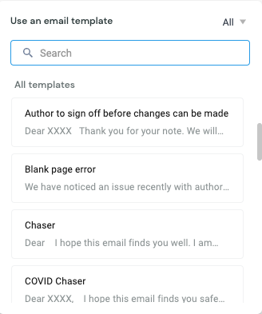

# Interacting with authors

Most of our interaction with the authors of eLife articles happens via email. It is important to ensure that queries from authors are responded to in a timely manner, so authors are kept informed about the stage of their article. There are many email templates saved in the production collaboration tool \(Hiver\) which can be used when drafting responses to authors. 

## Common queries 

Most of the emails we get from authors fall into the following categories:

* [**Striking images**](interacting-with-authors.md#striking-images)\*\*\*\*
* \*\*\*\*[**Updated figures or files**](interacting-with-authors.md#updated-figures-or-files)\*\*\*\*
* \*\*\*\*[**Problems editing proofs**](interacting-with-authors.md#problems-editing-proofs)\*\*\*\*
* \*\*\*\*[**Problems accessing proofs**](interacting-with-authors.md#problems-accessing-proofs)\*\*\*\*
* \*\*\*\*[**Revised proof requests**](interacting-with-authors.md#revised-proof-requests)
* \*\*\*\*[**Extensions to proofing deadline**](interacting-with-authors.md#extensions-to-proofing-deadline)\*\*\*\*
* \*\*\*\*[**Adding ORCIDs**](interacting-with-authors.md#adding-orcids)\*\*\*\*
* \*\*\*\*[**Proof/publication date estimation**](interacting-with-authors.md#proof-publication-date-estimation)\*\*\*\*
* \*\*\*\*[**Corrections and new versions**](interacting-with-authors.md#corrections-and-new-versions)\*\*\*\*
* \*\*\*\*[**Press**](interacting-with-authors.md#press)\*\*\*\*

## Striking images

Often authors will send striking images by email instead of including these in the initial submission. For guidance on what to do with these, [**see here**](striking-images.md). Once you have uploaded striking images, make sure to let the author know you have done this \(there is a template email for this\). 

## Updated figures or files

Often authors will respond to the proofing email they get to let us know any issues they face with the system, or to send us updated figures and supplementary files that we have asked for. Download these files and compress them in a zip folder. You can then attach this in the note for the corresponding article on the Kriya dashboard, and ask Exeter to update the files. [**See here**](kriya-1.md#adding-notes) for instructions on adding notes to articles. 

After doing this, let the authors know that the files will be updated in the final version of their article. If the proofs are still signed out with them, let them know that they will need to submit the proofs before the files can be replaced \(there is a template for this\). 

## Problems editing proofs

Often authors will email because they are unable to make changes to their proofs. This may be because they are using the wrong browser or there is a bug in the system. If possible, try to instruct the authors on how they can make the changes themselves, with screenshots if appropriate \(e.g. how to respond to queries so they can progress to the next tab in the proofs\). If the changes are few and straightforward enough \(e.g. fixing a typo or adding a figure citation\), you can jump in and fix these for the author \(select the 'publisher check' option on the Kriya dashboard and access the proofs this way - but make sure the author is not logged in when you do this\). Otherwise, you can list the changes in the notes of the article for Exeter or eLife to address once the authors return the proofs. If the changes are extensive, the email should be forwarded on to Exeter with the subject prefix 'Author correspondence: XXXXX' \(where XXXXX is the article number\) so they can make the changes at the post-author validation stage \(see more about tagging and prefixing emails [**here**](managing-the-production-inbox.md#tags-and-prefixes)\). Make sure the author knows which course of action you are taking \(there are various email templates for this\). 

## Revised proof requests

Often authors will ask to see their proofs again once any issues they noticed have been fixed. Unless the authors have had serious problems with using the Kriya interface, proofs should be sent back to the authors in the system instead of sending revised PDFs. This just gives us more complete data about the time each article spends at each stage.

## Problems accessing proofs

If authors have problems accessing their proofs, make sure they are using Google Chrome and if there are still issues, you can ask for a screenshot of what they see when they try to log in. This can then be forwarded on to Exeter to investigate. 

## Extensions to proofing deadline

If authors email to ask for extra time to proof their article, we need to let them know that they may still receive automatic reminder emails. There is a template email for this. Once you have sent this, make sure to leave a comment in the note for the article in Kriya so staff know that the article will be delayed. 

## Adding ORCIDs

Often authors will ask for ORCIDs to be added to manuscripts on behalf of other authors. Unfortunately, due to ORCIDs stipulations, we cannot do this. The only way for an ORCID to be linked to a manuscript is for the author to access the proofs using the link we send them. There is an email template to let authors know this. 

## Proof/publication date estimation

If authors want to know when they will receive their proofs, or when their article will be published, we need to first check what stage the article is at. 

* If an article has recently been added to Kriya and the decision letter has yet to be added, it will usually take up to two weeks before this is ready to go to the authors. 
* If an article is waiting for a digest, check the [**digest status list**](https://docs.google.com/spreadsheets/d/17Llag-aEnbuARu5ORDJFki4K73xzy1fz2B2XG_QHQPI/edit#gid=1376331906) to see when this will be ready. The proofs will automatically be sent to the authors once this is uploaded by the Features team. Usually decision letters will be added before the digests are ready.
* Once an article has arrived at publisher review, it should be ready to publish on the same day, unless there are issues to correct or the authors want to see revised proofs \(or the article is getting press coverage, in which case it should be scheduled for a pre-agreed press date\).

## Corrections and new versions

Some emails will be from authors who have noticed a mistake or problem in their published article. If the error affects the scientific conclusions of the article, a correction will need to be prepared. If there are errors in non-scientific content \(e.g.  affiliations, spelling of author names, author contributions\), a new version can be issued. Check the article to see what the problem is and if the error is due to eLife mistakes, make sure to apologise, and let the author know this will be updated as soon as possible. Once a new version has been published, let the author know.

## Press

Authors may email to let us know their institutions are preparing a press release. Our press officer, Emily, should be cc'd into these emails and the authors should be told that they can co-ordinate a release date with her. There is an email template for this. 

