# Managing the production inbox

## **Using Hiver**

The Production inbox is a shared inbox that everyone in the team has access to. We manage this inbox using a collaboration tool called Hiver. Hiver allows us to clearly divide up the workload by assigning emails to ourselves. It also allows us to categorise and track the types of emails we get by adding tags. When an email needs responding to it is ‘open’, when resolved it can be closed. An email can also be marked ‘pending’ if further action is needed, or its progress needs to be tracked.

The Hiver inbox can be seen on the left sidebar in Gmail. In the drop-down menu, you can view emails assigned to yourself/the rest of the team, as well as emails that have yet to be assigned, and pending emails. 

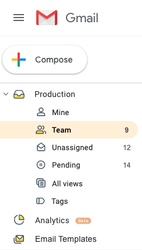

### **Assigning emails**

To assign an email from the inbox, select it and click on theicon. Then click on 'Select a user' and choose a name from the drop-down menu. 

You can also assign an email by opening the email and going to the Hiver toolbox on the right-hand side of the email. If this is not visible, click on the Hiver icon on the top-right Click on the 'Assigned to' drop-down menu.

The email will then be tagged with that user’s name and moved to their inbox. The rest of the team can still search for and access the email, however they will not be notified of any correspondence in that thread until it is unassigned and moved back to the general inbox.

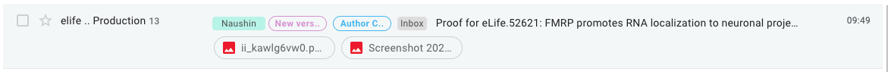

### **Changing the status of an email**

Similar to assigning emails, you can change the status of an email by selecting it in the main inbox view and clicking on the icon. This can also be done by opening the email and using the Hiver toolbox as before.

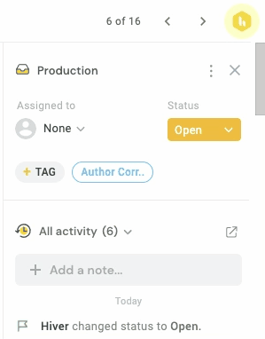

If an email requires no response or has been resolved it should be closed. You can also change the status of an email when replying to it. Click on the 'Send & Close' button to close the email after the reply has been sent, or choose one of the other options from this button. ‘Pending’ status should be used for emails that are waiting on further action from others, or need to be watched. You should still reply to authors if needed to keep them in the loop, even if only to let them know that we are looking into an issue. Marking an email as 'pending' moves it to the pending section of the inbox. This section should be reviewed weekly and emails here should followed up on as appropriate. Use the 'Send & Close & Unassign' if you want to close an email that was assigned to you, and need any subsequent replies to go into the main inbox.

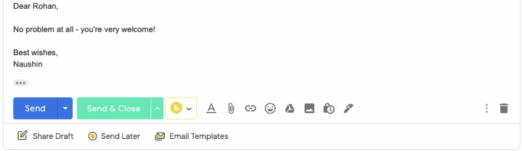

### Adding notes to emails

You can view an email’s history, and any notes that have been added to it \(as well as adding your own\) in the Hiver toolbox when you open an email.

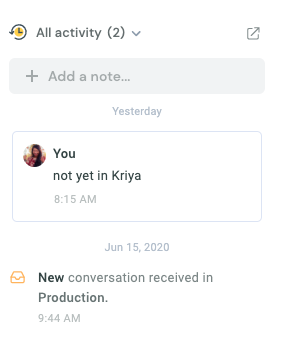

### **Hiver tags**

Hiver tags help us to categorise our emails, and to keep track of what we receive. Similar to assigning emails, you can add tags to an email by selecting it in the main inbox view and clicking on the icon. You can also do this after you have opened an email:

When tags are added, they appear in the inbox attached to the email. Each tag has a different colour, and you can add as many tags as needed. For example, in the screenshot below, emails containing tags for assigned users, New versions, Author correspondence and Author complaint:

Our tags:

* Author Complaint - for any negative emails/complaints from unhappy authors
* Author Compliment - for any complimentary emails from happy authors
* Author Correspondence - for any and all emails from authors
* eLife Query - for queries sent to us from Exeter
* Exeter Delivery - for the delivery note we receive from Exeter every morning
* Exeter Problem - for any problem emails we send to Exeter
* Exeter Question - for any questions/requests we ask of Exeter
* Failure - for any CrossRef/PMC/POA failures
* Features - for all correspondence regarding feature content
* Press - for any press-related emails
* New versions - for any published articles that need to be corrected \(PoA and VoR\)
* TNQ Correction - for any emails about articles requiring a TNQ correction \(correction for any articles published before November 2015 with our previous typesetters\)

### Exeter prefixes

Emails we send to Exeter should also be prefixed to help them categorise and filter emails at their end:

* Author Correspondence: This is for author emails we forward on to Exeter which contain changes that they should make during the Post-author validation stage.
* Problem: This is for when we encounter any issues using Kriya, or on articles that we cannot solve at our end
* Request: For any requests, such as asking Exeter to manually move an article between stages
* Praise: For providing any positive feedback, or forwarding on any complimentary author emails
* eLife Query: For any questions that they ask us. Sometimes these questions will be asked in Slack, and we will need to reply in email \(for example, if they ask us to provide a file\), so you will need to use the prefix.

You can see in the screenshots below how emails have both the subject prefix \(for Exeter’s use\), and the Hiver tag \(for ours\).

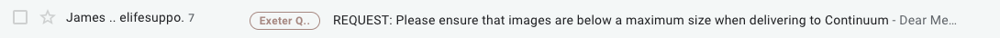

## **Email types**

There are many types of email that we receive on a regular basis. Many of these are automated and require a particular action each time. For more information about how to reply to common author emails, see [**here**](interacting-with-authors.md).

### **Crossref emails**

Crossref, the DOI registration agency, processes all of our DOIs and sub-DOIs when an article is sent to continuum. They then send us a report.

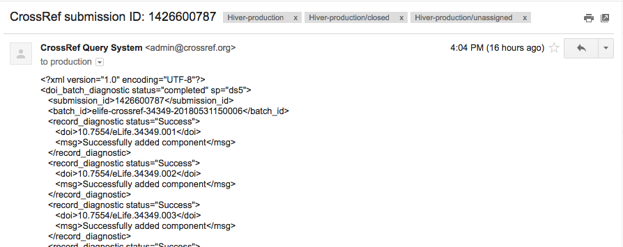

Scroll to the last 6 lines of the report. If there is anything in the ‘warning\_count’ or ‘failure\_count’ then action is needed. If all are zeros then it can be closed as all DOIs have successfully processed and registered.

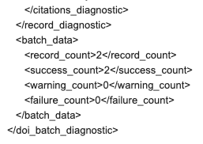

\(See ‘[**Crossref/Dryad failure protocol**’](https://docs.google.com/document/d/1TW71S4AIILFIknkXYz1Gxlxw5OJg8ycuivyVYkgyknE/edit) for instructions on resolving one of the common failures we get.\)

Every now and then we also get emails from Crossref to let us know about scheduled maintenance. These can just be closed. If they email to let us know their server is down, this email can be kept open for the duration of the outage so everyone on the team is aware of this.

### **Decision letter loading**

When the Editorial team uploads a decision letter via the decision letter API, we receive an email. 

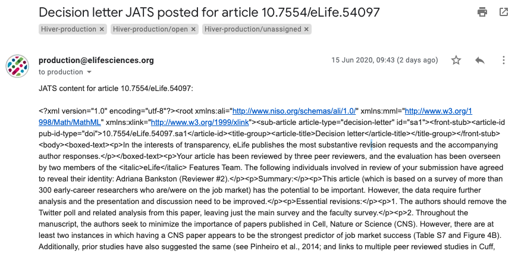

Wait five minutes or so and then check the decision letter has loaded on the Kriya dashboard.

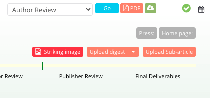

If the decision letter has loaded, this email can be closed. If the article is not yet in Kriya, this email should be left open until it is \(add a note to the email using Hiver\).

A decision letter may fail to load for the following reasons:

* Kriya is down \(we should still receive a success email\).
* The article has not yet been sent to Kriya \(we will receive a success email for this - not a failure one\). The decision letter should be reloaded once the article has been loaded to Kriya - this can be done by downloading and then re-uploading the zip on the AWS bucket.
* An article is currently in the 'Content loading' stage in Kriya. This will result in a failure email. Leave this email open and once the article has loaded to Kriya, re-upload the decision letter to the AWS bucket as above.
* Editorial have zipped up the files incorrectly. The failure message might say something like:

> \[No articles to check\]

Check that the files have been included as direct children of the zip, i.e. that a folder hasn't been included in the zip. If all the files are zipped correctly, then a GitHub issue should be raised in the eLife issues repository, and assigned to Graham to investigate.

* Other. If a failure message comes through and you are unsure what it means, it's possible that the content hasn't been parsed correctly by the parser. A GitHub issue should be raised in the eLife issues repository, and assigned to Graham to investigate.

### **Digest loading**

Similarly, we receive emails when a digest is uploaded to an article.

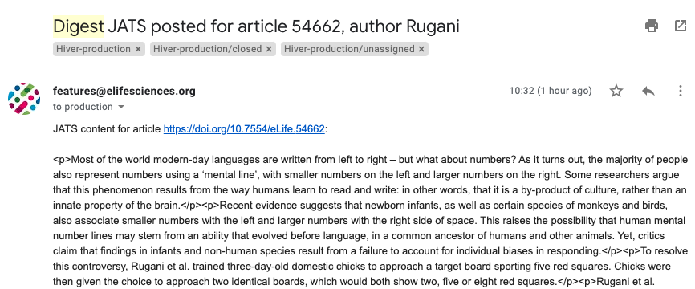

Just as before, these also need to be checked on Kriya five minutes after we receive the email before closing.

If a digest hasn't loaded, this is usually because Kriya is down \(or the article hasn't yet been loaded, but this is much less likely\). When Kriya is running again, or when the article has loaded, the digest will need to be re-uploaded to the AWS bucket. Digests may also not load because there is a problem with the files or parser - in this case, we'll need to raise a GitHub issue for Graham to investigate.

### GitHub/GitLab emails

The production team uses GitHub and GitLab to collaborate with other teams. When issues we are assigned to receive replies or when we are mentioned in issues, we receive emails to notify us. You can reply to these in GitHub or GitLab \(depending on which platform was used\). If you are unsure of what to do in response to the email, raise this in the daily Huddle meeting.

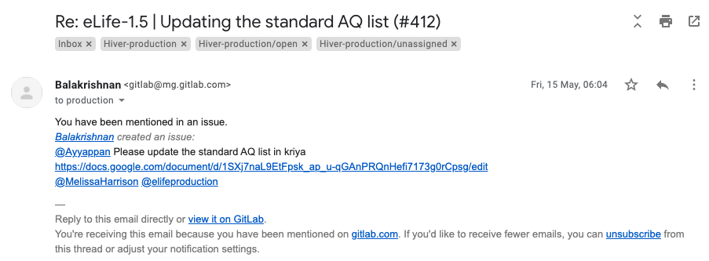

### **No-digest emails**

Every week \(usually on Wednesday or Thursday\), the Features team send us a list of the latest articles that are not getting digests. 

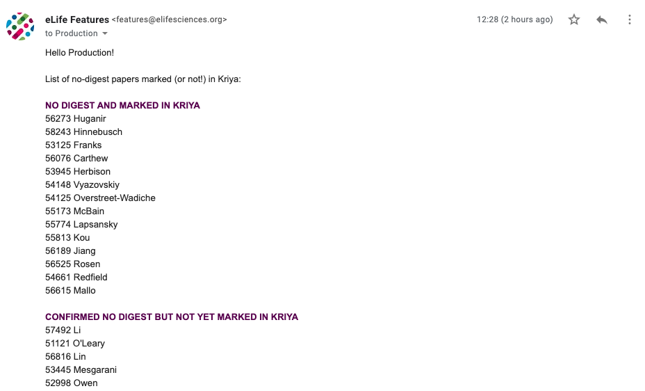

They will have already marked them as ‘no-digest’ articles in Kriya, however we need to check all of them to ensure that the labels have stuck because Kriya 1 can be unstable. Add the 'No digest' status to any that haven't had the label stick. If an article has been sent to the 'Waiting for assets' queue and has had its decision letter loaded, marking it as 'no-digest' will send it straight to the authors for proofing.

If the article is still waiting for its decision letter to be loaded, the [**decision letter tracking spreadsheet**](https://docs.google.com/spreadsheets/d/1oy8TIwsedSYdy6n3_SFuqUcJ4Ljeg7tXnTS6q2CsNI8/edit?ts=57fe457c#gid=0) will need to be updated so the Editorial team knows which decision letters should be prioritised. Search for the manuscript number and in the 'Notes' column, add the text 'No digest, please prioritise'. 

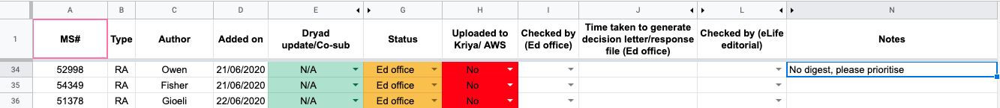

If the article is not yet in Kriya, add it to the [**Production actions sheet**](https://docs.google.com/document/d/1gWMKdmcl4i7EC_bHvrbpBcUKoXuMQ4WfrVDJ1HxQ0cc/edit?ts=56dd55b5) under the 'CONFIRMED NO DIGEST BUT NOT YET IN KRIYA' heading and update the 'last checked' date. This section of the sheet should be checked every day and once the article has loaded to Kriya, it should be marked as 'No digest'. 

### **Out of office responses**

We may receive 'out of office' response to the automatic proofing emails that are sent to authors. If the author is only out of office for a few days, these emails can be closed. If the author is on sabbatical, forward the proofing email to the other corresponding authors if there are any, or to the first author and cc in the author on sabbatical to check whether they will be able to review the proofs. If they will not, we may need to ask Exeter to manually move the proofs in house once the other authors have finished reviewing the proofs.

### **PMC failures**

Occasionally our contact at PMC will email us to let us know that one of our articles has failed on PMC. This is nearly always an XML error. It should be investigated, and if necessary, resupplied and sent to Exeter for silent correction to fix the error in the XML. We can usually pick up on these failures before we are contacted by PMC, as we receive a daily report of articles that have been loaded to them in the last 24 hours. If the status of each package is 'Passed-Sent to QA', this email can be closed.

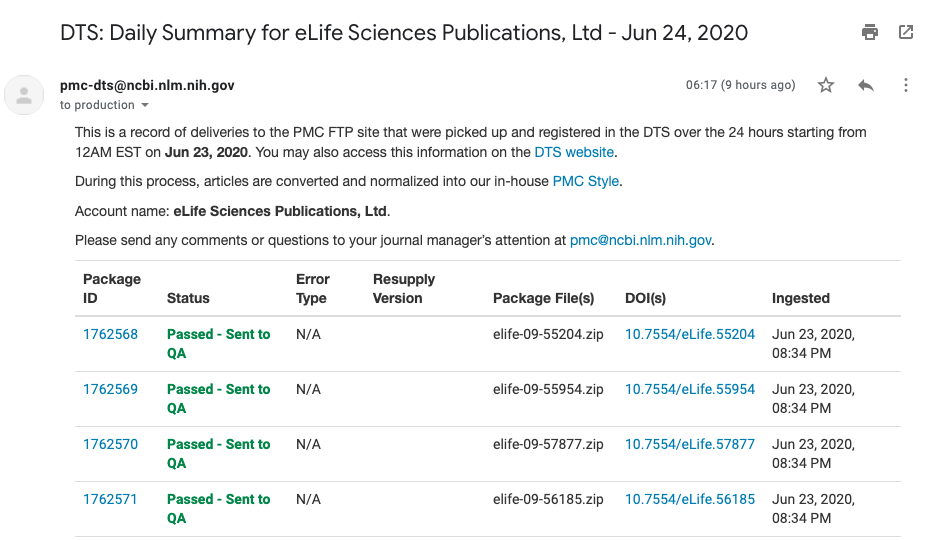

If the status of any of the packages indicates a failure, this will need to be investigated &lt;info to be added&gt;.

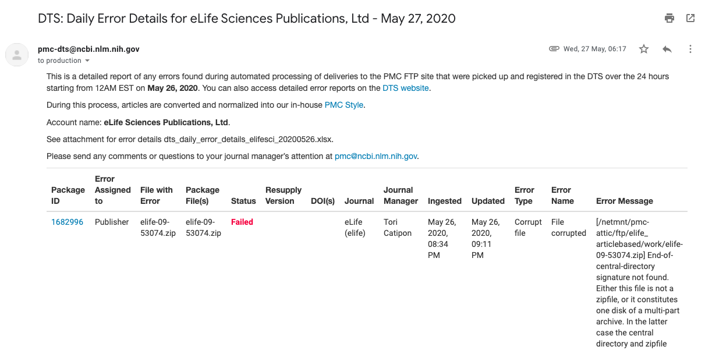

### **PoA package emails - success and failure**

We receive success or failure notifications for all articles that are scheduled for publication as PoAs by the bot. Every day, a member of the production team will handle these emails. The editorial office will let us know if any articles need to be reloaded or if the published dates need to be updated. If there is a failure, it will need action. We will also receive a 'PublishFinalPOA Success!' email when the PoAs have been published. This email can be closed. See [**Publish on Accept protocols**](../pages-in-progress/publish-on-accept-protocols.md) for more information about the PoA process.

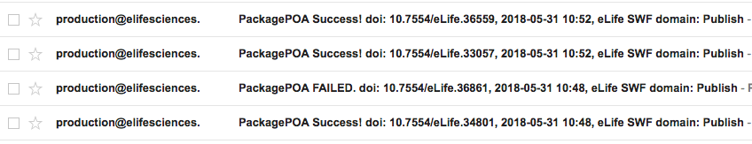

### **Post-acceptance check completed**

This is an automatic email that notifies us when the post-acceptance check has been completed by Editorial Office. This can be closed.

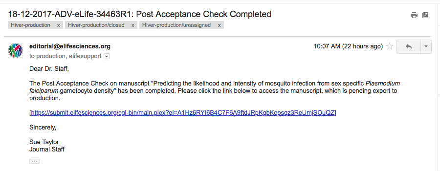

### **Press emails**

Our Press Officer Emily will sometimes email us to ask about publication dates. Often she will cc in Editorial and Features, if the article’s progress is dependent upon post-acceptance checks or a digest. Emily will also cc us in if she asks Sue at Editorial Office to put any recently accepted papers on hold, whilst she looks into potential press for them. There is no action needed for these emails, except to read them and check that there aren’t any issues. Make sure a 'Press' tag is added to any emails about press. 

If a PoA article will receive press coverage, Emily will email Sue to schedule this and cc us in. Add the manuscript number to the [**Production team actions sheet**](https://docs.google.com/document/d/1gWMKdmcl4i7EC_bHvrbpBcUKoXuMQ4WfrVDJ1HxQ0cc/edit?ts=56dd55b5) under the relevant press date section. 

### **Proofing emails and chasers**

Authors receive emails when their proofs are ready to review, and we are cc'd into these. These emails can just be closed. Often the authors will respond to this email with any issues they have, at which point the ‘Author correspondence’ tag would be added, and a response would be required.

Similarly, authors receive another email when their proof is overdue, one at 2 days, and one at 4 days. We are cc'd into these so we can keep track of the progress of the proofs. These can be closed.

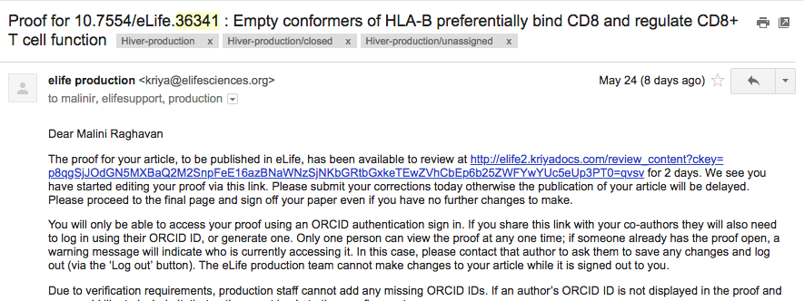

If the proof is still not submitted, we will receive an email asking us to chase the authors manually. Always check that the author has not been in touch before chasing them. If someone is already corresponding with them, then the email can be closed. If not, send a manual chaser email \(there is a [**Hiver template**](interacting-with-authors.md#chaser) for this as well as one for use [**specifically during COVID**](interacting-with-authors.md#covid-chaser)\) and copy in all corresponding authors. If the authors do not reply within 2 working days, first authors should be copied into follow-up chaser emails.

### **PubMed loader report**

Throughout the day we will also receive automated emails when articles are loaded to PubMed \(see [**Pubmed and PMC protcols**](https://docs.google.com/document/d/1nngNI8tmRMgzOBqgO_s-w3dmCEjmwo6iTYjZr1HM5VQ/edit)\). These emails can be closed.

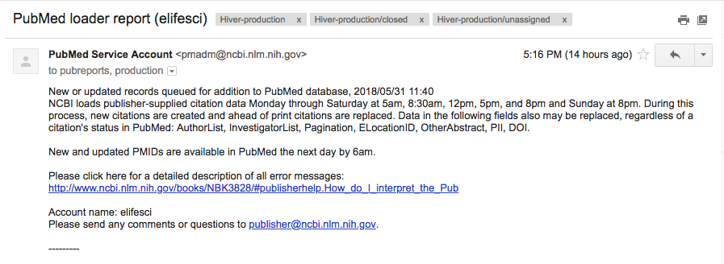

We may also receive emails about articles that have been rejected from PubMed. This will need to be investigated further so raise this in the daily Huddle meeting. 

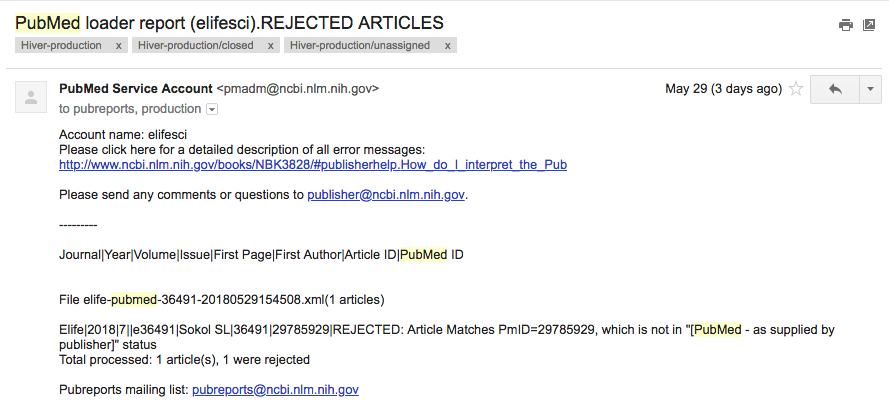

### **Striking images**

Authors will often email us with their ‘Striking images’ to be uploaded. Striking images are images that may be used for the eLife homepage or social media channels. [**See here**](../pages-in-progress/striking-images.md) for how to add striking images to articles. Authors may also refer to these as 'promotional images' or 'graphical abstracts'.

### **Video processing**

Every time an article with videos is sent to Continuum, we receive a processing report from Glencoe, our video hosting site. If all videos are listed underneath the ‘succeeded’ heading, this email can be closed. If any are listed under ‘failed’ this will need to be investigated with Exeter and/or Glencoe.

### **XML notification emails**

This email notifies us that articles have been exported. If they have an ‘0’ on the end, they relate to articles being exported for PoA. These can be closed. If they don’t, they relate to articles being loaded into Kriya. We need to check that it has loaded correctly before closing.

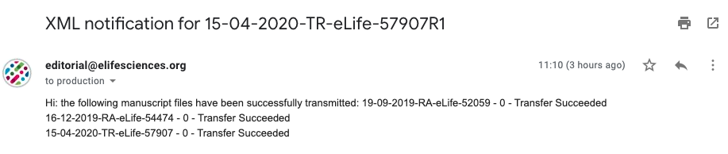

