# Name change requests

## What does this page cover?

When an individual changes their name \(through marriage, by deed-poll, as a result of transitioning to another gender etc.\), they may wish to update the scientific record to ensure that their work can be found under their new name.

eLife aims to allow authors, reviewers and editors to update their names with minimum hassle. This policy can be seen in the [**author guide**](https://submit.elifesciences.org/html/elife_author_instructions.html#policies). Requests to do so will be verified by the Editorial team and then passed on to the Production team, who will update the affected articles.

## Editorial process

### Confirming receipt of name change request, verification and collection of additional information

Editorial will verify the identity of an individual requesting a name change on their own terms. That is, rather than a formal identification requiring legal documentation, identity may be confirmed by checking the email address from which the request came matches their account in the submission system or by receipt of a statement from their supervisor or the corresponding author of their article.

Editorial will also require alternative names and affiliations/email address to ensure that duplicate accounts are not overlooked in the submission system.

The following “Template text – first response” email template will be used to reply to an initial name-change request

> **Template text – Confirmation and verification**
>
> Thank you for your email to notify us of your name change. 
>
> To make sure that we capture all of the papers that need to be updated, we would be grateful if you could provide any past email addresses, affiliations or nicknames that may have been used by yourself, by another author who submitted a manuscript which you co-authored or by a research who may have suggested you as a reviewer. This is to double check that we do not have any duplicate accounts for you in the submission system. We will use this information to search our submission system for any manuscripts that have listed you as an author or that you might have reviewed or edited for eLife. We will then compile a list of published research content for your approval which we can send to our Production Team to update. This list will not include any research content rejected by eLife as your name on these submissions will be automatically updated once we update your profile in our submission system.
>
> \[Include this paragraph only if email address does not match email provided in eJP\]
>
> In addition, as is noted by our name change policy, we require some form of identity verification but this can be an item of your choice, including \(but not limited to\) a letter from your supervisor, an email sent from the email address we have on record, university staff or student identification cards or another form of ID. 
>
> At the end of the process, your name will be corrected in our manuscript management system and in published research content.

### Identifying content that needs to be changed

Once the individual's identity has been verified and they have provided any additional names, emails or affiliations, these can be searched for using the following steps:

* Using the “Find Person” person link on the eJP home page, search for the individual.
* In their profile, under the merge tab, search for the email addresses and any other names they have provided in turn, and merge any duplicate accounts. If you have any uncertainty about whether you are merging the correct individuals, use the list of past affiliations they have provided where possible, and seek clarification from the individual if needed.

Once all the profiles have been merged, collect a list of the manuscripts that they have been involved in so that this information can be verified by the individual and later passed to Production. There is a template email at the end of this section that can be used to compile the list.

* **Author**: Go to the “Pending/Completed Manuscripts” tab and collect a list of all papers that have been accepted and manuscripts that are currently under consideration \(rejected manuscripts will have been updated in the submission system\).
  * For all accepted papers, check whether an Insight article or co-submission has been linked to it. This information can be found on the submission page, in the table of information under the files, in the “Related Manuscript” row.
  * Information to be collected from the published article:
    1. First author
    2. Title
    3. URL to published paper
    4. Corresponding author\(s\) \[to include co-corresponding authors\]
* **Reviewer**: Go to the “Reviews” tab and collect a list of all papers that were reviewed by the individual. 
  * If the manuscript was accepted, please check whether they chose to reveal their identity in the submission system using the “Decision Summary” link on all versions of the manuscript – full and revised submissions. If they did, then this information would be captured in the metadata published online, and should be adjusted by the Production Team.
* **Manuscripts handled as BRE**: Go to the “Monitoring Editor” tab and collect a list of all manuscripts accepted. The editors who handle a manuscript are included in the metadata and should be updated by the Production Team.
* **Manuscripts handled as Senior Editor**: XXX

The list of papers we’ve found associated with the individual should be compiled and run past them to confirm that the manuscripts listed are correct and to see if there is any other content that has been overlooked. Magazine content is not captured in eJP, so we need to ask the individual whether they have been involved in any interviews, podcasts etc.

Clarification is needed about whether we can contact the corresponding authors for each of these changes yet – the individual making the request needs to be alerted to the fact that we will have to tell the corresponding author about any changes.

* Clarification is needed about whether The Individual has changed their preferred pronoun.
* Clarification is needed about whether all versions of the manuscript need to be changed or whether the latest version can just be updated \(the latter will be quicker, but previous name could be found if not all versions are updated\).
* 

> **Template text – confirming content that needs to be changed**
>
> Thank you for providing this additional information \[optional: and verification\], it is greatly appreciated. We have now searched our submission system and found the following published research content associated with your account.
>
> Please can you confirm that these papers are correct and whether any manuscripts are missing that you think should be included. As stated in our previous email, this list is compiled for the use of our Production Team, so it only includes published content – if you are linked to any content that was rejected, your name will be automatically updated when we update your profile in the submission system.
>
> Manuscripts which you are listed as an author:
>
> 1. \[First author\] et al., \[year\]. \[Title\]. Link: \[link to published paper\] Corresponding author\(s\): \[name\]
> 2. \[First author\] et al., \[year\]. \[Title\]. Link: \[link to published paper\] Corresponding author\(s\): \[name\]
> 3. \[First author\] et al., \[year\]. \[Title\]. Link: \[link to published paper\] Corresponding author\(s\): \[name\]
>
> Manuscripts that you reviewed and chose to reveal your identity:
>
> 1. \[First author\] et al., \[year\]. \[Title\]. Link: \[link to published paper – this should be to the section where their identity is revealed\]
> 2. \[First author\] et al., \[year\]. \[Title\]. Link: \[link to published paper – this should be to the section where their identity is revealed\]
>
> Manuscripts that you have handled as editor:
>
> 1. \[First author\] et al., \[year\]. \[Title\]. Link: \[link to published paper – this should be to the section where their identity is revealed\]
>
> For the articles which you have authored, we will need to contact the corresponding author of each paper to notify them that you have requested a change to your name. With that in mind, we wanted to confirm whether you have already notified the corresponding author\(s\) of this change and, if not, whether you would like to do so before we contact them.
>
> For all articles, we would be grateful if you could let us know whether you would like to update all versions of the manuscript, or whether just updating the latest version would be sufficient. Only updating the latest version will be a lot quicker, but in this case the earlier versions of the manuscript are still discoverable and would display your non-preferred name. 
>
> In addition, eLife has magazine content which is not accessible via the submission system, such as interviews and podcasts. Please let us know if you have been interviewed for any eLife magazine content and I can forward that information to ??? They can then update any written information on your behalf \(although we are unable to edit the audio content of the podcasts\).
>
> We also wanted to check whether your preferred pronoun has changed and, if so, what this should be updated to. For research content, we will use this information to check and update the Acknowledgements section and any Competing Interests statements, but we will not be able to update pronoun use within the article itself. For magazine content, ???

### Processing name changes

1. Once the individual has indicated that they are happy for the corresponding author\(s\) to be contacted, email the corresponding author\(s\) to let them know.

> **Template text – notifying corresponding authors**
>
> This is an email to notify you that we have received a name change request from …

1. 1. 2. \[Can occur in parallel with 3a\] Update the individual’s eJP account to their preferred name.
      1. Step-by-step instructions  
   3. \[Must wait for completion of 3a\] Based on the list of papers compiled by us and approved by the individual, compile list of research content \(authored, reviewed, edited articles\) to send to the Production Team \([production@elifesciences.org](mailto:production@elifesciences.org)\). 

  

> **Template text – forwarding content to Production**
>
> We have received a request for a name change – \[previous name\] should be updated to \[preferred name\] in the following content:  
>
>
> Authored articles: 
>
> Manuscript ID 1
>
> Manuscript ID 2
>
> Reviewed articles:
>
> Manuscript ID 3
>
> Edited articles:
>
> Manuscript ID 4
>
> Magazine content:
>
> \[link\]
>
> \[link\]  
>
>
> \[Name\] has requested that the content be updated in all versions of the manuscript. / \[Name\] has indicated that they are happy for only the latest version of the manuscript to be updated. \[delete as appropriate\]  
> \[Name\] has requested that, where possible, their pronouns should be updated to \[preferred pronouns\]. / \[Name\] has not requested a change to their pronouns. \[delete as appropriate\]

## Production process

Once the name change request has been verified by the Editorial team, they will supply a list of the affected content to the Production team. It will be Production's responsibility to ensure that all versions of this content are updated with the individual's new name. This will cover the following:

* The current version of the article
* Any pending versions of the article \(VoR, new versions\) in the proofing system
* Any previously published versions \(PoA, VoR\)
* Any related content such as Insights, Corrections or co-submissions

### Updating the current version of the article

The current version of each affected article should be silently corrected following the normal process. The individual's name should be changed in the following places where applicable:

* Article metadata:
  * author list or peer review details
  * author contributions
  * competing interests
  * funding table \(should correct automatically\)
  * funding statement
  * data availability statement
* Article content:
  * digest
  * acknowledgements
  * decision letter
  * author response
  * any author lists given in additional files \(supplementary files, source data, source code etc\)

In cases where the individual's pronouns have changed in addition to their name, the following sections should be checked and updated if necessary:

* competing interests
* funding statement
* acknowledgments

For Insight articles and co-submissions, the following will also need to be corrected where applicable:

* key info box details for the related article \(in Insights\)
* mentions of the first author\(s\) in the text \(if applicable\)
* entry for related article in the reference list

If the article has been published as a Version of Record, the changes can be made in the proofing system following the normal silent correction process and once signed off, the updated article will overwrite the latest published version. If this was the only version of the article ever published by eLife, this is the end of the name-change process.

If the article has only been published as an accepted article, the PoA version should be silently corrected following the same process described [**below**](name-change-requests.md#updating-old-versions-in-the-archive) for old versions. The pending VoR proof should then be updated \(see next section\). Once again, if this is the only version of the article published at the point the name-change request is received, this is the end of the process.

### Updating a pending version of the article

If the Version of Record for the affected article is still in production, the author or reviewer details should be updated via the proofing system. This should ideally be done as soon as possible; however, if the article is still being processed \(pre-editing, copy-editing\), the content processor should be asked to make the change. This request can be sent via email or slack, as appropriate.

In this case, once the PoA version\(s\) have been updated and the VoR proof has been corrected, no further action should be required.

### Updating old versions in the archive

All previous versions of an article in which a name is being changed should be updated to match the current version. This cannot be done through the proofing system interface, as this only allow updates to the latest version of the article.

To identify previously published versions of the affected article\(s\), go to the `elife-publishing-archive` bucket in the eLife Amazon Web Services \(AWS\). If a user searches for a published article, they will see zip packages for each PoA and VoR version that has been issued.

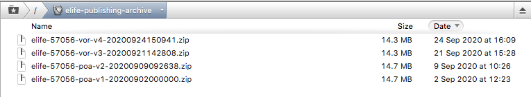

To silently correct these, the first step is to download all packages prior to the current \(most recent\) version. So, for example, in the above case, there would be three packages to correct:

* 2 PoA versions
  * elife-57056-poa-v1-20200902000000.zip
  * elife-57056-poa-v2-20200909092638.zip
* 1 VoR versions
  * elife-57056-vor-v3-20200921142808.zip

In the event that a reviewer or senior editor name needs to be updated, only the version of record \(VoR\) packages will need to be edited. If, however, an author or reviewing editor name is to be changed, all versions will need to be corrected.

As [**above**](name-change-requests.md#updating-the-current-version-of-the-article), the affected name will need to be edited in all places it occurs in the article. 

* The XML will need to be updated manually to correct all occurrences of the author/reviewer name. This can be done in Oxygen by the Production team.

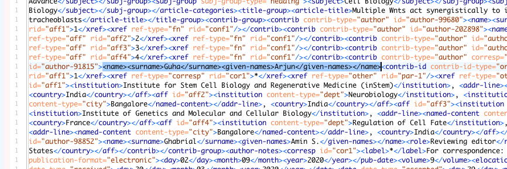

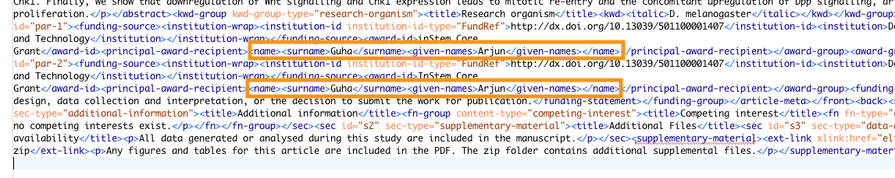

* PoA PDFs should be edited in Adobe by the Production team.

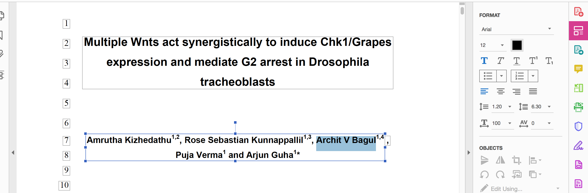

* VoR PDFs \(article PDF, figures PDF if affected\) will need to go to the content processor to be updated. The following is a suggested email template for requesting changes:

> REQUEST: Name change in previous versions of XXXXX  
>   
> Please update all occurrences Name One to Name Two in the attached PDF\(s\). The name appears in \[DELETE AS APPLICABLE\]:
>
> * author list/peer review details
> * author contributions
> * competing interests
> * funding table
> * funding statement
> * data statement
> * key info box
> * text "xxxxx . . . "
> * reference\(s\) XXXX et al., XXXX . . .
> * acknowledgements
> * decision letter
> * author response
>
> Please ensure that the corresponding initials are corrected where applicable.
>
> \[INCLUDE IF REQUIRED\] Please also correct the following instances of _Pronoun 1_ to _Pronoun 2_:
>
> * Text to be corrected
> * Text to be corrected
> * . . .

Once the XML and PDF files have been corrected, each version's ZIP package should be recreated and named using the **exact same filename** that was initially downloaded.


The filename for the silent correction **MUST** match the targeted version in the archive folder. Do not, under any circumstances, use a generic filename such as elife-57056-poa-r1.zip. This will create erroneous versions of the article and require developer intervention to fix.


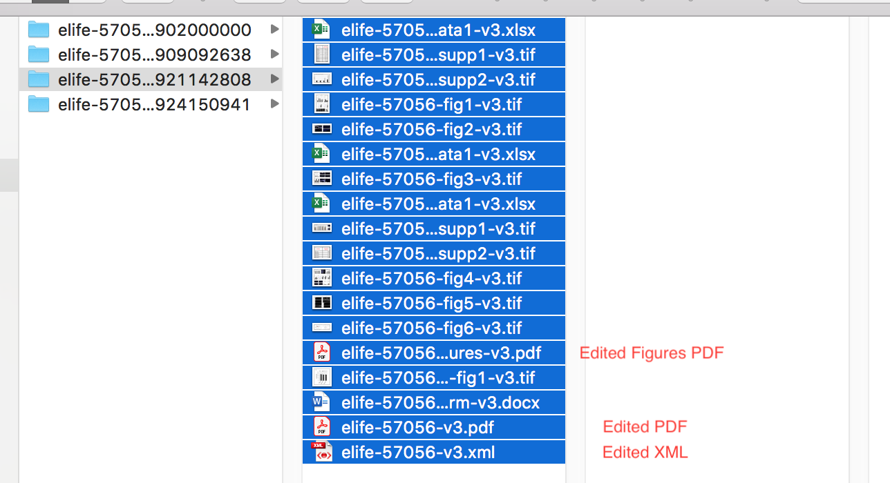

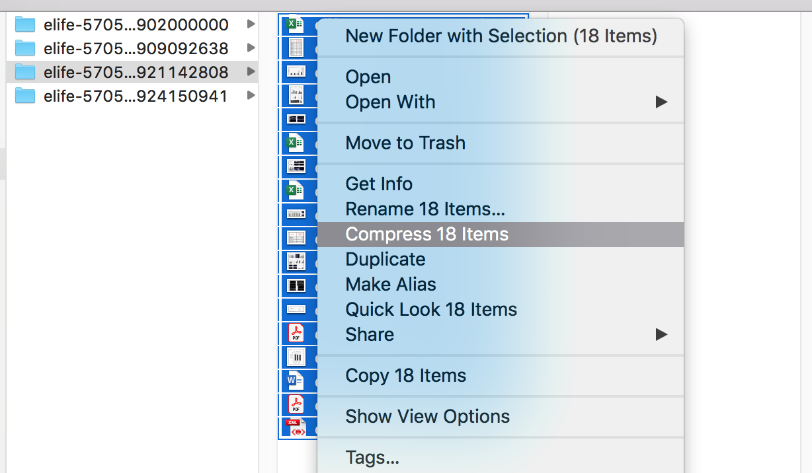

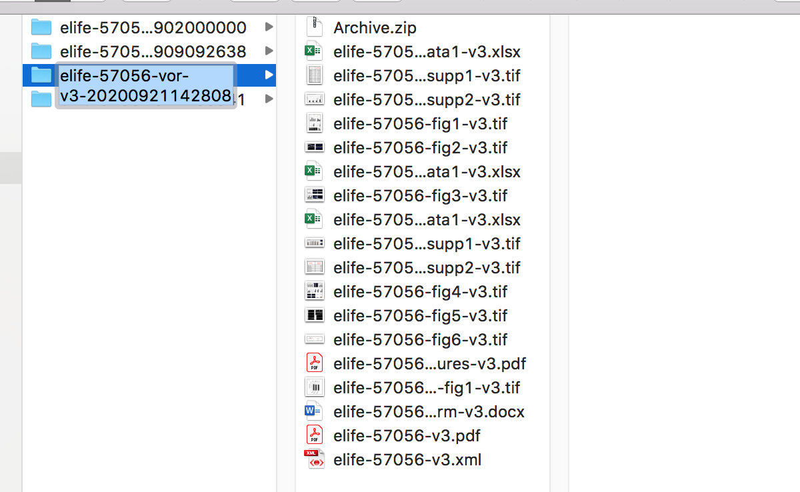

These should then be loaded into the AWS silent correction bucket \(`prod-elife-silent-corrections`\).

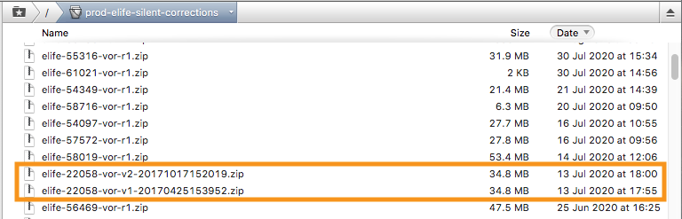

It will take a few minutes for each online version to update once the silent corrections have been uploaded. Any errors in processing the articles will appear on the Continuum dashboard as per normal.

### Downstream delivery

When the latest version of an article is silently corrected, the article will be redelivered to the following downstream endpoints, so these will be automatically updated with the new name:

* \*\*\*\*[**CrossRef**](https://www.crossref.org/) \(DOI registration\)
* \*\*\*\*[**PubMed Central**](https://www.ncbi.nlm.nih.gov/pmc/) \(full-text indexing service\)
* \*\*\*\*[**CLOCKSS**](https://clockss.org/) \(the dark archive used to preserve eLife publications in case the journal folds\)

The following endpoints will need to manually updated with the new name:

* [**PubMed**](https://www.ncbi.nlm.nih.gov/pubmed/management) \(abstract indexing service\)
* [**CrossRef**](https://www.crossref.org/) \(if Decision/Response DOIs were registered using old sub-article structure, see **below**\)

We will not be resupplying the article to any other endpoints. With regards to Google Scholar, this runs on a periodic \(six-monthly\) update schedule and so should update eventually, but we have no control over this.

#### Updating old decision/response sub-DOIs

If an article was published prior to the retirement of sub-DOIs in eLife articles, its decision letter and author response sections will have been delivered to CrossRef with DOIs such as 10.7554/eLife.12345.013 and 10.7554/eLife.12345.014. When the article is silently corrected, the decision and response will be redelivered to CrossRef under new sub-article DOIs \(e.g. 10.7554/eLife.12345.sa1, 10.7554/eLife.12345.sa2\) but this will not overwrite the original records.

This means that when changing an author's name, the uncorrected author list will remain in CrossRef under the original author response sub-DOI. Similarly, if an editor's name is changing, the previous details will remain listed under the original decision letter sub-DOI.

To correct this, go to the [**CrossRef administration page**](https://doi.crossref.org/servlet/useragent?func=showHome) and log in. From there, go to 'Submission Administration'. In order to locate the record that needs correcting, you will need the date on which it was submitted. Search the article number in the Production inbox and find the email showing the deposition of peer review materials:

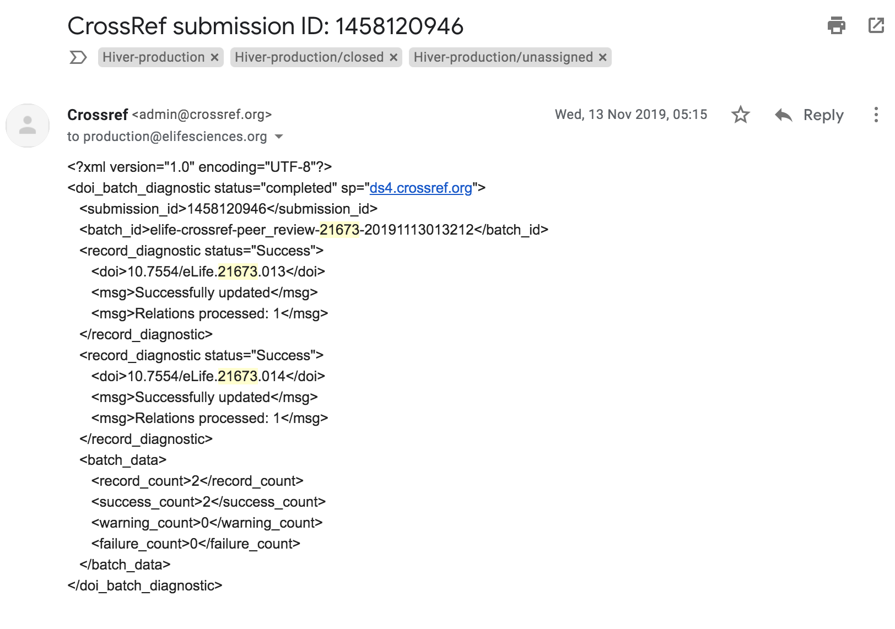

Enter the date this email was received into the search function in CrossRef. This will return all the CrossRef submissions for that day.

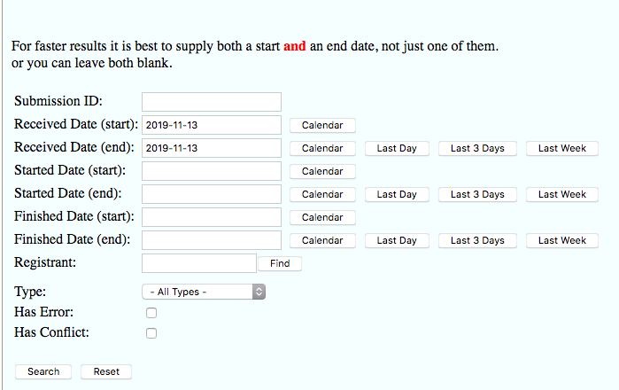

You will then need to search through the results to locate the article in question.


To save time, go to the second page of results and edit the URL to increase the number of results per page. This will allow a quick search for the required article.


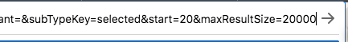

The required file will be prefixed 'elife-crossref-peer\_review-', followed by the article number.

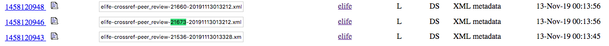

Download the corresponding XML file via the normal procedure for getting CrossRef XML and then rename it with a different timestamp, e.g. changing "elife-crossref-peer\_review-21673-20191113013212.xml" to "elife-crossref-peer\_review-21673-20210105183000.xml. Remember to set the timestamp at least half and hour in advance of the current time to avoid it being rejected when the edited file is uploaded.

You will then need to open the XML and edit the doi batch ID timestamp to match the new filename:

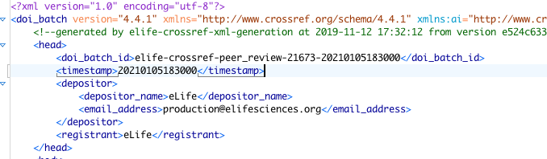

Once this is done, edit the editor or author details as required. Save the XML and navigate to the 'Upload' option in CrossRef. Upload the revised decision/response XML; it should process within five minutes of being resupplied.

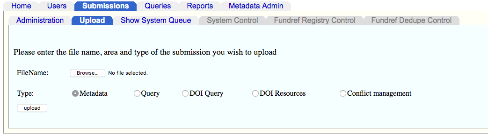

This will correct the metadata associated with the original sub-DOIs, but it may take a few days for the corrected author list\(s\) to show in a [**CrossRef search**](https://search.crossref.org/?from_ui=&q=).

### Annotation to indicate a name change

Following an update to change an author, editor or reviewer's name, an annotation should be added to the latest version of the article to indicate that such a change has taken place. Please use the following text:

> This article has been updated in response to a name-change request.

## Blogposts and other non-article content

In addition to updating article content, changes may be required in non-article content such as blogposts on the eLife website.

Where this is the case, the details of the change to be made and the affected content should be shared directly with Anja, as Marketing Assistant \(via email [a.stares@elifesciences.org](mailto:a.stares@elifesciences.org) or Slack\). Anja will make the changes and confirm with the Production team once they had been made.

If Anja isn’t available, the [comms@elifesciences.org](mailto:comms@elifesciences.org) address can be used to find someone else in the team who can help with a request. However please note that this is a mailing group rather than a dedicated account, so it should not be used to share the specific details of the request. These should be passed along once an alternative member of the Comms team has been identified. This is to limit the number of people who have access/records of the sensitive information.

## Post-change actions

Once the change has been implemented, Editorial will confirm this with the person who made the intial request.

